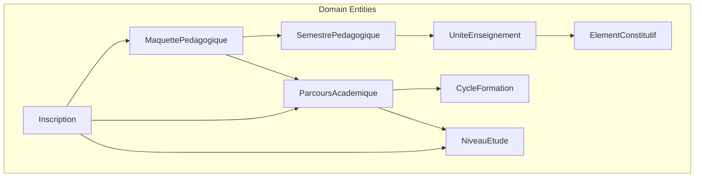
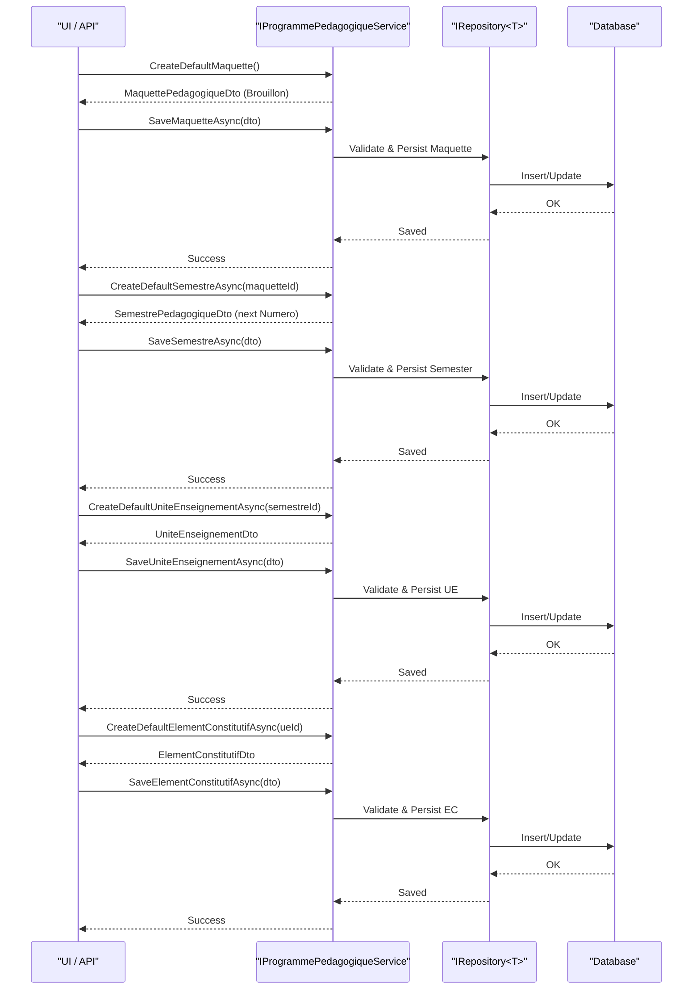
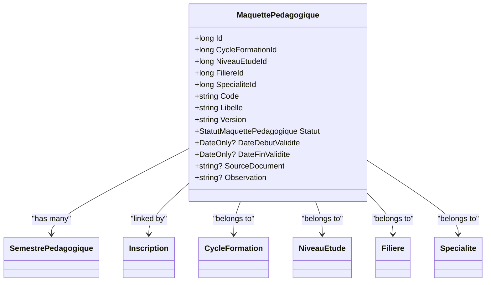
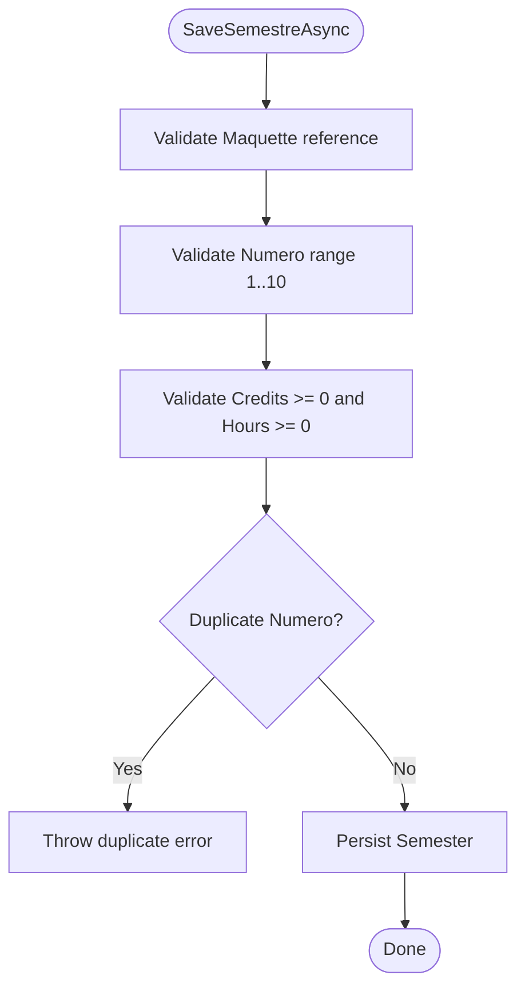
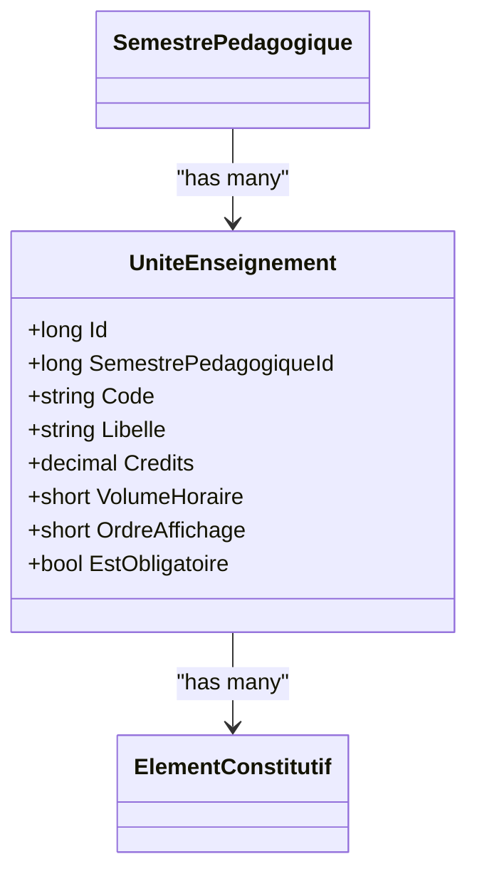
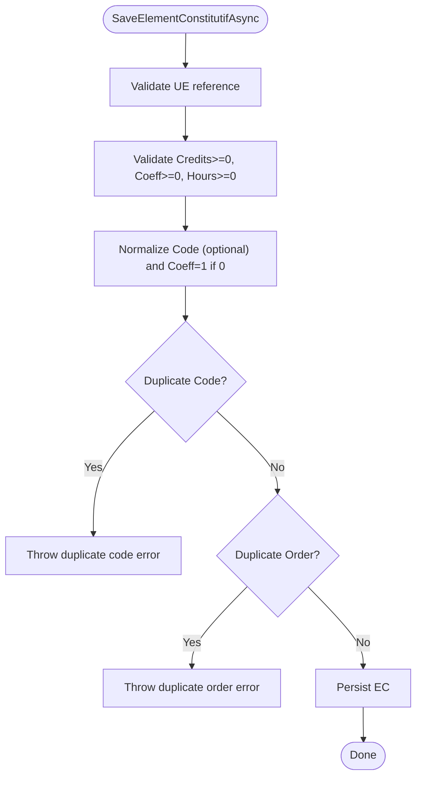
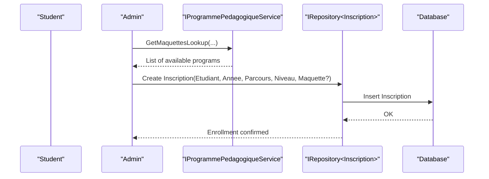
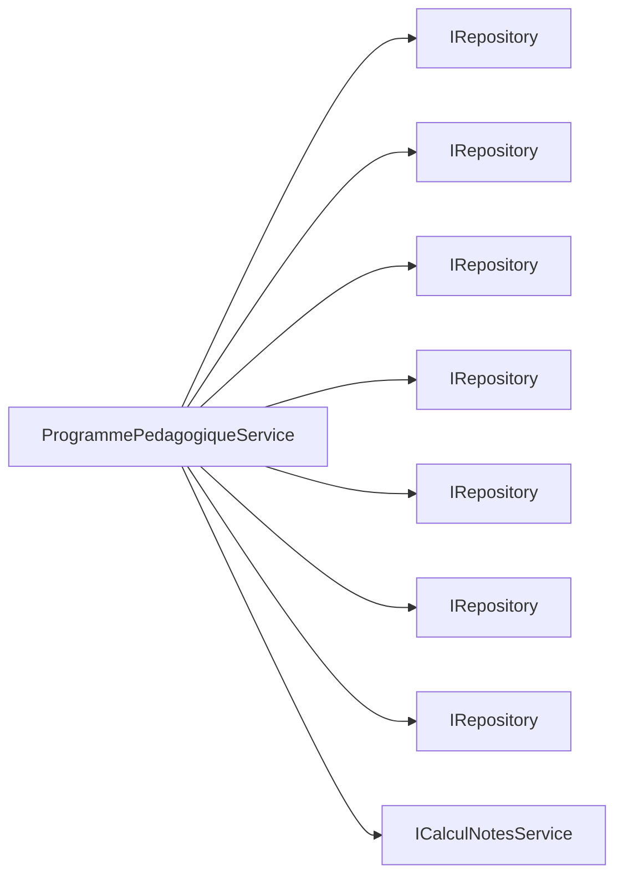

# Academic Programs

<cite>
**Referenced Files in This Document**
- [MaquettePedagogique.cs](file://RIIS.Academic.Domain/Programmes/MaquettePedagogique.cs)
- [StatutMaquettePedagogique.cs](file://RIIS.Academic.Domain/Enums/StatutMaquettePedagogique.cs)
- [SemestrePedagogique.cs](file://RIIS.Academic.Domain/Programmes/SemestrePedagogique.cs)
- [UniteEnseignement.cs](file://RIIS.Academic.Domain/Programmes/UniteEnseignement.cs)
- [ElementConstitutif.cs](file://RIIS.Academic.Domain/Programmes/ElementConstitutif.cs)
- [TypeElementConstitutif.cs](file://RIIS.Academic.Domain/Enums/TypeElementConstitutif.cs)
- [ParcoursAcademique.cs](file://RIIS.Academic.Domain/Parcours/ParcoursAcademique.cs)
- [CycleFormation.cs](file://RIIS.Academic.Domain/Referentiels/CycleFormation.cs)
- [NiveauEtude.cs](file://RIIS.Academic.Domain/Referentiels/NiveauEtude.cs)
- [Inscription.cs](file://RIIS.Academic.Domain/Inscriptions/Inscription.cs)
- [IProgrammePedagogiqueService.cs](file://RIIS.Academic.Application/Programmes/Services/IProgrammePedagogiqueService.cs)
- [ProgrammePedagogiqueService.cs](file://RIIS.Academic.Application/Programmes/Services/ProgrammePedagogiqueService.cs)
- [ICalculNotesService.cs](file://RIIS.Academic.Application/Abstractions/Services/ICalculNotesService.cs)
</cite>

## Table of Contents
1. Introduction
2. Project Structure
3. Core Components
4. Architecture Overview
5. Detailed Component Analysis
6. Dependency Analysis
7. Performance Considerations
8. Troubleshooting Guide
9. Conclusion

## Introduction
This document explains the academic program hierarchy and structure centered on the MaquettePedagogique (program blueprint). It details how semesters, course units, and constituent elements are organized, how statuses are managed, and how validation rules and credit calculations maintain academic integrity. It also provides practical workflows for creating programs, assigning semesters, and enrolling students.

## Project Structure
The program model is implemented across domain entities and application services:
- Domain layer defines the core entities and enumerations that represent the academic structure.
- Application layer exposes services to create, validate, save, and query the program hierarchy.
- Referential entities (cycle, level, path) provide context for program versions and enrollment.

**Diagram sources**
- [MaquettePedagogique.cs:5-30](file://RIIS.Academic.Domain/Programmes/MaquettePedagogique.cs#L5-L30)
- [SemestrePedagogique.cs:3-19](file://RIIS.Academic.Domain/Programmes/SemestrePedagogique.cs#L3-L19)
- [UniteEnseignement.cs:3-17](file://RIIS.Academic.Domain/Programmes/UniteEnseignement.cs#L3-L17)
- [ElementConstitutif.cs:3-20](file://RIIS.Academic.Domain/Programmes/ElementConstitutif.cs#L3-L20)
- [ParcoursAcademique.cs:3-23](file://RIIS.Academic.Domain/Parcours/ParcoursAcademique.cs#L3-L23)
- [CycleFormation.cs:3-12](file://RIIS.Academic.Domain/Referentiels/CycleFormation.cs#L3-L12)
- [NiveauEtude.cs:3-13](file://RIIS.Academic.Domain/Referentiels/NiveauEtude.cs#L3-L13)
- [Inscription.cs:3-36](file://RIIS.Academic.Domain/Inscriptions/Inscription.cs#L3-L36)

**Section sources**
- [MaquettePedagogique.cs:5-30](file://RIIS.Academic.Domain/Programmes/MaquettePedagogique.cs#L5-L30)
- [SemestrePedagogique.cs:3-19](file://RIIS.Academic.Domain/Programmes/SemestrePedagogique.cs#L3-L19)
- [UniteEnseignement.cs:3-17](file://RIIS.Academic.Domain/Programmes/UniteEnseignement.cs#L3-L17)
- [ElementConstitutif.cs:3-20](file://RIIS.Academic.Domain/Programmes/ElementConstitutif.cs#L3-L20)
- [ParcoursAcademique.cs:3-23](file://RIIS.Academic.Domain/Parcours/ParcoursAcademique.cs#L3-L23)
- [CycleFormation.cs:3-12](file://RIIS.Academic.Domain/Referentiels/CycleFormation.cs#L3-L12)
- [NiveauEtude.cs:3-13](file://RIIS.Academic.Domain/Referentiels/NiveauEtude.cs#L3-L13)
- [Inscription.cs:3-36](file://RIIS.Academic.Domain/Inscriptions/Inscription.cs#L3-L36)

## Core Components
- MaquettePedagogique: Root entity representing a program blueprint with code, label, version, validity dates, status, and references to cycle, level, field, and specialty. It owns multiple SemestrePedagogique entries and links to student enrollments.
- StatutMaquettePedagogique: Enumerates lifecycle states (draft, active, archived) used to control visibility and usage of program versions.
- SemestrePedagogique: Represents a semester within a program, including expected credits and teaching hours, and contains multiple UnitesEnseignement.
- UniteEnseignement: A course unit within a semester, with credits, teaching hours, ordering, and mandatory flag; it aggregates constituent elements.
- ElementConstitutif: The smallest measurable unit (e.g., lecture, project, internship), with type, credits, coefficient, teaching hours, ordering, and mandatory flag.

Key relationships:
- MaquettePedagogique has many SemestrePedagogique.
- SemestrePedagogique has many UniteEnseignement.
- UniteEnseignement has many ElementConstitutif.
- Inscription links a student to a specific MaquettePedagogique and ParcoursAcademique/NiveauEtude.

Validation and integrity highlights:
- Program uniqueness enforced by code + version per parcours (cycle/level/field/specialty).
- Semester number uniqueness per program.
- Course unit code uniqueness per semester.
- Constituent element code uniqueness per course unit when provided; ordering uniqueness per course unit.
- Positive constraints on credits, coefficients, and teaching hours.
- Validity date ordering enforced (end date must be greater than or equal to start date).

Credit calculation integration:
- Credit acquisition for constituent elements is computed via an external service, enabling consistent grading and progression logic downstream.

**Section sources**
- [MaquettePedagogique.cs:5-30](file://RIIS.Academic.Domain/Programmes/MaquettePedagogique.cs#L5-L30)
- [StatutMaquettePedagogique.cs:3-8](file://RIIS.Academic.Domain/Enums/StatutMaquettePedagogique.cs#L3-L8)
- [SemestrePedagogique.cs:3-19](file://RIIS.Academic.Domain/Programmes/SemestrePedagogique.cs#L3-L19)
- [UniteEnseignement.cs:3-17](file://RIIS.Academic.Domain/Programmes/UniteEnseignement.cs#L3-L17)
- [ElementConstitutif.cs:3-20](file://RIIS.Academic.Domain/Programmes/ElementConstitutif.cs#L3-L20)
- [TypeElementConstitutif.cs:3-10](file://RIIS.Academic.Domain/Enums/TypeElementConstitutif.cs#L3-L10)
- [Inscription.cs:3-36](file://RIIS.Academic.Domain/Inscriptions/Inscription.cs#L3-L36)
- [ProgrammePedagogiqueService.cs:151-226](file://RIIS.Academic.Application/Programmes/Services/ProgrammePedagogiqueService.cs#L151-L226)
- [ProgrammePedagogiqueService.cs:290-352](file://RIIS.Academic.Application/Programmes/Services/ProgrammePedagogiqueService.cs#L290-L352)
- [ProgrammePedagogiqueService.cs:518-574](file://RIIS.Academic.Application/Programmes/Services/ProgrammePedagogiqueService.cs#L518-L574)
- [ProgrammePedagogiqueService.cs:634-712](file://RIIS.Academic.Application/Programmes/Services/ProgrammePedagogiqueService.cs#L634-L712)
- [ICalculNotesService.cs:6-11](file://RIIS.Academic.Application/Abstractions/Services/ICalculNotesService.cs#L6-L11)

## Architecture Overview
The system follows a layered architecture:
- Domain layer models the academic structure and business invariants.
- Application layer orchestrates operations through IProgrammePedagogiqueService, enforcing validation and persistence via repositories.
- Referential data (cycles, levels, paths) contextualize programs and enrollments.

**Diagram sources**
- [IProgrammePedagogiqueService.cs:6-64](file://RIIS.Academic.Application/Programmes/Services/IProgrammePedagogiqueService.cs#L6-L64)
- [ProgrammePedagogiqueService.cs:143-226](file://RIIS.Academic.Application/Programmes/Services/ProgrammePedagogiqueService.cs#L143-L226)
- [ProgrammePedagogiqueService.cs:269-352](file://RIIS.Academic.Application/Programmes/Services/ProgrammePedagogiqueService.cs#L269-L352)
- [ProgrammePedagogiqueService.cs:499-574](file://RIIS.Academic.Application/Programmes/Services/ProgrammePedagogiqueService.cs#L499-L574)
- [ProgrammePedagogiqueService.cs:613-712](file://RIIS.Academic.Application/Programmes/Services/ProgrammePedagogiqueService.cs#L613-L712)

## Detailed Component Analysis

### MaquettePedagogique (Program Blueprint)
- Purpose: Root of the academic program, tying together cycle, level, field, specialty, and versioned content.
- Status management: Uses StatutMaquettePedagogique to move between draft, active, and archived states.
- Validation rules:
  - Required fields: code, label, version.
  - Version normalized to uppercase.
  - Validity dates must be ordered correctly.
  - Uniqueness: same code + version cannot exist for the same parcours combination.
- Relationships:
  - One-to-many with SemestrePedagogique.
  - Many-to-one with CycleFormation, NiveauEtude, Filiere, Specialite.
  - Links to Inscriptions for student enrollment.

**Diagram sources**
- [MaquettePedagogique.cs:5-30](file://RIIS.Academic.Domain/Programmes/MaquettePedagogique.cs#L5-L30)
- [StatutMaquettePedagogique.cs:3-8](file://RIIS.Academic.Domain/Enums/StatutMaquettePedagogique.cs#L3-L8)

**Section sources**
- [MaquettePedagogique.cs:5-30](file://RIIS.Academic.Domain/Programmes/MaquettePedagogique.cs#L5-L30)
- [StatutMaquettePedagogique.cs:3-8](file://RIIS.Academic.Domain/Enums/StatutMaquettePedagogique.cs#L3-L8)
- [ProgrammePedagogiqueService.cs:151-226](file://RIIS.Academic.Application/Programmes/Services/ProgrammePedagogiqueService.cs#L151-L226)

### SemestrePedagogique (Semester)
- Purpose: Groups course units within a program, specifying expected credits and teaching hours.
- Validation rules:
  - Semester number must be between 1 and 10.
  - Credits and teaching hours must be non-negative.
  - Unique semester number per program.
- Relationships:
  - Belongs to one MaquettePedagogique.
  - Contains many UniteEnseignement.
  - Optional link to NiveauEtude for level-specific semantics.

**Diagram sources**
- [ProgrammePedagogiqueService.cs:290-352](file://RIIS.Academic.Application/Programmes/Services/ProgrammePedagogiqueService.cs#L290-L352)
- [SemestrePedagogique.cs:3-19](file://RIIS.Academic.Domain/Programmes/SemestrePedagogique.cs#L3-L19)

**Section sources**
- [SemestrePedagogique.cs:3-19](file://RIIS.Academic.Domain/Programmes/SemestrePedagogique.cs#L3-L19)
- [ProgrammePedagogiqueService.cs:269-352](file://RIIS.Academic.Application/Programmes/Services/ProgrammePedagogiqueService.cs#L269-L352)

### UniteEnseignement (Course Unit)
- Purpose: Represents a course within a semester, with credits, teaching hours, ordering, and mandatory flag.
- Validation rules:
  - Code unique per semester.
  - Credits and teaching hours must be non-negative.
  - Label required.
- Relationships:
  - Belongs to one SemestrePedagogique.
  - Contains many ElementConstitutif.

**Diagram sources**
- [SemestrePedagogique.cs:3-19](file://RIIS.Academic.Domain/Programmes/SemestrePedagogique.cs#L3-L19)
- [UniteEnseignement.cs:3-17](file://RIIS.Academic.Domain/Programmes/UniteEnseignement.cs#L3-L17)
- [ElementConstitutif.cs:3-20](file://RIIS.Academic.Domain/Programmes/ElementConstitutif.cs#L3-L20)

**Section sources**
- [UniteEnseignement.cs:3-17](file://RIIS.Academic.Domain/Programmes/UniteEnseignement.cs#L3-L17)
- [ProgrammePedagogiqueService.cs:499-574](file://RIIS.Academic.Application/Programmes/Services/ProgrammePedagogiqueService.cs#L499-L574)

### ElementConstitutif (Constituent Element)
- Purpose: Atomic learning component (lecture, project, internship, etc.) with credits, coefficient, teaching hours, ordering, and mandatory flag.
- Validation rules:
  - Coefficient defaults to 1 if zero.
  - Credits, coefficient, and teaching hours must be non-negative.
  - If code provided, must be unique within the course unit.
  - Ordering must be unique within the course unit.
- Relationships:
  - Belongs to one UniteEnseignement.
  - Used in evaluations and results.

**Diagram sources**
- [ProgrammePedagogiqueService.cs:634-712](file://RIIS.Academic.Application/Programmes/Services/ProgrammePedagogiqueService.cs#L634-L712)
- [ElementConstitutif.cs:3-20](file://RIIS.Academic.Domain/Programmes/ElementConstitutif.cs#L3-L20)
- [TypeElementConstitutif.cs:3-10](file://RIIS.Academic.Domain/Enums/TypeElementConstitutif.cs#L3-L10)

**Section sources**
- [ElementConstitutif.cs:3-20](file://RIIS.Academic.Domain/Programmes/ElementConstitutif.cs#L3-L20)
- [TypeElementConstitutif.cs:3-10](file://RIIS.Academic.Domain/Enums/TypeElementConstitutif.cs#L3-L10)
- [ProgrammePedagogiqueService.cs:613-712](file://RIIS.Academic.Application/Programmes/Services/ProgrammePedagogiqueService.cs#L613-L712)

### Enrollment Workflow (Student to Program)
- Students enroll into a program via Inscription, linking to AnneeAcademique, Etudiant, ParcoursAcademique, NiveauEtude, and optionally MaquettePedagogique and ClassePedagogique.
- This enables tracking which program version a student follows and supports downstream result computation.

**Diagram sources**
- [Inscription.cs:3-36](file://RIIS.Academic.Domain/Inscriptions/Inscription.cs#L3-L36)
- [IProgrammePedagogiqueService.cs:49-64](file://RIIS.Academic.Application/Programmes/Services/IProgrammePedagogiqueService.cs#L49-L64)

**Section sources**
- [Inscription.cs:3-36](file://RIIS.Academic.Domain/Inscriptions/Inscription.cs#L3-L36)
- [IProgrammePedagogiqueService.cs:49-64](file://RIIS.Academic.Application/Programmes/Services/IProgrammePedagogiqueService.cs#L49-L64)

## Dependency Analysis
- Cohesion: Each entity encapsulates its own attributes and relationships, keeping domain logic close to the model.
- Coupling: Services depend on repository abstractions, decoupling persistence from business logic.
- External dependencies:
  - Referential entities (CycleFormation, NiveauEtude, ParcoursAcademique) provide context for programs and enrollments.
  - Grading and credit calculation rely on ICalculNotesService for consistent outcomes.

**Diagram sources**
- [ProgrammePedagogiqueService.cs:8-17](file://RIIS.Academic.Application/Programmes/Services/ProgrammePedagogiqueService.cs#L8-L17)
- [ICalculNotesService.cs:6-11](file://RIIS.Academic.Application/Abstractions/Services/ICalculNotesService.cs#L6-L11)

**Section sources**
- [ProgrammePedagogiqueService.cs:8-17](file://RIIS.Academic.Application/Programmes/Services/ProgrammePedagogiqueService.cs#L8-L17)
- [ICalculNotesService.cs:6-11](file://RIIS.Academic.Application/Abstractions/Services/ICalculNotesService.cs#L6-L11)

## Performance Considerations
- Hierarchy queries load all related entities into memory and filter client-side; consider pagination or server-side filtering for large datasets.
- Duplicate checks iterate over full lists; ensure indexes on foreign keys and unique constraints at the database level to avoid performance bottlenecks.
- Use lookup endpoints to minimize payload size when populating dropdowns.

[No sources needed since this section provides general guidance]

## Troubleshooting Guide
Common validation errors and their causes:
- Invalid program versioning: Ensure code and version are unique for the selected parcours combination.
- Invalid semester numbering: Keep numbers between 1 and 10 and unique per program.
- Duplicate course unit codes: Avoid reusing codes within the same semester.
- Duplicate constituent element codes or orders: Ensure uniqueness within each course unit.
- Negative values: Credits, coefficients, and teaching hours must be non-negative.
- Invalid validity dates: End date must be greater than or equal to start date.

Resolution steps:
- Review DTO values before saving.
- Use lookup endpoints to verify referenced entities exist.
- Correct duplicates by adjusting codes or ordering.
- Adjust dates to satisfy ordering constraints.

**Section sources**
- [ProgrammePedagogiqueService.cs:151-226](file://RIIS.Academic.Application/Programmes/Services/ProgrammePedagogiqueService.cs#L151-L226)
- [ProgrammePedagogiqueService.cs:290-352](file://RIIS.Academic.Application/Programmes/Services/ProgrammePedagogiqueService.cs#L290-L352)
- [ProgrammePedagogiqueService.cs:518-574](file://RIIS.Academic.Application/Programmes/Services/ProgrammePedagogiqueService.cs#L518-L574)
- [ProgrammePedagogiqueService.cs:634-712](file://RIIS.Academic.Application/Programmes/Services/ProgrammePedagogiqueService.cs#L634-L712)

## Conclusion
The academic program hierarchy is anchored by MaquettePedagogique and structured through SemestrePedagogique, UniteEnseignement, and ElementConstitutif. Robust validation ensures data integrity, while referential entities and enrollment records connect programs to students and academic years. Credit calculations integrate with grading services to support consistent academic outcomes. Following the documented workflows and validation rules will help maintain academic integrity across the program lifecycle.

[No sources needed since this section summarizes without analyzing specific files]