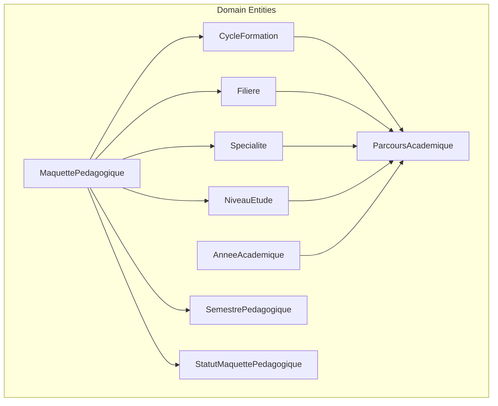
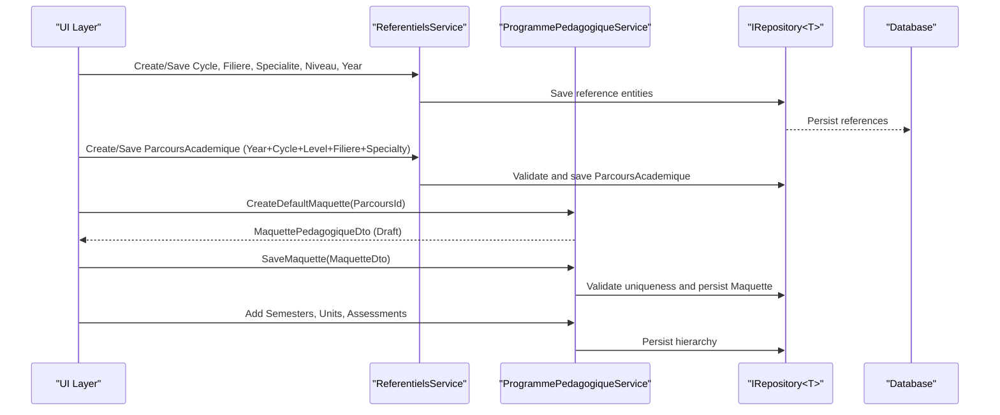
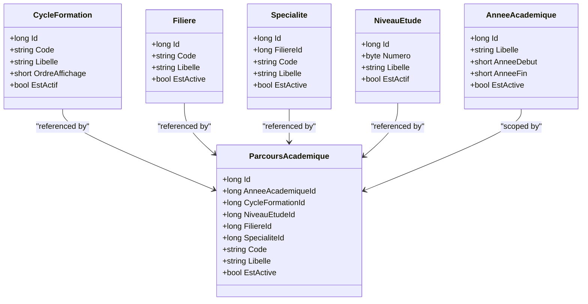
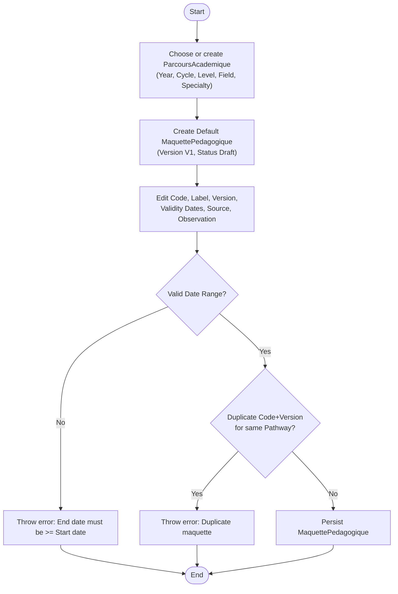
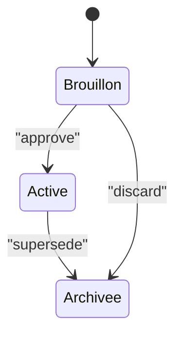
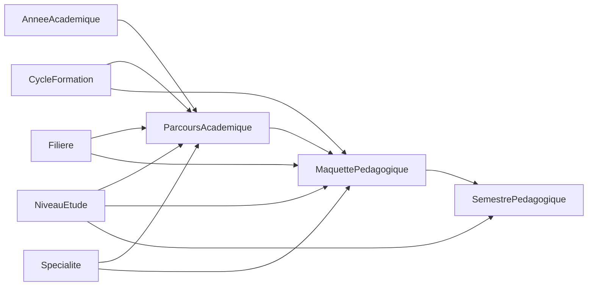

# Program Hierarchy

<cite>
**Referenced Files in This Document**
- [CycleFormation.cs](file://RIIS.Academic.Domain/Referentiels/CycleFormation.cs)
- [Filiere.cs](file://RIIS.Academic.Domain/Referentiels/Filiere.cs)
- [Specialite.cs](file://RIIS.Academic.Domain/Referentiels/Specialite.cs)
- [NiveauEtude.cs](file://RIIS.Academic.Domain/Referentiels/NiveauEtude.cs)
- [AnneeAcademique.cs](file://RIIS.Academic.Domain/Referentiels/AnneeAcademique.cs)
- [ParcoursAcademique.cs](file://RIIS.Academic.Domain/Parcours/ParcoursAcademique.cs)
- [MaquettePedagogique.cs](file://RIIS.Academic.Domain/Programmes/MaquettePedagogique.cs)
- [SemestrePedagogique.cs](file://RIIS.Academic.Domain/Programmes/SemestrePedagogique.cs)
- [StatutMaquettePedagogique.cs](file://RIIS.Academic.Domain/Enums/StatutMaquettePedagogique.cs)
- [MaquettePedagogiqueDto.cs](file://RIIS.Academic.Application/Programmes/Dtos/MaquettePedagogiqueDto.cs)
- [ProgrammePedagogiqueService.cs](file://RIIS.Academic.Application/Programmes/Services/ProgrammePedagogiqueService.cs)
- [ReferentielsService.cs](file://RIIS.Academic.Application/Referentiels/Services/ReferentielsService.cs)
</cite>

## Table of Contents
1. Introduction
2. Project Structure
3. Core Components
4. Architecture Overview
5. Detailed Component Analysis
6. Dependency Analysis
7. Performance Considerations
8. Troubleshooting Guide
9. Conclusion

## Introduction
This document explains the top-level educational program hierarchy centered on CycleFormation (training cycles), Filiere (fields of study), and ParcoursAcademique (academic pathways). It shows how these reference entities define the structure for academic programs and how MaquettePedagogique instances are created within this framework. It also details validation rules that ensure program integrity, relationships across educational levels and specializations, example workflows for creating programs, and status management via StatutMaquettePedagogique.

## Project Structure
The program hierarchy spans domain entities and application services:
- Domain layer defines core entities such as CycleFormation, Filiere, Specialite, NiveauEtude, AnneeAcademique, ParcoursAcademique, MaquettePedagogique, SemestrePedagogique, and the StatutMaquettePedagogique enum.
- Application layer provides services to manage referential data and create/save pedagogical programs with validation and hierarchy queries.

**Diagram sources**
- [CycleFormation.cs:3-12](file://RIIS.Academic.Domain/Referentiels/CycleFormation.cs#L3-L12)
- [Filiere.cs:3-12](file://RIIS.Academic.Domain/Referentiels/Filiere.cs#L3-L12)
- [Specialite.cs:3-13](file://RIIS.Academic.Domain/Referentiels/Specialite.cs#L3-L13)
- [NiveauEtude.cs:3-13](file://RIIS.Academic.Domain/Referentiels/NiveauEtude.cs#L3-L13)
- [AnneeAcademique.cs:3-14](file://RIIS.Academic.Domain/Referentiels/AnneeAcademique.cs#L3-L14)
- [ParcoursAcademique.cs:3-23](file://RIIS.Academic.Domain/Parcours/ParcoursAcademique.cs#L3-L23)
- [MaquettePedagogique.cs:5-30](file://RIIS.Academic.Domain/Programmes/MaquettePedagogique.cs#L5-L30)
- [SemestrePedagogique.cs:3-19](file://RIIS.Academic.Domain/Programmes/SemestrePedagogique.cs#L3-L19)
- [StatutMaquettePedagogique.cs:3-8](file://RIIS.Academic.Domain/Enums/StatutMaquettePedagogique.cs#L3-L8)

**Section sources**
- [CycleFormation.cs:3-12](file://RIIS.Academic.Domain/Referentiels/CycleFormation.cs#L3-L12)
- [Filiere.cs:3-12](file://RIIS.Academic.Domain/Referentiels/Filiere.cs#L3-L12)
- [ParcoursAcademique.cs:3-23](file://RIIS.Academic.Domain/Parcours/ParcoursAcademique.cs#L3-L23)
- [MaquettePedagogique.cs:5-30](file://RIIS.Academic.Domain/Programmes/MaquettePedagogique.cs#L5-L30)
- [StatutMaquettePedagogique.cs:3-8](file://RIIS.Academic.Domain/Enums/StatutMaquettePedagogique.cs#L3-L8)

## Core Components
- CycleFormation: Represents a training cycle (e.g., Bachelor, Master) with code, label, display order, and active flag. It is referenced by academic pathways.
- Filiere: Represents a field of study with code, label, active flag, and links to specializations and academic pathways.
- Specialite: A specialization under a field of study; used to refine the academic pathway.
- NiveauEtude: An educational level (e.g., L1, L2) with a numeric position and label; participates in pathways and semesters.
- AnneeAcademique: Academic year context; used to scope pathways and classes.
- ParcoursAcademique: The central composite entity tying together an academic year, cycle, level, field, and specialization into a single actionable pathway.
- MaquettePedagogique: A versioned pedagogical program tied to a specific combination of cycle, level, field, and specialization. It contains semesters and tracks validity dates and status.
- SemestrePedagogique: A semester within a pedagogical program, optionally linked to a study level and containing teaching units.
- StatutMaquettePedagogique: Enumerates lifecycle statuses for a pedagogical program (draft, active, archived).

These components collectively define the educational structure:
- Reference data (cycle, field, specialization, level, academic year) composes a ParcoursAcademique.
- MaquettePedagogique is then created per ParcoursAcademique to define the curriculum (semesters, units, assessments).

**Section sources**
- [CycleFormation.cs:3-12](file://RIIS.Academic.Domain/Referentiels/CycleFormation.cs#L3-L12)
- [Filiere.cs:3-12](file://RIIS.Academic.Domain/Referentiels/Filiere.cs#L3-L12)
- [Specialite.cs:3-13](file://RIIS.Academic.Domain/Referentiels/Specialite.cs#L3-L13)
- [NiveauEtude.cs:3-13](file://RIIS.Academic.Domain/Referentiels/NiveauEtude.cs#L3-L13)
- [AnneeAcademique.cs:3-14](file://RIIS.Academic.Domain/Referentiels/AnneeAcademique.cs#L3-L14)
- [ParcoursAcademique.cs:3-23](file://RIIS.Academic.Domain/Parcours/ParcoursAcademique.cs#L3-L23)
- [MaquettePedagogique.cs:5-30](file://RIIS.Academic.Domain/Programmes/MaquettePedagogique.cs#L5-L30)
- [SemestrePedagogique.cs:3-19](file://RIIS.Academic.Domain/Programmes/SemestrePedagogique.cs#L3-L19)
- [StatutMaquettePedagogique.cs:3-8](file://RIIS.Academic.Domain/Enums/StatutMaquettePedagogique.cs#L3-L8)

## Architecture Overview
The system uses a layered architecture:
- Domain models define the educational hierarchy and constraints.
- Application services orchestrate creation, validation, and persistence through repositories.
- DTOs decouple UI concerns from domain logic.

**Diagram sources**
- [ReferentielsService.cs:221-308](file://RIIS.Academic.Application/Referentiels/Services/ReferentielsService.cs#L221-L308)
- [ProgrammePedagogiqueService.cs:143-226](file://RIIS.Academic.Application/Programmes/Services/ProgrammePedagogiqueService.cs#L143-L226)

## Detailed Component Analysis

### Educational Reference Model
- CycleFormation anchors the training cycle and is referenced by ParcoursAcademique.
- Filiere groups related specializations and pathways.
- Specialite refines a field of study and is required for a complete pathway.
- NiveauEtude defines the academic level and participates in both pathways and semesters.
- AnneeAcademique scopes pathways to a specific academic year.

**Diagram sources**
- [CycleFormation.cs:3-12](file://RIIS.Academic.Domain/Referentiels/CycleFormation.cs#L3-L12)
- [Filiere.cs:3-12](file://RIIS.Academic.Domain/Referentiels/Filiere.cs#L3-L12)
- [Specialite.cs:3-13](file://RIIS.Academic.Domain/Referentiels/Specialite.cs#L3-L13)
- [NiveauEtude.cs:3-13](file://RIIS.Academic.Domain/Referentiels/NiveauEtude.cs#L3-L13)
- [AnneeAcademique.cs:3-14](file://RIIS.Academic.Domain/Referentiels/AnneeAcademique.cs#L3-L14)
- [ParcoursAcademique.cs:3-23](file://RIIS.Academic.Domain/Parcours/ParcoursAcademique.cs#L3-L23)

**Section sources**
- [CycleFormation.cs:3-12](file://RIIS.Academic.Domain/Referentiels/CycleFormation.cs#L3-L12)
- [Filiere.cs:3-12](file://RIIS.Academic.Domain/Referentiels/Filiere.cs#L3-L12)
- [Specialite.cs:3-13](file://RIIS.Academic.Domain/Referentiels/Specialite.cs#L3-L13)
- [NiveauEtude.cs:3-13](file://RIIS.Academic.Domain/Referentiels/NiveauEtude.cs#L3-L13)
- [AnneeAcademique.cs:3-14](file://RIIS.Academic.Domain/Referentiels/AnneeAcademique.cs#L3-L14)
- [ParcoursAcademique.cs:3-23](file://RIIS.Academic.Domain/Parcours/ParcoursAcademique.cs#L3-L23)

### MaquettePedagogique Creation Workflow
A MaquettePedagogique represents a versioned curriculum for a specific ParcoursAcademique. Creation involves:
- Selecting or creating a ParcoursAcademique that binds Year, Cycle, Level, Field, and Specialization.
- Creating a default MaquettePedagogique in Draft status.
- Saving with validations ensuring required fields, valid date ranges, and uniqueness per code/version for the same pathway.

**Diagram sources**
- [ProgrammePedagogiqueService.cs:143-226](file://RIIS.Academic.Application/Programmes/Services/ProgrammePedagogiqueService.cs#L143-L226)

**Section sources**
- [ProgrammePedagogiqueService.cs:143-226](file://RIIS.Academic.Application/Programmes/Services/ProgrammePedagogiqueService.cs#L143-L226)

### Validation Rules Ensuring Program Integrity
Key validations enforced during program creation and updates:
- Required fields:
  - MaquettePedagogique requires non-empty Code, Libelle, Version, and a valid ParcoursAcademiqueId.
  - SemestrePedagogique requires a valid MaquettePedagogiqueId, a Numero between 1 and 10, positive CreditsAttendus and VolumeHoraireAttendu, and a non-empty Libelle.
  - UniteEnseignement requires a valid SemestrePedagogiqueId, positive Credits and VolumeHoraire, non-empty Code and Libelle.
  - ElementConstitutif requires a valid UniteEnseignementId, non-negative Credits, Coefficient, and VolumeHoraire, non-empty Libelle, and unique ordering within its UE.
- Uniqueness constraints:
  - MaquettePedagogique: Unique Code+Version per pathway (same Cycle, Level, Field, Specialty).
  - SemestrePedagogique: Unique Numero per MaquettePedagogique.
  - UniteEnseignement: Unique Code per SemestrePedagogique.
  - ElementConstitutif: Unique Code per UniteEnseignement and unique OrdreAffichage per UniteEnseignement.
- Referential integrity:
  - Specialite must belong to the selected Filiere when creating a ParcoursAcademique.
  - Valid IDs for all referenced entities (Year, Cycle, Level, Field, Specialty, Maquette, Semester, UE).
- Business rules:
  - Date range: DateFinValidite must be greater than or equal to DateDebutValidite.
  - Semester numbering: Must be within 1..10.
  - Coefficient defaulting: If zero, defaults to 1 for elements.

These rules prevent inconsistent curricula and ensure stable program definitions.

**Section sources**
- [ProgrammePedagogiqueService.cs:151-226](file://RIIS.Academic.Application/Programmes/Services/ProgrammePedagogiqueService.cs#L151-L226)
- [ProgrammePedagogiqueService.cs:290-352](file://RIIS.Academic.Application/Programmes/Services/ProgrammePedagogiqueService.cs#L290-L352)
- [ProgrammePedagogiqueService.cs:518-574](file://RIIS.Academic.Application/Programmes/Services/ProgrammePedagogiqueService.cs#L518-L574)
- [ProgrammePedagogiqueService.cs:634-712](file://RIIS.Academic.Application/Programmes/Services/ProgrammePedagogiqueService.cs#L634-L712)
- [ReferentielsService.cs:221-308](file://RIIS.Academic.Application/Referentiels/Services/ReferentielsService.cs#L221-L308)

### Relationships Between Educational Levels and Specializations
- ParcoursAcademique ties together:
  - AnneeAcademique (year), CycleFormation (cycle), NiveauEtude (level), Filiere (field), and Specialite (specialization).
- MaquettePedagogique mirrors this relationship by storing the same foreign keys to enforce curriculum alignment with the pathway.
- SemestrePedagogique can optionally link to a NiveauEtude to indicate the level it targets within the program.

This ensures that each curriculum version is explicitly bound to a precise educational configuration.

**Section sources**
- [ParcoursAcademique.cs:3-23](file://RIIS.Academic.Domain/Parcours/ParcoursAcademique.cs#L3-L23)
- [MaquettePedagogique.cs:5-30](file://RIIS.Academic.Domain/Programmes/MaquettePedagogique.cs#L5-L30)
- [SemestrePedagogique.cs:3-19](file://RIIS.Academic.Domain/Programmes/SemestrePedagogique.cs#L3-L19)

### Example Workflows and Status Management
- Create a new program:
  - Ensure reference entities exist (Cycle, Field, Speciality, Level, Year).
  - Create a ParcoursAcademique binding them.
  - Use CreateDefaultMaquette to initialize a draft program with Version “V1”.
  - Save the MaquettePedagogique after validating fields and uniqueness.
- Add curriculum content:
  - Create SemestrePedagogique entries with unique numbers per program.
  - Add UniteEnseignement entries with unique codes per semester.
  - Add ElementConstitutif entries with unique codes and ordering per unit.
- Manage status:
  - StatutMaquettePedagogique supports Brouillon (draft), Active, Archivee (archived).
  - Programs typically start in Brouillon, move to Active when approved, and Archivee when superseded.

**Diagram sources**
- [StatutMaquettePedagogique.cs:3-8](file://RIIS.Academic.Domain/Enums/StatutMaquettePedagogique.cs#L3-L8)

**Section sources**
- [ProgrammePedagogiqueService.cs:143-226](file://RIIS.Academic.Application/Programmes/Services/ProgrammePedagogiqueService.cs#L143-L226)
- [StatutMaquettePedagogique.cs:3-8](file://RIIS.Academic.Domain/Enums/StatutMaquettePedagogique.cs#L3-L8)

## Dependency Analysis
- Domain dependencies:
  - ParcoursAcademique depends on AnneeAcademique, CycleFormation, NiveauEtude, Filiere, Specialite.
  - MaquettePedagogique depends on CycleFormation, NiveauEtude, Filiere, Specialite and aggregates SemestrePedagogique.
  - SemestrePedagogique depends on MaquettePedagogique and optionally NiveauEtude.
- Application dependencies:
  - ReferentielsService orchestrates creation and validation of reference entities and ParcoursAcademique.
  - ProgrammePedagogiqueService orchestrates MaquettePedagogique lifecycle and curriculum composition.

**Diagram sources**
- [ParcoursAcademique.cs:3-23](file://RIIS.Academic.Domain/Parcours/ParcoursAcademique.cs#L3-L23)
- [MaquettePedagogique.cs:5-30](file://RIIS.Academic.Domain/Programmes/MaquettePedagogique.cs#L5-L30)
- [SemestrePedagogique.cs:3-19](file://RIIS.Academic.Domain/Programmes/SemestrePedagogique.cs#L3-L19)

**Section sources**
- [ReferentielsService.cs:221-308](file://RIIS.Academic.Application/Referentiels/Services/ReferentielsService.cs#L221-L308)
- [ProgrammePedagogiqueService.cs:143-226](file://RIIS.Academic.Application/Programmes/Services/ProgrammePedagogiqueService.cs#L143-L226)

## Performance Considerations
- Filtering and listing operations load large sets of entities and perform in-memory filtering and joins. For large datasets, consider:
  - Server-side filtering and pagination at repository or query layers.
  - Caching lookups for reference entities (cycles, fields, specialties, levels).
  - Reducing eager loading of collections where not needed.
- Avoid repeated full scans for duplicate checks by leveraging database constraints or indexes on key combinations (e.g., Maquette Code+Version per pathway).

[No sources needed since this section provides general guidance]

## Troubleshooting Guide
Common issues and their causes:
- Missing or invalid references:
  - Errors thrown when required IDs (Year, Cycle, Level, Field, Specialty, Maquette, Semester, UE) are missing or not found.
- Invalid date ranges:
  - End date before start date triggers an error during Maquette save.
- Duplicate entries:
  - Duplicate Maquette Code+Version for the same pathway.
  - Duplicate Semester Number within a Maquette.
  - Duplicate Unit Code within a Semester.
  - Duplicate Element Code or Order within a Unit.
- Inconsistent specialization-field pairing:
  - Saving a ParcoursAcademique fails if the chosen Specialite does not belong to the selected Filiere.

Resolution steps:
- Verify all referenced entities exist and are active.
- Ensure unique identifiers per scope (Code+Version per pathway, Number per Maquette, Code per Semester, Code per Unit, Order per Unit).
- Correct date ranges and required text fields.
- Align Specialite with its parent Filiere.

**Section sources**
- [ProgrammePedagogiqueService.cs:151-226](file://RIIS.Academic.Application/Programmes/Services/ProgrammePedagogiqueService.cs#L151-L226)
- [ProgrammePedagogiqueService.cs:290-352](file://RIIS.Academic.Application/Programmes/Services/ProgrammePedagogiqueService.cs#L290-L352)
- [ProgrammePedagogiqueService.cs:518-574](file://RIIS.Academic.Application/Programmes/Services/ProgrammePedagogiqueService.cs#L518-L574)
- [ProgrammePedagogiqueService.cs:634-712](file://RIIS.Academic.Application/Programmes/Services/ProgrammePedagogiqueService.cs#L634-L712)
- [ReferentielsService.cs:221-308](file://RIIS.Academic.Application/Referentiels/Services/ReferentielsService.cs#L221-L308)

## Conclusion
The educational program hierarchy is built around clear reference entities (CycleFormation, Filiere, Specialite, NiveauEtude, AnneeAcademique) that compose a ParcoursAcademique. MaquettePedagogique instances are created per pathway to define versioned curricula with robust validation ensuring integrity. Status management via StatutMaquettePedagogique supports lifecycle control from draft to active to archived. Following the outlined workflows and validation rules enables consistent and reliable program creation and maintenance.

[No sources needed since this section summarizes without analyzing specific files]