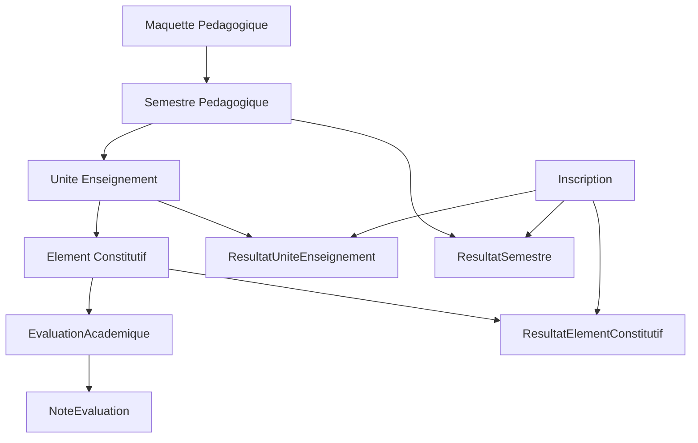
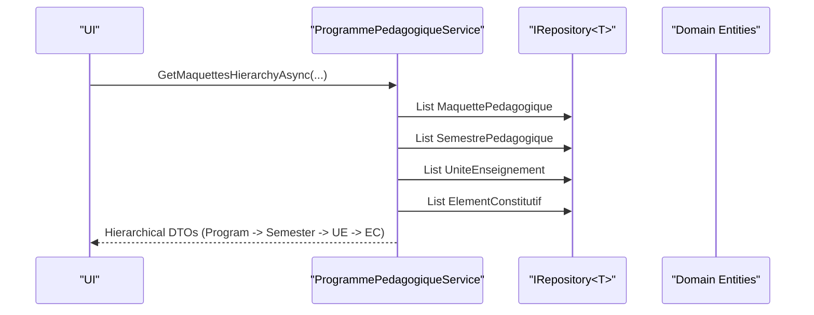
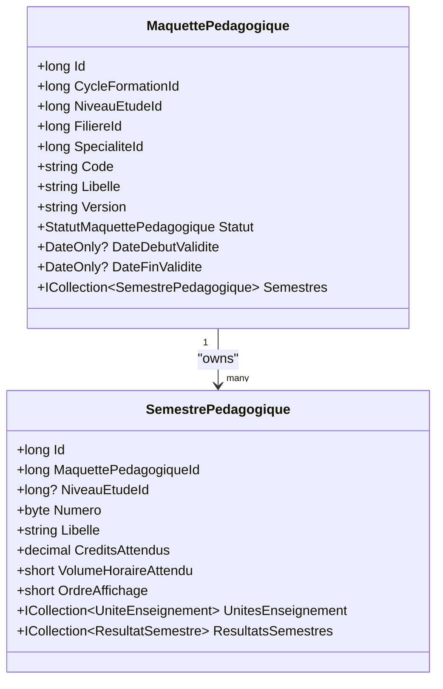
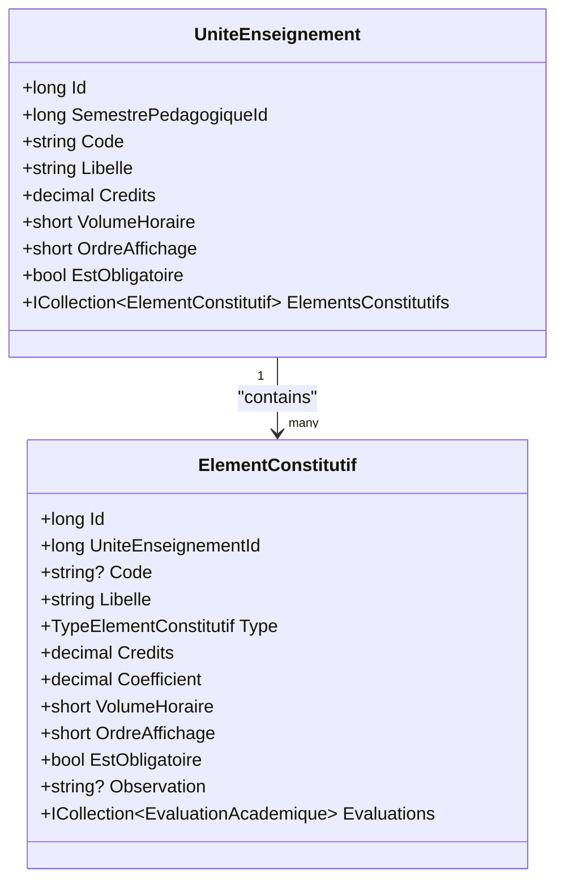
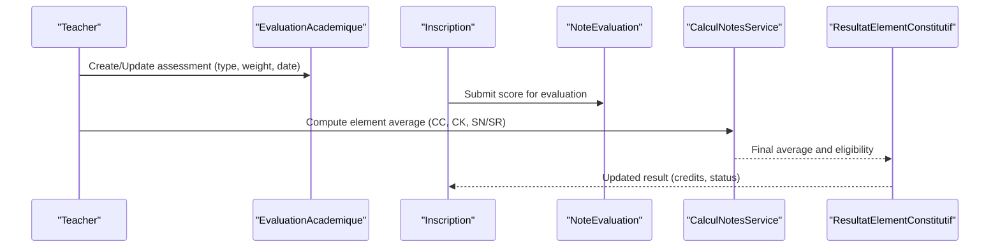
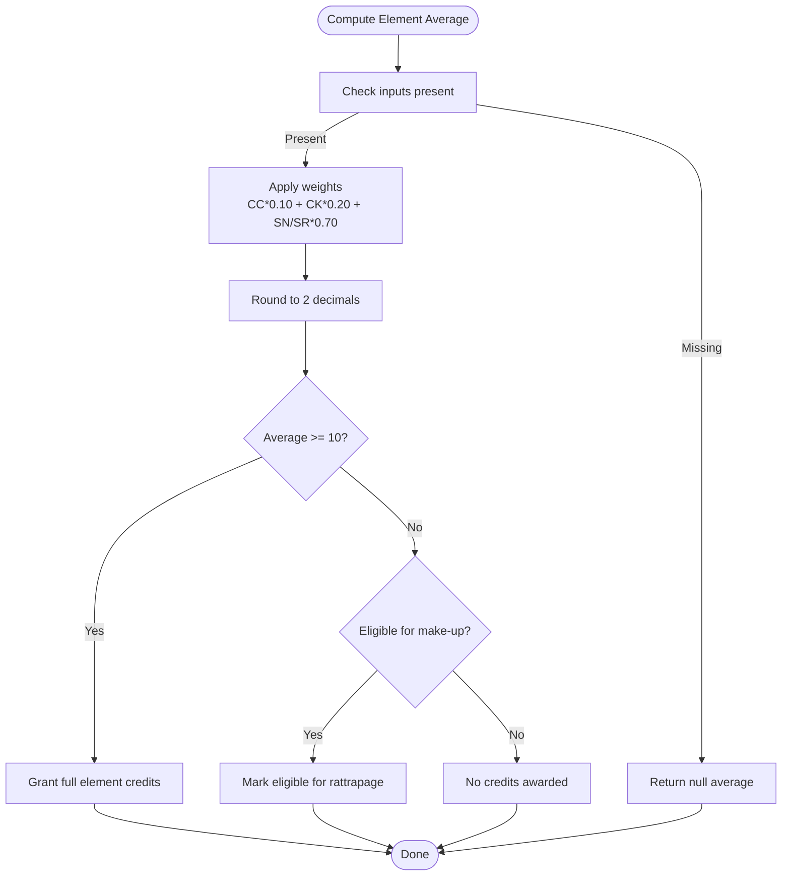
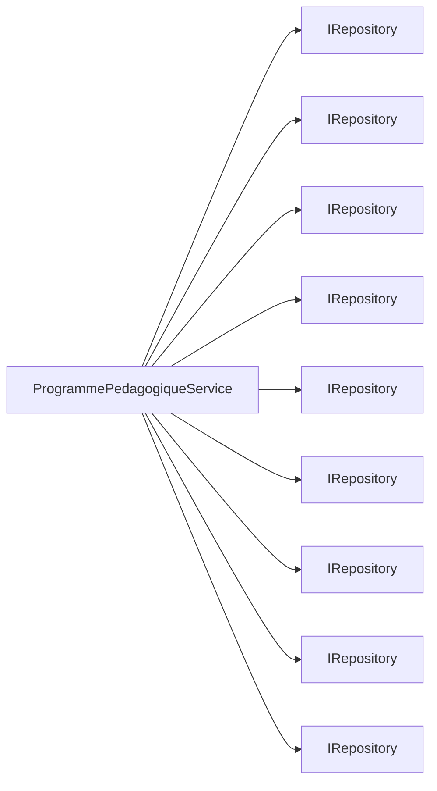

# Semester and Course Structure

<cite>
**Referenced Files in This Document**
- [SemestrePedagogique.cs](file://RIIS.Academic.Domain/Programmes/SemestrePedagogique.cs)
- [UniteEnseignement.cs](file://RIIS.Academic.Domain/Programmes/UniteEnseignement.cs)
- [ElementConstitutif.cs](file://RIIS.Academic.Domain/Programmes/ElementConstitutif.cs)
- [MaquettePedagogique.cs](file://RIIS.Academic.Domain/Programmes/MaquettePedagogique.cs)
- [EvaluationAcademique.cs](file://RIIS.Academic.Domain/Notes/EvaluationAcademique.cs)
- [ResultatElementConstitutif.cs](file://RIIS.Academic.Domain/Notes/ResultatElementConstitutif.cs)
- [ResultatUniteEnseignement.cs](file://RIIS.Academic.Domain/Notes/ResultatUniteEnseignement.cs)
- [ResultatSemestre.cs](file://RIIS.Academic.Domain/Notes/ResultatSemestre.cs)
- [NoteEvaluation.cs](file://RIIS.Academic.Domain/Notes/NoteEvaluation.cs)
- [TypeElementConstitutif.cs](file://RIIS.Academic.Domain/Enums/TypeElementConstitutif.cs)
- [TypeEvaluation.cs](file://RIIS.Academic.Domain/Enums/TypeEvaluation.cs)
- [NiveauEtude.cs](file://RIIS.Academic.Domain/Referentiels/NiveauEtude.cs)
- [AnneeAcademique.cs](file://RIIS.Academic.Domain/Referentiels/AnneeAcademique.cs)
- [Inscription.cs](file://RIIS.Academic.Domain/Inscriptions/Inscription.cs)
- [ProgrammePedagogiqueService.cs](file://RIIS.Academic.Application/Programmes/Services/ProgrammePedagogiqueService.cs)
- [CalculNotesService.cs](file://RIIS.Academic.Application/Notes/Services/CalculNotesService.cs)
</cite>

## Table of Contents
1. Introduction
2. Project Structure
3. Core Components
4. Architecture Overview
5. Detailed Component Analysis
6. Dependency Analysis
7. Performance Considerations
8. Troubleshooting Guide
9. Conclusion

## Introduction
This document explains the semester-based course organization used by the system. It focuses on how academic programs are structured into Semestre Pedagogique entities, how Unite Enseignement (teaching units) group learning objectives, and how Element Constitutif (constituent elements) represent the smallest assessable components. It also documents credit calculations, workload definitions, assessment structures, and provides practical examples for scheduling, prerequisites, and evaluation planning within the semester framework.

## Project Structure
The domain layer defines the core academic model:
- Maquette Pedagogique represents an academic program version tied to a cycle, level, field, and specialization.
- Semestre Pedagogique groups teaching units for a given program with expected credits and workload.
- Unite Enseignement is a container for constituent elements with its own credits and workload.
- Element Constitutif models a specific activity or assessment type with credits, coefficient, and workload.
- EvaluationAcademique defines assessments linked to constituent elements, including weights and dates.
- Result entities aggregate scores and credits at element, unit, and semester levels per student enrollment.

**Diagram sources**
- [MaquettePedagogique.cs:5-30](file://RIIS.Academic.Domain/Programmes/MaquettePedagogique.cs#L5-L30)
- [SemestrePedagogique.cs:3-19](file://RIIS.Academic.Domain/Programmes/SemestrePedagogique.cs#L3-L19)
- [UniteEnseignement.cs:3-17](file://RIIS.Academic.Domain/Programmes/UniteEnseignement.cs#L3-L17)
- [ElementConstitutif.cs:3-20](file://RIIS.Academic.Domain/Programmes/ElementConstitutif.cs#L3-L20)
- [EvaluationAcademique.cs:3-23](file://RIIS.Academic.Domain/Notes/EvaluationAcademique.cs#L3-L23)
- [NoteEvaluation.cs:3-16](file://RIIS.Academic.Domain/Notes/NoteEvaluation.cs#L3-L16)
- [ResultatElementConstitutif.cs:3-22](file://RIIS.Academic.Domain/Notes/ResultatElementConstitutif.cs#L3-L22)
- [ResultatUniteEnseignement.cs:3-16](file://RIIS.Academic.Domain/Notes/ResultatUniteEnseignement.cs#L3-L16)
- [ResultatSemestre.cs:3-22](file://RIIS.Academic.Domain/Notes/ResultatSemestre.cs#L3-L22)
- [Inscription.cs:3-36](file://RIIS.Academic.Domain/Inscriptions/Inscription.cs#L3-L36)

**Section sources**
- [MaquettePedagogique.cs:5-30](file://RIIS.Academic.Domain/Programmes/MaquettePedagogique.cs#L5-L30)
- [SemestrePedagogique.cs:3-19](file://RIIS.Academic.Domain/Programmes/SemestrePedagogique.cs#L3-L19)
- [UniteEnseignement.cs:3-17](file://RIIS.Academic.Domain/Programmes/UniteEnseignement.cs#L3-L17)
- [ElementConstitutif.cs:3-20](file://RIIS.Academic.Domain/Programmes/ElementConstitutif.cs#L3-L20)
- [EvaluationAcademique.cs:3-23](file://RIIS.Academic.Domain/Notes/EvaluationAcademique.cs#L3-L23)
- [NoteEvaluation.cs:3-16](file://RIIS.Academic.Domain/Notes/NoteEvaluation.cs#L3-L16)
- [ResultatElementConstitutif.cs:3-22](file://RIIS.Academic.Domain/Notes/ResultatElementConstitutif.cs#L3-L22)
- [ResultatUniteEnseignement.cs:3-16](file://RIIS.Academic.Domain/Notes/ResultatUniteEnseignement.cs#L3-L16)
- [ResultatSemestre.cs:3-22](file://RIIS.Academic.Domain/Notes/ResultatSemestre.cs#L3-L22)
- [Inscription.cs:3-36](file://RIIS.Academic.Domain/Inscriptions/Inscription.cs#L3-L36)

## Core Components
- Academic Program (Maquette Pedagogique): Defines a program version with validity dates and links to cycle, level, field, and specialization. It contains multiple semesters.
- Semester (Semestre Pedagogique): Groups teaching units with expected credits and workload; can be associated with a study level and ordered for display.
- Teaching Unit (Unite Enseignement): Represents a course-like container with credits, workload, and ordering; holds constituent elements.
- Constituent Element (Element Constitutif): The smallest assessable unit; includes type (course, project, internship, etc.), credits, coefficient, workload, and optional observation.
- Assessment (EvaluationAcademique): Links to a constituent element, defines assessment type, weighting, schedule, and replacement relationships.
- Results: Per-student aggregates at element, unit, and semester levels, capturing averages, acquired credits, eligibility for make-up exams, and validation status.

Key attributes:
- Credits: Defined at semester, unit, and element levels; semester has expected credits; unit and element have assigned credits.
- Workload: VolumeHoraire fields define hours at unit and element levels; semester has expected workload.
- Coefficient: Used to weight constituent elements when computing results.
- Ordering: OrdreAffichage ensures consistent presentation across semesters, units, and elements.

**Section sources**
- [MaquettePedagogique.cs:5-30](file://RIIS.Academic.Domain/Programmes/MaquettePedagogique.cs#L5-L30)
- [SemestrePedagogique.cs:3-19](file://RIIS.Academic.Domain/Programmes/SemestrePedagogique.cs#L3-L19)
- [UniteEnseignement.cs:3-17](file://RIIS.Academic.Domain/Programmes/UniteEnseignement.cs#L3-L17)
- [ElementConstitutif.cs:3-20](file://RIIS.Academic.Domain/Programmes/ElementConstitutif.cs#L3-L20)
- [EvaluationAcademique.cs:3-23](file://RIIS.Academic.Domain/Notes/EvaluationAcademique.cs#L3-L23)
- [ResultatElementConstitutif.cs:3-22](file://RIIS.Academic.Domain/Notes/ResultatElementConstitutif.cs#L3-L22)
- [ResultatUniteEnseignement.cs:3-16](file://RIIS.Academic.Domain/Notes/ResultatUniteEnseignement.cs#L3-L16)
- [ResultatSemestre.cs:3-22](file://RIIS.Academic.Domain/Notes/ResultatSemestre.cs#L3-L22)

## Architecture Overview
The application layer orchestrates reading and writing of program data through services that query repositories and map to DTOs. The service supports hierarchical views from program to semester to unit to constituent element, enabling UIs to present structured curricula.

**Diagram sources**
- [ProgrammePedagogiqueService.cs:33-130](file://RIIS.Academic.Application/Programmes/Services/ProgrammePedagogiqueService.cs#L33-L130)
- [ProgrammePedagogiqueService.cs:418-486](file://RIIS.Academic.Application/Programmes/Services/ProgrammePedagogiqueService.cs#L418-L486)

**Section sources**
- [ProgrammePedagogiqueService.cs:33-130](file://RIIS.Academic.Application/Programmes/Services/ProgrammePedagogiqueService.cs#L33-L130)
- [ProgrammePedagogiqueService.cs:418-486](file://RIIS.Academic.Application/Programmes/Services/ProgrammePedagogiqueService.cs#L418-L486)

## Detailed Component Analysis

### Academic Program and Semester Relationship
- Maquette Pedagogique owns multiple Semestre Pedagogique entries, each with a number, label, expected credits, and expected workload.
- Semestre Pedagogique may reference a Niveau Etude to indicate the study level context.
- Semestre Pedagogique contains Unites Enseignement and produces ResultatSemestre per student enrollment.

**Diagram sources**
- [MaquettePedagogique.cs:5-30](file://RIIS.Academic.Domain/Programmes/MaquettePedagogique.cs#L5-L30)
- [SemestrePedagogique.cs:3-19](file://RIIS.Academic.Domain/Programmes/SemestrePedagogique.cs#L3-L19)

**Section sources**
- [MaquettePedagogique.cs:5-30](file://RIIS.Academic.Domain/Programmes/MaquettePedagogique.cs#L5-L30)
- [SemestrePedagogique.cs:3-19](file://RIIS.Academic.Domain/Programmes/SemestrePedagogique.cs#L3-L19)
- [NiveauEtude.cs:3-13](file://RIIS.Academic.Domain/Referentiels/NiveauEtude.cs#L3-L13)

### Teaching Units and Constituent Elements
- Unite Enseignement belongs to a Semestre Pedagogique and aggregates constituent elements.
- Element Constitutif specifies type (course, project, internship, etc.), credits, coefficient, workload, and whether it is mandatory.
- Each constituent element can host multiple evaluations and produce per-student results.

**Diagram sources**
- [UniteEnseignement.cs:3-17](file://RIIS.Academic.Domain/Programmes/UniteEnseignement.cs#L3-L17)
- [ElementConstitutif.cs:3-20](file://RIIS.Academic.Domain/Programmes/ElementConstitutif.cs#L3-L20)
- [TypeElementConstitutif.cs:3-10](file://RIIS.Academic.Domain/Enums/TypeElementConstitutif.cs#L3-L10)

**Section sources**
- [UniteEnseignement.cs:3-17](file://RIIS.Academic.Domain/Programmes/UniteEnseignement.cs#L3-L17)
- [ElementConstitutif.cs:3-20](file://RIIS.Academic.Domain/Programmes/ElementConstitutif.cs#L3-L20)
- [TypeElementConstitutif.cs:3-10](file://RIIS.Academic.Domain/Enums/TypeElementConstitutif.cs#L3-L10)

### Assessments and Grades Flow
- EvaluationAcademique attaches to an ElementConstitutif, defines type (continuous assessment, knowledge control, normal session, make-up), weighting, and date.
- NoteEvaluation records a student’s score for an evaluation.
- ResultatElementConstitutif aggregates averages across assessment types and computes final retained average and eligibility for make-up.

**Diagram sources**
- [EvaluationAcademique.cs:3-23](file://RIIS.Academic.Domain/Notes/EvaluationAcademique.cs#L3-L23)
- [NoteEvaluation.cs:3-16](file://RIIS.Academic.Domain/Notes/NoteEvaluation.cs#L3-L16)
- [ResultatElementConstitutif.cs:3-22](file://RIIS.Academic.Domain/Notes/ResultatElementConstitutif.cs#L3-L22)
- [CalculNotesService.cs:7-24](file://RIIS.Academic.Application/Notes/Services/CalculNotesService.cs#L7-L24)
- [TypeEvaluation.cs:3-9](file://RIIS.Academic.Domain/Enums/TypeEvaluation.cs#L3-L9)

**Section sources**
- [EvaluationAcademique.cs:3-23](file://RIIS.Academic.Domain/Notes/EvaluationAcademique.cs#L3-L23)
- [NoteEvaluation.cs:3-16](file://RIIS.Academic.Domain/Notes/NoteEvaluation.cs#L3-L16)
- [ResultatElementConstitutif.cs:3-22](file://RIIS.Academic.Domain/Notes/ResultatElementConstitutif.cs#L3-L22)
- [CalculNotesService.cs:7-24](file://RIIS.Academic.Application/Notes/Services/CalculNotesService.cs#L7-L24)
- [TypeEvaluation.cs:3-9](file://RIIS.Academic.Domain/Enums/TypeEvaluation.cs#L3-L9)

### Credit Calculation and Workload Definitions
- Element-level calculation:
  - Average combines continuous assessment, knowledge control, and session results using fixed weights.
  - Eligibility for make-up depends on the final average threshold.
  - Acquired credits equal the element’s credits if the final average meets the passing threshold; otherwise zero.
- Unit-level aggregation:
  - Computes average and acquired credits based on constituent elements.
- Semester-level aggregation:
  - Aggregates averages across assessment types and computes semester average, total acquired vs required credits, ranking, and jury decision.

**Diagram sources**
- [CalculNotesService.cs:7-24](file://RIIS.Academic.Application/Notes/Services/CalculNotesService.cs#L7-L24)
- [ResultatElementConstitutif.cs:3-22](file://RIIS.Academic.Domain/Notes/ResultatElementConstitutif.cs#L3-L22)

**Section sources**
- [CalculNotesService.cs:7-24](file://RIIS.Academic.Application/Notes/Services/CalculNotesService.cs#L7-L24)
- [ResultatElementConstitutif.cs:3-22](file://RIIS.Academic.Domain/Notes/ResultatElementConstitutif.cs#L3-L22)
- [ResultatUniteEnseignement.cs:3-16](file://RIIS.Academic.Domain/Notes/ResultatUniteEnseignement.cs#L3-L16)
- [ResultatSemestre.cs:3-22](file://RIIS.Academic.Domain/Notes/ResultatSemestre.cs#L3-L22)

### Examples: Scheduling, Prerequisites, and Evaluation Planning
- Course scheduling:
  - Use Semestre Pedagogique Numero and OrdreAffichage to sequence semesters.
  - Within each semester, order Unites Enseignement via OrdreAffichage and Code.
  - For each unit, order constituent elements via OrdreAffichage and Libelle.
  - Assign EvaluationAcademique DateEvaluation to plan assessment timing.
- Prerequisite management:
  - While no explicit prerequisite entity exists in the referenced files, typical practice is to enforce dependencies via program rules or validations during enrollment or curriculum design. Ensure that required prior units or levels are satisfied before allowing registration or progression.
- Evaluation planning:
  - Define EvaluationAcademique with TypeEvaluation indicating assessment mode (continuous, knowledge control, normal session, make-up).
  - Set Bareme and PonderationPourcentage to reflect assessment weight within the element.
  - Link EvaluationRemplaceeId to manage replacements (e.g., make-up replacing original).

Practical example outline:
- Semester 1 (Numero=1, CreditsAttendus=30, VolumeHoraireAttendu=450)
  - Unit A (Credits=5, VolumeHoraire=60)
    - Element A1 (Cours, Credits=2, Coefficient=1, VolumeHoraire=30)
      - Evaluation: Continuous assessment (Bareme=20, PonderationPourcentage set appropriately)
    - Element A2 (Projet, Credits=3, Coefficient=2, VolumeHoraire=30)
      - Evaluation: Knowledge control and normal session
  - Unit B (Credits=4, VolumeHoraire=45)
    - Element B1 (Stage, Credits=4, Coefficient=1, VolumeHoraire=45)
      - Evaluation: Normal session and possible make-up

[No sources needed since this section provides conceptual examples]

## Dependency Analysis
The following diagram shows key dependencies among domain entities and the application service that composes them for hierarchical queries.

**Diagram sources**
- [ProgrammePedagogiqueService.cs:8-17](file://RIIS.Academic.Application/Programmes/Services/ProgrammePedagogiqueService.cs#L8-L17)

**Section sources**
- [ProgrammePedagogiqueService.cs:8-17](file://RIIS.Academic.Application/Programmes/Services/ProgrammePedagogiqueService.cs#L8-L17)

## Performance Considerations
- Hierarchical queries load large sets of entities and perform client-side filtering and mapping. To improve performance:
  - Filter early by AnneeAcademique, CycleFormation, and MaquettePedagogique identifiers where possible.
  - Limit returned fields to only those necessary for the UI.
  - Consider pagination for large lists of semesters, units, or elements.
  - Cache lookup tables (academic years, cycles, pathways) to reduce repeated reads.
- Avoid unnecessary recomputation of averages by caching results until new grades are entered.

[No sources needed since this section provides general guidance]

## Troubleshooting Guide
Common issues and resolutions:
- Duplicate codes:
  - Semesters: Ensure unique Numero within a MaquettePedagogique.
  - Units: Ensure unique Code within a SemestrePedagogique.
  - Elements: Ensure unique Code within a UniteEnseignement and unique OrdreAffichage within the same unit.
- Invalid ranges:
  - Semester Numero must be between 1 and 10.
  - Credits and workloads must be non-negative.
- Missing references:
  - Validate that MaquettePedagogique, NiveauEtude, and UniteEnseignement exist before saving related entities.
- Validation errors:
  - Dates: Validity start must not be after end.
  - Required fields: Codes, labels, and versions must be provided and normalized.

**Section sources**
- [ProgrammePedagogiqueService.cs:151-226](file://RIIS.Academic.Application/Programmes/Services/ProgrammePedagogiqueService.cs#L151-L226)
- [ProgrammePedagogiqueService.cs:290-352](file://RIIS.Academic.Application/Programmes/Services/ProgrammePedagogiqueService.cs#L290-L352)
- [ProgrammePedagogiqueService.cs:518-574](file://RIIS.Academic.Application/Programmes/Services/ProgrammePedagogiqueService.cs#L518-L574)
- [ProgrammePedagogiqueService.cs:634-712](file://RIIS.Academic.Application/Programmes/Services/ProgrammePedagogiqueService.cs#L634-L712)

## Conclusion
The system organizes academic programs into semesters, which contain teaching units and constituent elements. Credits and workload are defined at each level, while assessments are attached to constituent elements to capture student performance. Results are aggregated per student at element, unit, and semester levels, supporting credit acquisition and academic decisions. The application service enables hierarchical navigation and manipulation of these structures, ensuring consistency and usability for curriculum management.

[No sources needed since this section summarizes without analyzing specific files]