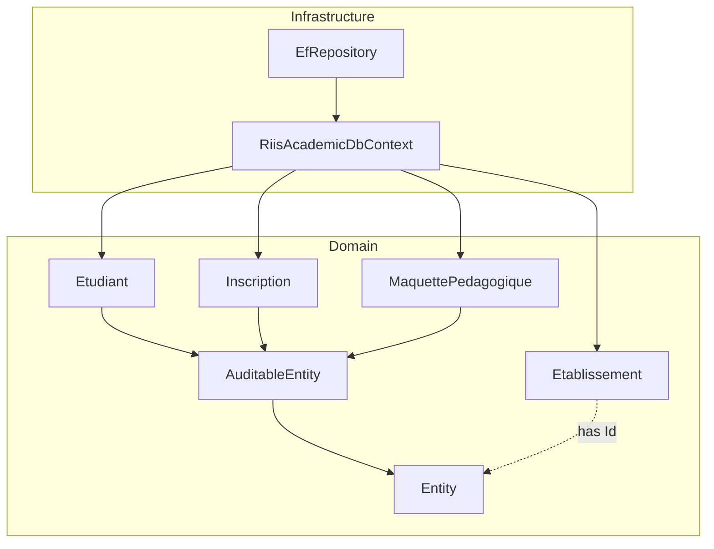
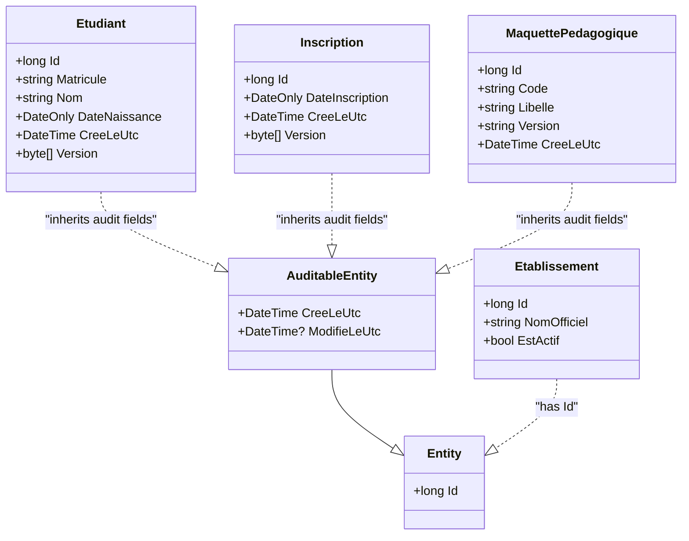
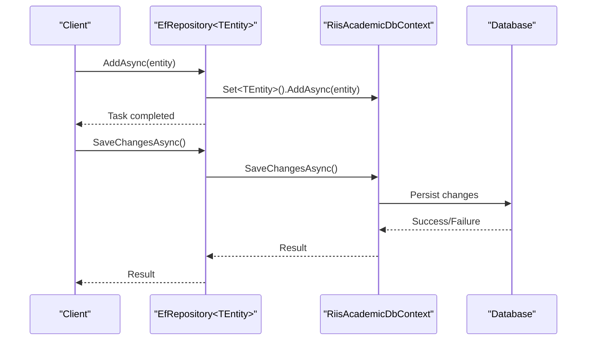

# Core Entities

<cite>
**Referenced Files in This Document**
- [Entity.cs](file://src/RIIS.Academic.Domain/Common/Entity.cs)
- [AuditableEntity.cs](file://src/RIIS.Academic.Domain/Common/AuditableEntity.cs)
- [Etablissement.cs](file://src/RIIS.Academic.Domain/Etablissements/Etablissement.cs)
- [Etudiant.cs](file://src/RIIS.Academic.Domain/Etudiants/Etudiant.cs)
- [Inscription.cs](file://src/RIIS.Academic.Domain/Inscriptions/Inscription.cs)
- [MaquettePedagogique.cs](file://src/RIIS.Academic.Domain/Programmes/MaquettePedagogique.cs)
- [RiisAcademicDbContext.cs](file://src/RIIS.Academic.Infrastructure/Persistence/RiisAcademicDbContext.cs)
- [EfRepository.cs](file://src/RIIS.Academic.Infrastructure/Persistence/Repositories/EfRepository.cs)
</cite>

## Table of Contents
1. Introduction
2. Project Structure
3. Core Components
4. Architecture Overview
5. Detailed Component Analysis
6. Dependency Analysis
7. Performance Considerations
8. Troubleshooting Guide
9. Conclusion

## Introduction
This document explains the core entity base classes that underpin domain models in the project: a minimal Entity base and an AuditableEntity that adds creation and modification timestamps. It clarifies design principles, consistency goals, and how these patterns support cross-cutting concerns such as auditing and versioning. It also shows how concrete entities currently implement or can adopt these patterns within the codebase.

## Project Structure
The base classes live in the Domain layer under Common. Concrete domain entities are organized by feature (e.g., Etablissements, Etudiants, Inscriptions, Programmes). The Infrastructure layer provides persistence via EF Core and exposes a generic repository.

**Diagram sources**
- [Entity.cs:4-7](file://src/RIIS.Academic.Domain/Common/Entity.cs#L4-L7)
- [AuditableEntity.cs:4-8](file://src/RIIS.Academic.Domain/Common/AuditableEntity.cs#L4-L8)
- [Etablissement.cs:3-23](file://src/RIIS.Academic.Domain/Etablissements/Etablissement.cs#L3-L23)
- [Etudiant.cs:3-27](file://src/RIIS.Academic.Domain/Etudiants/Etudiant.cs#L3-L27)
- [Inscription.cs:3-36](file://src/RIIS.Academic.Domain/Inscriptions/Inscription.cs#L3-L36)
- [MaquettePedagogique.cs:5-30](file://src/RIIS.Academic.Domain/Programmes/MaquettePedagogique.cs#L5-L30)
- [RiisAcademicDbContext.cs:6-49](file://src/RIIS.Academic.Infrastructure/Persistence/RiisAcademicDbContext.cs#L6-L49)
- [EfRepository.cs:6-33](file://src/RIIS.Academic.Infrastructure/Persistence/Repositories/EfRepository.cs#L6-L33)

**Section sources**
- [Entity.cs:4-7](file://src/RIIS.Academic.Domain/Common/Entity.cs#L4-L7)
- [AuditableEntity.cs:4-8](file://src/RIIS.Academic.Domain/Common/AuditableEntity.cs#L4-L8)
- [RiisAcademicDbContext.cs:6-49](file://src/RIIS.Academic.Infrastructure/Persistence/RiisAcademicDbContext.cs#L6-L49)
- [EfRepository.cs:6-33](file://src/RIIS.Academic.Infrastructure/Persistence/Repositories/EfRepository.cs#L6-L33)

## Core Components
- Entity: A minimal abstract base providing a stable identity property for all entities.
- AuditableEntity: Extends Entity to add creation and modification timestamps, enabling consistent audit trails across entities.

Design principles
- Single source of truth for identity: All entities share a common Id concept, simplifying queries, relationships, and repository abstractions.
- Consistent audit fields: Centralized timestamp properties ensure uniform behavior for tracking when records are created and last modified.
- Separation of concerns: Base types encapsulate cross-cutting concerns (identity, auditing), letting domain entities focus on business rules.
- Extensibility: New entities can inherit from AuditableEntity to gain audit capabilities without duplicating logic.

Current usage in the codebase
- Some entities directly include audit-like fields (e.g., creation date and concurrency token) rather than inheriting from the base classes.
- The base classes remain available for future adoption or refactoring to standardize behavior across all entities.

**Section sources**
- [Entity.cs:4-7](file://src/RIIS.Academic.Domain/Common/Entity.cs#L4-L7)
- [AuditableEntity.cs:4-8](file://src/RIIS.Academic.Domain/Common/AuditableEntity.cs#L4-L8)
- [Etudiant.cs:3-27](file://src/RIIS.Academic.Domain/Etudiants/Etudiant.cs#L3-L27)
- [Inscription.cs:3-36](file://src/RIIS.Academic.Domain/Inscriptions/Inscription.cs#L3-L36)
- [MaquettePedagogique.cs:5-30](file://src/RIIS.Academic.Domain/Programmes/MaquettePedagogique.cs#L5-L30)

## Architecture Overview
The base classes define a clear inheritance hierarchy for domain entities. While many current entities do not yet inherit from them, the pattern is established and ready for adoption. Persistence is handled by EF Core through a central DbContext and a generic repository.

**Diagram sources**
- [Entity.cs:4-7](file://src/RIIS.Academic.Domain/Common/Entity.cs#L4-L7)
- [AuditableEntity.cs:4-8](file://src/RIIS.Academic.Domain/Common/AuditableEntity.cs#L4-L8)
- [Etablissement.cs:3-23](file://src/RIIS.Academic.Domain/Etablissements/Etablissement.cs#L3-L23)
- [Etudiant.cs:3-27](file://src/RIIS.Academic.Domain/Etudiants/Etudiant.cs#L3-L27)
- [Inscription.cs:3-36](file://src/RIIS.Academic.Domain/Inscriptions/Inscription.cs#L3-L36)
- [MaquettePedagogique.cs:5-30](file://src/RIIS.Academic.Domain/Programmes/MaquettePedagogique.cs#L5-L30)

## Detailed Component Analysis

### Entity base class
- Purpose: Provides a universal identifier for all domain entities.
- Impact: Simplifies relationship mapping, querying, and repository operations.
- Usage: Many entities expose an Id property; some may choose to inherit from this base to enforce consistency.

**Section sources**
- [Entity.cs:4-7](file://src/RIIS.Academic.Domain/Common/Entity.cs#L4-L7)
- [Etablissement.cs:3-23](file://src/RIIS.Academic.Domain/Etablissements/Etablissement.cs#L3-L23)

### AuditableEntity base class
- Purpose: Adds creation and modification timestamps to entities.
- Fields:
  - Creation timestamp with a default value set to UTC time at instantiation.
  - Modification timestamp that can be updated on changes.
- Benefits:
  - Uniform audit trail across entities.
  - Enables change history and compliance reporting.
  - Supports optimistic concurrency when combined with versioning strategies.

Adoption in current entities
- Several entities already include a creation timestamp and a concurrency token (version), aligning with the intent of AuditableEntity.
- These entities can be refactored to inherit from AuditableEntity to reduce duplication and centralize behavior.

**Section sources**
- [AuditableEntity.cs:4-8](file://src/RIIS.Academic.Domain/Common/AuditableEntity.cs#L4-L8)
- [Etudiant.cs:3-27](file://src/RIIS.Academic.Domain/Etudiants/Etudiant.cs#L3-L27)
- [Inscription.cs:3-36](file://src/RIIS.Academic.Domain/Inscriptions/Inscription.cs#L3-L36)
- [MaquettePedagogique.cs:5-30](file://src/RIIS.Academic.Domain/Programmes/MaquettePedagogique.cs#L5-L30)

### Concrete entities and shared functionality
- Etablissement: Demonstrates a simple entity with an Id and business fields. It does not inherit from the base classes but includes its own Id.
- Etudiant, Inscription, MaquettePedagogique: Include creation timestamps and versioning fields, reflecting the same goals as AuditableEntity. They can be migrated to inherit from AuditableEntity for consistency.

Example migration path
- Replace local creation timestamp and optional modification timestamp with inherited properties from AuditableEntity.
- Keep versioning fields where needed for concurrency control.

**Section sources**
- [Etablissement.cs:3-23](file://src/RIIS.Academic.Domain/Etablissements/Etablissement.cs#L3-L23)
- [Etudiant.cs:3-27](file://src/RIIS.Academic.Domain/Etudiants/Etudiant.cs#L3-L27)
- [Inscription.cs:3-36](file://src/RIIS.Academic.Domain/Inscriptions/Inscription.cs#L3-L36)
- [MaquettePedagogique.cs:5-30](file://src/RIIS.Academic.Domain/Programmes/MaquettePedagogique.cs#L5-L30)

### Persistence integration
- DbContext: Declares DbSet entries for all domain entities, centralizing persistence configuration.
- Repository: Generic EfRepository provides common CRUD operations over any entity type, leveraging the shared Id convention.

**Diagram sources**
- [EfRepository.cs:6-33](file://src/RIIS.Academic.Infrastructure/Persistence/Repositories/EfRepository.cs#L6-L33)
- [RiisAcademicDbContext.cs:6-49](file://src/RIIS.Academic.Infrastructure/Persistence/RiisAcademicDbContext.cs#L6-L49)

**Section sources**
- [RiisAcademicDbContext.cs:6-49](file://src/RIIS.Academic.Infrastructure/Persistence/RiisAcademicDbContext.cs#L6-L49)
- [EfRepository.cs:6-33](file://src/RIIS.Academic.Infrastructure/Persistence/Repositories/EfRepository.cs#L6-L33)

## Dependency Analysis
- Domain base classes have no external dependencies and provide a stable foundation for all entities.
- Concrete entities depend on enums and other domain types within the same layer.
- Infrastructure depends on Domain to persist entities via EF Core.

**Diagram sources**
- [Entity.cs:4-7](file://src/RIIS.Academic.Domain/Common/Entity.cs#L4-L7)
- [AuditableEntity.cs:4-8](file://src/RIIS.Academic.Domain/Common/AuditableEntity.cs#L4-L8)
- [RiisAcademicDbContext.cs:6-49](file://src/RIIS.Academic.Infrastructure/Persistence/RiisAcademicDbContext.cs#L6-L49)
- [EfRepository.cs:6-33](file://src/RIIS.Academic.Infrastructure/Persistence/Repositories/EfRepository.cs#L6-L33)

**Section sources**
- [Entity.cs:4-7](file://src/RIIS.Academic.Domain/Common/Entity.cs#L4-L7)
- [AuditableEntity.cs:4-8](file://src/RIIS.Academic.Domain/Common/AuditableEntity.cs#L4-L8)
- [RiisAcademicDbContext.cs:6-49](file://src/RIIS.Academic.Infrastructure/Persistence/RiisAcademicDbContext.cs#L6-L49)
- [EfRepository.cs:6-33](file://src/RIIS.Academic.Infrastructure/Persistence/Repositories/EfRepository.cs#L6-L33)

## Performance Considerations
- Use UTC timestamps consistently to avoid timezone conversion overhead.
- Prefer inheritance from AuditableEntity to reduce duplication and potential inconsistencies.
- Leverage EF Core’s AsNoTracking for read-only queries to improve performance.
- Use versioning fields for optimistic concurrency to prevent lost updates and reduce unnecessary retries.

[No sources needed since this section provides general guidance]

## Troubleshooting Guide
Common issues and resolutions
- Missing audit fields: If an entity lacks creation/modification timestamps, consider inheriting from AuditableEntity to standardize behavior.
- Inconsistent Id naming: Ensure all entities use a consistent Id property to simplify repository and query logic.
- Concurrency conflicts: When using versioning fields, handle concurrency exceptions gracefully and inform users to refresh data.

Operational tips
- Validate that DbContext sets up all entities correctly.
- Confirm repository methods operate against the intended entity types.

**Section sources**
- [AuditableEntity.cs:4-8](file://src/RIIS.Academic.Domain/Common/AuditableEntity.cs#L4-L8)
- [RiisAcademicDbContext.cs:6-49](file://src/RIIS.Academic.Infrastructure/Persistence/RiisAcademicDbContext.cs#L6-L49)
- [EfRepository.cs:6-33](file://src/RIIS.Academic.Infrastructure/Persistence/Repositories/EfRepository.cs#L6-L33)

## Conclusion
The Entity and AuditableEntity base classes establish a strong foundation for consistent identity and auditing across domain models. While several entities currently implement similar fields locally, adopting the base classes will unify behavior, reduce duplication, and strengthen cross-cutting concerns like auditing and versioning. The Infrastructure layer supports this model through a centralized DbContext and a generic repository, ensuring predictable persistence behavior for all entities.

[No sources needed since this section summarizes without analyzing specific files]