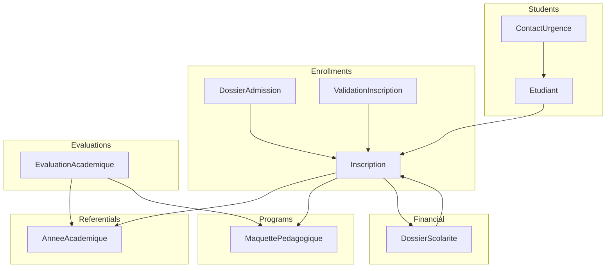
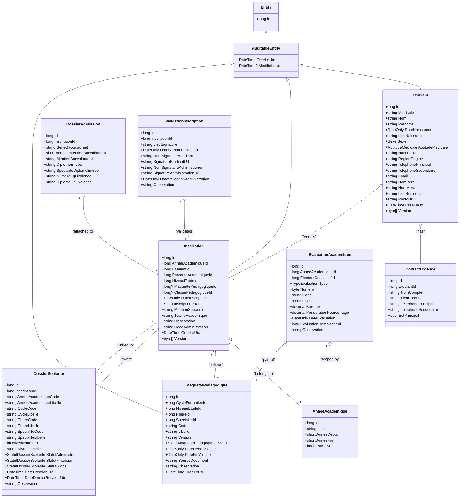
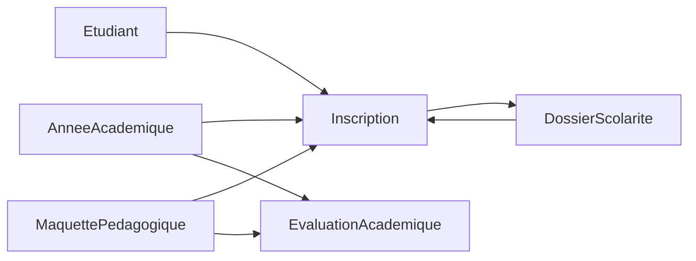

# Domain Layer

<cite>
**Referenced Files in This Document**
- [Etudiant.cs](file://RIIS.Academic.Domain/Etudiants/Etudiant.cs)
- [ContactUrgence.cs](file://RIIS.Academic.Domain/Etudiants/ContactUrgence.cs)
- [Inscription.cs](file://RIIS.Academic.Domain/Inscriptions/Inscription.cs)
- [DossierAdmission.cs](file://RIIS.Academic.Domain/Inscriptions/DossierAdmission.cs)
- [ValidationInscription.cs](file://RIIS.Academic.Domain/Inscriptions/ValidationInscription.cs)
- [MaquettePedagogique.cs](file://RIIS.Academic.Domain/Programmes/MaquettePedagogique.cs)
- [EvaluationAcademique.cs](file://RIIS.Academic.Domain/Notes/EvaluationAcademique.cs)
- [DossierScolarite.cs](file://RIIS.Academic.Domain/Scolarite/DossierScolarite.cs)
- [AnneeAcademique.cs](file://RIIS.Academic.Domain/Referentiels/AnneeAcademique.cs)
- [Entity.cs](file://RIIS.Academic.Domain/Common/Entity.cs)
- [AuditableEntity.cs](file://RIIS.Academic.Domain/Common/AuditableEntity.cs)
- [StatutInscription.cs](file://RIIS.Academic.Domain/Enums/StatutInscription.cs)
- [StatutDossierScolarite.cs](file://RIIS.Academic.Domain/Enums/StatutDossierScolarite.cs)
- [TypeEvaluation.cs](file://RIIS.Academic.Domain/Enums/TypeEvaluation.cs)
- [StatutMaquettePedagogique.cs](file://RIIS.Academic.Domain/Enums/StatutMaquettePedagogique.cs)
</cite>

## Table of Contents
1. Introduction
2. Project Structure
3. Core Components
4. Architecture Overview
5. Detailed Component Analysis
6. Dependency Analysis
7. Performance Considerations
8. Troubleshooting Guide
9. Conclusion

## Introduction
This document provides comprehensive data model documentation for the Domain Layer entities and business rules. It focuses on students (Etudiant), enrollments (Inscription), academic programs (MaquettePedagogique), evaluations (EvaluationAcademique), and financial records (DossierScolarite). It explains entity relationships, field definitions, primary and foreign keys, validation rules, domain constraints, aggregate boundaries, entity lifecycles, enumerations, value objects, and domain events where applicable. The goal is to make the domain model accessible to both technical and non-technical readers while preserving precision.

## Project Structure
The Domain Layer organizes entities by bounded contexts:
- Students: Etudiant and ContactUrgence
- Enrollments: Inscription, DossierAdmission, ValidationInscription
- Academic Programs: MaquettePedagogique and related program constructs
- Evaluations: EvaluationAcademique and associated results
- Financial Records: DossierScolarite and related payment elements
- Referentials: AnneeAcademique and other reference entities
- Common base types: Entity and AuditableEntity
- Enums: Statuses and types used across aggregates

**Diagram sources**
- [Etudiant.cs:5-27](file://RIIS.Academic.Domain/Etudiants/Etudiant.cs#L5-L27)
- [Inscription.cs:5-36](file://RIIS.Academic.Domain/Inscriptions/Inscription.cs#L5-L36)
- [MaquettePedagogique.cs:7-30](file://RIIS.Academic.Domain/Programmes/MaquettePedagogique.cs#L7-L30)
- [EvaluationAcademique.cs:5-23](file://RIIS.Academic.Domain/Notes/EvaluationAcademique.cs#L5-L23)
- [DossierScolarite.cs:5-28](file://RIIS.Academic.Domain/Scolarite/DossierScolarite.cs#L5-L28)
- [AnneeAcademique.cs:5-14](file://RIIS.Academic.Domain/Referentiels/AnneeAcademique.cs#L5-L14)

**Section sources**
- [Etudiant.cs:5-27](file://RIIS.Academic.Domain/Etudiants/Etudiant.cs#L5-L27)
- [Inscription.cs:5-36](file://RIIS.Academic.Domain/Inscriptions/Inscription.cs#L5-L36)
- [MaquettePedagogique.cs:7-30](file://RIIS.Academic.Domain/Programmes/MaquettePedagogique.cs#L7-L30)
- [EvaluationAcademique.cs:5-23](file://RIIS.Academic.Domain/Notes/EvaluationAcademique.cs#L5-L23)
- [DossierScolarite.cs:5-28](file://RIIS.Academic.Domain/Scolarite/DossierScolarite.cs#L5-L28)
- [AnneeAcademique.cs:5-14](file://RIIS.Academic.Domain/Referentiels/AnneeAcademique.cs#L5-L14)

## Core Components
This section summarizes the core domain entities with their responsibilities and key fields.

- Student (Etudiant): Identifies a student, personal details, contact information, and emergency contacts. Serves as an aggregate root for student-related data.
- Enrollment (Inscription): Represents a student’s enrollment in an academic year and program, including status and administrative metadata. Acts as an aggregate root linking to academic and financial contexts.
- Academic Program (MaquettePedagogique): Defines a pedagogical program structure within a cycle, level, stream, and specialty, with validity windows and status.
- Academic Evaluation (EvaluationAcademique): Models evaluation instances tied to an academic year and program element, including type, weighting, scheduling, and replacement relationships.
- Financial Record (DossierScolarite): Captures the financial state of an enrollment, including administrative, financial, and global statuses, plus payments and notifications.

Key base types:
- Entity: Provides a common identifier (long Id).
- AuditableEntity: Extends Entity with creation timestamp; some entities also include versioning for concurrency control.

Enumerations:
- StatutInscription: Enrollment lifecycle states.
- StatutDossierScolarite: Financial dossier lifecycle states.
- TypeEvaluation: Types of academic evaluations.
- StatutMaquettePedagogique: Lifecycle states for pedagogical programs.

**Section sources**
- [Entity.cs:4-7](file://RIIS.Academic.Domain/Common/Entity.cs#L4-L7)
- [AuditableEntity.cs:4-8](file://RIIS.Academic.Domain/Common/AuditableEntity.cs#L4-L8)
- [StatutInscription.cs:3-9](file://RIIS.Academic.Domain/Enums/StatutInscription.cs#L3-L9)
- [StatutDossierScolarite.cs:3-12](file://RIIS.Academic.Domain/Enums/StatutDossierScolarite.cs#L3-L12)
- [TypeEvaluation.cs:3-9](file://RIIS.Academic.Domain/Enums/TypeEvaluation.cs#L3-L9)
- [StatutMaquettePedagogique.cs:3-8](file://RIIS.Academic.Domain/Enums/StatutMaquettePedagogique.cs#L3-L8)

## Architecture Overview
The domain follows DDD principles:
- Aggregates: Each major entity acts as an aggregate root, encapsulating related invariants and enforcing consistency within its boundary.
- Value Objects: Enumerations represent constrained values (statuses, types).
- Relationships: Foreign keys link aggregates via identifiers; navigation properties express relationships without leaking persistence concerns.
- Lifecycle Management: Status enums drive state transitions and business rules.

**Diagram sources**
- [Etudiant.cs:5-27](file://RIIS.Academic.Domain/Etudiants/Etudiant.cs#L5-L27)
- [ContactUrgence.cs:5-14](file://RIIS.Academic.Domain/Etudiants/ContactUrgence.cs#L5-L14)
- [Inscription.cs:5-36](file://RIIS.Academic.Domain/Inscriptions/Inscription.cs#L5-L36)
- [DossierAdmission.cs:5-16](file://RIIS.Academic.Domain/Inscriptions/DossierAdmission.cs#L5-L16)
- [ValidationInscription.cs:5-17](file://RIIS.Academic.Domain/Inscriptions/ValidationInscription.cs#L5-L17)
- [MaquettePedagogique.cs:7-30](file://RIIS.Academic.Domain/Programmes/MaquettePedagogique.cs#L7-L30)
- [EvaluationAcademique.cs:5-23](file://RIIS.Academic.Domain/Notes/EvaluationAcademique.cs#L5-L23)
- [DossierScolarite.cs:5-28](file://RIIS.Academic.Domain/Scolarite/DossierScolarite.cs#L5-L28)
- [AnneeAcademique.cs:5-14](file://RIIS.Academic.Domain/Referentiels/AnneeAcademique.cs#L5-L14)
- [Entity.cs:4-7](file://RIIS.Academic.Domain/Common/Entity.cs#L4-L7)
- [AuditableEntity.cs:4-8](file://RIIS.Academic.Domain/Common/AuditableEntity.cs#L4-L8)

## Detailed Component Analysis

### Student Aggregate (Etudiant)
- Purpose: Model a student’s identity, demographics, and emergency contacts.
- Primary Key: long Id.
- Important Fields:
  - Matricule: Unique student identifier (business key).
  - Nom, Prenoms: Required name components.
  - DateNaissance, LieuNaissance: Birth date and place.
  - Sexe, AptitudeMedicale, Nationalite: Demographic attributes.
  - TelephonePrincipal, TelephoneSecondaire, Email: Contact details.
  - NomPere, NomMere, LieuResidence, PhotoUrl: Additional personal data.
  - CreeLeUtc, Version: Audit and concurrency control.
- Relationships:
  - One-to-many with ContactUrgence.
  - One-to-many with Inscription (via EtudiantId).
- Business Rules:
  - Emergency contact must be provided; at least one marked principal is expected.
  - Contact details should be validated for format and reachability.
- Lifecycle:
  - Created once; updated as personal or contact info changes.
- Concurrency:
  - Optimistic concurrency using byte[] Version.

**Section sources**
- [Etudiant.cs:5-27](file://RIIS.Academic.Domain/Etudiants/Etudiant.cs#L5-L27)
- [ContactUrgence.cs:5-14](file://RIIS.Academic.Domain/Etudiants/ContactUrgence.cs#L5-L14)

### Enrollment Aggregate (Inscription)
- Purpose: Represent a student’s enrollment in a specific academic year and program, capturing administrative and academic context.
- Primary Key: long Id.
- Foreign Keys:
  - AnneeAcademiqueId: Links to academic year.
  - EtudiantId: Links to student.
  - ParcoursAcademiqueId, NiveauEtudeId: Academic pathway and level.
  - MaquettePedagogiqueId, ClassePedagogiqueId: Optional program and class assignment.
- Important Fields:
  - DateInscription: Enrollment date.
  - Statut: Enrollment status from StatutInscription.
  - MentionSpeciale, TutelleAcademique, Observation, CodeAdministration: Administrative metadata.
  - CreeLeUtc, Version: Audit and concurrency control.
- Relationships:
  - Many-to-one with AnneeAcademique, Etudiant, ParcoursAcademique, NiveauEtude.
  - Optional many-to-one with MaquettePedagogique, ClassePedagogique.
  - One-to-one with DossierAdmission, ValidationInscription.
  - One-to-one with DossierScolarite.
  - One-to-many with evaluation results and notes.
- Business Rules:
  - Enrollment status transitions governed by StatutInscription.
  - Validity of program and level must align with academic year.
  - Administrative code may be required for processing.
- Lifecycle:
  - Starts in EnAttente, can transition to Validee, Suspendue, or Annulee based on validations and administrative actions.

**Section sources**
- [Inscription.cs:5-36](file://RIIS.Academic.Domain/Inscriptions/Inscription.cs#L5-L36)
- [StatutInscription.cs:3-9](file://RIIS.Academic.Domain/Enums/StatutInscription.cs#L3-L9)

### Academic Program (MaquettePedagogique)
- Purpose: Define a pedagogical program structure for a cycle, level, stream, and specialty, with validity windows and status.
- Primary Key: long Id.
- Foreign Keys:
  - CycleFormationId, NiveauEtudeId, FiliereId, SpecialiteId: Contextual references.
- Important Fields:
  - Code, Libelle, Version: Program identity and versioning.
  - Statut: Program status from StatutMaquettePedagogique.
  - DateDebutValidite, DateFinValidite: Validity period.
  - SourceDocument, Observation: Supporting documentation and notes.
  - CreeLeUtc: Creation timestamp.
- Relationships:
  - One-to-many with SemestrePedagogique (not shown here).
  - One-to-many with Inscription (students enrolled under this program).
- Business Rules:
  - Program must be Active to accept new enrollments.
  - Validity window constrains enrollment eligibility.
  - Versioning supports evolution of curriculum over time.

**Section sources**
- [MaquettePedagogique.cs:7-30](file://RIIS.Academic.Domain/Programmes/MaquettePedagogique.cs#L7-L30)
- [StatutMaquettePedagogique.cs:3-8](file://RIIS.Academic.Domain/Enums/StatutMaquettePedagogique.cs#L3-L8)

### Academic Evaluation (EvaluationAcademique)
- Purpose: Model evaluation instances within an academic year and program element, supporting different evaluation types and replacements.
- Primary Key: long Id.
- Foreign Keys:
  - AnneeAcademiqueId: Scope to academic year.
  - ElementConstitutifId: Links to program component.
  - EvaluationRemplaceeId: Self-reference for replacement evaluations.
- Important Fields:
  - Type: From TypeEvaluation (e.g., continuous assessment, knowledge test, normal session, makeup session).
  - Numero: Sequence number among evaluations.
  - Code, Libelle: Identification and description.
  - Bareme: Maximum score scale.
  - PonderationPourcentage: Weight percentage for grading.
  - DateEvaluation: Scheduled date.
  - Observation: Notes.
- Relationships:
  - Many-to-one with AnneeAcademique and ElementConstitutif.
  - Self-referential replacement relationship.
  - One-to-many with NoteEvaluation (grades).
- Business Rules:
  - Replacement evaluations must not overlap with original sessions unless permitted.
  - Weights must sum appropriately per program element.
  - Dates must be valid relative to academic calendar.

**Section sources**
- [EvaluationAcademique.cs:5-23](file://RIIS.Academic.Domain/Notes/EvaluationAcademique.cs#L5-L23)
- [TypeEvaluation.cs:3-9](file://RIIS.Academic.Domain/Enums/TypeEvaluation.cs#L3-L9)

### Financial Record (DossierScolarite)
- Purpose: Capture the financial state of an enrollment, including administrative, financial, and global statuses, along with payments and notifications.
- Primary Key: long Id.
- Foreign Keys:
  - InscriptionId: Links to enrollment.
- Important Fields:
  - AnneeAcademiqueCode, AnneeAcademiqueLibelle: Denormalized academic year context.
  - CycleCode, CycleLibelle, FiliereCode, FiliereLibelle, SpecialiteCode, SpecialiteLibelle: Denormalized program context.
  - NiveauNumero, NiveauLibelle: Level identification.
  - StatutAdministratif, StatutFinancier, StatutGlobal: Multi-dimensional statuses from StatutDossierScolarite.
  - DateCreationUtc, DateDernierRecalculUtc: Lifecycle timestamps.
  - Observation: Notes.
- Relationships:
  - One-to-one with Inscription.
  - One-to-many with ElementScolariteEtudiant, PaiementScolarite, NotificationScolarite.
- Business Rules:
  - Global status derived from administrative and financial statuses.
  - Recalculation triggered by payment or element changes.
  - Notifications sent based on status transitions.

**Section sources**
- [DossierScolarite.cs:5-28](file://RIIS.Academic.Domain/Scolarite/DossierScolarite.cs#L5-L28)
- [StatutDossierScolarite.cs:3-12](file://RIIS.Academic.Domain/Enums/StatutDossierScolarite.cs#L3-L12)

### Referential Entity (AnneeAcademique)
- Purpose: Define an academic year with active flag and label.
- Primary Key: long Id.
- Important Fields:
  - Libelle: Display name.
  - AnneeDebut, AnneeFin: Year range.
  - EstActive: Indicates current active year.
- Relationships:
  - One-to-many with ParcoursAcademique, ClassePedagogique, Inscription.

**Section sources**
- [AnneeAcademique.cs:5-14](file://RIIS.Academic.Domain/Referentiels/AnneeAcademique.cs#L5-L14)

### Admission and Validation Entities
- DossierAdmission: Stores admission details linked to an enrollment (e.g., baccalaureate series, year, mention, diplomas, equivalence).
- ValidationInscription: Captures signatures and administrative validation dates for enrollment.

**Section sources**
- [DossierAdmission.cs:5-16](file://RIIS.Academic.Domain/Inscriptions/DossierAdmission.cs#L5-L16)
- [ValidationInscription.cs:5-17](file://RIIS.Academic.Domain/Inscriptions/ValidationInscription.cs#L5-L17)

## Dependency Analysis
The domain exhibits clear aggregate boundaries and dependency directions:
- Etudiant depends on no external aggregates except through collections.
- Inscription depends on AnneeAcademique, Etudiant, and optionally MaquettePedagogique and ClassePedagogique.
- DossierScolarite depends on Inscription and maintains denormalized context for reporting.
- EvaluationAcademique depends on AnneeAcademique and program elements.
- Base types (Entity, AuditableEntity) are shared foundations.

**Diagram sources**
- [Inscription.cs:5-36](file://RIIS.Academic.Domain/Inscriptions/Inscription.cs#L5-L36)
- [DossierScolarite.cs:5-28](file://RIIS.Academic.Domain/Scolarite/DossierScolarite.cs#L5-L28)
- [EvaluationAcademique.cs:5-23](file://RIIS.Academic.Domain/Notes/EvaluationAcademique.cs#L5-L23)
- [AnneeAcademique.cs:5-14](file://RIIS.Academic.Domain/Referentiels/AnneeAcademique.cs#L5-L14)
- [MaquettePedagogique.cs:7-30](file://RIIS.Academic.Domain/Programmes/MaquettePedagogique.cs#L7-L30)

**Section sources**
- [Inscription.cs:5-36](file://RIIS.Academic.Domain/Inscriptions/Inscription.cs#L5-L36)
- [DossierScolarite.cs:5-28](file://RIIS.Academic.Domain/Scolarite/DossierScolarite.cs#L5-L28)
- [EvaluationAcademique.cs:5-23](file://RIIS.Academic.Domain/Notes/EvaluationAcademique.cs#L5-L23)
- [AnneeAcademique.cs:5-14](file://RIIS.Academic.Domain/Referentiels/AnneeAcademique.cs#L5-L14)
- [MaquettePedagogique.cs:7-30](file://RIIS.Academic.Domain/Programmes/MaquettePedagogique.cs#L7-L30)

## Performance Considerations
- Use denormalized fields in DossierScolarite (codes and libelles) to reduce joins for reporting queries.
- Index foreign keys (e.g., Inscription.EtudiantId, Inscription.MaquettePedagogiqueId, DossierScolarite.InscriptionId) for efficient lookups.
- Apply optimistic concurrency (Version) to prevent lost updates during concurrent edits.
- Keep evaluation weights and bareme consistent to avoid expensive recalculations.

[No sources needed since this section provides general guidance]

## Troubleshooting Guide
Common issues and resolutions:
- Invalid enrollment status transitions: Ensure StatutInscription transitions follow business rules (e.g., cannot move directly from Annulee to Validee without reprocessing).
- Financial status inconsistencies: Verify that StatutAdministratif and StatutFinancier correctly derive StatutGlobal; trigger recalculation when payments change.
- Evaluation conflicts: Check for overlapping dates and ensure replacement evaluations do not conflict with originals.
- Concurrency conflicts: Handle Version mismatches by refreshing the entity and retrying operations.

**Section sources**
- [StatutInscription.cs:3-9](file://RIIS.Academic.Domain/Enums/StatutInscription.cs#L3-L9)
- [StatutDossierScolarite.cs:3-12](file://RIIS.Academic.Domain/Enums/StatutDossierScolarite.cs#L3-L12)
- [EvaluationAcademique.cs:5-23](file://RIIS.Academic.Domain/Notes/EvaluationAcademique.cs#L5-L23)
- [DossierScolarite.cs:5-28](file://RIIS.Academic.Domain/Scolarite/DossierScolarite.cs#L5-L28)

## Conclusion
The Domain Layer models a robust academic system with clear aggregate boundaries and well-defined relationships. Students, enrollments, programs, evaluations, and financial records are interconnected through foreign keys and status-driven workflows. Enumerations constrain behavior, while base types provide auditability and concurrency control. This design supports scalable, maintainable business logic aligned with domain-driven principles.

[No sources needed since this section summarizes without analyzing specific files]