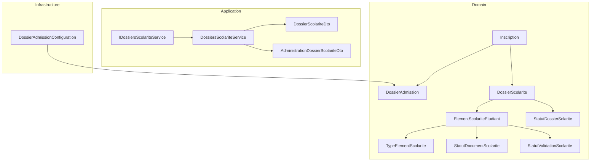
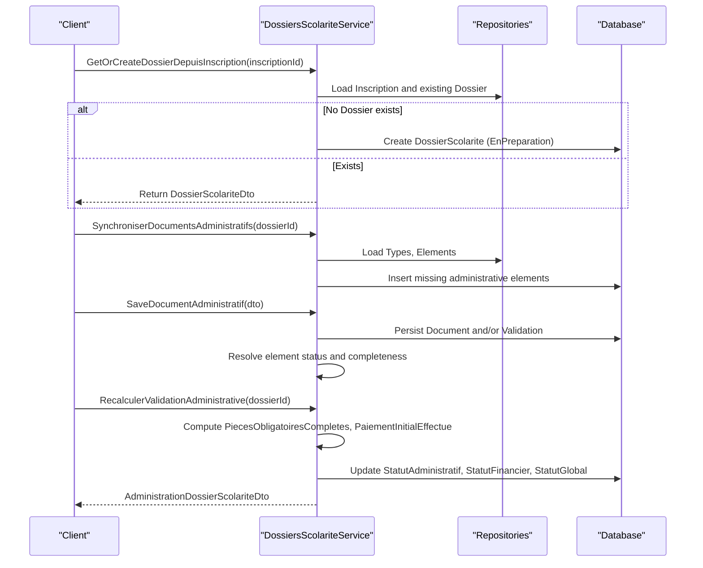
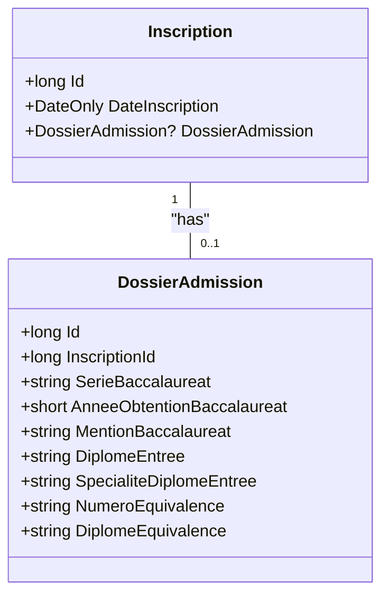
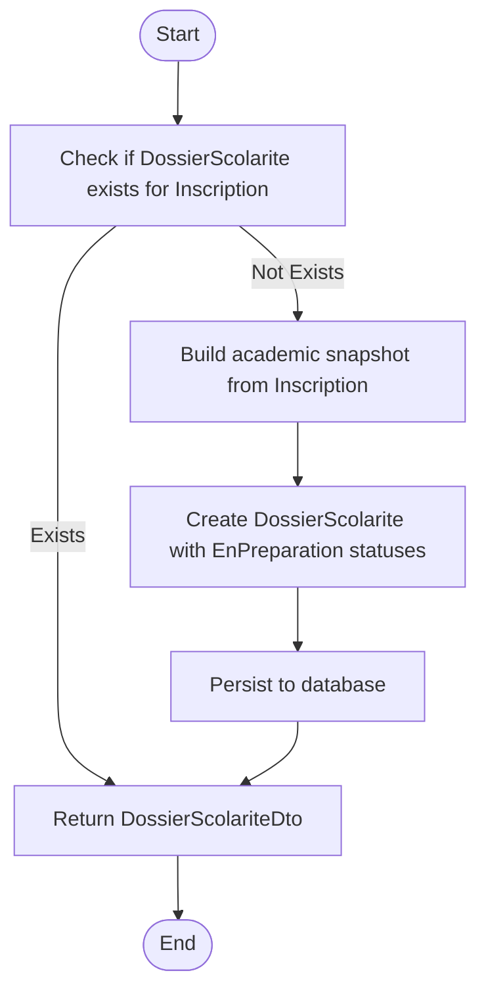
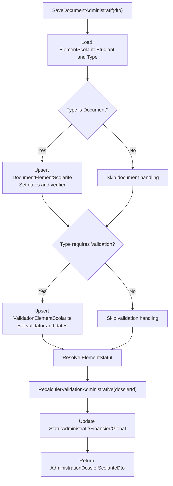
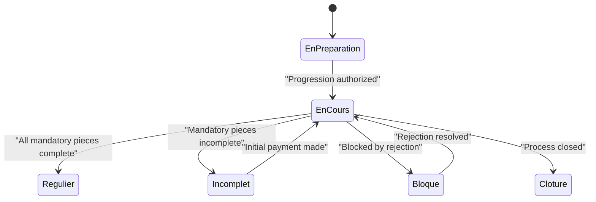
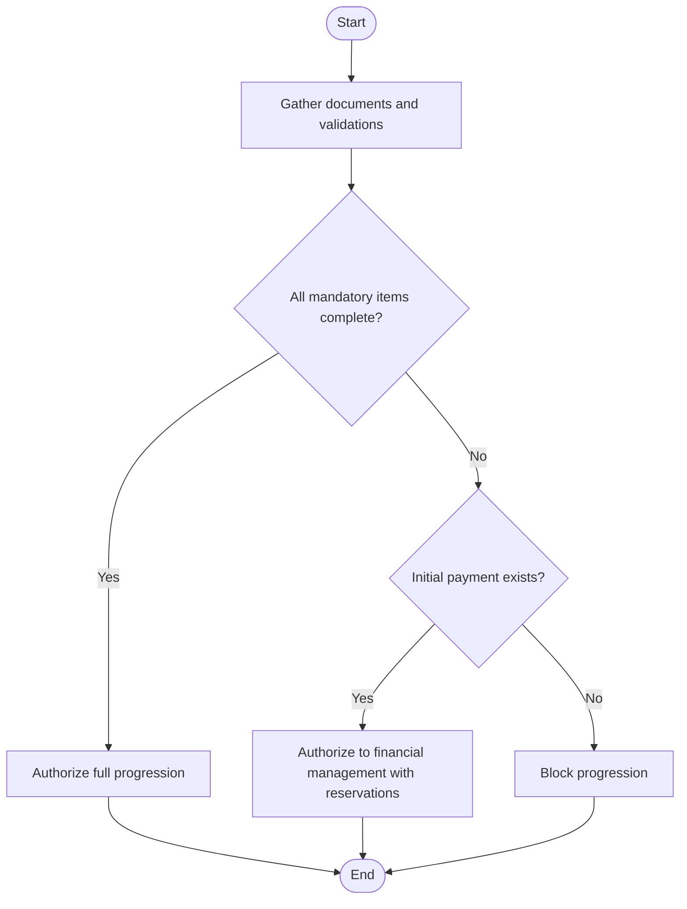
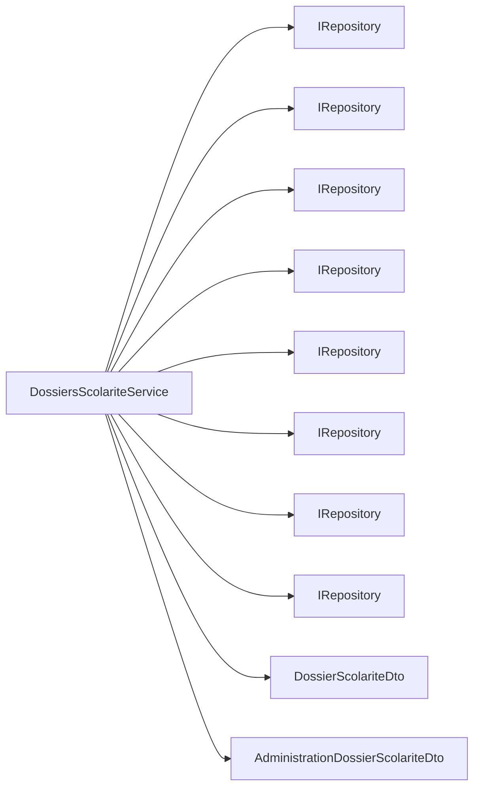

# Admission Process

<cite>
**Referenced Files in This Document**
- [DossierAdmission.cs](file://RIIS.Academic.Domain/Inscriptions/DossierAdmission.cs)
- [Inscription.cs](file://RIIS.Academic.Domain/Inscriptions/Inscription.cs)
- [DossierScolarite.cs](file://RIIS.Academic.Domain/Scolarite/DossierScolarite.cs)
- [ElementScolariteEtudiant.cs](file://RIIS.Academic.Domain/Scolarite/ElementScolariteEtudiant.cs)
- [TypeElementScolarite.cs](file://RIIS.Academic.Domain/Scolarite/TypeElementScolarite.cs)
- [StatutDossierScolarite.cs](file://RIIS.Academic.Domain/Enums/StatutDossierScolarite.cs)
- [StatutDocumentScolarite.cs](file://RIIS.Academic.Domain/Enums/StatutDocumentScolarite.cs)
- [StatutValidationScolarite.cs](file://RIIS.Academic.Domain/Enums/StatutValidationScolarite.cs)
- [DossiersScolariteService.cs](file://RIIS.Academic.Application/Scolarite/Services/DossiersScolariteService.cs)
- [IDossiersScolariteService.cs](file://RIIS.Academic.Application/Scolarite/Services/IDossiersScolariteService.cs)
- [DossierScolariteDto.cs](file://RIIS.Academic.Application/Scolarite/Dtos/DossierScolariteDto.cs)
- [AdministrationDossierScolariteDto.cs](file://RIIS.Academic.Application/Scolarite/Dtos/AdministrationDossierScolariteDto.cs)
- [DossierAdmissionConfiguration.cs](file://RIIS.Academic.Infrastructure/Persistence/Configurations/Inscriptions/DossierAdmissionConfiguration.cs)
</cite>

## Table of Contents
1. Introduction
2. Project Structure
3. Core Components
4. Architecture Overview
5. Detailed Component Analysis
6. Dependency Analysis
7. Performance Considerations
8. Troubleshooting Guide
9. Conclusion

## Introduction
This document explains the admission workflow centered on the DossierAdmission entity and its integration with student enrollment (Inscription) and school records (DossierScolarite). It covers:
- Creation and management of admission dossiers
- Required documents and eligibility criteria
- Approval processes and decision-making logic
- Status transitions via StatutDossierScolarite
- Examples for application processing, document verification, and acceptance/rejection scenarios

## Project Structure
The admission process spans Domain, Application, and Infrastructure layers:
- Domain defines entities and enumerations that model admission data and statuses
- Application orchestrates workflows through services and DTOs
- Infrastructure configures persistence and relationships

**Diagram sources**
- [Inscription.cs:1-37](file://RIIS.Academic.Domain/Inscriptions/Inscription.cs#L1-L37)
- [DossierAdmission.cs:1-17](file://RIIS.Academic.Domain/Inscriptions/DossierAdmission.cs#L1-L17)
- [DossierScolarite.cs:1-29](file://RIIS.Academic.Domain/Scolarite/DossierScolarite.cs#L1-L29)
- [ElementScolariteEtudiant.cs:1-26](file://RIIS.Academic.Domain/Scolarite/ElementScolariteEtudiant.cs#L1-L26)
- [TypeElementScolarite.cs:1-19](file://RIIS.Academic.Domain/Scolarite/TypeElementScolarite.cs#L1-L19)
- [StatutDossierScolarite.cs:1-13](file://RIIS.Academic.Domain/Enums/StatutDossierScolarite.cs#L1-L13)
- [StatutDocumentScolarite.cs:1-11](file://RIIS.Academic.Domain/Enums/StatutDocumentScolarite.cs#L1-L11)
- [StatutValidationScolarite.cs:1-10](file://RIIS.Academic.Domain/Enums/StatutValidationScolarite.cs#L1-L10)
- [IDossiersScolariteService.cs:1-41](file://RIIS.Academic.Application/Scolarite/Services/IDossiersScolariteService.cs#L1-L41)
- [DossiersScolariteService.cs:1-614](file://RIIS.Academic.Application/Scolarite/Services/DossiersScolariteService.cs#L1-L614)
- [DossierAdmissionConfiguration.cs:1-28](file://RIIS.Academic.Infrastructure/Persistence/Configurations/Inscriptions/DossierAdmissionConfiguration.cs#L1-L28)

**Section sources**
- [Inscription.cs:1-37](file://RIIS.Academic.Domain/Inscriptions/Inscription.cs#L1-L37)
- [DossierAdmission.cs:1-17](file://RIIS.Academic.Domain/Inscriptions/DossierAdmission.cs#L1-L17)
- [DossierScolarite.cs:1-29](file://RIIS.Academic.Domain/Scolarite/DossierScolarite.cs#L1-L29)
- [DossiersScolariteService.cs:1-614](file://RIIS.Academic.Application/Scolarite/Services/DossiersScolariteService.cs#L1-L614)
- [DossierAdmissionConfiguration.cs:1-28](file://RIIS.Academic.Infrastructure/Persistence/Configurations/Inscriptions/DossierAdmissionConfiguration.cs#L1-L28)

## Core Components
- Inscription: Represents a student’s enrollment for an academic year and program; links to DossierAdmission and DossierScolarite.
- DossierAdmission: Stores admission-specific details such as baccalaureate series, year, mention, entry diploma, and equivalence information; one-to-one with Inscription.
- DossierScolarite: Captures administrative, financial, and global status snapshots per enrollment; drives eligibility and progression authorization.
- ElementScolariteEtudiant and TypeElementScolarite: Model required or optional administrative items (documents and validations) tied to a dossier.
- Service layer (DossiersScolariteService): Orchestrates creation of dossiers from inscriptions, synchronization of administrative elements, saving documents/validations, and recalculating overall statuses.

Key responsibilities:
- Create or retrieve a DossierScolarite for an Inscription
- Synchronize administrative elements based on configured types
- Save document submissions and validation decisions
- Recalculate administrative, financial, and global statuses based on completeness and payments

**Section sources**
- [Inscription.cs:1-37](file://RIIS.Academic.Domain/Inscriptions/Inscription.cs#L1-L37)
- [DossierAdmission.cs:1-17](file://RIIS.Academic.Domain/Inscriptions/DossierAdmission.cs#L1-L17)
- [DossierScolarite.cs:1-29](file://RIIS.Academic.Domain/Scolarite/DossierScolarite.cs#L1-L29)
- [ElementScolariteEtudiant.cs:1-26](file://RIIS.Academic.Domain/Scolarite/ElementScolariteEtudiant.cs#L1-L26)
- [TypeElementScolarite.cs:1-19](file://RIIS.Academic.Domain/Scolarite/TypeElementScolarite.cs#L1-L19)
- [DossiersScolariteService.cs:1-614](file://RIIS.Academic.Application/Scolarite/Services/DossiersScolariteService.cs#L1-L614)

## Architecture Overview
The admission workflow is service-driven:
- GetOrCreateDossierDepuisInscriptionAsync creates a DossierScolarite snapshot from an Inscription when missing
- SynchroniserDocumentsAdministratifsAsync populates required administrative elements based on active TypeElementScolarite definitions
- SaveDocumentAdministratifAsync persists document uploads and/or validation decisions
- RecalculerValidationAdministrativeAsync recomputes administrative, financial, and global statuses

**Diagram sources**
- [DossiersScolariteService.cs:128-275](file://RIIS.Academic.Application/Scolarite/Services/DossiersScolariteService.cs#L128-L275)
- [DossiersScolariteService.cs:277-317](file://RIIS.Academic.Application/Scolarite/Services/DossiersScolariteService.cs#L277-L317)
- [DossiersScolariteService.cs:344-395](file://RIIS.Academic.Application/Scolarite/Services/DossiersScolariteService.cs#L344-L395)

## Detailed Component Analysis

### DossierAdmission Entity
- Purpose: Stores admission credentials and equivalences linked to an Inscription
- Key fields: Baccalaureate series/year/mention, entry diploma and specialty, equivalence number/diploma
- Relationship: One-to-one with Inscription; unique index on InscriptionId ensures single admission record per enrollment
- Constraints: Year-of-baccalaureat validated within a reasonable range

**Diagram sources**
- [Inscription.cs:1-37](file://RIIS.Academic.Domain/Inscriptions/Inscription.cs#L1-L37)
- [DossierAdmission.cs:1-17](file://RIIS.Academic.Domain/Inscriptions/DossierAdmission.cs#L1-L17)
- [DossierAdmissionConfiguration.cs:10-25](file://RIIS.Academic.Infrastructure/Persistence/Configurations/Inscriptions/DossierAdmissionConfiguration.cs#L10-L25)

**Section sources**
- [DossierAdmission.cs:1-17](file://RIIS.Academic.Domain/Inscriptions/DossierAdmission.cs#L1-L17)
- [DossierAdmissionConfiguration.cs:1-28](file://RIIS.Academic.Infrastructure/Persistence/Configurations/Inscriptions/DossierAdmissionConfiguration.cs#L1-L28)

### Enrollment to School Record Transition
- GetOrCreateDossierDepuisInscriptionAsync:
  - Ensures a DossierScolarite exists for the given Inscription
  - Creates a snapshot of academic context (year, cycle, filiere, speciality, level)
  - Initializes statuses to EnPreparation

- BuildAdministrationDtoAsync:
  - Aggregates administrative elements and their documents/validations
  - Computes whether all mandatory pieces are complete and whether an initial payment exists
  - Derives authorization reason for proceeding

**Diagram sources**
- [DossiersScolariteService.cs:277-317](file://RIIS.Academic.Application/Scolarite/Services/DossiersScolariteService.cs#L277-L317)
- [DossiersScolariteService.cs:344-395](file://RIIS.Academic.Application/Scolarite/Services/DossiersScolariteService.cs#L344-L395)

**Section sources**
- [DossiersScolariteService.cs:277-317](file://RIIS.Academic.Application/Scolarite/Services/DossiersScolariteService.cs#L277-L317)
- [DossiersScolariteService.cs:344-395](file://RIIS.Academic.Application/Scolarite/Services/DossiersScolariteService.cs#L344-L395)

### Administrative Documents and Validations
- SynchroniserDocumentsAdministratifsAsync:
  - Loads active administrative types (document-based or validation-based)
  - Inserts missing ElementScolariteEtudiant entries per dossier
  - Sets initial element status based on type requirements

- SaveDocumentAdministratifAsync:
  - Persists document metadata and status (deposited, validated, rejected)
  - Persists validation decisions (approved, rejected, canceled)
  - Updates timestamps for deposit and verification when applicable
  - Recomputes element status and triggers administrative recalculation

- IsAdministrativeItemComplete and ResolveElementStatut:
  - Determine completeness based on document and validation states
  - Block element if any rejection occurs; otherwise mark as valid, partial, pending, or not applicable

**Diagram sources**
- [DossiersScolariteService.cs:164-252](file://RIIS.Academic.Application/Scolarite/Services/DossiersScolariteService.cs#L164-L252)
- [DossiersScolariteService.cs:527-567](file://RIIS.Academic.Application/Scolarite/Services/DossiersScolariteService.cs#L527-L567)

**Section sources**
- [DossiersScolariteService.cs:128-162](file://RIIS.Academic.Application/Scolarite/Services/DossiersScolariteService.cs#L128-L162)
- [DossiersScolariteService.cs:164-252](file://RIIS.Academic.Application/Scolarite/Services/DossiersScolariteService.cs#L164-L252)
- [DossiersScolariteService.cs:527-567](file://RIIS.Academic.Application/Scolarite/Services/DossiersScolariteService.cs#L527-L567)

### Status Transitions and Decision Logic
- StatutDossierScolarite values: EnPreparation, EnCours, Regulier, Incomplet, EnRetard, Bloque, Cloture
- RecalculerValidationAdministrativeAsync sets:
  - StatutAdministratif: Regulier if all mandatory pieces complete; otherwise Incomplet
  - StatutFinancier: EnCours if initial payment exists; otherwise EnPreparation
  - StatutGlobal: EnCours if progression authorized (mandatory pieces complete OR initial payment); otherwise Incomplet

**Diagram sources**
- [StatutDossierScolarite.cs:1-13](file://RIIS.Academic.Domain/Enums/StatutDossierScolarite.cs#L1-L13)
- [DossiersScolariteService.cs:254-275](file://RIIS.Academic.Application/Scolarite/Services/DossiersScolariteService.cs#L254-L275)

**Section sources**
- [StatutDossierScolarite.cs:1-13](file://RIIS.Academic.Domain/Enums/StatutDossierScolarite.cs#L1-L13)
- [DossiersScolariteService.cs:254-275](file://RIIS.Academic.Application/Scolarite/Services/DossiersScolariteService.cs#L254-L275)

### Eligibility Criteria and Approval Workflow
- Eligibility hinges on:
  - Completeness of mandatory administrative items (documents and/or validations)
  - Existence of at least one active initial payment
- Authorization reason is derived from:
  - Full completion of mandatory pieces
  - Or presence of initial payment allowing transition to financial management with reservations
- Rejections block elements and can prevent progression until resolved

**Diagram sources**
- [DossiersScolariteService.cs:344-395](file://RIIS.Academic.Application/Scolarite/Services/DossiersScolariteService.cs#L344-L395)
- [DossiersScolariteService.cs:569-582](file://RIIS.Academic.Application/Scolarite/Services/DossiersScolariteService.cs#L569-L582)

**Section sources**
- [DossiersScolariteService.cs:344-395](file://RIIS.Academic.Application/Scolarite/Services/DossiersScolariteService.cs#L344-L395)
- [DossiersScolariteService.cs:569-582](file://RIIS.Academic.Application/Scolarite/Services/DossiersScolariteService.cs#L569-L582)

### Examples

- Admission application processing:
  - Call GetOrCreateDossierDepuisInscriptionAsync to ensure a DossierScolarite exists for an Inscription
  - Use GetDossierScolariteAsync to inspect current statuses and context

- Document verification:
  - Call SynchroniserDocumentsAdministratifsAsync to populate required administrative elements
  - Call SaveDocumentAdministratifAsync to submit documents and/or validation decisions
  - Observe updated element statuses and completeness flags

- Acceptance/rejection scenarios:
  - If all mandatory pieces are complete, StatutAdministratif becomes Regulier and StatutGlobal moves to EnCours
  - If a document or validation is rejected, the element becomes blocked and progression may be prevented until corrected
  - If no initial payment exists and mandatory pieces are incomplete, StatutGlobal remains Incomplet

**Section sources**
- [DossiersScolariteService.cs:95-126](file://RIIS.Academic.Application/Scolarite/Services/DossiersScolariteService.cs#L95-L126)
- [DossiersScolariteService.cs:128-162](file://RIIS.Academic.Application/Scolarite/Services/DossiersScolariteService.cs#L128-L162)
- [DossiersScolariteService.cs:164-252](file://RIIS.Academic.Application/Scolarite/Services/DossiersScolariteService.cs#L164-L252)
- [DossiersScolariteService.cs:254-275](file://RIIS.Academic.Application/Scolarite/Services/DossiersScolariteService.cs#L254-L275)

## Dependency Analysis
- Service depends on repositories for:
  - DossierScolarite, Inscription, Etudiant, AnneeAcademique, ParcoursAcademique, CycleFormation, Filiere, Specialite, NiveauEtude
  - TypeElementScolarite, ElementScolariteEtudiant, DocumentElementScolarite, ValidationElementScolarite, PaiementScolarite
- DTOs expose computed state for UI and downstream processes
- Configuration enforces constraints and relationships for DossierAdmission

**Diagram sources**
- [DossiersScolariteService.cs:7-21](file://RIIS.Academic.Application/Scolarite/Services/DossiersScolariteService.cs#L7-L21)
- [DossierScolariteDto.cs:1-30](file://RIIS.Academic.Application/Scolarite/Dtos/DossierScolariteDto.cs#L1-L30)
- [AdministrationDossierScolariteDto.cs:1-43](file://RIIS.Academic.Application/Scolarite/Dtos/AdministrationDossierScolariteDto.cs#L1-L43)

**Section sources**
- [DossiersScolariteService.cs:7-21](file://RIIS.Academic.Application/Scolarite/Services/DossiersScolariteService.cs#L7-L21)
- [DossierScolariteDto.cs:1-30](file://RIIS.Academic.Application/Scolarite/Dtos/DossierScolariteDto.cs#L1-L30)
- [AdministrationDossierScolariteDto.cs:1-43](file://RIIS.Academic.Application/Scolarite/Dtos/AdministrationDossierScolariteDto.cs#L1-L43)

## Performance Considerations
- Batch loading: The service loads reference contexts once per operation to avoid repeated queries
- Filtering: Queries apply normalized filters for search and codes to reduce result sets early
- Recalculation scope: Administrative recalculations operate on a single dossier’s elements and related documents/validations
- Timestamp updates: Only set deposit/verification/validation timestamps when statuses change to minimize writes

[No sources needed since this section provides general guidance]

## Troubleshooting Guide
Common issues and resolutions:
- Missing DossierScolarite: Ensure GetOrCreateDossierDepuisInscriptionAsync is called before administrative operations
- Empty administrative elements: Run SynchroniserDocumentsAdministratifsAsync to populate required items based on active types
- Blocked progression due to rejections: Review document or validation statuses; resolve rejections and recalculate
- Incorrect statuses after updates: Invoke RecalculerValidationAdministrativeAsync to refresh StatutAdministratif, StatutFinancier, and StatutGlobal

**Section sources**
- [DossiersScolariteService.cs:128-162](file://RIIS.Academic.Application/Scolarite/Services/DossiersScolariteService.cs#L128-L162)
- [DossiersScolariteService.cs:164-252](file://RIIS.Academic.Application/Scolarite/Services/DossiersScolariteService.cs#L164-L252)
- [DossiersScolariteService.cs:254-275](file://RIIS.Academic.Application/Scolarite/Services/DossiersScolariteService.cs#L254-L275)

## Conclusion
The admission workflow integrates DossierAdmission with Inscription and DossierScolarite to manage eligibility, documentation, and approvals. The service layer enforces business rules around mandatory documents and validations, computes authorization reasons, and maintains consistent statuses across administrative, financial, and global dimensions. By following the documented steps—creating dossiers, synchronizing administrative elements, submitting documents/validations, and recalculating statuses—administrators can reliably process admissions, verify documents, and make informed acceptance or rejection decisions.

[No sources needed since this section summarizes without analyzing specific files]