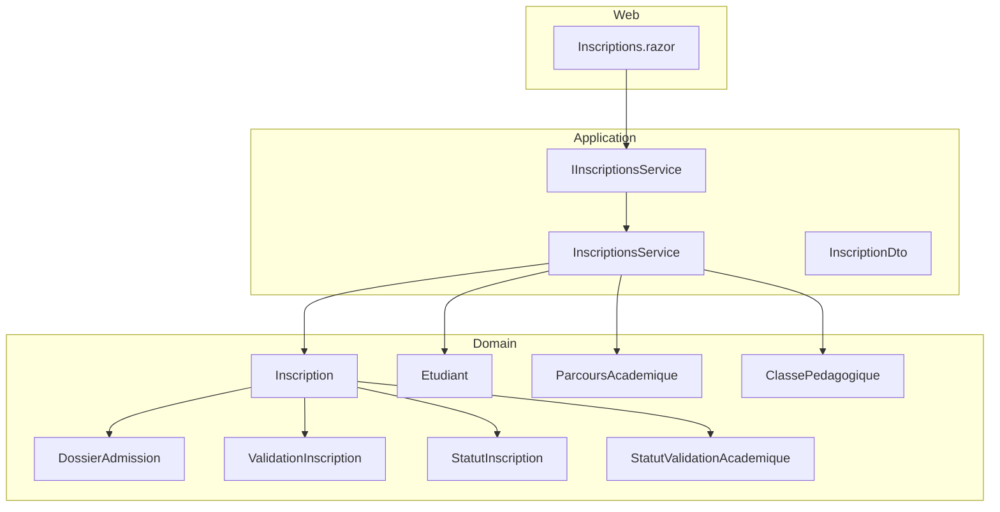
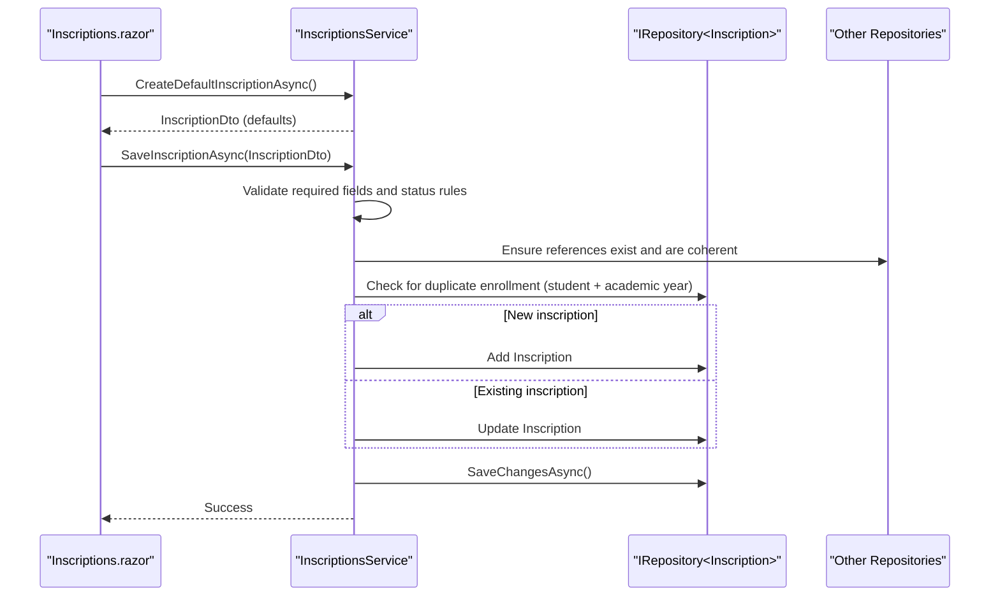
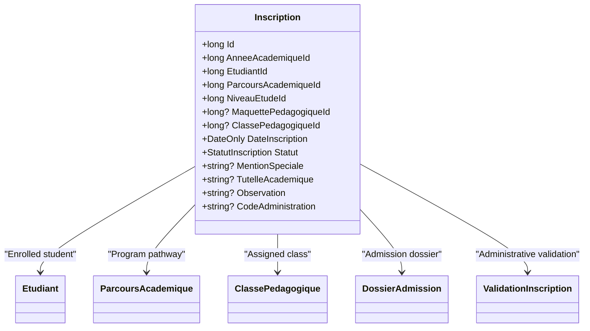
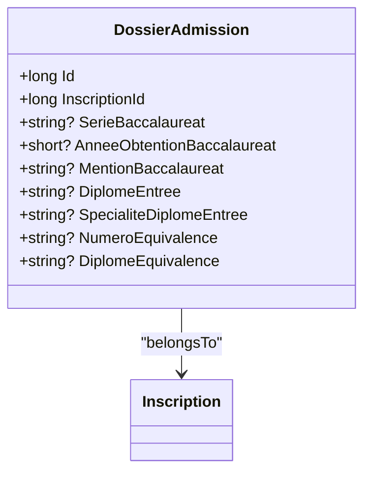
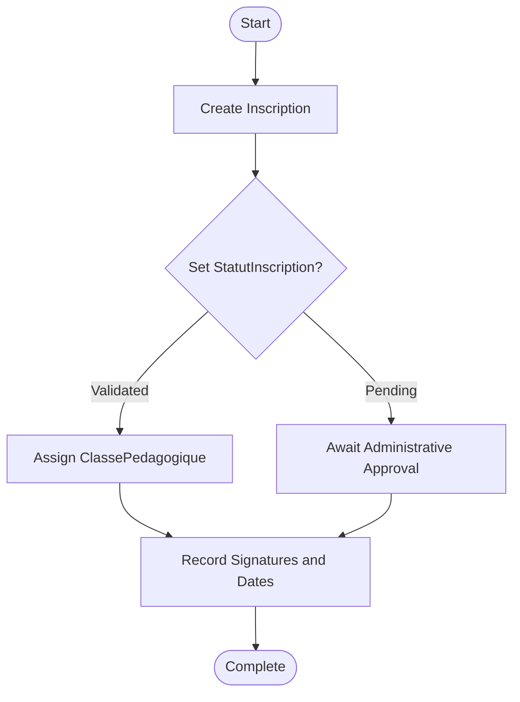
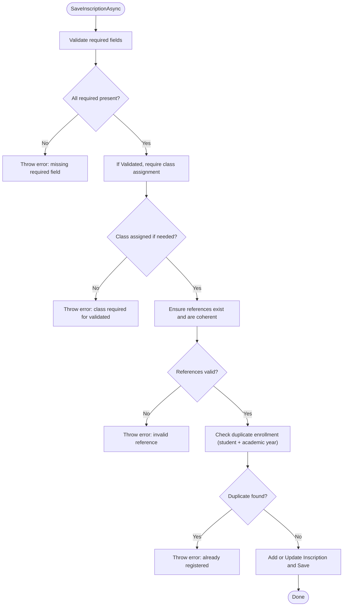
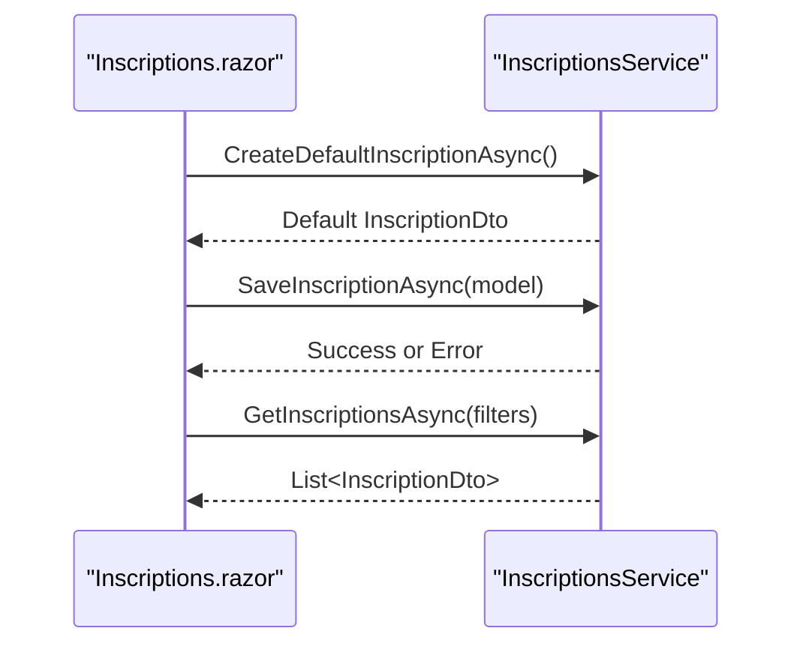
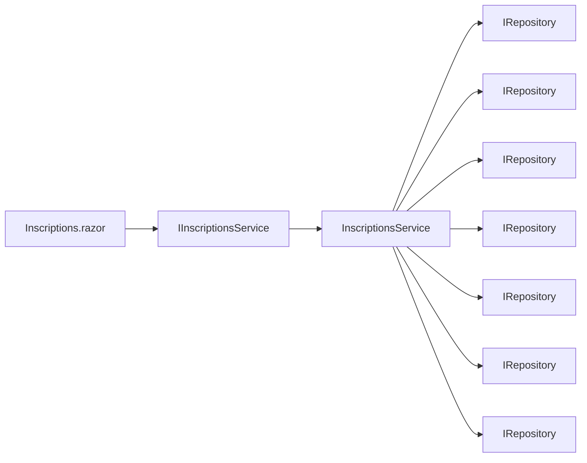

# Enrollment System

<cite>
**Referenced Files in This Document**
- [Inscription.cs](file://RIIS.Academic.Domain/Inscriptions/Inscription.cs)
- [DossierAdmission.cs](file://RIIS.Academic.Domain/Inscriptions/DossierAdmission.cs)
- [ValidationInscription.cs](file://RIIS.Academic.Domain/Inscriptions/ValidationInscription.cs)
- [StatutInscription.cs](file://RIIS.Academic.Domain/Enums/StatutInscription.cs)
- [StatutValidationAcademique.cs](file://RIIS.Academic.Domain/Enums/StatutValidationAcademique.cs)
- [Etudiant.cs](file://RIIS.Academic.Domain/Etudiants/Etudiant.cs)
- [ParcoursAcademique.cs](file://RIIS.Academic.Domain/Parcours/ParcoursAcademique.cs)
- [ClassePedagogique.cs](file://RIIS.Academic.Domain/Notes/ClassePedagogique.cs)
- [IInscriptionsService.cs](file://RIIS.Academic.Application/Inscriptions/Services/IInscriptionsService.cs)
- [InscriptionsService.cs](file://RIIS.Academic.Application/Inscriptions/Services/InscriptionsService.cs)
- [InscriptionDto.cs](file://RIIS.Academic.Application/Inscriptions/Dtos/InscriptionDto.cs)
- [Inscriptions.razor](file://RIIS.Academic.Web/Components/Pages/Inscriptions.razor)
</cite>

## Table of Contents
1. Introduction
2. Project Structure
3. Core Components
4. Architecture Overview
5. Detailed Component Analysis
6. Dependency Analysis
7. Performance Considerations
8. Troubleshooting Guide
9. Conclusion

## Introduction
This document explains the enrollment and admission system with a focus on how students are enrolled into academic programs, how admission applications are managed, and how academic validation workflows proceed. The central entity is Inscription, which links a student to an academic year, program pathway, study level, class, and optional pedagogical blueprint. Admission applications are captured via DossierAdmission, while ValidationInscription records administrative approvals and signatures. Statuses StatutInscription and StatutValidationAcademique track lifecycle stages from pending to validated or suspended/cancelled. The application layer enforces validation rules, eligibility checks, and conflict resolution (e.g., preventing duplicate enrollments for the same student and academic year).

## Project Structure
The enrollment feature spans three layers:
- Domain: Entities and enumerations that define the core concepts and constraints.
- Application: Services and DTOs that implement business logic, validation, and orchestration.
- Web: UI page that exposes enrollment creation, editing, filtering, and saving.

**Diagram sources**
- [Inscription.cs:1-37](file://RIIS.Academic.Domain/Inscriptions/Inscription.cs#L1-L37)
- [DossierAdmission.cs:1-17](file://RIIS.Academic.Domain/Inscriptions/DossierAdmission.cs#L1-L17)
- [ValidationInscription.cs:1-18](file://RIIS.Academic.Domain/Inscriptions/ValidationInscription.cs#L1-L18)
- [StatutInscription.cs:1-10](file://RIIS.Academic.Domain/Enums/StatutInscription.cs#L1-L10)
- [StatutValidationAcademique.cs:1-10](file://RIIS.Academic.Domain/Enums/StatutValidationAcademique.cs#L1-L10)
- [Etudiant.cs:1-28](file://RIIS.Academic.Domain/Etudiants/Etudiant.cs#L1-L28)
- [ParcoursAcademique.cs:1-24](file://RIIS.Academic.Domain/Parcours/ParcoursAcademique.cs#L1-L24)
- [ClassePedagogique.cs:1-21](file://RIIS.Academic.Domain/Notes/ClassePedagogique.cs#L1-L21)
- [IInscriptionsService.cs:1-32](file://RIIS.Academic.Application/Inscriptions/Services/IInscriptionsService.cs#L1-L32)
- [InscriptionsService.cs:1-457](file://RIIS.Academic.Application/Inscriptions/Services/InscriptionsService.cs#L1-L457)
- [InscriptionDto.cs:1-28](file://RIIS.Academic.Application/Inscriptions/Dtos/InscriptionDto.cs#L1-L28)
- [Inscriptions.razor:1-351](file://RIIS.Academic.Web/Components/Pages/Inscriptions.razor#L1-L351)

**Section sources**
- [Inscription.cs:1-37](file://RIIS.Academic.Domain/Inscriptions/Inscription.cs#L1-L37)
- [InscriptionsService.cs:1-457](file://RIIS.Academic.Application/Inscriptions/Services/InscriptionsService.cs#L1-L457)
- [Inscriptions.razor:1-351](file://RIIS.Academic.Web/Components/Pages/Inscriptions.razor#L1-L351)

## Core Components
- Inscription: Central enrollment record linking a student to an academic year, pathway, study level, class, and optional pedagogical blueprint. It carries enrollment date, status, administrative codes, and relationships to results and evaluations.
- DossierAdmission: Captures admission details such as baccalaureate series, year, mention, entry diploma, equivalence info, and ties back to the enrollment.
- ValidationInscription: Records administrative validation including signature location, student and administration signatory names, signature URLs, and validation date.
- StatutInscription: Lifecycle statuses for enrollment: Pending, Validated, Suspended, Cancelled.
- StatutValidationAcademique: Academic validation outcomes: Not Calculated, Valid, Retake, Not Valid.

These components together model the end-to-end flow from admission application to active enrollment and subsequent academic validation.

**Section sources**
- [Inscription.cs:1-37](file://RIIS.Academic.Domain/Inscriptions/Inscription.cs#L1-L37)
- [DossierAdmission.cs:1-17](file://RIIS.Academic.Domain/Inscriptions/DossierAdmission.cs#L1-L17)
- [ValidationInscription.cs:1-18](file://RIIS.Academic.Domain/Inscriptions/ValidationInscription.cs#L1-L18)
- [StatutInscription.cs:1-10](file://RIIS.Academic.Domain/Enums/StatutInscription.cs#L1-L10)
- [StatutValidationAcademique.cs:1-10](file://RIIS.Academic.Domain/Enums/StatutValidationAcademique.cs#L1-L10)

## Architecture Overview
The enrollment workflow is orchestrated by the application service, which validates inputs, ensures referential integrity, prevents conflicts, and persists changes. The web UI provides forms and filters to create/edit enrollments and displays lookup lists for related entities.

**Diagram sources**
- [Inscriptions.razor:274-322](file://RIIS.Academic.Web/Components/Pages/Inscriptions.razor#L274-L322)
- [InscriptionsService.cs:95-191](file://RIIS.Academic.Application/Inscriptions/Services/InscriptionsService.cs#L95-L191)
- [IInscriptionsService.cs:6-31](file://RIIS.Academic.Application/Inscriptions/Services/IInscriptionsService.cs#L6-L31)

**Section sources**
- [InscriptionsService.cs:95-191](file://RIIS.Academic.Application/Inscriptions/Services/InscriptionsService.cs#L95-L191)
- [Inscriptions.razor:274-322](file://RIIS.Academic.Web/Components/Pages/Inscriptions.razor#L274-L322)

## Detailed Component Analysis

### Inscription Entity
- Purpose: Represents a single enrollment for a student within an academic year, tied to a specific pathway, study level, and optionally a class and pedagogical blueprint.
- Key fields: Academic year ID, student ID, pathway ID, study level ID, optional pedagogical blueprint ID, optional class ID, enrollment date, status, administrative metadata.
- Relationships: Links to Etudiant, ParcoursAcademique, ClassePedagogique, MaquettePedagogique, DossierAdmission, ValidationInscription, and result/evaluation aggregates.

**Diagram sources**
- [Inscription.cs:1-37](file://RIIS.Academic.Domain/Inscriptions/Inscription.cs#L1-L37)
- [Etudiant.cs:1-28](file://RIIS.Academic.Domain/Etudiants/Etudiant.cs#L1-L28)
- [ParcoursAcademique.cs:1-24](file://RIIS.Academic.Domain/Parcours/ParcoursAcademique.cs#L1-L24)
- [ClassePedagogique.cs:1-21](file://RIIS.Academic.Domain/Notes/ClassePedagogique.cs#L1-L21)
- [DossierAdmission.cs:1-17](file://RIIS.Academic.Domain/Inscriptions/DossierAdmission.cs#L1-L17)
- [ValidationInscription.cs:1-18](file://RIIS.Academic.Domain/Inscriptions/ValidationInscription.cs#L1-L18)

**Section sources**
- [Inscription.cs:1-37](file://RIIS.Academic.Domain/Inscriptions/Inscription.cs#L1-L37)

### DossierAdmission Entity
- Purpose: Stores admission-related data for an enrollment, including baccalaureate information and equivalences.
- Relationship: One-to-one with Inscription via InscriptionId.

**Diagram sources**
- [DossierAdmission.cs:1-17](file://RIIS.Academic.Domain/Inscriptions/DossierAdmission.cs#L1-L17)
- [Inscription.cs:1-37](file://RIIS.Academic.Domain/Inscriptions/Inscription.cs#L1-L37)

**Section sources**
- [DossierAdmission.cs:1-17](file://RIIS.Academic.Domain/Inscriptions/DossierAdmission.cs#L1-L17)

### ValidationInscription Process
- Purpose: Captures administrative approval and signatures for an enrollment.
- Fields include signature location, dates, signatory names, signature URLs, and observation notes.
- Workflow: After enrollment is created and validated, administrators can record signatures and set the administrative validation date.

**Diagram sources**
- [ValidationInscription.cs:1-18](file://RIIS.Academic.Domain/Inscriptions/ValidationInscription.cs#L1-L18)
- [StatutInscription.cs:1-10](file://RIIS.Academic.Domain/Enums/StatutInscription.cs#L1-L10)
- [InscriptionsService.cs:108-191](file://RIIS.Academic.Application/Inscriptions/Services/InscriptionsService.cs#L108-L191)

**Section sources**
- [ValidationInscription.cs:1-18](file://RIIS.Academic.Domain/Inscriptions/ValidationInscription.cs#L1-L18)
- [InscriptionsService.cs:108-191](file://RIIS.Academic.Application/Inscriptions/Services/InscriptionsService.cs#L108-L191)

### Statuses and Lifecycle
- StatutInscription values:
  - EnAttente: Pending
  - Validee: Validated
  - Suspendue: Suspended
  - Annulee: Cancelled
- StatutValidationAcademique values:
  - NonCalcule: Not Calculated
  - Valide: Valid
  - Rattrapage: Retake
  - NonValide: Not Valid

These enums drive the enrollment lifecycle and academic evaluation outcomes.

**Section sources**
- [StatutInscription.cs:1-10](file://RIIS.Academic.Domain/Enums/StatutInscription.cs#L1-L10)
- [StatutValidationAcademique.cs:1-10](file://RIIS.Academic.Domain/Enums/StatutValidationAcademique.cs#L1-L10)

### Validation Rules, Eligibility Checks, and Conflict Resolution
- Required fields: Academic year, student, pathway, study level must be provided; otherwise, save fails.
- Status rule: If StatutInscription is Validated, a pedagogical class must be assigned; otherwise, save fails.
- Referential integrity: All referenced IDs must exist and be coherent (e.g., class must belong to the same academic year, pathway, and study level; pedagogical blueprint must match the pathway).
- Conflict resolution: Prevents duplicate enrollment for the same student and academic year.
- Normalization: Optional text fields are trimmed and nullified when empty.

**Diagram sources**
- [InscriptionsService.cs:108-191](file://RIIS.Academic.Application/Inscriptions/Services/InscriptionsService.cs#L108-L191)
- [InscriptionsService.cs:313-382](file://RIIS.Academic.Application/Inscriptions/Services/InscriptionsService.cs#L313-L382)

**Section sources**
- [InscriptionsService.cs:108-191](file://RIIS.Academic.Application/Inscriptions/Services/InscriptionsService.cs#L108-L191)
- [InscriptionsService.cs:313-382](file://RIIS.Academic.Application/Inscriptions/Services/InscriptionsService.cs#L313-L382)

### Enrollment Workflow Examples
- Example 1: Create default enrollment
  - UI calls CreateDefaultInscriptionAsync to prefill defaults (academic year, date, status).
  - User fills form and saves; service validates and persists.
- Example 2: Edit existing enrollment
  - UI loads existing data, user updates fields (e.g., assigns class), and saves; service validates and updates.
- Example 3: Filter and list enrollments
  - UI applies filters (academic year, cycle, level, class) and retrieves filtered list.

**Diagram sources**
- [Inscriptions.razor:274-322](file://RIIS.Academic.Web/Components/Pages/Inscriptions.razor#L274-L322)
- [InscriptionsService.cs:18-93](file://RIIS.Academic.Application/Inscriptions/Services/InscriptionsService.cs#L18-L93)
- [InscriptionsService.cs:95-191](file://RIIS.Academic.Application/Inscriptions/Services/InscriptionsService.cs#L95-L191)

**Section sources**
- [Inscriptions.razor:274-322](file://RIIS.Academic.Web/Components/Pages/Inscriptions.razor#L274-L322)
- [InscriptionsService.cs:18-93](file://RIIS.Academic.Application/Inscriptions/Services/InscriptionsService.cs#L18-L93)
- [InscriptionsService.cs:95-191](file://RIIS.Academic.Application/Inscriptions/Services/InscriptionsService.cs#L95-L191)

## Dependency Analysis
- InscriptionsService depends on multiple repositories to validate and enrich enrollment data:
  - Academic year, student, pathway, study level, class, and pedagogical blueprint references.
- UI depends on IInscriptionsService for lookups and CRUD operations.
- Domain entities maintain relationships between Inscription and related entities.

**Diagram sources**
- [IInscriptionsService.cs:1-32](file://RIIS.Academic.Application/Inscriptions/Services/IInscriptionsService.cs#L1-L32)
- [InscriptionsService.cs:8-16](file://RIIS.Academic.Application/Inscriptions/Services/InscriptionsService.cs#L8-L16)
- [Inscriptions.razor:1-351](file://RIIS.Academic.Web/Components/Pages/Inscriptions.razor#L1-L351)

**Section sources**
- [IInscriptionsService.cs:1-32](file://RIIS.Academic.Application/Inscriptions/Services/IInscriptionsService.cs#L1-L32)
- [InscriptionsService.cs:8-16](file://RIIS.Academic.Application/Inscriptions/Services/InscriptionsService.cs#L8-L16)
- [Inscriptions.razor:1-351](file://RIIS.Academic.Web/Components/Pages/Inscriptions.razor#L1-L351)

## Performance Considerations
- Lookups are loaded once per initialization and reused for dropdowns and filters.
- Filtering is applied client-side on loaded datasets for quick UX; consider server-side pagination/filtering for large datasets.
- Avoid unnecessary re-fetching by caching lookups in the UI state.

[No sources needed since this section provides general guidance]

## Troubleshooting Guide
Common errors and their causes:
- Missing required fields: Ensure academic year, student, pathway, and study level are selected before saving.
- Class assignment required for validated status: When setting StatutInscription to Validated, assign a pedagogical class.
- Invalid references: Verify that the selected class belongs to the same academic year, pathway, and study level; ensure the pedagogical blueprint matches the pathway.
- Duplicate enrollment: An enrollment cannot be created for the same student and academic year; update the existing record instead.

Error handling is implemented by throwing domain-specific exceptions during save operations, which are surfaced to the UI as notifications.

**Section sources**
- [InscriptionsService.cs:108-191](file://RIIS.Academic.Application/Inscriptions/Services/InscriptionsService.cs#L108-L191)
- [InscriptionsService.cs:313-382](file://RIIS.Academic.Application/Inscriptions/Services/InscriptionsService.cs#L313-L382)
- [Inscriptions.razor:308-322](file://RIIS.Academic.Web/Components/Pages/Inscriptions.razor#L308-L322)

## Conclusion
The enrollment system centers on the Inscription entity, which connects students to academic programs and tracks their lifecycle through statuses. Admission applications are captured via DossierAdmission, and administrative approvals are recorded in ValidationInscription. The application service enforces robust validation rules, eligibility checks, and conflict resolution to ensure data integrity. The web interface provides a streamlined experience for creating, editing, and managing enrollments. Together, these components deliver a clear, reliable workflow from application to active enrollment and academic validation.