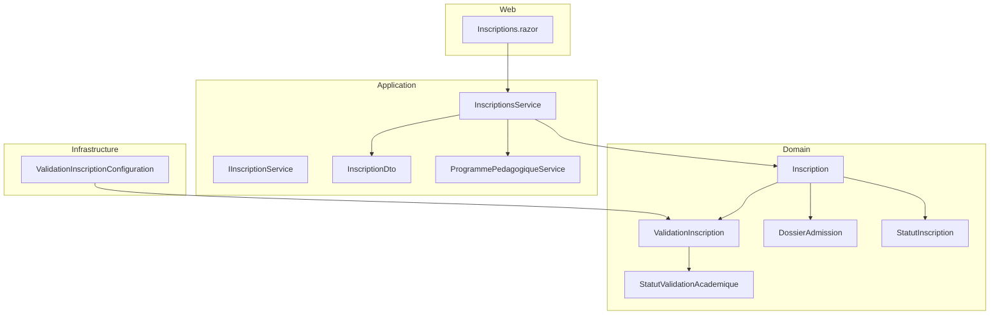
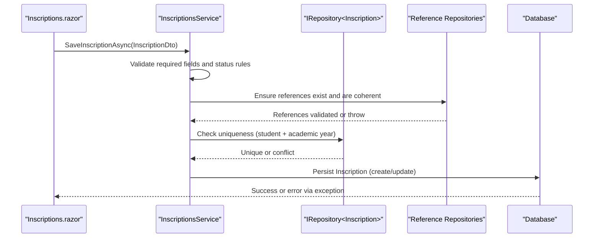
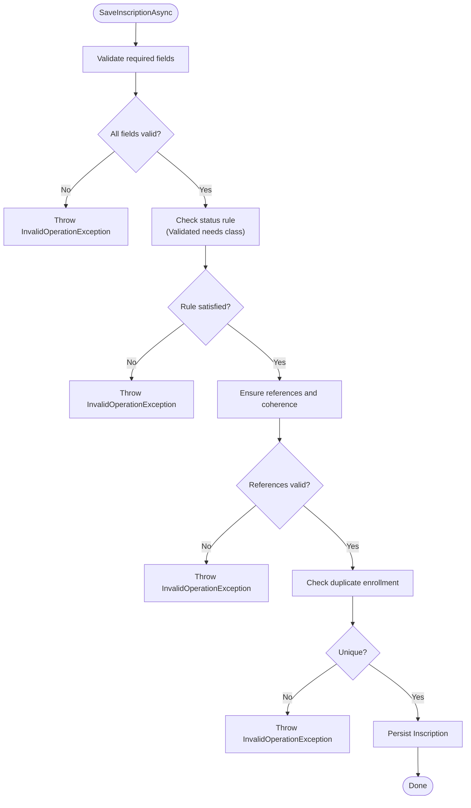
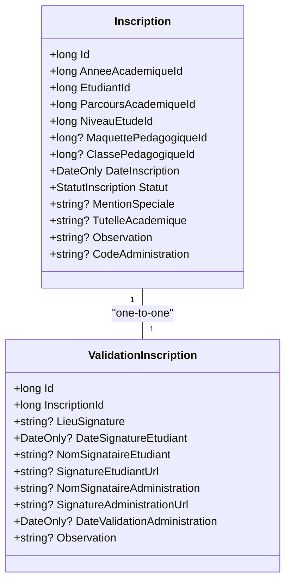
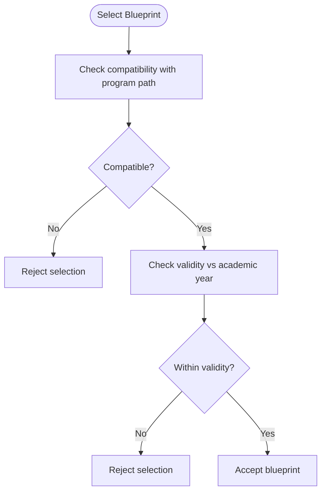
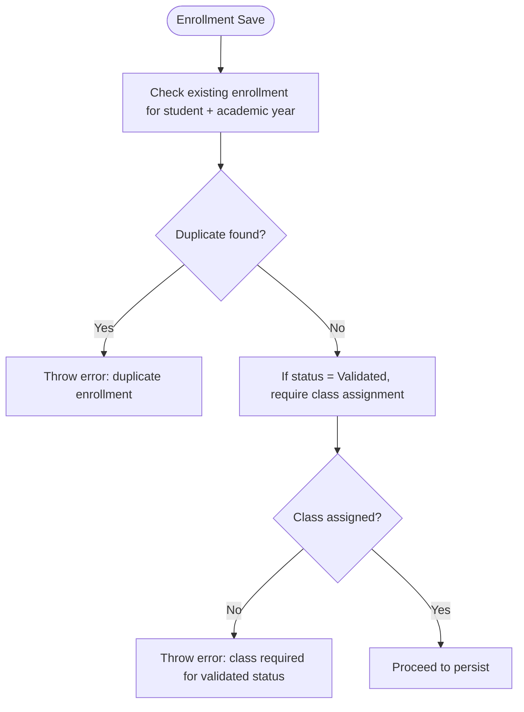
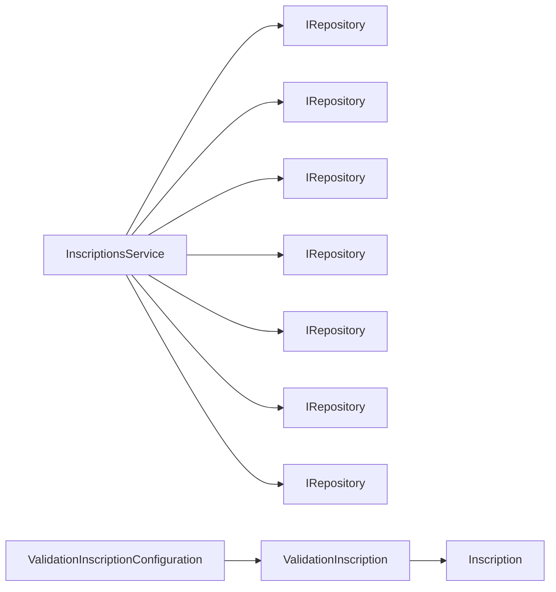

# Registration and Validation

<cite>
**Referenced Files in This Document**
- [Inscription.cs](file://RIIS.Academic.Domain/Inscriptions/Inscription.cs)
- [ValidationInscription.cs](file://RIIS.Academic.Domain/Inscriptions/ValidationInscription.cs)
- [StatutInscription.cs](file://RIIS.Academic.Domain/Enums/StatutInscription.cs)
- [StatutValidationAcademique.cs](file://RIIS.Academic.Domain/Enums/StatutValidationAcademique.cs)
- [DossierAdmission.cs](file://RIIS.Academic.Domain/Inscriptions/DossierAdmission.cs)
- [IInscriptionService.cs](file://RIIS.Academic.Application/Abstractions/Services/IInscriptionService.cs)
- [InscriptionsService.cs](file://RIIS.Academic.Application/Inscriptions/Services/InscriptionsService.cs)
- [InscriptionDto.cs](file://RIIS.Academic.Application/Inscriptions/Dtos/InscriptionDto.cs)
- [ProgrammePedagogiqueService.cs](file://RIIS.Academic.Application/Programmes/Services/ProgrammePedagogiqueService.cs)
- [ValidationInscriptionConfiguration.cs](file://RIIS.Academic.Infrastructure/Persistence/Configurations/Inscriptions/ValidationInscriptionConfiguration.cs)
- [Inscriptions.razor](file://RIIS.Academic.Web/Components/Pages/Inscriptions.razor)
</cite>

## Table of Contents
1. Introduction
2. Project Structure
3. Core Components
4. Architecture Overview
5. Detailed Component Analysis
6. Dependency Analysis
7. Performance Considerations
8. Troubleshooting Guide
9. Conclusion

## Introduction
This document explains the enrollment registration process using Inscription entities and the subsequent academic validation workflow via ValidationInscription. It details the enrollment lifecycle states defined by StatutInscription, the validation workflow that ensures students meet academic requirements, and the business rules enforced during registration such as prerequisite checks, schedule conflicts, and enrollment limits. Examples are provided for successful registrations, validation approvals, and rejection scenarios with error handling.

## Project Structure
The enrollment and validation features span Domain, Application, Infrastructure, and Web layers:
- Domain defines core entities (Inscription, ValidationInscription), related entities (DossierAdmission), and enums (StatutInscription, StatutValidationAcademique).
- Application implements service logic for creating, saving, and validating enrollments, including reference integrity and consistency checks.
- Infrastructure configures persistence mappings for ValidationInscription and its relationship to Inscription.
- Web provides UI interactions for saving enrollments and surfacing errors to users.

**Diagram sources**
- [Inscription.cs:1-37](file://RIIS.Academic.Domain/Inscriptions/Inscription.cs#L1-L37)
- [ValidationInscription.cs:1-18](file://RIIS.Academic.Domain/Inscriptions/ValidationInscription.cs#L1-L18)
- [DossierAdmission.cs:1-17](file://RIIS.Academic.Domain/Inscriptions/DossierAdmission.cs#L1-L17)
- [StatutInscription.cs:1-10](file://RIIS.Academic.Domain/Enums/StatutInscription.cs#L1-L10)
- [StatutValidationAcademique.cs:1-10](file://RIIS.Academic.Domain/Enums/StatutValidationAcademique.cs#L1-L10)
- [InscriptionsService.cs:1-457](file://RIIS.Academic.Application/Inscriptions/Services/InscriptionsService.cs#L1-L457)
- [IInscriptionService.cs:1-9](file://RIIS.Academic.Application/Abstractions/Services/IInscriptionService.cs#L1-L9)
- [InscriptionDto.cs:1-28](file://RIIS.Academic.Application/Inscriptions/Dtos/InscriptionDto.cs#L1-L28)
- [ProgrammePedagogiqueService.cs:815-849](file://RIIS.Academic.Application/Programmes/Services/ProgrammePedagogiqueService.cs#L815-L849)
- [ValidationInscriptionConfiguration.cs:1-25](file://RIIS.Academic.Infrastructure/Persistence/Configurations/Inscriptions/ValidationInscriptionConfiguration.cs#L1-L25)
- [Inscriptions.razor:308-350](file://RIIS.Academic.Web/Components/Pages/Inscriptions.razor#L308-L350)

**Section sources**
- [Inscription.cs:1-37](file://RIIS.Academic.Domain/Inscriptions/Inscription.cs#L1-L37)
- [ValidationInscription.cs:1-18](file://RIIS.Academic.Domain/Inscriptions/ValidationInscription.cs#L1-L18)
- [StatutInscription.cs:1-10](file://RIIS.Academic.Domain/Enums/StatutInscription.cs#L1-L10)
- [StatutValidationAcademique.cs:1-10](file://RIIS.Academic.Domain/Enums/StatutValidationAcademique.cs#L1-L10)
- [InscriptionsService.cs:1-457](file://RIIS.Academic.Application/Inscriptions/Services/InscriptionsService.cs#L1-L457)
- [ValidationInscriptionConfiguration.cs:1-25](file://RIIS.Academic.Infrastructure/Persistence/Configurations/Inscriptions/ValidationInscriptionConfiguration.cs#L1-L25)
- [Inscriptions.razor:308-350](file://RIIS.Academic.Web/Components/Pages/Inscriptions.razor#L308-L350)

## Core Components
- Inscription: Represents a student’s enrollment for an academic year, linking to academic program references and optional pedagogical class assignment. Includes lifecycle status via StatutInscription and optional administrative fields.
- ValidationInscription: Captures signature and administrative validation metadata for an enrollment, linked one-to-one with Inscription.
- DossierAdmission: Stores admission-related data tied to an enrollment.
- StatutInscription: Enumerates enrollment lifecycle states: Pending, Validated, Suspended, Cancelled.
- StatutValidationAcademique: Enumerates academic validation outcomes used elsewhere in the system (e.g., calculation results).
- InscriptionsService: Implements creation, saving, lookup, and validation workflows for enrollments, enforcing referential integrity and business rules.
- ProgrammePedagogiqueService: Provides utility for validating maquette validity against academic years, supporting prerequisite checks.

Key responsibilities:
- Enrollment creation defaults and state initialization.
- Save operations validate required fields, uniqueness constraints, and referential coherence.
- Validation workflow supports administrative approval and signature capture through ValidationInscription.

**Section sources**
- [Inscription.cs:1-37](file://RIIS.Academic.Domain/Inscriptions/Inscription.cs#L1-L37)
- [ValidationInscription.cs:1-18](file://RIIS.Academic.Domain/Inscriptions/ValidationInscription.cs#L1-L18)
- [DossierAdmission.cs:1-17](file://RIIS.Academic.Domain/Inscriptions/DossierAdmission.cs#L1-L17)
- [StatutInscription.cs:1-10](file://RIIS.Academic.Domain/Enums/StatutInscription.cs#L1-L10)
- [StatutValidationAcademique.cs:1-10](file://RIIS.Academic.Domain/Enums/StatutValidationAcademique.cs#L1-L10)
- [InscriptionsService.cs:95-191](file://RIIS.Academic.Application/Inscriptions/Services/InscriptionsService.cs#L95-L191)
- [ProgrammePedagogiqueService.cs:815-849](file://RIIS.Academic.Application/Programmes/Services/ProgrammePedagogiqueService.cs#L815-L849)

## Architecture Overview
The enrollment flow integrates domain models with application services and infrastructure configuration:
- The web layer triggers save operations on InscriptionsService.
- InscriptionsService validates inputs, ensures referential integrity, enforces uniqueness, and persists Inscription entities.
- ValidationInscription is configured to be unique per Inscription and cascade-deleted when the parent is removed.
- Academic year and program validity checks support prerequisite validation.

**Diagram sources**
- [Inscriptions.razor:308-350](file://RIIS.Academic.Web/Components/Pages/Inscriptions.razor#L308-L350)
- [InscriptionsService.cs:108-191](file://RIIS.Academic.Application/Inscriptions/Services/InscriptionsService.cs#L108-L191)
- [ValidationInscriptionConfiguration.cs:1-25](file://RIIS.Academic.Infrastructure/Persistence/Configurations/Inscriptions/ValidationInscriptionConfiguration.cs#L1-L25)

## Detailed Component Analysis

### Enrollment Lifecycle States (StatutInscription)
- EnAttente (Pending): Default state upon creation; indicates enrollment awaiting validation or assignment.
- Validee (Validated): Indicates enrollment has been approved; requires assignment to a pedagogical class.
- Suspendue (Suspended): Temporary hold on enrollment.
- Annulee (Cancelled): Final cancellation of enrollment.

These states drive workflow decisions and UI behavior throughout the system.

**Section sources**
- [StatutInscription.cs:1-10](file://RIIS.Academic.Domain/Enums/StatutInscription.cs#L1-L10)
- [Inscription.cs:1-37](file://RIIS.Academic.Domain/Inscriptions/Inscription.cs#L1-L37)

### Enrollment Creation and Saving Workflow
- CreateDefaultInscriptionAsync initializes default values for the current academic year and sets initial status to Pending.
- SaveInscriptionAsync performs:
  - Required field validation (academic year, student, program path, study level).
  - Status rule enforcement (validated status requires pedagogical class assignment).
  - Reference integrity checks (existence and coherence of academic year, student, program path, study level, pedagogical class, and pedagogical blueprint).
  - Uniqueness check (prevents duplicate enrollment for the same student and academic year).
  - Persistence of new or updated Inscription.

**Diagram sources**
- [InscriptionsService.cs:95-191](file://RIIS.Academic.Application/Inscriptions/Services/InscriptionsService.cs#L95-L191)

**Section sources**
- [InscriptionsService.cs:95-191](file://RIIS.Academic.Application/Inscriptions/Services/InscriptionsService.cs#L95-L191)

### Academic Validation via ValidationInscription
- ValidationInscription captures signature location, dates, signatory names, signature URLs, and administrative observation.
- Database configuration enforces a unique InscriptionId and cascades deletion with the parent Inscription.
- While the interface declares a validation method, the concrete implementation focuses on saving enrollments; validation typically involves creating/updating ValidationInscription alongside updating Inscription status to Validated after administrative approval.

**Diagram sources**
- [Inscription.cs:1-37](file://RIIS.Academic.Domain/Inscriptions/Inscription.cs#L1-L37)
- [ValidationInscription.cs:1-18](file://RIIS.Academic.Domain/Inscriptions/ValidationInscription.cs#L1-L18)
- [ValidationInscriptionConfiguration.cs:1-25](file://RIIS.Academic.Infrastructure/Persistence/Configurations/Inscriptions/ValidationInscriptionConfiguration.cs#L1-L25)

**Section sources**
- [ValidationInscription.cs:1-18](file://RIIS.Academic.Domain/Inscriptions/ValidationInscription.cs#L1-L18)
- [ValidationInscriptionConfiguration.cs:1-25](file://RIIS.Academic.Infrastructure/Persistence/Configurations/Inscriptions/ValidationInscriptionConfiguration.cs#L1-L25)

### Prerequisite Checking and Program Validity
- IsMaquetteCompatibleWithParcours ensures the selected pedagogical blueprint matches the program path (cycle, major, specialty).
- IsMaquetteValidForAcademicYear ensures the blueprint’s validity period overlaps with the academic year, preventing invalid selections outside permitted ranges.

**Diagram sources**
- [InscriptionsService.cs:444-448](file://RIIS.Academic.Application/Inscriptions/Services/InscriptionsService.cs#L444-L448)
- [ProgrammePedagogiqueService.cs:815-849](file://RIIS.Academic.Application/Programmes/Services/ProgrammePedagogiqueService.cs#L815-L849)

**Section sources**
- [InscriptionsService.cs:444-448](file://RIIS.Academic.Application/Inscriptions/Services/InscriptionsService.cs#L444-L448)
- [ProgrammePedagogiqueService.cs:815-849](file://RIIS.Academic.Application/Programmes/Services/ProgrammePedagogiqueService.cs#L815-L849)

### Schedule Conflicts and Enrollment Limits
- Duplicate enrollment prevention: The service prevents multiple active enrollments for the same student within the same academic year.
- Class assignment constraint: When setting status to Validated, a pedagogical class must be assigned, ensuring the student is scheduled into a specific class.

**Diagram sources**
- [InscriptionsService.cs:108-191](file://RIIS.Academic.Application/Inscriptions/Services/InscriptionsService.cs#L108-L191)

**Section sources**
- [InscriptionsService.cs:108-191](file://RIIS.Academic.Application/Inscriptions/Services/InscriptionsService.cs#L108-L191)

### Example Scenarios

#### Successful Registration
- Steps:
  - Initialize default enrollment with current academic year and pending status.
  - Provide required fields (student, program path, study level).
  - Optionally assign a pedagogical class if immediately validating.
  - Save operation validates references and uniqueness, then persists the enrollment.
- Outcome: Enrollment created with status Pending (or Validated if class assigned and status set accordingly).

**Section sources**
- [InscriptionsService.cs:95-191](file://RIIS.Academic.Application/Inscriptions/Services/InscriptionsService.cs#L95-L191)
- [InscriptionDto.cs:1-28](file://RIIS.Academic.Application/Inscriptions/Dtos/InscriptionDto.cs#L1-L28)

#### Validation Approval
- Steps:
  - Administrative user creates or updates ValidationInscription for the enrollment, capturing signatures and dates.
  - Update Inscription status to Validated and ensure a pedagogical class is assigned.
  - Save changes; database enforces unique ValidationInscription per Inscription.
- Outcome: Enrollment becomes Validated with recorded administrative validation metadata.

**Section sources**
- [ValidationInscription.cs:1-18](file://RIIS.Academic.Domain/Inscriptions/ValidationInscription.cs#L1-L18)
- [ValidationInscriptionConfiguration.cs:1-25](file://RIIS.Academic.Infrastructure/Persistence/Configurations/Inscriptions/ValidationInscriptionConfiguration.cs#L1-L25)
- [InscriptionsService.cs:108-191](file://RIIS.Academic.Application/Inscriptions/Services/InscriptionsService.cs#L108-L191)

#### Rejection Scenarios with Error Handling
- Missing required fields: Throws InvalidOperationException indicating missing academic year, student, program path, or study level.
- Invalid status transition: Attempting to set status to Validated without assigning a pedagogical class throws an error.
- Referential mismatch: Selecting a pedagogical class or blueprint not aligned with the enrollment’s program path or academic year throws an error.
- Duplicate enrollment: Attempting to create another enrollment for the same student and academic year throws an error.
- Web UI surfaces these errors via notifications.

**Section sources**
- [InscriptionsService.cs:108-191](file://RIIS.Academic.Application/Inscriptions/Services/InscriptionsService.cs#L108-L191)
- [Inscriptions.razor:308-350](file://RIIS.Academic.Web/Components/Pages/Inscriptions.razor#L308-L350)

## Dependency Analysis
- InscriptionsService depends on repositories for Inscription, academic year, student, program path, study level, pedagogical class, and blueprint.
- ValidationInscriptionConfiguration binds ValidationInscription to Inscription with a unique constraint and cascade delete.
- ProgrammePedagogiqueService provides blueprint validity checks used indirectly by enrollment logic.

**Diagram sources**
- [InscriptionsService.cs:1-457](file://RIIS.Academic.Application/Inscriptions/Services/InscriptionsService.cs#L1-L457)
- [ValidationInscriptionConfiguration.cs:1-25](file://RIIS.Academic.Infrastructure/Persistence/Configurations/Inscriptions/ValidationInscriptionConfiguration.cs#L1-L25)

**Section sources**
- [InscriptionsService.cs:1-457](file://RIIS.Academic.Application/Inscriptions/Services/InscriptionsService.cs#L1-L457)
- [ValidationInscriptionConfiguration.cs:1-25](file://RIIS.Academic.Infrastructure/Persistence/Configurations/Inscriptions/ValidationInscriptionConfiguration.cs#L1-L25)

## Performance Considerations
- List-based lookups: Services retrieve full lists from repositories and filter in memory; consider pagination or server-side filtering for large datasets.
- DTO mapping: Mapping includes multiple lookups; caching frequently accessed reference data (e.g., academic years, programs) can reduce repeated queries.
- Validation checks: Reference and uniqueness checks involve additional reads; batch operations or optimized queries may improve throughput.

[No sources needed since this section provides general guidance]

## Troubleshooting Guide
Common issues and resolutions:
- Missing required fields: Ensure all mandatory fields are provided before saving.
- Status rule violation: Assign a pedagogical class when setting status to Validated.
- Referential mismatches: Verify that selected pedagogical class and blueprint align with the enrollment’s program path and academic year.
- Duplicate enrollment: Confirm no existing enrollment exists for the student in the target academic year.
- UI error display: Errors thrown by services are surfaced via notifications in the web layer.

**Section sources**
- [InscriptionsService.cs:108-191](file://RIIS.Academic.Application/Inscriptions/Services/InscriptionsService.cs#L108-L191)
- [Inscriptions.razor:308-350](file://RIIS.Academic.Web/Components/Pages/Inscriptions.razor#L308-L350)

## Conclusion
The enrollment registration process centers on Inscription entities with lifecycle states managed by StatutInscription. ValidationInscription captures administrative validation metadata and enforces a one-to-one relationship with Inscription. InscriptionsService enforces critical business rules including prerequisite checks, schedule conflicts, and enrollment limits. The web layer provides user feedback for errors, ensuring a robust and auditable enrollment workflow.

[No sources needed since this section summarizes without analyzing specific files]