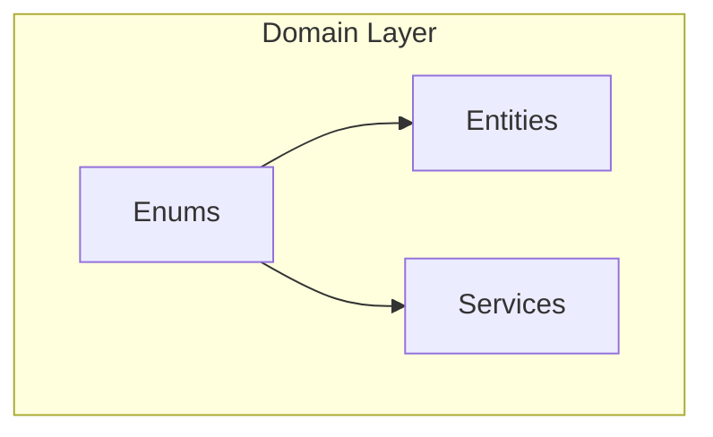
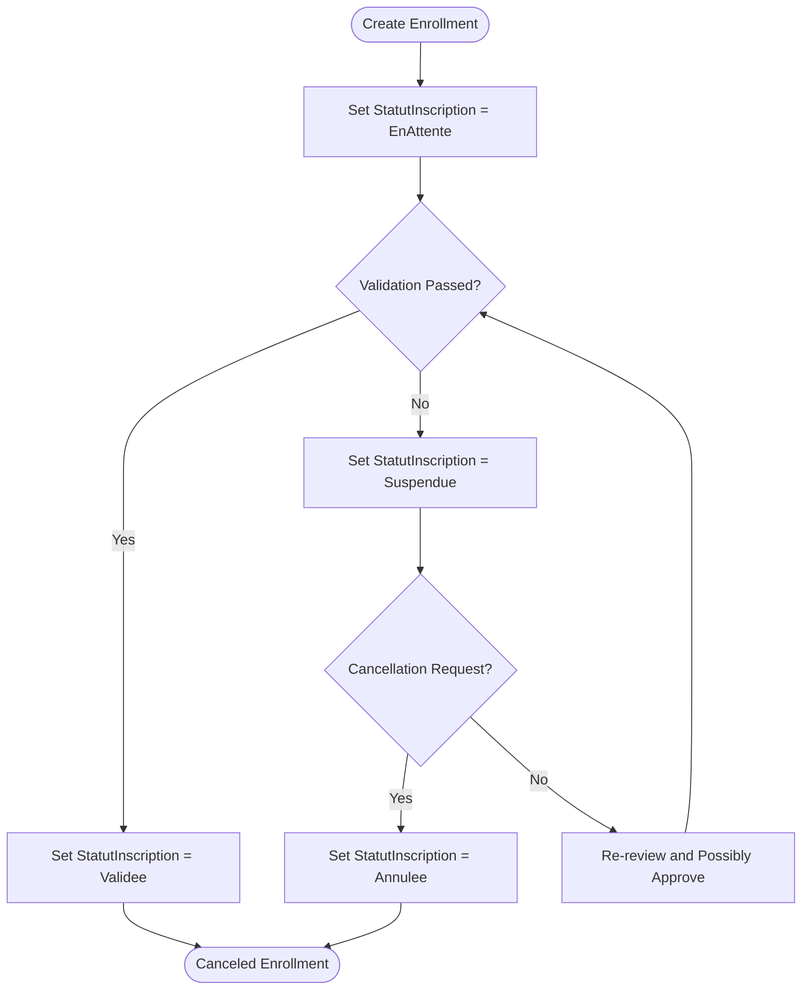
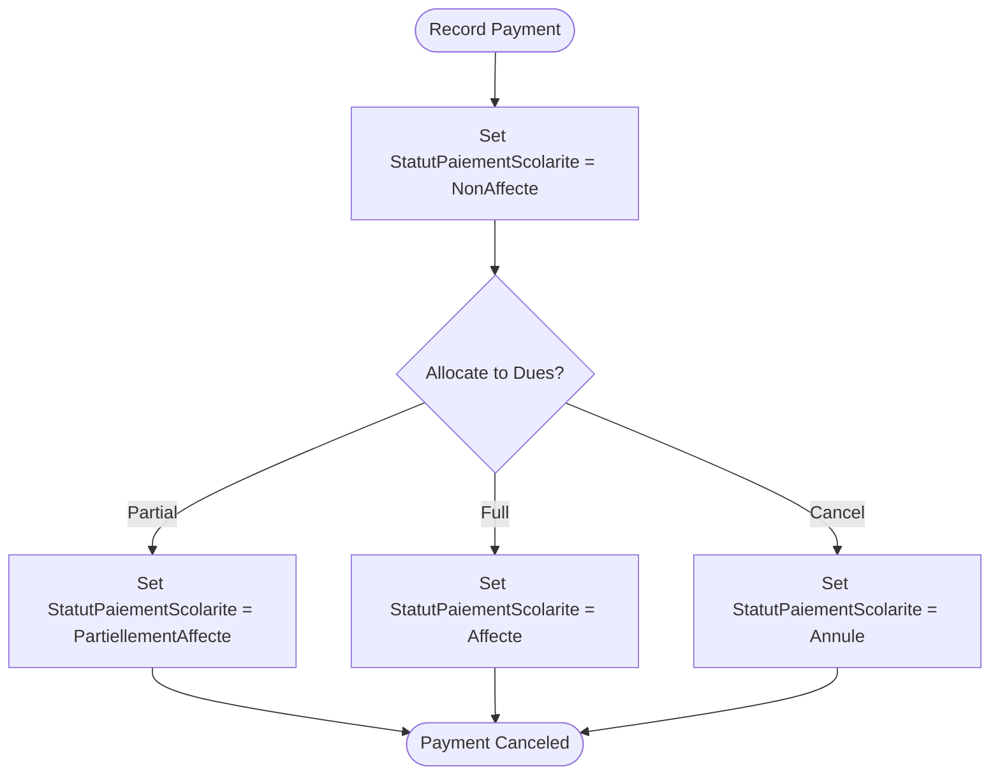
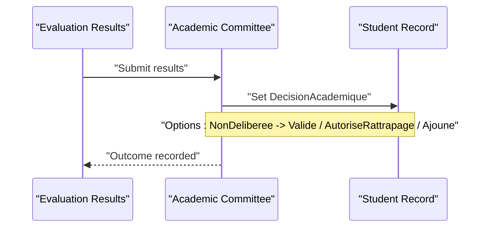
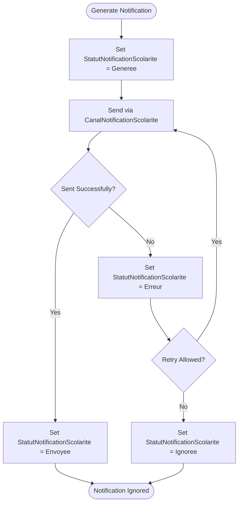
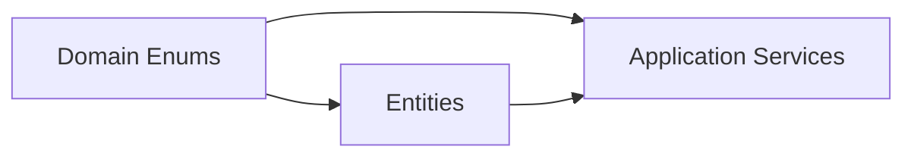

# Enumerations and Constants

<cite>
**Referenced Files in This Document**
- [StatutInscription.cs](file://RIIS.Academic.Domain/Enums/StatutInscription.cs)
- [StatutDossierScolarite.cs](file://RIIS.Academic.Domain/Enums/StatutDossierScolarite.cs)
- [StatutPaiementScolarite.cs](file://RIIS.Academic.Domain/Enums/StatutPaiementScolarite.cs)
- [TypeEvaluation.cs](file://RIIS.Academic.Domain/Enums/TypeEvaluation.cs)
- [DecisionAcademique.cs](file://RIIS.Academic.Domain/Enums/DecisionAcademique.cs)
- [Sexe.cs](file://RIIS.Academic.Domain/Enums/Sexe.cs)
- [AptitudeMedicale.cs](file://RIIS.Academic.Domain/Enums/AptitudeMedicale.cs)
- [CanalNotificationScolarite.cs](file://RIIS.Academic.Domain/Enums/CanalNotificationScolarite.cs)
- [CategorieTypeElementScolarite.cs](file://RIIS.Academic.Domain/Enums/CategorieTypeElementScolarite.cs)
- [StatutDocumentScolarite.cs](file://RIIS.Academic.Domain/Enums/StatutDocumentScolarite.cs)
- [StatutEcheanceScolarite.cs](file://RIIS.Academic.Domain/Enums/StatutEcheanceScolarite.cs)
- [StatutElementScolarite.cs](file://RIIS.Academic.Domain/Enums/StatutElementScolarite.cs)
- [StatutMaquettePedagogique.cs](file://RIIS.Academic.Domain/Enums/StatutMaquettePedagogique.cs)
- [StatutNotificationScolarite.cs](file://RIIS.Academic.Domain/Enums/StatutNotificationScolarite.cs)
- [StatutPresenceEvaluation.cs](file://RIIS.Academic.Domain/Enums/StatutPresenceEvaluation.cs)
- [StatutValidationAcademique.cs](file://RIIS.Academic.Domain/Enums/StatutValidationAcademique.cs)
- [StatutValidationScolarite.cs](file://RIIS.Academic.Domain/Enums/StatutValidationScolarite.cs)
- [TypeElementConstitutif.cs](file://RIIS.Academic.Domain/Enums/TypeElementConstitutif.cs)
</cite>

## Table of Contents
1. [Introduction](#introduction)
2. [Project Structure](#project-structure)
3. [Core Components](#core-components)
4. [Architecture Overview](#architecture-overview)
5. [Detailed Component Analysis](#detailed-component-analysis)
6. [Dependency Analysis](#dependency-analysis)
7. [Performance Considerations](#performance-considerations)
8. [Troubleshooting Guide](#troubleshooting-guide)
9. [Conclusion](#conclusion)

## Introduction
This document catalogs all enumerations and constants defined in the domain layer, focusing on their purpose, values, and usage across entity lifecycles and business rules. It covers:
- Status enumerations that track lifecycle states for enrollment, student records, and payments
- Type enumerations used to categorize evaluations and curriculum elements
- Decision enumerations representing academic outcomes
- Descriptive enumerations for demographic and medical attributes
- Notification and validation statuses for school administration processes

The goal is to provide a clear reference for developers implementing domain logic, validation, and UI rendering based on these enumerations.

## Project Structure
Enumerations are centralized under the domain layer’s Enums directory. They are consumed by entities and services throughout the application to enforce consistent state modeling and decision-making.

[No sources needed since this diagram shows conceptual structure, not specific code mappings]

## Core Components
This section documents each enumeration with its values and intended usage scenarios.

### Enrollment Status (StatutInscription)
Purpose: Tracks the lifecycle of an enrollment record from initiation to completion or cancellation.

Values and usage:
- EnAttente: Enrollment is pending review or processing.
- Validee: Enrollment has been approved and is active.
- Suspendue: Enrollment is temporarily paused due to administrative or financial reasons.
- Annulee: Enrollment is canceled and no longer active.

Usage examples:
- When creating an enrollment, initialize as EnAttente until validated.
- Transition to Validee after successful validation checks.
- Move to Suspendue if fees are unpaid or required documents are missing.
- Set to Annulee when the enrollment is withdrawn or expired.

**Section sources**
- [StatutInscription.cs:3-9](file://RIIS.Academic.Domain/Enums/StatutInscription.cs#L3-L9)

### Student Record Status (StatutDossierScolarite)
Purpose: Represents the overall status of a student’s administrative file.

Values and usage:
- EnPreparation: File is being prepared or assembled.
- EnCours: File is currently active and being processed.
- Regulier: File is complete and compliant.
- Incomplet: File is missing required information or documents.
- EnRetard: File is behind schedule or overdue.
- Bloque: File is blocked due to unresolved issues.
- Cloture: File is closed or finalized.

Usage examples:
- Start as EnPreparation during onboarding.
- Transition to EnCours when processing begins.
- Mark as Regulier once all requirements are met.
- Use Incomplet or EnRetard to indicate deficiencies or delays.
- Block the file (Bloque) for critical issues; close (Cloture) upon graduation or withdrawal.

**Section sources**
- [StatutDossierScolarite.cs:3-12](file://RIIS.Academic.Domain/Enums/StatutDossierScolarite.cs#L3-L12)

### Payment Status (StatutPaiementScolarite)
Purpose: Indicates the allocation status of a payment against tuition obligations.

Values and usage:
- NonAffecte: Payment exists but is not yet allocated to any obligation.
- PartiellementAffecte: Payment is partially applied to one or more obligations.
- Affecte: Payment is fully allocated.
- Annule: Payment is canceled.

Usage examples:
- Create a payment as NonAffecte until allocation occurs.
- Allocate funds to specific dues to reach PartiellementAffecte or Affecte.
- Cancel erroneous payments by setting Annule.

**Section sources**
- [StatutPaiementScolarite.cs:3-9](file://RIIS.Academic.Domain/Enums/StatutPaiementScolarite.cs#L3-L9)

### Evaluation Type (TypeEvaluation)
Purpose: Categorizes the type of academic evaluation for grading and reporting.

Values and usage:
- ControleContinu: Continuous assessment during the term.
- ControleConnaissance: Knowledge-based assessment.
- SessionNormale: Regular examination session.
- SessionRattrapage: Make-up or remediation session.

Usage examples:
- Assign evaluation types when creating assessments.
- Use SessionRattrapage for students requiring remediation.
- Differentiate scoring and weighting rules per evaluation type.

**Section sources**
- [TypeEvaluation.cs:3-9](file://RIIS.Academic.Domain/Enums/TypeEvaluation.cs#L3-L9)

### Academic Decision (DecisionAcademique)
Purpose: Captures the outcome of academic deliberation for a student or course.

Values and usage:
- NonDeliberee: No decision has been made yet.
- Valide: Student/course is validated.
- AutoriseRattrapage: Student is authorized to take a make-up exam.
- Ajoune: Student is held back or deferred.

Usage examples:
- Initialize decisions as NonDeliberee before committee review.
- Update to Valide, AutoriseRattrapage, or Ajoune based on results and policies.

**Section sources**
- [DecisionAcademique.cs:3-9](file://RIIS.Academic.Domain/Enums/DecisionAcademique.cs#L3-L9)

### Gender (Sexe)
Purpose: Records demographic gender information for students.

Values and usage:
- NonRenseigne: Not provided or unknown.
- Masculin: Male.
- Feminin: Female.

Usage examples:
- Default to NonRenseigne if not specified.
- Populate during student registration when available.

**Section sources**
- [Sexe.cs:3-8](file://RIIS.Academic.Domain/Enums/Sexe.cs#L3-L8)

### Medical Fitness (AptitudeMedicale)
Purpose: Indicates medical fitness status relevant to participation in academic activities.

Values and usage:
- NonRenseignee: Not provided or unknown.
- Apte: Fit to participate.
- Inapte: Not fit to participate.

Usage examples:
- Set NonRenseignee initially; update after medical review.
- Restrict certain activities when Inapte.

**Section sources**
- [AptitudeMedicale.cs:3-8](file://RIIS.Academic.Domain/Enums/AptitudeMedicale.cs#L3-L8)

### School Notification Channel (CanalNotificationScolarite)
Purpose: Specifies the channel used to send school-related notifications.

Values and usage:
- Interne: Internal system notification.
- Email: Email message.
- Sms: SMS message.
- WhatsApp: WhatsApp message.

Usage examples:
- Choose channel based on user preferences and policy.
- Fallback to Interne if external channels fail.

**Section sources**
- [CanalNotificationScolarite.cs:3-9](file://RIIS.Academic.Domain/Enums/CanalNotificationScolarite.cs#L3-L9)

### School Element Category (CategorieTypeElementScolarite)
Purpose: Classifies school elements such as fees, documents, validations, or services.

Values and usage:
- Frais: Monetary fee.
- Document: Required document submission.
- Validation: Administrative validation step.
- Service: Additional service provision.
- Autre: Other category.

Usage examples:
- Tag elements accordingly to apply specific workflows and validations.

**Section sources**
- [CategorieTypeElementScolarite.cs:3-10](file://RIIS.Academic.Domain/Enums/CategorieTypeElementScolarite.cs#L3-L10)

### School Document Status (StatutDocumentScolarite)
Purpose: Tracks the lifecycle of submitted documents.

Values and usage:
- EnAttente: Waiting for submission or review.
- Depose: Submitted and awaiting processing.
- Valide: Approved.
- Rejete: Rejected; requires correction or resubmission.
- Expire: No longer valid.

Usage examples:
- Move to Depose upon upload; validate to Valide or reject to Rejete.
- Expire outdated documents automatically.

**Section sources**
- [StatutDocumentScolarite.cs:3-10](file://RIIS.Academic.Domain/Enums/StatutDocumentScolarite.cs#L3-L10)

### Due Date Status (StatutEcheanceScolarite)
Purpose: Represents the status of a tuition due date.

Values and usage:
- NonExigible: Not yet due.
- EnAttente: Awaiting payment.
- Partielle: Partially paid.
- Payee: Fully paid.
- EnRetard: Overdue.
- Annulee: Canceled.

Usage examples:
- Generate due dates as NonExigible; transition to EnAttente when due.
- Update to Partielle or Payee upon payments; mark EnRetard if overdue.

**Section sources**
- [StatutEcheanceScolarite.cs:3-11](file://RIIS.Academic.Domain/Enums/StatutEcheanceScolarite.cs#L3-L11)

### School Element Status (StatutElementScolarite)
Purpose: Overall status of a school element (fee, document, validation, service).

Values and usage:
- NonDemarre: Not started.
- EnAttente: Pending action.
- Partiel: Partially completed.
- Solde: Fully settled/completed.
- EnRetard: Behind schedule.
- Bloque: Blocked.
- Valide: Validated/approved.
- NonApplicable: Not applicable to current context.

Usage examples:
- Start as NonDemarre; progress through EnAttente to Solde or Valide.
- Block or mark non-applicable based on eligibility rules.

**Section sources**
- [StatutElementScolarite.cs:3-13](file://RIIS.Academic.Domain/Enums/StatutElementScolarite.cs#L3-L13)

### Curriculum Blueprint Status (StatutMaquettePedagogique)
Purpose: Lifecycle of a pedagogical blueprint (curriculum plan).

Values and usage:
- Brouillon: Draft stage.
- Active: Published and in use.
- Archivee: Archived and no longer active.

Usage examples:
- Create blueprints as Brouillon; activate when ready.
- Archive obsolete versions.

**Section sources**
- [StatutMaquettePedagogique.cs:3-8](file://RIIS.Academic.Domain/Enums/StatutMaquettePedagogique.cs#L3-L8)

### Notification Status (StatutNotificationScolarite)
Purpose: Tracks the delivery status of notifications.

Values and usage:
- Generee: Generated and queued.
- Envoyee: Successfully sent.
- Erreur: Failed to send.
- Ignoree: Ignored by recipient or system.

Usage examples:
- Queue as Generee; update to Envoyee on success or Erreur on failure.
- Mark Ignoree if explicitly ignored.

**Section sources**
- [StatutNotificationScolarite.cs:3-9](file://RIIS.Academic.Domain/Enums/StatutNotificationScolarite.cs#L3-L9)

### Evaluation Attendance Status (StatutPresenceEvaluation)
Purpose: Records attendance for evaluations.

Values and usage:
- Present: Attended.
- AbsenceJustifiee: Justified absence.
- AbsenceNonJustifiee: Unjustified absence.
- Dispense: Exempted from attendance.

Usage examples:
- Mark attendance at evaluation time; handle absences per policy.

**Section sources**
- [StatutPresenceEvaluation.cs:3-9](file://RIIS.Academic.Domain/Enums/StatutPresenceEvaluation.cs#L3-L9)

### Academic Validation Status (StatutValidationAcademique)
Purpose: Indicates the validation result for academic units or semesters.

Values and usage:
- NonCalcule: Not yet calculated.
- Valide: Validated.
- Rattrapage: Requires remediation.
- NonValide: Not validated.

Usage examples:
- Compute results to set NonCalcule to a final state.
- Trigger remediation workflows for Rattrapage.

**Section sources**
- [StatutValidationAcademique.cs:3-9](file://RIIS.Academic.Domain/Enums/StatutValidationAcademique.cs#L3-L9)

### School Validation Status (StatutValidationScolarite)
Purpose: Tracks administrative validation steps within school processes.

Values and usage:
- EnAttente: Pending validation.
- Validee: Approved.
- Rejetee: Rejected.
- Annulee: Canceled.

Usage examples:
- Submit for validation as EnAttente; proceed to Validee, Rejetee, or Annulee based on review.

**Section sources**
- [StatutValidationScolarite.cs:3-9](file://RIIS.Academic.Domain/Enums/StatutValidationScolarite.cs#L3-L9)

### Constituent Element Type (TypeElementConstitutif)
Purpose: Categorizes constituent elements within a curriculum (courses, projects, etc.).

Values and usage:
- Cours: Course.
- Stage: Internship/practical training.
- Projet: Project-based work.
- Memoire: Thesis/dissertation.
- Autre: Other type.

Usage examples:
- Classify elements to apply specific evaluation and credit rules.

**Section sources**
- [TypeElementConstitutif.cs:3-10](file://RIIS.Academic.Domain/Enums/TypeElementConstitutif.cs#L3-L10)

## Architecture Overview
The enumerations serve as shared contracts between entities and services, ensuring consistent state representation and decision-making across the domain.

```mermaid
classDiagram
class StatutInscription
class StatutDossierScolarite
class StatutPaiementScolarite
class TypeEvaluation
class DecisionAcademique
class Sexe
class AptitudeMedicale
class CanalNotificationScolarite
class CategorieTypeElementScolarite
class StatutDocumentScolarite
class StatutEcheanceScolarite
class StatutElementScolarite
class StatutMaquettePedagogique
class StatutNotificationScolarite
class StatutPresenceEvaluation
class StatutValidationAcademique
class StatutValidationScolarite
class TypeElementConstitutif
StatutInscription <.. Entities : "used by"
StatutDossierScolarite <.. Entities : "used by"
StatutPaiementScolarite <.. Entities : "used by"
TypeEvaluation <.. Entities : "used by"
DecisionAcademique <.. Entities : "used by"
Sexe <.. Entities : "used by"
AptitudeMedicale <.. Entities : "used by"
CanalNotificationScolarite <.. Services : "used by"
CategorieTypeElementScolarite <.. Services : "used by"
StatutDocumentScolarite <.. Services : "used by"
StatutEcheanceScolarite <.. Services : "used by"
StatutElementScolarite <.. Services : "used by"
StatutMaquettePedagogique <.. Services : "used by"
StatutNotificationScolarite <.. Services : "used by"
StatutPresenceEvaluation <.. Services : "used by"
StatutValidationAcademique <.. Services : "used by"
StatutValidationScolarite <.. Services : "used by"
TypeElementConstitutif <.. Services : "used by"
```

**Diagram sources**
- [StatutInscription.cs:3-9](file://RIIS.Academic.Domain/Enums/StatutInscription.cs#L3-L9)
- [StatutDossierScolarite.cs:3-12](file://RIIS.Academic.Domain/Enums/StatutDossierScolarite.cs#L3-L12)
- [StatutPaiementScolarite.cs:3-9](file://RIIS.Academic.Domain/Enums/StatutPaiementScolarite.cs#L3-L9)
- [TypeEvaluation.cs:3-9](file://RIIS.Academic.Domain/Enums/TypeEvaluation.cs#L3-L9)
- [DecisionAcademique.cs:3-9](file://RIIS.Academic.Domain/Enums/DecisionAcademique.cs#L3-L9)
- [Sexe.cs:3-8](file://RIIS.Academic.Domain/Enums/Sexe.cs#L3-L8)
- [AptitudeMedicale.cs:3-8](file://RIIS.Academic.Domain/Enums/AptitudeMedicale.cs#L3-L8)
- [CanalNotificationScolarite.cs:3-9](file://RIIS.Academic.Domain/Enums/CanalNotificationScolarite.cs#L3-L9)
- [CategorieTypeElementScolarite.cs:3-10](file://RIIS.Academic.Domain/Enums/CategorieTypeElementScolarite.cs#L3-L10)
- [StatutDocumentScolarite.cs:3-10](file://RIIS.Academic.Domain/Enums/StatutDocumentScolarite.cs#L3-L10)
- [StatutEcheanceScolarite.cs:3-11](file://RIIS.Academic.Domain/Enums/StatutEcheanceScolarite.cs#L3-L11)
- [StatutElementScolarite.cs:3-13](file://RIIS.Academic.Domain/Enums/StatutElementScolarite.cs#L3-L13)
- [StatutMaquettePedagogique.cs:3-8](file://RIIS.Academic.Domain/Enums/StatutMaquettePedagogique.cs#L3-L8)
- [StatutNotificationScolarite.cs:3-9](file://RIIS.Academic.Domain/Enums/StatutNotificationScolarite.cs#L3-L9)
- [StatutPresenceEvaluation.cs:3-9](file://RIIS.Academic.Domain/Enums/StatutPresenceEvaluation.cs#L3-L9)
- [StatutValidationAcademique.cs:3-9](file://RIIS.Academic.Domain/Enums/StatutValidationAcademique.cs#L3-L9)
- [StatutValidationScolarite.cs:3-9](file://RIIS.Academic.Domain/Enums/StatutValidationScolarite.cs#L3-L9)
- [TypeElementConstitutif.cs:3-10](file://RIIS.Academic.Domain/Enums/TypeElementConstitutif.cs#L3-L10)

## Detailed Component Analysis

### Enrollment Lifecycle Flow
This flow illustrates how StatutInscription transitions occur during enrollment processing.

**Diagram sources**
- [StatutInscription.cs:3-9](file://RIIS.Academic.Domain/Enums/StatutInscription.cs#L3-L9)

**Section sources**
- [StatutInscription.cs:3-9](file://RIIS.Academic.Domain/Enums/StatutInscription.cs#L3-L9)

### Payment Allocation Flow
This flow demonstrates how StatutPaiementScolarite updates as payments are allocated.

**Diagram sources**
- [StatutPaiementScolarite.cs:3-9](file://RIIS.Academic.Domain/Enums/StatutPaiementScolarite.cs#L3-L9)

**Section sources**
- [StatutPaiementScolarite.cs:3-9](file://RIIS.Academic.Domain/Enums/StatutPaiementScolarite.cs#L3-L9)

### Academic Decision Workflow
This sequence shows how DecisionAcademique is determined after evaluation results.

**Diagram sources**
- [DecisionAcademique.cs:3-9](file://RIIS.Academic.Domain/Enums/DecisionAcademique.cs#L3-L9)

**Section sources**
- [DecisionAcademique.cs:3-9](file://RIIS.Academic.Domain/Enums/DecisionAcademique.cs#L3-L9)

### Notification Delivery Flow
This flow tracks StatutNotificationScolarite during notification dispatch.

**Diagram sources**
- [StatutNotificationScolarite.cs:3-9](file://RIIS.Academic.Domain/Enums/StatutNotificationScolarite.cs#L3-L9)
- [CanalNotificationScolarite.cs:3-9](file://RIIS.Academic.Domain/Enums/CanalNotificationScolarite.cs#L3-L9)

**Section sources**
- [StatutNotificationScolarite.cs:3-9](file://RIIS.Academic.Domain/Enums/StatutNotificationScolarite.cs#L3-L9)
- [CanalNotificationScolarite.cs:3-9](file://RIIS.Academic.Domain/Enums/CanalNotificationScolarite.cs#L3-L9)

## Dependency Analysis
Enumerations are pure value types with no runtime dependencies beyond the .NET base library. They are referenced by entities and services to model state consistently. There are no circular dependencies among enumerations themselves.

[No sources needed since this diagram shows conceptual relationships, not specific code mappings]

## Performance Considerations
- Enumerations are lightweight and efficient for state representation.
- Prefer using enums over strings to avoid comparison overhead and ensure type safety.
- Centralized definitions reduce duplication and improve maintainability.

[No sources needed since this section provides general guidance]

## Troubleshooting Guide
Common issues and resolutions:
- Invalid state transitions: Ensure business rules enforce allowed transitions between enum values.
- Missing default handling: Always account for NonRenseigne/NonCalcule/NonDeliberee cases in logic.
- Notification failures: Handle Erreur and Ignoree states to retry or log appropriately.
- Payment mismatches: Validate allocation logic to prevent inconsistent StatutPaiementScolarite values.

**Section sources**
- [StatutNotificationScolarite.cs:3-9](file://RIIS.Academic.Domain/Enums/StatutNotificationScolarite.cs#L3-L9)
- [StatutPaiementScolarite.cs:3-9](file://RIIS.Academic.Domain/Enums/StatutPaiementScolarite.cs#L3-L9)
- [DecisionAcademique.cs:3-9](file://RIIS.Academic.Domain/Enums/DecisionAcademique.cs#L3-L9)

## Conclusion
The enumerations in the domain layer provide a robust foundation for modeling entity lifecycles, categorizing academic elements, and enforcing consistent business rules. By adhering to these definitions, developers can implement reliable validation, reporting, and workflow automation across the academic management system.

[No sources needed since this section summarizes without analyzing specific files]