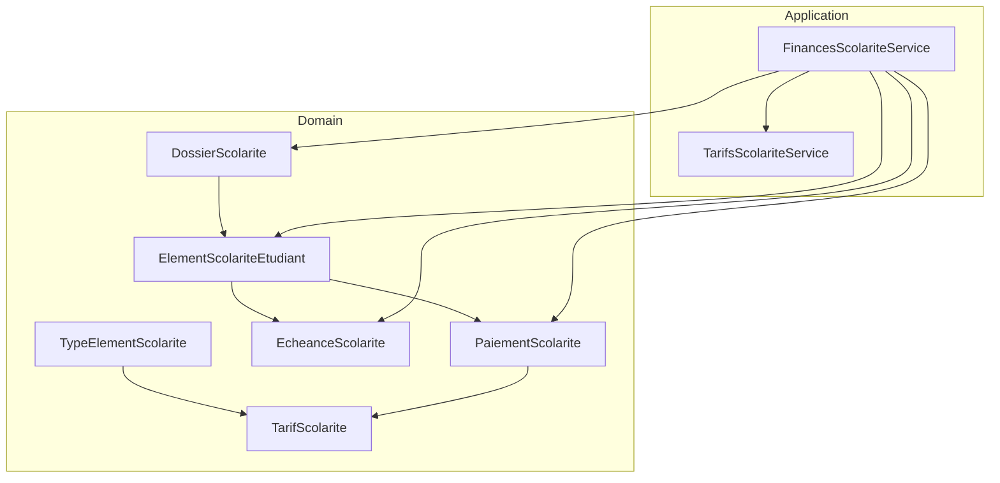
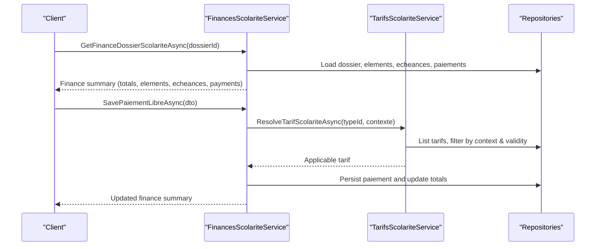
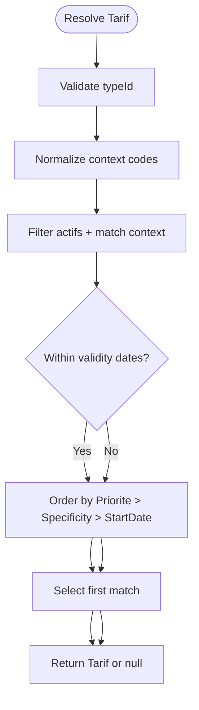
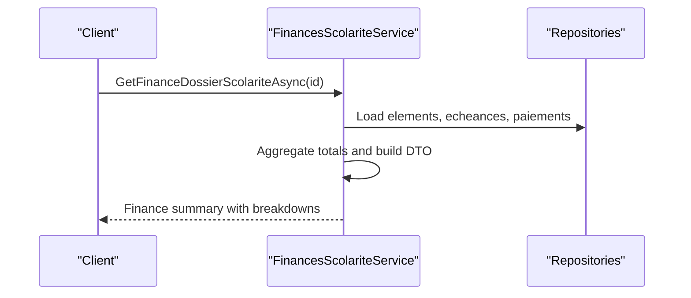
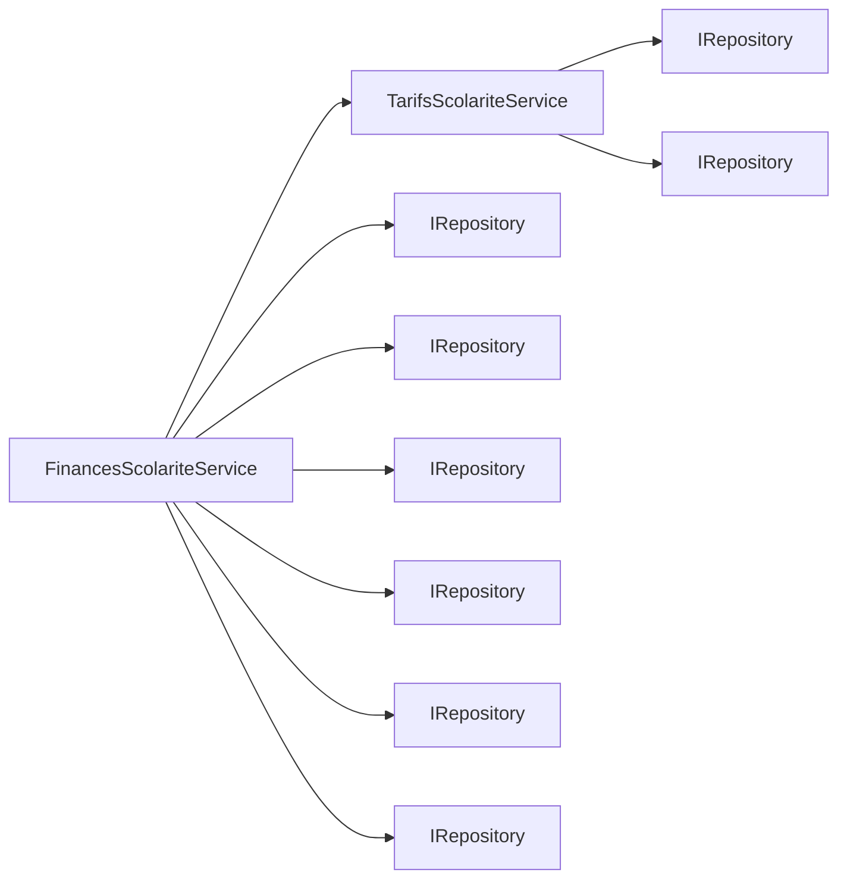

# Fee Structures and Calculations

<cite>
**Referenced Files in This Document**
- [TarifScolarite.cs](file://RIIS.Academic.Domain/Scolarite/TarifScolarite.cs)
- [TypeElementScolarite.cs](file://RIIS.Academic.Domain/Scolarite/TypeElementScolarite.cs)
- [CategorieTypeElementScolarite.cs](file://RIIS.Academic.Domain/Enums/CategorieTypeElementScolarite.cs)
- [StatutElementScolarite.cs](file://RIIS.Academic.Domain/Enums/StatutElementScolarite.cs)
- [ElementScolariteEtudiant.cs](file://RIIS.Academic.Domain/Scolarite/ElementScolariteEtudiant.cs)
- [EcheanceScolarite.cs](file://RIIS.Academic.Domain/Scolarite/EcheanceScolarite.cs)
- [DossierScolarite.cs](file://RIIS.Academic.Domain/Scolarite/DossierScolarite.cs)
- [PaiementScolarite.cs](file://RIIS.Academic.Domain/Scolarite/PaiementScolarite.cs)
- [TarifsScolariteService.cs](file://RIIS.Academic.Application/Scolarite/Services/TarifsScolariteService.cs)
- [FinancesScolariteService.cs](file://RIIS.Academic.Application/Scolarite/Services/FinancesScolariteService.cs)
- [TarifScolariteDto.cs](file://RIIS.Academic.Application/Scolarite/Dtos/TarifScolariteDto.cs)
- [TypeElementScolariteDto.cs](file://RIIS.Academic.Application/Scolarite/Dtos/TypeElementScolariteDto.cs)
- [TarifScolariteContexteDto.cs](file://RIIS.Academic.Application/Scolarite/Dtos/TarifScolariteContexteDto.cs)
</cite>

## Table of Contents
1. Introduction
2. Project Structure
3. Core Components
4. Architecture Overview
5. Detailed Component Analysis
6. Dependency Analysis
7. Performance Considerations
8. Troubleshooting Guide
9. Conclusion

## Introduction
This document explains the fee structures and calculation engine for student tuition and related charges. It covers:
- How fees are defined and categorized using TarifScolarite, TypeElementScolarite, CategorieTypeElementScolarite, and StatutElementScolarite.
- How applicable tariffs are resolved per student context (academic year, cycle, level, department, specialty).
- How obligations, installments, payments, and allocations are modeled and aggregated.
- Practical examples for creating fee structures, applying discounts via tariff selection, calculating totals, and generating breakdowns per student.

## Project Structure
The fee system spans domain entities, application services, and DTOs:
- Domain layer defines core concepts: types of fee elements, tariffs, student fee items, installments, payments, and student dossiers.
- Application layer provides services to manage tariffs, resolve applicable amounts, and compute financial summaries.
- DTOs carry request/response shapes across boundaries.

**Diagram sources**
- [TypeElementScolarite.cs:1-19](file://RIIS.Academic.Domain/Scolarite/TypeElementSolarite.cs#L1-L19)
- [TarifScolarite.cs:1-22](file://RIIS.Academic.Domain/Scolarite/TarifScolarite.cs#L1-L22)
- [ElementScolariteEtudiant.cs:1-26](file://RIIS.Academic.Domain/Scolarite/ElementScolariteEtudiant.cs#L1-L26)
- [EcheanceScolarite.cs:1-20](file://RIIS.Academic.Domain/Scolarite/EcheanceScolarite.cs#L1-L20)
- [PaiementScolarite.cs:1-29](file://RIIS.Academic.Domain/Scolarite/PaiementScolarite.cs#L1-L29)
- [DossierScolarite.cs:1-29](file://RIIS.Academic.Domain/Scolarite/DossierScolarite.cs#L1-L29)
- [TarifsScolariteService.cs:1-429](file://RIIS.Academic.Application/Scolarite/Services/TarifsScolariteService.cs#L1-L429)
- [FinancesScolariteService.cs:1-361](file://RIIS.Academic.Application/Scolarite/Services/FinancesScolariteService.cs#L1-L361)

**Section sources**
- [TarifScolarite.cs:1-22](file://RIIS.Academic.Domain/Scolarite/TarifScolarite.cs#L1-L22)
- [TypeElementScolarite.cs:1-19](file://RIIS.Academic.Domain/Scolarite/TypeElementScolarite.cs#L1-L19)
- [CategorieTypeElementScolarite.cs:1-11](file://RIIS.Academic.Domain/Enums/CategorieTypeElementScolarite.cs#L1-L11)
- [StatutElementScolarite.cs:1-14](file://RIIS.Academic.Domain/Enums/StatutElementScolarite.cs#L1-L14)
- [ElementScolariteEtudiant.cs:1-26](file://RIIS.Academic.Domain/Scolarite/ElementScolariteEtudiant.cs#L1-L26)
- [EcheanceScolarite.cs:1-20](file://RIIS.Academic.Domain/Scolarite/EcheanceScolarite.cs#L1-L20)
- [DossierScolarite.cs:1-29](file://RIIS.Academic.Domain/Scolarite/DossierScolarite.cs#L1-L29)
- [PaiementScolarite.cs:1-29](file://RIIS.Academic.Domain/Scolarite/PaiementScolarite.cs#L1-L29)
- [TarifsScolariteService.cs:1-429](file://RIIS.Academic.Application/Scolarite/Services/TarifsScolariteService.cs#L1-L429)
- [FinancesScolariteService.cs:1-361](file://RIIS.Academic.Application/Scolarite/Services/FinancesScolariteService.cs#L1-L361)

## Core Components
- TypeElementScolarite: Defines a fee element type (e.g., tuition, registration, library), its category, whether it is payable or documentary, and display order.
- CategorieTypeElementScolarite: Groups fee elements into categories such as Fees, Documents, Validation, Services, Other.
- TarifScolarite: A concrete amount tied to a fee element type and a specific academic context (year, cycle, level, department, specialty), with validity dates and priority.
- ElementScolariteEtudiant: Per-student obligation line with expected, allocated, and remaining amounts; includes status tracking.
- EcheanceScolarite: Installment schedule linked to a student fee item with due date and amounts.
- PaiementScolarite: Payment records with total amount, allocated portion, unallocated remainder, and status.
- DossierScolarite: Student administrative record that aggregates elements, payments, and notifications.

Key behaviors:
- Tariffs are resolved by matching active entries against the student’s academic context and reference date, preferring higher priority and more specific contexts.
- Financial summaries aggregate expected vs paid amounts across elements, installments, and payments.

**Section sources**
- [TypeElementScolarite.cs:1-19](file://RIIS.Academic.Domain/Scolarite/TypeElementScolarite.cs#L1-L19)
- [CategorieTypeElementScolarite.cs:1-11](file://RIIS.Academic.Domain/Enums/CategorieTypeElementScolarite.cs#L1-L11)
- [TarifScolarite.cs:1-22](file://RIIS.Academic.Domain/Scolarite/TarifScolarite.cs#L1-L22)
- [ElementScolariteEtudiant.cs:1-26](file://RIIS.Academic.Domain/Scolarite/ElementScolariteEtudiant.cs#L1-L26)
- [EcheanceScolarite.cs:1-20](file://RIIS.Academic.Domain/Scolarite/EcheanceScolarite.cs#L1-L20)
- [PaiementScolarite.cs:1-29](file://RIIS.Academic.Domain/Scolarite/PaiementScolarite.cs#L1-L29)
- [DossierScolarite.cs:1-29](file://RIIS.Academic.Domain/Scolarite/DossierScolarite.cs#L1-L29)

## Architecture Overview
The architecture separates concerns:
- Domain models define the fee universe and relationships.
- TarifsScolariteService manages CRUD and resolution of tariffs based on context and validity.
- FinancesScolariteService orchestrates reading student dossiers, computing totals, listing payment options, and persisting payments.

**Diagram sources**
- [FinancesScolariteService.cs:17-141](file://RIIS.Academic.Application/Scolarite/Services/FinancesScolariteService.cs#L17-L141)
- [TarifsScolariteService.cs:195-238](file://RIIS.Academic.Application/Scolarite/Services/TarifsScolariteService.cs#L195-L238)

**Section sources**
- [FinancesScolariteService.cs:17-141](file://RIIS.Academic.Application/Scolarite/Services/FinancesScolariteService.cs#L17-L141)
- [TarifsScolariteService.cs:195-238](file://RIIS.Academic.Application/Scolarite/Services/TarifsScolariteService.cs#L195-L238)

## Detailed Component Analysis

### Fee Types and Categories
- TypeElementScolarite captures the definition of each charge type, including whether it is payable, documentary, requires validation, mandatory, and display order.
- CategorieTypeElementScolarite groups these types into logical categories (Fees, Documents, Validation, Services, Other).

Use cases:
- Define new charge types (tuition, registration, library, exam fees).
- Mark some as non-payable (documents only) or requiring validation before invoicing.

**Section sources**
- [TypeElementScolarite.cs:1-19](file://RIIS.Academic.Domain/Scolarite/TypeElementScolarite.cs#L1-L19)
- [CategorieTypeElementScolarite.cs:1-11](file://RIIS.Academic.Domain/Enums/CategorieTypeElementScolarite.cs#L1-L11)

### Tariff Model and Resolution
- TarifScolarite stores the amount, currency, validity window, and specificity fields (cycle, level, department, specialty).
- TarifsScolariteService resolves the applicable tariff for a given fee element type and student context:
  - Filters by academic year, cycle, level, department, specialty.
  - Enforces activity and validity dates.
  - Orders by priority, then specificity, then start date.

**Diagram sources**
- [TarifsScolariteService.cs:195-238](file://RIIS.Academic.Application/Scolarite/Services/TarifsScolariteService.cs#L195-L238)

**Section sources**
- [TarifScolarite.cs:1-22](file://RIIS.Academic.Domain/Scolarite/TarifScolarite.cs#L1-L22)
- [TarifsScolariteService.cs:195-238](file://RIIS.Academic.Application/Scolarite/Services/TarifsScolariteService.cs#L195-L238)

### Student Obligations and Status Tracking
- ElementScolariteEtudiant tracks per-student obligations with expected, allocated, and remaining amounts and a status from StatutElementScolarite.
- Status values include Not started, Pending, Partial, Settled, Overdue, Blocked, Valid, Not applicable.

Practical usage:
- Create an obligation line when a fee element applies to a student.
- Update MontantAffecte as payments are allocated; MontantRestant reflects unpaid balance.
- Use StatutElementScolarite to reflect progress toward settlement.

**Section sources**
- [ElementScolariteEtudiant.cs:1-26](file://RIIS.Academic.Domain/Scolarite/ElementScolariteEtudiant.cs#L1-L26)
- [StatutElementScolarite.cs:1-14](file://RIIS.Academic.Domain/Enums/StatutElementScolarite.cs#L1-L14)

### Installments and Payments
- EcheanceScolarite represents scheduled due dates with expected and remaining amounts.
- PaiementScolarite records payments with total amount, allocated portion, unallocated remainder, and status.

Aggregation:
- FinancesScolariteService computes totals for payments, allocated payments, and unallocated payments for a dossier.

**Section sources**
- [EcheanceScolarite.cs:1-20](file://RIIS.Academic.Domain/Scolarite/EcheanceScolarite.cs#L1-L20)
- [PaiementScolarite.cs:1-29](file://RIIS.Academic.Domain/Scolarite/PaiementScolarite.cs#L1-L29)
- [FinancesScolariteService.cs:143-193](file://RIIS.Academic.Application/Scolarite/Services/FinancesScolariteService.cs#L143-L193)

### Applying Discounts via Tariff Selection
Discounts are implemented through tariff selection rather than explicit discount rules:
- Define multiple tariffs for the same fee element type with different amounts.
- Choose the lower amount tariff for eligible students (e.g., scholarships, special programs) by setting appropriate context (cycle, level, department, specialty) and priority.
- The resolution algorithm selects the most specific and highest-priority active tariff within validity.

Example pattern:
- Base tuition tariff for all students.
- Reduced tuition tariff for a specific program or scholarship group.
- When resolving for a student in that program, the reduced tariff is selected automatically.

**Section sources**
- [TarifsScolariteService.cs:195-238](file://RIIS.Academic.Application/Scolarite/Services/TarifsScolariteService.cs#L195-L238)
- [FinancesScolariteService.cs:264-279](file://RIIS.Academic.Application/Scolarite/Services/FinancesScolariteService.cs#L264-L279)

### Automatic Fee Generation Based on Enrollment
While automatic generation logic is not shown in the referenced files, the model supports it:
- For each student dossier, iterate applicable TypeElementScolarite entries marked as payable and/or mandatory.
- For each type, resolve the applicable TarifScolarite using the student’s context.
- Create ElementScolariteEtudiant lines with MontantAttendu from the resolved tariff.
- Optionally create EcheanceScolarite entries based on policy (e.g., monthly installments).
- Set initial statuses and timestamps.

Implementation guidance:
- Use FinancesScolariteService.GetOptionsTypesElementsTarifsPaiementAsync to discover payable types and their applicable tariffs for a dossier.
- Use TarifsScolariteService.ResolveTarifScolariteAsync to get the exact amount to assign.

**Section sources**
- [FinancesScolariteService.cs:28-56](file://RIIS.Academic.Application/Scolarite/Services/FinancesScolariteService.cs#L28-L56)
- [TarifsScolariteService.cs:195-238](file://RIIS.Academic.Application/Scolarite/Services/TarifsScolariteService.cs#L195-L238)

### Calculating Total Obligations and Breakdowns
To compute totals and generate breakdowns:
- Retrieve the dossier’s elements, echeances, and payments via FinancesScolariteService.BuildFinanceDtoAsync.
- Sum MontantAttendu across elements for total obligations.
- Sum MontantAffecte across payments for total applied.
- Compute remaining balances per element and overall.

**Diagram sources**
- [FinancesScolariteService.cs:143-193](file://RIIS.Academic.Application/Scolarite/Services/FinancesScolariteService.cs#L143-L193)

**Section sources**
- [FinancesScolariteService.cs:143-193](file://RIIS.Academic.Application/Scolarite/Services/FinancesScolariteService.cs#L143-L193)

## Dependency Analysis
- TarifsScolariteService depends on repositories for TarifScolarite and TypeElementScolarite.
- FinancesScolariteService depends on repositories for dossiers, elements, echeances, payments, modes, and tariff service.
- DTOs bridge between services and callers.

**Diagram sources**
- [TarifsScolariteService.cs:10-13](file://RIIS.Academic.Application/Scolarite/Services/TarifsScolariteService.cs#L10-L13)
- [FinancesScolariteService.cs:7-15](file://RIIS.Academic.Application/Scolarite/Services/FinancesScolariteService.cs#L7-L15)

**Section sources**
- [TarifsScolariteService.cs:10-13](file://RIIS.Academic.Application/Scolarite/Services/TarifsScolariteService.cs#L10-L13)
- [FinancesScolariteService.cs:7-15](file://RIIS.Academic.Application/Scolarite/Services/FinancesScolariteService.cs#L7-L15)

## Performance Considerations
- Tariff resolution filters and sorts in memory after loading lists; consider indexing or server-side filtering if datasets grow large.
- Avoid repeated full-list loads by caching types and tarifs where appropriate at the application boundary.
- Batch operations for generating many student obligations can be optimized by preloading types and tarifs once per batch.

[No sources needed since this section provides general guidance]

## Troubleshooting Guide
Common issues and resolutions:
- Missing tariff for a student: Ensure an active TarifScolarite exists for the student’s academic year, cycle, level, department, specialty, and within validity dates.
- Duplicate tariff conflicts: The save operation prevents duplicates for the same type, year, context, and start date. Adjust one of those fields to resolve.
- Invalid amounts or dates: Amounts must be positive; end date must be after start date. Correct inputs before saving.
- Payment mode inactive: Only active payment modes can be used; activate or select another mode.

Validation and error handling references:
- Saving tariffs enforces required fields, positivity, and date ordering.
- Saving payments validates presence of type, tariff, and active payment mode; ensures selected tariff matches the applicable one for the dossier.

**Section sources**
- [TarifsScolariteService.cs:107-185](file://RIIS.Academic.Application/Scolarite/Services/TarifsScolariteService.cs#L107-L185)
- [FinancesScolariteService.cs:58-141](file://RIIS.Academic.Application/Scolarite/Services/FinancesScolariteService.cs#L58-L141)

## Conclusion
The fee system models tuition and related charges through well-defined types and tariffs, resolves applicable amounts per student context, and aggregates obligations, installments, and payments into clear financial summaries. Discounts are achieved by defining alternative tariffs and letting the resolution algorithm choose the most appropriate one. Automatic generation can be implemented by iterating applicable types and resolving tariffs per student.

[No sources needed since this section summarizes without analyzing specific files]