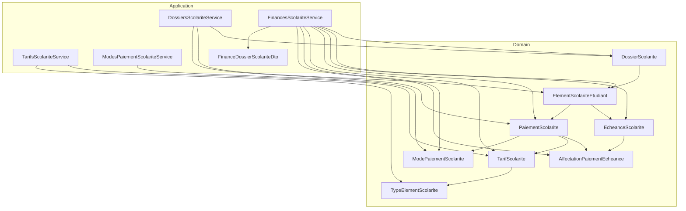
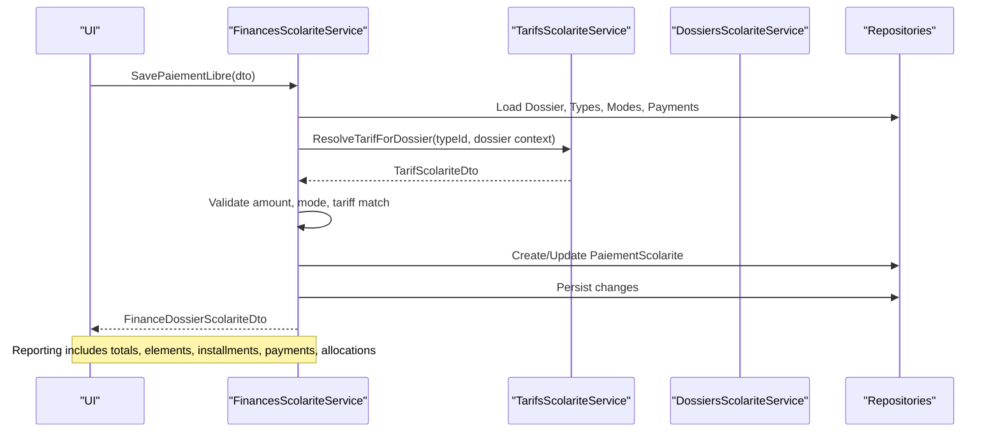
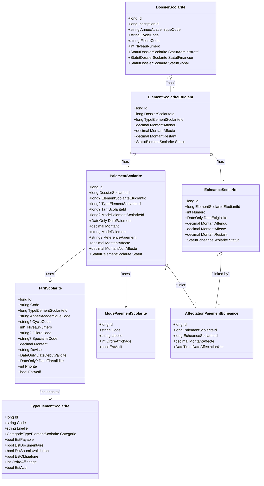
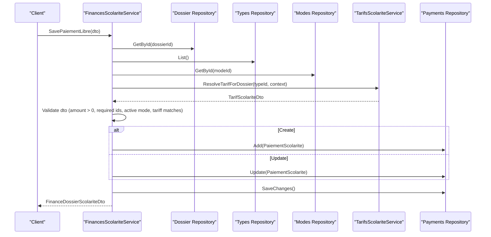
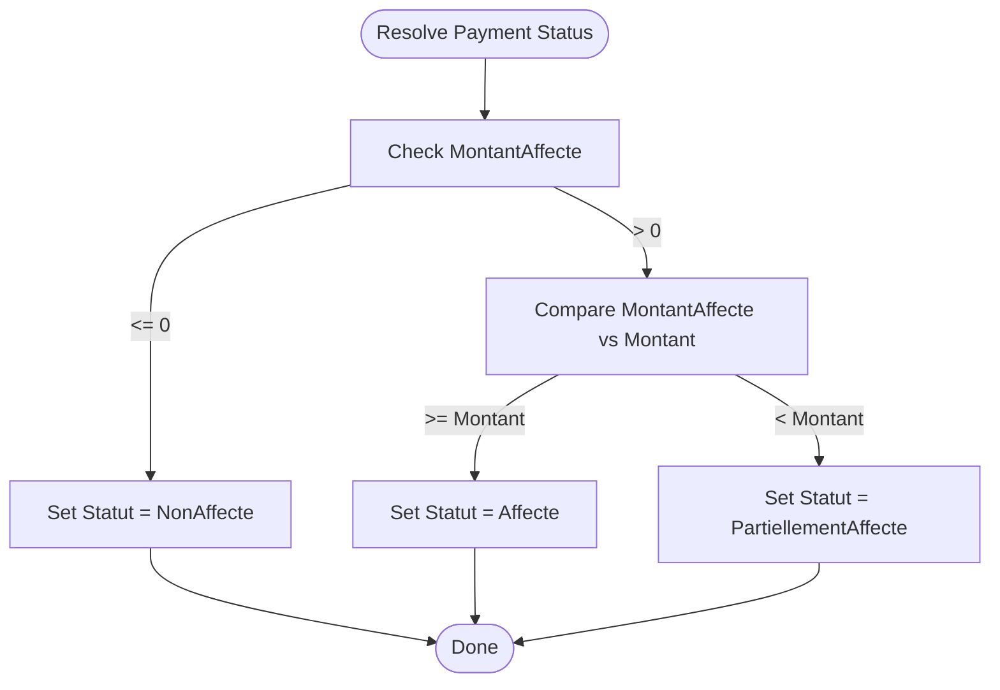
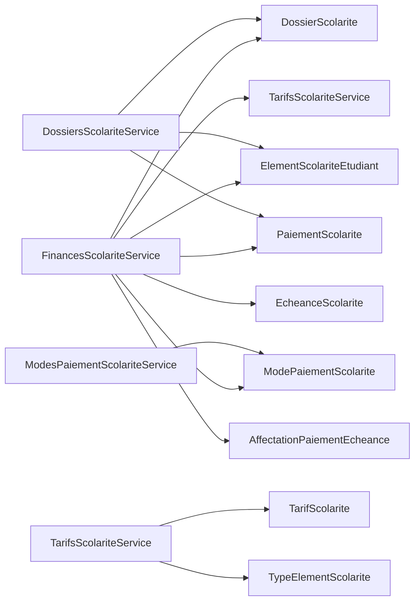

# Financial Administration

<cite>
**Referenced Files in This Document**
- [DossierScolarite.cs](file://src/RIIS.Academic.Domain/Scolarite/DossierScolarite.cs)
- [PaiementScolarite.cs](file://src/RIIS.Academic.Domain/Scolarite/PaiementScolarite.cs)
- [EcheanceScolarite.cs](file://src/RIIS.Academic.Domain/Scolarite/EcheanceScolarite.cs)
- [TarifScolarite.cs](file://src/RIIS.Academic.Domain/Scolarite/TarifScolarite.cs)
- [ModePaiementScolarite.cs](file://src/RIIS.Academic.Domain/Scolarite/ModePaiementScolarite.cs)
- [ElementScolariteEtudiant.cs](file://src/RIIS.Academic.Domain/Scolarite/ElementScolariteEtudiant.cs)
- [TypeElementScolarite.cs](file://src/RIIS.Academic.Domain/Scolarite/TypeElementScolarite.cs)
- [AffectationPaiementEcheance.cs](file://src/RIIS.Academic.Domain/Scolarite/AffectationPaiementEcheance.cs)
- [StatutDossierScolarite.cs](file://src/RIIS.Academic.Domain/Enums/StatutDossierScolarite.cs)
- [StatutPaiementScolarite.cs](file://src/RIIS.Academic.Domain/Enums/StatutPaiementScolarite.cs)
- [StatutEcheanceScolarite.cs](file://src/RIIS.Academic.Domain/Enums/StatutEcheanceScolarite.cs)
- [DossiersScolariteService.cs](file://src/RIIS.Academic.Application/Scolarite/Services/DossiersScolariteService.cs)
- [FinancesScolariteService.cs](file://src/RIIS.Academic.Application/Scolarite/Services/FinancesScolariteService.cs)
- [TarifsScolariteService.cs](file://src/RIIS.Academic.Application/Scolarite/Services/TarifsScolariteService.cs)
- [ModesPaiementScolariteService.cs](file://src/RIIS.Academic.Application/Scolarite/Services/ModesPaiementScolariteService.cs)
- [FinanceDossierScolariteDto.cs](file://src/RIIS.Academic.Application/Scolarite/Dtos/FinanceDossierScolariteDto.cs)
- [TarifScolariteContexteDto.cs](file://src/RIIS.Academic.Application/Scolarite/Dtos/TarifScolariteContexteDto.cs)
</cite>

## Table of Contents
1. Introduction
2. Project Structure
3. Core Components
4. Architecture Overview
5. Detailed Component Analysis
6. Dependency Analysis
7. Performance Considerations
8. Troubleshooting Guide
9. Conclusion

## Introduction
This document explains the financial administration domain model for tuition and fees. It focuses on:
- DossierScolarite as the central financial record per student enrollment
- PaiementScolarite for recording payments
- EcheanceScolarite for installment management
- TarifScolarite for fee structures and selection rules
- ModePaiementScolarite for payment methods
- Status enumerations that drive lifecycle states
- Validation rules, payment scheduling, and reporting capabilities

## Project Structure
The financial module spans Domain entities, Application services, and DTOs:
- Domain: core entities and enums (DossierScolarite, PaiementScolarite, EcheanceScolarite, TarifScolarite, ModePaiementScolarite, ElementScolariteEtudiant, TypeElementScolarite, AffectationPaiementEcheance; status enums)
- Application: services orchestrating business logic (DossiersScolariteService, FinancesScolariteService, TarifsScolariteService, ModesPaiementScolariteService) and DTOs (FinanceDossierScolariteDto, TarifScolariteContexteDto)
- Infrastructure: persistence configuration and repositories (not detailed here)

**Diagram sources**
- [DossierScolarite.cs:1-29](file://src/RIIS.Academic.Domain/Scolarite/DossierScolarite.cs#L1-L29)
- [PaiementScolarite.cs:1-29](file://src/RIIS.Academic.Domain/Scolarite/PaiementScolarite.cs#L1-L29)
- [EcheanceScolarite.cs:1-20](file://src/RIIS.Academic.Domain/Scolarite/EcheanceScolarite.cs#L1-L20)
- [TarifScolarite.cs:1-22](file://src/RIIS.Academic.Domain/Scolarite/TarifScolarite.cs#L1-L22)
- [ModePaiementScolarite.cs:1-13](file://src/RIIS.Academic.Domain/Scolarite/ModePaiementScolarite.cs#L1-L13)
- [ElementScolariteEtudiant.cs:1-26](file://src/RIIS.Academic.Domain/Scolarite/ElementScolariteEtudiant.cs#L1-L26)
- [TypeElementScolarite.cs:1-19](file://src/RIIS.Academic.Domain/Scolarite/TypeElementScolarite.cs#L1-L19)
- [AffectationPaiementEcheance.cs:1-15](file://src/RIIS.Academic.Domain/Scolarite/AffectationPaiementEcheance.cs#L1-L15)
- [FinancesScolariteService.cs:1-361](file://src/RIIS.Academic.Application/Scolarite/Services/FinancesScolariteService.cs#L1-L361)
- [DossiersScolariteService.cs:1-614](file://src/RIIS.Academic.Application/Scolarite/Services/DossiersScolariteService.cs#L1-L614)
- [TarifsScolariteService.cs:1-429](file://src/RIIS.Academic.Application/Scolarite/Services/TarifsScolariteService.cs#L1-L429)
- [ModesPaiementScolariteService.cs:1-96](file://src/RIIS.Academic.Application/Scolarite/Services/ModesPaiementScolariteService.cs#L1-L96)
- [FinanceDossierScolariteDto.cs:1-84](file://src/RIIS.Academic.Application/Scolarite/Dtos/FinanceDossierScolariteDto.cs#L1-L84)

**Section sources**
- [DossierScolarite.cs:1-29](file://src/RIIS.Academic.Domain/Scolarite/DossierScolarite.cs#L1-L29)
- [FinancesScolariteService.cs:1-361](file://src/RIIS.Academic.Application/Scolarite/Services/FinancesScolariteService.cs#L1-L361)

## Core Components
- DossierScolarite: Central financial record tied to an enrollment snapshot (academic year, cycle, program, level). Tracks administrative, financial, and global statuses and aggregates elements, payments, and notifications.
- ElementScolariteEtudiant: Per-student line item for a fee type with expected, allocated, and remaining amounts; hosts installments and documents.
- EcheanceScolarite: Installment schedule linked to an element with due date, expected amount, allocated amount, remaining balance, and status.
- PaiementScolarite: Payment record linked to a dossier, optional element/type/tariff, payment method, date, amount, references, and allocation tracking.
- TarifScolarite: Fee structure with code, context filters (year, cycle, level, filiere, specialty), amount, currency, validity window, priority, and active flag.
- ModePaiementScolarite: Payment method definition with code, label, display order, and active flag.
- AffectationPaiementEcheance: Links a payment to one or more installments with allocated amount and metadata.

Key relationships:
- DossierScolarite has many ElementScolariteEtudiant and PaiementScolarite
- ElementScolariteEtudiant has many EcheanceScolarite and PaiementScolarite
- PaiementScolarite links to TarifScolarite and ModePaiementScolarite
- EcheanceScolarite and PaiementScolarite are connected via AffectationPaiementEcheance

**Section sources**
- [DossierScolarite.cs:1-29](file://src/RIIS.Academic.Domain/Scolarite/DossierScolarite.cs#L1-L29)
- [ElementScolariteEtudiant.cs:1-26](file://src/RIIS.Academic.Domain/Scolarite/ElementScolariteEtudiant.cs#L1-L26)
- [EcheanceScolarite.cs:1-20](file://src/RIIS.Academic.Domain/Scolarite/EcheanceScolarite.cs#L1-L20)
- [PaiementScolarite.cs:1-29](file://src/RIIS.Academic.Domain/Scolarite/PaiementScolarite.cs#L1-L29)
- [TarifScolarite.cs:1-22](file://src/RIIS.Academic.Domain/Scolarite/TarifScolarite.cs#L1-L22)
- [ModePaiementScolarite.cs:1-13](file://src/RIIS.Academic.Domain/Scolarite/ModePaiementScolarite.cs#L1-L13)
- [AffectationPaiementEcheance.cs:1-15](file://src/RIIS.Academic.Domain/Scolarite/AffectationPaiementEcheance.cs#L1-L15)

## Architecture Overview
The application layer exposes services that orchestrate domain entities and enforce business rules:
- DossiersScolariteService manages administrative validation and dossier status computation
- FinancesScolariteService handles free-form payments, options resolution, and financial reporting
- TarifsScolariteService manages tariff CRUD and tariff resolution by context
- ModesPaiementScolariteService manages payment methods

**Diagram sources**
- [FinancesScolariteService.cs:58-141](file://src/RIIS.Academic.Application/Scolarite/Services/FinancesScolariteService.cs#L58-L141)
- [TarifsScolariteService.cs:195-238](file://src/RIIS.Academic.Application/Scolarite/Services/TarifsScolariteService.cs#L195-L238)
- [FinanceDossierScolariteDto.cs:1-84](file://src/RIIS.Academic.Application/Scolarite/Dtos/FinanceDossierScolariteDto.cs#L1-L84)

## Detailed Component Analysis

### DossierScolarite: Central Financial Record
- Purpose: Snapshot of a student’s academic context and financial state for a given year
- Key fields: Enrollment link, academic year/cycle/filiere/specialty/level, administrative/financial/global statuses, creation and last recalculation timestamps, observation
- Relationships: One-to-many with ElementScolariteEtudiant, PaiementScolarite, NotificationScolarite
- Status computation: Administrative and financial statuses are recalculated based on mandatory documents and initial payments

Validation and lifecycle:
- Administrative completeness drives StatutAdministratif
- Initial payment presence influences StatutFinancier
- Global status reflects whether progression is authorized

**Section sources**
- [DossierScolarite.cs:1-29](file://src/RIIS.Academic.Domain/Scolarite/DossierScolarite.cs#L1-L29)
- [DossiersScolariteService.cs:254-275](file://src/RIIS.Academic.Application/Scolarite/Services/DossiersScolariteService.cs#L254-L275)

### ElementScolariteEtudiant and TypeElementScolarite
- ElementScolariteEtudiant: Per-student fee line with expected, allocated, and remaining amounts; status indicates completion; hosts installments, payments, documents, validations, notifications
- TypeElementScolarite: Defines categories and flags such as payable, documentary, subject to validation, mandatory, display order, and active

Business rules:
- Mandatory types create pending items until completed
- Documentary and validation requirements determine element status
- Amounts roll up to element totals and influence dossier financial status

**Section sources**
- [ElementScolariteEtudiant.cs:1-26](file://src/RIIS.Academic.Domain/Scolarite/ElementScolariteEtudiant.cs#L1-L26)
- [TypeElementScolarite.cs:1-19](file://src/RIIS.Academic.Domain/Scolarite/TypeElementScolarite.cs#L1-L19)
- [DossiersScolariteService.cs:128-162](file://src/RIIS.Academic.Application/Scolarite/Services/DossiersScolariteService.cs#L128-L162)
- [DossiersScolariteService.cs:527-567](file://src/RIIS.Academic.Application/Scolarite/Services/DossiersScolariteService.cs#L527-L567)

### EcheanceScolarite: Installment Management
- Fields: Element link, sequence number, label, due date, expected/allocated/remaining amounts, status, last recalculation timestamp
- Relationships: Many-to-one with ElementScolariteEtudiant; linked to payments via AffectationPaiementEcheance
- Statuses: Non-due, pending, partial, paid, overdue, cancelled

Scheduling and updates:
- Due dates define when installments become exigible
- Allocations reduce remaining balances and update installment status
- Recalculation timestamps track latest adjustments

**Section sources**
- [EcheanceScolarite.cs:1-20](file://src/RIIS.Academic.Domain/Scolarite/EcheanceScolarite.cs#L1-L20)
- [AffectationPaiementEcheance.cs:1-15](file://src/RIIS.Academic.Domain/Scolarite/AffectationPaiementEcheance.cs#L1-L15)

### PaiementScolarite: Payment Processing
- Fields: Dossier link, optional element/type/tariff, payment method, date, amount, reference, cashier, observation, allocated/unallocated amounts, status, creation timestamp
- Relationships: To DossierScolarite, ElementScolariteEtudiant, TypeElementScolarite, TarifScolarite, ModePaiementScolarite; allocations via AffectationPaiementEcheance
- Statuses: Unallocated, partially allocated, allocated, cancelled

Processing rules:
- Free-form payments require valid amount, type, tariff, and active payment method
- Tariff must match the applicable tariff for the dossier and type at time of save
- Allocations update both payment and installment balances

**Section sources**
- [PaiementScolarite.cs:1-29](file://src/RIIS.Academic.Domain/Scolarite/PaiementScolarite.cs#L1-L29)
- [FinancesScolariteService.cs:58-141](file://src/RIIS.Academic.Application/Scolarite/Services/FinancesScolariteService.cs#L58-L141)
- [FinancesScolariteService.cs:332-342](file://src/RIIS.Academic.Application/Scolarite/Services/FinancesScolariteService.cs#L332-L342)

### TarifScolarite: Fee Structures
- Fields: Code, type link, academic year, cycle/level/filiere/specialty filters, amount, currency, validity window, priority, active flag
- Resolution: Selects the most specific active tariff matching the dossier context and reference date, prioritizing specificity and explicit priority

Validation:
- Required fields validated (type, year, currency, amount, level, validity dates)
- Duplicate prevention for same type, context, and start date

**Section sources**
- [TarifScolarite.cs:1-22](file://src/RIIS.Academic.Domain/Scolarite/TarifScolarite.cs#L1-L22)
- [TarifsScolariteService.cs:107-185](file://src/RIIS.Academic.Application/Scolarite/Services/TarifsScolariteService.cs#L107-L185)
- [TarifsScolariteService.cs:195-238](file://src/RIIS.Academic.Application/Scolarite/Services/TarifsScolariteService.cs#L195-L238)
- [TarifsScolariteService.cs:250-268](file://src/RIIS.Academic.Application/Scolarite/Services/TarifsScolariteService.cs#L250-L268)

### ModePaiementScolarite: Payment Methods
- Fields: Code, label, display order, active flag
- Operations: List (active by default), create/update with uniqueness checks, delete

**Section sources**
- [ModePaiementScolarite.cs:1-13](file://src/RIIS.Academic.Domain/Scolarite/ModePaiementScolarite.cs#L1-L13)
- [ModesPaiementScolariteService.cs:10-22](file://src/RIIS.Academic.Application/Scolarite/Services/ModesPaiementScolariteService.cs#L10-L22)
- [ModesPaiementScolariteService.cs:30-65](file://src/RIIS.Academic.Application/Scolarite/Services/ModesPaiementScolariteService.cs#L30-L65)

### Status Enumerations: Lifecycle Stages
- StatutDossierScolarite: Preparation, In Progress, Regular, Incomplete, Overdue, Blocked, Closed
- StatutPaiementScolarite: Unallocated, Partially Allocated, Allocated, Cancelled
- StatutEcheanceScolarite: Non-due, Pending, Partial, Paid, Overdue, Cancelled

These statuses reflect administrative completeness, payment allocation progress, and installment due/pay states.

**Section sources**
- [StatutDossierScolarite.cs:1-13](file://src/RIIS.Academic.Domain/Enums/StatutDossierScolarite.cs#L1-L13)
- [StatutPaiementScolarite.cs:1-10](file://src/RIIS.Academic.Domain/Enums/StatutPaiementScolarite.cs#L1-L10)
- [StatutEcheanceScolarite.cs:1-12](file://src/RIIS.Academic.Domain/Enums/StatutEcheanceScolarite.cs#L1-L12)

### Class Diagram: Financial Entities

**Diagram sources**
- [DossierScolarite.cs:1-29](file://src/RIIS.Academic.Domain/Scolarite/DossierScolarite.cs#L1-L29)
- [ElementScolariteEtudiant.cs:1-26](file://src/RIIS.Academic.Domain/Scolarite/ElementScolariteEtudiant.cs#L1-L26)
- [EcheanceScolarite.cs:1-20](file://src/RIIS.Academic.Domain/Scolarite/EcheanceScolarite.cs#L1-L20)
- [PaiementScolarite.cs:1-29](file://src/RIIS.Academic.Domain/Scolarite/PaiementScolarite.cs#L1-L29)
- [TarifScolarite.cs:1-22](file://src/RIIS.Academic.Domain/Scolarite/TarifScolarite.cs#L1-L22)
- [ModePaiementScolarite.cs:1-13](file://src/RIIS.Academic.Domain/Scolarite/ModePaiementScolarite.cs#L1-L13)
- [AffectationPaiementEcheance.cs:1-15](file://src/RIIS.Academic.Domain/Scolarite/AffectationPaiementEcheance.cs#L1-L15)
- [TypeElementScolarite.cs:1-19](file://src/RIIS.Academic.Domain/Scolarite/TypeElementScolarite.cs#L1-L19)

### Sequence Diagram: Saving a Free Payment

**Diagram sources**
- [FinancesScolariteService.cs:58-141](file://src/RIIS.Academic.Application/Scolarite/Services/FinancesScolariteService.cs#L58-L141)
- [TarifsScolariteService.cs:195-238](file://src/RIIS.Academic.Application/Scolarite/Services/TarifsScolariteService.cs#L195-L238)

### Flowchart: Payment Status Resolution

**Diagram sources**
- [FinancesScolariteService.cs:332-342](file://src/RIIS.Academic.Application/Scolarite/Services/FinancesScolariteService.cs#L332-L342)

## Dependency Analysis
- FinancesScolariteService depends on multiple repositories and TarifsScolariteService to resolve tariffs dynamically based on dossier context
- DossiersScolariteService computes administrative and financial statuses from documents, validations, and payments
- TarifsScolariteService enforces tariff uniqueness and resolves the best match using context specificity and priority
- ModesPaiementScolariteService ensures unique codes and active filtering

**Diagram sources**
- [FinancesScolariteService.cs:1-361](file://src/RIIS.Academic.Application/Scolarite/Services/FinancesScolariteService.cs#L1-L361)
- [DossiersScolariteService.cs:1-614](file://src/RIIS.Academic.Application/Scolarite/Services/DossiersScolariteService.cs#L1-L614)
- [TarifsScolariteService.cs:1-429](file://src/RIIS.Academic.Application/Scolarite/Services/TarifsScolariteService.cs#L1-L429)
- [ModesPaiementScolariteService.cs:1-96](file://src/RIIS.Academic.Application/Scolarite/Services/ModesPaiementScolariteService.cs#L1-L96)

**Section sources**
- [FinancesScolariteService.cs:1-361](file://src/RIIS.Academic.Application/Scolarite/Services/FinancesScolariteService.cs#L1-L361)
- [DossiersScolariteService.cs:1-614](file://src/RIIS.Academic.Application/Scolarite/Services/DossiersScolariteService.cs#L1-L614)
- [TarifsScolariteService.cs:1-429](file://src/RIIS.Academic.Application/Scolarite/Services/TarifsScolariteService.cs#L1-L429)
- [ModesPaiementScolariteService.cs:1-96](file://src/RIIS.Academic.Application/Scolarite/Services/ModesPaiementScolariteService.cs#L1-L96)

## Performance Considerations
- Batch loading: Services load related collections once per operation to minimize repeated queries
- Filtering: Use normalized codes and case-insensitive comparisons to optimize in-memory filtering
- Tariff resolution: Leverages specificity scoring and priority to quickly select the best tariff without excessive iterations
- DTO mapping: Efficient projection into DTOs reduces payload size and improves response times

[No sources needed since this section provides general guidance]

## Troubleshooting Guide
Common validation errors and their causes:
- Invalid or missing amount: Ensure Montant > 0 when saving a payment
- Missing type or tariff: Both are required for free payments; verify selection
- Inactive payment method: Only active modes can be used
- Tariff mismatch: The selected tariff must match the resolved tariff for the dossier and type at save time
- Duplicate tariff: Cannot create a tariff with the same type, context, and start date if one already exists
- Invalid validity dates: End date must be after start date
- Missing required codes: Year, currency, and type identifiers must be present and valid

Operational tips:
- Use GetOptionsTypesElementsTarifsPaiementAsync to ensure correct type/tariff pairing before creating payments
- After administrative changes, call RecalculerValidationAdministrativeAsync to refresh dossier statuses
- For reporting, use GetFinanceDossierScolariteAsync to retrieve aggregated totals, elements, installments, payments, and allocations

**Section sources**
- [FinancesScolariteService.cs:58-141](file://src/RIIS.Academic.Application/Scolarite/Services/FinancesScolariteService.cs#L58-L141)
- [TarifsScolariteService.cs:107-185](file://src/RIIS.Academic.Application/Scolarite/Services/TarifsScolariteService.cs#L107-L185)
- [TarifsScolariteService.cs:250-268](file://src/RIIS.Academic.Application/Scolarite/Services/TarifsScolariteService.cs#L250-L268)
- [DossiersScolariteService.cs:254-275](file://src/RIIS.Academic.Application/Scolarite/Services/DossiersScolariteService.cs#L254-L275)

## Conclusion
The financial administration model centers on DossierScolarite as the authoritative record for each student’s tuition and fees. Payments (PaiementScolarite) are validated against active methods and applicable tariffs, then allocated to installments (EcheanceScolarite) through precise allocations. Status enumerations provide clear lifecycle signals across administrative, payment, and installment dimensions. Services enforce robust validation, dynamic tariff resolution, and comprehensive reporting via DTOs, enabling accurate financial oversight and operational control.