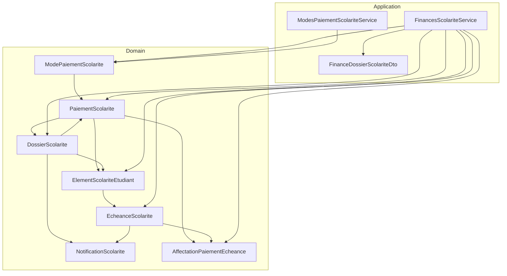
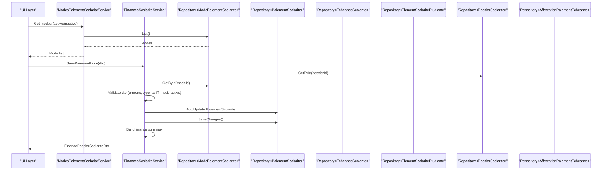
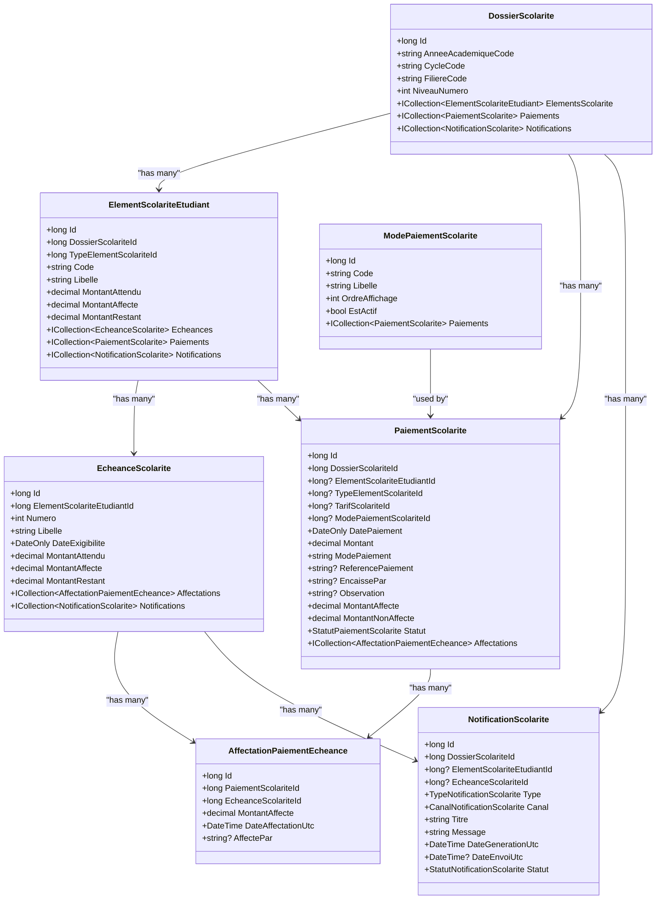
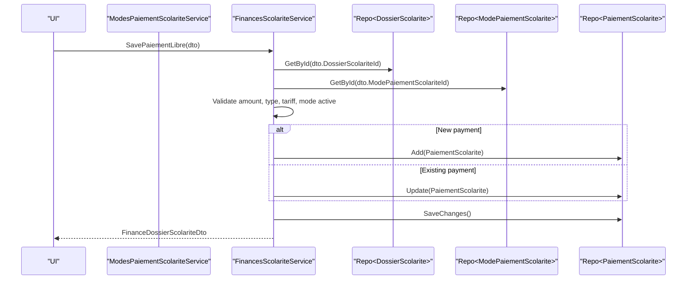
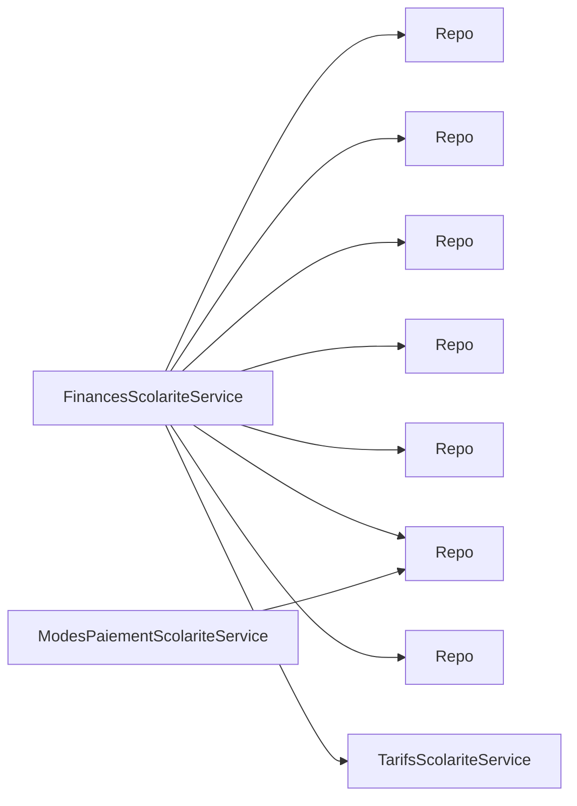

# Payment Methods and Handling

<cite>
**Referenced Files in This Document**
- [ModePaiementScolarite.cs](file://RIIS.Academic.Domain/Scolarite/ModePaiementScolarite.cs)
- [PaiementScolarite.cs](file://RIIS.Academic.Domain/Scolarite/PaiementScolarite.cs)
- [AffectationPaiementEcheance.cs](file://RIIS.Academic.Domain/Scolarite/AffectationPaiementEcheance.cs)
- [EcheanceScolarite.cs](file://RIIS.Academic.Domain/Scolarite/EcheanceScolarite.cs)
- [ElementScolariteEtudiant.cs](file://RIIS.Academic.Domain/Scolarite/ElementScolariteEtudiant.cs)
- [DossierScolarite.cs](file://RIIS.Academic.Domain/Scolarite/DossierScolarite.cs)
- [NotificationScolarite.cs](file://RIIS.Academic.Domain/Scolarite/NotificationScolarite.cs)
- [CanalNotificationScolarite.cs](file://RIIS.Academic.Domain/Enums/CanalNotificationScolarite.cs)
- [StatutNotificationScolarite.cs](file://RIIS.Academic.Domain/Enums/StatutNotificationScolarite.cs)
- [TypeNotificationScolarite.cs](file://RIIS.Academic.Domain/Enums/TypeNotificationScolarite.cs)
- [StatutPaiementScolarite.cs](file://RIIS.Academic.Domain/Enums/StatutPaiementScolarite.cs)
- [FinancesScolariteService.cs](file://RIIS.Academic.Application/Scolarite/Services/FinancesScolariteService.cs)
- [ModesPaiementScolariteService.cs](file://RIIS.Academic.Application/Scolarite/Services/ModesPaiementScolariteService.cs)
- [FinanceDossierScolariteDto.cs](file://RIIS.Academic.Application/Scolarite/Dtos/FinanceDossierScolariteDto.cs)
</cite>

## Table of Contents
1. Introduction
2. Project Structure
3. Core Components
4. Architecture Overview
5. Detailed Component Analysis
6. Dependency Analysis
7. Performance Considerations
8. Troubleshooting Guide
9. Conclusion

## Introduction
This document explains the payment methods and handling system for student tuition, focusing on:
- Configurable payment methods via ModePaiementScolarite
- Recording actual payments with PaiementScolarite
- Linking payments to installments (EcheanceScolarite) through AffectationPaiementEcheance
- Managing notifications via NotificationScolarite with channels and statuses
- Processing workflows in FinancesScolariteService for validation, saving payments, and building financial summaries
- Multi-currency support through TarifScolarite currency fields exposed in DTOs

The goal is to provide a clear understanding of how payments are configured, recorded, allocated, and communicated to students within the academic management system.

## Project Structure
The payment domain spans Domain entities, Application services, and DTOs that model the end-to-end flow from payment method configuration to payment recording and allocation.

**Diagram sources**
- [ModePaiementScolarite.cs:1-13](file://RIIS.Academic.Domain/Scolarite/ModePaiementScolarite.cs#L1-L13)
- [PaiementScolarite.cs:1-29](file://RIIS.Academic.Domain/Scolarite/PaiementScolarite.cs#L1-L29)
- [EcheanceScolarite.cs:1-20](file://RIIS.Academic.Domain/Scolarite/EcheanceScolarite.cs#L1-L20)
- [ElementScolariteEtudiant.cs:1-26](file://RIIS.Academic.Domain/Scolarite/ElementScolariteEtudiant.cs#L1-L26)
- [DossierScolarite.cs:1-29](file://RIIS.Academic.Domain/Scolarite/DossierScolarite.cs#L1-L29)
- [NotificationScolarite.cs:1-21](file://RIIS.Academic.Domain/Scolarite/NotificationScolarite.cs#L1-L21)
- [AffectationPaiementEcheance.cs:1-15](file://RIIS.Academic.Domain/Scolarite/AffectationPaiementEcheance.cs#L1-L15)
- [FinancesScolariteService.cs:1-361](file://RIIS.Academic.Application/Scolarite/Services/FinancesScolariteService.cs#L1-L361)
- [ModesPaiementScolariteService.cs:1-96](file://RIIS.Academic.Application/Scolarite/Services/ModesPaiementScolariteService.cs#L1-L96)
- [FinanceDossierScolariteDto.cs:1-84](file://RIIS.Academic.Application/Scolarite/Dtos/FinanceDossierScolariteDto.cs#L1-L84)

**Section sources**
- [ModePaiementScolarite.cs:1-13](file://RIIS.Academic.Domain/Scolarite/ModePaiementScolarite.cs#L1-L13)
- [PaiementScolarite.cs:1-29](file://RIIS.Academic.Domain/Scolarite/PaiementScolarite.cs#L1-L29)
- [FinancesScolariteService.cs:1-361](file://RIIS.Academic.Application/Scolarite/Services/FinancesScolariteService.cs#L1-L361)
- [ModesPaiementScolariteService.cs:1-96](file://RIIS.Academic.Application/Scolarite/Services/ModesPaiementScolariteService.cs#L1-L96)
- [FinanceDossierScolariteDto.cs:1-84](file://RIIS.Academic.Application/Scolarite/Dtos/FinanceDossierScolariteDto.cs#L1-L84)

## Core Components
- ModePaiementScolarite: Defines supported payment methods (e.g., cash, bank transfer, online), including code, label, display order, and active status. Each mode can be linked to multiple payments.
- PaiementScolarite: Records an actual payment transaction tied to a student dossier, optionally to a specific element or tariff, with amount, date, reference, cashier, observation, and allocation amounts. Includes status indicating whether it is unallocated, partially allocated, fully allocated, or cancelled.
- AffectationPaiementEcheance: Links a payment to one or more installments (EcheanceScolarite) with the allocated amount and timestamp.
- EcheanceScolarite: Represents installment due dates and expected amounts per student element, tracking allocated and remaining amounts.
- ElementScolariteEtudiant: Student-specific financial elements (e.g., tuition, fees) with expected, allocated, and remaining amounts; owns installments and payments.
- DossierScolarite: The student’s administrative and financial record, aggregating elements, payments, and notifications.
- NotificationScolarite: Captures generated and sent notifications about payment events (e.g., approaching due date, overdue, partial payment).
- Enums: CanalNotificationScolarite (channel), StatutNotificationScolarite (status), TypeNotificationScolarite (event type), StatutPaiementScolarite (payment status).

Key relationships:
- One student dossier has many elements, payments, and notifications.
- Each element has many installments and payments.
- Payments allocate to installments via AffectationPaiementEcheance.
- Notifications can be associated with elements or installments.

**Section sources**
- [ModePaiementScolarite.cs:1-13](file://RIIS.Academic.Domain/Scolarite/ModePaiementScolarite.cs#L1-L13)
- [PaiementScolarite.cs:1-29](file://RIIS.Academic.Domain/Scolarite/PaiementScolarite.cs#L1-L29)
- [AffectationPaiementEcheance.cs:1-15](file://RIIS.Academic.Domain/Scolarite/AffectationPaiementEcheance.cs#L1-L15)
- [EcheanceScolarite.cs:1-20](file://RIIS.Academic.Domain/Scolarite/EcheanceScolarite.cs#L1-L20)
- [ElementScolariteEtudiant.cs:1-26](file://RIIS.Academic.Domain/Scolarite/ElementScolariteEtudiant.cs#L1-L26)
- [DossierScolarite.cs:1-29](file://RIIS.Academic.Domain/Scolarite/DossierScolarite.cs#L1-L29)
- [NotificationScolarite.cs:1-21](file://RIIS.Academic.Domain/Scolarite/NotificationScolarite.cs#L1-L21)
- [CanalNotificationScolarite.cs:1-10](file://RIIS.Academic.Domain/Enums/CanalNotificationScolarite.cs#L1-L10)
- [StatutNotificationScolarite.cs:1-10](file://RIIS.Academic.Domain/Enums/StatutNotificationScolarite.cs#L1-L10)
- [TypeNotificationScolarite.cs:1-12](file://RIIS.Academic.Domain/Enums/TypeNotificationScolarite.cs#L1-L12)
- [StatutPaiementScolarite.cs:1-10](file://RIIS.Academic.Domain/Enums/StatutPaiementScolarite.cs#L1-L10)

## Architecture Overview
The application layer orchestrates payment operations using repositories over domain entities and exposes DTOs for UI consumption.

**Diagram sources**
- [ModesPaiementScolariteService.cs:10-22](file://RIIS.Academic.Application/Scolarite/Services/ModesPaiementScolariteService.cs#L10-L22)
- [FinancesScolariteService.cs:58-141](file://RIIS.Academic.Application/Scolarite/Services/FinancesScolariteService.cs#L58-L141)
- [FinancesScolariteService.cs:143-193](file://RIIS.Academic.Application/Scolarite/Services/FinancesScolariteService.cs#L143-L193)

**Section sources**
- [ModesPaiementScolariteService.cs:10-22](file://RIIS.Academic.Application/Scolarite/Services/ModesPaiementScolariteService.cs#L10-L22)
- [FinancesScolariteService.cs:58-193](file://RIIS.Academic.Application/Scolarite/Services/FinancesScolariteService.cs#L58-L193)

## Detailed Component Analysis

### Payment Method Configuration (ModePaiementScolarite)
- Purpose: Define available payment channels such as cash, bank transfer, online payment, etc.
- Key properties: Code (unique identifier), Libelle (display name), OrdreAffichage (sorting), EstActif (enabled/disabled).
- Service behavior:
  - Retrieve modes with optional inclusion of inactive ones.
  - Create default mode with active flag set.
  - Save mode with uniqueness check on Code and normalization.
  - Delete mode by ID.

Configuration example steps:
- Create a new mode with a unique code and label.
- Set display order for consistent UI presentation.
- Activate or deactivate modes as needed.

**Section sources**
- [ModePaiementScolarite.cs:1-13](file://RIIS.Academic.Domain/Scolarite/ModePaiementScolarite.cs#L1-L13)
- [ModesPaiementScolariteService.cs:10-22](file://RIIS.Academic.Application/Scolarite/Services/ModesPaiementScolariteService.cs#L10-L22)
- [ModesPaiementScolariteService.cs:24-65](file://RIIS.Academic.Application/Scolarite/Services/ModesPaiementScolariteService.cs#L24-L65)
- [ModesPaiementScolariteService.cs:67-73](file://RIIS.Academic.Application/Scolarite/Services/ModesPaiementScolariteService.cs#L67-L73)

### Payment Recording (PaiementScolarite)
- Purpose: Record each payment transaction against a student dossier, optionally tied to a specific element/tariff and payment method.
- Key properties: DatePaiement, Montant, ModePaiement (label), ReferencePaiement, EncaissePar, Observation, MontantAffecte, MontantNonAffecte, Statut.
- Relationships:
  - Belongs to DossierScolarite.
  - Optional links to ElementScolariteEtudiant, TypeElementScolarite, TarifScolarite, ModePaiementScolarite.
  - Aggregates allocations via AffectationPaiementEcheance.

Processing logic highlights:
- Validation ensures positive amount, required type/tariff/mode, and active mode.
- New or existing payment creation/update with normalized text fields.
- Status resolution based on allocated vs total amount.

Example workflow:
- Select a student dossier and payment method.
- Choose applicable element and tariff (resolved by context).
- Enter amount, date, reference, cashier, and observations.
- Save creates or updates the payment and recalculates totals.

**Section sources**
- [PaiementScolarite.cs:1-29](file://RIIS.Academic.Domain/Scolarite/PaiementScolarite.cs#L1-L29)
- [FinancesScolariteService.cs:58-141](file://RIIS.Academic.Application/Scolarite/Services/FinancesScolariteService.cs#L58-L141)
- [FinancesScolariteService.cs:332-342](file://RIIS.Academic.Application/Scolarite/Services/FinancesScolariteService.cs#L332-L342)

### Installment Allocation (AffectationPaiementEcheance and EcheanceScolarite)
- Purpose: Allocate portions of a payment to specific installments, tracking allocated amounts and timestamps.
- Key properties: MontantAffecte, DateAffectationUtc, AffectePar.
- Relationships:
  - Links PaiementScolarite to EcheanceScolarite.
  - EcheanceScolarite tracks MontantAffecte and MontantRestant per installment.

Allocation process:
- For each installment, assign an amount up to its remaining balance.
- Update both payment and installment aggregates accordingly.
- Maintain audit trail with allocation timestamp and operator.

**Section sources**
- [AffectationPaiementEcheance.cs:1-15](file://RIIS.Academic.Domain/Scolarite/AffectationPaiementEcheance.cs#L1-L15)
- [EcheanceScolarite.cs:1-20](file://RIIS.Academic.Domain/Scolarite/EcheanceScolarite.cs#L1-L20)

### Financial Summary and Reporting (FinancesScolariteService)
- Purpose: Provide a comprehensive view of a student dossier’s finances, including elements, installments, payments, and allocations.
- Key outputs: FinanceDossierScolariteDto with totals and lists for UI rendering.
- Behavior:
  - Builds aggregated data across elements, installments, payments, tariffs, and allocations.
  - Resolves applicable tariffs based on dossier context (academic year, cycle, level, program, specialty).
  - Computes totals for paid, allocated, and unallocated amounts.

Reporting example:
- Fetch all elements with expected amounts > 0.
- Load installments ordered by due date and number.
- Load payments ordered by date descending.
- Load allocations and map them back to payments and installments.

**Section sources**
- [FinancesScolariteService.cs:143-193](file://RIIS.Academic.Application/Scolarite/Services/FinancesScolariteService.cs#L143-L193)
- [FinancesScolariteService.cs:264-302](file://RIIS.Academic.Application/Scolarite/Services/FinancesScolariteService.cs#L264-L302)
- [FinanceDossierScolariteDto.cs:1-84](file://RIIS.Academic.Application/Scolarite/Dtos/FinanceDossierScolariteDto.cs#L1-L84)

### Notifications (NotificationScolarite, CanalNotificationScolarite, StatutNotificationScolarite)
- Purpose: Manage communication about payment-related events to students.
- Channels: Internal, Email, SMS, WhatsApp.
- Statuses: Generated, Sent, Error, Ignored.
- Types: Approaching due date, overdue, partial payment, missing document, validation required, dossier blocked.
- Relationships:
  - Associated with DossierScolarite, ElementScolariteEtudiant, and/or EcheanceScolarite.

Notification lifecycle:
- Generate notification when conditions are met (e.g., upcoming or overdue installment).
- Send via selected channel; update status accordingly.
- Handle errors and retries; allow ignoring non-actionable notifications.

**Section sources**
- [NotificationScolarite.cs:1-21](file://RIIS.Academic.Domain/Scolarite/NotificationScolarite.cs#L1-L21)
- [CanalNotificationScolarite.cs:1-10](file://RIIS.Academic.Domain/Enums/CanalNotificationScolarite.cs#L1-L10)
- [StatutNotificationScolarite.cs:1-10](file://RIIS.Academic.Domain/Enums/StatutNotificationScolarite.cs#L1-L10)
- [TypeNotificationScolarite.cs:1-12](file://RIIS.Academic.Domain/Enums/TypeNotificationScolarite.cs#L1-L12)

### Class Diagram: Entities and Relationships

**Diagram sources**
- [DossierScolarite.cs:1-29](file://RIIS.Academic.Domain/Scolarite/DossierScolarite.cs#L1-L29)
- [ElementScolariteEtudiant.cs:1-26](file://RIIS.Academic.Domain/Scolarite/ElementScolariteEtudiant.cs#L1-L26)
- [EcheanceScolarite.cs:1-20](file://RIIS.Academic.Domain/Scolarite/EcheanceScolarite.cs#L1-L20)
- [PaiementScolarite.cs:1-29](file://RIIS.Academic.Domain/Scolarite/PaiementScolarite.cs#L1-L29)
- [ModePaiementScolarite.cs:1-13](file://RIIS.Academic.Domain/Scolarite/ModePaiementScolarite.cs#L1-L13)
- [AffectationPaiementEcheance.cs:1-15](file://RIIS.Academic.Domain/Scolarite/AffectationPaiementEcheance.cs#L1-L15)
- [NotificationScolarite.cs:1-21](file://RIIS.Academic.Domain/Scolarite/NotificationScolarite.cs#L1-L21)

### Sequence Diagram: Saving a Free Payment

**Diagram sources**
- [FinancesScolariteService.cs:58-141](file://RIIS.Academic.Application/Scolarite/Services/FinancesScolariteService.cs#L58-L141)

### Flowchart: Payment Status Resolution

```mermaid
flowchart TD
Start(["Resolve Payment Status"]) --> CheckAllocated["Check MontantAffecte"]
CheckAllocated --> |<= 0| NonAffecte["Set Statut = NonAffecte"]
CheckAllocated --> |> 0| Compare["Compare MontantAffecte vs Montant"]
Compare --> |>= Montant| Affecte["Set Statut = Affecte"]
Compare --> |< Montant| PartiellementAffecte["Set Statut = PartiellementAffecte"]
NonAffecte --> End(["Exit"])
Affecte --> End
PartiellementAffecte --> End
```

**Diagram sources**
- [FinancesScolariteService.cs:332-342](file://RIIS.Academic.Application/Scolarite/Services/FinancesScolariteService.cs#L332-L342)

## Dependency Analysis
- FinancesScolariteService depends on repositories for dossiers, types, elements, installments, payments, payment methods, and allocations. It also uses TarifsScolariteService to resolve applicable tariffs based on dossier context.
- ModesPaiementScolariteService depends on repository for payment methods and provides CRUD operations with validation.
- DTOs decouple domain models from UI concerns, exposing summarized financial data and options for payment creation.

**Diagram sources**
- [FinancesScolariteService.cs:7-15](file://RIIS.Academic.Application/Scolarite/Services/FinancesScolariteService.cs#L7-L15)
- [ModesPaiementScolariteService.cs:7-8](file://RIIS.Academic.Application/Scolarite/Services/ModesPaiementScolariteService.cs#L7-L8)

**Section sources**
- [FinancesScolariteService.cs:7-15](file://RIIS.Academic.Application/Scolarite/Services/FinancesScolariteService.cs#L7-L15)
- [ModesPaiementScolariteService.cs:7-8](file://RIIS.Academic.Application/Scolarite/Services/ModesPaiementScolariteService.cs#L7-L8)

## Performance Considerations
- Batch loading: Services load related collections (elements, installments, payments, allocations) and filter in memory to reduce round-trips. Ensure indexes exist on foreign keys (e.g., DossierScolariteId, ElementScolariteEtudiantId, PaiementScolariteId, EcheanceScolariteId).
- Filtering early: Apply filters at repository level where possible (e.g., filtering by dossier id before materializing large sets).
- Avoid N+1 queries: Use eager loading or batched queries for related entities when building summaries.
- Currency handling: Use decimal for monetary values to avoid precision issues; ensure consistent formatting and rounding rules.

[No sources needed since this section provides general guidance]

## Troubleshooting Guide
Common issues and resolutions:
- Invalid payment amount: Ensure Montant > 0; service throws if not valid.
- Missing or invalid type/tariff: Verify TypeElementScolariteId and TarifScolariteId correspond to active, applicable tariffs for the dossier.
- Inactive payment method: Confirm ModePaiementScolarite.EstActif is true; otherwise, save fails.
- Tariff mismatch: If selected tariff does not match resolved tariff for dossier context, save fails; re-select correct tariff.
- Allocation constraints: When updating payments, ensure MontantAffecte does not exceed current Montant; adjust accordingly.
- Notification delivery failures: Check StatutNotificationScolarite for Erreur; retry or switch channel if necessary.

Operational tips:
- Normalize text fields (reference, cashier, observation) to prevent whitespace issues.
- Audit allocations with AffectePar and DateAffectationUtc for traceability.
- Use FinanceDossierScolariteDto totals to reconcile discrepancies between payments and installments.

**Section sources**
- [FinancesScolariteService.cs:58-141](file://RIIS.Academic.Application/Scolarite/Services/FinancesScolariteService.cs#L58-L141)
- [FinancesScolariteService.cs:332-342](file://RIIS.Academic.Application/Scolarite/Services/FinancesScolariteService.cs#L332-L342)
- [NotificationScolarite.cs:1-21](file://RIIS.Academic.Domain/Scolarite/NotificationScolarite.cs#L1-L21)

## Conclusion
The payment system centers around configurable payment methods, robust payment recording, precise allocation to installments, and comprehensive notifications. FinancesScolariteService validates inputs, resolves applicable tariffs, persists payments, and builds financial summaries for reconciliation and reporting. Notifications enable proactive communication with students regarding payment events. Multi-currency support is facilitated through tariff currency fields exposed in DTOs, allowing flexible financial contexts across different programs and regions.

[No sources needed since this section summarizes without analyzing specific files]