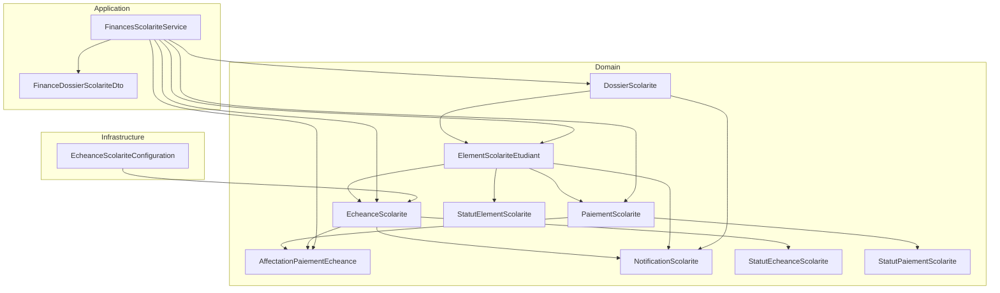
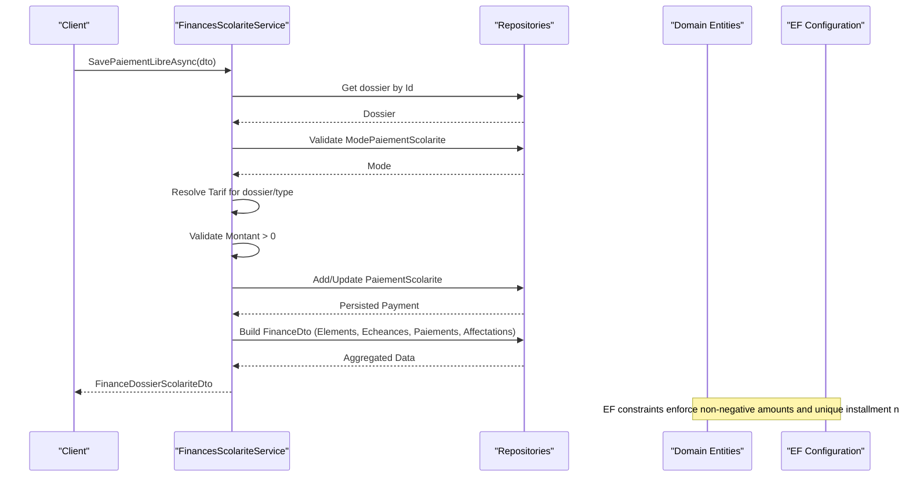
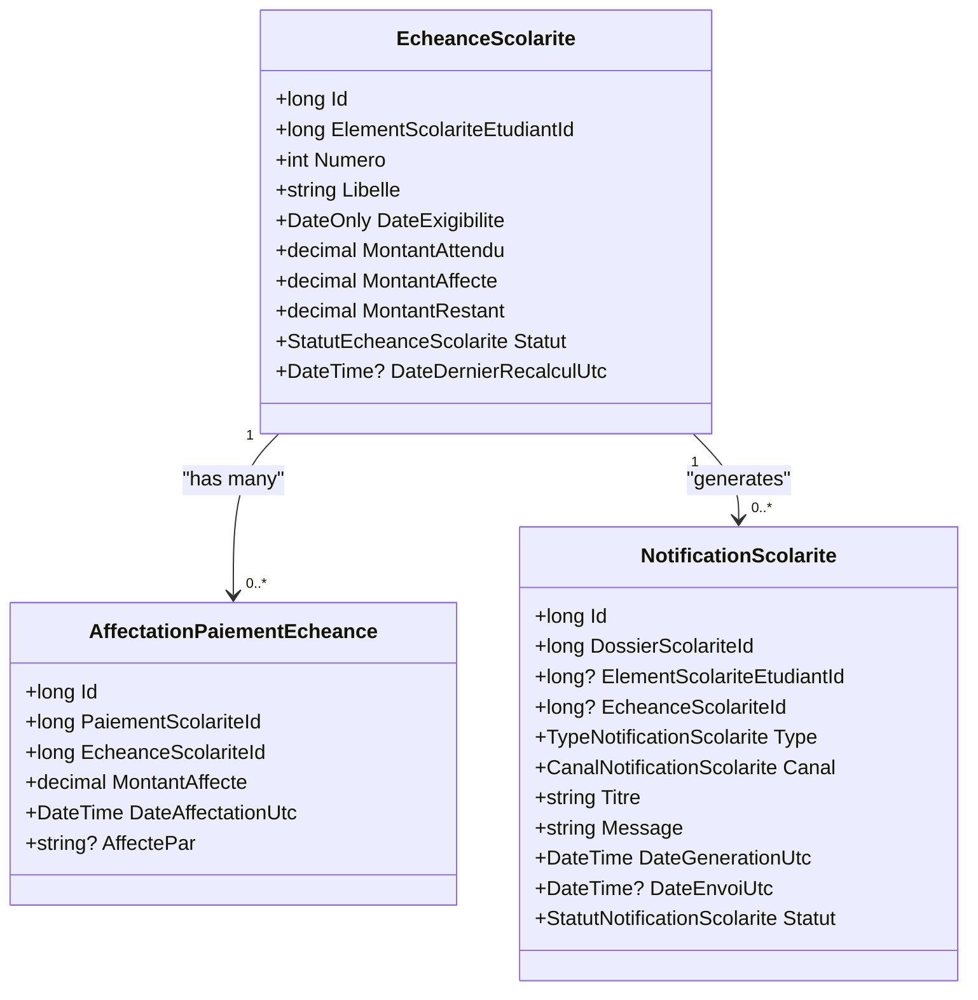
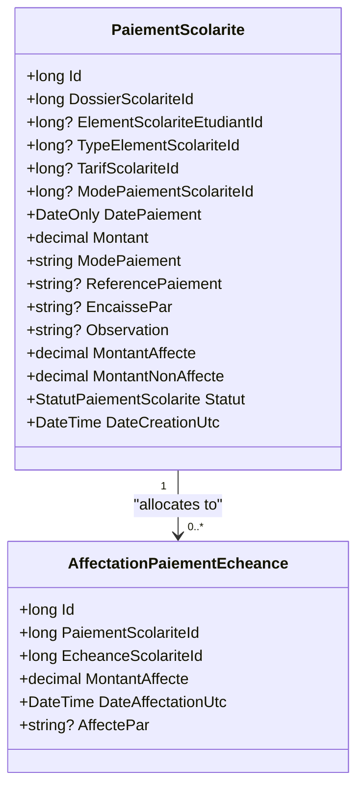
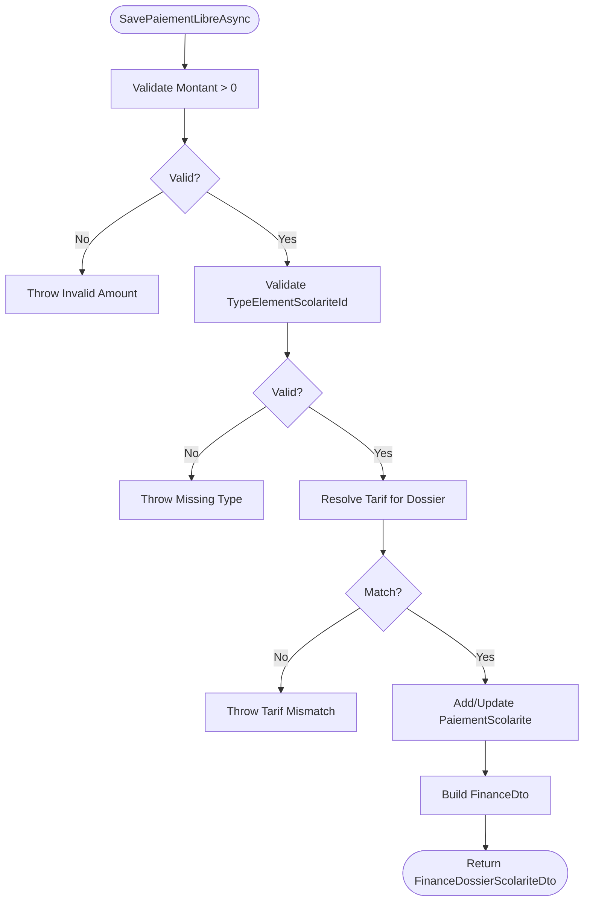
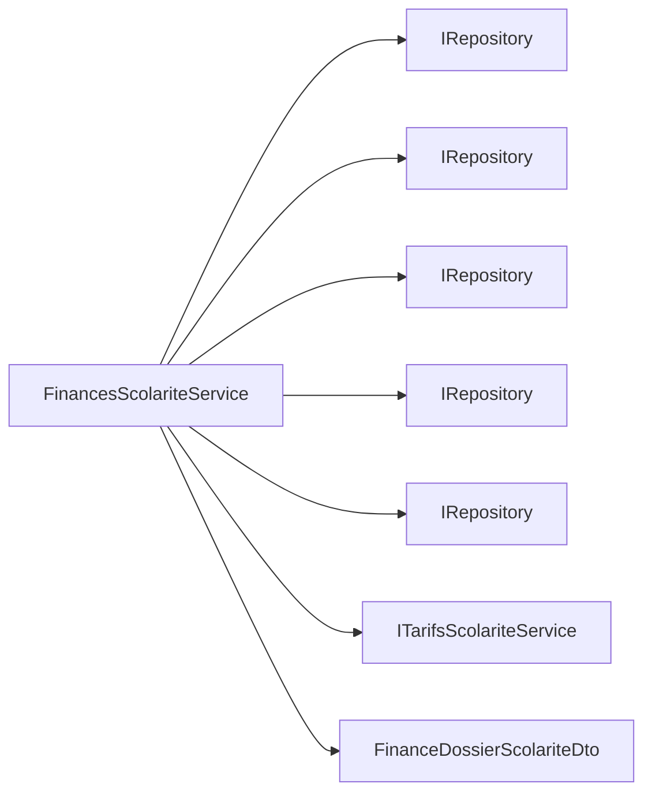

# Payment Scheduling and Installments

<cite>
**Referenced Files in This Document**
- [EcheanceScolarite.cs](file://RIIS.Academic.Domain/Scolarite/EcheanceScolarite.cs)
- [AffectationPaiementEcheance.cs](file://RIIS.Academic.Domain/Scolarite/AffectationPaiementEcheance.cs)
- [PaiementScolarite.cs](file://RIIS.Academic.Domain/Scolarite/PaiementScolarite.cs)
- [ElementScolariteEtudiant.cs](file://RIIS.Academic.Domain/Scolarite/ElementScolariteEtudiant.cs)
- [DossierScolarite.cs](file://RIIS.Academic.Domain/Scolarite/DossierScolarite.cs)
- [NotificationScolarite.cs](file://RIIS.Academic.Domain/Scolarite/NotificationScolarite.cs)
- [StatutEcheanceScolarite.cs](file://RIIS.Academic.Domain/Enums/StatutEcheanceScolarite.cs)
- [StatutPaiementScolarite.cs](file://RIIS.Academic.Domain/Enums/StatutPaiementScolarite.cs)
- [StatutElementScolarite.cs](file://RIIS.Academic.Domain/Enums/StatutElementScolarite.cs)
- [TypeElementScolarite.cs](file://RIIS.Academic.Domain/Scolarite/TypeElementScolarite.cs)
- [TarifScolarite.cs](file://RIIS.Academic.Domain/Scolarite/TarifScolarite.cs)
- [FinancesScolariteService.cs](file://RIIS.Academic.Application/Scolarite/Services/FinancesScolariteService.cs)
- [FinanceDossierScolariteDto.cs](file://RIIS.Academic.Application/Scolarite/Dtos/FinanceDossierScolariteDto.cs)
- [EcheanceScolariteConfiguration.cs](file://RIIS.Academic.Infrastructure/Persistence/Configurations/Scolarite/EcheanceScolariteConfiguration.cs)
</cite>

## Table of Contents
1. Introduction
2. Project Structure
3. Core Components
4. Architecture Overview
5. Detailed Component Analysis
6. Dependency Analysis
7. Performance Considerations
8. Troubleshooting Guide
9. Conclusion

## Introduction
This document explains the payment scheduling and installment management system for academic fees. It focuses on:
- EcheanceScolarite entities representing scheduled payment deadlines tied to financial obligations (student fee elements).
- AffectationPaiementEcheance linking payments to specific installments and managing allocation amounts.
- Status enumerations that track the lifecycle of both installments and payments.
- Practical workflows: creating schedules, processing payments, handling partial payments, and managing overdue items.
- Validation rules, due date considerations, and automated reminders via notifications.

## Project Structure
The system spans Domain, Application, and Infrastructure layers:
- Domain defines core entities, enums, and relationships.
- Application provides services and DTOs for business operations and UI consumption.
- Infrastructure configures persistence and constraints for entities.

**Diagram sources**
- [DossierScolarite.cs:1-29](file://RIIS.Academic.Domain/Scolarite/DossierScolarite.cs#L1-L29)
- [ElementScolariteEtudiant.cs:1-26](file://RIIS.Academic.Domain/Scolarite/ElementScolariteEtudiant.cs#L1-L26)
- [EcheanceScolarite.cs:1-20](file://RIIS.Academic.Domain/Scolarite/EcheanceScolarite.cs#L1-L20)
- [PaiementScolarite.cs:1-29](file://RIIS.Academic.Domain/Scolarite/PaiementScolarite.cs#L1-L29)
- [AffectationPaiementEcheance.cs:1-15](file://RIIS.Academic.Domain/Scolarite/AffectationPaiementEcheance.cs#L1-L15)
- [NotificationScolarite.cs:1-21](file://RIIS.Academic.Domain/Scolarite/NotificationScolarite.cs#L1-L21)
- [StatutEcheanceScolarite.cs:1-12](file://RIIS.Academic.Domain/Enums/StatutEcheanceScolarite.cs#L1-L12)
- [StatutPaiementScolarite.cs:1-10](file://RIIS.Academic.Domain/Enums/StatutPaiementScolarite.cs#L1-L10)
- [StatutElementScolarite.cs:1-14](file://RIIS.Academic.Domain/Enums/StatutElementScolarite.cs#L1-L14)
- [FinancesScolariteService.cs:1-361](file://RIIS.Academic.Application/Scolarite/Services/FinancesScolariteService.cs#L1-L361)
- [FinanceDossierScolariteDto.cs:1-84](file://RIIS.Academic.Application/Scolarite/Dtos/FinanceDossierScolariteDto.cs#L1-L84)
- [EcheanceScolariteConfiguration.cs:1-30](file://RIIS.Academic.Infrastructure/Persistence/Configurations/Scolarite/EcheanceScolariteConfiguration.cs#L1-L30)

**Section sources**
- [DossierScolarite.cs:1-29](file://RIIS.Academic.Domain/Scolarite/DossierScolarite.cs#L1-L29)
- [ElementScolariteEtudiant.cs:1-26](file://RIIS.Academic.Domain/Scolarite/ElementScolariteEtudiant.cs#L1-L26)
- [EcheanceScolarite.cs:1-20](file://RIIS.Academic.Domain/Scolarite/EcheanceScolarite.cs#L1-L20)
- [PaiementScolarite.cs:1-29](file://RIIS.Academic.Domain/Scolarite/PaiementScolarite.cs#L1-L29)
- [AffectationPaiementEcheance.cs:1-15](file://RIIS.Academic.Domain/Scolarite/AffectationPaiementEcheance.cs#L1-L15)
- [NotificationScolarite.cs:1-21](file://RIIS.Academic.Domain/Scolarite/NotificationScolarite.cs#L1-L21)
- [FinancesScolariteService.cs:1-361](file://RIIS.Academic.Application/Scolarite/Services/FinancesScolariteService.cs#L1-L361)
- [EcheanceScolariteConfiguration.cs:1-30](file://RIIS.Academic.Infrastructure/Persistence/Configurations/Scolarite/EcheanceScolariteConfiguration.cs#L1-L30)

## Core Components
- EcheanceScolarite: Represents a scheduled installment with expected amount, allocated amount, remaining balance, due date, and status. Linked to a student fee element and can generate notifications.
- AffectationPaiementEcheance: Links a payment to an installment with an allocated amount and timestamp; supports multiple allocations per payment and per installment.
- PaiementScolarite: Records a payment with amount, mode, reference, and status; tracks allocated and unallocated portions.
- ElementScolariteEtudiant: The financial obligation line item for a student, aggregating totals and statuses across payments and installments.
- DossierScolarite: The student’s enrollment file grouping elements, payments, and notifications.
- NotificationScolarite: Tracks generated and sent notifications related to dossiers, elements, or installments.

Key enumerations:
- StatutEcheanceScolarite: NonExigible, EnAttente, Partielle, Payee, EnRetard, Annulee.
- StatutPaiementScolarite: NonAffecte, PartiellementAffecte, Affecte, Annule.
- StatutElementScolarite: NonDemarre, EnAttente, Partiel, Solde, EnRetard, Bloque, Valide, NonApplicable.

**Section sources**
- [EcheanceScolarite.cs:1-20](file://RIIS.Academic.Domain/Scolarite/EcheanceScolarite.cs#L1-L20)
- [AffectationPaiementEcheance.cs:1-15](file://RIIS.Academic.Domain/Scolarite/AffectationPaiementEcheance.cs#L1-L15)
- [PaiementScolarite.cs:1-29](file://RIIS.Academic.Domain/Scolarite/PaiementScolarite.cs#L1-L29)
- [ElementScolariteEtudiant.cs:1-26](file://RIIS.Academic.Domain/Scolarite/ElementScolariteEtudiant.cs#L1-L26)
- [DossierScolarite.cs:1-29](file://RIIS.Academic.Domain/Scolarite/DossierScolarite.cs#L1-L29)
- [NotificationScolarite.cs:1-21](file://RIIS.Academic.Domain/Scolarite/NotificationScolarite.cs#L1-L21)
- [StatutEcheanceScolarite.cs:1-12](file://RIIS.Academic.Domain/Enums/StatutEcheanceScolarite.cs#L1-L12)
- [StatutPaiementScolarite.cs:1-10](file://RIIS.Academic.Domain/Enums/StatutPaiementScolarite.cs#L1-L10)
- [StatutElementScolarite.cs:1-14](file://RIIS.Academic.Domain/Enums/StatutElementScolarite.cs#L1-L14)

## Architecture Overview
The application layer orchestrates reading/writing domain entities through repositories and exposes DTOs to clients. The service validates inputs, resolves applicable tariffs, persists payments, and builds comprehensive financial summaries including elements, installments, payments, and allocations.

**Diagram sources**
- [FinancesScolariteService.cs:58-141](file://RIIS.Academic.Application/Scolarite/Services/FinancesScolariteService.cs#L58-L141)
- [FinancesScolariteService.cs:143-193](file://RIIS.Academic.Application/Scolarite/Services/FinancesScolariteService.cs#L143-L193)
- [EcheanceScolariteConfiguration.cs:11-27](file://RIIS.Academic.Infrastructure/Persistence/Configurations/Scolarite/EcheanceScolariteConfiguration.cs#L11-L27)

**Section sources**
- [FinancesScolariteService.cs:58-193](file://RIIS.Academic.Application/Scolarite/Services/FinancesScolariteService.cs#L58-L193)
- [EcheanceScolariteConfiguration.cs:11-27](file://RIIS.Academic.Infrastructure/Persistence/Configurations/Scolarite/EcheanceScolariteConfiguration.cs#L11-L27)

## Detailed Component Analysis

### EcheanceScolarite (Installment)
- Purpose: Models each scheduled deadline for a student fee element.
- Key fields: Due date, expected amount, allocated amount, remaining amount, status, last recalculation timestamp.
- Relationships: Belongs to ElementScolariteEtudiant; has many AffectationPaiementEcheance and NotificationScolarite.
- Persistence: Unique index on (ElementScolariteEtudiantId, Numero); check constraint ensures non-negative monetary fields; indexed by due date and status for queries.

**Diagram sources**
- [EcheanceScolarite.cs:1-20](file://RIIS.Academic.Domain/Scolarite/EcheanceScolarite.cs#L1-L20)
- [AffectationPaiementEcheance.cs:1-15](file://RIIS.Academic.Domain/Scolarite/AffectationPaiementEcheance.cs#L1-L15)
- [NotificationScolarite.cs:1-21](file://RIIS.Academic.Domain/Scolarite/NotificationScolarite.cs#L1-L21)

**Section sources**
- [EcheanceScolarite.cs:1-20](file://RIIS.Academic.Domain/Scolarite/EcheanceScolarite.cs#L1-L20)
- [EcheanceScolariteConfiguration.cs:11-27](file://RIIS.Academic.Infrastructure/Persistence/Configurations/Scolarite/EcheanceScolariteConfiguration.cs#L11-L27)

### AffectationPaiementEcheance (Payment Allocation)
- Purpose: Allocates part or all of a payment to one or more installments.
- Key fields: Allocated amount, allocation timestamp, operator who made the allocation.
- Relationships: Many-to-many bridge between PaiementScolarite and EcheanceScolarite.

**Diagram sources**
- [PaiementScolarite.cs:1-29](file://RIIS.Academic.Domain/Scolarite/PaiementScolarite.cs#L1-L29)
- [AffectationPaiementEcheance.cs:1-15](file://RIIS.Academic.Domain/Scolarite/AffectationPaiementEcheance.cs#L1-L15)

**Section sources**
- [AffectationPaiementEcheance.cs:1-15](file://RIIS.Academic.Domain/Scolarite/AffectationPaiementEcheance.cs#L1-L15)
- [PaiementScolarite.cs:1-29](file://RIIS.Academic.Domain/Scolarite/PaiementScolarite.cs#L1-L29)

### Status Lifecycle
- Installment statuses: NonExigible → EnAttente → Partielle → Payee; also EnRetard and Annulee.
- Payment statuses: NonAffecte → PartiellementAffecte → Affecte; Annule is terminal.
- Element statuses: NonDemarre → EnAttente → Partiel/Solde/Valide/Bloque/EnRetard/NonApplicable.

These statuses are used to drive UI presentation, reporting, and automation (e.g., reminders for overdue installments).

**Section sources**
- [StatutEcheanceScolarite.cs:1-12](file://RIIS.Academic.Domain/Enums/StatutEcheanceScolarite.cs#L1-L12)
- [StatutPaiementScolarite.cs:1-10](file://RIIS.Academic.Domain/Enums/StatutPaiementScolarite.cs#L1-L10)
- [StatutElementScolarite.cs:1-14](file://RIIS.Academic.Domain/Enums/StatutElementScolarite.cs#L1-L14)

### Creating Payment Schedules
- Schedule creation is modeled by EcheanceScolarite entries linked to ElementScolariteEtudiant.
- Each schedule includes a due date and expected amount; numbers ensure uniqueness per element.
- Persistence enforces non-negative amounts and indexes support efficient queries by due date and status.

Operational guidance:
- Generate installments per academic term or policy.
- Ensure Numero is sequential and unique per element.
- Set DateExigibilite according to institutional calendar.

**Section sources**
- [EcheanceScolarite.cs:1-20](file://RIIS.Academic.Domain/Scolarite/EcheanceScolarite.cs#L1-L20)
- [EcheanceScolariteConfiguration.cs:11-27](file://RIIS.Academic.Infrastructure/Persistence/Configurations/Scolarite/EcheanceScolariteConfiguration.cs#L11-L27)

### Processing Installment Payments
- Use FinancesScolariteService.SavePaiementLibreAsync to record a payment against a student dossier.
- The service validates:
  - Positive amount.
  - Required type and tariff selection.
  - Active payment mode.
  - Tariff applicability to the current dossier context.
- On create/update, it sets initial allocation totals and computes payment status based on allocated vs total amount.

**Diagram sources**
- [FinancesScolariteService.cs:58-141](file://RIIS.Academic.Application/Scolarite/Services/FinancesScolariteService.cs#L58-L141)
- [FinancesScolariteService.cs:143-193](file://RIIS.Academic.Application/Scolarite/Services/FinancesScolariteService.cs#L143-L193)

**Section sources**
- [FinancesScolariteService.cs:58-141](file://RIIS.Academic.Application/Scolarite/Services/FinancesScolariteService.cs#L58-L141)

### Handling Partial Payments
- A single payment can be split across multiple installments via AffectationPaiementEcheance.
- Payment status transitions:
  - NonAffecte when no allocation exists.
  - PartiellementAffecte when partially allocated.
  - Affecte when fully allocated.
- The service computes MontantNonAffecte as difference between total and allocated amounts.

Practical steps:
- Create one PaiementScolarite entry.
- Create multiple AffectationPaiementEcheance records to allocate portions to different EcheanceScolarite entries.
- Update payment status accordingly.

**Section sources**
- [PaiementScolarite.cs:1-29](file://RIIS.Academic.Domain/Scolarite/PaiementScolarite.cs#L1-L29)
- [AffectationPaiementEcheance.cs:1-15](file://RIIS.Academic.Domain/Scolarite/AffectationPaiementEcheance.cs#L1-L15)
- [FinancesScolariteService.cs:332-342](file://RIIS.Academic.Application/Scolarite/Services/FinancesScolariteService.cs#L332-L342)

### Managing Overdue Payments
- Installment status includes EnRetard to mark overdue items.
- Notifications can be generated for overdue installments using NotificationScolarite.
- Queries can leverage indexes on DateExigibilite and Statut to identify overdue items efficiently.

Automation suggestions:
- Periodic job to scan EcheanceScolarite where DateExigibilite < Today and Statut not Payee/Annulee, then set to EnRetard and generate NotificationScolarite.

**Section sources**
- [StatutEcheanceScolarite.cs:1-12](file://RIIS.Academic.Domain/Enums/StatutEcheanceScolarite.cs#L1-L12)
- [NotificationScolarite.cs:1-21](file://RIIS.Academic.Domain/Scolarite/NotificationScolarite.cs#L1-L21)
- [EcheanceScolariteConfiguration.cs:21-22](file://RIIS.Academic.Infrastructure/Persistence/Configurations/Scolarite/EcheanceScolariteConfiguration.cs#L21-L22)

### Payment Validation Rules
- Amount must be greater than zero.
- TypeElementScolariteId and TarifScolariteId are required and must match the active tariff for the dossier context.
- Payment mode must exist and be active.
- Monetary fields are constrained to non-negative values at the database level for installments.

**Section sources**
- [FinancesScolariteService.cs:65-94](file://RIIS.Academic.Application/Scolarite/Services/FinancesScolariteService.cs#L65-L94)
- [EcheanceScolariteConfiguration.cs:11-14](file://RIIS.Academic.Infrastructure/Persistence/Configurations/Scolarite/EcheanceScolariteConfiguration.cs#L11-L14)

### Due Date Calculations
- Due dates are stored in EcheanceScolarite.DateExigibilite.
- Indexes on due date and status enable efficient retrieval for reminders and reporting.
- Business logic should compute due dates based on institutional policies and enrollments.

**Section sources**
- [EcheanceScolarite.cs:9-14](file://RIIS.Academic.Domain/Scolarite/EcheanceScolarite.cs#L9-L14)
- [EcheanceScolariteConfiguration.cs:21-22](file://RIIS.Academic.Infrastructure/Persistence/Configurations/Scolarite/EcheanceScolariteConfiguration.cs#L21-L22)

### Automated Payment Reminders
- Notifications are modeled by NotificationScolarite and can be associated with dossiers, elements, or installments.
- Typical automation:
  - Identify overdue installments.
  - Generate NotificationScolarite entries with appropriate type and channel.
  - Send messages and update send timestamps/status.

**Section sources**
- [NotificationScolarite.cs:1-21](file://RIIS.Academic.Domain/Scolarite/NotificationScolarite.cs#L1-L21)

## Dependency Analysis
- FinancesScolariteService depends on repositories for all core entities and uses tariff resolution to validate payments.
- DTOs provide flattened views for UI consumption, combining elements, installments, payments, and allocations.
- EF configuration enforces data integrity for installments.

**Diagram sources**
- [FinancesScolariteService.cs:7-15](file://RIIS.Academic.Application/Scolarite/Services/FinancesScolariteService.cs#L7-L15)
- [FinancesScolariteService.cs:143-193](file://RIIS.Academic.Application/Scolarite/Services/FinancesScolariteService.cs#L143-L193)
- [FinanceDossierScolariteDto.cs:1-84](file://RIIS.Academic.Application/Scolarite/Dtos/FinanceDossierScolariteDto.cs#L1-L84)

**Section sources**
- [FinancesScolariteService.cs:7-15](file://RIIS.Academic.Application/Scolarite/Services/FinancesScolariteService.cs#L7-L15)
- [FinancesScolariteService.cs:143-193](file://RIIS.Academic.Application/Scolarite/Services/FinancesScolariteService.cs#L143-L193)
- [FinanceDossierScolariteDto.cs:1-84](file://RIIS.Academic.Application/Scolarite/Dtos/FinanceDossierScolariteDto.cs#L1-L84)

## Performance Considerations
- Use existing indexes on EcheanceScolarite(DateExigibilite, Statut) for overdue queries and reminder jobs.
- Batch load related entities in BuildFinanceDto to minimize round trips.
- Keep allocation updates atomic to avoid inconsistent totals.
- Avoid excessive recalculations; rely on DateDernierRecalculUtc to track last updates.

[No sources needed since this section provides general guidance]

## Troubleshooting Guide
Common issues and resolutions:
- Invalid payment amount: Ensure Montant > 0 before saving.
- Missing or inactive payment mode: Verify ModePaiementScolarite exists and is active.
- Tariff mismatch: Confirm the selected TarifScolarite matches the resolved tariff for the dossier context.
- Cannot reduce payment below already allocated amount: When editing, new Montant must not be less than MontantAffecte.
- Overdue reminders not sent: Check that overdue installments are identified and NotificationScolarite entries are created and dispatched.

**Section sources**
- [FinancesScolariteService.cs:65-94](file://RIIS.Academic.Application/Scolarite/Services/FinancesScolariteService.cs#L65-L94)
- [FinancesScolariteService.cs:121-124](file://RIIS.Academic.Application/Scolarite/Services/FinancesScolariteService.cs#L121-L124)
- [NotificationScolarite.cs:1-21](file://RIIS.Academic.Domain/Scolarite/NotificationScolarite.cs#L1-L21)

## Conclusion
The system models academic fee scheduling and payments through clear domain entities and robust validation. Installments (EcheanceScolarite) represent deadlines, while payments (PaiementScolarite) are allocated to installments via AffectationPaiementEcheance. Status enumerations drive lifecycle management, and notifications support automated reminders. The application service centralizes validation and aggregation, exposing a comprehensive DTO for client consumption. Proper use of indexes and constraints ensures performance and data integrity.

[No sources needed since this section summarizes without analyzing specific files]