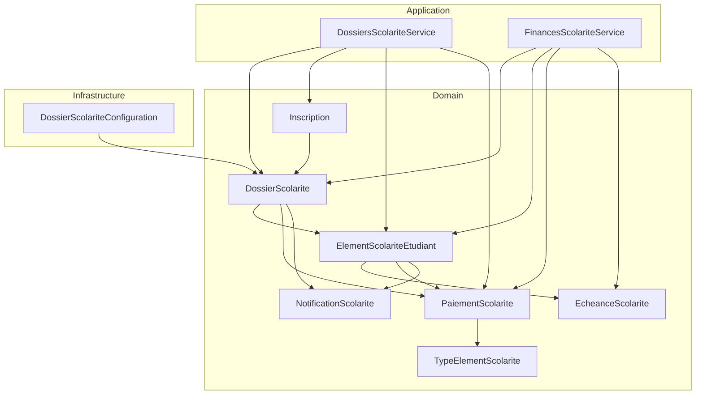
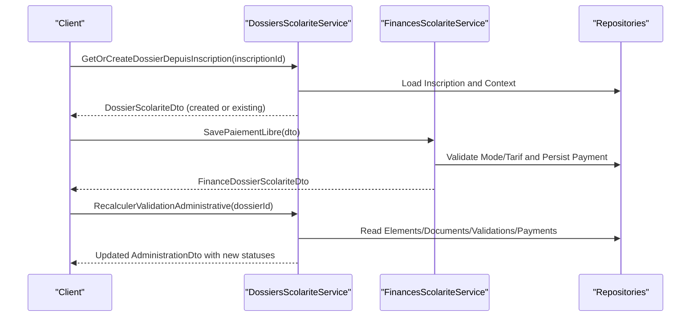
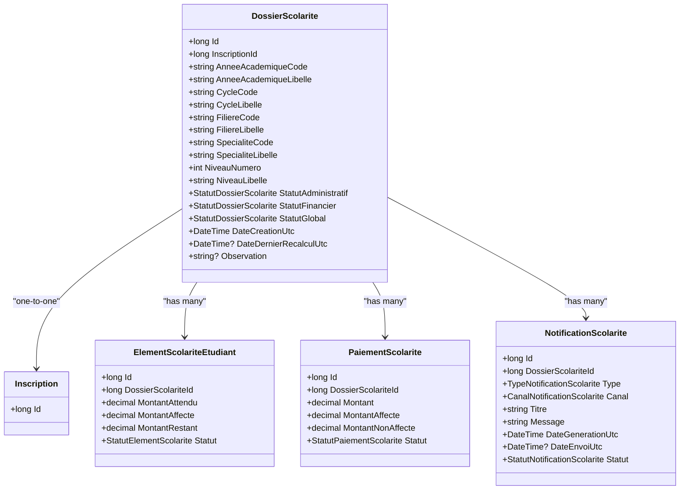
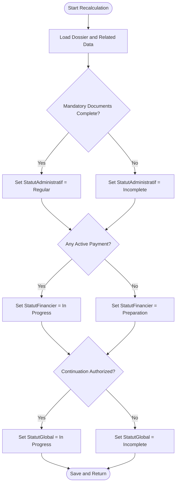
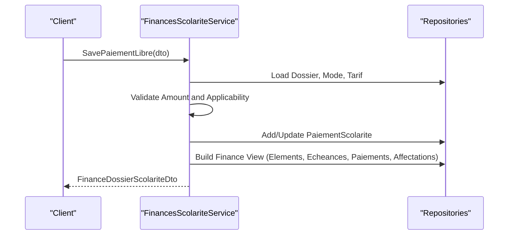
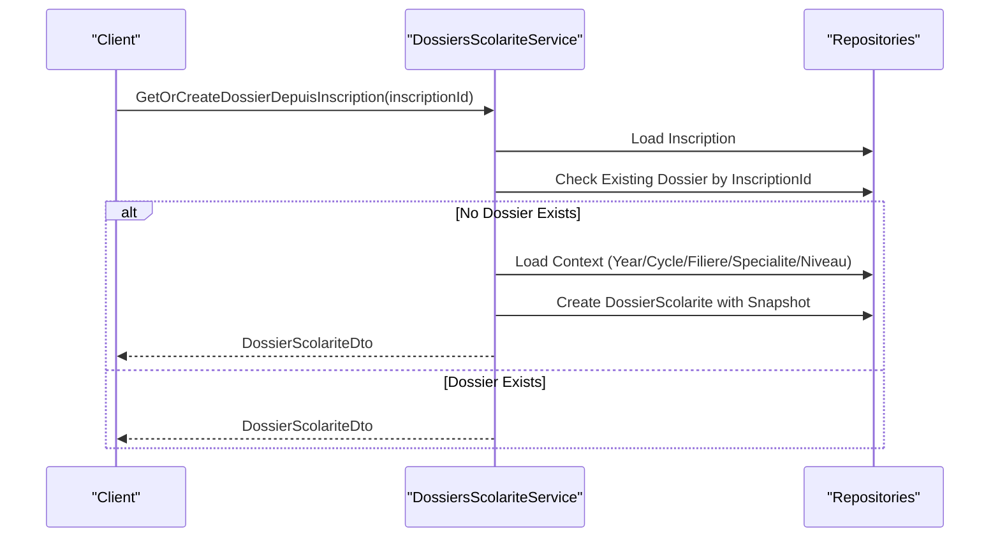
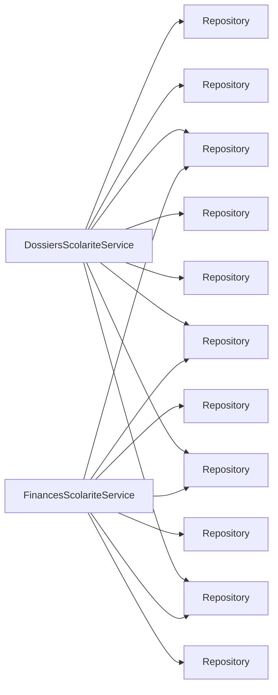

# Student Financial Dossiers

<cite>
**Referenced Files in This Document**
- [DossierScolarite.cs](file://RIIS.Academic.Domain/Scolarite/DossierScolarite.cs)
- [StatutDossierScolarite.cs](file://RIIS.Academic.Domain/Enums/StatutDossierScolarite.cs)
- [ElementScolariteEtudiant.cs](file://RIIS.Academic.Domain/Scolarite/ElementScolariteEtudiant.cs)
- [PaiementScolarite.cs](file://RIIS.Academic.Domain/Scolarite/PaiementScolarite.cs)
- [NotificationScolarite.cs](file://RIIS.Academic.Domain/Scolarite/NotificationScolarite.cs)
- [EcheanceScolarite.cs](file://RIIS.Academic.Domain/Scolarite/EcheanceScolarite.cs)
- [TypeElementScolarite.cs](file://RIIS.Academic.Domain/Scolarite/TypeElementScolarite.cs)
- [Inscription.cs](file://RIIS.Academic.Domain/Inscriptions/Inscription.cs)
- [DossiersScolariteService.cs](file://RIIS.Academic.Application/Scolarite/Services/DossiersScolariteService.cs)
- [FinancesScolariteService.cs](file://RIIS.Academic.Application/Scolarite/Services/FinancesScolariteService.cs)
- [DossierScolariteDto.cs](file://RIIS.Academic.Application/Scolarite/Dtos/DossierScolariteDto.cs)
- [IDossiersScolariteService.cs](file://RIIS.Academic.Application/Scolarite/Services/IDossiersScolariteService.cs)
- [DossierScolariteConfiguration.cs](file://RIIS.Academic.Infrastructure/Persistence/Configurations/Scolarite/DossierScolariteConfiguration.cs)
</cite>

## Table of Contents
1. Introduction
2. Project Structure
3. Core Components
4. Architecture Overview
5. Detailed Component Analysis
6. Dependency Analysis
7. Performance Considerations
8. Troubleshooting Guide
9. Conclusion

## Introduction
This document explains the Student Financial Dossiers system centered on the DossierScolarite entity. It covers how each student’s financial record is maintained across an academic year, including program details (cycle, filiere, specialite, niveau), and status tracking through StatutDossierScolarite. It documents the three status dimensions: StatutAdministratif, StatutFinancier, and StatutGlobal, and details relationships with Inscription, ElementScolariteEtudiant, PaiementScolarite, and NotificationScolarite. Practical examples illustrate creating dossiers, updating statuses, and managing payments throughout a student’s academic journey.

## Project Structure
The system follows clean architecture layers:
- Domain: Entities and enumerations that define the core model for dossiers, elements, payments, notifications, deadlines, and types.
- Application: Services that orchestrate business logic for administrative validation and financial operations.
- Infrastructure: Entity configurations mapping domain entities to database tables and constraints.

**Diagram sources**
- [DossierScolarite.cs:1-29](file://RIIS.Academic.Domain/Scolarite/DossierSolarite.cs#L1-L29)
- [ElementScolariteEtudiant.cs:1-26](file://RIIS.Academic.Domain/Scolarite/ElementScolariteEtudiant.cs#L1-L26)
- [PaiementScolarite.cs:1-29](file://RIIS.Academic.Domain/Scolarite/PaiementScolarite.cs#L1-L29)
- [NotificationScolarite.cs:1-21](file://RIIS.Academic.Domain/Scolarite/NotificationScolarite.cs#L1-L21)
- [EcheanceScolarite.cs:1-20](file://RIIS.Academic.Domain/Scolarite/EcheanceScolarite.cs#L1-L20)
- [TypeElementScolarite.cs:1-19](file://RIIS.Academic.Domain/Scolarite/TypeElementScolarite.cs#L1-L19)
- [Inscription.cs:1-37](file://RIIS.Academic.Domain/Inscriptions/Inscription.cs#L1-L37)
- [DossiersScolariteService.cs:1-614](file://RIIS.Academic.Application/Scolarite/Services/DossiersScolariteService.cs#L1-L614)
- [FinancesScolariteService.cs:1-361](file://RIIS.Academic.Application/Scolarite/Services/FinancesScolariteService.cs#L1-L361)
- [DossierScolariteConfiguration.cs:1-35](file://RIIS.Academic.Infrastructure/Persistence/Configurations/Scolarite/DossierScolariteConfiguration.cs#L1-L35)

**Section sources**
- [DossierScolarite.cs:1-29](file://RIIS.Academic.Domain/Scolarite/DossierScolarite.cs#L1-L29)
- [DossiersScolariteService.cs:1-614](file://RIIS.Academic.Application/Scolarite/Services/DossiersScolariteService.cs#L1-L614)
- [FinancesScolariteService.cs:1-361](file://RIIS.Academic.Application/Scolarite/Services/FinancesScolariteService.cs#L1-L361)
- [DossierScolariteConfiguration.cs:1-35](file://RIIS.Academic.Infrastructure/Persistence/Configurations/Scolarite/DossierScolariteConfiguration.cs#L1-L35)

## Core Components
- DossierScolarite: Represents a student’s financial dossier for an academic year snapshot, storing academic context (year, cycle, filiere, specialite, niveau) and three status dimensions: StatutAdministratif, StatutFinancier, StatutGlobal. It links to Inscription and aggregates Elements, Payments, and Notifications.
- ElementScolariteEtudiant: Per-student line items (fees or administrative requirements) tied to a type and deadline schedule; tracks expected, allocated, and remaining amounts and per-element status.
- PaiementScolarite: Records payments linked to a dossier and optionally to an element/type/tariff; tracks allocation and payment mode.
- NotificationScolarite: Tracks generated notifications related to a dossier, element, or deadline.
- EcheanceScolarite: Deadlines for elements with due dates and amounts.
- TypeElementScolarite: Defines categories and flags (payable, documentary, requires validation, mandatory).
- Inscription: The enrollment record that anchors a DossierScolarite.

Key behaviors:
- Administrative synchronization creates required administrative elements based on configured types.
- Administrative recalculations update StatutAdministratif, StatutFinancier, and StatutGlobal based on completeness and initial payment presence.
- Financial services compute totals, list elements/deadlines/payments, and persist free-form payments with tariff resolution.

**Section sources**
- [DossierScolarite.cs:1-29](file://RIIS.Academic.Domain/Scolarite/DossierScolarite.cs#L1-L29)
- [ElementScolariteEtudiant.cs:1-26](file://RIIS.Academic.Domain/Scolarite/ElementScolariteEtudiant.cs#L1-L26)
- [PaiementScolarite.cs:1-29](file://RIIS.Academic.Domain/Scolarite/PaiementScolarite.cs#L1-L29)
- [NotificationScolarite.cs:1-21](file://RIIS.Academic.Domain/Scolarite/NotificationScolarite.cs#L1-L21)
- [EcheanceScolarite.cs:1-20](file://RIIS.Academic.Domain/Scolarite/EcheanceScolarite.cs#L1-L20)
- [TypeElementScolarite.cs:1-19](file://RIIS.Academic.Domain/Scolarite/TypeElementScolarite.cs#L1-L19)
- [Inscription.cs:1-37](file://RIIS.Academic.Domain/Inscriptions/Inscription.cs#L1-L37)

## Architecture Overview
The application layer exposes two primary services:
- DossiersScolariteService: Manages administrative lifecycle (document sync, save, recalculation) and dossier creation from Inscription.
- FinancesScolariteService: Manages financial data (elements, deadlines, payments, allocations) and tariff resolution.

**Diagram sources**
- [DossiersScolariteService.cs:277-317](file://RIIS.Academic.Application/Scolarite/Services/DossiersScolariteService.cs#L277-L317)
- [DossiersScolariteService.cs:254-275](file://RIIS.Academic.Application/Scolarite/Services/DossiersScolariteService.cs#L254-L275)
- [FinancesScolariteService.cs:58-141](file://RIIS.Academic.Application/Scolarite/Services/FinancesScolariteService.cs#L58-L141)

## Detailed Component Analysis

### DossierScolarite Entity and Status Model
- Academic snapshot fields store year code/libelle, cycle/filiere/specialite/niveau to preserve context at time of enrollment.
- Three status enums drive lifecycle:
  - StatutAdministratif: reflects completeness of mandatory administrative pieces.
  - StatutFinancier: reflects whether any active payment exists.
  - StatutGlobal: indicates if continuation of studies is authorized.
- Relationships: one-to-one with Inscription; one-to-many with ElementScolariteEtudiant, PaiementScolarite, NotificationScolarite.

**Diagram sources**
- [DossierScolarite.cs:1-29](file://RIIS.Academic.Domain/Scolarite/DossierScolarite.cs#L1-L29)
- [Inscription.cs:1-37](file://RIIS.Academic.Domain/Inscriptions/Inscription.cs#L1-L37)
- [ElementScolariteEtudiant.cs:1-26](file://RIIS.Academic.Domain/Scolarite/ElementScolariteEtudiant.cs#L1-L26)
- [PaiementScolarite.cs:1-29](file://RIIS.Academic.Domain/Scolarite/PaiementScolarite.cs#L1-L29)
- [NotificationScolarite.cs:1-21](file://RIIS.Academic.Domain/Scolarite/NotificationScolarite.cs#L1-L21)

**Section sources**
- [DossierScolarite.cs:1-29](file://RIIS.Academic.Domain/Scolarite/DossierScolarite.cs#L1-L29)
- [StatutDossierScolarite.cs:1-13](file://RIIS.Academic.Domain/Enums/StatutDossierScolarite.cs#L1-L13)

### Administrative Lifecycle and Status Recalculation
- Synchronization ensures all required administrative elements exist for a dossier based on active types.
- Saving a document/validation updates element status and triggers administrative recalculation.
- Recalculation sets:
  - StatutAdministratif: Regular if all mandatory pieces complete; otherwise Incomplete.
  - StatutFinancier: In progress if any active payment exists; otherwise Preparation.
  - StatutGlobal: In progress if continuation is authorized; otherwise Incomplete.

**Diagram sources**
- [DossiersScolariteService.cs:254-275](file://RIIS.Academic.Application/Scolarite/Services/DossiersScolariteService.cs#L254-L275)

**Section sources**
- [DossiersScolariteService.cs:128-162](file://RIIS.Academic.Application/Scolarite/Services/DossiersScolariteService.cs#L128-L162)
- [DossiersScolariteService.cs:164-252](file://RIIS.Academic.Application/Scolarite/Services/DossiersScolariteService.cs#L164-L252)
- [DossiersScolariteService.cs:254-275](file://RIIS.Academic.Application/Scolarite/Services/DossiersScolariteService.cs#L254-L275)

### Financial Management and Payments
- Financial view aggregates elements, deadlines, payments, and allocations for a dossier.
- Free-form payment creation validates mode, tariff applicability, and amount rules, then persists the payment and returns updated finance view.
- Tariffs are resolved using the dossier’s academic context (year, cycle, filiere, specialite, niveau).

**Diagram sources**
- [FinancesScolariteService.cs:58-141](file://RIIS.Academic.Application/Scolarite/Services/FinancesScolariteService.cs#L58-L141)
- [FinancesScolariteService.cs:143-193](file://RIIS.Academic.Application/Scolarite/Services/FinancesScolariteService.cs#L143-L193)

**Section sources**
- [FinancesScolariteService.cs:17-56](file://RIIS.Academic.Application/Scolarite/Services/FinancesScolariteService.cs#L17-L56)
- [FinancesScolariteService.cs:58-141](file://RIIS.Academic.Application/Scolarite/Services/FinancesScolariteService.cs#L58-L141)
- [FinancesScolariteService.cs:143-193](file://RIIS.Academic.Application/Scolarite/Services/FinancesScolariteService.cs#L143-L193)

### Creating a Financial Dossier from Enrollment
- If no dossier exists for an inscription, the service builds a snapshot from the enrollment context (academic year, cycle, filiere, specialite, niveau) and initializes all statuses to preparation.
- Returns a DTO representing the created or existing dossier.

**Diagram sources**
- [DossiersScolariteService.cs:277-317](file://RIIS.Academic.Application/Scolarite/Services/DossiersScolariteService.cs#L277-L317)

**Section sources**
- [DossiersScolariteService.cs:277-317](file://RIIS.Academic.Application/Scolarite/Services/DossiersScolariteService.cs#L277-L317)

### Managing Student Financial Records Throughout the Academic Journey
- Initial setup: create dossier from enrollment; synchronize administrative elements; set initial statuses.
- During enrollment: upload documents, submit validations; trigger recalculation to update administrative and global statuses.
- Financial phase: record payments, allocate to deadlines, monitor totals and remaining balances; statuses reflect payment activity.
- Ongoing: notifications track communications about deadlines, payments, and validations.

Practical example steps:
- Create or retrieve dossier for an enrollment.
- Synchronize administrative elements to ensure required items exist.
- Save document/validation for an element and recalculate administrative validation to update statuses.
- Record a payment with applicable tariff and mode; view updated financial summary.

**Section sources**
- [DossiersScolariteService.cs:128-162](file://RIIS.Academic.Application/Scolarite/Services/DossiersScolariteService.cs#L128-L162)
- [DossiersScolariteService.cs:164-252](file://RIIS.Academic.Application/Scolarite/Services/DossiersScolariteService.cs#L164-L252)
- [DossiersScolariteService.cs:254-275](file://RIIS.Academic.Application/Scolarite/Services/DossiersScolariteService.cs#L254-L275)
- [FinancesScolariteService.cs:58-141](file://RIIS.Academic.Application/Scolarite/Services/FinancesScolariteService.cs#L58-L141)

## Dependency Analysis
- Service dependencies:
  - DossiersScolariteService depends on repositories for dossiers, inscriptions, students, academic references, types, elements, documents, validations, and payments.
  - FinancesScolariteService depends on repositories for dossiers, types, elements, deadlines, payments, modes, allocations, and tariffs.
- Domain relationships:
  - DossierScolarite links to Inscription and aggregates elements, payments, notifications.
  - ElementScolariteEtudiant links to deadlines and payments.
  - PaiementScolarite links to type and tariff contexts.
- Configuration:
  - DossierScolarite table configuration enforces unique InscriptionId and indexes for academic context queries.

**Diagram sources**
- [DossiersScolariteService.cs:7-21](file://RIIS.Academic.Application/Scolarite/Services/DossiersScolariteService.cs#L7-L21)
- [FinancesScolariteService.cs:7-15](file://RIIS.Academic.Application/Scolarite/Services/FinancesScolariteService.cs#L7-L15)
- [DossierScolariteConfiguration.cs:1-35](file://RIIS.Academic.Infrastructure/Persistence/Configurations/Scolarite/DossierScolariteConfiguration.cs#L1-L35)

**Section sources**
- [DossiersScolariteService.cs:7-21](file://RIIS.Academic.Application/Scolarite/Services/DossiersScolariteService.cs#L7-L21)
- [FinancesScolariteService.cs:7-15](file://RIIS.Academic.Application/Scolarite/Services/FinancesScolariteService.cs#L7-L15)
- [DossierScolariteConfiguration.cs:1-35](file://RIIS.Academic.Infrastructure/Persistence/Configurations/Scolarite/DossierScolariteConfiguration.cs#L1-L35)

## Performance Considerations
- Batch loading: Services load reference data into memory (students, academic years, cycles, filieres, specialites, niveaux) to avoid repeated queries during DTO building and filtering.
- Filtering and ordering: Queries apply normalized filters for search and academic codes before ordering results.
- Indexing: Database configuration includes a unique index on InscriptionId and composite indexes on academic context fields to optimize lookups and queries.
- Payment aggregation: Financial view computes totals and sums efficiently over persisted collections.

[No sources needed since this section provides general guidance]

## Troubleshooting Guide
Common issues and resolutions:
- Missing dossier for enrollment: Use the “get or create” operation to generate a dossier from an existing enrollment; it will build a snapshot and initialize statuses.
- Administrative incompleteness: Ensure all mandatory administrative elements have documents uploaded and validations approved; then recalculate administrative validation to update statuses.
- Invalid payment mode or tariff: Validate that the selected payment mode is active and the tariff matches the dossier’s academic context; errors will be thrown if mismatched.
- Payment amount rules: Ensure payment amount is greater than zero and not less than already allocated amounts when editing.

Operational checks:
- Verify that administrative synchronization has run to create required elements.
- Confirm that tariffs are active and applicable for the current academic context.
- Review notification statuses to identify delivery issues.

**Section sources**
- [DossiersScolariteService.cs:277-317](file://RIIS.Academic.Application/Scolarite/Services/DossiersScolariteService.cs#L277-L317)
- [DossiersScolariteService.cs:128-162](file://RIIS.Academic.Application/Scolarite/Services/DossiersScolariteService.cs#L128-L162)
- [DossiersScolariteService.cs:254-275](file://RIIS.Academic.Application/Scolarite/Services/DossiersScolariteService.cs#L254-L275)
- [FinancesScolariteService.cs:58-141](file://RIIS.Academic.Application/Scolarite/Services/FinancesScolariteService.cs#L58-L141)

## Conclusion
The Student Financial Dossiers system models each student’s financial record as a stable snapshot tied to an academic year and program context. Through clear separation of administrative and financial concerns, the system maintains accurate statuses across three dimensions and supports the full lifecycle from enrollment to payment completion. Services provide robust operations to create dossiers, manage administrative elements, and handle payments with tariff resolution, while infrastructure ensures efficient persistence and query performance.

[No sources needed since this section summarizes without analyzing specific files]