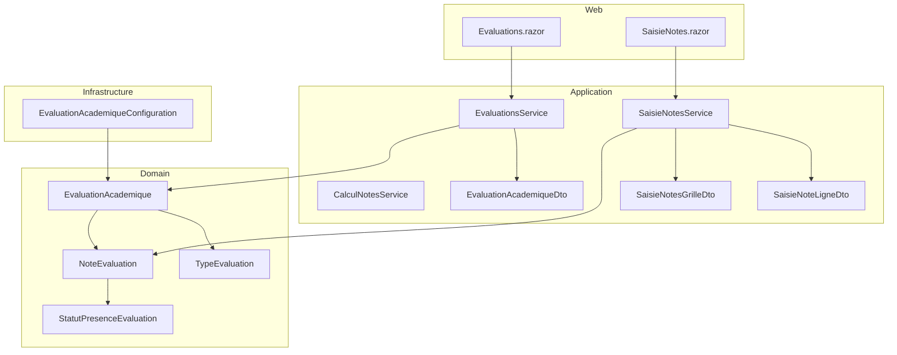
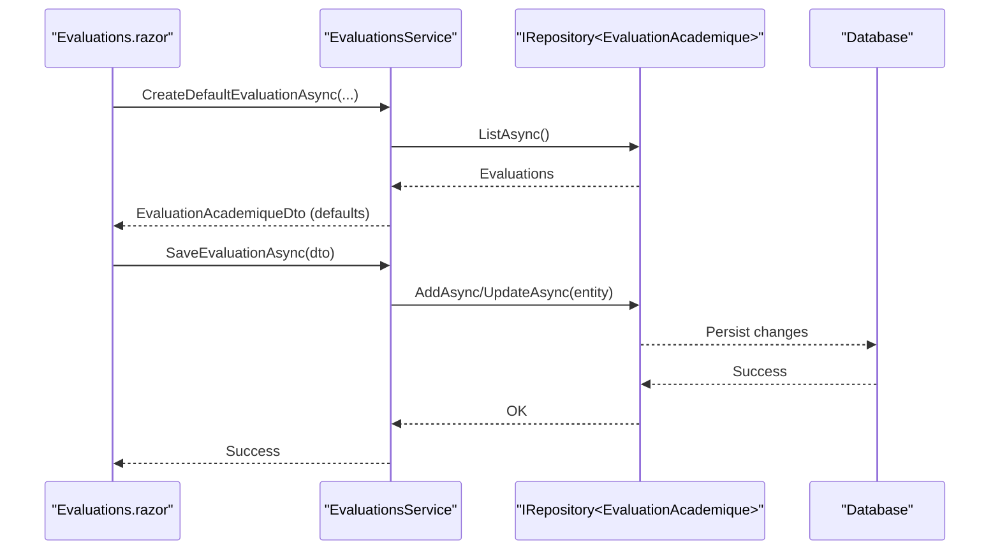
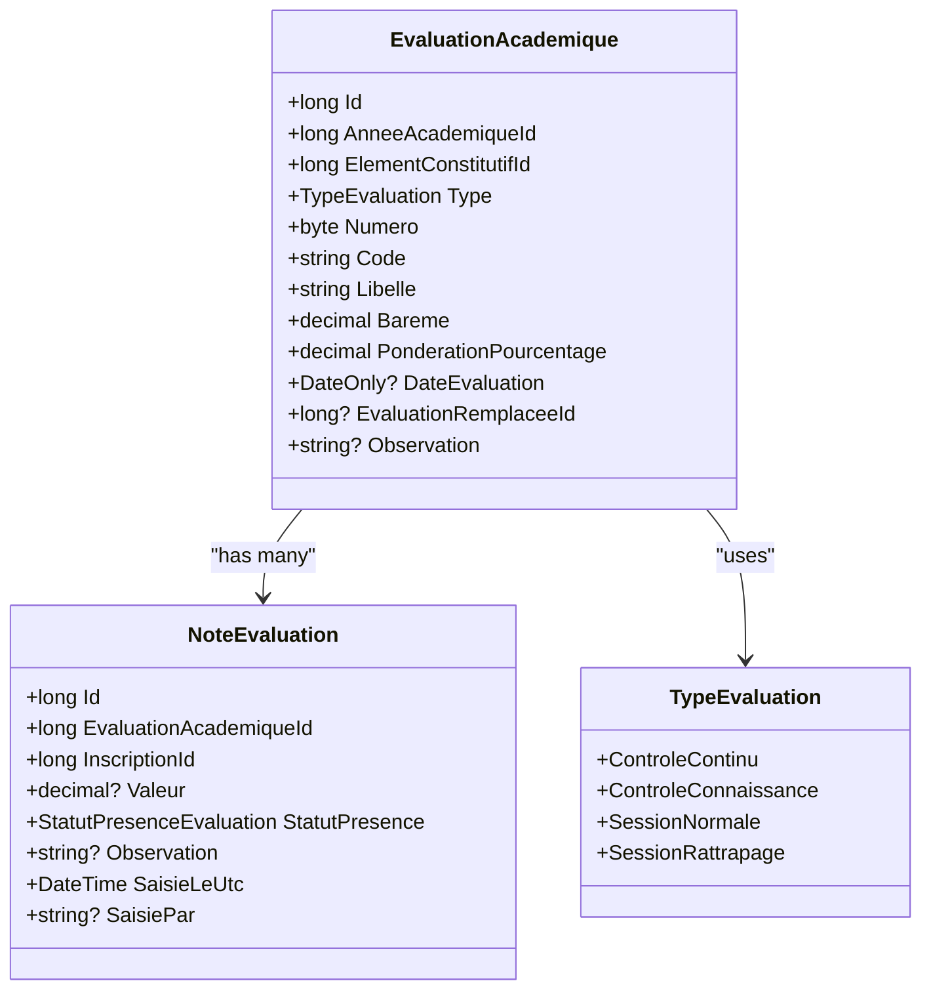
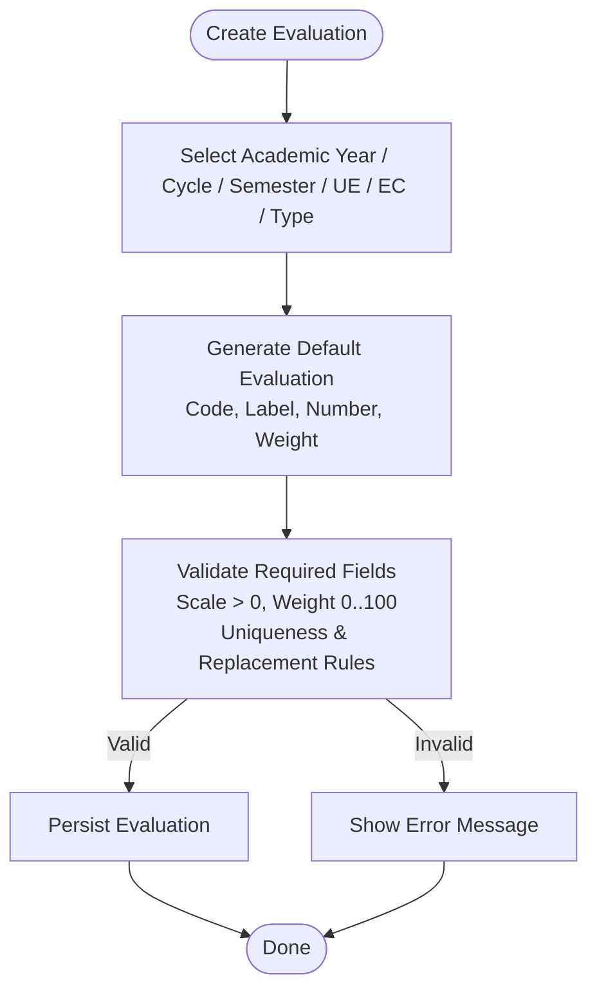
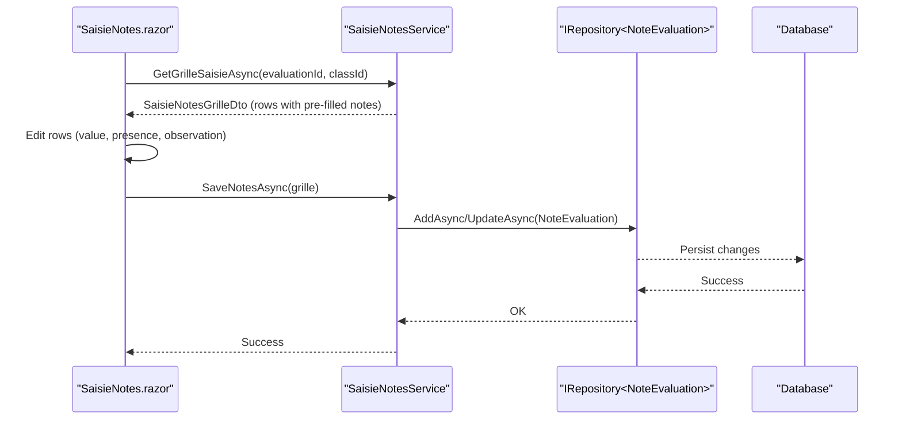
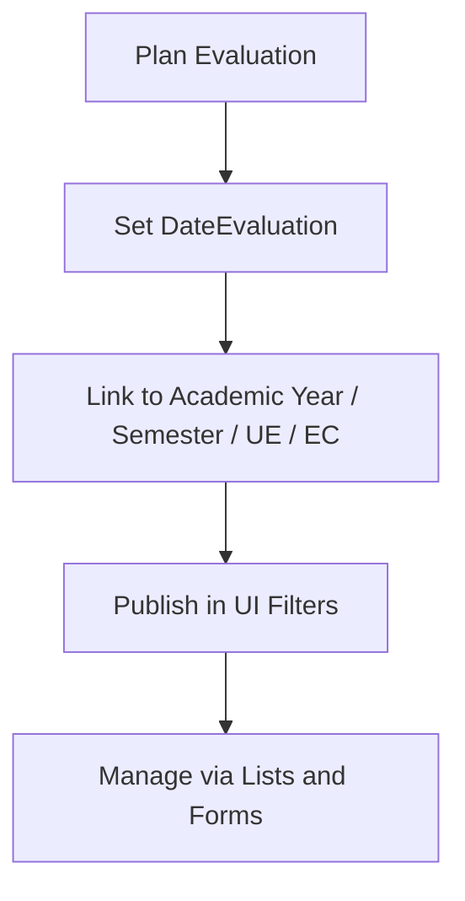
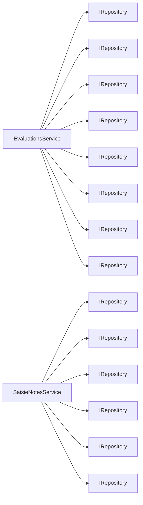
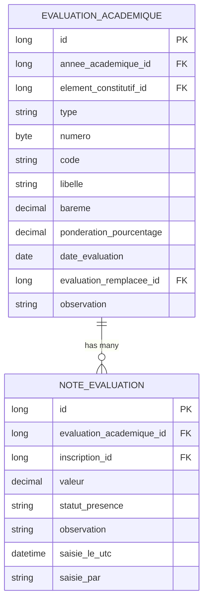

# Evaluation Management

<cite>
**Referenced Files in This Document**
- [TypeEvaluation.cs](file://RIIS.Academic.Domain/Enums/TypeEvaluation.cs)
- [StatutPresenceEvaluation.cs](file://RIIS.Academic.Domain/Enums/StatutPresenceEvaluation.cs)
- [EvaluationAcademique.cs](file://RIIS.Academic.Domain/Notes/EvaluationAcademique.cs)
- [NoteEvaluation.cs](file://RIIS.Academic.Domain/Notes/NoteEvaluation.cs)
- [EvaluationAcademiqueConfiguration.cs](file://RIIS.Academic.Infrastructure/Persistence/Configurations/Notes/EvaluationAcademiqueConfiguration.cs)
- [EvaluationAcademiqueDto.cs](file://RIIS.Academic.Application/Evaluations/Dtos/EvaluationAcademiqueDto.cs)
- [EvaluationsService.cs](file://RIIS.Academic.Application/Evaluations/Services/EvaluationsService.cs)
- [SaisieNoteLigneDto.cs](file://RIIS.Academic.Application/Notes/Dtos/SaisieNoteLigneDto.cs)
- [SaisieNotesGrilleDto.cs](file://RIIS.Academic.Application/Notes/Dtos/SaisieNotesGrilleDto.cs)
- [SaisieNotesService.cs](file://RIIS.Academic.Application/Notes/Services/SaisieNotesService.cs)
- [CalculNotesService.cs](file://RIIS.Academic.Application/Notes/Services/CalculNotesService.cs)
- [Evaluations.razor](file://RIIS.Academic.Web/Components/Pages/Evaluations.razor)
- [SaisieNotes.razor](file://RIIS.Academic.Web/Components/Pages/SaisieNotes.razor)
</cite>

## Table of Contents
1. [Introduction](#introduction)
2. [Project Structure](#project-structure)
3. [Core Components](#core-components)
4. [Architecture Overview](#architecture-overview)
5. [Detailed Component Analysis](#detailed-component-analysis)
6. [Dependency Analysis](#dependency-analysis)
7. [Performance Considerations](#performance-considerations)
8. [Troubleshooting Guide](#troubleshooting-guide)
9. [Conclusion](#conclusion)
10. [Appendices](#appendices)

## Introduction
This document explains how evaluations are created and managed using EvaluationAcademique entities and their associated NoteEvaluation records. It details the evaluation types defined by TypeEvaluation, grade entry workflows, scoring scales (bareme), evaluation scheduling via DateEvaluation, and management of academic periods through relationships with academic years, units of teaching, and constituent elements. Examples illustrate creating evaluations, entering grades per student, and managing evaluation periods.

## Project Structure
The evaluation feature spans Domain, Application, Infrastructure, and Web layers:
- Domain defines core entities and enumerations for evaluations and grades.
- Application provides services and DTOs to orchestrate evaluation creation, filtering, and grade entry.
- Infrastructure configures persistence and database constraints for evaluations.
- Web pages provide user interfaces for creating/editing evaluations and entering grades.

**Diagram sources**
- [EvaluationAcademique.cs:1-24](file://RIIS.Academic.Domain/Notes/EvaluationAcademique.cs#L1-L24)
- [NoteEvaluation.cs:1-17](file://RIIS.Academic.Domain/Notes/NoteEvaluation.cs#L1-L17)
- [TypeEvaluation.cs:1-10](file://RIIS.Academic.Domain/Enums/TypeEvaluation.cs#L1-L10)
- [StatutPresenceEvaluation.cs:1-10](file://RIIS.Academic.Domain/Enums/StatutPresenceEvaluation.cs#L1-L10)
- [EvaluationAcademiqueConfiguration.cs:1-26](file://RIIS.Academic.Infrastructure/Persistence/Configurations/Notes/EvaluationAcademiqueConfiguration.cs#L1-L26)
- [EvaluationsService.cs:1-643](file://RIIS.Academic.Application/Evaluations/Services/EvaluationsService.cs#L1-L643)
- [SaisieNotesService.cs:1-317](file://RIIS.Academic.Application/Notes/Services/SaisieNotesService.cs#L1-L317)
- [CalculNotesService.cs:1-25](file://RIIS.Academic.Application/Notes/Services/CalculNotesService.cs#L1-L25)
- [EvaluationAcademiqueDto.cs:1-30](file://RIIS.Academic.Application/Evaluations/Dtos/EvaluationAcademiqueDto.cs#L1-L30)
- [SaisieNotesGrilleDto.cs:1-20](file://RIIS.Academic.Application/Notes/Dtos/SaisieNotesGrilleDto.cs#L1-L20)
- [SaisieNoteLigneDto:1-18](file://RIIS.Academic.Application/Notes/Dtos/SaisieNoteLigneDto.cs#L1-L18)
- [Evaluations.razor:1-584](file://RIIS.Academic.Web/Components/Pages/Evaluations.razor#L1-L584)
- [SaisieNotes.razor:1-344](file://RIIS.Academic.Web/Components/Pages/SaisieNotes.razor#L1-L344)

**Section sources**
- [EvaluationAcademique.cs:1-24](file://RIIS.Academic.Domain/Notes/EvaluationAcademique.cs#L1-L24)
- [NoteEvaluation.cs:1-17](file://RIIS.Academic.Domain/Notes/NoteEvaluation.cs#L1-L17)
- [TypeEvaluation.cs:1-10](file://RIIS.Academic.Domain/Enums/TypeEvaluation.cs#L1-L10)
- [StatutPresenceEvaluation.cs:1-10](file://RIIS.Academic.Domain/Enums/StatutPresenceEvaluation.cs#L1-L10)
- [EvaluationAcademiqueConfiguration.cs:1-26](file://RIIS.Academic.Infrastructure/Persistence/Configurations/Notes/EvaluationAcademiqueConfiguration.cs#L1-L26)
- [EvaluationsService.cs:1-643](file://RIIS.Academic.Application/Evaluations/Services/EvaluationsService.cs#L1-L643)
- [SaisieNotesService.cs:1-317](file://RIIS.Academic.Application/Notes/Services/SaisieNotesService.cs#L1-L317)
- [CalculNotesService.cs:1-25](file://RIIS.Academic.Application/Notes/Services/CalculNotesService.cs#L1-L25)
- [EvaluationAcademiqueDto.cs:1-30](file://RIIS.Academic.Application/Evaluations/Dtos/EvaluationAcademiqueDto.cs#L1-L30)
- [SaisieNotesGrilleDto.cs:1-20](file://RIIS.Academic.Application/Notes/Dtos/SaisieNotesGrilleDto.cs#L1-L20)
- [SaisieNoteLigneDto:1-18](file://RIIS.Academic.Application/Notes/Dtos/SaisieNoteLigneDto.cs#L1-L18)
- [Evaluations.razor:1-584](file://RIIS.Academic.Web/Components/Pages/Evaluations.razor#L1-L584)
- [SaisieNotes.razor:1-344](file://RIIS.Academic.Web/Components/Pages/SaisieNotes.razor#L1-L344)

## Core Components
- EvaluationAcademique: Represents an academic evaluation linked to an academic year and a constituent element. It includes type, numbering, code, label, scale (bareme), weighting percentage, scheduled date, optional replacement relationship, and observations. It has navigation properties to academic year, constituent element, replaced evaluation, related catch-up evaluations, and notes.
- NoteEvaluation: Records a student’s result for an evaluation, including value, attendance status, observation, and audit fields.
- TypeEvaluation: Enumeration defining four evaluation types: continuous assessment, knowledge control, normal session, and catch-up session.
- StatutPresenceEvaluation: Enumeration capturing presence statuses for each note entry.
- EvaluationsService: Orchestrates listing, creating default evaluations, saving, deleting, and lookup helpers for hierarchical filters (academic year, cycle, semester, unit, constituent).
- SaisieNotesService: Provides grids for grade entry per class and evaluation, validates values against bareme, handles attendance logic, and persists NoteEvaluation records.
- CalculNotesService: Computes final average for a constituent element based on weighted components and determines eligibility for catch-up sessions.

**Section sources**
- [EvaluationAcademique.cs:1-24](file://RIIS.Academic.Domain/Notes/EvaluationAcademique.cs#L1-L24)
- [NoteEvaluation.cs:1-17](file://RIIS.Academic.Domain/Notes/NoteEvaluation.cs#L1-L17)
- [TypeEvaluation.cs:1-10](file://RIIS.Academic.Domain/Enums/TypeEvaluation.cs#L1-L10)
- [StatutPresenceEvaluation.cs:1-10](file://RIIS.Academic.Domain/Enums/StatutPresenceEvaluation.cs#L1-L10)
- [EvaluationsService.cs:1-643](file://RIIS.Academic.Application/Evaluations/Services/EvaluationsService.cs#L1-L643)
- [SaisieNotesService.cs:1-317](file://RIIS.Academic.Application/Notes/Services/SaisieNotesService.cs#L1-L317)
- [CalculNotesService.cs:1-25](file://RIIS.Academic.Application/Notes/Services/CalculNotesService.cs#L1-L25)

## Architecture Overview
The system follows clean architecture principles:
- Domain layer models evaluation concepts and relationships.
- Application layer implements business rules for evaluation lifecycle and grade entry.
- Infrastructure layer configures EF mappings and constraints.
- Web layer exposes UI flows for evaluation management and grade entry.

**Diagram sources**
- [Evaluations.razor:402-413](file://RIIS.Academic.Web/Components/Pages/Evaluations.razor#L402-L413)
- [EvaluationsService.cs:142-170](file://RIIS.Academic.Application/Evaluations/Services/EvaluationsService.cs#L142-L170)
- [EvaluationsService.cs:172-294](file://RIIS.Academic.Application/Evaluations/Services/EvaluationsService.cs#L172-L294)

**Section sources**
- [Evaluations.razor:1-584](file://RIIS.Academic.Web/Components/Pages/Evaluations.razor#L1-L584)
- [EvaluationsService.cs:1-643](file://RIIS.Academic.Application/Evaluations/Services/EvaluationsService.cs#L1-L643)

## Detailed Component Analysis

### Evaluation Types and Characteristics
- TypeEvaluation defines:
  - Continuous assessment (CCON)
  - Knowledge control (CC)
  - Normal session (SN)
  - Catch-up session (SR)
- Default weightings are applied when creating evaluations:
  - CCON: 20%
  - CC: 10%
  - SN: 70%
  - SR: 70%
- SR can replace a SN for the same academic year and constituent element; validation ensures only one SN or SR exists per EC/year/type and that SR replaces a valid SN.

**Diagram sources**
- [TypeEvaluation.cs:1-10](file://RIIS.Academic.Domain/Enums/TypeEvaluation.cs#L1-L10)
- [EvaluationAcademique.cs:1-24](file://RIIS.Academic.Domain/Notes/EvaluationAcademique.cs#L1-L24)
- [NoteEvaluation.cs:1-17](file://RIIS.Academic.Domain/Notes/NoteEvaluation.cs#L1-L17)

**Section sources**
- [TypeEvaluation.cs:1-10](file://RIIS.Academic.Domain/Enums/TypeEvaluation.cs#L1-L10)
- [EvaluationsService.cs:574-602](file://RIIS.Academic.Application/Evaluations/Services/EvaluationsService.cs#L574-L602)
- [EvaluationsService.cs:204-242](file://RIIS.Academic.Application/Evaluations/Services/EvaluationsService.cs#L204-L242)

### Evaluation Creation Workflow
- The UI allows selecting academic year, cycle, semester, unit, constituent, and type to create a new evaluation.
- A default evaluation is generated with next sequential number, code prefix, and label based on type.
- Validation enforces required fields, positive scale, percentage bounds, uniqueness constraints, and replacement rules for SR.

**Diagram sources**
- [Evaluations.razor:402-413](file://RIIS.Academic.Web/Components/Pages/Evaluations.razor#L402-L413)
- [EvaluationsService.cs:142-170](file://RIIS.Academic.Application/Evaluations/Services/EvaluationsService.cs#L142-L170)
- [EvaluationsService.cs:172-294](file://RIIS.Academic.Application/Evaluations/Services/EvaluationsService.cs#L172-L294)

**Section sources**
- [Evaluations.razor:1-584](file://RIIS.Academic.Web/Components/Pages/Evaluations.razor#L1-L584)
- [EvaluationsService.cs:142-294](file://RIIS.Academic.Application/Evaluations/Services/EvaluationsService.cs#L142-L294)

### Grade Entry Workflow and Scoring Scale
- Users select an evaluation and a pedagogical class to load a grid of students.
- For each student, enter a grade within the evaluation’s scale (0 to bareme) if present; otherwise set attendance status.
- Attendance affects whether a grade is allowed; non-present statuses clear the value.
- Saving creates or updates NoteEvaluation records with timestamps and operator info.

**Diagram sources**
- [SaisieNotes.razor:282-326](file://RIIS.Academic.Web/Components/Pages/SaisieNotes.razor#L282-L326)
- [SaisieNotesService.cs:126-228](file://RIIS.Academic.Application/Notes/Services/SaisieNotesService.cs#L126-L228)
- [SaisieNotesService.cs:230-295](file://RIIS.Academic.Application/Notes/Services/SaisieNotesService.cs#L230-L295)

**Section sources**
- [SaisieNotes.razor:1-344](file://RIIS.Academic.Web/Components/Pages/SaisieNotes.razor#L1-L344)
- [SaisieNotesService.cs:126-295](file://RIIS.Academic.Application/Notes/Services/SaisieNotesService.cs#L126-L295)

### Evaluation Scheduling and Period Management
- Each evaluation can have a scheduled DateEvaluation to plan assessments.
- Evaluations are tied to an academic year and constituent element, enabling period-based organization across semesters and units.
- Filters allow narrowing evaluations by academic year, cycle, semester, unit, constituent, and type.

**Diagram sources**
- [EvaluationAcademique.cs:1-24](file://RIIS.Academic.Domain/Notes/EvaluationAcademique.cs#L1-L24)
- [EvaluationsService.cs:18-120](file://RIIS.Academic.Application/Evaluations/Services/EvaluationsService.cs#L18-L120)
- [Evaluations.razor:20-113](file://RIIS.Academic.Web/Components/Pages/Evaluations.razor#L20-L113)

**Section sources**
- [EvaluationAcademique.cs:1-24](file://RIIS.Academic.Domain/Notes/EvaluationAcademique.cs#L1-L24)
- [EvaluationsService.cs:18-120](file://RIIS.Academic.Application/Evaluations/Services/EvaluationsService.cs#L18-L120)
- [Evaluations.razor:20-113](file://RIIS.Academic.Web/Components/Pages/Evaluations.razor#L20-L113)

### Example Workflows

#### Creating an Evaluation
- Navigate to the Evaluations page, apply filters (year, cycle, semester, UE, EC, type).
- Click “New evaluation” to generate defaults based on selected context.
- Fill required fields (code, label, scale, weight), optionally set a date, and save.

**Section sources**
- [Evaluations.razor:402-413](file://RIIS.Academic.Web/Components/Pages/Evaluations.razor#L402-L413)
- [EvaluationsService.cs:142-170](file://RIIS.Academic.Application/Evaluations/Services/EvaluationsService.cs#L142-L170)
- [EvaluationsService.cs:172-294](file://RIIS.Academic.Application/Evaluations/Services/EvaluationsService.cs#L172-L294)

#### Entering Grades
- Go to the Grade Entry page, select academic year, class, unit, constituent, and evaluation.
- Load the grid, then for each student:
  - If present, enter a grade between 0 and the evaluation’s bareme.
  - If absent or dispensed, set appropriate presence status; value will be cleared.
- Save to persist all NoteEvaluation records.

**Section sources**
- [SaisieNotes.razor:126-185](file://RIIS.Academic.Web/Components/Pages/SaisieNotes.razor#L126-L185)
- [SaisieNotesService.cs:126-228](file://RIIS.Academic.Application/Notes/Services/SaisieNotesService.cs#L126-L228)
- [SaisieNotesService.cs:230-295](file://RIIS.Academic.Application/Notes/Services/SaisieNotesService.cs#L230-L295)

#### Managing Evaluation Periods
- Use hierarchical filters to view evaluations by academic year, cycle, semester, unit, constituent, and type.
- Adjust dates and weights per evaluation to align with planned periods.
- For catch-up sessions, ensure they replace a valid normal session within the same year and constituent.

**Section sources**
- [Evaluations.razor:20-113](file://RIIS.Academic.Web/Components/Pages/Evaluations.razor#L20-L113)
- [EvaluationsService.cs:18-120](file://RIIS.Academic.Application/Evaluations/Services/EvaluationsService.cs#L18-L120)
- [EvaluationsService.cs:204-242](file://RIIS.Academic.Application/Evaluations/Services/EvaluationsService.cs#L204-L242)

## Dependency Analysis
- EvaluationsService depends on repositories for academic years, constituent elements, units, semesters, pedagogical blueprints, academic pathways, and cycles to support filtering and lookups.
- SaisieNotesService depends on repositories for classes, registrations, students, evaluations, notes, constituent elements, units, and semester results to build grade grids and compute eligibility for catch-up sessions.
- CalculNotesService computes final averages and credits acquisition based on component averages and thresholds.

**Diagram sources**
- [EvaluationsService.cs:8-16](file://RIIS.Academic.Application/Evaluations/Services/EvaluationsService.cs#L8-L16)
- [SaisieNotesService.cs:8-17](file://RIIS.Academic.Application/Notes/Services/SaisieNotesService.cs#L8-L17)

**Section sources**
- [EvaluationsService.cs:8-16](file://RIIS.Academic.Application/Evaluations/Services/EvaluationsService.cs#L8-L16)
- [SaisieNotesService.cs:8-17](file://RIIS.Academic.Application/Notes/Services/SaisieNotesService.cs#L8-L17)

## Performance Considerations
- Filtering uses in-memory collections after loading lists; consider indexing and server-side filtering for large datasets.
- Unique constraint on (AnneeAcademiqueId, ElementConstitutifId, Type, Numero) prevents duplicates at the database level.
- Check constraints enforce scale and weighting ranges, reducing invalid data entry overhead.
- Attendance handling clears values for non-present statuses to avoid inconsistent states.

[No sources needed since this section provides general guidance]

## Troubleshooting Guide
Common errors and resolutions:
- Missing required fields: Ensure academic year, constituent element, code, and label are provided before saving an evaluation.
- Invalid scale or weighting: Verify scale is greater than zero and weighting is between 0 and 100.
- Duplicate evaluation: Only one evaluation per type and number is allowed for the same academic year and constituent element.
- Replacement rule violation: A catch-up session must replace a normal session within the same academic year and constituent element.
- Grade out of range: When entering grades, ensure values fall within 0 to the evaluation’s bareme; non-present statuses cannot have grades.

**Section sources**
- [EvaluationsService.cs:172-294](file://RIIS.Academic.Application/Evaluations/Services/EvaluationsService.cs#L172-L294)
- [SaisieNotesService.cs:230-295](file://RIIS.Academic.Application/Notes/Services/SaisieNotesService.cs#L230-L295)

## Conclusion
The evaluation management system centers around EvaluationAcademique and NoteEvaluation entities, supporting structured creation, scheduling, and grading across academic periods. TypeEvaluation defines distinct assessment modes with specific weightings, while validation and constraints ensure data integrity. The web interfaces provide intuitive workflows for creating evaluations and entering grades, with robust filtering and error handling.

[No sources needed since this section summarizes without analyzing specific files]

## Appendices

### Data Models and Relationships

**Diagram sources**
- [EvaluationAcademique.cs:1-24](file://RIIS.Academic.Domain/Notes/EvaluationAcademique.cs#L1-L24)
- [NoteEvaluation.cs:1-17](file://RIIS.Academic.Domain/Notes/NoteEvaluation.cs#L1-L17)