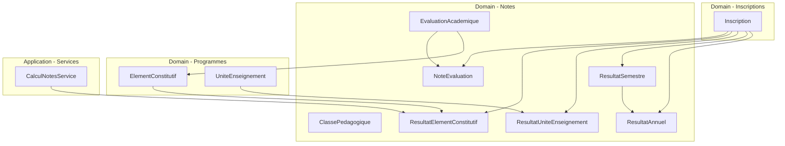
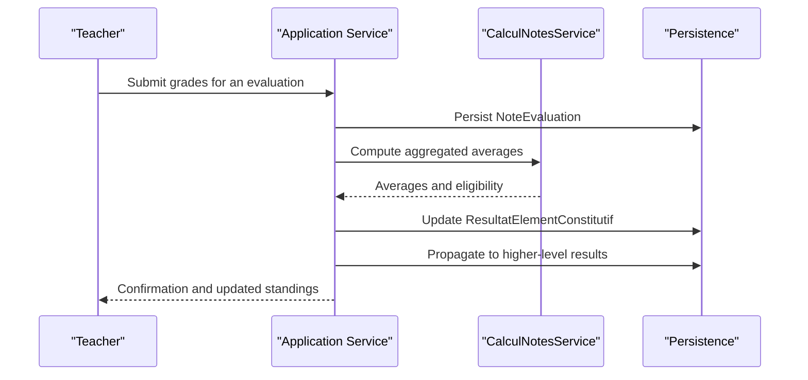
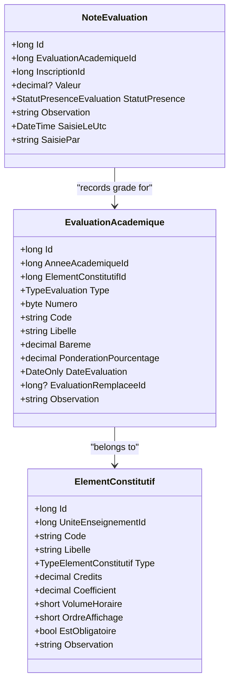
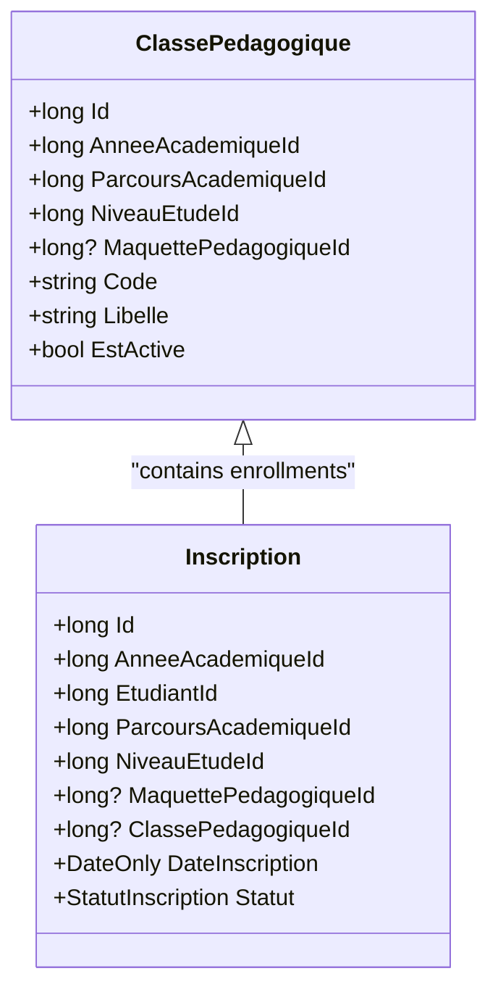
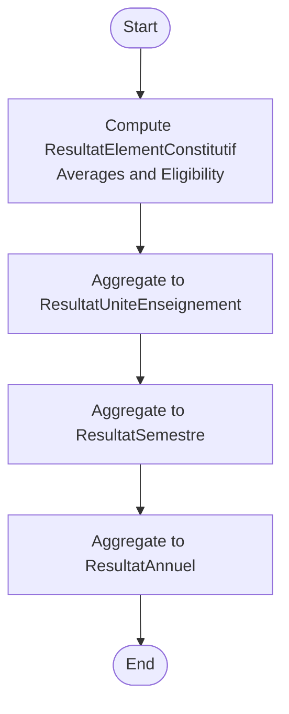
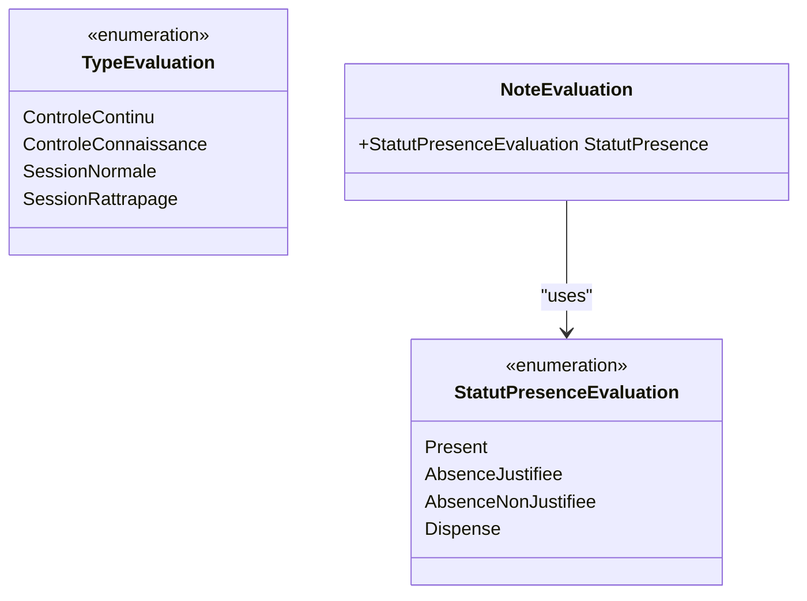
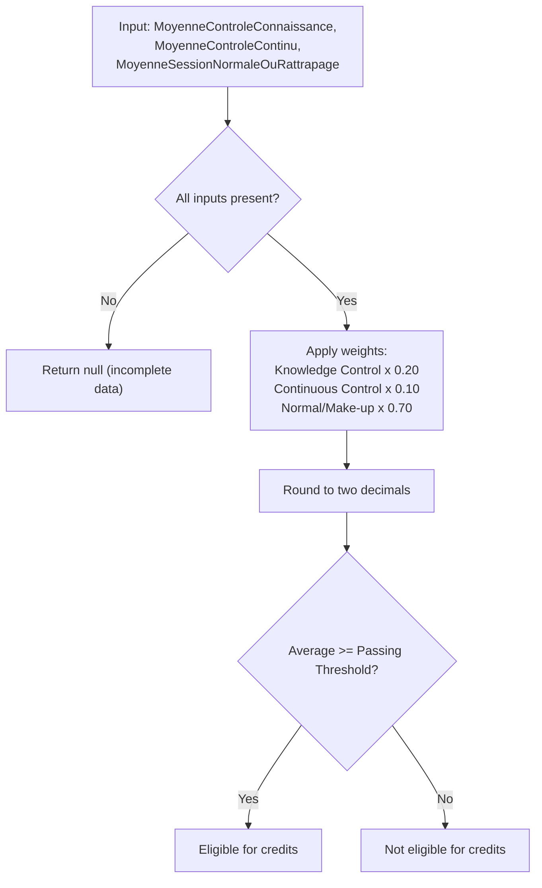
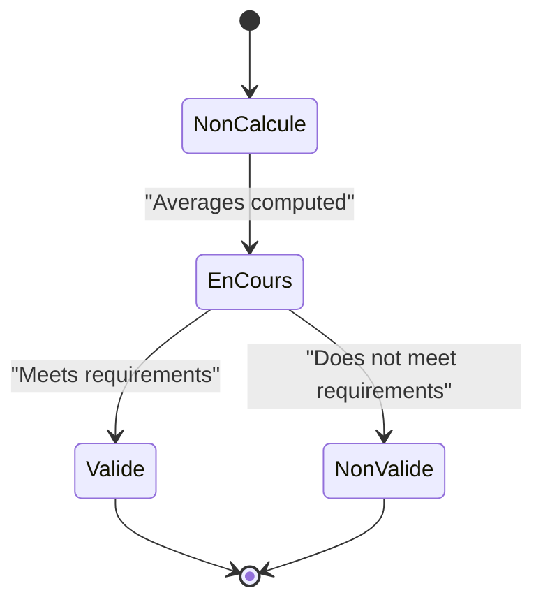
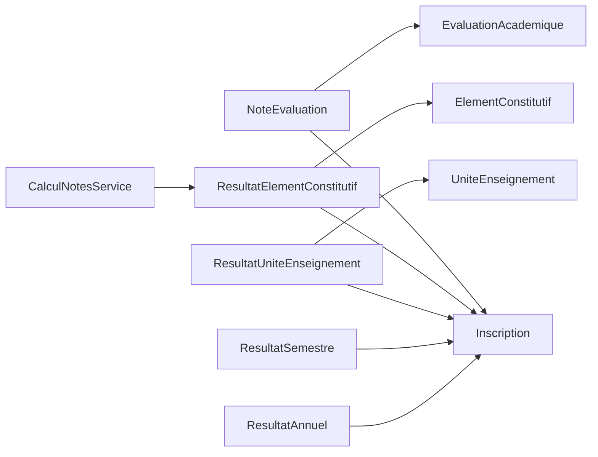

# Grade and Evaluation System

<cite>
**Referenced Files in This Document**
- [EvaluationAcademique.cs](file://RIIS.Academic.Domain/Notes/EvaluationAcademique.cs)
- [NoteEvaluation.cs](file://RIIS.Academic.Domain/Notes/NoteEvaluation.cs)
- [ClassePedagogique.cs](file://RIIS.Academic.Domain/Notes/ClassePedagogique.cs)
- [ResultatElementConstitutif.cs](file://RIIS.Academic.Domain/Notes/ResultatElementConstitutif.cs)
- [ResultatUniteEnseignement.cs](file://RIIS.Academic.Domain/Notes/ResultatUniteEnseignement.cs)
- [ResultatSemestre.cs](file://RIIS.Academic.Domain/Notes/ResultatSemestre.cs)
- [ResultatAnnuel.cs](file://RIIS.Academic.Domain/Notes/ResultatAnnuel.cs)
- [TypeEvaluation.cs](file://RIIS.Academic.Domain/Enums/TypeEvaluation.cs)
- [StatutPresenceEvaluation.cs](file://RIIS.Academic.Domain/Enums/StatutPresenceEvaluation.cs)
- [ElementConstitutif.cs](file://RIIS.Academic.Domain/Programmes/ElementConstitutif.cs)
- [UniteEnseignement.cs](file://RIIS.Academic.Domain/Programmes/UniteEnseignement.cs)
- [Inscription.cs](file://RIIS.Academic.Domain/Inscriptions/Inscription.cs)
- [CalculNotesService.cs](file://RIIS.Academic.Application/Notes/Services/CalculNotesService.cs)
</cite>

## Table of Contents
1. Introduction
2. Project Structure
3. Core Components
4. Architecture Overview
5. Detailed Component Analysis
6. Dependency Analysis
7. Performance Considerations
8. Troubleshooting Guide
9. Conclusion

## Introduction
This document explains the grade and evaluation management system with a focus on:
- Assessment containers and individual student grades
- Class group management and attendance tracking
- The result aggregation hierarchy from constituent elements to annual results
- Assessment types and attendance statuses
- Grading calculation rules, weight assignments, and academic standing determinations

The system is implemented as a domain model with clear separation between entities, enumerations, and application services that perform calculations.

## Project Structure
The relevant parts of the codebase are organized by domain concepts:
- Domain models for evaluations, notes, classes, and results live under RIIS.Academic.Domain/Notes and related programmatic structures.
- Application logic for grading calculations resides in RIIS.Academic.Application/Notes/Services.
- Program structure (units, constituent elements, semesters) provides context for how results aggregate upward.

**Diagram sources**
- [EvaluationAcademique.cs:1-24](file://RIIS.Academic.Domain/Notes/EvaluationAcademique.cs#L1-L24)
- [NoteEvaluation.cs:1-17](file://RIIS.Academic.Domain/Notes/NoteEvaluation.cs#L1-L17)
- [ClassePedagogique.cs:1-21](file://RIIS.Academic.Domain/Notes/ClassePedagogique.cs#L1-L21)
- [ResultatElementConstitutif.cs:1-23](file://RIIS.Academic.Domain/Notes/ResultatElementConstitutif.cs#L1-L23)
- [ResultatUniteEnseignement.cs:1-17](file://RIIS.Academic.Domain/Notes/ResultatUniteEnseignement.cs#L1-L17)
- [ResultatSemestre.cs:1-23](file://RIIS.Academic.Domain/Notes/ResultatSemestre.cs#L1-L23)
- [ResultatAnnuel.cs:1-21](file://RIIS.Academic.Domain/Notes/ResultatAnnuel.cs#L1-L21)
- [ElementConstitutif.cs:1-21](file://RIIS.Academic.Domain/Programmes/ElementConstitutif.cs#L1-L21)
- [UniteEnseignement.cs:1-18](file://RIIS.Academic.Domain/Programmes/UniteEnseignement.cs#L1-L18)
- [Inscription.cs:1-37](file://RIIS.Academic.Domain/Inscriptions/Inscription.cs#L1-L37)
- [CalculNotesService.cs:1-25](file://RIIS.Academic.Application/Notes/Services/CalculNotesService.cs#L1-L25)

**Section sources**
- [EvaluationAcademique.cs:1-24](file://RIIS.Academic.Domain/Notes/EvaluationAcademique.cs#L1-L24)
- [NoteEvaluation.cs:1-17](file://RIIS.Academic.Domain/Notes/NoteEvaluation.cs#L1-L17)
- [ClassePedagogique.cs:1-21](file://RIIS.Academic.Domain/Notes/ClassePedagogique.cs#L1-L21)
- [ResultatElementConstitutif.cs:1-23](file://RIIS.Academic.Domain/Notes/ResultatElementConstitutif.cs#L1-L23)
- [ResultatUniteEnseignement.cs:1-17](file://RIIS.Academic.Domain/Notes/ResultatUniteEnseignement.cs#L1-L17)
- [ResultatSemestre.cs:1-23](file://RIIS.Academic.Domain/Notes/ResultatSemestre.cs#L1-L23)
- [ResultatAnnuel.cs:1-21](file://RIIS.Academic.Domain/Notes/ResultatAnnuel.cs#L1-L21)
- [ElementConstitutif.cs:1-21](file://RIIS.Academic.Domain/Programmes/ElementConstitutif.cs#L1-L21)
- [UniteEnseignement.cs:1-18](file://RIIS.Academic.Domain/Programmes/UniteEnseignement.cs#L1-L18)
- [Inscription.cs:1-37](file://RIIS.Academic.Domain/Inscriptions/Inscription.cs#L1-L37)
- [CalculNotesService.cs:1-25](file://RIIS.Academic.Application/Notes/Services/CalculNotesService.cs#L1-L25)

## Core Components
- EvaluationAcademique: Represents an assessment instance tied to an academic year and a constituent element. It includes metadata such as type, number, code, label, scale, weighting percentage, date, replacement relationships, and observations. It aggregates student grades via NoteEvaluation and supports make-up assessments.
- NoteEvaluation: Captures a single student’s grade or attendance status for a specific evaluation. It links to the evaluation and the student’s enrollment record, stores the numeric value when present, and records who entered it and when.
- ClassePedagogique: Models a pedagogical class grouping within an academic year, linked to a study level and optionally a pedagogical blueprint. It tracks enrollments and official minutes (procedural records).
- ResultatElementConstitutif: Aggregates per-student averages by assessment type (continuous control, knowledge control, normal session, make-up), computes pre/post make-up averages, retained average, credits earned, eligibility for make-up, and validation status.
- ResultatUniteEnseignement: Aggregates per-student results at the teaching unit level, including average, credits earned vs expected, and validation status.
- ResultatSemestre: Aggregates per-student semester-level outcomes, including averages by assessment type, semester average, credits earned vs required, ranking, validation status, and jury decision.
- ResultatAnnuel: Aggregates per-student annual outcomes, including annual average, credits earned vs required, ranking, validation status, and jury decision.

Grades flow from NoteEvaluation into ResultatElementConstitutif, then up through ResultatUniteEnseignement to ResultatSemestre and ResultatAnnuel.

**Section sources**
- [EvaluationAcademique.cs:1-24](file://RIIS.Academic.Domain/Notes/EvaluationAcademique.cs#L1-L24)
- [NoteEvaluation.cs:1-17](file://RIIS.Academic.Domain/Notes/NoteEvaluation.cs#L1-L17)
- [ClassePedagogique.cs:1-21](file://RIIS.Academic.Domain/Notes/ClassePedagogique.cs#L1-L21)
- [ResultatElementConstitutif.cs:1-23](file://RIIS.Academic.Domain/Notes/ResultatElementConstitutif.cs#L1-L23)
- [ResultatUniteEnseignement.cs:1-17](file://RIIS.Academic.Domain/Notes/ResultatUniteEnseignement.cs#L1-L17)
- [ResultatSemestre.cs:1-23](file://RIIS.Academic.Domain/Notes/ResultatSemestre.cs#L1-L23)
- [ResultatAnnuel.cs:1-21](file://RIIS.Academic.Domain/Notes/ResultatAnnuel.cs#L1-L21)

## Architecture Overview
The system follows a layered approach:
- Domain layer defines entities and enumerations for evaluations, notes, classes, and results.
- Application layer provides services for calculations (e.g., computing averages and determining eligibility).
- Program structure (units, constituent elements, semesters) drives aggregation boundaries.

**Diagram sources**
- [NoteEvaluation.cs:1-17](file://RIIS.Academic.Domain/Notes/NoteEvaluation.cs#L1-L17)
- [ResultatElementConstitutif.cs:1-23](file://RIIS.Academic.Domain/Notes/ResultatElementConstitutif.cs#L1-L23)
- [ResultatUniteEnseignement.cs:1-17](file://RIIS.Academic.Domain/Notes/ResultatUniteEnseignement.cs#L1-L17)
- [ResultatSemestre.cs:1-23](file://RIIS.Academic.Domain/Notes/ResultatSemestre.cs#L1-L23)
- [ResultatAnnuel.cs:1-21](file://RIIS.Academic.Domain/Notes/ResultatAnnuel.cs#L1-L21)
- [CalculNotesService.cs:1-25](file://RIIS.Academic.Application/Notes/Services/CalculNotesService.cs#L1-L25)

## Detailed Component Analysis

### EvaluationAcademique and NoteEvaluation
- EvaluationAcademique acts as the container for assessments. It references an academic year and a constituent element, specifies the assessment type, number, code, label, scale, weighting percentage, date, optional replacement relationship, and observation. It maintains collections of make-up evaluations and student grades.
- NoteEvaluation records each student’s outcome for an evaluation, including the numeric value (when applicable), attendance status, observation, timestamp, and operator.

**Diagram sources**
- [EvaluationAcademique.cs:1-24](file://RIIS.Academic.Domain/Notes/EvaluationAcademique.cs#L1-L24)
- [NoteEvaluation.cs:1-17](file://RIIS.Academic.Domain/Notes/NoteEvaluation.cs#L1-L17)
- [ElementConstitutif.cs:1-21](file://RIIS.Academic.Domain/Programmes/ElementConstitutif.cs#L1-L21)

**Section sources**
- [EvaluationAcademique.cs:1-24](file://RIIS.Academic.Domain/Notes/EvaluationAcademique.cs#L1-L24)
- [NoteEvaluation.cs:1-17](file://RIIS.Academic.Domain/Notes/NoteEvaluation.cs#L1-L17)
- [ElementConstitutif.cs:1-21](file://RIIS.Academic.Domain/Programmes/ElementConstitutif.cs#L1-L21)

### ClassePedagogique: Class Groups and Attendance Context
- ClassePedagogique groups students within an academic year and study level, optionally bound to a pedagogical blueprint. It tracks enrollments and procedural records, providing the organizational context for attendance and grading.

**Diagram sources**
- [ClassePedagogique.cs:1-21](file://RIIS.Academic.Domain/Notes/ClassePedagogique.cs#L1-L21)
- [Inscription.cs:1-37](file://RIIS.Academic.Domain/Inscriptions/Inscription.cs#L1-L37)

**Section sources**
- [ClassePedagogique.cs:1-21](file://RIIS.Academic.Domain/Notes/ClassePedagogique.cs#L1-L21)
- [Inscription.cs:1-37](file://RIIS.Academic.Domain/Inscriptions/Inscription.cs#L1-L37)

### Result Aggregation Hierarchy
The aggregation flows from constituent elements to annual results:
- ResultatElementConstitutif: Stores per-student averages by assessment type, pre/post make-up averages, retained average, credits earned, eligibility for make-up, and validation status.
- ResultatUniteEnseignement: Aggregates per-student results at the teaching unit level, including average, credits earned vs expected, and validation status.
- ResultatSemestre: Aggregates per-student semester-level outcomes, including averages by assessment type, semester average, credits earned vs required, ranking, validation status, and jury decision.
- ResultatAnnuel: Aggregates per-student annual outcomes, including annual average, credits earned vs required, ranking, validation status, and jury decision.

**Diagram sources**
- [ResultatElementConstitutif.cs:1-23](file://RIIS.Academic.Domain/Notes/ResultatElementConstitutif.cs#L1-L23)
- [ResultatUniteEnseignement.cs:1-17](file://RIIS.Academic.Domain/Notes/ResultatUniteEnseignement.cs#L1-L17)
- [ResultatSemestre.cs:1-23](file://RIIS.Academic.Domain/Notes/ResultatSemestre.cs#L1-L23)
- [ResultatAnnuel.cs:1-21](file://RIIS.Academic.Domain/Notes/ResultatAnnuel.cs#L1-L21)

**Section sources**
- [ResultatElementConstitutif.cs:1-23](file://RIIS.Academic.Domain/Notes/ResultatElementConstitutif.cs#L1-L23)
- [ResultatUniteEnseignement.cs:1-17](file://RIIS.Academic.Domain/Notes/ResultatUniteEnseignement.cs#L1-L17)
- [ResultatSemestre.cs:1-23](file://RIIS.Academic.Domain/Notes/ResultatSemestre.cs#L1-L23)
- [ResultatAnnuel.cs:1-21](file://RIIS.Academic.Domain/Notes/ResultatAnnuel.cs#L1-L21)

### TypeEvaluation and StatutPresenceEvaluation
- TypeEvaluation enumerates assessment types: continuous control, knowledge control, normal session, and make-up session. These types drive which averages are computed and included in aggregations.
- StatutPresenceEvaluation captures attendance status for each note entry: present, justified absence, unjustified absence, and exempted.

**Diagram sources**
- [TypeEvaluation.cs:1-10](file://RIIS.Academic.Domain/Enums/TypeEvaluation.cs#L1-L10)
- [StatutPresenceEvaluation.cs:1-10](file://RIIS.Academic.Domain/Enums/StatutPresenceEvaluation.cs#L1-L10)
- [NoteEvaluation.cs:1-17](file://RIIS.Academic.Domain/Notes/NoteEvaluation.cs#L1-L17)

**Section sources**
- [TypeEvaluation.cs:1-10](file://RIIS.Academic.Domain/Enums/TypeEvaluation.cs#L1-L10)
- [StatutPresenceEvaluation.cs:1-10](file://RIIS.Academic.Domain/Enums/StatutPresenceEvaluation.cs#L1-L10)
- [NoteEvaluation.cs:1-17](file://RIIS.Academic.Domain/Notes/NoteEvaluation.cs#L1-L17)

### Grading Calculation Rules and Weight Assignments
- The application service computes the constituent element average using weighted contributions from knowledge control, continuous control, and the normal/make-up session. The weights are applied to produce a rounded final average.
- Eligibility for make-up is determined based on whether the constituent element average falls below a threshold.
- Credits are awarded only when the retained average meets or exceeds the passing threshold; otherwise, no credits are granted.

**Diagram sources**
- [CalculNotesService.cs:1-25](file://RIIS.Academic.Application/Notes/Services/CalculNotesService.cs#L1-L25)

**Section sources**
- [CalculNotesService.cs:1-25](file://RIIS.Academic.Application/Notes/Services/CalculNotesService.cs#L1-L25)

### Academic Standing Determinations
- At the constituent element level, eligibility for make-up is derived from the average.
- At the unit, semester, and annual levels, validation status and jury decisions reflect progression outcomes. Semester and annual results include credits earned versus required, rankings, and formal decisions.

**Diagram sources**
- [ResultatElementConstitutif.cs:1-23](file://RIIS.Academic.Domain/Notes/ResultatElementConstitutif.cs#L1-L23)
- [ResultatUniteEnseignement.cs:1-17](file://RIIS.Academic.Domain/Notes/ResultatUniteEnseignement.cs#L1-L17)
- [ResultatSemestre.cs:1-23](file://RIIS.Academic.Domain/Notes/ResultatSemestre.cs#L1-L23)
- [ResultatAnnuel.cs:1-21](file://RIIS.Academic.Domain/Notes/ResultatAnnuel.cs#L1-L21)

**Section sources**
- [ResultatElementConstitutif.cs:1-23](file://RIIS.Academic.Domain/Notes/ResultatElementConstitutif.cs#L1-L23)
- [ResultatUniteEnseignement.cs:1-17](file://RIIS.Academic.Domain/Notes/ResultatUniteEnseignement.cs#L1-L17)
- [ResultatSemestre.cs:1-23](file://RIIS.Academic.Domain/Notes/ResultatSemestre.cs#L1-L23)
- [ResultatAnnuel.cs:1-21](file://RIIS.Academic.Domain/Notes/ResultatAnnuel.cs#L1-L21)

## Dependency Analysis
Key dependencies and relationships:
- NoteEvaluation depends on EvaluationAcademique and Inscription to link grades to assessments and enrolled students.
- ResultatElementConstitutif depends on Inscription and ElementConstitutif to aggregate per-student performance per constituent element.
- Higher-level results depend on Inscription and their respective program units (UniteEnseignement, SemestrePedagogique, AnneeAcademique).
- CalculNotesService encapsulates calculation logic used to derive constituent element averages and credit awards.

**Diagram sources**
- [NoteEvaluation.cs:1-17](file://RIIS.Academic.Domain/Notes/NoteEvaluation.cs#L1-L17)
- [EvaluationAcademique.cs:1-24](file://RIIS.Academic.Domain/Notes/EvaluationAcademique.cs#L1-L24)
- [Inscription.cs:1-37](file://RIIS.Academic.Domain/Inscriptions/Inscription.cs#L1-L37)
- [ResultatElementConstitutif.cs:1-23](file://RIIS.Academic.Domain/Notes/ResultatElementConstitutif.cs#L1-L23)
- [ElementConstitutif.cs:1-21](file://RIIS.Academic.Domain/Programmes/ElementConstitutif.cs#L1-L21)
- [ResultatUniteEnseignement.cs:1-17](file://RIIS.Academic.Domain/Notes/ResultatUniteEnseignement.cs#L1-L17)
- [UniteEnseignement.cs:1-18](file://RIIS.Academic.Domain/Programmes/UniteEnseignement.cs#L1-L18)
- [ResultatSemestre.cs:1-23](file://RIIS.Academic.Domain/Notes/ResultatSemestre.cs#L1-L23)
- [ResultatAnnuel.cs:1-21](file://RIIS.Academic.Domain/Notes/ResultatAnnuel.cs#L1-L21)
- [CalculNotesService.cs:1-25](file://RIIS.Academic.Application/Notes/Services/CalculNotesService.cs#L1-L25)

**Section sources**
- [NoteEvaluation.cs:1-17](file://RIIS.Academic.Domain/Notes/NoteEvaluation.cs#L1-L17)
- [EvaluationAcademique.cs:1-24](file://RIIS.Academic.Domain/Notes/EvaluationAcademique.cs#L1-L24)
- [Inscription.cs:1-37](file://RIIS.Academic.Domain/Inscriptions/Inscription.cs#L1-L37)
- [ResultatElementConstitutif.cs:1-23](file://RIIS.Academic.Domain/Notes/ResultatElementConstitutif.cs#L1-L23)
- [ElementConstitutif.cs:1-21](file://RIIS.Academic.Domain/Programmes/ElementConstitutif.cs#L1-L21)
- [ResultatUniteEnseignement.cs:1-17](file://RIIS.Academic.Domain/Notes/ResultatUniteEnseignement.cs#L1-L17)
- [UniteEnseignement.cs:1-18](file://RIIS.Academic.Domain/Programmes/UniteEnseignement.cs#L1-L18)
- [ResultatSemestre.cs:1-23](file://RIIS.Academic.Domain/Notes/ResultatSemestre.cs#L1-L23)
- [ResultatAnnuel.cs:1-21](file://RIIS.Academic.Domain/Notes/ResultatAnnuel.cs#L1-L21)
- [CalculNotesService.cs:1-25](file://RIIS.Academic.Application/Notes/Services/CalculNotesService.cs#L1-L25)

## Performance Considerations
- Batch computations: When recalculating results after bulk grade entries, compute constituent element results first, then propagate to unit, semester, and annual levels to minimize redundant work.
- Avoid repeated lookups: Cache related program structures (unit, constituent element) during batch processing to reduce database calls.
- Rounding strategy: Apply rounding consistently at the point of final average computation to prevent cumulative precision issues across aggregations.
- Indexing: Ensure indexes on foreign keys (e.g., InscriptionId, ElementConstitutifId, UniteEnseignementId) support efficient aggregation queries.

[No sources needed since this section provides general guidance]

## Troubleshooting Guide
Common issues and resolutions:
- Missing input data for averages: If any of the required averages (knowledge control, continuous control, normal/make-up) are null, the constituent element average cannot be computed. Validate inputs before calling the calculation service.
- Inconsistent attendance statuses: Ensure attendance statuses are set correctly for each NoteEvaluation; missing or invalid presence can affect eligibility and averages.
- Incorrect eligibility determination: Verify that the average used for make-up eligibility is the correct retained average and that thresholds are applied consistently.
- Credit awarding errors: Confirm that credits are only awarded when the retained average meets or exceeds the passing threshold.

**Section sources**
- [CalculNotesService.cs:1-25](file://RIIS.Academic.Application/Notes/Services/CalculNotesService.cs#L1-L25)
- [NoteEvaluation.cs:1-17](file://RIIS.Academic.Domain/Notes/NoteEvaluation.cs#L1-L17)
- [ResultatElementConstitutif.cs:1-23](file://RIIS.Academic.Domain/Notes/ResultatElementConstitutif.cs#L1-L23)

## Conclusion
The grade and evaluation system models assessments, grades, and class groups with a clear aggregation path from constituent elements to annual results. The application service centralizes calculation logic, ensuring consistent averaging, eligibility checks, and credit awards. By adhering to the defined entities, enumerations, and services, stakeholders can reliably manage evaluations, track attendance, and determine academic standing across the academic lifecycle.

[No sources needed since this section summarizes without analyzing specific files]