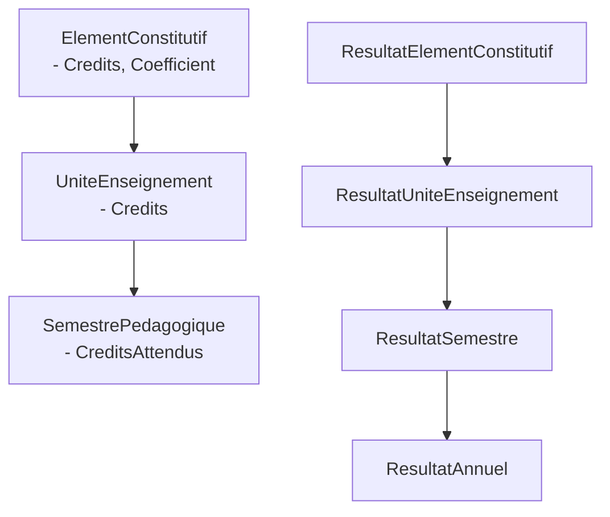
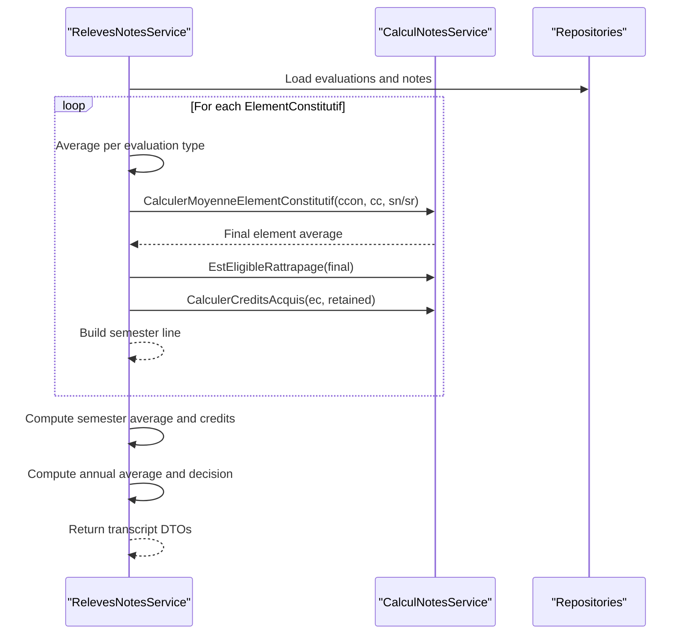
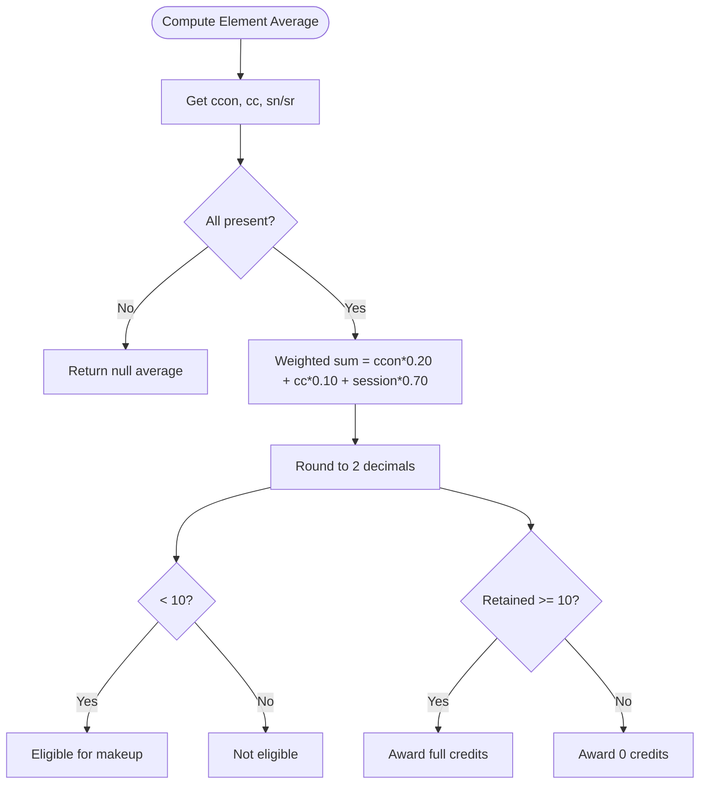
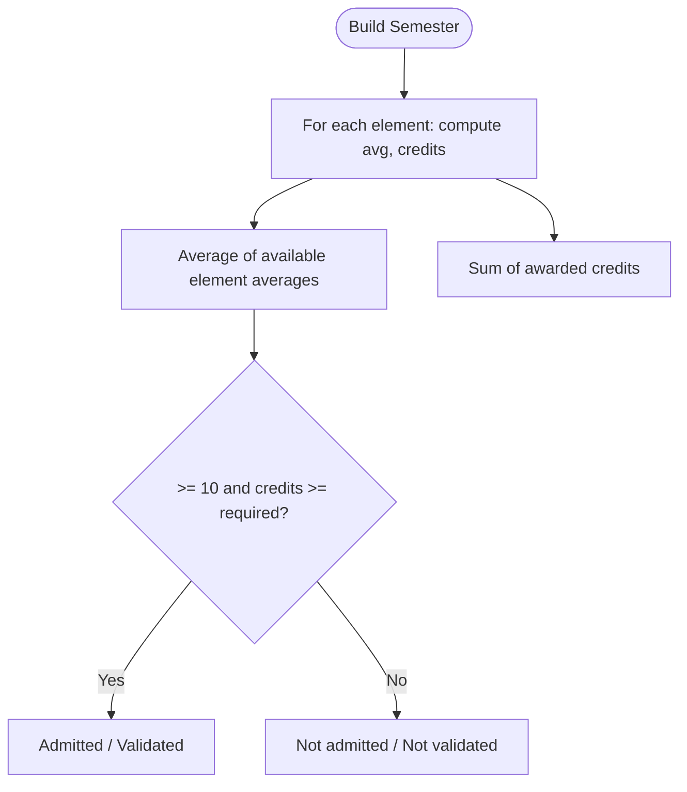
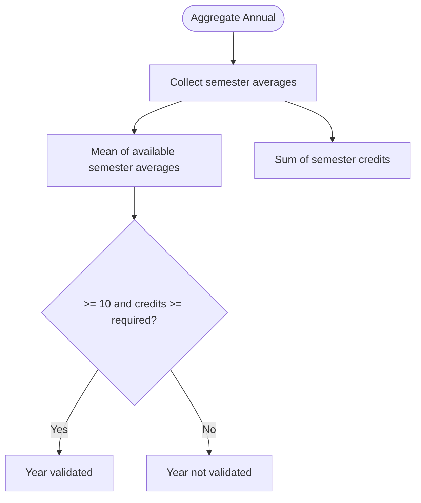
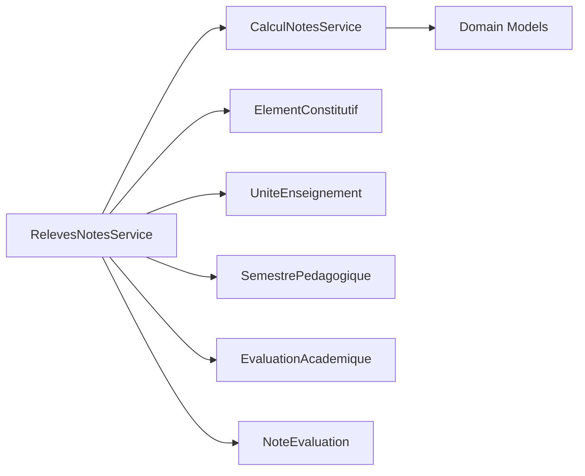

# Result Aggregation

<cite>
**Referenced Files in This Document**
- [ResultatElementConstitutif.cs](file://RIIS.Academic.Domain/Notes/ResultatElementConstitutif.cs)
- [ResultatUniteEnseignement.cs](file://RIIS.Academic.Domain/Notes/ResultatUniteEnseignement.cs)
- [ResultatSemestre.cs](file://RIIS.Academic.Domain/Notes/ResultatSemestre.cs)
- [ResultatAnnuel.cs](file://RIIS.Academic.Domain/Notes/ResultatAnnuel.cs)
- [CalculNotesService.cs](file://RIIS.Academic.Application/Notes/Services/CalculNotesService.cs)
- [RelevesNotesService.cs](file://RIIS.Academic.Application/Releves/Services/RelevesNotesService.cs)
- [ElementConstitutif.cs](file://RIIS.Academic.Domain/Programmes/ElementConstitutif.cs)
- [UniteEnseignement.cs](file://RIIS.Academic.Domain/Programmes/UniteEnseignement.cs)
- [SemestrePedagogique.cs](file://RIIS.Academic.Domain/Programmes/SemestrePedagogique.cs)
- [DecisionAcademique.cs](file://RIIS.Academic.Domain/Enums/DecisionAcademique.cs)
- [StatutValidationAcademique.cs](file://RIIS.Academic.Domain/Enums/StatutValidationAcademique.cs)
</cite>

## Table of Contents
1. [Introduction](#introduction)
2. [Project Structure](#project-structure)
3. [Core Components](#core-components)
4. [Architecture Overview](#architecture-overview)
5. [Detailed Component Analysis](#detailed-component-analysis)
6. [Dependency Analysis](#dependency-analysis)
7. [Performance Considerations](#performance-considerations)
8. [Troubleshooting Guide](#troubleshooting-guide)
9. [Conclusion](#conclusion)

## Introduction
This document explains the hierarchical result calculation system that aggregates individual assessment scores into constituent element results, unit results, semester totals, and annual totals. It details the aggregation algorithms, weighting systems, academic standing calculations, validation rules, and the cascading effects when grades change at any level. It also provides example scenarios to illustrate how aggregated results drive academic decisions.

## Project Structure
The result hierarchy is modeled by domain entities and computed via application services:
- Constituent Element (lowest level): per-element averages and credits
- Unit (aggregates elements within a semester)
- Semester (aggregates units and computes semester average and credits)
- Annual (aggregates semesters for an academic year)

**Diagram sources**
- [ElementConstitutif.cs:1-21](file://RIIS.Academic.Domain/Programmes/ElementConstitutif.cs#L1-L21)
- [UniteEnseignement.cs:1-18](file://RIIS.Academic.Domain/Programmes/UniteEnseignement.cs#L1-L18)
- [SemestrePedagogique.cs:1-20](file://RIIS.Academic.Domain/Programmes/SemestrePedagogique.cs#L1-L20)
- [ResultatElementConstitutif.cs:1-23](file://RIIS.Academic.Domain/Notes/ResultatElementConstitutif.cs#L1-L23)
- [ResultatUniteEnseignement.cs:1-17](file://RIIS.Academic.Domain/Notes/ResultatUniteEnseignement.cs#L1-L17)
- [ResultatSemestre.cs:1-23](file://RIIS.Academic.Domain/Notes/ResultatSemestre.cs#L1-L23)
- [ResultatAnnuel.cs:1-21](file://RIIS.Academic.Domain/Notes/ResultatAnnuel.cs#L1-L21)

**Section sources**
- [ElementConstitutif.cs:1-21](file://RIIS.Academic.Domain/Programmes/ElementConstitutif.cs#L1-L21)
- [UniteEnseignement.cs:1-18](file://RIIS.Academic.Domain/Programmes/UniteEnseignement.cs#L1-L18)
- [SemestrePedagogique.cs:1-20](file://RIIS.Academic.Domain/Programmes/SemestrePedagogique.cs#L1-L20)
- [ResultatElementConstitutif.cs:1-23](file://RIIS.Academic.Domain/Notes/ResultatElementConstitutif.cs#L1-L23)
- [ResultatUniteEnseignement.cs:1-17](file://RIIS.Academic.Domain/Notes/ResultatUniteEnseignement.cs#L1-L17)
- [ResultatSemestre.cs:1-23](file://RIIS.Academic.Domain/Notes/ResultatSemestre.cs#L1-L23)
- [ResultatAnnuel.cs:1-21](file://RIIS.Academic.Domain/Notes/ResultatAnnuel.cs#L1-L21)

## Core Components
- Constituent element result: stores multiple assessment averages (continuous control, knowledge control, normal session, makeup session), derived retained average, eligibility for makeup, and acquired credits.
- Unit result: stores unit-level average, acquired vs expected credits, and validation status.
- Semester result: stores type-specific averages, semester average, acquired vs required credits, rank, validation status, and jury decision.
- Annual result: stores annual average, acquired vs required credits, rank, validation status, and jury decision.
- Calculation service: implements weighted averaging for constituent elements, makeup eligibility, and credit acquisition logic.
- Transcript generation service: computes per-type averages from assessments and notes, builds semester lines, semester averages, annual average, mentions, and final decisions.

Key behaviors:
- Weighted average for constituent element uses fixed weights across three components.
- Makeup eligibility is determined by a threshold on the final element average.
- Credits are awarded only if the retained average meets or exceeds the passing threshold.
- Semester and annual averages are simple arithmetic means of available sub-averages.
- Academic decisions combine average thresholds with credit attainment.

**Section sources**
- [ResultatElementConstitutif.cs:1-23](file://RIIS.Academic.Domain/Notes/ResultatElementConstitutif.cs#L1-L23)
- [ResultatUniteEnseignement.cs:1-17](file://RIIS.Academic.Domain/Notes/ResultatUniteEnseignement.cs#L1-L17)
- [ResultatSemestre.cs:1-23](file://RIIS.Academic.Domain/Notes/ResultatSemestre.cs#L1-L23)
- [ResultatAnnuel.cs:1-21](file://RIIS.Academic.Domain/Notes/ResultatAnnuel.cs#L1-L21)
- [CalculNotesService.cs:1-25](file://RIIS.Academic.Application/Notes/Services/CalculNotesService.cs#L1-L25)
- [RelevesNotesService.cs:202-377](file://RIIS.Academic.Application/Releves/Services/RelevesNotesService.cs#L202-L377)

## Architecture Overview
The computation flows from raw assessment notes up through the hierarchy:

**Diagram sources**
- [RelevesNotesService.cs:202-377](file://RIIS.Academic.Application/Releves/Services/RelevesNotesService.cs#L202-L377)
- [CalculNotesService.cs:1-25](file://RIIS.Academic.Application/Notes/Services/CalculNotesService.cs#L1-L25)

## Detailed Component Analysis

### Constituent Element Results
- Inputs:
  - Continuous control average (type-based)
  - Knowledge control average (type-based)
  - Session average (normal or makeup, whichever exists)
- Algorithm:
  - Weighted average combines the three inputs using fixed weights.
  - Retained average selects the best applicable session (makeup preferred if present).
  - Makeup eligibility is true when the final average is below the passing threshold.
  - Credits are awarded based on the retained average against the passing threshold.
- Validation:
  - If any input average is missing, the final average is null.
  - Credits are zero when the retained average does not meet the threshold.

**Diagram sources**
- [CalculNotesService.cs:9-24](file://RIIS.Academic.Application/Notes/Services/CalculNotesService.cs#L9-L24)

**Section sources**
- [CalculNotesService.cs:9-24](file://RIIS.Academic.Application/Notes/Services/CalculNotesService.cs#L9-L24)
- [ResultatElementConstitutif.cs:1-23](file://RIIS.Academic.Domain/Notes/ResultatElementConstitutif.cs#L1-L23)

### Unit Results
- Purpose: Aggregate constituent element outcomes within a unit.
- Fields include unit average, acquired vs expected credits, and validation status.
- The current codebase defines the model; aggregation typically sums element credits and may compute a unit average based on element contributions.

**Section sources**
- [ResultatUniteEnseignement.cs:1-17](file://RIIS.Academic.Domain/Notes/ResultatUniteEnseignement.cs#L1-L17)
- [ElementConstitutif.cs:1-21](file://RIIS.Academic.Domain/Programmes/ElementConstitutif.cs#L1-L21)

### Semester Results
- Computation:
  - Per-element lines are built with final average, decision, and credits.
  - Semester average is the arithmetic mean of available element averages.
  - Semester credits are the sum of awarded element credits.
  - Rank is stored for cohort comparison.
  - Validation status and jury decision are maintained.
- Decision logic:
  - In transcript generation, final admission decision considers both average and credits relative to requirements.

**Diagram sources**
- [RelevesNotesService.cs:202-267](file://RIIS.Academic.Application/Releves/Services/RelevesNotesService.cs#L202-L267)
- [ResultatSemestre.cs:1-23](file://RIIS.Academic.Domain/Notes/ResultatSemestre.cs#L1-L23)

**Section sources**
- [RelevesNotesService.cs:202-267](file://RIIS.Academic.Application/Releves/Services/RelevesNotesService.cs#L202-L267)
- [ResultatSemestre.cs:1-23](file://RIIS.Academic.Domain/Notes/ResultatSemestre.cs#L1-L23)

### Annual Results
- Computation:
  - Annual average is the arithmetic mean of available semester averages.
  - Annual credits are the sum of semester credits.
  - Required credits default to a standard value per level/year.
  - Rank and validation status/jury decision are maintained.
- Decision logic:
  - Admission requires meeting both average and credit thresholds.

**Diagram sources**
- [RelevesNotesService.cs:325-333](file://RIIS.Academic.Application/Releves/Services/RelevesNotesService.cs#L325-L333)
- [ResultatAnnuel.cs:1-21](file://RIIS.Academic.Domain/Notes/ResultatAnnuel.cs#L1-L21)

**Section sources**
- [RelevesNotesService.cs:325-333](file://RIIS.Academic.Application/Releves/Services/RelevesNotesService.cs#L325-L333)
- [ResultatAnnuel.cs:1-21](file://RIIS.Academic.Domain/Notes/ResultatAnnuel.cs#L1-L21)

### Academic Standing and Decisions
- Enums define possible states:
  - Validation status tracks whether a result has been calculated and its outcome.
  - Jury decision captures the formal outcome (e.g., validated, allowed makeup, deferred).
- Transcript logic applies thresholds to determine admission/failure at the annual level.

**Section sources**
- [DecisionAcademique.cs:1-10](file://RIIS.Academic.Domain/Enums/DecisionAcademique.cs#L1-L10)
- [StatutValidationAcademique.cs:1-10](file://RIIS.Academic.Domain/Enums/StatutValidationAcademique.cs#L1-L10)
- [RelevesNotesService.cs:175-181](file://RIIS.Academic.Application/Releves/Services/RelevesNotesService.cs#L175-L181)

## Dependency Analysis
- RelevesNotesService depends on repositories for all programmatic entities and on ICalculNotesService for core math.
- CalculNotesService encapsulates pure functions for averaging, eligibility, and credit awarding.
- Domain models provide structure and constraints for results and program hierarchy.

**Diagram sources**
- [RelevesNotesService.cs:8-24](file://RIIS.Academic.Application/Releves/Services/RelevesNotesService.cs#L8-L24)
- [CalculNotesService.cs:1-25](file://RIIS.Academic.Application/Notes/Services/CalculNotesService.cs#L1-L25)

**Section sources**
- [RelevesNotesService.cs:8-24](file://RIIS.Academic.Application/Releves/Services/RelevesNotesService.cs#L8-L24)
- [CalculNotesService.cs:1-25](file://RIIS.Academic.Application/Notes/Services/CalculNotesService.cs#L1-L25)

## Performance Considerations
- Averaging per evaluation type filters by year, element, and type before aggregating notes, minimizing data scanned.
- Using sets for evaluation IDs improves lookup performance during note filtering.
- Truncation to two decimals avoids floating-point drift and ensures consistent rounding behavior.
- Semester and annual averages are computed over already filtered lists, keeping complexity linear in the number of relevant assessments.

[No sources needed since this section provides general guidance]

## Troubleshooting Guide
Common issues and checks:
- Missing averages: If any component average is null, the final element average will be null. Verify presence of assessments and notes for each type.
- Makeup selection: Ensure the makeup session average is used when present; otherwise fall back to the normal session.
- Credit awarding: Confirm that the retained average meets or exceeds the passing threshold to award credits.
- Semester average: Only non-null element averages contribute to the semester average; ensure at least one valid average exists.
- Annual average: Requires at least one semester average; otherwise it remains null.
- Decision logic: Validate both average and credits against thresholds for admission decisions.

**Section sources**
- [CalculNotesService.cs:9-24](file://RIIS.Academic.Application/Notes/Services/CalculNotesService.cs#L9-L24)
- [RelevesNotesService.cs:290-333](file://RIIS.Academic.Application/Releves/Services/RelevesNotesService.cs#L290-L333)
- [RelevesNotesService.cs:175-181](file://RIIS.Academic.Application/Releves/Services/RelevesNotesService.cs#L175-L181)

## Conclusion
The system computes results hierarchically:
- Constituent element: weighted average of continuous, knowledge, and session scores; determines makeup eligibility and credits.
- Unit: aggregates element outcomes.
- Semester: averages element results and sums credits; supports ranking and validation state.
- Annual: averages semester results and sums credits; drives admission decisions based on thresholds.

Validation rules ensure integrity at each step, and changes cascade upward: updating a constituent element score can alter element credits, semester totals, and ultimately annual decisions. The provided algorithms and enums define clear, deterministic behavior for academic standing and outcomes.