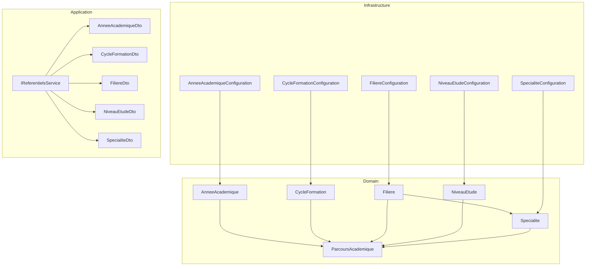
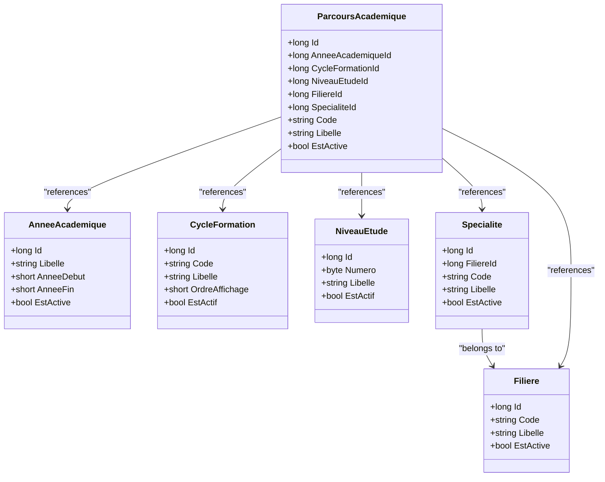
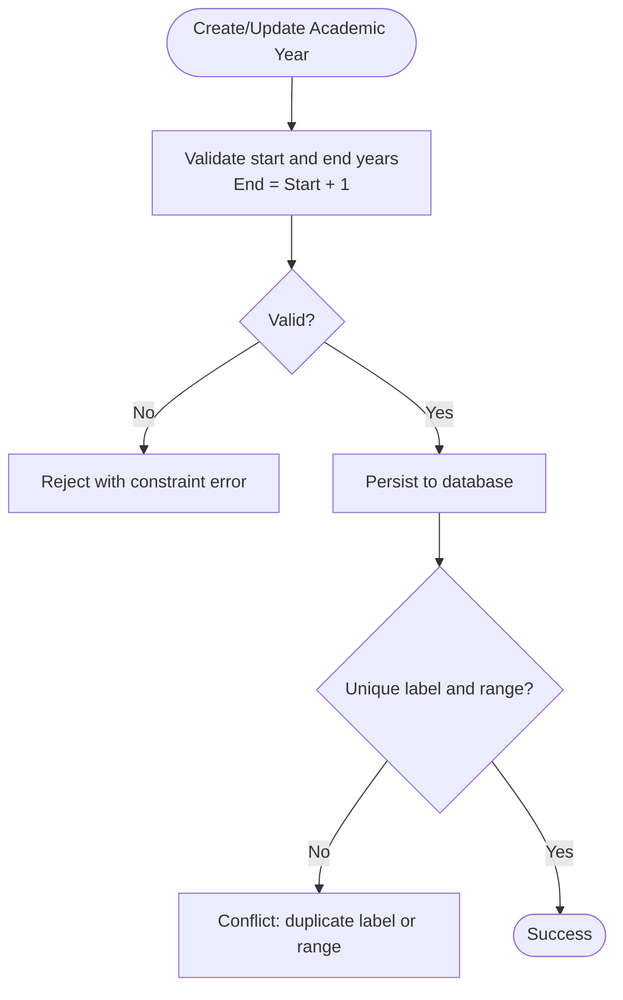
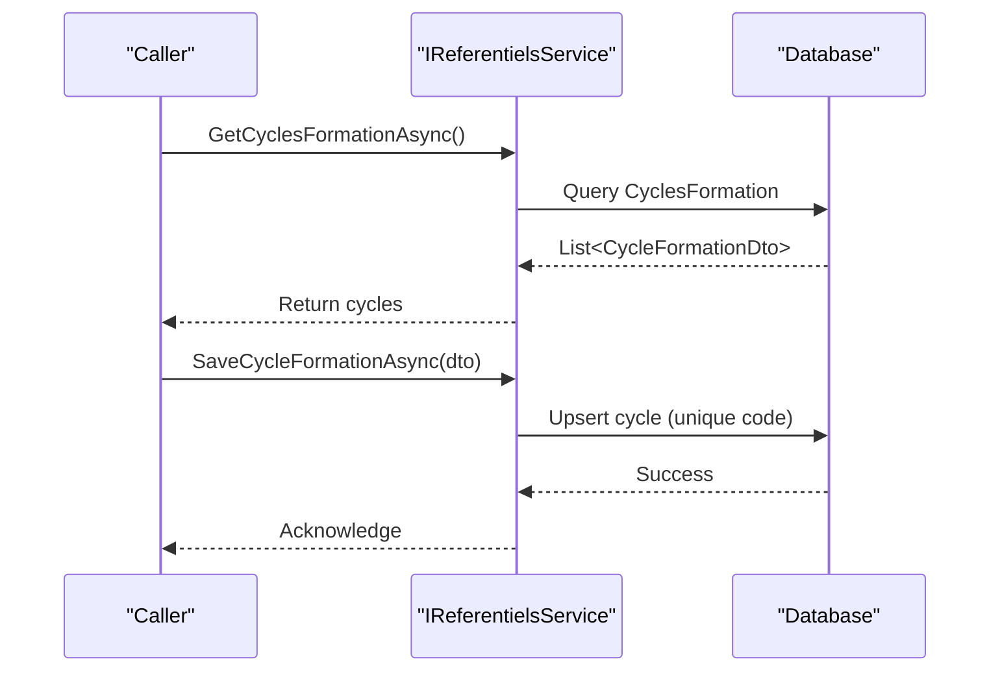
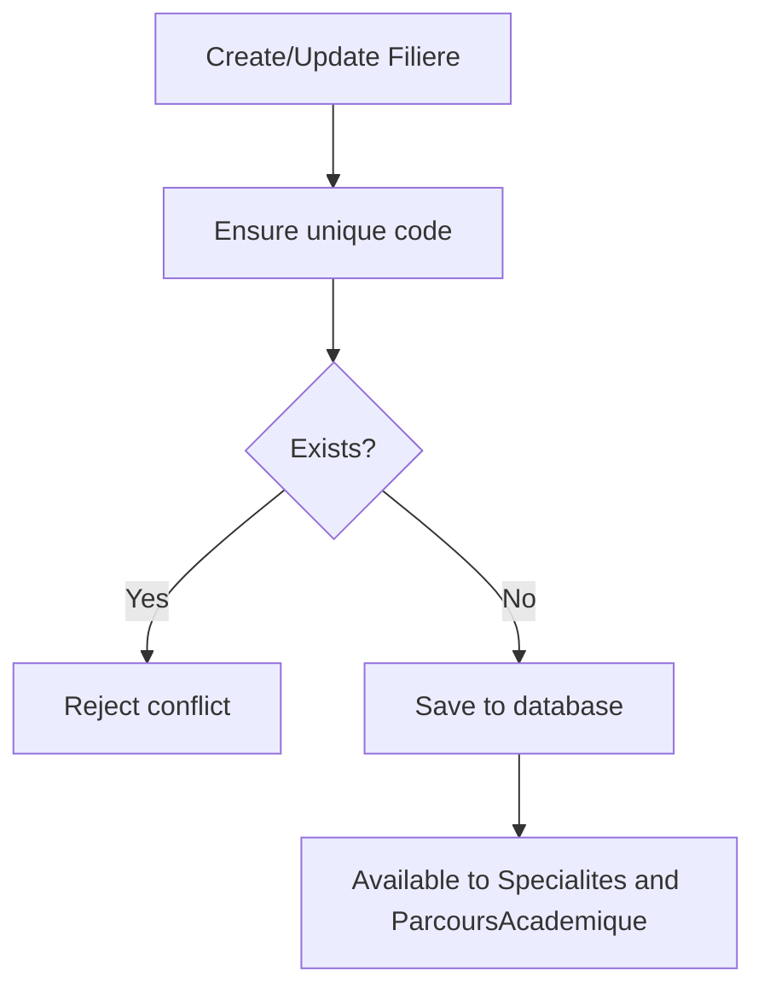
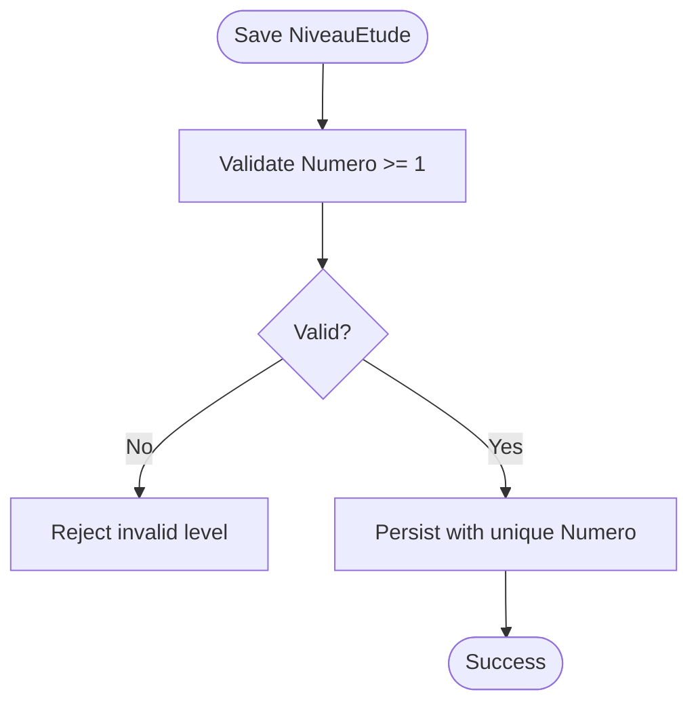
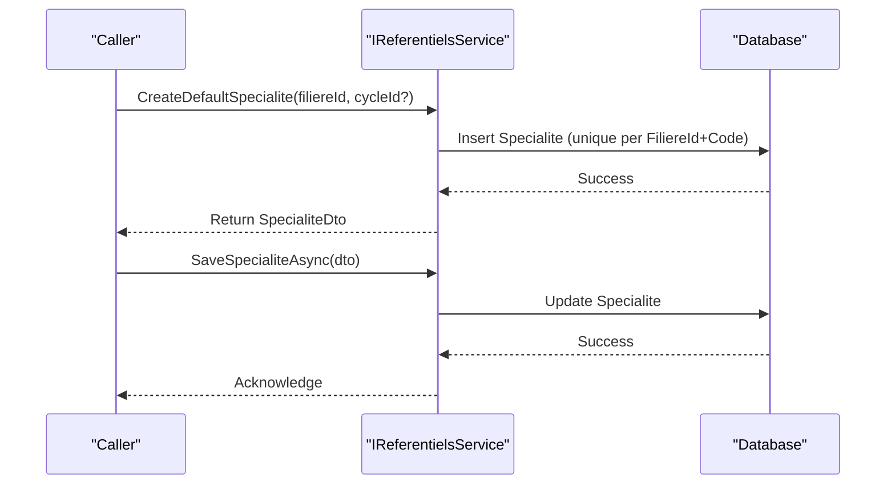
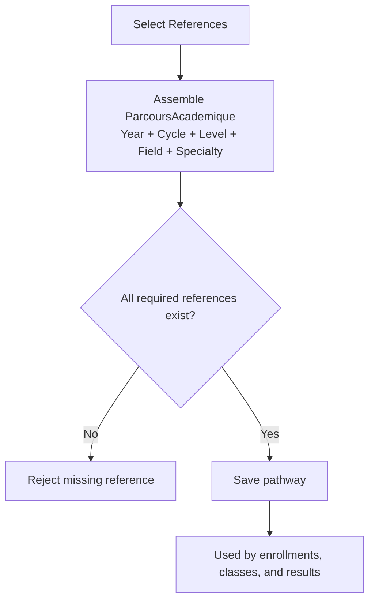
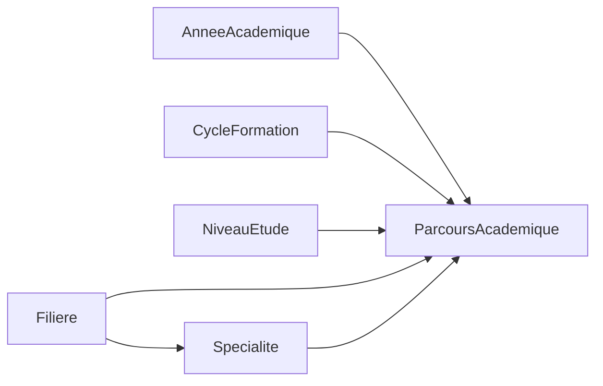

# Reference Data

<cite>
**Referenced Files in This Document**
- [AnneeAcademique.cs](file://RIIS.Academic.Domain/Referentiels/AnneeAcademique.cs)
- [CycleFormation.cs](file://RIIS.Academic.Domain/Referentiels/CycleFormation.cs)
- [Filiere.cs](file://RIIS.Academic.Domain/Referentiels/Filiere.cs)
- [NiveauEtude.cs](file://RIIS.Academic.Domain/Referentiels/NiveauEtude.cs)
- [Specialite.cs](file://RIIS.Academic.Domain/Referentiels/Specialite.cs)
- [ParcoursAcademique.cs](file://RIIS.Academic.Domain/Parcours/ParcoursAcademique.cs)
- [AnneeAcademiqueConfiguration.cs](file://RIIS.Academic.Infrastructure/Persistence/Configurations/Referentiels/AnneeAcademiqueConfiguration.cs)
- [CycleFormationConfiguration.cs](file://RIIS.Academic.Infrastructure/Persistence/Configurations/Referentiels/CycleFormationConfiguration.cs)
- [FiliereConfiguration.cs](file://RIIS.Academic.Infrastructure/Persistence/Configurations/Referentiels/FiliereConfiguration.cs)
- [NiveauEtudeConfiguration.cs](file://RIIS.Academic.Infrastructure/Persistence/Configurations/Referentiels/NiveauEtudeConfiguration.cs)
- [SpecialiteConfiguration.cs](file://RIIS.Academic.Infrastructure/Persistence/Configurations/Referentiels/SpecialiteConfiguration.cs)
- [IReferentielsService.cs](file://RIIS.Academic.Application/Referentiels/Services/IReferentielsService.cs)
- [AnneeAcademiqueDto.cs](file://RIIS.Academic.Application/Referentiels/Dtos/AnneeAcademiqueDto.cs)
- [CycleFormationDto.cs](file://RIIS.Academic.Application/Referentiels/Dtos/CycleFormationDto.cs)
- [FiliereDto.cs](file://RIIS.Academic.Application/Referentiels/Dtos/FiliereDto.cs)
- [NiveauEtudeDto.cs](file://RIIS.Academic.Application/Referentiels/Dtos/NiveauEtudeDto.cs)
- [SpecialiteDto.cs](file://RIIS.Academic.Application/Referentiels/Dtos/SpecialiteDto.cs)
</cite>

## Table of Contents
1. Introduction
2. Project Structure
3. Core Components
4. Architecture Overview
5. Detailed Component Analysis
6. Dependency Analysis
7. Performance Considerations
8. Troubleshooting Guide
9. Conclusion

## Introduction
This document describes the reference data entities that provide master data for the academic system. It focuses on:
- Academic year management (AnneeAcademique)
- Education cycles (CycleFormation)
- Fields of study (Filiere)
- Study levels (NiveauEtude)
- Specializations (Specialite)

It explains how these entities form a hierarchical foundation for academic programs, outlines validation rules and constraints enforced at the database level, and provides usage patterns via the application service layer.

## Project Structure
The reference data spans three layers:
- Domain models define entities and relationships
- Infrastructure configurations enforce schema-level constraints and indexes
- Application services expose CRUD operations and lookups through DTOs

**Diagram sources**
- [AnneeAcademique.cs:1-15](file://RIIS.Academic.Domain/Referentiels/AnneeAcademique.cs#L1-L15)
- [CycleFormation.cs:1-13](file://RIIS.Academic.Domain/Referentiels/CycleFormation.cs#L1-L13)
- [Filiere.cs:1-13](file://RIIS.Academic.Domain/Referentiels/Filiere.cs#L1-L13)
- [NiveauEtude.cs:1-14](file://RIIS.Academic.Domain/Referentiels/NiveauEtude.cs#L1-L14)
- [Specialite.cs:1-14](file://RIIS.Academic.Domain/Referentiels/Specialite.cs#L1-L14)
- [ParcoursAcademique.cs:1-24](file://RIIS.Academic.Domain/Parcours/ParcoursAcademique.cs#L1-L24)
- [AnneeAcademiqueConfiguration.cs:1-18](file://RIIS.Academic.Infrastructure/Persistence/Configurations/Referentiels/AnneeAcademiqueConfiguration.cs#L1-L18)
- [CycleFormationConfiguration.cs:1-23](file://RIIS.Academic.Infrastructure/Persistence/Configurations/Referentiels/CycleFormationConfiguration.cs#L1-L23)
- [FiliereConfiguration.cs:1-17](file://RIIS.Academic.Infrastructure/Persistence/Configurations/Referentiels/FiliereConfiguration.cs#L1-L17)
- [NiveauEtudeConfiguration.cs:1-23](file://RIIS.Academic.Infrastructure/Persistence/Configurations/Referentiels/NiveauEtudeConfiguration.cs#L1-L23)
- [SpecialiteConfiguration.cs:1-21](file://RIIS.Academic.Infrastructure/Persistence/Configurations/Referentiels/SpecialiteConfiguration.cs#L1-L21)
- [IReferentielsService.cs:1-46](file://RIIS.Academic.Application/Referentiels/Services/IReferentielsService.cs#L1-L46)
- [AnneeAcademiqueDto.cs:1-11](file://RIIS.Academic.Application/Referentiels/Dtos/AnneeAcademiqueDto.cs#L1-L11)
- [CycleFormationDto.cs:1-11](file://RIIS.Academic.Application/Referentiels/Dtos/CycleFormationDto.cs#L1-L11)
- [FiliereDto.cs:1-10](file://RIIS.Academic.Application/Referentiels/Dtos/FiliereDto.cs#L1-L10)
- [NiveauEtudeDto.cs:1-10](file://RIIS.Academic.Application/Referentiels/Dtos/NiveauEtudeDto.cs#L1-L10)
- [SpecialiteDto.cs:1-13](file://RIIS.Academic.Application/Referentiels/Dtos/SpecialiteDto.cs#L1-L13)

**Section sources**
- [AnneeAcademique.cs:1-15](file://RIIS.Academic.Domain/Referentiels/AnneeAcademique.cs#L1-L15)
- [CycleFormation.cs:1-13](file://RIIS.Academic.Domain/Referentiels/CycleFormation.cs#L1-L13)
- [Filiere.cs:1-13](file://RIIS.Academic.Domain/Referentiels/Filiere.cs#L1-L13)
- [NiveauEtude.cs:1-14](file://RIIS.Academic.Domain/Referentiels/NiveauEtude.cs#L1-L14)
- [Specialite.cs:1-14](file://RIIS.Academic.Domain/Referentiels/Specialite.cs#L1-L14)
- [ParcoursAcademique.cs:1-24](file://RIIS.Academic.Domain/Parcours/ParcoursAcademique.cs#L1-L24)
- [AnneeAcademiqueConfiguration.cs:1-18](file://RIIS.Academic.Infrastructure/Persistence/Configurations/Referentiels/AnneeAcademiqueConfiguration.cs#L1-L18)
- [CycleFormationConfiguration.cs:1-23](file://RIIS.Academic.Infrastructure/Persistence/Configurations/Referentiels/CycleFormationConfiguration.cs#L1-L23)
- [FiliereConfiguration.cs:1-17](file://RIIS.Academic.Infrastructure/Persistence/Configurations/Referentiels/FiliereConfiguration.cs#L1-L17)
- [NiveauEtudeConfiguration.cs:1-23](file://RIIS.Academic.Infrastructure/Persistence/Configurations/Referentiels/NiveauEtudeConfiguration.cs#L1-L23)
- [SpecialiteConfiguration.cs:1-21](file://RIIS.Academic.Infrastructure/Persistence/Configurations/Referentiels/SpecialiteConfiguration.cs#L1-L21)
- [IReferentielsService.cs:1-46](file://RIIS.Academic.Application/Referentiels/Services/IReferentielsService.cs#L1-L46)

## Core Components
- AnneeAcademique: Represents an academic year with start/end years and active status; linked to academic pathways, classes, and enrollments.
- CycleFormation: Defines education cycles (e.g., preparatory, BTS, licence, master) with display order and active flag.
- Filiere: Field of study with code and label; parent to specializations and used in academic pathways.
- NiveauEtude: Study level with numeric ordering and label; used in pathways, enrollments, and semesters.
- Specialite: Specialization within a field of study; unique per field by code.
- ParcoursAcademique: Aggregates references to all above to define a concrete academic program for a given academic year.

Key relationships:
- Specialite belongs to Filiere.
- ParcoursAcademique references AnneeAcademique, CycleFormation, NiveauEtude, Filiere, and Specialite.

Usage patterns:
- IReferentielsService exposes methods to list, create defaults, save, and delete each reference entity.
- DTOs are used to transfer data between layers.

**Section sources**
- [AnneeAcademique.cs:1-15](file://RIIS.Academic.Domain/Referentiels/AnneeAcademique.cs#L1-L15)
- [CycleFormation.cs:1-13](file://RIIS.Academic.Domain/Referentiels/CycleFormation.cs#L1-L13)
- [Filiere.cs:1-13](file://RIIS.Academic.Domain/Referentiels/Filiere.cs#L1-L13)
- [NiveauEtude.cs:1-14](file://RIIS.Academic.Domain/Referentiels/NiveauEtude.cs#L1-L14)
- [Specialite.cs:1-14](file://RIIS.Academic.Domain/Referentiels/Specialite.cs#L1-L14)
- [ParcoursAcademique.cs:1-24](file://RIIS.Academic.Domain/Parcours/ParcoursAcademique.cs#L1-L24)
- [IReferentielsService.cs:1-46](file://RIIS.Academic.Application/Referentiels/Services/IReferentielsService.cs#L1-L46)

## Architecture Overview
Reference data is modeled in the domain, constrained in infrastructure, and consumed via application services. The following diagram shows the core hierarchy and how ParcoursAcademique composes them into actionable academic programs.

**Diagram sources**
- [AnneeAcademique.cs:1-15](file://RIIS.Academic.Domain/Referentiels/AnneeAcademique.cs#L1-L15)
- [CycleFormation.cs:1-13](file://RIIS.Academic.Domain/Referentiels/CycleFormation.cs#L1-L13)
- [NiveauEtude.cs:1-14](file://RIIS.Academic.Domain/Referentiels/NiveauEtude.cs#L1-L14)
- [Filiere.cs:1-13](file://RIIS.Academic.Domain/Referentiels/Filiere.cs#L1-L13)
- [Specialite.cs:1-14](file://RIIS.Academic.Domain/Referentiels/Specialite.cs#L1-L14)
- [ParcoursAcademique.cs:1-24](file://RIIS.Academic.Domain/Parcours/ParcoursAcademique.cs#L1-L24)

## Detailed Component Analysis

### AnneeAcademique (Academic Year)
- Purpose: Define a two-year academic period and whether it is currently active.
- Key fields: Label, start year, end year, active flag; collections link to pathways, classes, and enrollments.
- Validation and constraints:
  - End year must equal start year plus one (check constraint).
  - Unique index on label and on the pair (start year, end year).
- Typical usage:
  - Create default or custom academic years via service.
  - Save and delete as needed; ensure uniqueness and valid ranges.

**Diagram sources**
- [AnneeAcademiqueConfiguration.cs:1-18](file://RIIS.Academic.Infrastructure/Persistence/Configurations/Referentiels/AnneeAcademiqueConfiguration.cs#L1-L18)
- [AnneeAcademique.cs:1-15](file://RIIS.Academic.Domain/Referentiels/AnneeAcademique.cs#L1-L15)

**Section sources**
- [AnneeAcademique.cs:1-15](file://RIIS.Academic.Domain/Referentiels/AnneeAcademique.cs#L1-L15)
- [AnneeAcademiqueConfiguration.cs:1-18](file://RIIS.Academic.Infrastructure/Persistence/Configurations/Referentiels/AnneeAcademiqueConfiguration.cs#L1-L18)
- [AnneeAcademiqueDto.cs:1-11](file://RIIS.Academic.Application/Referentiels/Dtos/AnneeAcademiqueDto.cs#L1-L11)
- [IReferentielsService.cs:1-46](file://RIIS.Academic.Application/Referentiels/Services/IReferentielsService.cs#L1-L46)

### CycleFormation (Education Cycle)
- Purpose: Model education cycles with a short code, descriptive label, display order, and active status.
- Seed data: Includes common cycles such as preparatory, BTS, licence, master.
- Validation and constraints:
  - Unique index on code.
- Typical usage:
  - List available cycles, create defaults, save changes, delete when appropriate.

**Diagram sources**
- [CycleFormationConfiguration.cs:1-23](file://RIIS.Academic.Infrastructure/Persistence/Configurations/Referentiels/CycleFormationConfiguration.cs#L1-L23)
- [CycleFormation.cs:1-13](file://RIIS.Academic.Domain/Referentiels/CycleFormation.cs#L1-L13)
- [CycleFormationDto.cs:1-11](file://RIIS.Academic.Application/Referentiels/Dtos/CycleFormationDto.cs#L1-L11)
- [IReferentielsService.cs:1-46](file://RIIS.Academic.Application/Referentiels/Services/IReferentielsService.cs#L1-L46)

**Section sources**
- [CycleFormation.cs:1-13](file://RIIS.Academic.Domain/Referentiels/CycleFormation.cs#L1-L13)
- [CycleFormationConfiguration.cs:1-23](file://RIIS.Academic.Infrastructure/Persistence/Configurations/Referentiels/CycleFormationConfiguration.cs#L1-L23)
- [CycleFormationDto.cs:1-11](file://RIIS.Academic.Application/Referentiels/Dtos/CycleFormationDto.cs#L1-L11)
- [IReferentielsService.cs:1-46](file://RIIS.Academic.Application/Referentiels/Services/IReferentielsService.cs#L1-L46)

### Filiere (Field of Study)
- Purpose: Define a field of study with a unique code and label; can be active/inactive.
- Relationships: Parent to Specialite; referenced by ParcoursAcademique.
- Validation and constraints:
  - Unique index on code.
- Typical usage:
  - Manage fields of study via service; create defaults and persist changes.

**Diagram sources**
- [FiliereConfiguration.cs:1-17](file://RIIS.Academic.Infrastructure/Persistence/Configurations/Referentiels/FiliereConfiguration.cs#L1-L17)
- [Filiere.cs:1-13](file://RIIS.Academic.Domain/Referentiels/Filiere.cs#L1-L13)
- [FiliereDto.cs:1-10](file://RIIS.Academic.Application/Referentiels/Dtos/FiliereDto.cs#L1-L10)
- [IReferentielsService.cs:1-46](file://RIIS.Academic.Application/Referentiels/Services/IReferentielsService.cs#L1-L46)

**Section sources**
- [Filiere.cs:1-13](file://RIIS.Academic.Domain/Referentiels/Filiere.cs#L1-L13)
- [FiliereConfiguration.cs:1-17](file://RIIS.Academic.Infrastructure/Persistence/Configurations/Referentiels/FiliereConfiguration.cs#L1-L17)
- [FiliereDto.cs:1-10](file://RIIS.Academic.Application/Referentiels/Dtos/FiliereDto.cs#L1-L10)
- [IReferentielsService.cs:1-46](file://RIIS.Academic.Application/Referentiels/Services/IReferentielsService.cs#L1-L46)

### NiveauEtude (Study Level)
- Purpose: Represent study levels with a numeric ordering and label; supports active/inactive states.
- Validation and constraints:
  - Numeric level must be greater than or equal to 1.
  - Unique index on number.
- Typical usage:
  - Retrieve levels, create defaults, save updates, and delete when necessary.

**Diagram sources**
- [NiveauEtudeConfiguration.cs:1-23](file://RIIS.Academic.Infrastructure/Persistence/Configurations/Referentiels/NiveauEtudeConfiguration.cs#L1-L23)
- [NiveauEtude.cs:1-14](file://RIIS.Academic.Domain/Referentiels/NiveauEtude.cs#L1-L14)
- [NiveauEtudeDto.cs:1-10](file://RIIS.Academic.Application/Referentiels/Dtos/NiveauEtudeDto.cs#L1-L10)
- [IReferentielsService.cs:1-46](file://RIIS.Academic.Application/Referentiels/Services/IReferentielsService.cs#L1-L46)

**Section sources**
- [NiveauEtude.cs:1-14](file://RIIS.Academic.Domain/Referentiels/NiveauEtude.cs#L1-L14)
- [NiveauEtudeConfiguration.cs:1-23](file://RIIS.Academic.Infrastructure/Persistence/Configurations/Referentiels/NiveauEtudeConfiguration.cs#L1-L23)
- [NiveauEtudeDto.cs:1-10](file://RIIS.Academic.Application/Referentiels/Dtos/NiveauEtudeDto.cs#L1-L10)
- [IReferentielsService.cs:1-46](file://RIIS.Academic.Application/Referentiels/Services/IReferentielsService.cs#L1-L46)

### Specialite (Specialization)
- Purpose: Define a specialization within a field of study; includes code, label, and active status.
- Relationships: Belongs to a specific Filiere; referenced by ParcoursAcademique.
- Validation and constraints:
  - Unique composite index on (FiliereId, Code).
  - Foreign key to Filiere with restricted delete behavior.
- Typical usage:
  - Generate codes, create defaults, save, and delete specializations.

**Diagram sources**
- [SpecialiteConfiguration.cs:1-21](file://RIIS.Academic.Infrastructure/Persistence/Configurations/Referentiels/SpecialiteConfiguration.cs#L1-L21)
- [Specialite.cs:1-14](file://RIIS.Academic.Domain/Referentiels/Specialite.cs#L1-L14)
- [SpecialiteDto.cs:1-13](file://RIIS.Academic.Application/Referentiels/Dtos/SpecialiteDto.cs#L1-L13)
- [IReferentielsService.cs:1-46](file://RIIS.Academic.Application/Referentiels/Services/IReferentielsService.cs#L1-L46)

**Section sources**
- [Specialite.cs:1-14](file://RIIS.Academic.Domain/Referentiels/Specialite.cs#L1-L14)
- [SpecialiteConfiguration.cs:1-21](file://RIIS.Academic.Infrastructure/Persistence/Configurations/Referentiels/SpecialiteConfiguration.cs#L1-L21)
- [SpecialiteDto.cs:1-13](file://RIIS.Academic.Application/Referentiels/Dtos/SpecialiteDto.cs#L1-L13)
- [IReferentielsService.cs:1-46](file://RIIS.Academic.Application/Referentiels/Services/IReferentielsService.cs#L1-L46)

### ParcoursAcademique (Academic Program Composition)
- Purpose: Compose AnneeAcademique, CycleFormation, NiveauEtude, Filiere, and Specialite into a concrete academic program for a given year.
- Usage:
  - Service methods allow filtering and saving of academic pathways across reference dimensions.

**Diagram sources**
- [ParcoursAcademique.cs:1-24](file://RIIS.Academic.Domain/Parcours/ParcoursAcademique.cs#L1-L24)
- [IReferentielsService.cs:1-46](file://RIIS.Academic.Application/Referentiels/Services/IReferentielsService.cs#L1-L46)

**Section sources**
- [ParcoursAcademique.cs:1-24](file://RIIS.Academic.Domain/Parcours/ParcoursAcademique.cs#L1-L24)
- [IReferentielsService.cs:1-46](file://RIIS.Academic.Application/Referentiels/Services/IReferentielsService.cs#L1-L46)

## Dependency Analysis
Reference entities form a clear hierarchy:
- Specialite depends on Filiere.
- ParcoursAcademique depends on all other reference entities to define a complete academic program.
- Application services coordinate creation, updates, and deletions using DTOs.

**Diagram sources**
- [Filiere.cs:1-13](file://RIIS.Academic.Domain/Referentiels/Filiere.cs#L1-L13)
- [Specialite.cs:1-14](file://RIIS.Academic.Domain/Referentiels/Specialite.cs#L1-L14)
- [ParcoursAcademique.cs:1-24](file://RIIS.Academic.Domain/Parcours/ParcoursAcademique.cs#L1-L24)

**Section sources**
- [Filiere.cs:1-13](file://RIIS.Academic.Domain/Referentiels/Filiere.cs#L1-L13)
- [Specialite.cs:1-14](file://RIIS.Academic.Domain/Referentiels/Specialite.cs#L1-L14)
- [ParcoursAcademique.cs:1-24](file://RIIS.Academic.Domain/Parcours/ParcoursAcademique.cs#L1-L24)

## Performance Considerations
- Unique indexes on keys (codes, labels, numbers) prevent duplicates and improve lookup performance.
- Composite unique constraints (e.g., Specialite by FiliereId+Code) maintain referential integrity efficiently.
- Restricting cascade deletes on Specialite avoids unintended cascading effects.
- Use service methods to filter and retrieve only needed reference data to reduce payload size.

[No sources needed since this section provides general guidance]

## Troubleshooting Guide
Common issues and resolutions:
- Duplicate academic year ranges or labels: Ensure AnneeAcademique has unique label and unique (AnneeDebut, AnneeFin); verify end year equals start year plus one.
- Invalid study level number: NivelEtude requires Numero >= 1; adjust input accordingly.
- Duplicate specialization code within a field: Specialite code must be unique per FiliereId; choose a different code or update existing record.
- Missing foreign key references: When creating ParcoursAcademique, ensure all referenced IDs exist in their respective tables.

Operational tips:
- Use service methods to create default records where applicable to speed up setup.
- Leverage lookup endpoints (e.g., active filieres) to populate dropdowns in UI.

**Section sources**
- [AnneeAcademiqueConfiguration.cs:1-18](file://RIIS.Academic.Infrastructure/Persistence/Configurations/Referentiels/AnneeAcademiqueConfiguration.cs#L1-L18)
- [NiveauEtudeConfiguration.cs:1-23](file://RIIS.Academic.Infrastructure/Persistence/Configurations/Referentiels/NiveauEtudeConfiguration.cs#L1-L23)
- [SpecialiteConfiguration.cs:1-21](file://RIIS.Academic.Infrastructure/Persistence/Configurations/Referentiels/SpecialiteConfiguration.cs#L1-L21)
- [IReferentielsService.cs:1-46](file://RIIS.Academic.Application/Referentiels/Services/IReferentielsService.cs#L1-L46)

## Conclusion
The reference data model establishes a robust foundation for academic programs by defining standardized academic years, cycles, fields of study, levels, and specializations. Constraints and indexes enforce data integrity, while the application service layer provides consistent access patterns. ParcoursAcademique ties these references together to represent concrete academic offerings, enabling downstream processes like enrollment, grading, and reporting to operate on a stable master data backbone.

[No sources needed since this section summarizes without analyzing specific files]