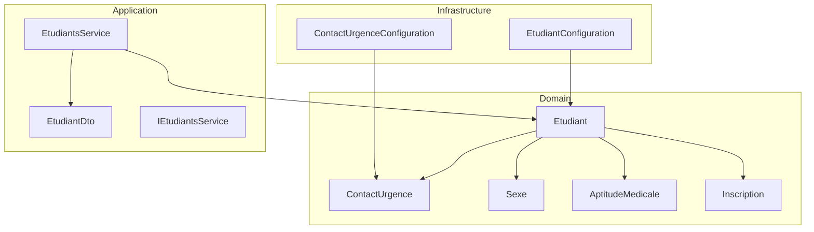
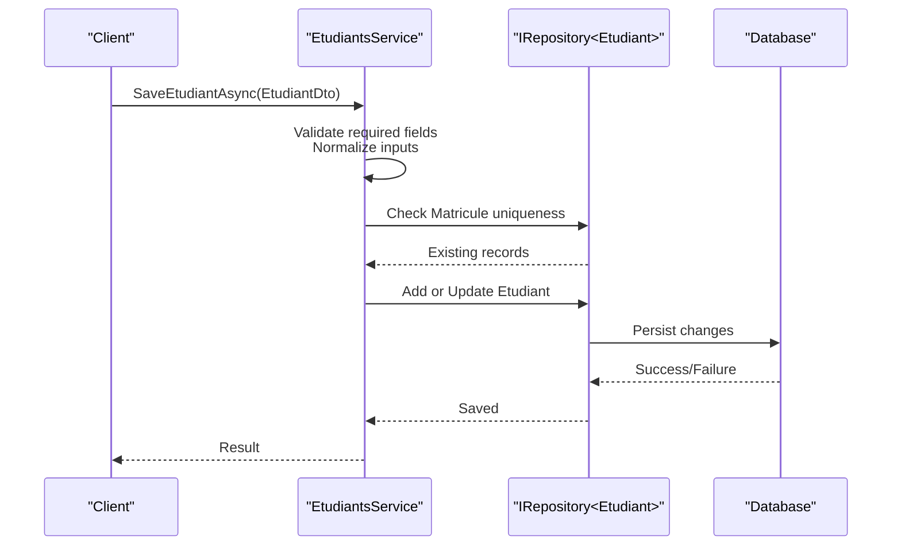
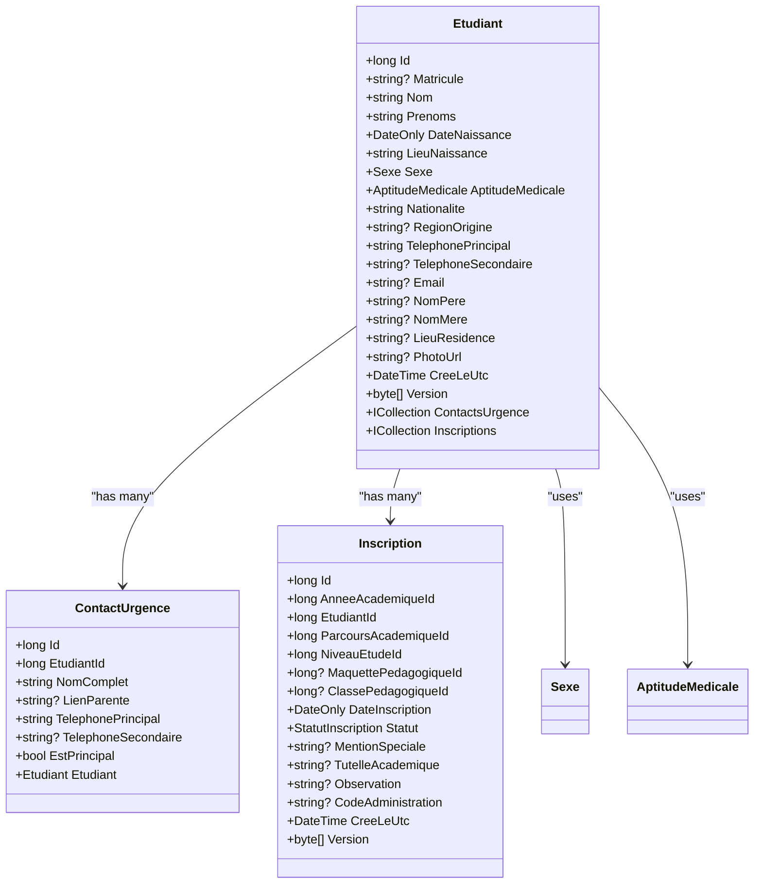
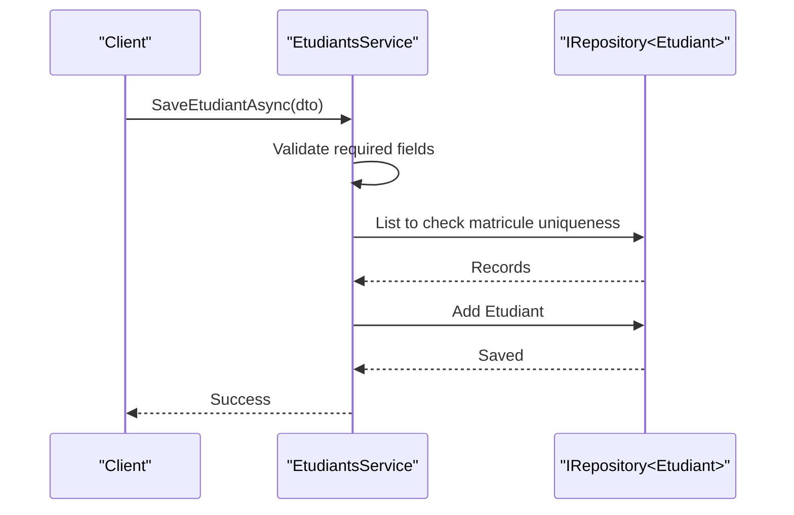
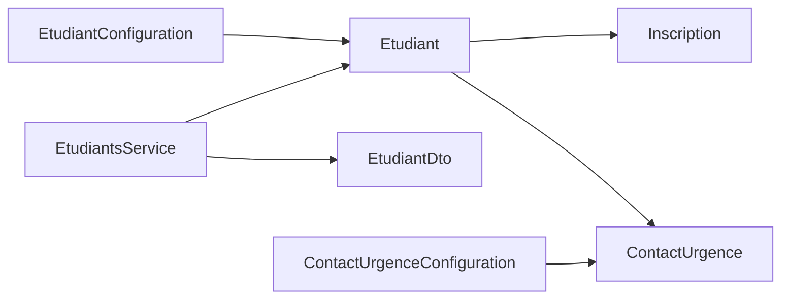

# Student Management

<cite>
**Referenced Files in This Document**
- [Etudiant.cs](file://RIIS.Academic.Domain/Etudiants/Etudiant.cs)
- [ContactUrgence.cs](file://RIIS.Academic.Domain/Etudiants/ContactUrgence.cs)
- [Sexe.cs](file://RIIS.Academic.Domain/Enums/Sexe.cs)
- [AptitudeMedicale.cs](file://RIIS.Academic.Domain/Enums/AptitudeMedicale.cs)
- [Inscription.cs](file://RIIS.Academic.Domain/Inscriptions/Inscription.cs)
- [Entity.cs](file://RIIS.Academic.Domain/Common/Entity.cs)
- [AuditableEntity.cs](file://RIIS.Academic.Domain/Common/AuditableEntity.cs)
- [EtudiantConfiguration.cs](file://RIIS.Academic.Infrastructure/Persistence/Configurations/Etudiants/EtudiantConfiguration.cs)
- [ContactUrgenceConfiguration.cs](file://RIIS.Academic.Infrastructure/Persistence/Configurations/Etudiants/ContactUrgenceConfiguration.cs)
- [IEtudiantsService.cs](file://RIIS.Academic.Application/Etudiants/Services/IEtudiantsService.cs)
- [EtudiantsService.cs](file://RIIS.Academic.Application/Etudiants/Services/EtudiantsService.cs)
- [EtudiantDto.cs](file://RIIS.Academic.Application/Etudiants/Dtos/EtudiantDto.cs)
</cite>

## Table of Contents
1. Introduction
2. Project Structure
3. Core Components
4. Architecture Overview
5. Detailed Component Analysis
6. Dependency Analysis
7. Performance Considerations
8. Troubleshooting Guide
9. Conclusion

## Introduction
This document explains the student management domain model with a focus on the Etudiant entity, its emergency contact value object ContactUrgence, and the Sexe enumeration. It covers personal information fields, contact details, academic identifiers, validation rules, business constraints, data integrity requirements, and relationships to other aggregates such as enrollments (Inscription). It also provides examples of student creation, updates, and lifecycle management scenarios using the application service layer.

## Project Structure
The student management feature spans three layers:
- Domain: defines entities, enums, and relationships (Etudiant, ContactUrgence, Sexe, AptitudeMedicale, Inscription).
- Application: orchestrates operations via services and DTOs (EtudiantsService, IEtudiantsService, EtudiantDto).
- Infrastructure: configures persistence mappings and constraints (EF Core configurations for Etudiant and ContactUrgence).

**Diagram sources**
- [Etudiant.cs:3-27](file://RIIS.Academic.Domain/Etudiants/Etudiant.cs#L3-L27)
- [ContactUrgence.cs:3-14](file://RIIS.Academic.Domain/Etudiants/ContactUrgence.cs#L3-L14)
- [Sexe.cs:3-8](file://RIIS.Academic.Domain/Enums/Sexe.cs#L3-L8)
- [AptitudeMedicale.cs:3-8](file://RIIS.Academic.Domain/Enums/AptitudeMedicale.cs#L3-L8)
- [Inscription.cs:3-36](file://RIIS.Academic.Domain/Inscriptions/Inscription.cs#L3-L36)
- [EtudiantsService.cs:7-127](file://RIIS.Academic.Application/Etudiants/Services/EtudiantsService.cs#L7-L127)
- [EtudiantConfiguration.cs:6-32](file://RIIS.Academic.Infrastructure/Persistence/Configurations/Etudiants/EtudiantConfiguration.cs#L6-L32)
- [ContactUrgenceConfiguration.cs:6-20](file://RIIS.Academic.Infrastructure/Persistence/Configurations/Etudiants/ContactUrgenceConfiguration.cs#L6-L20)

**Section sources**
- [Etudiant.cs:3-27](file://RIIS.Academic.Domain/Etudiants/Etudiant.cs#L3-L27)
- [EtudiantsService.cs:7-127](file://RIIS.Academic.Application/Etudiants/Services/EtudiantsService.cs#L7-L127)
- [EtudiantConfiguration.cs:6-32](file://RIIS.Academic.Infrastructure/Persistence/Configurations/Etudiants/EtudiantConfiguration.cs#L6-L32)
- [ContactUrgenceConfiguration.cs:6-20](file://RIIS.Academic.Infrastructure/Persistence/Configurations/Etudiants/ContactUrgenceConfiguration.cs#L6-L20)

## Core Components
- Etudiant: The central student aggregate containing personal information, contact details, academic identifiers, and relationships to emergency contacts and enrollments.
- ContactUrgence: Emergency contact value object associated with a student, including name, relationship, phone numbers, and primary flag.
- Sexe: Enumeration representing gender with values for unknown, male, and female.
- AptitudeMedicale: Medical fitness enumeration used in student records.
- Inscription: Enrollment entity linking a student to an academic year, program, level, class, and related academic results.

Key responsibilities:
- Etudiant stores identity and biographical data, maintains collections of emergency contacts and enrollments, and participates in concurrency control via row versioning.
- ContactUrgence encapsulates emergency contact details and enforces a one-to-many relationship with Etudiant.
- Sexe and AptitudeMedicale constrain permissible values for specific attributes.
- Inscription ties students to academic programs and tracks enrollment status and outcomes.

**Section sources**
- [Etudiant.cs:3-27](file://RIIS.Academic.Domain/Etudiants/Etudiant.cs#L3-L27)
- [ContactUrgence.cs:3-14](file://RIIS.Academic.Domain/Etudiants/ContactUrgence.cs#L3-L14)
- [Sexe.cs:3-8](file://RIIS.Academic.Domain/Enums/Sexe.cs#L3-L8)
- [AptitudeMedicale.cs:3-8](file://RIIS.Academic.Domain/Enums/AptitudeMedicale.cs#L3-L8)
- [Inscription.cs:3-36](file://RIIS.Academic.Domain/Inscriptions/Inscription.cs#L3-L36)

## Architecture Overview
The student management flow uses the application service to validate and persist student data while enforcing domain constraints and database-level rules.

**Diagram sources**
- [EtudiantsService.cs:53-127](file://RIIS.Academic.Application/Etudiants/Services/EtudiantsService.cs#L53-L127)
- [EtudiantConfiguration.cs:10-32](file://RIIS.Academic.Infrastructure/Persistence/Configurations/Etudiants/EtudiantConfiguration.cs#L10-L32)

## Detailed Component Analysis

### Etudiant Entity
Purpose:
- Represents a student with personal, contact, and academic identifier fields.
- Maintains relationships to emergency contacts and enrollments.
- Supports concurrency control through a row version field.

Key fields:
- Personal information: full name components, date and place of birth, nationality, region of origin, medical fitness, gender.
- Contact details: primary and secondary telephone numbers, email, residence location, photo URL.
- Academic identifiers: unique matricule (student ID).
- Relationships: collection of emergency contacts and enrollments.

Validation and constraints:
- Required fields enforced at the application layer during save operations.
- Unique matricule enforced by both application logic and a filtered unique index in the database.
- Field length limits and nullability defined in EF Core configuration.

Concurrency:
- Row versioning ensures optimistic concurrency control on updates.

**Section sources**
- [Etudiant.cs:3-27](file://RIIS.Academic.Domain/Etudiants/Etudiant.cs#L3-L27)
- [EtudiantConfiguration.cs:10-32](file://RIIS.Academic.Infrastructure/Persistence/Configurations/Etudiants/EtudiantConfiguration.cs#L10-L32)
- [EtudiantsService.cs:53-127](file://RIIS.Academic.Application/Etudiants/Services/EtudiantsService.cs#L53-L127)

#### Class Diagram: Etudiant and Related Types

**Diagram sources**
- [Etudiant.cs:3-27](file://RIIS.Academic.Domain/Etudiants/Etudiant.cs#L3-L27)
- [ContactUrgence.cs:3-14](file://RIIS.Academic.Domain/Etudiants/ContactUrgence.cs#L3-L14)
- [Inscription.cs:3-36](file://RIIS.Academic.Domain/Inscriptions/Inscription.cs#L3-L36)
- [Sexe.cs:3-8](file://RIIS.Academic.Domain/Enums/Sexe.cs#L3-L8)
- [AptitudeMedicale.cs:3-8](file://RIIS.Academic.Domain/Enums/AptitudeMedicale.cs#L3-L8)

### ContactUrgence Value Object
Purpose:
- Stores emergency contact details for a student, including full name, relationship, phone numbers, and whether it is the primary contact.

Relationships:
- Belongs to a single Etudiant via EtudiantId; deletion cascades when the student is removed.

Constraints:
- Required fields: full name and primary phone number.
- Optional fields: relationship and secondary phone number.
- Primary flag defaults to true.

Persistence:
- Configured with maximum lengths and cascade delete behavior.

**Section sources**
- [ContactUrgence.cs:3-14](file://RIIS.Academic.Domain/Etudiants/ContactUrgence.cs#L3-L14)
- [ContactUrgenceConfiguration.cs:10-20](file://RIIS.Academic.Infrastructure/Persistence/Configurations/Etudiants/ContactUrgenceConfiguration.cs#L10-L20)

### Sexe Enumeration
Purpose:
- Represents gender with values for unknown, male, and female.

Usage:
- Used in Etudiant to record student gender.
- Default value applied when creating default student DTOs.

**Section sources**
- [Sexe.cs:3-8](file://RIIS.Academic.Domain/Enums/Sexe.cs#L3-L8)
- [Etudiant.cs:11](file://RIIS.Academic.Domain/Etudiants/Etudiant.cs#L11)
- [EtudiantsService.cs:42-51](file://RIIS.Academic.Application/Etudiants/Services/EtudiantsService.cs#L42-L51)

### Validation Rules, Business Constraints, and Data Integrity
Application-layer validations:
- Required fields: last name, first names, place of birth, nationality, primary telephone.
- Normalization: trimming and null handling for optional fields.
- Uniqueness: matricule must be unique across existing students.

Database-level constraints:
- Column lengths and nullability enforced via EF Core configurations.
- Unique filtered index on matricule to prevent duplicates where present.
- Cascade delete from Etudiant to ContactUrgence to maintain referential integrity.

Concurrency:
- Row versioning supports optimistic concurrency control on Etudiant updates.

**Section sources**
- [EtudiantsService.cs:53-127](file://RIIS.Academic.Application/Etudiants/Services/EtudiantsService.cs#L53-L127)
- [EtudiantConfiguration.cs:10-32](file://RIIS.Academic.Infrastructure/Persistence/Configurations/Etudiants/EtudiantConfiguration.cs#L10-L32)
- [ContactUrgenceConfiguration.cs:16-19](file://RIIS.Academic.Infrastructure/Persistence/Configurations/Etudiants/ContactUrgenceConfiguration.cs#L16-L19)

### Entity Relationships with Enrollments and Academic Programs
- Etudiant has many Inscriptions, linking each student to academic years, programs, levels, classes, and related academic results.
- Inscription references Etudiant, enabling queries of a student’s enrollment history and academic outcomes.

Operational implications:
- Deleting a student may affect related enrollments depending on cascade policies configured elsewhere.
- Enrollment uniqueness per academic year is enforced at the application layer for Inscriptions.

**Section sources**
- [Etudiant.cs:25-26](file://RIIS.Academic.Domain/Etudiants/Etudiant.cs#L25-L26)
- [Inscription.cs:3-36](file://RIIS.Academic.Domain/Inscriptions/Inscription.cs#L3-L36)

### Student Lifecycle Scenarios

#### Create Student
Steps:
- Build EtudiantDto with required fields and optional details.
- Call SaveEtudiantAsync; service validates and normalizes inputs.
- Service checks matricule uniqueness and persists new Etudiant.

Example flow:

**Diagram sources**
- [EtudiantsService.cs:53-96](file://RIIS.Academic.Application/Etudiants/Services/EtudiantsService.cs#L53-L96)

**Section sources**
- [EtudiantsService.cs:53-96](file://RIIS.Academic.Application/Etudiants/Services/EtudiantsService.cs#L53-L96)

#### Update Student
Steps:
- Retrieve existing EtudiantDto or load by id.
- Modify fields; call SaveEtudiantAsync to update.
- Service applies changes and persists with concurrency control.

Notes:
- If no changes are needed, service still performs normalization and validation.
- Row versioning prevents lost updates.

**Section sources**
- [EtudiantsService.cs:97-121](file://RIIS.Academic.Application/Etudiants/Services/EtudiantsService.cs#L97-L121)

#### Delete Student
Steps:
- Call DeleteEtudiantAsync with student id.
- Service deletes the student and saves changes.

Considerations:
- Ensure dependent data (e.g., enrollments) is handled according to business policy.

**Section sources**
- [EtudiantsService.cs:123-127](file://RIIS.Academic.Application/Etudiants/Services/EtudiantsService.cs#L123-L127)

#### Search and List Students
Capabilities:
- List all students with optional search by matricule, name, first names, phone, or email.
- Results are sorted by last name then first names and mapped to DTOs.

**Section sources**
- [EtudiantsService.cs:9-33](file://RIIS.Academic.Application/Etudiants/Services/EtudiantsService.cs#L9-L33)

## Dependency Analysis
Coupling and cohesion:
- EtudiantsService depends on IRepository<Etudiant> and maps to/from EtudiantDto, maintaining clear separation between application orchestration and domain models.
- Domain entities encapsulate relationships and constraints; infrastructure configurations enforce persistence rules without leaking into domain logic.

External dependencies:
- EF Core configurations define schema, indexes, and cascade behaviors.
- Enums Sexe and AptitudeMedicale provide constrained value sets.

Potential circular dependencies:
- None observed; relationships are unidirectional from Etudiant to ContactUrgence and Inscription.

Integration points:
- Application service integrates with persistence via repository abstraction.
- Configuration classes integrate domain types with database schema.

**Diagram sources**
- [EtudiantsService.cs:7-127](file://RIIS.Academic.Application/Etudiants/Services/EtudiantsService.cs#L7-L127)
- [EtudiantConfiguration.cs:6-32](file://RIIS.Academic.Infrastructure/Persistence/Configurations/Etudiants/EtudiantConfiguration.cs#L6-L32)
- [ContactUrgenceConfiguration.cs:6-20](file://RIIS.Academic.Infrastructure/Persistence/Configurations/Etudiants/ContactUrgenceConfiguration.cs#L6-L20)

**Section sources**
- [EtudiantsService.cs:7-127](file://RIIS.Academic.Application/Etudiants/Services/EtudiantsService.cs#L7-L127)
- [EtudiantConfiguration.cs:6-32](file://RIIS.Academic.Infrastructure/Persistence/Configurations/Etudiants/EtudiantConfiguration.cs#L6-L32)
- [ContactUrgenceConfiguration.cs:6-20](file://RIIS.Academic.Infrastructure/Persistence/Configurations/Etudiants/ContactUrgenceConfiguration.cs#L6-L20)

## Performance Considerations
- Indexes: Unique filtered index on matricule improves lookup performance and enforces uniqueness efficiently.
- Sorting: Results are ordered by last name and first names; consider pagination for large datasets.
- Concurrency: Row versioning minimizes conflicts but may increase retries under high contention.
- Query filtering: Search filters operate in memory after retrieval; consider server-side filtering if dataset grows significantly.

[No sources needed since this section provides general guidance]

## Troubleshooting Guide
Common issues and resolutions:
- Duplicate matricule: Occurs when attempting to create or update a student with an existing matricule. Resolve by choosing a unique matricule or updating the existing record.
- Missing required fields: Validation throws errors for required fields like last name, first names, place of birth, nationality, and primary telephone. Provide valid values before saving.
- Persistence errors: Length violations or constraint failures indicate misaligned input; ensure inputs respect configured maximum lengths and formats.

Diagnostic steps:
- Verify DTO values before calling SaveEtudiantAsync.
- Check database constraints and indexes for mismatches.
- Review error messages thrown by the service for precise validation failures.

**Section sources**
- [EtudiantsService.cs:53-127](file://RIIS.Academic.Application/Etudiants/Services/EtudiantsService.cs#L53-L127)
- [EtudiantConfiguration.cs:10-32](file://RIIS.Academic.Infrastructure/Persistence/Configurations/Etudiants/EtudiantConfiguration.cs#L10-L32)

## Conclusion
The student management domain model centers on the Etudiant entity, enriched by ContactUrgence for emergency contacts and constrained by Sexo and AptitudeMedicale enumerations. Validation and constraints are enforced both at the application layer and in the database, ensuring data integrity and consistency. Relationships to Inscriptions connect students to their academic programs and outcomes. The EtudiantsService provides a clear API for creating, updating, deleting, and searching students, supporting robust lifecycle management within the academic system.