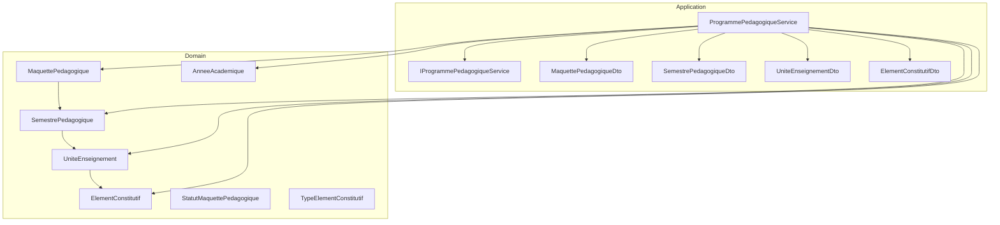
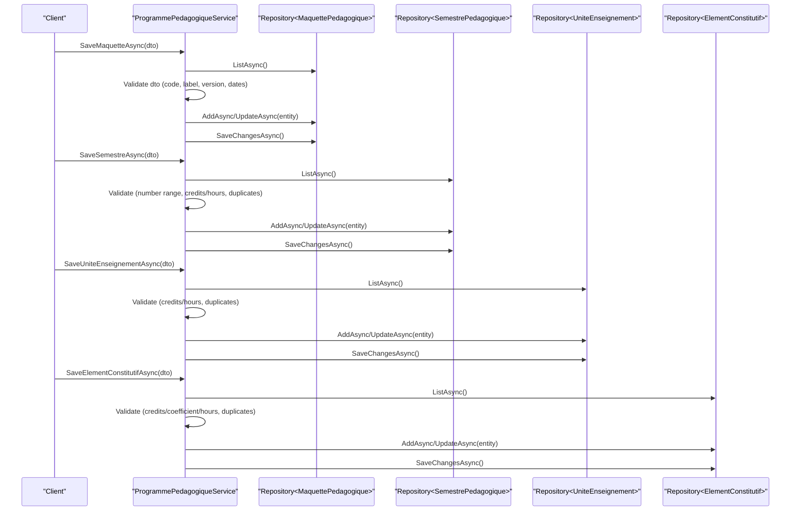
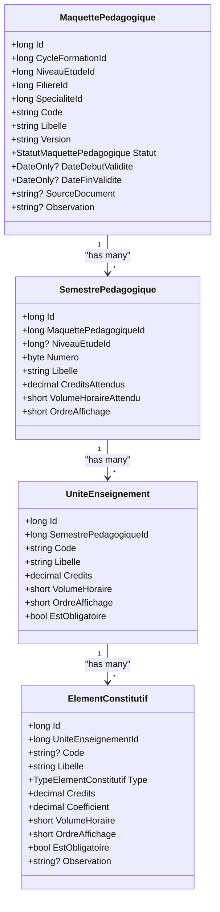
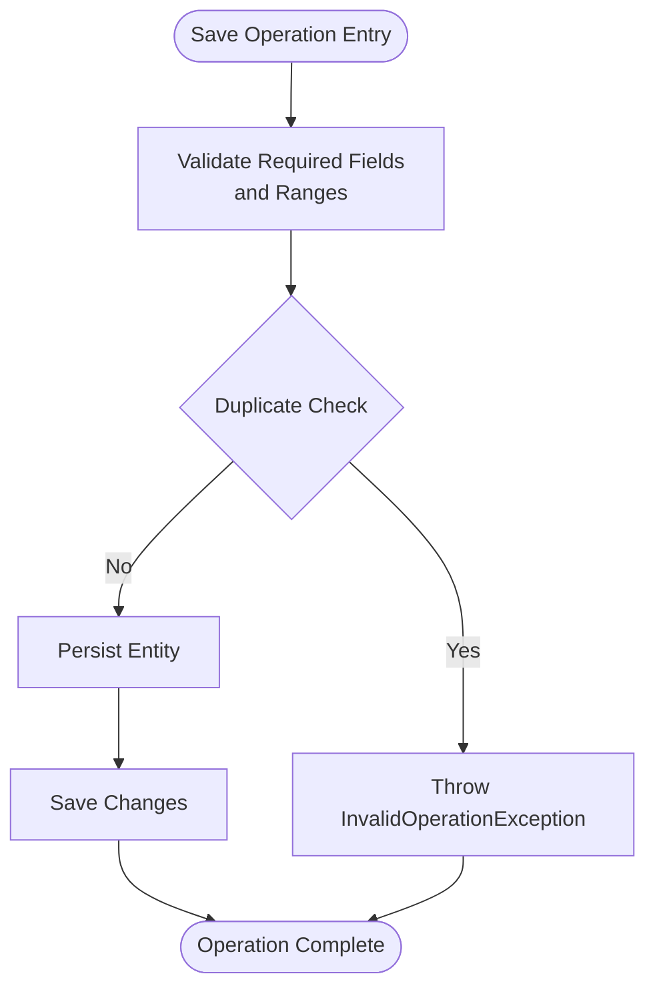
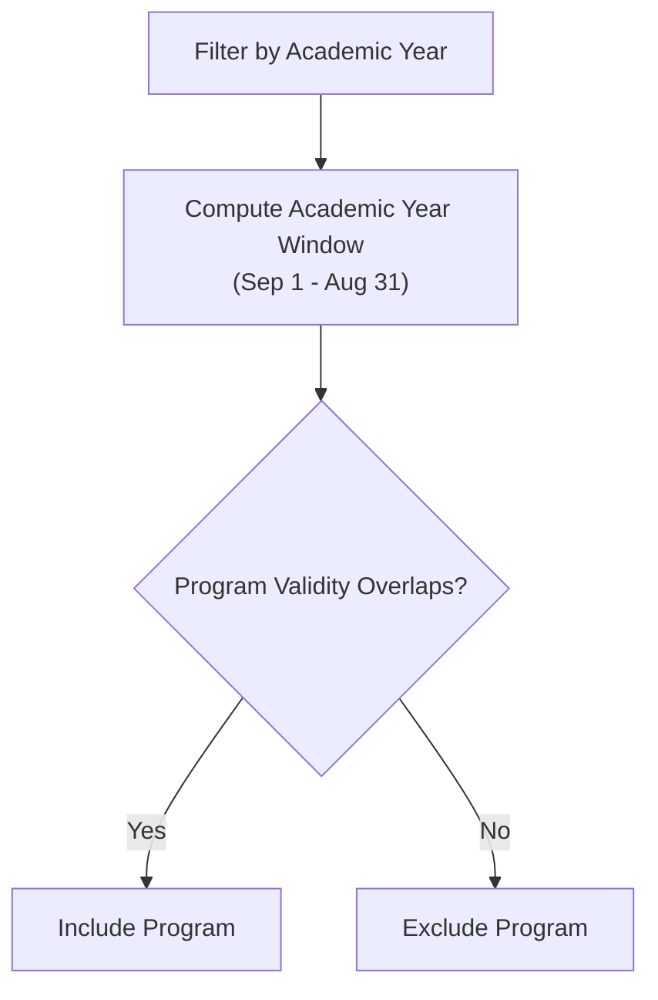
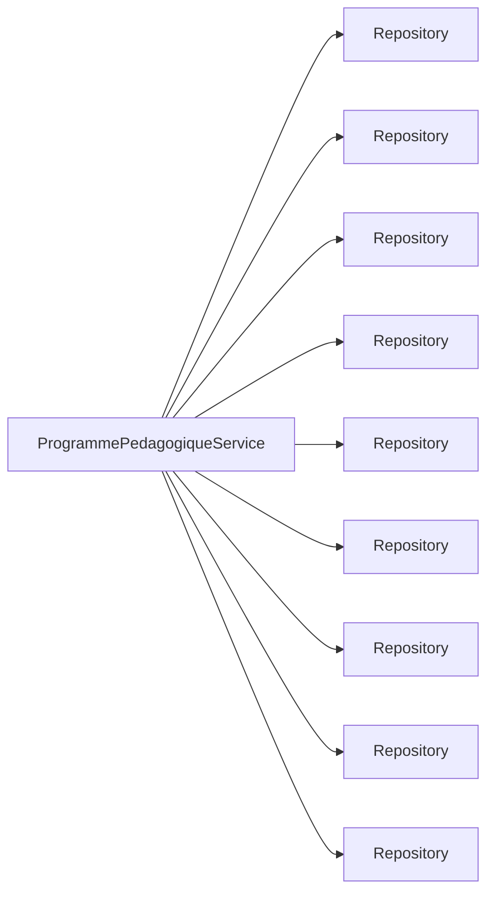

# Academic Programs

<cite>
**Referenced Files in This Document**
- [MaquettePedagogique.cs](file://RIIS.Academic.Domain/Programmes/MaquettePedagogique.cs)
- [SemestrePedagogique.cs](file://RIIS.Academic.Domain/Programmes/SemestrePedagogique.cs)
- [UniteEnseignement.cs](file://RIIS.Academic.Domain/Programmes/UniteEnseignement.cs)
- [ElementConstitutif.cs](file://RIIS.Academic.Domain/Programmes/ElementConstitutif.cs)
- [StatutMaquettePedagogique.cs](file://RIIS.Academic.Domain/Enums/StatutMaquettePedagogique.cs)
- [TypeElementConstitutif.cs](file://RIIS.Academic.Domain/Enums/TypeElementConstitutif.cs)
- [AnneeAcademique.cs](file://RIIS.Academic.Domain/Referentiels/AnneeAcademique.cs)
- [IProgrammePedagogiqueService.cs](file://RIIS.Academic.Application/Programmes/Services/IProgrammePedagogiqueService.cs)
- [ProgrammePedagogiqueService.cs](file://RIIS.Academic.Application/Programmes/Services/ProgrammePedagogiqueService.cs)
- [MaquettePedagogiqueDto.cs](file://RIIS.Academic.Application/Programmes/Dtos/MaquettePedagogiqueDto.cs)
- [SemestrePedagogiqueDto.cs](file://RIIS.Academic.Application/Programmes/Dtos/SemestrePedagogiqueDto.cs)
- [UniteEnseignementDto.cs](file://RIIS.Academic.Application/Programmes/Dtos/UniteEnseignementDto.cs)
- [ElementConstitutifDto.cs](file://RIIS.Academic.Application/Programmes/Dtos/ElementConstitutifDto.cs)
</cite>

## Table of Contents
1. [Introduction](#introduction)
2. [Project Structure](#project-structure)
3. [Core Components](#core-components)
4. [Architecture Overview](#architecture-overview)
5. [Detailed Component Analysis](#detailed-component-analysis)
6. [Dependency Analysis](#dependency-analysis)
7. [Performance Considerations](#performance-considerations)
8. [Troubleshooting Guide](#troubleshooting-guide)
9. [Conclusion](#conclusion)
10. [Appendices](#appendices)

## Introduction
This document explains the Academic Programs module, focusing on the hierarchical program structure from Maquette Pedagogique (program blueprint) down to Element Constitutif (teaching component). It covers domain entities, application service implementation, hierarchy management, validation rules, and operational workflows such as creating programs, assigning semesters, registering course units, and managing academic year associations and versioning. Prerequisite management is addressed conceptually based on available data structures.

## Project Structure
The Academic Programs feature spans Domain entities and Application services:
- Domain layer defines the core entities and enums for programs, semesters, course units, components, statuses, and types.
- Application layer provides a service that orchestrates CRUD operations, validations, lookups, and hierarchical queries across these entities.
- DTOs represent transfer objects used by the service methods.

**Diagram sources**
- [MaquettePedagogique.cs:5-30](file://RIIS.Academic.Domain/Programmes/MaquettePedagogique.cs#L5-L30)
- [SemestrePedagogique.cs:3-19](file://RIIS.Academic.Domain/Programmes/SemestrePedagogique.cs#L3-L19)
- [UniteEnseignement.cs:3-17](file://RIIS.Academic.Domain/Programmes/UniteEnseignement.cs#L3-L17)
- [ElementConstitutif.cs:3-20](file://RIIS.Academic.Domain/Programmes/ElementConstitutif.cs#L3-L20)
- [AnneeAcademique.cs:3-14](file://RIIS.Academic.Domain/Referentiels/AnneeAcademique.cs#L3-L14)
- [StatutMaquettePedagogique.cs:3-8](file://RIIS.Academic.Domain/Enums/StatutMaquettePedagogique.cs#L3-L8)
- [TypeElementConstitutif.cs:3-10](file://RIIS.Academic.Domain/Enums/TypeElementConstitutif.cs#L3-L10)
- [IProgrammePedagogiqueService.cs:6-64](file://RIIS.Academic.Application/Programmes/Services/IProgrammePedagogiqueService.cs#L6-L64)
- [ProgrammePedagogiqueService.cs:8-17](file://RIIS.Academic.Application/Programmes/Services/ProgrammePedagogiqueService.cs#L8-L17)
- [MaquettePedagogiqueDto.cs:5-19](file://RIIS.Academic.Application/Programmes/Dtos/MaquettePedagogiqueDto.cs#L5-L19)
- [SemestrePedagogiqueDto.cs:3-16](file://RIIS.Academic.Application/Programmes/Dtos/SemestrePedagogiqueDto.cs#L3-L16)
- [UniteEnseignementDto.cs:3-15](file://RIIS.Academic.Application/Programmes/Dtos/UniteEnseignementDto.cs#L3-L15)
- [ElementConstitutifDto.cs:5-19](file://RIIS.Academic.Application/Programmes/Dtos/ElementConstitutifDto.cs#L5-L19)

**Section sources**
- [MaquettePedagogique.cs:5-30](file://RIIS.Academic.Domain/Programmes/MaquettePedagogique.cs#L5-L30)
- [SemestrePedagogique.cs:3-19](file://RIIS.Academic.Domain/Programmes/SemestrePedagogique.cs#L3-L19)
- [UniteEnseignement.cs:3-17](file://RIIS.Academic.Domain/Programmes/UniteEnseignement.cs#L3-L17)
- [ElementConstitutif.cs:3-20](file://RIIS.Academic.Domain/Programmes/ElementConstitutif.cs#L3-L20)
- [AnneeAcademique.cs:3-14](file://RIIS.Academic.Domain/Referentiels/AnneeAcademique.cs#L3-L14)
- [IProgrammePedagogiqueService.cs:6-64](file://RIIS.Academic.Application/Programmes/Services/IProgrammePedagogiqueService.cs#L6-L64)
- [ProgrammePedagogiqueService.cs:8-17](file://RIIS.Academic.Application/Programmes/Services/ProgrammePedagogiqueService.cs#L8-L17)

## Core Components
- Maquette Pedagogique: The top-level program blueprint with code, label, version, status, validity dates, and links to cycle, level, stream, and specialty. It contains multiple Semestres.
- Semestre Pedagogique: Represents a semester within a program, with number, label, expected credits/hours, display order, optional study level, and a collection of Course Units.
- Unite Enseignement: A course unit within a semester, with code, label, credits, hours, display order, mandatory flag, and a collection of Teaching Components.
- Element Constitutif: A teaching component within a course unit, with type (course, project, internship, etc.), credits, coefficient, hours, display order, mandatory flag, and optional observation.

These entities form a strict hierarchy: Program -> Semester -> Course Unit -> Teaching Component.

**Section sources**
- [MaquettePedagogique.cs:5-30](file://RIIS.Academic.Domain/Programmes/MaquettePedagogique.cs#L5-L30)
- [SemestrePedagogique.cs:3-19](file://RIIS.Academic.Domain/Programmes/SemestrePedagogique.cs#L3-L19)
- [UniteEnseignement.cs:3-17](file://RIIS.Academic.Domain/Programmes/UniteEnseignement.cs#L3-L17)
- [ElementConstitutif.cs:3-20](file://RIIS.Academic.Domain/Programmes/ElementConstitutif.cs#L3-L20)

## Architecture Overview
The ProgrammePedagogiqueService implements IProgrammePedagogiqueService and coordinates persistence via repositories for each entity. It exposes:
- List and hierarchy views for programs, semesters, course units, and components.
- Create/Save/Delete operations at each level with robust validation.
- Lookup helpers for academic years, cycles, programs, semesters, and units.
- Filtering by academic year and cycle to determine active or valid programs.

**Diagram sources**
- [ProgrammePedagogiqueService.cs:151-226](file://RIIS.Academic.Application/Programmes/Services/ProgrammePedagogiqueService.cs#L151-L226)
- [ProgrammePedagogiqueService.cs:290-352](file://RIIS.Academic.Application/Programmes/Services/ProgrammePedagogiqueService.cs#L290-L352)
- [ProgrammePedagogiqueService.cs:518-574](file://RIIS.Academic.Application/Programmes/Services/ProgrammePedagogiqueService.cs#L518-L574)
- [ProgrammePedagogiqueService.cs:634-712](file://RIIS.Academic.Application/Programmes/Services/ProgrammePedagogiqueService.cs#L634-L712)

## Detailed Component Analysis

### Domain Model and Relationships

**Diagram sources**
- [MaquettePedagogique.cs:5-30](file://RIIS.Academic.Domain/Programmes/MaquettePedagogique.cs#L5-L30)
- [SemestrePedagogique.cs:3-19](file://RIIS.Academic.Domain/Programmes/SemestrePedagogique.cs#L3-L19)
- [UniteEnseignement.cs:3-17](file://RIIS.Academic.Domain/Programmes/UniteEnseignement.cs#L3-L17)
- [ElementConstitutif.cs:3-20](file://RIIS.Academic.Domain/Programmes/ElementConstitutif.cs#L3-L20)

**Section sources**
- [MaquettePedagogique.cs:5-30](file://RIIS.Academic.Domain/Programmes/MaquettePedagogique.cs#L5-L30)
- [SemestrePedagogique.cs:3-19](file://RIIS.Academic.Domain/Programmes/SemestrePedagogique.cs#L3-L19)
- [UniteEnseignement.cs:3-17](file://RIIS.Academic.Domain/Programmes/UniteEnseignement.cs#L3-L17)
- [ElementConstitutif.cs:3-20](file://RIIS.Academic.Domain/Programmes/ElementConstitutif.cs#L3-L20)

### Service Implementation: Hierarchy Management and Validation
Key responsibilities:
- Program lifecycle: create default, save, delete; validate required fields, uniqueness, and date ranges.
- Semester lifecycle: create default with next number, save with duplicate checks and positive values.
- Course unit lifecycle: create default with next order, save with duplicate checks and positive values.
- Component lifecycle: create default with next order, save with duplicate checks and positive values.
- Hierarchical queries: build nested DTOs for UI consumption; filter by academic year and cycle.
- Lookups: provide filtered lists for dropdowns and selectors.

Validation highlights:
- Program: requires parcours association; unique combination of code and version per parcours; validity date ordering enforced.
- Semester: number must be between 1 and 10; credits and hours non-negative; unique number per program.
- Course unit: credits and hours non-negative; unique code per semester.
- Component: credits, coefficient, hours non-negative; unique code per unit; unique display order per unit.

**Diagram sources**
- [ProgrammePedagogiqueService.cs:151-226](file://RIIS.Academic.Application/Programmes/Services/ProgrammePedagogiqueService.cs#L151-L226)
- [ProgrammePedagogiqueService.cs:290-352](file://RIIS.Academic.Application/Programmes/Services/ProgrammePedagogiqueService.cs#L290-L352)
- [ProgrammePedagogiqueService.cs:518-574](file://RIIS.Academic.Application/Programmes/Services/ProgrammePedagogiqueService.cs#L518-L574)
- [ProgrammePedagogiqueService.cs:634-712](file://RIIS.Academic.Application/Programmes/Services/ProgrammePedagogiqueService.cs#L634-L712)

**Section sources**
- [ProgrammePedagogiqueService.cs:151-226](file://RIIS.Academic.Application/Programmes/Services/ProgrammePedagogiqueService.cs#L151-L226)
- [ProgrammePedagogiqueService.cs:290-352](file://RIIS.Academic.Application/Programmes/Services/ProgrammePedagogiqueService.cs#L290-L352)
- [ProgrammePedagogiqueService.cs:518-574](file://RIIS.Academic.Application/Programmes/Services/ProgrammePedagogiqueService.cs#L518-L574)
- [ProgrammePedagogiqueService.cs:634-712](file://RIIS.Academic.Application/Programmes/Services/ProgrammePedagogiqueService.cs#L634-L712)

### Program Status Management and Academic Year Associations
- Program status: supports Draft, Active, Archived states via an enum.
- Academic year association: programs can be filtered by academic year using validity dates and class associations. The service computes whether a program is valid for an academic year by comparing its validity window against the academic year’s September-to-August span.

**Diagram sources**
- [ProgrammePedagogiqueService.cs:781-827](file://RIIS.Academic.Application/Programmes/Services/ProgrammePedagogiqueService.cs#L781-L827)
- [AnneeAcademique.cs:3-14](file://RIIS.Academic.Domain/Referentiels/AnneeAcademique.cs#L3-L14)

**Section sources**
- [StatutMaquettePedagogique.cs:3-8](file://RIIS.Academic.Domain/Enums/StatutMaquettePedagogique.cs#L3-L8)
- [ProgrammePedagogiqueService.cs:781-827](file://RIIS.Academic.Application/Programmes/Services/ProgrammePedagogiqueService.cs#L781-L827)
- [AnneeAcademique.cs:3-14](file://RIIS.Academic.Domain/Referentiels/AnneeAcademique.cs#L3-L14)

### Program Versioning Concepts
- Each program has a version string. The service enforces uniqueness of code+version per parcours, enabling versioned blueprints for the same program lineage.
- Default creation initializes version to “V1” and status to Draft.

**Section sources**
- [ProgrammePedagogiqueService.cs:143-149](file://RIIS.Academic.Application/Programmes/Services/ProgrammePedagogiqueService.cs#L143-L149)
- [ProgrammePedagogiqueService.cs:171-186](file://RIIS.Academic.Application/Programmes/Services/ProgrammePedagogiqueService.cs#L171-L186)

### Examples of Workflows

#### Creating a Program Blueprint
- Use CreateDefaultMaquette to seed a new draft program with defaults.
- Populate code, label, version, and validity dates, then SaveMaquetteAsync.
- Validation ensures required fields, uniqueness, and date ordering.

**Section sources**
- [ProgrammePedagogiqueService.cs:143-149](file://RIIS.Academic.Application/Programmes/Services/ProgrammePedagogiqueService.cs#L143-L149)
- [ProgrammePedagogiqueService.cs:151-226](file://RIIS.Academic.Application/Programmes/Services/ProgrammePedagogiqueService.cs#L151-L226)

#### Assigning Semesters to a Program
- Use CreateDefaultSemestreAsync to generate a new semester with next number and defaults.
- Set label, credits, hours, and display order; SaveSemestreAsync validates and persists.

**Section sources**
- [ProgrammePedagogiqueService.cs:269-288](file://RIIS.Academic.Application/Programmes/Services/ProgrammePedagogiqueService.cs#L269-L288)
- [ProgrammePedagogiqueService.cs:290-352](file://RIIS.Academic.Application/Programmes/Services/ProgrammePedagogiqueService.cs#L290-L352)

#### Registering Course Units in a Semester
- Use CreateDefaultUniteEnseignementAsync to create a unit with next order and defaults.
- Set code, label, credits, hours, and mandatory flag; SaveUniteEnseignementAsync validates and persists.

**Section sources**
- [ProgrammePedagogiqueService.cs:499-516](file://RIIS.Academic.Application/Programmes/Services/ProgrammePedagogiqueService.cs#L499-L516)
- [ProgrammePedagogiqueService.cs:518-574](file://RIIS.Academic.Application/Programmes/Services/ProgrammePedagogiqueService.cs#L518-L574)

#### Managing Teaching Components
- Use CreateDefaultElementConstitutifAsync to create a component with next order and defaults.
- Set type, credits, coefficient, hours, and mandatory flag; SaveElementConstitutifAsync validates and persists.

**Section sources**
- [ProgrammePedagogiqueService.cs:613-632](file://RIIS.Academic.Application/Programmes/Services/ProgrammePedagogiqueService.cs#L613-L632)
- [ProgrammePedagogiqueService.cs:634-712](file://RIIS.Academic.Application/Programmes/Services/ProgrammePedagogiqueService.cs#L634-L712)

### Prerequisite Management
- No explicit prerequisite relationships are modeled among the current entities. If prerequisites are needed, they would typically be represented as additional references or a separate mapping table linking components or units to their dependencies.

[No sources needed since this section does not analyze specific files]

## Dependency Analysis
The service depends on repositories for all program-related entities and reference data. It composes DTOs and performs filtering logic in-memory after fetching collections.

**Diagram sources**
- [ProgrammePedagogiqueService.cs:8-17](file://RIIS.Academic.Application/Programmes/Services/ProgrammePedagogiqueService.cs#L8-L17)

**Section sources**
- [ProgrammePedagogiqueService.cs:8-17](file://RIIS.Academic.Application/Programmes/Services/ProgrammePedagogiqueService.cs#L8-L17)

## Performance Considerations
- The service fetches entire collections into memory and filters in LINQ. For large datasets, consider:
  - Server-side filtering where possible.
  - Pagination for list endpoints.
  - Indexing foreign keys and frequently filtered columns (e.g., MaquettePedagogiqueId, SemestrePedagogiqueId, AnneeAcademiqueId).
- Avoid unnecessary re-fetching by caching lookup data when appropriate.

[No sources needed since this section provides general guidance]

## Troubleshooting Guide
Common errors and their causes:
- Missing required fields: Ensure code, label, and version are provided for programs; code and label for units/components; numbers and labels for semesters.
- Invalid ranges: Semester number must be 1–10; credits and hours must be non-negative; coefficients must be non-negative.
- Duplicate entries: Unique constraints enforced per scope (e.g., code+version per program; number per program; code per unit; code and order per component).
- Referential integrity: Ensure referenced entities exist before saving (program, semester, unit).
- Date validity: End date must be greater than or equal to start date.

When these conditions fail, the service throws InvalidOperationException with descriptive messages.

**Section sources**
- [ProgrammePedagogiqueService.cs:151-186](file://RIIS.Academic.Application/Programmes/Services/ProgrammePedagogiqueService.cs#L151-L186)
- [ProgrammePedagogiqueService.cs:290-352](file://RIIS.Academic.Application/Programmes/Services/ProgrammePedagogiqueService.cs#L290-L352)
- [ProgrammePedagogiqueService.cs:518-574](file://RIIS.Academic.Application/Programmes/Services/ProgrammePedagogiqueService.cs#L518-L574)
- [ProgrammePedagogiqueService.cs:634-712](file://RIIS.Academic.Application/Programmes/Services/ProgrammePedagogiqueService.cs#L634-L712)

## Conclusion
The Academic Programs module models a clear hierarchy from program blueprints to teaching components, with strong validation and versioning support. The service centralizes business rules for creation, updates, and hierarchical queries, while integrating with academic year contexts to present relevant programs. Future enhancements may include explicit prerequisite modeling and more granular performance optimizations.

[No sources needed since this section summarizes without analyzing specific files]

## Appendices

### API Surface Summary
- Program operations: list, hierarchy, get, create default, save, delete.
- Semester operations: list, get, create default, save, delete.
- Course unit operations: list, hierarchy, get, create default, save, delete.
- Component operations: list, get, create default, save, delete.
- Lookups: academic years, cycles, programs, semesters, units, levels.

**Section sources**
- [IProgrammePedagogiqueService.cs:6-64](file://RIIS.Academic.Application/Programmes/Services/IProgrammePedagogiqueService.cs#L6-L64)