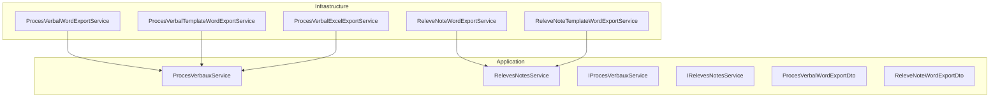
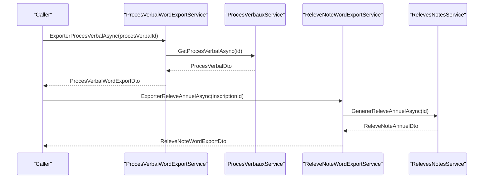
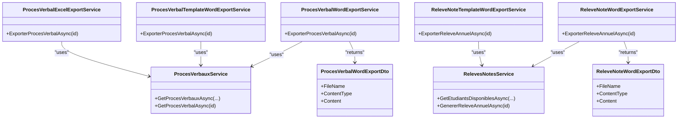
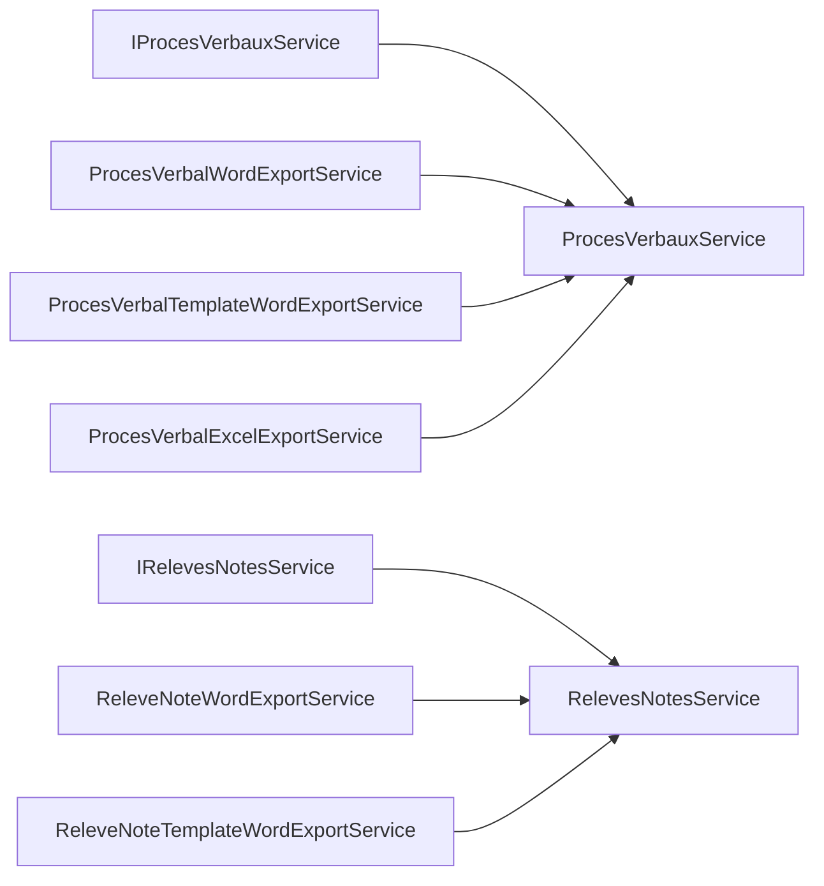

# Document Generation

<cite>
**Referenced Files in This Document**
- [ProcesVerbalWordExportService.cs](file://RIIS.Academic.Infrastructure/Documents/ProcesVerbalWordExportService.cs)
- [ReleveNoteWordExportService.cs](file://RIIS.Academic.Infrastructure/Documents/ReleveNoteWordExportService.cs)
- [ProcesVerbauxService.cs](file://RIIS.Academic.Application/ProcesVerbaux/Services/ProcesVerbauxService.cs)
- [RelevesNotesService.cs](file://RIIS.Academic.Application/Releves/Services/RelevesNotesService.cs)
- [ProcesVerbalTemplateWordExportService.cs](file://RIIS.Academic.Infrastructure/Documents/ProcesVerbalTemplateWordExportService.cs)
- [ReleveNoteTemplateWordExportService.cs](file://RIIS.Academic.Infrastructure/Documents/ReleveNoteTemplateWordExportService.cs)
- [ProcesVerbalExcelExportService.cs](file://RIIS.Academic.Infrastructure/Documents/ProcesVerbalExcelExportService.cs)
- [IProcesVerbauxService.cs](file://RIIS.Academic.Application/ProcesVerbaux/Services/IProcesVerbauxService.cs)
- [IRelevesNotesService.cs](file://RIIS.Academic.Application/Releves/Services/IRelevesNotesService.cs)
- [ProcesVerbalWordExportDto.cs](file://RIIS.Academic.Application/ProcesVerbaux/Dtos/ProcesVerbalWordExportDto.cs)
- [ReleveNoteWordExportDto.cs](file://RIIS.Academic.Application/Releves/Dtos/ReleveNoteWordExportDto.cs)
</cite>

## Table of Contents
1. Introduction
2. Project Structure
3. Core Components
4. Architecture Overview
5. Detailed Component Analysis
6. Dependency Analysis
7. Performance Considerations
8. Troubleshooting Guide
9. Conclusion
10. Appendices

## Introduction
This document explains the Document Generation module that produces official academic documents: transcripts (relevés de notes), meeting minutes (procès-verbaux), and related exports. It covers the template-based system, Word and Excel export services, customization options, and the application services that prepare data for rendering. You will learn how to generate transcripts and minutes, create custom templates, and process documents in batch.

## Project Structure
The module spans Application and Infrastructure layers:
- Application layer defines domain services and DTOs used by export services.
- Infrastructure layer implements Word and Excel generation, including template-based rendering and programmatic XML construction.

**Diagram sources**
- [ProcesVerbalWordExportService.cs:10-30](file://RIIS.Academic.Infrastructure/Documents/ProcesVerbalWordExportService.cs#L10-L30)
- [ProcesVerbalTemplateWordExportService.cs:11-34](file://RIIS.Academic.Infrastructure/Documents/ProcesVerbalTemplateWordExportService.cs#L11-L34)
- [ProcesVerbalExcelExportService.cs:10-32](file://RIIS.Academic.Infrastructure/Documents/ProcesVerbalExcelExportService.cs#L10-L32)
- [ReleveNoteWordExportService.cs:10-28](file://RIIS.Academic.Infrastructure/Documents/ReleveNoteWordExportService.cs#L10-L28)
- [ReleveNoteTemplateWordExportService.cs:11-34](file://RIIS.Academic.Infrastructure/Documents/ReleveNoteTemplateWordExportService.cs#L11-L34)
- [IProcesVerbauxService.cs:7-30](file://RIIS.Academic.Application/ProcesVerbaux/Services/IProcesVerbauxService.cs#L7-L30)
- [IRelevesNotesService.cs:5-17](file://RIIS.Academic.Application/Releves/Services/IRelevesNotesService.cs#L5-L17)

**Section sources**
- [ProcesVerbalWordExportService.cs:10-30](file://RIIS.Academic.Infrastructure/Documents/ProcesVerbalWordExportService.cs#L10-L30)
- [ReleveNoteWordExportService.cs:10-28](file://RIIS.Academic.Infrastructure/Documents/ReleveNoteWordExportService.cs#L10-L28)
- [ProcesVerbauxService.cs:18-87](file://RIIS.Academic.Application/ProcesVerbaux/Services/ProcesVerbauxService.cs#L18-L87)
- [RelevesNotesService.cs:25-200](file://RIIS.Academic.Application/Releves/Services/RelevesNotesService.cs#L25-L200)

## Core Components
- ProcesVerbauxService: Loads and filters procès-verbaux records and maps them to rich DTOs with aggregated statistics and line details.
- RelevesNotesService: Builds annual transcript data per student, computing semester grades, credits, averages, mentions, and decisions.
- Word Export Services: Generate .docx files either programmatically or by templating existing Word templates.
- Excel Export Service: Generates a formatted .xlsx sheet for procès-verbaux with headers, tables, and styling.
- DTOs: Standardized export payloads containing FileName, ContentType, and Content bytes.

Key responsibilities:
- Data preparation and aggregation (Application services).
- Rendering and packaging into Office Open XML formats (Infrastructure services).
- Template placeholder replacement and table injection (Template services).

**Section sources**
- [ProcesVerbauxService.cs:18-87](file://RIIS.Academic.Application/ProcesVerbaux/Services/ProcesVerbauxService.cs#L18-L87)
- [RelevesNotesService.cs:93-200](file://RIIS.Academic.Application/Releves/Services/RelevesNotesService.cs#L93-L200)
- [ProcesVerbalWordExportService.cs:12-45](file://RIIS.Academic.Infrastructure/Documents/ProcesVerbalWordExportService.cs#L12-L45)
- [ReleveNoteWordExportService.cs:12-43](file://RIIS.Academic.Infrastructure/Documents/ReleveNoteWordExportService.cs#L12-L43)
- [ProcesVerbalExcelExportService.cs:14-50](file://RIIS.Academic.Infrastructure/Documents/ProcesVerbalExcelExportService.cs#L14-L50)
- [ProcesVerbalWordExportDto.cs:3-8](file://RIIS.Academic.Application/ProcesVerbaux/Dtos/ProcesVerbalWordExportDto.cs#L3-L8)
- [ReleveNoteWordExportDto.cs:3-8](file://RIIS.Academic.Application/Releves/Dtos/ReleveNoteWordExportDto.cs#L3-L8)

## Architecture Overview
The architecture follows clean separation:
- Export services depend on Application services via interfaces to fetch data.
- Template services read external .docx templates from well-known locations and replace placeholders and tables.
- Programmatic Word/Excel services build Office Open XML directly using ZIP archives and XML strings.

**Diagram sources**
- [ProcesVerbalWordExportService.cs:12-30](file://RIIS.Academic.Infrastructure/Documents/ProcesVerbalWordExportService.cs#L12-L30)
- [ProcesVerbauxService.cs:62-87](file://RIIS.Academic.Application/ProcesVerbaux/Services/ProcesVerbauxService.cs#L62-L87)
- [ReleveNoteWordExportService.cs:12-28](file://RIIS.Academic.Infrastructure/Documents/ReleveNoteWordExportService.cs#L12-L28)
- [RelevesNotesService.cs:93-200](file://RIIS.Academic.Application/Releves/Services/RelevesNotesService.cs#L93-L200)

## Detailed Component Analysis

### ProcesVerbauxService
Responsibilities:
- List and filter procès-verbaux by academic year, cycle, class, semester, and type.
- Resolve related entities (academic year, cycle, parcours, class, semester) and compute aggregates (counts, min/max averages, decisions).
- Parse detailed notes JSON per line into structured element constitutif data for export.

Data flow:
- Fetches all required repositories once per call.
- Applies filters in-memory and maps to DTOs with ordered lines and computed stats.

Complexity considerations:
- Filtering and mapping are O(N) over loaded sets; suitable for typical academic dataset sizes.
- JSON parsing is guarded with try/catch to handle malformed data gracefully.

Customization points:
- Formatting of labels and codes.
- Aggregation logic for counts and decision categories.

**Section sources**
- [ProcesVerbauxService.cs:18-87](file://RIIS.Academic.Application/ProcesVerbaux/Services/ProcesVerbauxService.cs#L18-L87)
- [ProcesVerbauxService.cs:180-243](file://RIIS.Academic.Application/ProcesVerbaux/Services/ProcesVerbauxService.cs#L180-L243)
- [ProcesVerbauxService.cs:245-361](file://RIIS.Academic.Application/ProcesVerbaux/Services/ProcesVerbauxService.cs#L245-L361)

### RelevesNotesService
Responsibilities:
- Build annual transcript data for a given enrollment.
- Compute per-element constitutif averages across evaluation types (continuous control, knowledge control, normal session, makeup session).
- Determine credits acquired, semester totals, overall average, mention, and final decision.

Processing logic:
- Resolves pedagogical blueprint for the enrollment.
- Iterates semesters based on level number and builds lines grouped by teaching unit.
- Uses calculation service to derive final averages and credits.

Error handling:
- Throws explicit exceptions when essential entities (student, academic year, pathway, blueprint) are missing.

**Section sources**
- [RelevesNotesService.cs:93-200](file://RIIS.Academic.Application/Releves/Services/RelevesNotesService.cs#L93-L200)
- [RelevesNotesService.cs:202-267](file://RIIS.Academic.Application/Releves/Services/RelevesNotesService.cs#L202-L267)
- [RelevesNotesService.cs:269-377](file://RIIS.Academic.Application/Releves/Services/RelevesNotesService.cs#L269-L377)

### Word Export: Programmatic Generation
ProcesVerbalWordExportService
- Builds a .docx archive in memory with content types, relationships, styles, and a generated document.xml.
- Renders header info, metadata table, student list table (simple or detailed), and signature block.
- Formats notes with color coding and computes file names safely.

ReleveNoteWordExportService
- Produces an annual transcript .docx with student info, per-semester grade tables, recap table, decision, and signature area.
- Uses consistent styling and formatting helpers for cells, rows, and paragraphs.

Common patterns:
- ZIP-based assembly of Office Open XML parts.
- Helper methods for table/grid definitions, row/cell generation, text runs, and safe escaping.

**Section sources**
- [ProcesVerbalWordExportService.cs:32-89](file://RIIS.Academic.Infrastructure/Documents/ProcesVerbalWordExportService.cs#L32-L89)
- [ProcesVerbalWordExportService.cs:91-165](file://RIIS.Academic.Infrastructure/Documents/ProcesVerbalWordExportService.cs#L91-L165)
- [ProcesVerbalWordExportService.cs:198-240](file://RIIS.Academic.Infrastructure/Documents/ProcesVerbalWordExportService.cs#L198-L240)
- [ReleveNoteWordExportService.cs:30-93](file://RIIS.Academic.Infrastructure/Documents/ReleveNoteWordExportService.cs#L30-L93)
- [ReleveNoteWordExportService.cs:95-160](file://RIIS.Academic.Infrastructure/Documents/ReleveNoteWordExportService.cs#L95-L160)

### Word Export: Template-Based Generation
ProcesVerbalTemplateWordExportService
- Locates a template .docx from multiple candidate paths.
- Reads the archive, replaces text placeholders like {{PV_TYPE}}, {{SEMESTRE_LIBELLE}}, etc., and injects a dynamically built table where {{PV_TABLE}} is placed.
- Supports repeating header rows and styled cells.

ReleveNoteTemplateWordExportService
- Similar approach for transcripts: resolves template, replaces placeholders such as {{TITRE}}, {{ETUDIANT_NOM_COMPLET}}, {{DECISION}}, and injects semester tables and recap at {{RELEVE_TABLES}}.
- Handles both table and paragraph placeholders for flexibility.

Template management:
- Templates are expected under Documents/Templates relative to base directory or current directory.
- Missing templates raise clear errors indicating the expected location.

**Section sources**
- [ProcesVerbalTemplateWordExportService.cs:36-68](file://RIIS.Academic.Infrastructure/Documents/ProcesVerbalTemplateWordExportService.cs#L36-L68)
- [ProcesVerbalTemplateWordExportService.cs:70-86](file://RIIS.Academic.Infrastructure/Documents/ProcesVerbalTemplateWordExportService.cs#L70-L86)
- [ProcesVerbalTemplateWordExportService.cs:88-137](file://RIIS.Academic.Infrastructure/Documents/ProcesVerbalTemplateWordExportService.cs#L88-L137)
- [ReleveNoteTemplateWordExportService.cs:36-68](file://RIIS.Academic.Infrastructure/Documents/ReleveNoteTemplateWordExportService.cs#L36-L68)
- [ReleveNoteTemplateWordExportService.cs:70-86](file://RIIS.Academic.Infrastructure/Documents/ReleveNoteTemplateWordExportService.cs#L70-L86)
- [ReleveNoteTemplateWordExportService.cs:88-154](file://RIIS.Academic.Infrastructure/Documents/ReleveNoteTemplateWordExportService.cs#L88-L154)

### Excel Export: Programmatic Generation
ProcesVerbalExcelExportService
- Creates a single-sheet workbook with title, metadata, and student tables (simple or detailed).
- Defines column widths, frozen panes, print settings, and styles for headers, numbers, and notes.
- Adds merge regions for multi-column headers and signature blocks.

Formatting highlights:
- Notes are colored green/red based on pass threshold.
- Print titles repeat header rows.

**Section sources**
- [ProcesVerbalExcelExportService.cs:34-50](file://RIIS.Academic.Infrastructure/Documents/ProcesVerbalExcelExportService.cs#L34-L50)
- [ProcesVerbalExcelExportService.cs:52-139](file://RIIS.Academic.Infrastructure/Documents/ProcesVerbalExcelExportService.cs#L52-L139)
- [ProcesVerbalExcelExportService.cs:141-253](file://RIIS.Academic.Infrastructure/Documents/ProcesVerbalExcelExportService.cs#L141-L253)

### Class Diagram of Export Services

**Diagram sources**
- [ProcesVerbauxService.cs:18-87](file://RIIS.Academic.Application/ProcesVerbaux/Services/ProcesVerbauxService.cs#L18-L87)
- [RelevesNotesService.cs:25-200](file://RIIS.Academic.Application/Releves/Services/RelevesNotesService.cs#L25-L200)
- [ProcesVerbalWordExportService.cs:10-30](file://RIIS.Academic.Infrastructure/Documents/ProcesVerbalWordExportService.cs#L10-L30)
- [ProcesVerbalTemplateWordExportService.cs:11-34](file://RIIS.Academic.Infrastructure/Documents/ProcesVerbalTemplateWordExportService.cs#L11-L34)
- [ProcesVerbalExcelExportService.cs:10-32](file://RIIS.Academic.Infrastructure/Documents/ProcesVerbalExcelExportService.cs#L10-L32)
- [ReleveNoteWordExportService.cs:10-28](file://RIIS.Academic.Infrastructure/Documents/ReleveNoteWordExportService.cs#L10-L28)
- [ReleveNoteTemplateWordExportService.cs:11-34](file://RIIS.Academic.Infrastructure/Documents/ReleveNoteTemplateWordExportService.cs#L11-L34)
- [ProcesVerbalWordExportDto.cs:3-8](file://RIIS.Academic.Application/ProcesVerbaux/Dtos/ProcesVerbalWordExportDto.cs#L3-L8)
- [ReleveNoteWordExportDto.cs:3-8](file://RIIS.Academic.Application/Releves/Dtos/ReleveNoteWordExportDto.cs#L3-L8)

## Dependency Analysis
- Export services depend on Application services through interfaces, enabling testability and decoupling.
- Template services rely on file system access to locate templates; failures are explicit.
- All Word/Excel generators produce self-contained Office Open XML packages without third-party libraries.

**Diagram sources**
- [IProcesVerbauxService.cs:7-30](file://RIIS.Academic.Application/ProcesVerbaux/Services/IProcesVerbauxService.cs#L7-L30)
- [IRelevesNotesService.cs:5-17](file://RIIS.Academic.Application/Releves/Services/IRelevesNotesService.cs#L5-L17)
- [ProcesVerbalWordExportService.cs:10-30](file://RIIS.Academic.Infrastructure/Documents/ProcesVerbalWordExportService.cs#L10-L30)
- [ProcesVerbalTemplateWordExportService.cs:11-34](file://RIIS.Academic.Infrastructure/Documents/ProcesVerbalTemplateWordExportService.cs#L11-L34)
- [ProcesVerbalExcelExportService.cs:10-32](file://RIIS.Academic.Infrastructure/Documents/ProcesVerbalExcelExportService.cs#L10-L32)
- [ReleveNoteWordExportService.cs:10-28](file://RIIS.Academic.Infrastructure/Documents/ReleveNoteWordExportService.cs#L10-L28)
- [ReleveNoteTemplateWordExportService.cs:11-34](file://RIIS.Academic.Infrastructure/Documents/ReleveNoteTemplateWordExportService.cs#L11-L34)

**Section sources**
- [IProcesVerbauxService.cs:7-30](file://RIIS.Academic.Application/ProcesVerbaux/Services/IProcesVerbauxService.cs#L7-L30)
- [IRelevesNotesService.cs:5-17](file://RIIS.Academic.Application/Releves/Services/IRelevesNotesService.cs#L5-L17)

## Performance Considerations
- Batch processing:
  - For bulk transcript generation, iterate enrollments and call the appropriate export service per student. Avoid loading entire datasets repeatedly by caching repository results if needed at higher layers.
- Memory usage:
  - All generators build documents in memory streams before returning byte arrays. Ensure adequate memory for large batches; consider streaming responses at the API boundary.
- Template resolution:
  - Template path checks occur per export. Cache resolved template paths if generating many documents from the same template.
- Number formatting and string operations:
  - Use invariant culture consistently to avoid locale-related overhead and inconsistencies.

[No sources needed since this section provides general guidance]

## Troubleshooting Guide
Common issues and resolutions:
- Missing Word template:
  - The template services throw a clear error if the template is not found. Ensure the template exists under one of the searched paths (base directory or current directory under Documents/Templates).
- Invalid or missing data:
  - Transcript generation may throw when essential entities are missing. Validate enrollment and associated references before exporting.
- Malformed JSON details:
  - Parsing of detailed notes JSON is wrapped in exception handling; invalid entries result in empty detail lists rather than crashes.

Operational tips:
- Verify template placeholders match those expected by the template service.
- Confirm that exported files open correctly in target applications; ensure no extra characters were introduced during string escaping.

**Section sources**
- [ProcesVerbalTemplateWordExportService.cs:70-86](file://RIIS.Academic.Infrastructure/Documents/ProcesVerbalTemplateWordExportService.cs#L70-L86)
- [ReleveNoteTemplateWordExportService.cs:70-86](file://RIIS.Academic.Infrastructure/Documents/ReleveNoteTemplateWordExportService.cs#L70-L86)
- [RelevesNotesService.cs:119-134](file://RIIS.Academic.Application/Releves/Services/RelevesNotesService.cs#L119-L134)
- [ProcesVerbauxService.cs:322-361](file://RIIS.Academic.Application/ProcesVerbaux/Services/ProcesVerbauxService.cs#L322-L361)

## Conclusion
The Document Generation module provides robust, extensible capabilities for producing official academic documents. It supports both programmatic and template-driven approaches for Word and Excel, with clear separation between data preparation and rendering. Teams can customize outputs by updating templates or extending services while maintaining consistency and reliability.

[No sources needed since this section summarizes without analyzing specific files]

## Appendices

### Examples

- Generate a transcript (annual releve):
  - Call the transcript export service with an enrollment ID. The service builds the annual transcript data and returns a Word document payload.
  - Reference: [ReleveNoteWordExportService.cs:12-28](file://RIIS.Academic.Infrastructure/Documents/ReleveNoteWordExportService.cs#L12-L28)

- Generate a meeting minute (procès-verbal):
  - Call the minute export service with a procès-verbal ID. The service loads the record and returns a Word document payload.
  - Reference: [ProcesVerbalWordExportService.cs:12-30](file://RIIS.Academic.Infrastructure/Documents/ProcesVerbalWordExportService.cs#L12-L30)

- Create a custom template:
  - Place a Word template under Documents/Templates with placeholders matching the template service’s expectations. For minutes use {{PV_TABLE}} and for transcripts use {{RELEVE_TABLES}}.
  - Reference: [ProcesVerbalTemplateWordExportService.cs:88-137](file://RIIS.Academic.Infrastructure/Documents/ProcesVerbalTemplateWordExportService.cs#L88-L137), [ReleveNoteTemplateWordExportService.cs:88-154](file://RIIS.Academic.Infrastructure/Documents/ReleveNoteTemplateWordExportService.cs#L88-L154)

- Batch document processing:
  - Iterate over a collection of IDs (enrollments or procès-verbaux) and invoke the corresponding export service for each item. Aggregate results and stream responses as needed.
  - Reference: [ProcesVerbauxService.cs:18-87](file://RIIS.Academic.Application/ProcesVerbaux/Services/ProcesVerbauxService.cs#L18-L87), [RelevesNotesService.cs:25-200](file://RIIS.Academic.Application/Releves/Services/RelevesNotesService.cs#L25-L200)

### Customization Options
- Formatting:
  - Adjust cell shading, font sizes, colors, and alignment within helper methods for tables and paragraphs.
  - Reference: [ProcesVerbalWordExportService.cs:263-389](file://RIIS.Academic.Infrastructure/Documents/ProcesVerbalWordExportService.cs#L263-L389), [ReleveNoteWordExportService.cs:211-321](file://RIIS.Academic.Infrastructure/Documents/ReleveNoteWordExportService.cs#L211-L321)

- Watermarking:
  - Add watermark text by inserting it into the Word template’s header/footer or as background content in the template document.xml prior to placeholder replacement.
  - Reference: [ProcesVerbalTemplateWordExportService.cs:36-68](file://RIIS.Academic.Infrastructure/Documents/ProcesVerbalTemplateWordExportService.cs#L36-L68)

- Digital signatures:
  - Integrate signing at the application boundary after document generation by applying cryptographic signatures to the returned byte array or saved file.
  - No direct implementation in these services; extend at the caller layer.

[No additional sources beyond referenced sections above]