# Enrollment System

<cite>
**Referenced Files in This Document**
- [Inscription.cs](file://src/RIIS.Academic.Domain/Inscriptions/Inscription.cs)
- [DossierAdmission.cs](file://src/RIIS.Academic.Domain/Inscriptions/DossierAdmission.cs)
- [ValidationInscription.cs](file://src/RIIS.Academic.Domain/Inscriptions/ValidationInscription.cs)
- [StatutInscription.cs](file://src/RIIS.Academic.Domain/Enums/StatutInscription.cs)
- [IInscriptionsService.cs](file://src/RIIS.Academic.Application/Inscriptions/Services/IInscriptionsService.cs)
- [InscriptionsService.cs](file://src/RIIS.Academic.Application/Inscriptions/Services/InscriptionsService.cs)
- [InscriptionDto.cs](file://src/RIIS.Academic.Application/Inscriptions/Dtos/InscriptionDto.cs)
- [Etudiant.cs](file://src/RIIS.Academic.Domain/Etudiants/Etudiant.cs)
- [ParcoursAcademique.cs](file://src/RIIS.Academic.Domain/Parcours/ParcoursAcademique.cs)
- [InscriptionConfiguration.cs](file://src/RIIS.Academic.Infrastructure/Persistence/Configurations/Inscriptions/InscriptionConfiguration.cs)
- [DossierAdmissionConfiguration.cs](file://src/RIIS.Academic.Infrastructure/Persistence/Configurations/Inscriptions/DossierAdmissionConfiguration.cs)
- [ValidationInscriptionConfiguration.cs](file://src/RIIS.Academic.Infrastructure/Persistence/Configurations/Inscriptions/ValidationInscriptionConfiguration.cs)
- [IInscriptionService.cs](file://src/RIIS.Academic.Application/Abstractions/Services/IInscriptionService.cs)
- [IDossiersScolariteService.cs](file://src/RIIS.Academic.Application/Scolarite/Services/IDossiersScolariteService.cs)
- [DossiersScolariteService.cs](file://src/RIIS.Academic.Application/Scolarite/Services/DossiersScolariteService.cs)
</cite>

## Table of Contents
1. [Introduction](#introduction)
2. [Project Structure](#project-structure)
3. [Core Components](#core-components)
4. [Architecture Overview](#architecture-overview)
5. [Detailed Component Analysis](#detailed-component-analysis)
6. [Dependency Analysis](#dependency-analysis)
7. [Performance Considerations](#performance-considerations)
8. [Troubleshooting Guide](#troubleshooting-guide)
9. [Conclusion](#conclusion)

## Introduction
This document describes the Enrollment System module, focusing on the end-to-end enrollment workflow from admission dossier processing to final enrollment validation. It explains the Inscription entity lifecycle, how DossierAdmission is managed alongside an enrollment, and how ValidationInscription captures student and administrative sign-offs. It also documents the InscriptionsService implementation, enrollment status transitions, and validation rules, including conflict detection, prerequisite checks, and cancellation procedures. Examples illustrate admission processing, enrollment creation, document verification, and enrollment confirmation flows.

## Project Structure
The Enrollment System spans three layers:
- Domain layer: Core entities (Inscription, DossierAdmission, ValidationInscription), related domain models (Etudiant, ParcoursAcademique), and the StatutInscription enum.
- Application layer: Service interfaces and implementations (IInscriptionsService, InscriptionsService), DTOs (InscriptionDto), and cross-cutting services for school records (IDossiersScolariteService).
- Infrastructure layer: Entity configurations that define database constraints, relationships, and indexes for Inscriptions, DossierAdmission, and ValidationInscription.

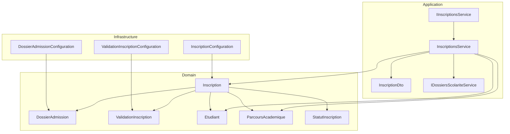

**Diagram sources**
- [Inscription.cs:1-37](file://src/RIIS.Academic.Domain/Inscriptions/Inscription.cs#L1-L37)
- [DossierAdmission.cs:1-17](file://src/RIIS.Academic.Domain/Inscriptions/DossierAdmission.cs#L1-L17)
- [ValidationInscription.cs:1-18](file://src/RIIS.Academic.Domain/Inscriptions/ValidationInscription.cs#L1-L18)
- [StatutInscription.cs:1-10](file://src/RIIS.Academic.Domain/Enums/StatutInscription.cs#L1-L10)
- [IInscriptionsService.cs:1-32](file://src/RIIS.Academic.Application/Inscriptions/Services/IInscriptionsService.cs#L1-L32)
- [InscriptionsService.cs:1-457](file://src/RIIS.Academic.Application/Inscriptions/Services/InscriptionsService.cs#L1-L457)
- [InscriptionDto.cs:1-28](file://src/RIIS.Academic.Application/Inscriptions/Dtos/InscriptionDto.cs#L1-L28)
- [Etudiant.cs:1-28](file://src/RIIS.Academic.Domain/Etudiants/Etudiant.cs#L1-L28)
- [ParcoursAcademique.cs:1-24](file://src/RIIS.Academic.Domain/Parcours/ParcoursAcademique.cs#L1-L24)
- [InscriptionConfiguration.cs:1-37](file://src/RIIS.Academic.Infrastructure/Persistence/Configurations/Inscriptions/InscriptionConfiguration.cs#L1-L37)
- [DossierAdmissionConfiguration.cs:1-27](file://src/RIIS.Academic.Infrastructure/Persistence/Configurations/Inscriptions/DossierAdmissionConfiguration.cs#L1-L27)
- [ValidationInscriptionConfiguration.cs:1-26](file://src/RIIS.Academic.Infrastructure/Persistence/Configurations/Inscriptions/ValidationInscriptionConfiguration.cs#L1-L26)

**Section sources**
- [Inscription.cs:1-37](file://src/RIIS.Academic.Domain/Inscriptions/Inscription.cs#L1-L37)
- [InscriptionsService.cs:1-457](file://src/RIIS.Academic.Application/Inscriptions/Services/InscriptionsService.cs#L1-L457)
- [InscriptionConfiguration.cs:1-37](file://src/RIIS.Academic.Infrastructure/Persistence/Configurations/Inscriptions/InscriptionConfiguration.cs#L1-L37)

## Core Components
- Inscription: Represents a student’s enrollment for an academic year, linking to Etudiant, ParcoursAcademique, NiveauEtude, MaquettePedagogique, ClassePedagogique, and optional DossierAdmission and ValidationInscription. Includes StatutInscription and administrative fields.
- DossierAdmission: Stores admission details tied to an Inscription (e.g., baccalaureate series, year, mention, entry diploma, equivalence).
- ValidationInscription: Captures signatures and validation metadata for an Inscription (student signature, administrator signature, dates, observation).
- StatutInscription: Defines enrollment statuses: EnAttente, Validee, Suspendue, Annulee.
- InscriptionsService: Implements CRUD and lookup operations, enforces business rules during save, and coordinates references and coherence.
- IDossiersScolariteService: Provides school record management, enabling document verification and financial checks that influence whether an enrollment can proceed.

Key responsibilities:
- Create default enrollment templates with current academic year and pending status.
- Save enrollments with validation of required fields, uniqueness, and reference integrity.
- Provide filtered lists and lookups for UI and workflows.
- Integrate with school records to ensure prerequisites are met before validation.

**Section sources**
- [Inscription.cs:1-37](file://src/RIIS.Academic.Domain/Inscriptions/Inscription.cs#L1-L37)
- [DossierAdmission.cs:1-17](file://src/RIIS.Academic.Domain/Inscriptions/DossierAdmission.cs#L1-L17)
- [ValidationInscription.cs:1-18](file://src/RIIS.Academic.Domain/Inscriptions/ValidationInscription.cs#L1-L18)
- [StatutInscription.cs:1-10](file://src/RIIS.Academic.Domain/Enums/StatutInscription.cs#L1-L10)
- [IInscriptionsService.cs:1-32](file://src/RIIS.Academic.Application/Inscriptions/Services/IInscriptionsService.cs#L1-L32)
- [InscriptionsService.cs:95-191](file://src/RIIS.Academic.Application/Inscriptions/Services/InscriptionsService.cs#L95-L191)
- [IDossiersScolariteService.cs:1-40](file://src/RIIS.Academic.Application/Scolarite/Services/IDossiersScolariteService.cs#L1-L40)

## Architecture Overview
The Enrollment System follows clean architecture principles:
- Domain defines entities and enums.
- Application orchestrates use cases via services and DTOs.
- Infrastructure configures persistence and constraints.

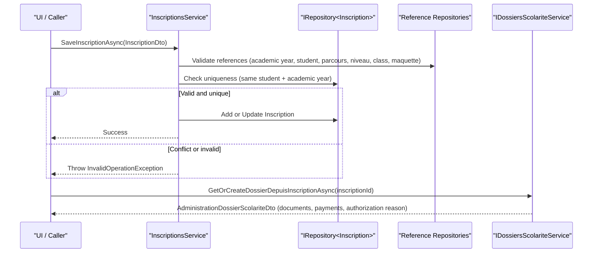

**Diagram sources**
- [InscriptionsService.cs:108-191](file://src/RIIS.Academic.Application/Inscriptions/Services/InscriptionsService.cs#L108-L191)
- [InscriptionConfiguration.cs:10-35](file://src/RIIS.Academic.Infrastructure/Persistence/Configurations/Inscriptions/InscriptionConfiguration.cs#L10-L35)
- [IDossiersScolariteService.cs:21-39](file://src/RIIS.Academic.Application/Scolarite/Services/IDossiersScolariteService.cs#L21-L39)
- [DossiersScolariteService.cs:277-290](file://src/RIIS.Academic.Application/Scolarite/Services/DossiersScolariteService.cs#L277-L290)

## Detailed Component Analysis

### Inscription Lifecycle and Status Transitions
- Creation: Default template created with current academic year and status EnAttente.
- Saving: Validates required fields, ensures references exist and are coherent, prevents duplicate enrollment per academic year, persists changes.
- Validation: When status becomes Validee, a pedagogical class must be assigned; otherwise, saving fails.
- Suspension/Cancellation: Statuses Suspendue and Annulee are available for managing non-active enrollments.

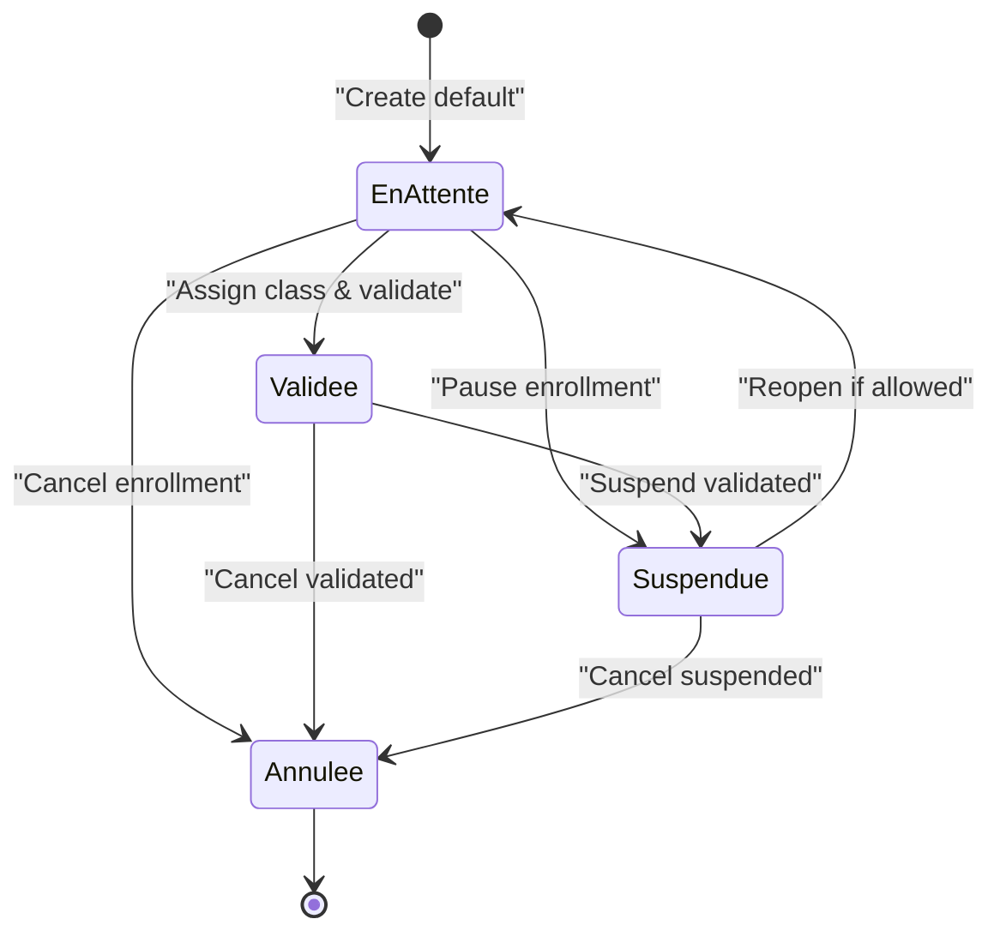

**Diagram sources**
- [StatutInscription.cs:1-10](file://src/RIIS.Academic.Domain/Enums/StatutInscription.cs#L1-L10)
- [InscriptionsService.cs:108-133](file://src/RIIS.Academic.Application/Inscriptions/Services/InscriptionsService.cs#L108-L133)

**Section sources**
- [InscriptionsService.cs:95-191](file://src/RIIS.Academic.Application/Inscriptions/Services/InscriptionsService.cs#L95-L191)
- [StatutInscription.cs:1-10](file://src/RIIS.Academic.Domain/Enums/StatutInscription.cs#L1-L10)

### DossierAdmission Management
- Purpose: Store admission-related data linked to an Inscription.
- Persistence: One-to-one relationship with Inscription; cascade delete configured; includes database check constraint for baccalaureate year range.

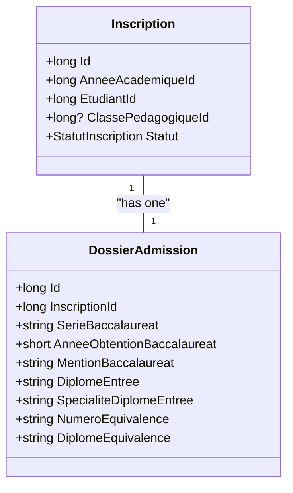

**Diagram sources**
- [Inscription.cs:1-37](file://src/RIIS.Academic.Domain/Inscriptions/Inscription.cs#L1-L37)
- [DossierAdmission.cs:1-17](file://src/RIIS.Academic.Domain/Inscriptions/DossierAdmission.cs#L1-L17)
- [DossierAdmissionConfiguration.cs:10-26](file://src/RIIS.Academic.Infrastructure/Persistence/Configurations/Inscriptions/DossierAdmissionConfiguration.cs#L10-L26)

**Section sources**
- [DossierAdmission.cs:1-17](file://src/RIIS.Academic.Domain/Inscriptions/DossierAdmission.cs#L1-L17)
- [DossierAdmissionConfiguration.cs:1-27](file://src/RIIS.Academic.Infrastructure/Persistence/Configurations/Inscriptions/DossierAdmissionConfiguration.cs#L1-L27)

### ValidationInscription Processes
- Purpose: Capture student and administrative signatures, locations, dates, and observations for enrollment confirmation.
- Persistence: One-to-one relationship with Inscription; cascade delete; unique index on InscriptionId.

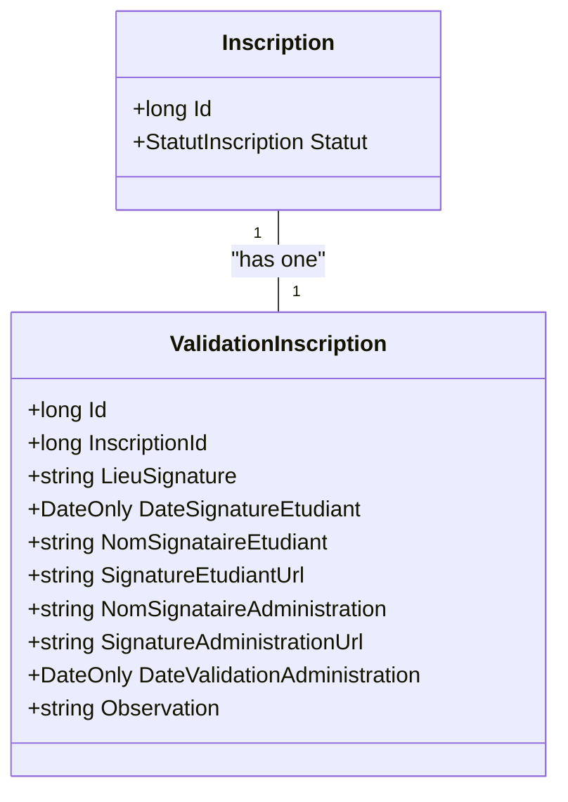

**Diagram sources**
- [Inscription.cs:1-37](file://src/RIIS.Academic.Domain/Inscriptions/Inscription.cs#L1-L37)
- [ValidationInscription.cs:1-18](file://src/RIIS.Academic.Domain/Inscriptions/ValidationInscription.cs#L1-L18)
- [ValidationInscriptionConfiguration.cs:10-24](file://src/RIIS.Academic.Infrastructure/Persistence/Configurations/Inscriptions/ValidationInscriptionConfiguration.cs#L10-L24)

**Section sources**
- [ValidationInscription.cs:1-18](file://src/RIIS.Academic.Domain/Inscriptions/ValidationInscription.cs#L1-L18)
- [ValidationInscriptionConfiguration.cs:1-26](file://src/RIIS.Academic.Infrastructure/Persistence/Configurations/Inscriptions/ValidationInscriptionConfiguration.cs#L1-L26)

### InscriptionsService Implementation and Rules
Key behaviors:
- Default creation: Returns a new InscriptionDto with current academic year and EnAttente status.
- Save validations:
  - Required fields: Academic year, student, parcours, niveau.
  - Class assignment rule: If status is Validee, a pedagogical class must be assigned.
  - Reference integrity: Ensures referenced entities exist and are coherent (e.g., class belongs to academic year, parcours, and niveau; maquette compatible with parcours).
  - Uniqueness: Prevents duplicate enrollment for the same student and academic year.
- Data normalization: Trims nullable text fields to avoid empty strings.
- Lookups: Provides filtered lists for UI components (academic years, students, cycles, parcours, niveaux, classes, maquettes).

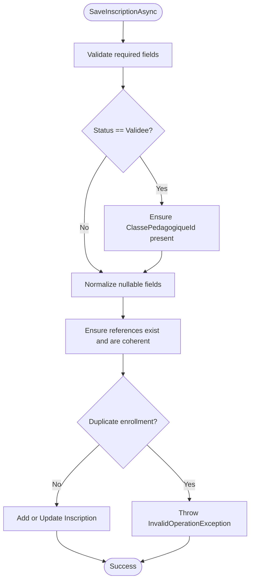

**Diagram sources**
- [InscriptionsService.cs:108-191](file://src/RIIS.Academic.Application/Inscriptions/Services/InscriptionsService.cs#L108-L191)
- [InscriptionsService.cs:313-382](file://src/RIIS.Academic.Application/Inscriptions/Services/InscriptionsService.cs#L313-L382)

**Section sources**
- [InscriptionsService.cs:95-191](file://src/RIIS.Academic.Application/Inscriptions/Services/InscriptionsService.cs#L95-L191)
- [InscriptionsService.cs:313-382](file://src/RIIS.Academic.Application/Inscriptions/Services/InscriptionsService.cs#L313-L382)

### Admission Processing Example
Steps:
- Create or retrieve the student’s DossierAdmission linked to their Inscription.
- Populate admission details (baccalaureate series, year, mention, entry diploma, equivalence).
- Validate baccalaureate year using database constraints.
- Proceed to enrollment creation once admission data is complete.

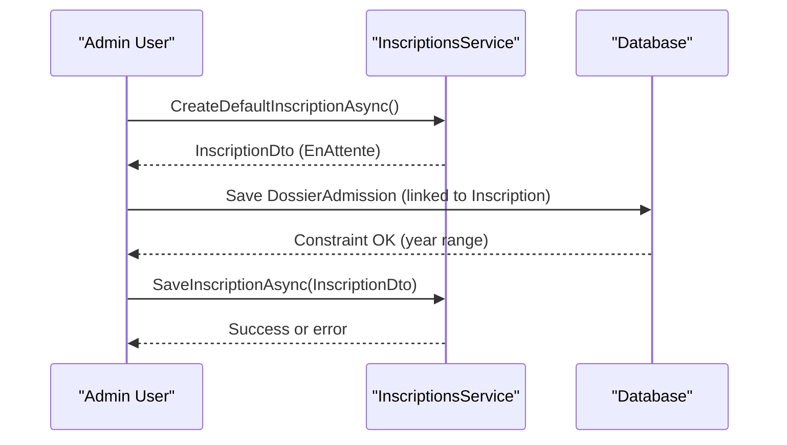

**Diagram sources**
- [InscriptionsService.cs:95-106](file://src/RIIS.Academic.Application/Inscriptions/Services/InscriptionsService.cs#L95-L106)
- [DossierAdmissionConfiguration.cs:10-13](file://src/RIIS.Academic.Infrastructure/Persistence/Configurations/Inscriptions/DossierAdmissionConfiguration.cs#L10-L13)

**Section sources**
- [InscriptionsService.cs:95-106](file://src/RIIS.Academic.Application/Inscriptions/Services/InscriptionsService.cs#L95-L106)
- [DossierAdmissionConfiguration.cs:1-27](file://src/RIIS.Academic.Infrastructure/Persistence/Configurations/Inscriptions/DossierAdmissionConfiguration.cs#L1-L27)

### Enrollment Creation Example
Steps:
- Prepare InscriptionDto with required references (academic year, student, parcours, niveau).
- Optionally assign pedagogical class and maquette.
- Save via service; conflicts or missing references raise exceptions.

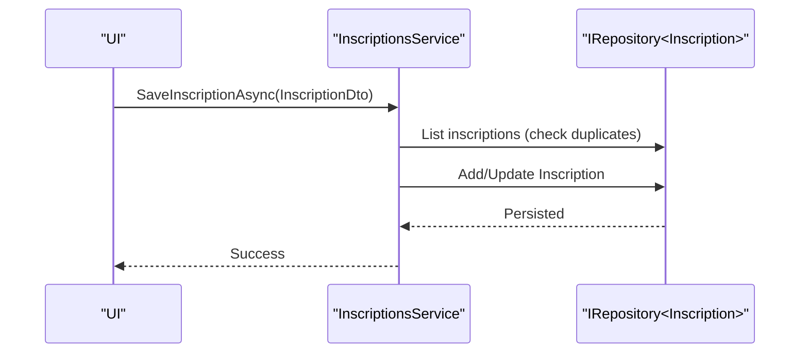

**Diagram sources**
- [InscriptionsService.cs:108-191](file://src/RIIS.Academic.Application/Inscriptions/Services/InscriptionsService.cs#L108-L191)

**Section sources**
- [InscriptionsService.cs:108-191](file://src/RIIS.Academic.Application/Inscriptions/Services/InscriptionsService.cs#L108-L191)

### Document Verification and Enrollment Confirmation
- Verify administrative documents and initial payment through school records service.
- Use administration summary to determine if enrollment can proceed (authorization reason indicates completion or conditions).
- Confirm enrollment by setting status to Validee and assigning a pedagogical class; capture signatures in ValidationInscription.

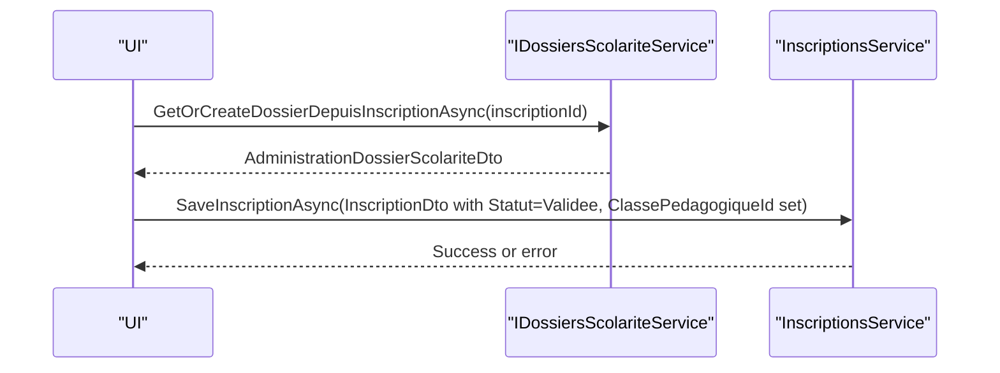

**Diagram sources**
- [IDossiersScolariteService.cs:21-39](file://src/RIIS.Academic.Application/Scolarite/Services/IDossiersScolariteService.cs#L21-L39)
- [DossiersScolariteService.cs:277-290](file://src/RIIS.Academic.Application/Scolarite/Services/DossiersScolariteService.cs#L277-L290)
- [InscriptionsService.cs:108-133](file://src/RIIS.Academic.Application/Inscriptions/Services/InscriptionsService.cs#L108-L133)

**Section sources**
- [IDossiersScolariteService.cs:1-40](file://src/RIIS.Academic.Application/Scolarite/Services/IDossiersScolariteService.cs#L1-L40)
- [DossiersScolariteService.cs:277-290](file://src/RIIS.Academic.Application/Scolarite/Services/DossiersScolariteService.cs#L277-L290)
- [InscriptionsService.cs:108-133](file://src/RIIS.Academic.Application/Inscriptions/Services/InscriptionsService.cs#L108-L133)

### Enrollment Conflicts and Prerequisites Checking
- Conflicts: Duplicate enrollment for the same student and academic year is prevented at save time.
- Prerequisites:
  - Class assignment required when validating enrollment.
  - Class must belong to the academic year, parcours, and niveau of the enrollment.
  - Maquette must be compatible with the parcours (cycle, level, filiere, speciality match).

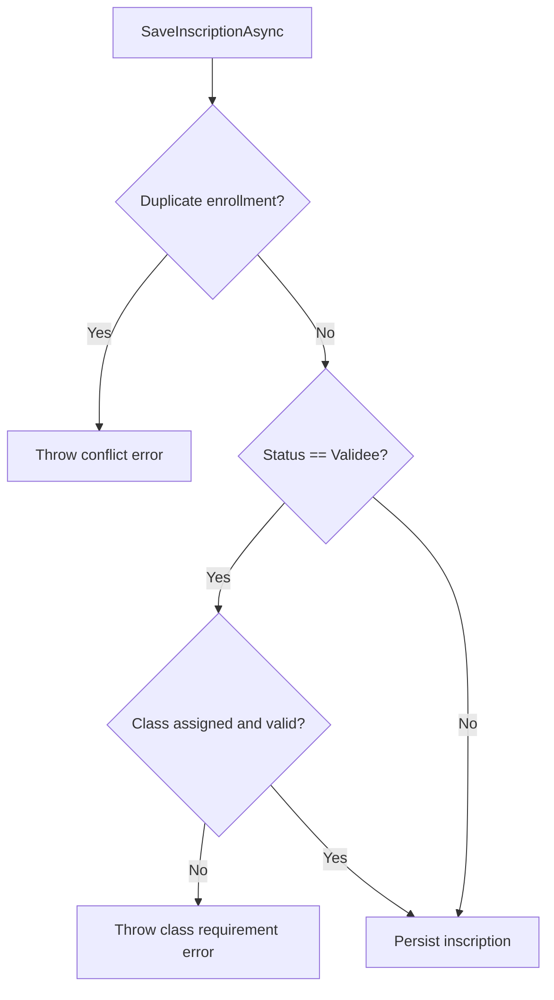

**Diagram sources**
- [InscriptionsService.cs:108-191](file://src/RIIS.Academic.Application/Inscriptions/Services/InscriptionsService.cs#L108-L191)
- [InscriptionsService.cs:313-382](file://src/RIIS.Academic.Application/Inscriptions/Services/InscriptionsService.cs#L313-L382)

**Section sources**
- [InscriptionsService.cs:108-191](file://src/RIIS.Academic.Application/Inscriptions/Services/InscriptionsService.cs#L108-L191)
- [InscriptionsService.cs:313-382](file://src/RIIS.Academic.Application/Inscriptions/Services/InscriptionsService.cs#L313-L382)

### Enrollment Cancellation Procedures
- Set status to Annulee to cancel an enrollment.
- Deletion is supported via service method; consider auditing and downstream effects before deletion.

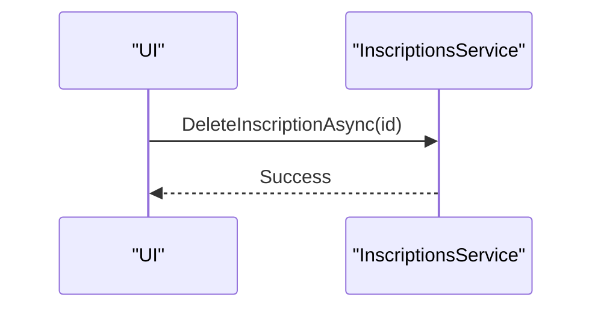

**Diagram sources**
- [InscriptionsService.cs:193-197](file://src/RIIS.Academic.Application/Inscriptions/Services/InscriptionsService.cs#L193-L197)

**Section sources**
- [InscriptionsService.cs:193-197](file://src/RIIS.Academic.Application/Inscriptions/Services/InscriptionsService.cs#L193-L197)

## Dependency Analysis
- InscriptionsService depends on multiple repositories for reference integrity checks and list operations.
- Inscription entity has strong relationships with Etudiant, ParcoursAcademique, NiveauEtude, MaquettePedagogique, ClassePedagogique, DossierAdmission, and ValidationInscription.
- Database constraints enforce uniqueness and referential integrity.

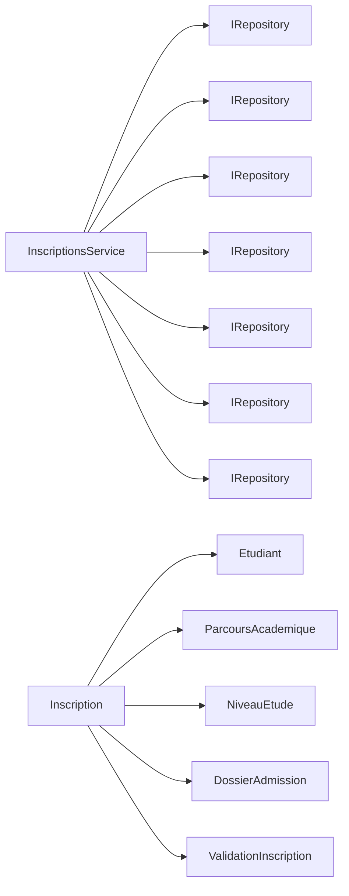

**Diagram sources**
- [InscriptionsService.cs:8-16](file://src/RIIS.Academic.Application/Inscriptions/Services/InscriptionsService.cs#L8-L16)
- [Inscription.cs:1-37](file://src/RIIS.Academic.Domain/Inscriptions/Inscription.cs#L1-L37)

**Section sources**
- [InscriptionsService.cs:8-16](file://src/RIIS.Academic.Application/Inscriptions/Services/InscriptionsService.cs#L8-L16)
- [Inscription.cs:1-37](file://src/RIIS.Academic.Domain/Inscriptions/Inscription.cs#L1-L37)

## Performance Considerations
- Filtering and lookups: Services load full reference sets into memory for filtering; consider pagination or server-side queries for large datasets.
- Indexing: Unique indexes on (AnneeAcademiqueId, EtudiantId) and CodeAdministration improve conflict detection and lookup performance.
- Normalization: Trimming nullable fields reduces storage overhead and avoids accidental empty-string entries.

[No sources needed since this section provides general guidance]

## Troubleshooting Guide
Common errors and resolutions:
- Missing required fields: Ensure academic year, student, parcours, and niveau are provided before saving.
- Class assignment required for validation: Assign a pedagogical class when setting status to Validee.
- Reference mismatch: Verify that selected class belongs to the academic year, parcours, and niveau; ensure maquette matches parcours attributes.
- Duplicate enrollment: Avoid creating another enrollment for the same student and academic year; update existing instead.
- School records prerequisites: Use IDossiersScolariteService to verify documents and payments; address incomplete items or unpaid fees before confirming enrollment.

**Section sources**
- [InscriptionsService.cs:108-191](file://src/RIIS.Academic.Application/Inscriptions/Services/InscriptionsService.cs#L108-L191)
- [InscriptionsService.cs:313-382](file://src/RIIS.Academic.Application/Inscriptions/Services/InscriptionsService.cs#L313-L382)
- [IDossiersScolariteService.cs:21-39](file://src/RIIS.Academic.Application/Scolarite/Services/IDossiersScolariteService.cs#L21-L39)

## Conclusion
The Enrollment System provides a robust framework for managing student enrollments from admission through validation. The Inscription entity serves as the central anchor, with DossierAdmission capturing admission details and ValidationInscription recording confirmations. InscriptionsService enforces critical business rules, ensuring data integrity and preventing conflicts. Integration with school records enables comprehensive document verification and financial checks, supporting informed enrollment decisions. Proper use of statuses and references allows flexible handling of enrollment lifecycles, including suspension and cancellation.

[No sources needed since this section summarizes without analyzing specific files]