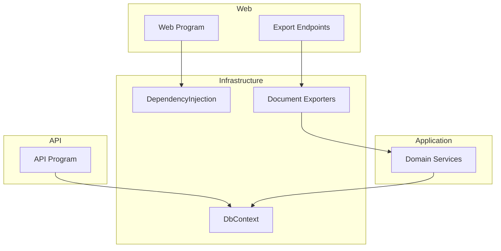
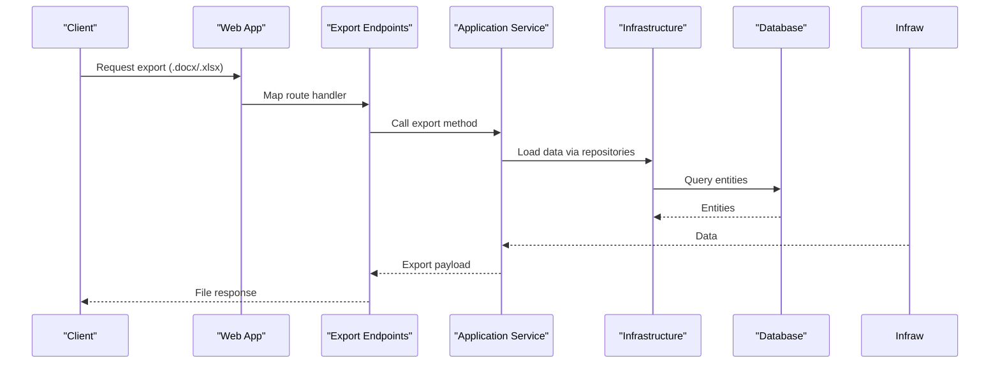
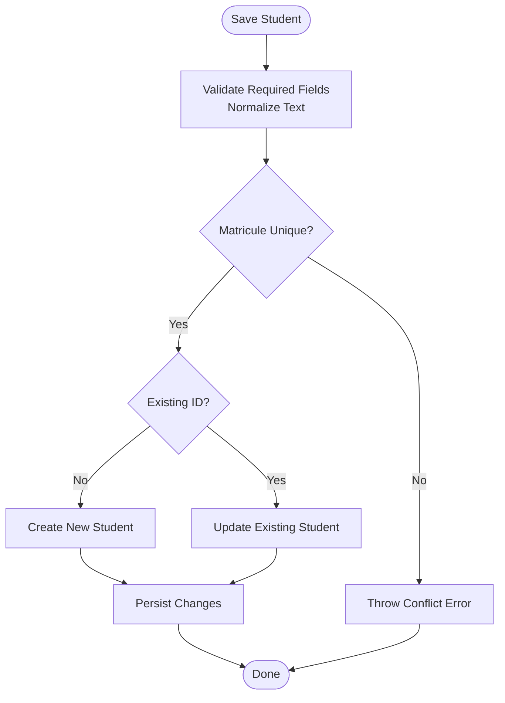
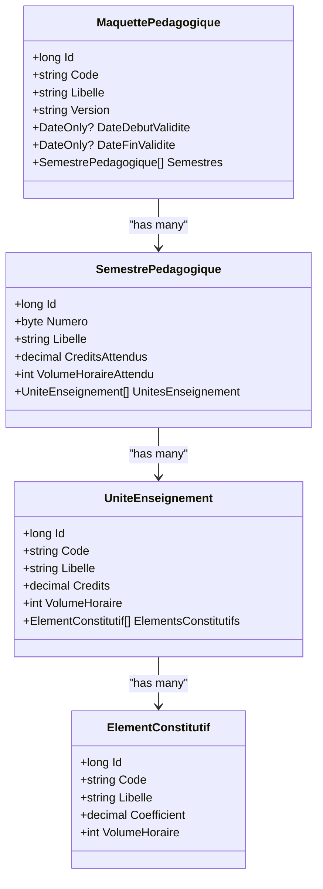
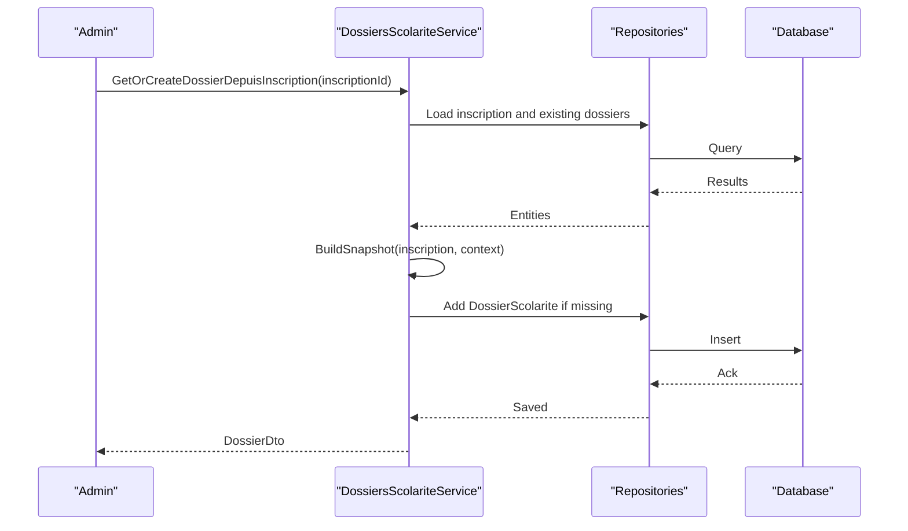
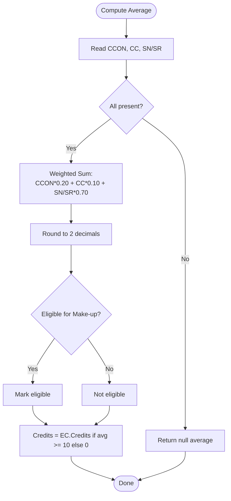
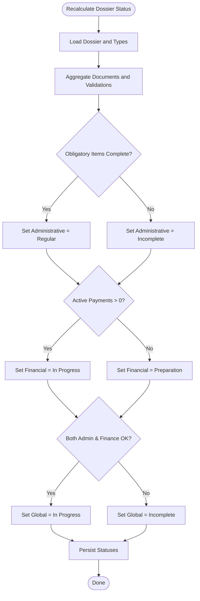
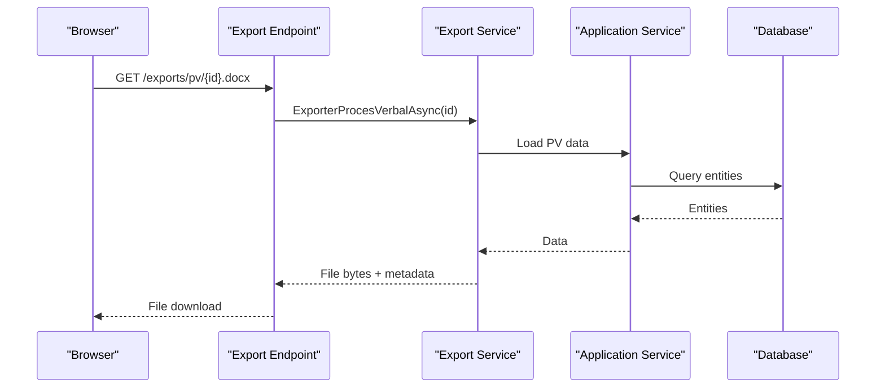
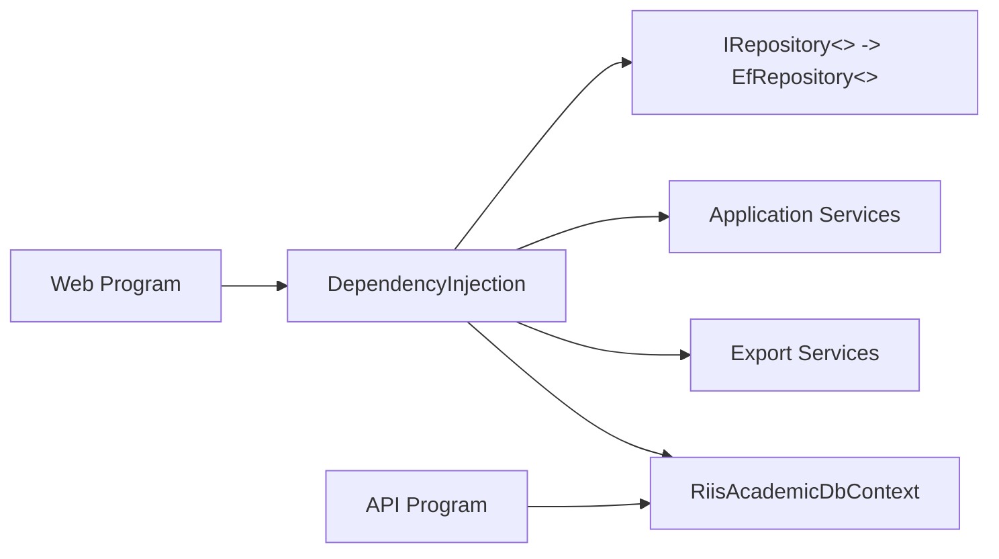

# Feature Modules

<cite>
**Referenced Files in This Document**
- [Program.cs](file://RIIS.Academic.Api/Program.cs)
- [Program.cs](file://RIIS.Academic.Web/Program.cs)
- [DependencyInjection.cs](file://RIIS.Academic.Infrastructure/DependencyInjection.cs)
- [RiisAcademicDbContext.cs](file://RIIS.Academic.Infrastructure/Persistence/RiisAcademicDbContext.cs)
- [Etudiant.cs](file://RIIS.Academic.Domain/Etudiants/Etudiant.cs)
- [Inscription.cs](file://RIIS.Academic.Domain/Inscriptions/Inscription.cs)
- [MaquettePedagogique.cs](file://RIIS.Academic.Domain/Programmes/MaquettePedagogique.cs)
- [DossierScolarite.cs](file://RIIS.Academic.Domain/Scolarite/DossierScolarite.cs)
- [StatutInscription.cs](file://RIIS.Academic.Domain/Enums/StatutInscription.cs)
- [DecisionAcademique.cs](file://RIIS.Academic.Domain/Enums/DecisionAcademique.cs)
- [EtudiantsService.cs](file://RIIS.Academic.Application/Etudiants/Services/EtudiantsService.cs)
- [ProgrammePedagogiqueService.cs](file://RIIS.Academic.Application/Programmes/Services/ProgrammePedagogiqueService.cs)
- [CalculNotesService.cs](file://RIIS.Academic.Application/Notes/Services/CalculNotesService.cs)
- [SaisieNotesService.cs](file://RIIS.Academic.Application/Notes/Services/SaisieNotesService.cs)
- [DossiersScolariteService.cs](file://RIIS.Academic.Application/Scolarite/Services/DossiersScolariteService.cs)
- [RiisAcademicExportEndpointExtensions.cs](file://RIIS.Academic.Web/Extensions/RiisAcademicExportEndpointExtensions.cs)
</cite>

## Table of Contents
1. Introduction
2. Project Structure
3. Core Components
4. Architecture Overview
5. Detailed Component Analysis
6. Dependency Analysis
7. Performance Considerations
8. Troubleshooting Guide
9. Conclusion

## Introduction
This document provides comprehensive feature module documentation for the RIIS Academic Management System. It covers student lifecycle management, academic program structure, enrollment workflows, grade calculation engine, financial administration, and document generation. For each module, it explains business processes, user workflows, data models, system interactions, configuration options, customization points, integration scenarios, common use cases, edge cases, and troubleshooting guidance with practical examples.

## Project Structure
The solution follows a clean architecture with clear separation between API, Web UI, Application services, Domain entities, and Infrastructure (persistence and exports). The Web app bootstraps Radzen components, Razor interactive server rendering, and registers infrastructure dependencies. The API exposes controllers and configures Entity Framework with SQL Server. The application layer contains domain-specific services and DTOs. The domain layer defines core entities and enums. The infrastructure layer implements persistence via EF Core and document export services.

**Diagram sources**
- [Program.cs:1-27](file://RIIS.Academic.Web/Program.cs#L1-L27)
- [Program.cs:1-18](file://RIIS.Academic.Api/Program.cs#L1-L18)
- [DependencyInjection.cs:23-60](file://RIIS.Academic.Infrastructure/DependencyInjection.cs#L23-L60)
- [RiisAcademicDbContext.cs:6-49](file://RIIS.Academic.Infrastructure/Persistence/RiisAcademicDbContext.cs#L6-L49)
- [RiisAcademicExportEndpointExtensions.cs:9-91](file://RIIS.Academic.Web/Extensions/RiisAcademicExportEndpointExtensions.cs#L9-L91)

**Section sources**
- [Program.cs:1-27](file://RIIS.Academic.Web/Program.cs#L1-L27)
- [Program.cs:1-18](file://RIIS.Academic.Api/Program.cs#L1-L18)
- [DependencyInjection.cs:23-60](file://RIIS.Academic.Infrastructure/DependencyInjection.cs#L23-L60)
- [RiisAcademicDbContext.cs:6-49](file://RIIS.Academic.Infrastructure/Persistence/RiisAcademicDbContext.cs#L6-L49)

## Core Components
- Student Lifecycle Management: CRUD operations on students, search, validation, and matricule uniqueness enforcement.
- Academic Program Structure: Hierarchical model of pedagogical blueprints, semesters, teaching units, and constituent elements; creation, validation, and hierarchy queries.
- Enrollment Workflows: Inscription records linking students to academic years, programs, levels, classes, and administrative/financial dossiers.
- Grade Calculation Engine: Weighted average computation per constituent element, eligibility for make-up sessions, and credit acquisition logic.
- Financial Administration: Dossier scolarite lifecycle, administrative document synchronization, validations, payment tracking, and status roll-up.
- Document Generation: Word and Excel exports for academic records and official documents via dedicated endpoints.

**Section sources**
- [EtudiantsService.cs:9-127](file://RIIS.Academic.Application/Etudiants/Services/EtudiantsService.cs#L9-L127)
- [ProgrammePedagogiqueService.cs:19-232](file://RIIS.Academic.Application/Programmes/Services/ProgrammePedagogiqueService.cs#L19-L232)
- [Inscription.cs:1-37](file://RIIS.Academic.Domain/Inscriptions/Inscription.cs#L1-L37)
- [CalculNotesService.cs:7-24](file://RIIS.Academic.Application/Notes/Services/CalculNotesService.cs#L7-L24)
- [DossiersScolariteService.cs:23-317](file://RIIS.Academic.Application/Scolarite/Services/DossiersScolariteService.cs#L23-L317)
- [RiisAcademicExportEndpointExtensions.cs:9-91](file://RIIS.Academic.Web/Extensions/RiisAcademicExportEndpointExtensions.cs#L9-L91)

## Architecture Overview
The system uses dependency injection to wire application services and repositories. The Web app registers infrastructure services and maps export endpoints. The API configures EF Core with SQL Server. The DbContext declares all entity sets and applies configurations from assembly.

**Diagram sources**
- [RiisAcademicExportEndpointExtensions.cs:9-91](file://RIIS.Academic.Web/Extensions/RiisAcademicExportEndpointExtensions.cs#L9-L91)
- [DependencyInjection.cs:23-60](file://RIIS.Academic.Infrastructure/DependencyInjection.cs#L23-L60)
- [RiisAcademicDbContext.cs:6-49](file://RIIS.Academic.Infrastructure/Persistence/RiisAcademicDbContext.cs#L6-L49)

**Section sources**
- [Program.cs:1-27](file://RIIS.Academic.Web/Program.cs#L1-L27)
- [Program.cs:1-18](file://RIIS.Academic.Api/Program.cs#L1-L18)
- [DependencyInjection.cs:23-60](file://RIIS.Academic.Infrastructure/DependencyInjection.cs#L23-L60)
- [RiisAcademicDbContext.cs:6-49](file://RIIS.Academic.Infrastructure/Persistence/RiisAcademicDbContext.cs#L6-L49)

## Detailed Component Analysis

### Student Lifecycle Management
Business process: Create, update, delete, and search students with validation and uniqueness constraints. User workflow: Admin enters student details; system validates required fields, normalizes text, checks matricule uniqueness, and persists changes. Data model: Student entity with personal details, contacts, and relationships to enrollments. System interactions: Application service uses repository abstraction to list, add, update, and delete; DTOs map to/from domain entities. Configuration/customization: Search normalization, default values, and error messages can be extended. Integration scenarios: Enrollments reference students; grades and results are linked through enrollments.

**Diagram sources**
- [EtudiantsService.cs:53-127](file://RIIS.Academic.Application/Etudiants/Services/EtudiantsService.cs#L53-L127)

**Section sources**
- [Etudiant.cs:1-28](file://RIIS.Academic.Domain/Etudiants/Etudiant.cs#L1-L28)
- [EtudiantsService.cs:9-127](file://RIIS.Academic.Application/Etudiants/Services/EtudiantsService.cs#L9-L127)

### Academic Program Structure
Business process: Define pedagogical blueprints (programs), semesters, teaching units, and constituent elements with hierarchical organization and validation. User workflow: Administrators create blueprints, add semesters, define units, and configure constituent elements with credits, coefficients, and hours. Data model: Blueprint, semester, unit, and constituent element entities with relationships and ordering. System interactions: Service methods provide hierarchy queries, lookups, and CRUD operations with duplicate prevention and constraint validation. Configuration/customization: Display order, mandatory flags, and validity dates allow flexible program design. Integration scenarios: Classes and evaluations link to blueprints and semesters; results aggregate at unit and semester levels.

**Diagram sources**
- [MaquettePedagogique.cs:5-31](file://RIIS.Academic.Domain/Programmes/MaquettePedagogique.cs#L5-L31)
- [ProgrammePedagogiqueService.cs:19-232](file://RIIS.Academic.Application/Programmes/Services/ProgrammePedagogiqueService.cs#L19-L232)

**Section sources**
- [ProgrammePedagogiqueService.cs:19-232](file://RIIS.Academic.Application/Programmes/Services/ProgrammePedagogiqueService.cs#L19-L232)

### Enrollment Workflows
Business process: Register students into academic years, programs, levels, and classes; manage admission and validation records; generate administrative dossiers. User workflow: Enrollment entry links student to academic context; system creates or retrieves dossier scolarite; statuses reflect administrative and financial progress. Data model: Inscription entity with references to academic year, student, program, level, blueprint, class, admission, validation, and dossier scolarite. System interactions: Dossiers scolarite service builds snapshots from enrollment context and synchronizes administrative items based on configured types. Configuration/customization: Administrative item types drive document and validation requirements; statuses roll up to global dossier state. Integration scenarios: Grades and results attach to enrollments; payments and notifications attach to dossiers.

**Diagram sources**
- [DossiersScolariteService.cs:277-317](file://RIIS.Academic.Application/Scolarite/Services/DossiersScolariteService.cs#L277-L317)
- [Inscription.cs:1-37](file://RIIS.Academic.Domain/Inscriptions/Inscription.cs#L1-L37)

**Section sources**
- [Inscription.cs:1-37](file://RIIS.Academic.Domain/Inscriptions/Inscription.cs#L1-L37)
- [StatutInscription.cs:1-10](file://RIIS.Academic.Domain/Enums/StatutInscription.cs#L1-L10)
- [DossiersScolariteService.cs:277-317](file://RIIS.Academic.Application/Scolarite/Services/DossiersScolariteService.cs#L277-L317)

### Grade Calculation Engine
Business process: Compute weighted averages per constituent element using controlled continuous, knowledge control, and session scores; determine eligibility for make-up sessions; calculate acquired credits based on thresholds. User workflow: Teachers enter evaluation scores; system computes averages and credits; administrators review decisions. Data model: Evaluation, note, and result entities linked to constituent elements and semesters. System interactions: Calculation service encapsulates formula and rules; grading service prepares grids and saves notes with presence and observations. Configuration/customization: Weights and thresholds are defined in calculation logic; evaluation barems constrain score ranges. Integration scenarios: Results feed into semester and annual outcomes; decisions influence progression and re-examination eligibility.

**Diagram sources**
- [CalculNotesService.cs:7-24](file://RIIS.Academic.Application/Notes/Services/CalculNotesService.cs#L7-L24)
- [SaisieNotesService.cs:126-228](file://RIIS.Academic.Application/Notes/Services/SaisieNotesService.cs#L126-L228)

**Section sources**
- [CalculNotesService.cs:7-24](file://RIIS.Academic.Application/Notes/Services/CalculNotesService.cs#L7-L24)
- [SaisieNotesService.cs:126-228](file://RIIS.Academic.Application/Notes/Services/SaisieNotesService.cs#L126-L228)
- [DecisionAcademique.cs:1-10](file://RIIS.Academic.Domain/Enums/DecisionAcademique.cs#L1-L10)

### Financial Administration
Business process: Manage administrative dossiers including document synchronization, validations, payments, and status roll-up. User workflow: Admin synchronizes required documents and validations per configured types; updates document status and validation decisions; system recalculates administrative, financial, and global statuses. Data model: Dossier scolarite with snapshot fields, statuses, and collections for elements, payments, and notifications. System interactions: Service builds administration view by aggregating types, elements, documents, validations, and payments; recalculates statuses based on completeness and payments. Configuration/customization: Type definitions drive whether items require documents or validations; active filters and display orders shape UI. Integration scenarios: Payments affect financial status; administrative completeness influences authorization reasons.

**Diagram sources**
- [DossiersScolariteService.cs:254-275](file://RIIS.Academic.Application/Scolarite/Services/DossiersScolariteService.cs#L254-L275)
- [DossierScolarite.cs:1-29](file://RIIS.Academic.Domain/Scolarite/DossierScolarite.cs#L1-L29)

**Section sources**
- [DossierScolarite.cs:1-29](file://RIIS.Academic.Domain/Scolarite/DossierScolarite.cs#L1-L29)
- [DossiersScolariteService.cs:254-275](file://RIIS.Academic.Application/Scolarite/Services/DossiersScolariteService.cs#L254-L275)

### Document Generation
Business process: Generate Word and Excel files for academic records and official documents. User workflow: Users request exports via endpoints; system loads data and renders templates; files are returned for download. Data model: Export DTOs and template-based content. System interactions: Export endpoints delegate to specialized services that produce byte streams with appropriate MIME types and filenames. Configuration/customization: Templates and export formats can be extended; endpoint routes define available outputs. Integration scenarios: Exports depend on processed results and validated dossiers; they may include grades, decisions, and administrative summaries.

**Diagram sources**
- [RiisAcademicExportEndpointExtensions.cs:11-25](file://RIIS.Academic.Web/Extensions/RiisAcademicExportEndpointExtensions.cs#L11-L25)

**Section sources**
- [RiisAcademicExportEndpointExtensions.cs:9-91](file://RIIS.Academic.Web/Extensions/RiisAcademicExportEndpointExtensions.cs#L9-L91)

## Dependency Analysis
The system’s dependencies are wired via dependency injection. The Web app registers infrastructure services, including repositories and application services. The API configures EF Core with SQL Server. The DbContext aggregates all entity sets and applies configurations from the assembly.

**Diagram sources**
- [DependencyInjection.cs:23-60](file://RIIS.Academic.Infrastructure/DependencyInjection.cs#L23-L60)
- [Program.cs:1-27](file://RIIS.Academic.Web/Program.cs#L1-L27)
- [Program.cs:1-18](file://RIIS.Academic.Api/Program.cs#L1-L18)
- [RiisAcademicDbContext.cs:6-49](file://RIIS.Academic.Infrastructure/Persistence/RiisAcademicDbContext.cs#L6-L49)

**Section sources**
- [DependencyInjection.cs:23-60](file://RIIS.Academic.Infrastructure/DependencyInjection.cs#L23-L60)
- [Program.cs:1-27](file://RIIS.Academic.Web/Program.cs#L1-L27)
- [Program.cs:1-18](file://RIIS.Academic.Api/Program.cs#L1-L18)
- [RiisAcademicDbContext.cs:6-49](file://RIIS.Academic.Infrastructure/Persistence/RiisAcademicDbContext.cs#L6-L49)

## Performance Considerations
- Use repository abstractions to batch queries where possible and avoid N+1 patterns when building hierarchy views.
- Cache lookup lists (e.g., academic years, cycles, programs) in memory for read-heavy dashboards.
- Apply filtering early in queries (e.g., filter by academic year, cycle, or class) to reduce dataset sizes.
- Avoid loading entire entity graphs unless necessary; project to DTOs for large responses.
- For exports, stream file generation to minimize memory usage.

[No sources needed since this section provides general guidance]

## Troubleshooting Guide
Common issues and resolutions:
- Duplicate matricule: Occurs when saving a student with an existing matricule; ensure uniqueness before save.
- Invalid semester number or negative credits: Validation errors during program setup; correct inputs within allowed ranges.
- Class-year mismatch for evaluations: Saving notes requires matching academic year; verify class and evaluation alignment.
- Missing prerequisite results for make-up sessions: Grading grid warns if no semester results exist; compute results first.
- Dossier incomplete: Administrative or financial statuses remain incomplete until obligations are met; synchronize documents and record initial payments.

**Section sources**
- [EtudiantsService.cs:62-73](file://RIIS.Academic.Application/Etudiants/Services/EtudiantsService.cs#L62-L73)
- [ProgrammePedagogiqueService.cs:290-322](file://RIIS.Academic.Application/Programmes/Services/ProgrammePedagogiqueService.cs#L290-L322)
- [SaisieNotesService.cs:137-140](file://RIIS.Academic.Application/Notes/Services/SaisieNotesService.cs#L137-L140)
- [SaisieNotesService.cs:164-184](file://RIIS.Academic.Application/Notes/Services/SaisieNotesService.cs#L164-L184)
- [DossiersScolariteService.cs:254-275](file://RIIS.Academic.Application/Scolarite/Services/DossiersScolariteService.cs#L254-L275)

## Conclusion
The RIIS Academic Management System provides robust modules for managing students, academic programs, enrollments, grades, finances, and documents. Its clean architecture enables clear separation of concerns, extensibility, and maintainability. By following the documented workflows, configurations, and troubleshooting steps, users can effectively operate and customize the system to meet institutional needs.

[No sources needed since this section summarizes without analyzing specific files]