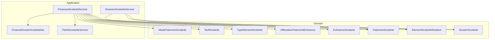
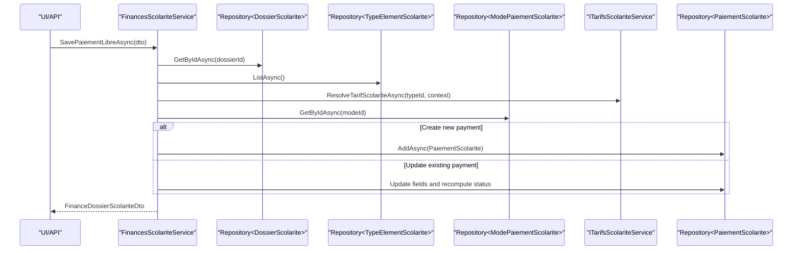
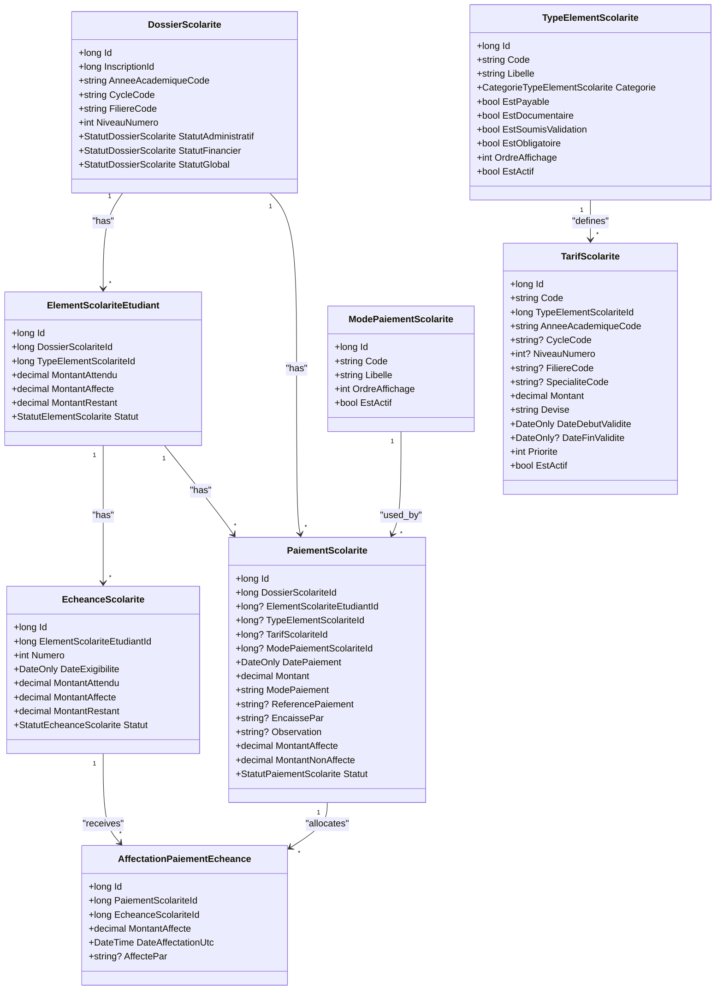
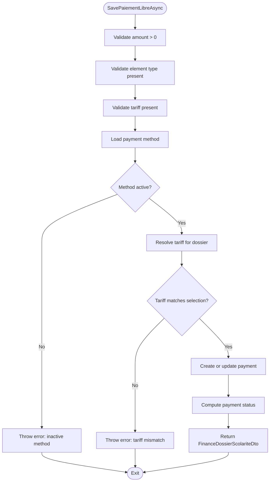
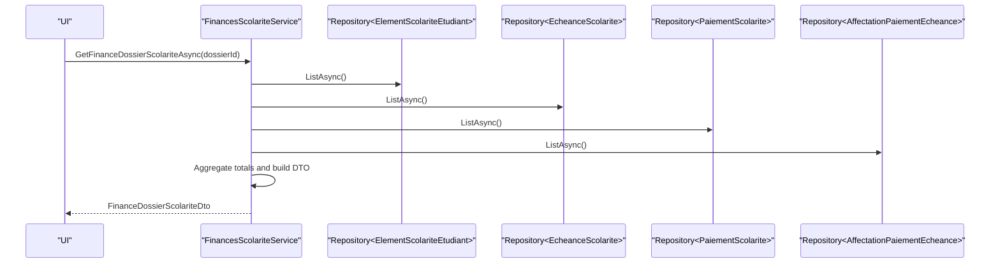
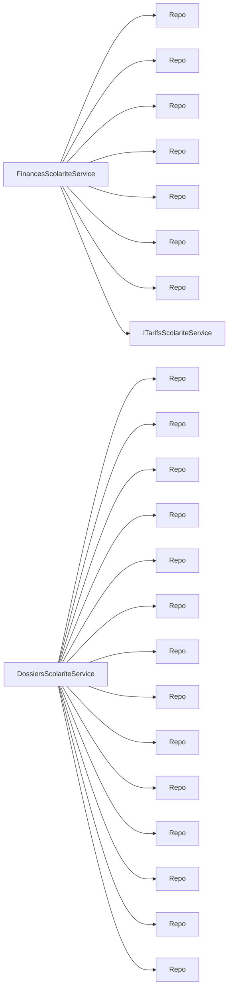

# Financial Administration

<cite>
**Referenced Files in This Document**
- [DossierScolarite.cs](file://RIIS.Academic.Domain/Scolarite/DossierScolarite.cs)
- [PaiementScolarite.cs](file://RIIS.Academic.Domain/Scolarite/PaiementScolarite.cs)
- [EcheanceScolarite.cs](file://RIIS.Academic.Domain/Scolarite/EcheanceScolarite.cs)
- [ElementScolariteEtudiant.cs](file://RIIS.Academic.Domain/Scolarite/ElementScolariteEtudiant.cs)
- [AffectationPaiementEcheance.cs](file://RIIS.Academic.Domain/Scolarite/AffectationPaiementEcheance.cs)
- [TypeElementScolarite.cs](file://RIIS.Academic.Domain/Scolarite/TypeElementScolarite.cs)
- [TarifScolarite.cs](file://RIIS.Academic.Domain/Scolarite/TarifScolarite.cs)
- [ModePaiementScolarite.cs](file://RIIS.Academic.Domain/Scolarite/ModePaiementScolarite.cs)
- [StatutPaiementScolarite.cs](file://RIIS.Academic.Domain/Enums/StatutPaiementScolarite.cs)
- [StatutEcheanceScolarite.cs](file://RIIS.Academic.Domain/Enums/StatutEcheanceScolarite.cs)
- [FinancesScolariteService.cs](file://RIIS.Academic.Application/Scolarite/Services/FinancesScolariteService.cs)
- [IFinancesScolariteService.cs](file://RIIS.Academic.Application/Scolarite/Services/IFinancesScolariteService.cs)
- [ITarifsScolariteService.cs](file://RIIS.Academic.Application/Scolarite/Services/ITarifsScolariteService.cs)
- [DossiersScolariteService.cs](file://RIIS.Academic.Application/Scolarite/Services/DossiersScolariteService.cs)
- [FinanceDossierScolariteDto.cs](file://RIIS.Academic.Application/Scolarite/Dtos/FinanceDossierScolariteDto.cs)
</cite>

## Table of Contents
1. Introduction
2. Project Structure
3. Core Components
4. Architecture Overview
5. Detailed Component Analysis
6. Dependency Analysis
7. Performance Considerations
8. Troubleshooting Guide
9. Conclusion

## Introduction
This document explains the Financial Administration module for tuition fee management, payment processing, and financial reporting. It focuses on:
- The DossierScolarite entity as the central student financial record
- PaiementScolarite transactions representing payments
- EcheanceScolarite scheduling for due dates and installments
- FinancesScolariteService for payment recording, validation, and financial status tracking
- DossiersScolariteService for administrative synchronization and overall dossier status computation
- Fee configuration via TypeElementScolarite and TarifScolarite
- Payment methods via ModePaiementScolarite
- Late payment handling through EcheanceScolarite statuses
- Scholarship and other non-tuition elements via configurable element types
- Financial reconciliation using AffectationPaiementEcheance to allocate payments to deadlines

## Project Structure
The Financial Administration spans Domain entities, Application services, and DTOs:
- Domain layer defines core business models and enumerations
- Application layer provides services that orchestrate operations and build DTOs for UI or APIs
- DTOs encapsulate read/write contracts for finance views and payment workflows

**Diagram sources**
- [DossierScolarite.cs:1-29](file://RIIS.Academic.Domain/Scolarite/DossierScolarite.cs#L1-L29)
- [ElementScolariteEtudiant.cs:1-26](file://RIIS.Academic.Domain/Scolarite/ElementScolariteEtudiant.cs#L1-L26)
- [PaiementScolarite.cs:1-29](file://RIIS.Academic.Domain/Scolarite/PaiementScolarite.cs#L1-L29)
- [EcheanceScolarite.cs:1-20](file://RIIS.Academic.Domain/Scolarite/EcheanceScolarite.cs#L1-L20)
- [AffectationPaiementEcheance.cs:1-15](file://RIIS.Academic.Domain/Scolarite/AffectationPaiementEcheance.cs#L1-L15)
- [TypeElementScolarite.cs:1-19](file://RIIS.Academic.Domain/Scolarite/TypeElementScolarite.cs#L1-L19)
- [TarifScolarite.cs:1-22](file://RIIS.Academic.Domain/Scolarite/TarifScolarite.cs#L1-L22)
- [ModePaiementScolarite.cs:1-13](file://RIIS.Academic.Domain/Scolarite/ModePaiementScolarite.cs#L1-L13)
- [FinancesScolariteService.cs:1-361](file://RIIS.Academic.Application/Scolarite/Services/FinancesScolariteService.cs#L1-L361)
- [DossiersScolariteService.cs:1-614](file://RIIS.Academic.Application/Scolarite/Services/DossiersScolariteService.cs#L1-L614)
- [ITarifsScolariteService.cs:1-38](file://RIIS.Academic.Application/Scolarite/Services/ITarifsScolariteService.cs#L1-L38)
- [FinanceDossierScolariteDto.cs:1-84](file://RIIS.Academic.Application/Scolarite/Dtos/FinanceDossierScolariteDto.cs#L1-L84)

**Section sources**
- [DossierScolarite.cs:1-29](file://RIIS.Academic.Domain/Scolarite/DossierScolarite.cs#L1-L29)
- [FinancesScolariteService.cs:1-361](file://RIIS.Academic.Application/Scolarite/Services/FinancesScolariteService.cs#L1-L361)
- [DossiersScolariteService.cs:1-614](file://RIIS.Academic.Application/Scolarite/Services/DossiersScolariteService.cs#L1-L614)

## Core Components
- DossierScolarite: Central financial snapshot per student enrollment with administrative, financial, and global statuses; links to elements, payments, and notifications.
- ElementScolariteEtudiant: Per-student line items (tuition, fees, scholarships) with expected, allocated, and remaining amounts; hosts deadlines and documents.
- EcheanceScolarite: Installment schedule per element with due date, expected amount, allocated amount, remaining balance, and status including late handling.
- PaiementScolarite: Payment records linked to a dossier and optionally to an element/tariff/payment method; tracks total, allocated, unallocated, and status.
- AffectationPaiementEcheance: Allocation entries linking a payment to a deadline with amount and timestamp.
- TypeElementScolarite and TarifScolarite: Configuration of payable/non-payable elements and their applicable tariffs by academic year, cycle, level, program, specialty, and validity.
- ModePaiementScolarite: Supported payment methods (cash, check, transfer, etc.) with active flags and display order.
- Status enums: StatutPaiementScolarite and StatutEcheanceScolarite define lifecycle states for payments and deadlines.

Key responsibilities:
- FinancesScolariteService: Validates and saves free-form payments, resolves applicable tariffs, builds comprehensive financial view, computes totals, and updates payment statuses.
- DossiersScolariteService: Synchronizes administrative elements/documents/validations, recomputes dossier statuses based on completeness and initial payments, and creates dossiers from enrollments.

**Section sources**
- [DossierScolarite.cs:1-29](file://RIIS.Academic.Domain/Scolarite/DossierScolarite.cs#L1-L29)
- [ElementScolariteEtudiant.cs:1-26](file://RIIS.Academic.Domain/Scolarite/ElementScolariteEtudiant.cs#L1-L26)
- [EcheanceScolarite.cs:1-20](file://RIIS.Academic.Domain/Scolarite/EcheanceScolarite.cs#L1-L20)
- [PaiementScolarite.cs:1-29](file://RIIS.Academic.Domain/Scolarite/PaiementScolarite.cs#L1-L29)
- [AffectationPaiementEcheance.cs:1-15](file://RIIS.Academic.Domain/Scolarite/AffectationPaiementEcheance.cs#L1-L15)
- [TypeElementScolarite.cs:1-19](file://RIIS.Academic.Domain/Scolarite/TypeElementScolarite.cs#L1-L19)
- [TarifScolarite.cs:1-22](file://RIIS.Academic.Domain/Scolarite/TarifScolarite.cs#L1-L22)
- [ModePaiementScolarite.cs:1-13](file://RIIS.Academic.Domain/Scolarite/ModePaiementScolarite.cs#L1-L13)
- [StatutPaiementScolarite.cs:1-10](file://RIIS.Academic.Domain/Enums/StatutPaiementScolarite.cs#L1-L10)
- [StatutEcheanceScolarite.cs:1-12](file://RIIS.Academic.Domain/Enums/StatutEcheanceScolarite.cs#L1-L12)
- [FinancesScolariteService.cs:1-361](file://RIIS.Academic.Application/Scolarite/Services/FinancesScolariteService.cs#L1-L361)
- [DossiersScolariteService.cs:1-614](file://RIIS.Academic.Application/Scolarite/Services/DossiersScolariteService.cs#L1-L614)

## Architecture Overview
The service layer orchestrates domain entities and repositories to provide financial operations:
- Tariffs are resolved against the dossier context (academic year, cycle, level, program, specialty).
- Payments are validated against active payment methods and applicable tariffs.
- Allocations connect payments to deadlines, enabling reconciliation and late-payment detection.
- Administrative synchronization ensures required documents and validations are complete before allowing progression.

**Diagram sources**
- [FinancesScolariteService.cs:58-141](file://RIIS.Academic.Application/Scolarite/Services/FinancesScolariteService.cs#L58-L141)
- [FinancesScolariteService.cs:264-279](file://RIIS.Academic.Application/Scolarite/Services/FinancesScolariteService.cs#L264-L279)
- [ITarifsScolariteService.cs:33-36](file://RIIS.Academic.Application/Scolarite/Services/ITarifsScolariteService.cs#L33-L36)

**Section sources**
- [FinancesScolariteService.cs:58-141](file://RIIS.Academic.Application/Scolarite/Services/FinancesScolariteService.cs#L58-L141)
- [FinancesScolariteService.cs:264-279](file://RIIS.Academic.Application/Scolarite/Services/FinancesScolariteService.cs#L264-L279)
- [ITarifsScolariteService.cs:33-36](file://RIIS.Academic.Application/Scolarite/Services/ITarifsScolariteService.cs#L33-L36)

## Detailed Component Analysis

### DossierScolarite Entity
- Purpose: Represents a student’s financial dossier for an academic period, capturing administrative, financial, and global statuses, plus relationships to elements, payments, and notifications.
- Key fields: Academic identifiers, cycle/program/specialty snapshots, numeric level, statuses, creation and last recalculation timestamps, optional observation.
- Relationships: One-to-many with ElementScolariteEtudiant, PaiementScolarite, NotificationScolarite.

Usage highlights:
- Used to resolve tariff context when recording payments.
- Drives administrative synchronization and status recomputation.

**Section sources**
- [DossierScolarite.cs:1-29](file://RIIS.Academic.Domain/Scolarite/DossierScolarite.cs#L1-L29)

### PaiementScolarite Transactions
- Purpose: Records each payment with amount, date, method, reference, cashier, observation, and allocation state.
- Key fields: Dossier link, optional element/tariff/method references, monetary totals, status, creation timestamp.
- Relationships: Many-to-one with DossierScolarite; one-to-many with AffectationPaiementEcheance.

Validation and status:
- Amount must be positive; method must be active; tariff must match current resolution.
- Status transitions: NonAffecte -> PartiellementAffecte -> Affecte based on allocated vs total.

**Section sources**
- [PaiementScolarite.cs:1-29](file://RIIS.Academic.Domain/Scolarite/PaiementScolarite.cs#L1-L29)
- [FinancesScolariteService.cs:58-141](file://RIIS.Academic.Application/Scolarite/Services/FinancesScolariteService.cs#L58-L141)
- [FinancesScolariteService.cs:332-342](file://RIIS.Academic.Application/Scolarite/Services/FinancesScolariteService.cs#L332-L342)

### EcheanceScolarite Scheduling
- Purpose: Models installment deadlines per student element with due date, expected amount, allocated amount, remaining balance, and status.
- Statuses include NonExigible, EnAttente, Partielle, Payee, EnRetard, Annulee to support late payment handling.
- Relationships: Belongs to ElementScolariteEtudiant; many-to-many via AffectationPaiementEcheance with payments.

Late payment handling:
- Deadline status can transition to EnRetard when due date passes without full allocation.
- Remaining balance drives visibility of unpaid obligations.

**Section sources**
- [EcheanceScolarite.cs:1-20](file://RIIS.Academic.Domain/Scolarite/EcheanceScolarite.cs#L1-L20)
- [StatutEcheanceScolarite.cs:1-12](file://RIIS.Academic.Domain/Enums/StatutEcheanceScolarite.cs#L1-L12)

### FinancesScolariteService Implementation
Responsibilities:
- Retrieve financial overview for a dossier (elements, deadlines, payments, allocations, totals).
- Provide options for payment entry (types, tariffs) based on dossier context.
- Save free-form payments with robust validation and status computation.
- Build DTOs aggregating related data for UI/reporting.

Key flows:
- GetOptionsTypesElementsTarifsPaiementAsync: Lists payable element types and resolves applicable tariffs for the dossier context.
- SavePaiementLibreAsync: Validates inputs, resolves tariff, validates payment method, creates or updates payment, persists, and returns updated financial view.
- BuildFinanceDtoAsync: Aggregates elements, deadlines, payments, and allocations into a single DTO for reporting.

Payment validation rules:
- Positive amount required.
- Element type and tariff must be provided and valid.
- Payment method must exist and be active.
- Resolved tariff must match selected tariff for the dossier.

Status resolution:
- Payment status computed from allocated vs total amount.

**Section sources**
- [FinancesScolariteService.cs:17-56](file://RIIS.Academic.Application/Scolarite/Services/FinancesScolariteService.cs#L17-L56)
- [FinancesScolariteService.cs:58-141](file://RIIS.Academic.Application/Scolarite/Services/FinancesScolariteService.cs#L58-L141)
- [FinancesScolariteService.cs:143-193](file://RIIS.Academic.Application/Scolarite/Services/FinancesScolariteService.cs#L143-L193)
- [FinancesScolariteService.cs:264-302](file://RIIS.Academic.Application/Scolarite/Services/FinancesScolariteService.cs#L264-L302)
- [FinancesScolariteService.cs:332-342](file://RIIS.Academic.Application/Scolarite/Services/FinancesScolariteService.cs#L332-L342)

### DossiersScolariteService Implementation
Responsibilities:
- Query and filter dossiers with optional inclusion of enrollments without dossiers.
- Create or retrieve a dossier from an enrollment.
- Synchronize administrative elements/documents/validations for a dossier.
- Recompute administrative, financial, and global statuses based on completeness and payments.

Administrative synchronization:
- Ensures required administrative elements exist and sets statuses based on document submission and validation outcomes.
- Updates dossier statuses:
  - Administrative: Regular if all mandatory pieces complete; otherwise Incomplete.
  - Financial: In progress if any active payment exists; otherwise Preparation.
  - Global: In progress if continuation is authorized; otherwise Incomplete.

**Section sources**
- [DossiersScolariteService.cs:23-93](file://RIIS.Academic.Application/Scolarite/Services/DossiersScolariteService.cs#L23-L93)
- [DossiersScolariteService.cs:128-162](file://RIIS.Academic.Application/Scolarite/Services/DossiersScolariteService.cs#L128-L162)
- [DossiersScolariteService.cs:254-275](file://RIIS.Academic.Application/Scolarite/Services/DossiersScolariteService.cs#L254-L275)
- [DossiersScolariteService.cs:277-317](file://RIIS.Academic.Application/Scolarite/Services/DossiersScolariteService.cs#L277-L317)

### Data Model Relationships

**Diagram sources**
- [DossierScolarite.cs:1-29](file://RIIS.Academic.Domain/Scolarite/DossierScolarite.cs#L1-L29)
- [ElementScolariteEtudiant.cs:1-26](file://RIIS.Academic.Domain/Scolarite/ElementScolariteEtudiant.cs#L1-L26)
- [EcheanceScolarite.cs:1-20](file://RIIS.Academic.Domain/Scolarite/EcheanceScolarite.cs#L1-L20)
- [PaiementScolarite.cs:1-29](file://RIIS.Academic.Domain/Scolarite/PaiementScolarite.cs#L1-L29)
- [AffectationPaiementEcheance.cs:1-15](file://RIIS.Academic.Domain/Scolarite/AffectationPaiementEcheance.cs#L1-L15)
- [TypeElementScolarite.cs:1-19](file://RIIS.Academic.Domain/Scolarite/TypeElementScolarite.cs#L1-L19)
- [TarifScolarite.cs:1-22](file://RIIS.Academic.Domain/Scolarite/TarifScolarite.cs#L1-L22)
- [ModePaiementScolarite.cs:1-13](file://RIIS.Academic.Domain/Scolarite/ModePaiementScolarite.cs#L1-L13)

### Payment Recording Flow

**Diagram sources**
- [FinancesScolariteService.cs:58-141](file://RIIS.Academic.Application/Scolarite/Services/FinancesScolariteService.cs#L58-L141)
- [FinancesScolariteService.cs:264-279](file://RIIS.Academic.Application/Scolarite/Services/FinancesScolariteService.cs#L264-L279)
- [FinancesScolariteService.cs:332-342](file://RIIS.Academic.Application/Scolarite/Services/FinancesScolariteService.cs#L332-L342)

### Financial Reconciliation Flow

**Diagram sources**
- [FinancesScolariteService.cs:17-26](file://RIIS.Academic.Application/Scolarite/Services/FinancesScolariteService.cs#L17-L26)
- [FinancesScolariteService.cs:143-193](file://RIIS.Academic.Application/Scolarite/Services/FinancesScolariteService.cs#L143-L193)

## Dependency Analysis
- FinancesScolariteService depends on:
  - Repositories for DossierScolarite, TypeElementScolarite, ElementScolariteEtudiant, EcheanceScolarite, PaiementScolarite, ModePaiementScolarite, AffectationPaiementEcheance
  - ITarifsScolariteService to resolve applicable tariffs based on dossier context
- DossiersScolariteService depends on:
  - Repositories for DossierScolarite, Inscription, Etudiant, AnneeAcademique, ParcoursAcademique, CycleFormation, Filiere, Specialite, NiveauEtude, TypeElementScolarite, ElementScolariteEtudiant, DocumentElementScolarite, ValidationElementScolarite, PaiementScolarite
- DTOs decouple service outputs from domain entities, improving maintainability and testability.

**Diagram sources**
- [FinancesScolariteService.cs:7-15](file://RIIS.Academic.Application/Scolarite/Services/FinancesScolariteService.cs#L7-L15)
- [DossiersScolariteService.cs:7-21](file://RIIS.Academic.Application/Scolarite/Services/DossiersScolariteService.cs#L7-L21)
- [ITarifsScolariteService.cs:5-38](file://RIIS.Academic.Application/Scolarite/Services/ITarifsScolariteService.cs#L5-L38)

**Section sources**
- [FinancesScolariteService.cs:7-15](file://RIIS.Academic.Application/Scolarite/Services/FinancesScolariteService.cs#L7-L15)
- [DossiersScolariteService.cs:7-21](file://RIIS.Academic.Application/Scolarite/Services/DossiersScolariteService.cs#L7-L21)
- [ITarifsScolariteService.cs:5-38](file://RIIS.Academic.Application/Scolarite/Services/ITarifsScolariteService.cs#L5-L38)

## Performance Considerations
- Batch loading: Services load entire collections into memory for filtering and aggregation; consider pagination or server-side filtering for large datasets.
- Indexing: Ensure database indexes on foreign keys (e.g., DossierScolariteId, ElementScolariteEtudiantId) and frequently filtered columns (e.g., Statut, DateExigibilite).
- Avoid N+1 queries: When extending services, prefer joins or batched loads to reduce round-trips.
- Caching: Consider caching tariff resolutions for stable contexts to reduce repeated lookups.

[No sources needed since this section provides general guidance]

## Troubleshooting Guide
Common issues and resolutions:
- Invalid payment amount: Ensure amount is greater than zero; service throws an error otherwise.
- Missing or invalid element type/tariff: Both must be provided and valid; tariff must match the resolved tariff for the dossier.
- Inactive payment method: Only active methods are allowed; service will reject inactive methods.
- Tariff mismatch: Selected tariff must correspond to the resolved tariff for the dossier; otherwise, an error is thrown.
- Payment cannot be reduced below already allocated amount: Updating a payment enforces that constraint.
- Administrative completion: Dossier statuses depend on mandatory document completion and presence of initial payments; use synchronization and recomputation endpoints to align statuses.

Error handling locations:
- Payment save validation and status computation
- Administrative synchronization and status recomputation

**Section sources**
- [FinancesScolariteService.cs:58-141](file://RIIS.Academic.Application/Scolarite/Services/FinancesScolariteService.cs#L58-L141)
- [FinancesScolariteService.cs:332-342](file://RIIS.Academic.Application/Scolarite/Services/FinancesScolariteService.cs#L332-L342)
- [DossiersScolariteService.cs:128-162](file://RIIS.Academic.Application/Scolarite/Services/DossiersScolariteService.cs#L128-L162)
- [DossiersScolariteService.cs:254-275](file://RIIS.Academic.Application/Scolarite/Services/DossiersScolariteService.cs#L254-L275)

## Conclusion
The Financial Administration module provides a robust framework for managing tuition fees, payments, and deadlines with clear separation of concerns between domain models and application services. FinancesScolariteService handles payment recording and financial reporting, while DossiersScolariteService ensures administrative completeness and coherent dossier statuses. The design supports flexible fee configuration, multiple payment methods, scholarship processing via element types, and accurate financial reconciliation through deadline allocations. Proper indexing and efficient data loading will further enhance performance at scale.

[No sources needed since this section summarizes without analyzing specific files]