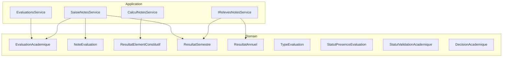
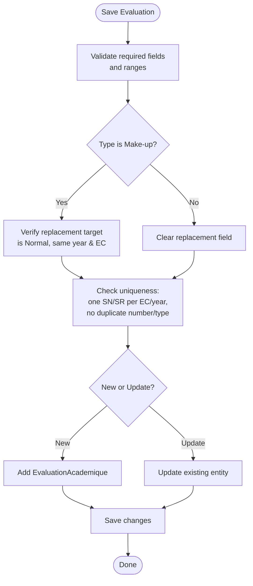
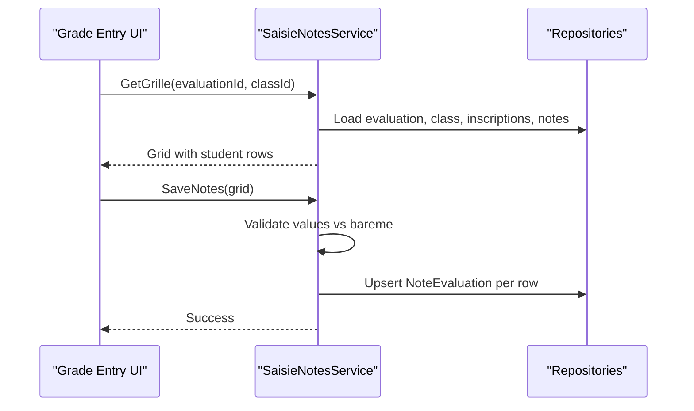
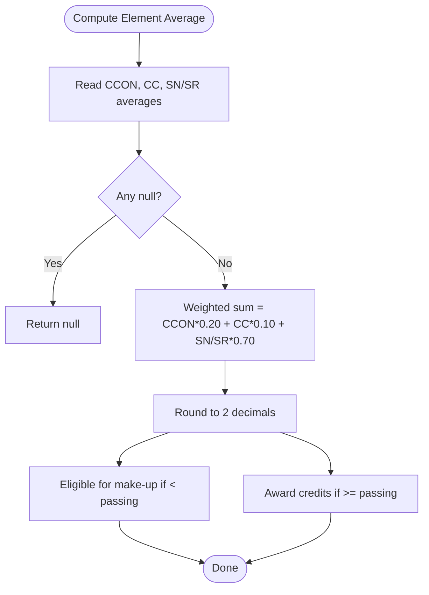
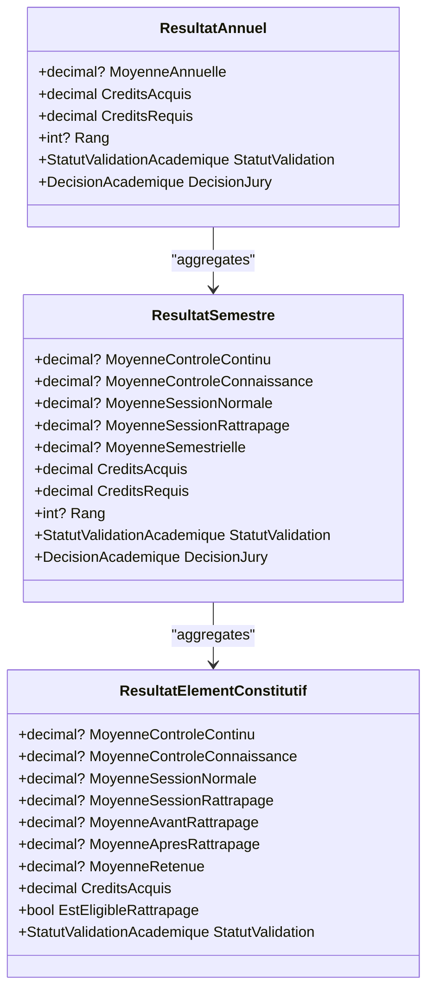
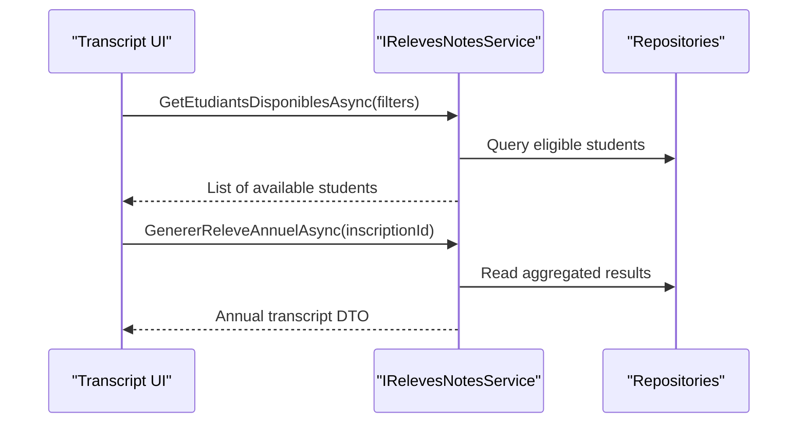
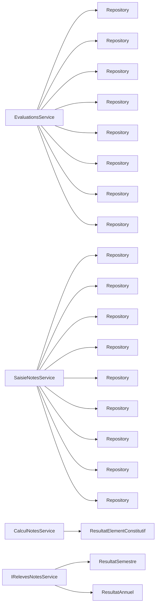

# Grade Management

<cite>
**Referenced Files in This Document**
- [EvaluationAcademique.cs](file://RIIS.Academic.Domain/Notes/EvaluationAcademique.cs)
- [NoteEvaluation.cs](file://RIIS.Academic.Domain/Notes/NoteEvaluation.cs)
- [ResultatElementConstitutif.cs](file://RIIS.Academic.Domain/Notes/ResultatElementConstitutif.cs)
- [ResultatSemestre.cs](file://RIIS.Academic.Domain/Notes/ResultatSemestre.cs)
- [ResultatAnnuel.cs](file://RIIS.Academic.Domain/Notes/ResultatAnnuel.cs)
- [TypeEvaluation.cs](file://RIIS.Academic.Domain/Enums/TypeEvaluation.cs)
- [StatutPresenceEvaluation.cs](file://RIIS.Academic.Domain/Enums/StatutPresenceEvaluation.cs)
- [StatutValidationAcademique.cs](file://RIIS.Academic.Domain/Enums/StatutValidationAcademique.cs)
- [DecisionAcademique.cs](file://RIIS.Academic.Domain/Enums/DecisionAcademique.cs)
- [EvaluationsService.cs](file://RIIS.Academic.Application/Evaluations/Services/EvaluationsService.cs)
- [SaisieNotesService.cs](file://RIIS.Academic.Application/Notes/Services/SaisieNotesService.cs)
- [CalculNotesService.cs](file://RIIS.Academic.Application/Notes/Services/CalculNotesService.cs)
- [SaisieNotesGrilleDto.cs](file://RIIS.Academic.Application/Notes/Dtos/SaisieNotesGrilleDto.cs)
- [SaisieNoteLigneDto.cs](file://RIIS.Academic.Application/Notes/Dtos/SaisieNoteLigneDto.cs)
- [IRelevesNotesService.cs](file://RIIS.Academic.Application/Releves/Services/IRelevesNotesService.cs)
</cite>

## Table of Contents
1. Introduction
2. Project Structure
3. Core Components
4. Architecture Overview
5. Detailed Component Analysis
6. Dependency Analysis
7. Performance Considerations
8. Troubleshooting Guide
9. Conclusion
10. Appendices

## Introduction
This document explains the Grade Management module with a focus on evaluation creation, grade entry, calculation engine, and result aggregation across academic levels (element, unit, semester, annual). It covers the EvaluationAcademique entity, NoteEvaluation recording, the CalculNotesService implementation, grading scales, coefficient calculations, and academic standing determination. It also includes workflows for evaluation setup, grade entry, calculation triggers, re-evaluation processes, and transcript preparation.

## Project Structure
The Grade Management feature spans Domain entities, Application services, and Dtos:
- Domain models define evaluations, grades, and results at multiple aggregation levels.
- Application services provide CRUD for evaluations, grade entry grids, and calculation utilities.
- Dtos model the UI grid for grade entry and available students for transcripts.



**Diagram sources**
- [EvaluationAcademique.cs:1-24](file://RIIS.Academic.Domain/Notes/EvaluationAcademique.cs#L1-L24)
- [NoteEvaluation.cs:1-17](file://RIIS.Academic.Domain/Notes/NoteEvaluation.cs#L1-L17)
- [ResultatElementConstitutif.cs:1-23](file://RIIS.Academic.Domain/Notes/ResultatElementConstitutif.cs#L1-L23)
- [ResultatSemestre.cs:1-23](file://RIIS.Academic.Domain/Notes/ResultatSemestre.cs#L1-L23)
- [ResultatAnnuel.cs:1-21](file://RIIS.Academic.Domain/Notes/ResultatAnnuel.cs#L1-L21)
- [TypeEvaluation.cs:1-10](file://RIIS.Academic.Domain/Enums/TypeEvaluation.cs#L1-L10)
- [StatutPresenceEvaluation.cs:1-10](file://RIIS.Academic.Domain/Enums/StatutPresenceEvaluation.cs#L1-L10)
- [StatutValidationAcademique.cs:1-10](file://RIIS.Academic.Domain/Enums/StatutValidationAcademique.cs#L1-L10)
- [DecisionAcademique.cs:1-10](file://RIIS.Academic.Domain/Enums/DecisionAcademique.cs#L1-L10)
- [EvaluationsService.cs:1-643](file://RIIS.Academic.Application/Evaluations/Services/EvaluationsService.cs#L1-L643)
- [SaisieNotesService.cs:1-317](file://RIIS.Academic.Application/Notes/Services/SaisieNotesService.cs#L1-L317)
- [CalculNotesService.cs:1-25](file://RIIS.Academic.Application/Notes/Services/CalculNotesService.cs#L1-L25)
- [IRelevesNotesService.cs:1-18](file://RIIS.Academic.Application/Releves/Services/IRelevesNotesService.cs#L1-L18)

**Section sources**
- [EvaluationAcademique.cs:1-24](file://RIIS.Academic.Domain/Notes/EvaluationAcademique.cs#L1-L24)
- [NoteEvaluation.cs:1-17](file://RIIS.Academic.Domain/Notes/NoteEvaluation.cs#L1-L17)
- [EvaluationsService.cs:1-643](file://RIIS.Academic.Application/Evaluations/Services/EvaluationsService.cs#L1-L643)
- [SaisieNotesService.cs:1-317](file://RIIS.Academic.Application/Notes/Services/SaisieNotesService.cs#L1-L317)
- [CalculNotesService.cs:1-25](file://RIIS.Academic.Application/Notes/Services/CalculNotesService.cs#L1-L25)
- [IRelevesNotesService.cs:1-18](file://RIIS.Academic.Application/Releves/Services/IRelevesNotesService.cs#L1-L18)

## Core Components
- EvaluationAcademique: Represents an assessment instance tied to an academic year and an element constitutif, including type, number, code, label, scale (bareme), weighting percentage, date, replacement reference, and observations. It links to notes and can be replaced by or replace other evaluations.
- NoteEvaluation: Records a student’s score (or absence status) for a specific evaluation and enrollment, with audit fields for timestamp and author.
- ResultatElementConstitutif: Aggregates per-element averages across control types and captures eligibility for make-up sessions, credits earned, and validation status.
- ResultatSemestre: Aggregates semester-level averages, credits acquired vs required, ranking, validation status, and jury decision.
- ResultatAnnuel: Aggregates annual averages, credits, ranking, validation status, and jury decision.
- TypeEvaluation: Enumerates evaluation types (continuous control, knowledge control, normal session, make-up session).
- StatutPresenceEvaluation: Presence statuses for grade entry (present, justified/unjustified absence, dispensation).
- StatutValidationAcademique and DecisionAcademique: Validation states and final decisions used in results.

Key responsibilities:
- EvaluationsService: Creates default evaluations, validates constraints (e.g., only one normal/make-up session per EC/year), enforces replacement rules, and persists evaluations.
- SaisieNotesService: Builds grade entry grids, filters eligible students for make-up sessions, validates scores against the evaluation scale, and saves NoteEvaluation records.
- CalculNotesService: Computes element-level averages using coefficients and determines make-up eligibility and credits acquisition.

**Section sources**
- [EvaluationAcademique.cs:1-24](file://RIIS.Academic.Domain/Notes/EvaluationAcademique.cs#L1-L24)
- [NoteEvaluation.cs:1-17](file://RIIS.Academic.Domain/Notes/NoteEvaluation.cs#L1-L17)
- [ResultatElementConstitutif.cs:1-23](file://RIIS.Academic.Domain/Notes/ResultatElementConstitutif.cs#L1-L23)
- [ResultatSemestre.cs:1-23](file://RIIS.Academic.Domain/Notes/ResultatSemestre.cs#L1-L23)
- [ResultatAnnuel.cs:1-21](file://RIIS.Academic.Domain/Notes/ResultatAnnuel.cs#L1-L21)
- [TypeEvaluation.cs:1-10](file://RIIS.Academic.Domain/Enums/TypeEvaluation.cs#L1-L10)
- [StatutPresenceEvaluation.cs:1-10](file://RIIS.Academic.Domain/Enums/StatutPresenceEvaluation.cs#L1-L10)
- [StatutValidationAcademique.cs:1-10](file://RIIS.Academic.Domain/Enums/StatutValidationAcademique.cs#L1-L10)
- [DecisionAcademique.cs:1-10](file://RIIS.Academic.Domain/Enums/DecisionAcademique.cs#L1-L10)
- [EvaluationsService.cs:142-294](file://RIIS.Academic.Application/Evaluations/Services/EvaluationsService.cs#L142-L294)
- [SaisieNotesService.cs:126-295](file://RIIS.Academic.Application/Notes/Services/SaisieNotesService.cs#L126-L295)
- [CalculNotesService.cs:1-25](file://RIIS.Academic.Application/Notes/Services/CalculNotesService.cs#L1-L25)

## Architecture Overview
The grade management flow integrates evaluation configuration, grade capture, calculation, and reporting:

```mermaid
sequenceDiagram
participant Admin as "Admin UI"
participant EvalSvc as "EvaluationsService"
participant EntrySvc as "SaisieNotesService"
participant CalcSvc as "CalculNotesService"
participant Repo as "Repositories"
participant Trans as "Transcript Service"
Admin->>EvalSvc : Create default evaluation
EvalSvc->>Repo : Persist EvaluationAcademique
Admin->>EntrySvc : Load grade grid (evaluation + class)
EntrySvc->>Repo : Load evaluations, classes, inscriptions, notes
EntrySvc-->>Admin : Grid with rows per student
Admin->>EntrySvc : Save notes (values/presence)
EntrySvc->>Repo : Upsert NoteEvaluation
Note->>CalcSvc : Trigger element calculation
CalcSvc-->>Note : Element average, eligibility, credits
Note->>Trans : Generate annual transcript when ready
Trans-->>Admin : ReleveNoteAnnuel
```

**Diagram sources**
- [EvaluationsService.cs:142-294](file://RIIS.Academic.Application/Evaluations/Services/EvaluationsService.cs#L142-L294)
- [SaisieNotesService.cs:126-295](file://RIIS.Academic.Application/Notes/Services/SaisieNotesService.cs#L126-L295)
- [CalculNotesService.cs:1-25](file://RIIS.Academic.Application/Notes/Services/CalculNotesService.cs#L1-L25)
- [IRelevesNotesService.cs:1-18](file://RIIS.Academic.Application/Releves/Services/IRelevesNotesService.cs#L1-L18)

## Detailed Component Analysis

### Evaluation Creation and Validation
- Default evaluation generation computes next sequence number per type and sets default labels, codes, scale, and weighting based on evaluation type.
- Save logic enforces:
  - Required fields (academic year, element, code, label, scale > 0, weighting within 0–100).
  - Make-up session must replace a normal session of the same academic year and element.
  - Uniqueness constraints: only one normal or make-up session per EC/year; no duplicate numbers per type/year/EC.
- Normalization ensures consistent codes and trims optional text.



**Diagram sources**
- [EvaluationsService.cs:172-294](file://RIIS.Academic.Application/Evaluations/Services/EvaluationsService.cs#L172-L294)

**Section sources**
- [EvaluationsService.cs:142-294](file://RIIS.Academic.Application/Evaluations/Services/EvaluationsService.cs#L142-L294)

### Grade Entry Workflow
- The grade grid loads:
  - Evaluation metadata (code, label, scale, weighting).
  - Class context and academic year.
  - Eligible students: all active enrollments for the class/year; for make-up sessions, filtered by semester results indicating insufficient credits.
  - Existing notes and presence status per student.
- Saving notes:
  - Validates presence and value range against the evaluation scale.
  - Upserts NoteEvaluation records with audit timestamps and author.



**Diagram sources**
- [SaisieNotesService.cs:126-295](file://RIIS.Academic.Application/Notes/Services/SaisieNotesService.cs#L126-L295)

**Section sources**
- [SaisieNotesService.cs:126-295](file://RIIS.Academic.Application/Notes/Services/SaisieNotesService.cs#L126-L295)

### Calculation Engine: Coefficients and Averages
- Element-level average combines three components with fixed coefficients:
  - Continuous control (CCON): 20%
  - Knowledge control (CC): 10%
  - Session (SN or SR): 70%
- If any component average is missing, the element average remains null until all are present.
- Make-up eligibility: true if the retained average is below the passing threshold.
- Credits acquisition: credits are awarded when the retained average meets or exceeds the passing threshold.



**Diagram sources**
- [CalculNotesService.cs:9-23](file://RIIS.Academic.Application/Notes/Services/CalculNotesService.cs#L9-L23)

**Section sources**
- [CalculNotesService.cs:1-25](file://RIIS.Academic.Application/Notes/Services/CalculNotesService.cs#L1-L25)

### Results Aggregation Across Levels
- Element level:
  - Stores separate averages per component and pre/post make-up averages, retained average, credits earned, eligibility flag, and validation status.
- Semester level:
  - Aggregates averages across elements, tracks credits acquired vs required (default 30), ranking, validation status, and jury decision.
- Annual level:
  - Aggregates overall average, credits acquired vs required (default 60), ranking, validation status, and jury decision.



**Diagram sources**
- [ResultatElementConstitutif.cs:1-23](file://RIIS.Academic.Domain/Notes/ResultatElementConstitutif.cs#L1-L23)
- [ResultatSemestre.cs:1-23](file://RIIS.Academic.Domain/Notes/ResultatSemestre.cs#L1-L23)
- [ResultatAnnuel.cs:1-21](file://RIIS.Academic.Domain/Notes/ResultatAnnuel.cs#L1-L21)

**Section sources**
- [ResultatElementConstitutif.cs:1-23](file://RIIS.Academic.Domain/Notes/ResultatElementConstitutif.cs#L1-L23)
- [ResultatSemestre.cs:1-23](file://RIIS.Academic.Domain/Notes/ResultatSemestre.cs#L1-L23)
- [ResultatAnnuel.cs:1-21](file://RIIS.Academic.Domain/Notes/ResultatAnnuel.cs#L1-L21)

### Transcript Preparation
- Transcript service exposes methods to list available students for transcripts and generate annual transcripts for a given enrollment.
- Typical usage: after semester/annual results are computed and validated, call the transcript generation method to produce the annual record.



**Diagram sources**
- [IRelevesNotesService.cs:1-18](file://RIIS.Academic.Application/Releves/Services/IRelevesNotesService.cs#L1-L18)

**Section sources**
- [IRelevesNotesService.cs:1-18](file://RIIS.Academic.Application/Releves/Services/IRelevesNotesService.cs#L1-L18)

## Dependency Analysis
- EvaluationsService depends on repositories for academic years, program structures (semesters, units, elements), and evaluations to build lookups and enforce constraints.
- SaisieNotesService depends on repositories for academic years, classes, enrollments, students, evaluations, notes, elements, units, and semester results to construct grade grids and validate entries.
- CalculNotesService is stateless and encapsulates coefficient-based averaging and eligibility/credits logic.
- Transcript service depends on repositories to read aggregated results for generating transcripts.



**Diagram sources**
- [EvaluationsService.cs:8-16](file://RIIS.Academic.Application/Evaluations/Services/EvaluationsService.cs#L8-L16)
- [SaisieNotesService.cs:8-17](file://RIIS.Academic.Application/Notes/Services/SaisieNotesService.cs#L8-L17)
- [CalculNotesService.cs:1-25](file://RIIS.Academic.Application/Notes/Services/CalculNotesService.cs#L1-L25)
- [IRelevesNotesService.cs:1-18](file://RIIS.Academic.Application/Releves/Services/IRelevesNotesService.cs#L1-L18)

**Section sources**
- [EvaluationsService.cs:8-16](file://RIIS.Academic.Application/Evaluations/Services/EvaluationsService.cs#L8-L16)
- [SaisieNotesService.cs:8-17](file://RIIS.Academic.Application/Notes/Services/SaisieNotesService.cs#L8-L17)
- [CalculNotesService.cs:1-25](file://RIIS.Academic.Application/Notes/Services/CalculNotesService.cs#L1-L25)
- [IRelevesNotesService.cs:1-18](file://RIIS.Academic.Application/Releves/Services/IRelevesNotesService.cs#L1-L18)

## Performance Considerations
- Bulk loading: Services load entire lookup tables into memory and filter client-side. For large datasets, consider server-side filtering or pagination to reduce memory and network overhead.
- Indexing: Ensure database indexes on foreign keys (e.g., InscriptionId, ElementConstitutifId, SemestrePedagogiqueId) to speed up joins and aggregations during grade entry and result computation.
- Avoid redundant queries: Cache frequently accessed lookups (e.g., academic years, cycles) within a request scope where appropriate.
- Transaction boundaries: Group related writes (e.g., saving multiple notes) in a single transaction to maintain consistency and reduce round-trips.

[No sources needed since this section provides general guidance]

## Troubleshooting Guide
Common issues and resolutions:
- Missing evaluation or class: Ensure both exist and belong to the same academic year before opening the grade grid.
- Invalid score range: Grades must be between 0 and the evaluation’s scale (bareme). Adjust or correct the input.
- Make-up session eligibility: Only students with insufficient semester credits are eligible. Compute semester results first or verify eligibility flags.
- Duplicate evaluation: Only one normal or make-up session per element/year is allowed. Remove duplicates or adjust numbering.
- Replacement rule violation: Make-up sessions must replace a normal session from the same academic year and element.

**Section sources**
- [SaisieNotesService.cs:126-295](file://RIIS.Academic.Application/Notes/Services/SaisieNotesService.cs#L126-L295)
- [EvaluationsService.cs:172-294](file://RIIS.Academic.Application/Evaluations/Services/EvaluationsService.cs#L172-L294)

## Conclusion
The Grade Management module provides a robust pipeline from evaluation setup through grade capture, calculation, and reporting. EvaluationAcademique and NoteEvaluation form the foundation, while SaisieNotesService ensures data integrity and contextual eligibility. CalculNotesService applies standardized coefficients to compute averages and determine academic standing. Results aggregate across element, semester, and annual levels, enabling transcript generation and informed academic decisions.

[No sources needed since this section summarizes without analyzing specific files]

## Appendices

### Data Models Summary
- EvaluationAcademique: Assessment definition with type, number, code, label, scale, weighting, date, replacement link, and observations.
- NoteEvaluation: Student-grade record linked to evaluation and enrollment, with presence status and audit fields.
- ResultatElementConstitutif: Per-element aggregation with component averages, retained average, eligibility, and credits.
- ResultatSemestre: Semester aggregation with averages, credits, ranking, validation, and jury decision.
- ResultatAnnuel: Annual aggregation with averages, credits, ranking, validation, and jury decision.

**Section sources**
- [EvaluationAcademique.cs:1-24](file://RIIS.Academic.Domain/Notes/EvaluationAcademique.cs#L1-L24)
- [NoteEvaluation.cs:1-17](file://RIIS.Academic.Domain/Notes/NoteEvaluation.cs#L1-L17)
- [ResultatElementConstitutif.cs:1-23](file://RIIS.Academic.Domain/Notes/ResultatElementConstitutif.cs#L1-L23)
- [ResultatSemestre.cs:1-23](file://RIIS.Academic.Domain/Notes/ResultatSemestre.cs#L1-L23)
- [ResultatAnnuel.cs:1-21](file://RIIS.Academic.Domain/Notes/ResultatAnnuel.cs#L1-L21)

### Grading Scale and Coefficients
- Scale (bareme): Configured per evaluation; default commonly 20.
- Coefficients for element average:
  - Continuous control: 20%
  - Knowledge control: 10%
  - Session (normal/make-up): 70%
- Passing threshold: Used to determine make-up eligibility and credit awarding.

**Section sources**
- [CalculNotesService.cs:9-23](file://RIIS.Academic.Application/Notes/Services/CalculNotesService.cs#L9-L23)
- [EvaluationsService.cs:574-582](file://RIIS.Academic.Application/Evaluations/Services/EvaluationsService.cs#L574-L582)

### Example Workflows
- Evaluation setup:
  - Use default evaluation generator to create a new assessment for an element and academic year.
  - Validate and save the evaluation, ensuring uniqueness and replacement rules.
- Grade entry:
  - Open the grade grid for the evaluation and class.
  - Enter scores or mark presence/absence; system validates against the scale.
  - Save to persist NoteEvaluation records.
- Calculation trigger:
  - After grades are saved, compute element averages using coefficients.
  - Determine make-up eligibility and credits.
- Result generation:
  - Aggregate results to semester and annual levels.
  - Generate annual transcripts for enrolled students.

**Section sources**
- [EvaluationsService.cs:142-294](file://RIIS.Academic.Application/Evaluations/Services/EvaluationsService.cs#L142-L294)
- [SaisieNotesService.cs:126-295](file://RIIS.Academic.Application/Notes/Services/SaisieNotesService.cs#L126-L295)
- [CalculNotesService.cs:1-25](file://RIIS.Academic.Application/Notes/Services/CalculNotesService.cs#L1-L25)
- [IRelevesNotesService.cs:1-18](file://RIIS.Academic.Application/Releves/Services/IRelevesNotesService.cs#L1-L18)