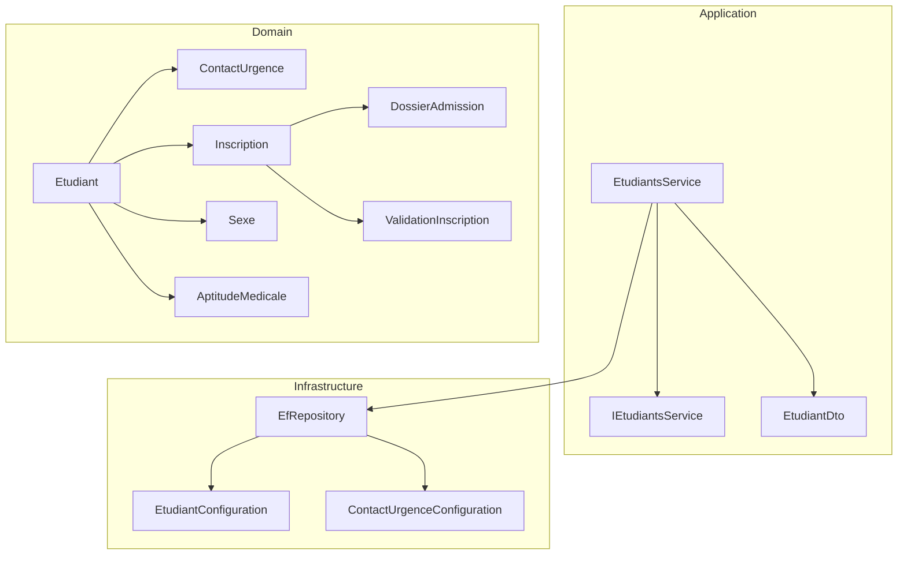
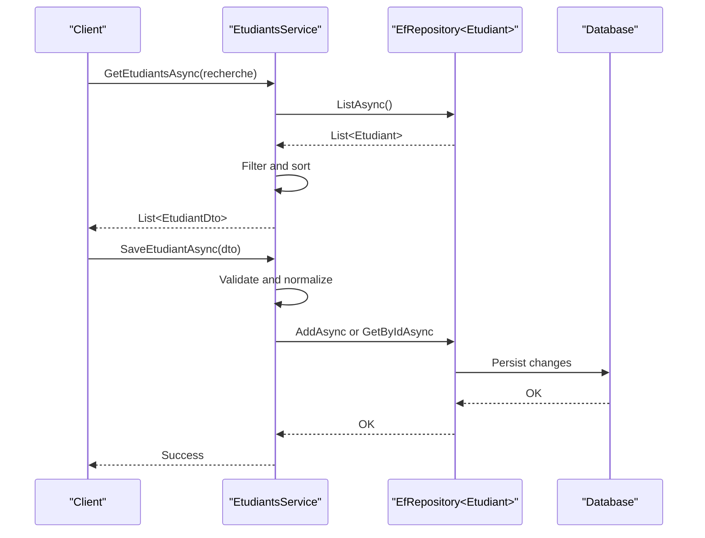
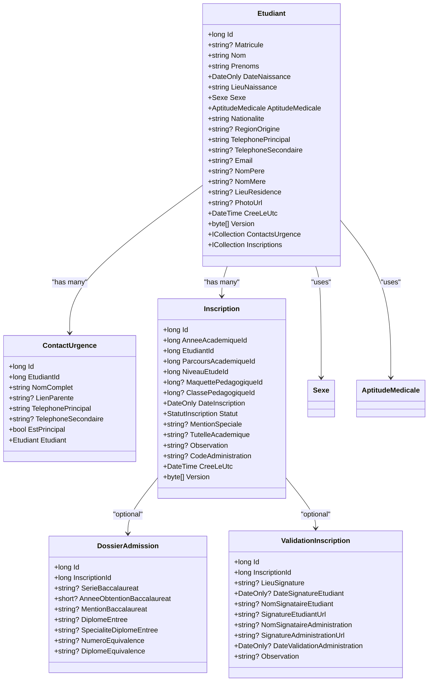
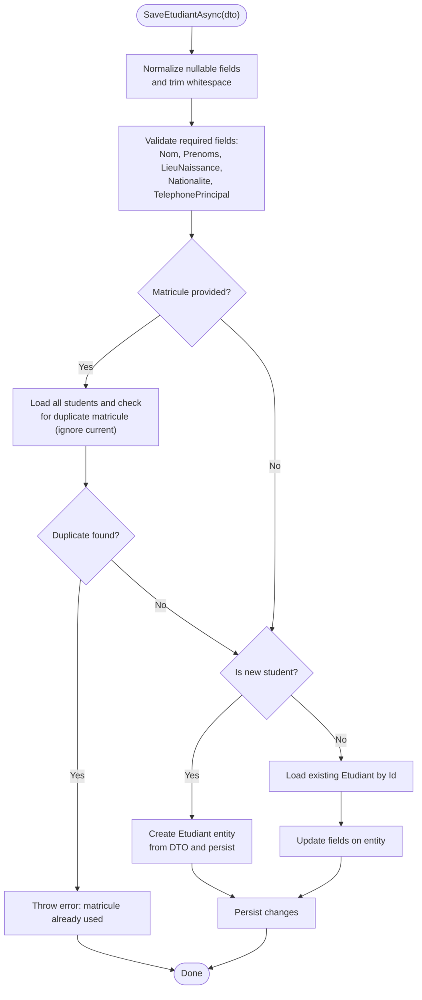
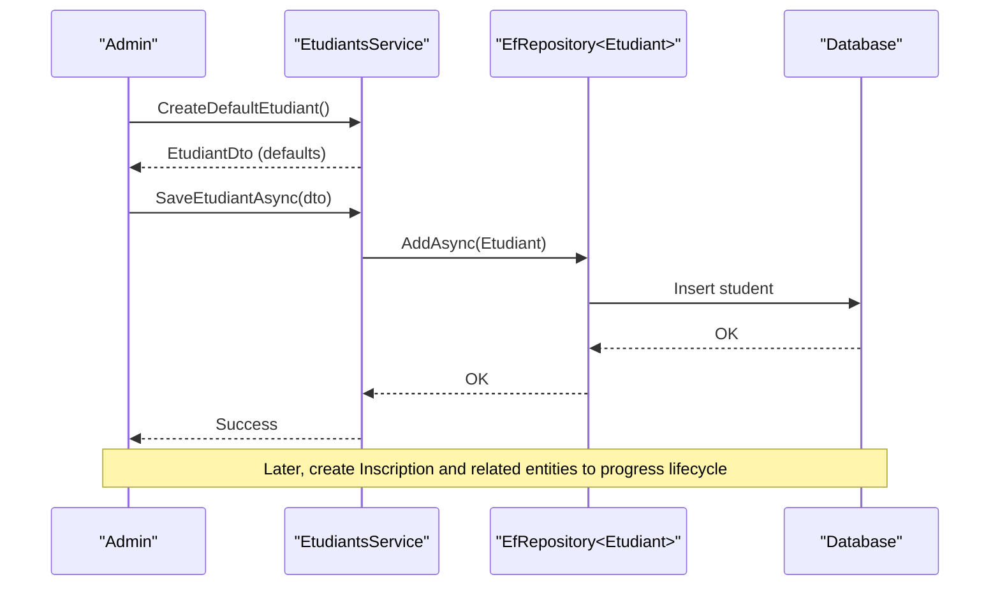
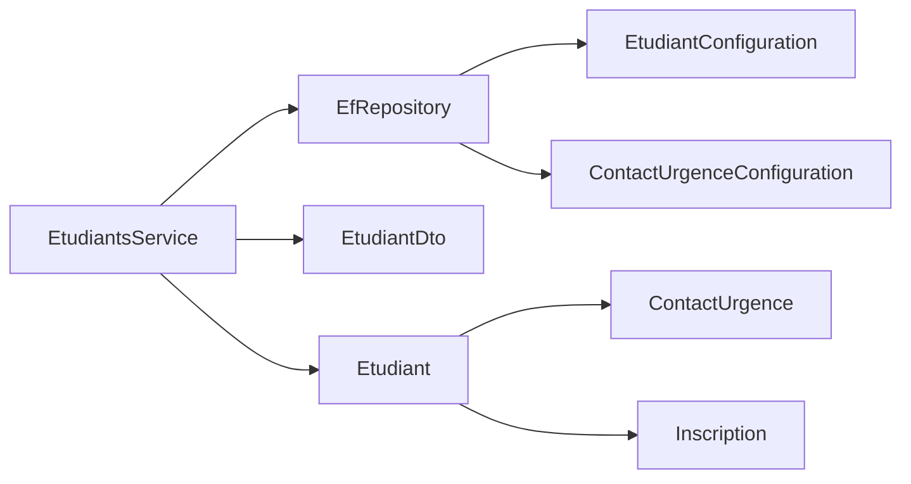

# Student Management

<cite>
**Referenced Files in This Document**
- [EtudiantsService.cs](file://RIIS.Academic.Application/Etudiants/Services/EtudiantsService.cs)
- [IEtudiantsService.cs](file://RIIS.Academic.Application/Etudiants/Services/IEtudiantsService.cs)
- [EtudiantDto.cs](file://RIIS.Academic.Application/Etudiants/Dtos/EtudiantDto.cs)
- [Etudiant.cs](file://RIIS.Academic.Domain/Etudiants/Etudiant.cs)
- [ContactUrgence.cs](file://RIIS.Academic.Domain/Etudiants/ContactUrgence.cs)
- [Inscription.cs](file://RIIS.Academic.Domain/Inscriptions/Inscription.cs)
- [DossierAdmission.cs](file://RIIS.Academic.Domain/Inscriptions/DossierAdmission.cs)
- [ValidationInscription.cs](file://RIIS.Academic.Domain/Inscriptions/ValidationInscription.cs)
- [Sexe.cs](file://RIIS.Academic.Domain/Enums/Sexe.cs)
- [AptitudeMedicale.cs](file://RIIS.Academic.Domain/Enums/AptitudeMedicale.cs)
- [EfRepository.cs](file://RIIS.Academic.Infrastructure/Persistence/Repositories/EfRepository.cs)
- [EtudiantConfiguration.cs](file://RIIS.Academic.Infrastructure/Persistence/Configurations/Etudiants/EtudiantConfiguration.cs)
- [ContactUrgenceConfiguration.cs](file://RIIS.Academic.Infrastructure/Persistence/Configurations/Etudiants/ContactUrgenceConfiguration.cs)
</cite>

## Table of Contents
1. [Introduction](#introduction)
2. [Project Structure](#project-structure)
3. [Core Components](#core-components)
4. [Architecture Overview](#architecture-overview)
5. [Detailed Component Analysis](#detailed-component-analysis)
6. [Dependency Analysis](#dependency-analysis)
7. [Performance Considerations](#performance-considerations)
8. [Troubleshooting Guide](#troubleshooting-guide)
9. [Conclusion](#conclusion)
10. [Appendices](#appendices)

## Introduction
This document explains the Student Management module, focusing on the complete student lifecycle from admission to graduation. It covers student profile management, contact information handling, emergency contact management, and data validation rules. It documents the EtudiantsService implementation, DTO patterns, and business rules that ensure data integrity for student records. Examples are provided for creating, updating, searching, and deleting students, as well as managing related entities such as ContactUrgence and enrollment (Inscription).

## Project Structure
The Student Management feature spans three layers:
- Application layer: service and DTOs for student operations
- Domain layer: core entities and enums representing students, emergency contacts, and enrollments
- Infrastructure layer: persistence configuration and repository abstraction used by the service

**Diagram sources**
- [EtudiantsService.cs:7-127](file://RIIS.Academic.Application/Etudiants/Services/EtudiantsService.cs#L7-L127)
- [IEtudiantsService.cs:5-11](file://RIIS.Academic.Application/Etudiants/Services/IEtudiantsService.cs#L5-L11)
- [EtudiantDto.cs:5-25](file://RIIS.Academic.Application/Etudiants/Dtos/EtudiantDto.cs#L5-L25)
- [Etudiant.cs:3-27](file://RIIS.Academic.Domain/Etudiants/Etudiant.cs#L3-L27)
- [ContactUrgence.cs:3-14](file://RIIS.Academic.Domain/Etudiants/ContactUrgence.cs#L3-L14)
- [Inscription.cs:3-36](file://RIIS.Academic.Domain/Inscriptions/Inscription.cs#L3-L36)
- [DossierAdmission.cs:3-16](file://RIIS.Academic.Domain/Inscriptions/DossierAdmission.cs#L3-L16)
- [ValidationInscription.cs:3-17](file://RIIS.Academic.Domain/Inscriptions/ValidationInscription.cs#L3-L17)
- [Sexe.cs:3-8](file://RIIS.Academic.Domain/Enums/Sexe.cs#L3-L8)
- [AptitudeMedicale.cs:3-8](file://RIIS.Academic.Domain/Enums/AptitudeMedicale.cs#L3-L8)
- [EfRepository.cs:6-32](file://RIIS.Academic.Infrastructure/Persistence/Repositories/EfRepository.cs#L6-L32)
- [EtudiantConfiguration.cs:6-32](file://RIIS.Academic.Infrastructure/Persistence/Configurations/Etudiants/EtudiantConfiguration.cs#L6-L32)
- [ContactUrgenceConfiguration.cs:6-20](file://RIIS.Academic.Infrastructure/Persistence/Configurations/Etudiants/ContactUrgenceConfiguration.cs#L6-L20)

**Section sources**
- [EtudiantsService.cs:7-127](file://RIIS.Academic.Application/Etudiants/Services/EtudiantsService.cs#L7-L127)
- [IEtudiantsService.cs:5-11](file://RIIS.Academic.Application/Etudiants/Services/IEtudiantsService.cs#L5-L11)
- [EtudiantDto.cs:5-25](file://RIIS.Academic.Application/Etudiants/Dtos/EtudiantDto.cs#L5-L25)
- [Etudiant.cs:3-27](file://RIIS.Academic.Domain/Etudiants/Etudiant.cs#L3-L27)
- [ContactUrgence.cs:3-14](file://RIIS.Academic.Domain/Etudiants/ContactUrgence.cs#L3-L14)
- [Inscription.cs:3-36](file://RIIS.Academic.Domain/Inscriptions/Inscription.cs#L3-L36)
- [EfRepository.cs:6-32](file://RIIS.Academic.Infrastructure/Persistence/Repositories/EfRepository.cs#L6-L32)
- [EtudiantConfiguration.cs:6-32](file://RIIS.Academic.Infrastructure/Persistence/Configurations/Etudiants/EtudiantConfiguration.cs#L6-L32)
- [ContactUrgenceConfiguration.cs:6-20](file://RIIS.Academic.Infrastructure/Persistence/Configurations/Etudiants/ContactUrgenceConfiguration.cs#L6-L20)

## Core Components
- EtudiantsService implements IEtudiantsService and provides CRUD operations for students with search and default creation. It normalizes input, enforces required fields, ensures unique matricule, and persists changes via a generic repository.
- EtudiantDto is the application-facing data model used for input/output of student operations. It includes computed properties like full name.
- Etudiant is the domain entity representing a student, including personal details, contact info, and relationships to emergency contacts and enrollments.
- ContactUrgence models emergency contacts linked to a student.
- Inscription, DossierAdmission, and ValidationInscription represent enrollment and admission lifecycle stages tied to a student.

Key responsibilities:
- Search: case-insensitive filtering across multiple fields
- Create: build a default student DTO for UI scaffolding
- Save: validate and normalize inputs, enforce uniqueness, add or update entity
- Delete: remove student by id

**Section sources**
- [EtudiantsService.cs:7-127](file://RIIS.Academic.Application/Etudiants/Services/EtudiantsService.cs#L7-L127)
- [EtudiantDto.cs:5-25](file://RIIS.Academic.Application/Etudiants/Dtos/EtudiantDto.cs#L5-L25)
- [Etudiant.cs:3-27](file://RIIS.Academic.Domain/Etudiants/Etudiant.cs#L3-L27)
- [ContactUrgence.cs:3-14](file://RIIS.Academic.Domain/Etudiants/ContactUrgence.cs#L3-L14)
- [Inscription.cs:3-36](file://RIIS.Academic.Domain/Inscriptions/Inscription.cs#L3-L36)

## Architecture Overview
The module follows clean architecture principles:
- Application service orchestrates use cases using DTOs and domain entities
- Domain defines entities and business invariants
- Infrastructure provides persistence via EF Core configurations and a generic repository

**Diagram sources**
- [EtudiantsService.cs:9-127](file://RIIS.Academic.Application/Etudiants/Services/EtudiantsService.cs#L9-L127)
- [EfRepository.cs:9-32](file://RIIS.Academic.Infrastructure/Persistence/Repositories/EfRepository.cs#L9-L32)

## Detailed Component Analysis

### Student Entity Model
The student entity encapsulates personal and contact information and relates to emergency contacts and enrollments. Enums define gender and medical fitness status.

**Diagram sources**
- [Etudiant.cs:3-27](file://RIIS.Academic.Domain/Etudiants/Etudiant.cs#L3-L27)
- [ContactUrgence.cs:3-14](file://RIIS.Academic.Domain/Etudiants/ContactUrgence.cs#L3-L14)
- [Inscription.cs:3-36](file://RIIS.Academic.Domain/Inscriptions/Inscription.cs#L3-L36)
- [DossierAdmission.cs:3-16](file://RIIS.Academic.Domain/Inscriptions/DossierAdmission.cs#L3-L16)
- [ValidationInscription.cs:3-17](file://RIIS.Academic.Domain/Inscriptions/ValidationInscription.cs#L3-L17)
- [Sexe.cs:3-8](file://RIIS.Academic.Domain/Enums/Sexe.cs#L3-L8)
- [AptitudeMedicale.cs:3-8](file://RIIS.Academic.Domain/Enums/AptitudeMedicale.cs#L3-L8)

**Section sources**
- [Etudiant.cs:3-27](file://RIIS.Academic.Domain/Etudiants/Etudiant.cs#L3-L27)
- [ContactUrgence.cs:3-14](file://RIIS.Academic.Domain/Etudiants/ContactUrgence.cs#L3-L14)
- [Inscription.cs:3-36](file://RIIS.Academic.Domain/Inscriptions/Inscription.cs#L3-L36)
- [DossierAdmission.cs:3-16](file://RIIS.Academic.Domain/Inscriptions/DossierAdmission.cs#L3-L16)
- [ValidationInscription.cs:3-17](file://RIIS.Academic.Domain/Inscriptions/ValidationInscription.cs#L3-L17)
- [Sexe.cs:3-8](file://RIIS.Academic.Domain/Enums/Sexe.cs#L3-L8)
- [AptitudeMedicale.cs:3-8](file://RIIS.Academic.Domain/Enums/AptitudeMedicale.cs#L3-L8)

### EtudiantsService Implementation
Responsibilities:
- Search: returns all students and filters by matricule, last name, first names, primary phone, or email when a search term is provided; results are sorted by last name then first names and mapped to DTOs.
- Read: retrieves a single student by id and maps to DTO.
- Default creation: builds a default DTO with sensible defaults for new student forms.
- Save: validates required fields, normalizes optional text fields, enforces unique matricule, and either adds a new student or updates an existing one.
- Delete: removes a student by id.

**Diagram sources**
- [EtudiantsService.cs:53-127](file://RIIS.Academic.Application/Etudiants/Services/EtudiantsService.cs#L53-L127)

**Section sources**
- [EtudiantsService.cs:9-127](file://RIIS.Academic.Application/Etudiants/Services/EtudiantsService.cs#L9-L127)

### Student Lifecycle: Admission to Graduation
The student lifecycle is represented through Enrollment (Inscription) and its related entities:
- Admission: DossierAdmission captures academic background at entry.
- Enrollment: Inscription ties a student to an academic year, program, level, and optionally a pedagogical framework and class.
- Validation: ValidationInscription records signatures and administrative validation dates.
- Ongoing: Grades and results are associated with the enrollment record.
- Graduation: Completion of academic requirements culminates in successful outcomes recorded within the enrollment’s result structures.

**Diagram sources**
- [EtudiantsService.cs:42-51](file://RIIS.Academic.Application/Etudiants/Services/EtudiantsService.cs#L42-L51)
- [EtudiantsService.cs:75-96](file://RIIS.Academic.Application/Etudiants/Services/EtudiantsService.cs#L75-L96)
- [EfRepository.cs:17-18](file://RIIS.Academic.Infrastructure/Persistence/Repositories/EfRepository.cs#L17-L18)

**Section sources**
- [EtudiantsService.cs:42-96](file://RIIS.Academic.Application/Etudiants/Services/EtudiantsService.cs#L42-L96)
- [Inscription.cs:3-36](file://RIIS.Academic.Domain/Inscriptions/Inscription.cs#L3-L36)
- [DossierAdmission.cs:3-16](file://RIIS.Academic.Domain/Inscriptions/DossierAdmission.cs#L3-L16)
- [ValidationInscription.cs:3-17](file://RIIS.Academic.Domain/Inscriptions/ValidationInscription.cs#L3-L17)

### Data Normalization and Validation Rules
Normalization:
- Optional text fields are trimmed; empty strings become null to avoid blank values in storage.
- Search terms are normalized before matching.

Validation:
- Required fields enforced during save: last name, first names, place of birth, nationality, primary phone.
- Matricule uniqueness enforced across all students except the current one being updated.
- Enum fields (gender, medical fitness) are persisted as strings with configured lengths.

**Section sources**
- [EtudiantsService.cs:14-25](file://RIIS.Academic.Application/Etudiants/Services/EtudiantsService.cs#L14-L25)
- [EtudiantsService.cs:53-73](file://RIIS.Academic.Application/Etudiants/Services/EtudiantsService.cs#L53-L73)
- [EtudiantsService.cs:151-171](file://RIIS.Academic.Application/Etudiants/Services/EtudiantsService.cs#L151-L171)
- [EtudiantConfiguration.cs:12-29](file://RIIS.Academic.Infrastructure/Persistence/Configurations/Etudiants/EtudiantConfiguration.cs#L12-L29)

### Emergency Contact Management
Emergency contacts are modeled as a separate entity linked to a student. The database configuration enforces cascade deletion so removing a student also removes their emergency contacts.

Operational guidance:
- Maintain at least one primary emergency contact per student.
- Use the relationship to query or display emergency contacts alongside student profiles.

**Section sources**
- [ContactUrgence.cs:3-14](file://RIIS.Academic.Domain/Etudiants/ContactUrgence.cs#L3-L14)
- [ContactUrgenceConfiguration.cs:16-19](file://RIIS.Academic.Infrastructure/Persistence/Configurations/Etudiants/ContactUrgenceConfiguration.cs#L16-L19)

### Search Functionality
Search supports partial, case-insensitive matching across:
- Matricule
- Last name
- First names
- Primary phone
- Email

Results are ordered by last name then first names and returned as DTOs.

**Section sources**
- [EtudiantsService.cs:9-33](file://RIIS.Academic.Application/Etudiants/Services/EtudiantsService.cs#L9-L33)

### Example Workflows

- Create a new student:
  - Obtain a default student DTO for form initialization
  - Populate required fields and optional fields
  - Save the student; system validates and persists

- Update an existing student:
  - Retrieve student by id
  - Modify fields as needed
  - Save; system checks uniqueness and persists updates

- Search students:
  - Provide a search term to filter across key fields
  - Receive sorted list of student DTOs

- Delete a student:
  - Provide student id; system removes the student and cascades to emergency contacts

**Section sources**
- [EtudiantsService.cs:42-51](file://RIIS.Academic.Application/Etudiants/Services/EtudiantsService.cs#L42-L51)
- [EtudiantsService.cs:53-127](file://RIIS.Academic.Application/Etudiants/Services/EtudiantsService.cs#L53-L127)
- [EtudiantsService.cs:9-33](file://RIIS.Academic.Application/Etudiants/Services/EtudiantsService.cs#L9-L33)

## Dependency Analysis
The service depends on a generic repository for persistence and uses domain entities and DTOs to decouple concerns. Configuration classes define schema constraints and relationships.

**Diagram sources**
- [EtudiantsService.cs:7-127](file://RIIS.Academic.Application/Etudiants/Services/EtudiantsService.cs#L7-L127)
- [EfRepository.cs:6-32](file://RIIS.Academic.Infrastructure/Persistence/Repositories/EfRepository.cs#L6-L32)
- [EtudiantConfiguration.cs:6-32](file://RIIS.Academic.Infrastructure/Persistence/Configurations/Etudiants/EtudiantConfiguration.cs#L6-L32)
- [ContactUrgenceConfiguration.cs:6-20](file://RIIS.Academic.Infrastructure/Persistence/Configurations/Etudiants/ContactUrgenceConfiguration.cs#L6-L20)
- [Etudiant.cs:3-27](file://RIIS.Academic.Domain/Etudiants/Etudiant.cs#L3-L27)
- [ContactUrgence.cs:3-14](file://RIIS.Academic.Domain/Etudiants/ContactUrgence.cs#L3-L14)
- [Inscription.cs:3-36](file://RIIS.Academic.Domain/Inscriptions/Inscription.cs#L3-L36)

**Section sources**
- [EtudiantsService.cs:7-127](file://RIIS.Academic.Application/Etudiants/Services/EtudiantsService.cs#L7-L127)
- [EfRepository.cs:6-32](file://RIIS.Academic.Infrastructure/Persistence/Repositories/EfRepository.cs#L6-L32)
- [EtudiantConfiguration.cs:6-32](file://RIIS.Academic.Infrastructure/Persistence/Configurations/Etudiants/EtudiantConfiguration.cs#L6-L32)
- [ContactUrgenceConfiguration.cs:6-20](file://RIIS.Academic.Infrastructure/Persistence/Configurations/Etudiants/ContactUrgenceConfiguration.cs#L6-L20)

## Performance Considerations
- Search loads all students into memory and filters client-side; consider server-side filtering for large datasets.
- Sorting is applied after filtering; ensure indexes support common queries if moving logic to the database.
- Unique matricule check enumerates all students; for high cardinality, implement a dedicated uniqueness check against the database index.
- Use projection to DTOs only after filtering to reduce payload size.

[No sources needed since this section provides general guidance]

## Troubleshooting Guide
Common issues and resolutions:
- Validation errors: Ensure required fields are provided; the service throws explicit errors for missing values.
- Duplicate matricule: Verify no other student has the same matricule; the service prevents duplicates.
- Not found on update: If the entity does not exist, the service returns without changes; verify the id.
- Cascade delete behavior: Deleting a student removes associated emergency contacts; confirm this is intended.

**Section sources**
- [EtudiantsService.cs:53-73](file://RIIS.Academic.Application/Etudiants/Services/EtudiantsService.cs#L53-L73)
- [EtudiantsService.cs:99-100](file://RIIS.Academic.Application/Etudiants/Services/EtudiantsService.cs#L99-L100)
- [ContactUrgenceConfiguration.cs:16-19](file://RIIS.Academic.Infrastructure/Persistence/Configurations/Etudiants/ContactUrgenceConfiguration.cs#L16-L19)

## Conclusion
The Student Management module provides a robust foundation for managing student records throughout their academic lifecycle. It enforces strong validation and normalization, supports flexible search, and maintains clear relationships with emergency contacts and enrollment data. By following the documented workflows and rules, teams can reliably implement student creation, updates, searches, and deletions while preserving data integrity.

[No sources needed since this section summarizes without analyzing specific files]

## Appendices

### API Surface Summary
- Get students with optional search
- Get a single student by id
- Create default student DTO
- Save student (create or update)
- Delete student by id

**Section sources**
- [IEtudiantsService.cs:5-11](file://RIIS.Academic.Application/Etudiants/Services/IEtudiantsService.cs#L5-L11)