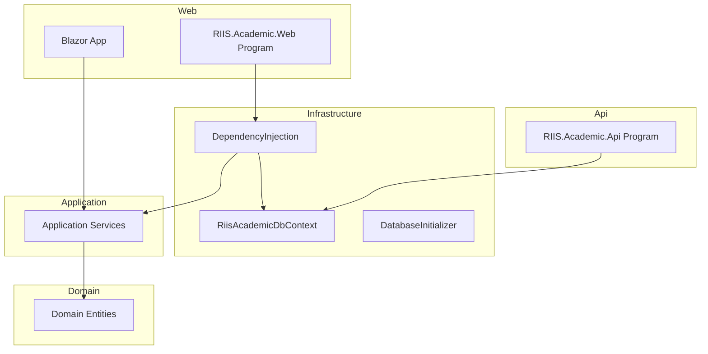

# Getting Started

<cite>
**Referenced Files in This Document**
- [Program.cs](file://RIIS.Academic.Api/Program.cs)
- [appsettings.json](file://RIIS.Academic.Api/appsettings.json)
- [launchSettings.json](file://RIIS.Academic.Api/Properties/launchSettings.json)
- [Program.cs](file://RIIS.Academic.Web/Program.cs)
- [appsettings.json](file://RIIS.Academic.Web/appsettings.json)
- [launchSettings.json](file://RIIS.Academic.Web/Properties/launchSettings.json)
- [DependencyInjection.cs](file://RIIS.Academic.Infrastructure/DependencyInjection.cs)
- [RiisAcademicDbContext.cs](file://RIIS.Academic.Infrastructure/Persistence/RiisAcademicDbContext.cs)
- [DatabaseInitializer.cs](file://RIIS.Academic.Infrastructure/Persistence/DatabaseInitializer.cs)
- [RiisAcademicDatabaseResetter.cs](file://RIIS.Academic.Infrastructure/Persistence/RiisAcademicDatabaseResetter.cs)
- [RIIS.Academic.Api.csproj](file://RIIS.Academic.Api/RIIS.Academic.Api.csproj)
- [RIIS.Academic.Web.csproj](file://RIIS.Academic.Web/RIIS.Academic.Web.csproj)
- [RIIS.Academic.Infrastructure.csproj](file://RIIS.Academic.Infrastructure/RIIS.Academic.Infrastructure.csproj)
</cite>

## Table of Contents
1. Introduction
2. Prerequisites
3. Project Structure Overview
4. Installation Steps
5. Database Setup and Configuration
6. Environment Variables and Connection Strings
7. First Run Instructions
8. Verification Checklist
9. Troubleshooting Guide
10. Conclusion

## Introduction
This guide helps you set up and run the RIIS Academic Management System locally. It covers prerequisites, cloning and restoring dependencies, configuring the database and environment, running migrations, and launching both the Web application and API services.

## Prerequisites
- .NET 10.0 SDK installed and available on PATH
- SQL Server or LocalDB instance accessible from your machine
- A code editor or IDE with .NET support (for example, Visual Studio or VS Code)
- Command-line access to run dotnet commands

Notes:
- The project targets net10.0 across Api, Web, and Infrastructure projects.
- Entity Framework Core for SQL Server is used for data access and migrations.

**Section sources**
- [RIIS.Academic.Api.csproj:3-7](file://RIIS.Academic.Api/RIIS.Academic.Api.csproj#L3-L7)
- [RIIS.Academic.Web.csproj:3-7](file://RIIS.Academic.Web/RIIS.Academic.Web.csproj#L3-L7)
- [RIIS.Academic.Infrastructure.csproj:3-7](file://RIIS.Academic.Infrastructure/RIIS.Academic.Infrastructure.csproj#L3-L7)

## Project Structure Overview
The solution follows a clean architecture with separate layers:
- Domain: core entities and enums
- Application: business services and DTOs
- Infrastructure: persistence, EF Core context, DI registration, and document exports
- Web: Blazor server UI using Radzen components
- Api: minimal ASP.NET Core API entry point

**Diagram sources**
- [Program.cs](file://RIIS.Academic.Web/Program.cs)
- [Program.cs](file://RIIS.Academic.Api/Program.cs)
- [DependencyInjection.cs](file://RIIS.Academic.Infrastructure/DependencyInjection.cs)
- [RiisAcademicDbContext.cs](file://RIIS.Academic.Infrastructure/Persistence/RiisAcademicDbContext.cs)

**Section sources**
- [Program.cs](file://RIIS.Academic.Web/Program.cs)
- [Program.cs](file://RIIS.Academic.Api/Program.cs)
- [DependencyInjection.cs](file://RIIS.Academic.Infrastructure/DependencyInjection.cs)
- [RiisAcademicDbContext.cs](file://RIIS.Academic.Infrastructure/Persistence/RiisAcademicDbContext.cs)

## Installation Steps
1. Clone the repository to your local machine.
2. Open a terminal in the src directory.
3. Restore NuGet packages:
   - dotnet restore
4. Build the solution to verify everything compiles:
   - dotnet build

If you plan to use EF Core tools from the command line, ensure the working directory is set to the Infrastructure project when running migration commands.

**Section sources**
- [RIIS.Academic.Api.csproj:3-7](file://RIIS.Academic.Api/RIIS.Academic.Api.csproj#L3-L7)
- [RIIS.Academic.Web.csproj:3-7](file://RIIS.Academic.Web/RIIS.Academic.Web.csproj#L3-L7)
- [RIIS.Academic.Infrastructure.csproj:3-7](file://RIIS.Academic.Infrastructure/RIIS.Academic.Infrastructure.csproj#L3-L7)

## Database Setup and Configuration
The system uses SQL Server via Entity Framework Core. You must configure a valid connection string before running migrations or starting the apps.

Key configuration points:
- The Web app resolves the connection string based on an environment value and selects one of two configured connection strings.
- The Api app reads its own connection string directly from its configuration.

Steps:
1. Ensure your SQL Server or LocalDB instance is running and reachable.
2. Update the appropriate connection string(s) in the configuration files:
   - For the Web app, update the selected connection string under ConnectionStrings based on your environment.
   - For the Api app, update the connection string under ConnectionStrings.
3. Create the database if it does not exist (EF Core will create it during migration).

Important notes:
- The Web app chooses between two connection strings depending on the envval setting.
- The Api app uses a specific connection string name for its DbContext.

**Section sources**
- [appsettings.json](file://RIIS.Academic.Web/appsettings.json)
- [DependencyInjection.cs](file://RIIS.Academic.Infrastructure/DependencyInjection.cs)
- [appsettings.json](file://RIIS.Academic.Api/appsettings.json)

## Environment Variables and Connection Strings
Environment selection:
- The Web app reads an environment flag to choose which connection string to use.
- When the environment flag equals dev, the Web app uses the first connection string; otherwise, it uses the second.

Where to set:
- In the Web app’s configuration file, set the environment flag value.
- Alternatively, set the environment variable at runtime if your host supports it.

Connection strings:
- Web app: configure the selected connection string under ConnectionStrings.
- Api app: configure its connection string under ConnectionStrings.

Verification:
- Confirm that the chosen connection string points to a reachable SQL Server or LocalDB instance.
- Ensure the target database exists or can be created by migrations.

**Section sources**
- [appsettings.json](file://RIIS.Academic.Web/appsettings.json)
- [DependencyInjection.cs](file://RIIS.Academic.Infrastructure/DependencyInjection.cs)
- [appsettings.json](file://RIIS.Academic.Api/appsettings.json)

## First Run Instructions
Run migrations and seed initial data:
- From the Infrastructure project directory, apply migrations to create/update the database schema.
- Use the provided initializer to run migrations and seed reference data.

Launch the applications:
- Start the Web application to access the Blazor UI.
- Start the API service to expose controllers and endpoints.

Typical workflow:
1. Apply migrations from the Infrastructure project.
2. Launch the Web app and navigate to its HTTPS URL.
3. Launch the API app and test endpoints as needed.

Note:
- The Web app includes a commented call to initialize the database. If you prefer automatic initialization at startup, uncomment and invoke the initializer in the Web app’s Program.

**Section sources**
- [DatabaseInitializer.cs](file://RIIS.Academic.Infrastructure/Persistence/DatabaseInitializer.cs)
- [Program.cs](file://RIIS.Academic.Web/Program.cs)
- [Program.cs](file://RIIS.Academic.Api/Program.cs)

## Verification Checklist
After setup, verify the following:
- The correct .NET 10.0 SDK is installed and active.
- All projects build without errors.
- The configured SQL Server or LocalDB instance is reachable.
- Migrations have been applied successfully.
- The Web app starts and serves pages over HTTPS.
- The API app starts and exposes controllers.

Suggested checks:
- Open the Web app’s HTTPS URL in a browser.
- Call a simple API endpoint (if available) to confirm connectivity.
- Inspect logs for any database connection or migration errors.

**Section sources**
- [launchSettings.json](file://RIIS.Academic.Web/Properties/launchSettings.json)
- [launchSettings.json](file://RIIS.Academic.Api/Properties/launchSettings.json)

## Troubleshooting Guide
Common issues and resolutions:

- Cannot connect to database:
  - Verify the connection string matches your SQL Server or LocalDB instance.
  - Ensure the database user has permissions to create/use the database.
  - Check firewall and network settings if using a remote server.

- Migration fails:
  - Confirm the working directory is set to the Infrastructure project when running EF Core tools.
  - Review the latest migration files and ensure they are consistent with the current model.

- Wrong connection string selected:
  - Check the environment flag used by the Web app to select the connection string.
  - Ensure the selected connection string exists and is correctly formatted.

- Apps do not start:
  - Ensure the .NET 10.0 SDK is installed and available on PATH.
  - Check launch settings for correct URLs and environment variables.

- Resetting non-referential data:
  - Use the provided reset utility to clear operational data safely when needed.
  - Confirm the reset operation explicitly when invoking it.

**Section sources**
- [DependencyInjection.cs](file://RIIS.Academic.Infrastructure/DependencyInjection.cs)
- [RiisAcademicDatabaseResetter.cs](file://RIIS.Academic.Infrastructure/Persistence/RiisAcademicDatabaseResetter.cs)
- [launchSettings.json](file://RIIS.Academic.Web/Properties/launchSettings.json)
- [launchSettings.json](file://RIIS.Academic.Api/Properties/launchSettings.json)

## Conclusion
You now have the prerequisites, installation steps, database configuration, environment setup, and first-run instructions to get the RIIS Academic Management System running locally. Use the verification checklist to confirm your setup and refer to the troubleshooting guide if you encounter issues.