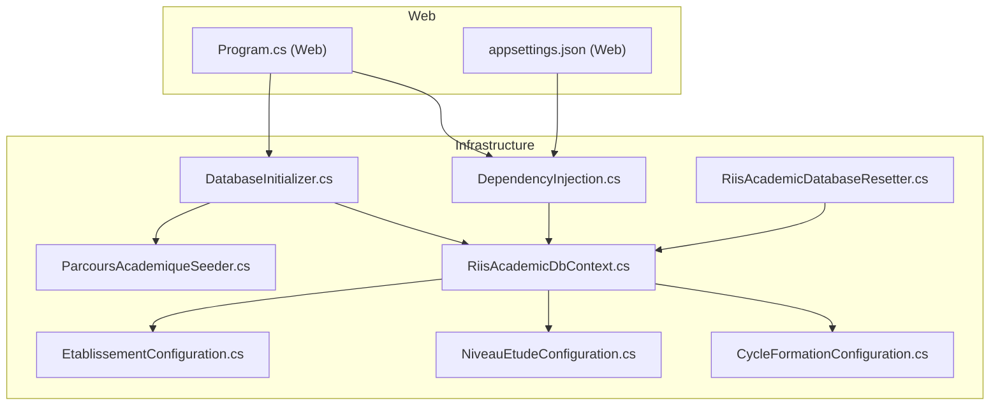
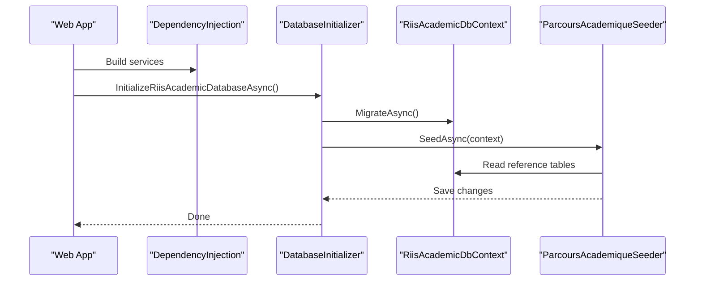
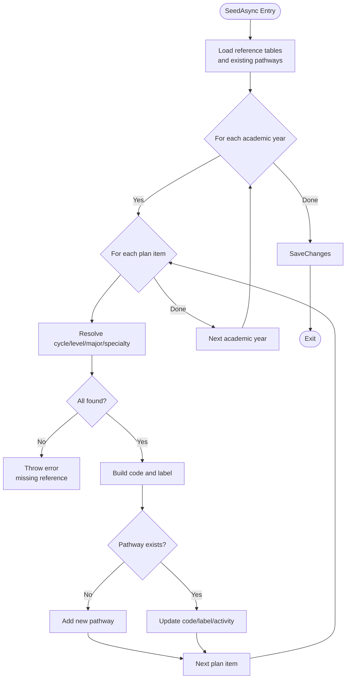
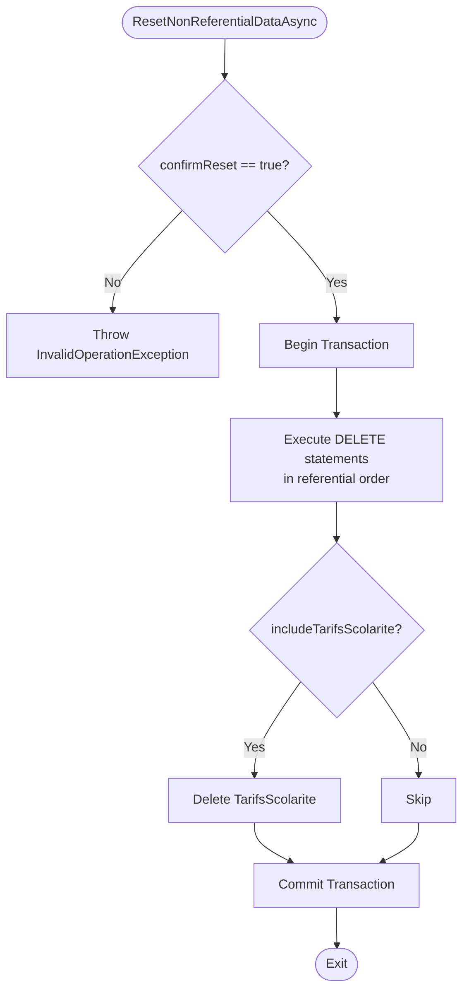
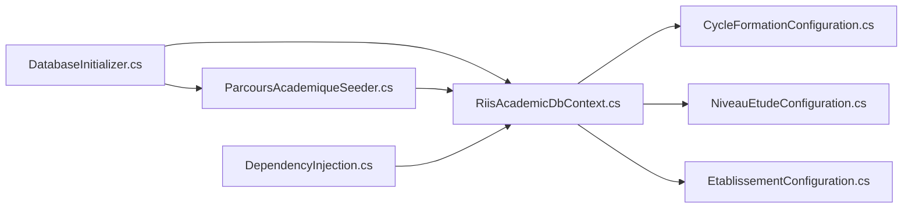

# Data Seeding and Initialization

<cite>
**Referenced Files in This Document**
- [DatabaseInitializer.cs](file://RIIS.Academic.Infrastructure\Persistence\DatabaseInitializer.cs)
- [RiisAcademicDatabaseResetter.cs](file://RIIS.Academic.Infrastructure\Persistence\RiisAcademicDatabaseResetter.cs)
- [ParcoursAcademiqueSeeder.cs](file://RIIS.Academic.Infrastructure\Persistence\Seeders\ParcoursAcademiqueSeeder.cs)
- [RiisAcademicDbContext.cs](file://RIIS.Academic.Infrastructure\Persistence\RiisAcademicDbContext.cs)
- [CycleFormationConfiguration.cs](file://RIIS.Academic.Infrastructure\Persistence\Configurations\Referentiels\CycleFormationConfiguration.cs)
- [NiveauEtudeConfiguration.cs](file://RIIS.Academic.Infrastructure\Persistence\Configurations\Referentiels\NiveauEtudeConfiguration.cs)
- [EtablissementConfiguration.cs](file://RIIS.Academic.Infrastructure\Persistence\Configurations\Etablissements\EtablissementConfiguration.cs)
- [DependencyInjection.cs](file://RIIS.Academic.Infrastructure\DependencyInjection.cs)
- [Program.cs (Web)](file://RIIS.Academic.Web\Program.cs)
- [appsettings.json (Web)](file://RIIS.Academic.Web\appsettings.json)
</cite>

## Table of Contents
1. Introduction
2. Project Structure
3. Core Components
4. Architecture Overview
5. Detailed Component Analysis
6. Dependency Analysis
7. Performance Considerations
8. Troubleshooting Guide
9. Conclusion
10. Appendices

## Introduction
This document explains how the application initializes the database, seeds reference data, and supports development-time resets. It covers:
- The DatabaseInitializer orchestration for migrations and seeding
- Seeder patterns for reference data and composite entities
- Environment-specific initialization via dependency injection configuration
- The database resetter for safe cleanup of non-referential data in development
- How to create new seeders and manage reference data consistently

## Project Structure
The seeding and initialization logic is implemented in the Infrastructure layer and invoked by the Web entry point. Reference data can be seeded via EF Core HasData configurations or via dedicated seeders that run after migrations.

**Diagram sources**
- [Program.cs (Web):1-27](file://RIIS.Academic.Web\Program.cs#L1-L27)
- [DependencyInjection.cs:23-74](file://RIIS.Academic.Infrastructure\DependencyInjection.cs#L23-L74)
- [RiisAcademicDbContext.cs:1-51](file://RIIS.Academic.Infrastructure\Persistence\RiisAcademicDbContext.cs#L1-L51)
- [DatabaseInitializer.cs:1-23](file://RIIS.Academic.Infrastructure\Persistence\DatabaseInitializer.cs#L1-L23)
- [RiisAcademicDatabaseResetter.cs:1-71](file://RIIS.Academic.Infrastructure\Persistence\RiisAcademicDatabaseResetter.cs#L1-L71)
- [ParcoursAcademiqueSeeder.cs:1-142](file://RIIS.Academic.Infrastructure\Persistence\Seeders\ParcoursAcademiqueSeeder.cs#L1-L142)
- [CycleFormationConfiguration.cs:1-23](file://RIIS.Academic.Infrastructure\Persistence\Configurations\Referentiels\CycleFormationConfiguration.cs#L1-L23)
- [NiveauEtudeConfiguration.cs:1-23](file://RIIS.Academic.Infrastructure\Persistence\Configurations\Referentiels\NiveauEtudeConfiguration.cs#L1-L23)
- [EtablissementConfiguration.cs:25-50](file://RIIS.Academic.Infrastructure\Persistence\Configurations\Etablissements\EtablissementConfiguration.cs#L25-L50)

**Section sources**
- [Program.cs (Web):1-27](file://RIIS.Academic.Web\Program.cs#L1-L27)
- [DependencyInjection.cs:23-74](file://RIIS.Academic.Infrastructure\DependencyInjection.cs#L23-L74)
- [RiisAcademicDbContext.cs:1-51](file://RIIS.Academic.Infrastructure\Persistence\RiisAcademicDbContext.cs#L1-L51)

## Core Components
- DatabaseInitializer: Orchestrates migration execution and calls seeders within a service scope.
- ParcoursAcademiqueSeeder: Generates academic pathways based on existing reference tables and ensures idempotent upserts.
- RiisAcademicDatabaseResetter: Safely deletes non-referential business data in a transaction with an explicit confirmation flag.
- Entity Configurations with HasData: Provide baseline reference data (e.g., cycles, study levels, institution).
- DependencyInjection: Selects connection string based on environment and registers DbContext and services.

**Section sources**
- [DatabaseInitializer.cs:6-22](file://RIIS.Academic.Infrastructure\Persistence\DatabaseInitializer.cs#L6-L22)
- [ParcoursAcademiqueSeeder.cs:8-118](file://RIIS.Academic.Infrastructure\Persistence\Seeders\ParcoursAcademiqueSeeder.cs#L8-L118)
- [RiisAcademicDatabaseResetter.cs:5-69](file://RIIS.Academic.Infrastructure\Persistence\RiisAcademicDatabaseResetter.cs#L5-L69)
- [CycleFormationConfiguration.cs:7-21](file://RIIS.Academic.Infrastructure\Persistence\Configurations\Referentiels\CycleFormationConfiguration.cs#L7-L21)
- [NiveauEtudeConfiguration.cs:6-21](file://RIIS.Academic.Infrastructure\Persistence\Configurations\Referentiels\NiveauEtudeConfiguration.cs#L6-L21)
- [EtablissementConfiguration.cs:25-50](file://RIIS.Academic.Infrastructure\Persistence\Configurations\Etablissements\EtablissementConfiguration.cs#L25-L50)
- [DependencyInjection.cs:23-74](file://RIIS.Academic.Infrastructure\DependencyInjection.cs#L23-L74)

## Architecture Overview
Initialization flow:
- The Web app builds services and optionally invokes the initializer.
- The initializer creates a scope, resolves the DbContext, runs migrations, then executes seeders.
- EF Core applies entity configurations, including any HasData entries.
- The resetter provides a controlled way to clear non-referential data during development.

**Diagram sources**
- [Program.cs (Web):1-27](file://RIIS.Academic.Web\Program.cs#L1-L27)
- [DependencyInjection.cs:23-74](file://RIIS.Academic.Infrastructure\DependencyInjection.cs#L23-L74)
- [DatabaseInitializer.cs:6-22](file://RIIS.Academic.Infrastructure\Persistence\DatabaseInitializer.cs#L6-L22)
- [ParcoursAcademiqueSeeder.cs:51-118](file://RIIS.Academic.Infrastructure\Persistence\Seeders\ParcoursAcademiqueSeeder.cs#L51-L118)

## Detailed Component Analysis

### DatabaseInitializer
Responsibilities:
- Creates a service scope to resolve scoped dependencies like DbContext.
- Applies pending migrations to ensure schema readiness.
- Invokes seeders to populate or update reference/composite data.

Key behaviors:
- Idempotent migration execution per call.
- Seeder invocation with cancellation token support.

Usage notes:
- Intended to be called once at application startup in development or deployment scripts.
- In the current Web program, the initializer call is present but commented out; enable it when needed.

**Section sources**
- [DatabaseInitializer.cs:6-22](file://RIIS.Academic.Infrastructure\Persistence\DatabaseInitializer.cs#L6-L22)
- [Program.cs (Web):13-16](file://RIIS.Academic.Web\Program.cs#L13-L16)

### ParcoursAcademiqueSeeder
Responsibilities:
- Builds academic pathways by combining active academic years with reference data (cycles, levels, majors, specialties).
- Ensures each pathway exists exactly once per year/reference combination.
- Updates code and label dynamically based on current references.

Algorithm overview:
- Load reference sets from context.
- For each academic year and plan item:
  - Resolve related references; throw if missing.
  - Compute unique code and human-readable label.
  - Upsert pathway record if not present; otherwise update fields.
- Persist changes.

Validation rules enforced:
- Missing cycle, level, major, or specialty triggers an error to prevent inconsistent seeding.
- Pathway uniqueness is ensured by matching all foreign keys per academic year.

Complexity considerations:
- O(Y × P + R) where Y is number of academic years, P is plan items, R is total reference reads.
- Single SaveChanges minimizes round-trips.

**Diagram sources**
- [ParcoursAcademiqueSeeder.cs:51-118](file://RIIS.Academic.Infrastructure\Persistence\Seeders\ParcoursAcademiqueSeeder.cs#L51-L118)

**Section sources**
- [ParcoursAcademiqueSeeder.cs:8-142](file://RIIS.Academic.Infrastructure\Persistence\Seeders\ParcoursAcademiqueSeeder.cs#L8-L142)

### RiisAcademicDatabaseResetter
Responsibilities:
- Deletes non-referential business data in a single transaction.
- Requires explicit confirmation to avoid accidental data loss.
- Optionally includes tuition fees data deletion.

Behavior highlights:
- Enforces confirmReset flag before proceeding.
- Uses raw SQL for performance and precise control over delete order.
- Commits only if all operations succeed.

Typical usage:
- Development tooling or admin endpoints to reset state between tests or iterations.

**Diagram sources**
- [RiisAcademicDatabaseResetter.cs:7-63](file://RIIS.Academic.Infrastructure\Persistence\RiisAcademicDatabaseResetter.cs#L7-L63)

**Section sources**
- [RiisAcademicDatabaseResetter.cs:5-71](file://RIIS.Academic.Infrastructure\Persistence\RiisAcademicDatabaseResetter.cs#L5-L71)

### Reference Data via Entity Configurations (HasData)
Purpose:
- Seed foundational reference data directly through EF Core model configuration.
- Applied during migrations to ensure baseline data exists.

Examples:
- Academic cycles (PREPA, BTS, LICENCE, MASTER)
- Study levels (1–5)
- Institution (Etablissement)

Notes:
- These are static baselines suitable for all environments unless overridden by environment-specific configuration.
- They complement dynamic seeders that depend on other reference tables.

**Section sources**
- [CycleFormationConfiguration.cs:7-21](file://RIIS.Academic.Infrastructure\Persistence\Configurations\Referentiels\CycleFormationConfiguration.cs#L7-L21)
- [NiveauEtudeConfiguration.cs:6-21](file://RIIS.Academic.Infrastructure\Persistence\Configurations\Referentiels\NiveauEtudeConfiguration.cs#L6-L21)
- [EtablissementConfiguration.cs:25-50](file://RIIS.Academic.Infrastructure\Persistence\Configurations\Etablissements\EtablissementConfiguration.cs#L25-L50)

### Environment-Specific Initialization
Connection selection:
- The infrastructure DI selects a connection string based on the envval configuration value.
- Development uses one connection; production uses another.

Startup behavior:
- The Web Program currently does not invoke the initializer by default; developers can enable it for local development or CI pipelines.

Recommendation:
- Keep initializer calls gated behind environment checks or feature flags to avoid unintended seeding in production.

**Section sources**
- [DependencyInjection.cs:63-74](file://RIIS.Academic.Infrastructure\DependencyInjection.cs#L63-L74)
- [Program.cs (Web):13-16](file://RIIS.Academic.Web\Program.cs#L13-L16)
- [appsettings.json (Web):1-23](file://RIIS.Academic.Web\appsettings.json#L1-L23)

## Dependency Analysis
Key relationships:
- DatabaseInitializer depends on DbContext and seeders.
- ParcoursAcademiqueSeeder depends on multiple reference entities exposed via DbContext.
- Entity configurations register baseline data into the same DbContext pipeline.
- DependencyInjection wires DbContext and services, selecting connection strings by environment.

**Diagram sources**
- [DatabaseInitializer.cs:6-22](file://RIIS.Academic.Infrastructure\Persistence\DatabaseInitializer.cs#L6-L22)
- [ParcoursAcademiqueSeeder.cs:51-118](file://RIIS.Academic.Infrastructure\Persistence\Seeders\ParcoursAcademiqueSeeder.cs#L51-L118)
- [RiisAcademicDbContext.cs:1-51](file://RIIS.Academic.Infrastructure\Persistence\RiisAcademicDbContext.cs#L1-L51)
- [CycleFormationConfiguration.cs:7-21](file://RIIS.Academic.Infrastructure\Persistence\Configurations\Referentiels\CycleFormationConfiguration.cs#L7-L21)
- [NiveauEtudeConfiguration.cs:6-21](file://RIIS.Academic.Infrastructure\Persistence\Configurations\Referentiels\NiveauEtudeConfiguration.cs#L6-L21)
- [EtablissementConfiguration.cs:25-50](file://RIIS.Academic.Infrastructure\Persistence\Configurations\Etablissements\EtablissementConfiguration.cs#L25-L50)
- [DependencyInjection.cs:23-74](file://RIIS.Academic.Infrastructure\DependencyInjection.cs#L23-L74)

**Section sources**
- [DependencyInjection.cs:23-74](file://RIIS.Academic.Infrastructure\DependencyInjection.cs#L23-L74)
- [RiisAcademicDbContext.cs:1-51](file://RIIS.Academic.Infrastructure\Persistence\RiisAcademicDbContext.cs#L1-L51)

## Performance Considerations
- Use migrations for schema changes; keep seeders focused on data.
- Prefer bulk operations or grouped SaveChanges to reduce round-trips (as done in the pathway seeder).
- Avoid deleting large datasets without transactions; the resetter already wraps operations in a transaction.
- Gate initializer calls to development or CI to prevent unnecessary work in production.

[No sources needed since this section provides general guidance]

## Troubleshooting Guide
Common issues and resolutions:
- Missing reference data: If a seeder cannot find required references (e.g., cycle, level, major, specialty), it throws an exception. Ensure reference tables are populated via HasData or prior seeders before running dependent seeders.
- Connection string errors: Verify envval and corresponding connection string exist in configuration.
- Accidental data loss: The resetter requires confirmReset=true; double-check parameters before calling.
- Idempotency: Seeders should check existence before insert/update to avoid duplicates.

**Section sources**
- [ParcoursAcademiqueSeeder.cs:70-81](file://RIIS.Academic.Infrastructure\Persistence\Seeders\ParcoursAcademiqueSeeder.cs#L70-L81)
- [RiisAcademicDatabaseResetter.cs:13-17](file://RIIS.Academic.Infrastructure\Persistence\RiisAcademicDatabaseResetter.cs#L13-L17)
- [DependencyInjection.cs:63-74](file://RIIS.Academic.Infrastructure\DependencyInjection.cs#L63-L74)

## Conclusion
The system separates concerns across migrations, baseline reference data (HasData), and dynamic seeders. The DatabaseInitializer coordinates these steps, while the resetter enables safe development workflows. Follow the provided patterns to add new seeders and maintain consistent, validated reference data across environments.

[No sources needed since this section summarizes without analyzing specific files]

## Appendices

### Creating a New Seeder
Steps:
1. Create a new class under the Seeders folder with a SeedAsync method accepting DbContext and CancellationToken.
2. Load required reference data from DbContext.
3. Validate inputs and referenced entities; throw descriptive errors on missing data.
4. Implement idempotent upsert logic using existing records.
5. Call SaveChanges once at the end.
6. Register the seeder in DatabaseInitializer after migrations.

Example pattern references:
- See the structure and validation approach in the existing pathway seeder.

**Section sources**
- [ParcoursAcademiqueSeeder.cs:51-118](file://RIIS.Academic.Infrastructure\Persistence\Seeders\ParcoursAcademiqueSeeder.cs#L51-L118)
- [DatabaseInitializer.cs:16-20](file://RIIS.Academic.Infrastructure\Persistence\DatabaseInitializer.cs#L16-L20)

### Managing Reference Data
Guidelines:
- Use HasData for small, stable baselines (e.g., cycles, levels, institution).
- Use seeders for composite or derived data that depends on multiple references (e.g., pathways).
- Keep environment-specific values in configuration; avoid hardcoding secrets or environment-only data in seeders.

**Section sources**
- [CycleFormationConfiguration.cs:16-21](file://RIIS.Academic.Infrastructure\Persistence\Configurations\Referentiels\CycleFormationConfiguration.cs#L16-L21)
- [NiveauEtudeConfiguration.cs:15-21](file://RIIS.Academic.Infrastructure\Persistence\Configurations\Referentiels\NiveauEtudeConfiguration.cs#L15-L21)
- [EtablissementConfiguration.cs:30-50](file://RIIS.Academic.Infrastructure\Persistence\Configurations\Etablissements\EtablissementConfiguration.cs#L30-L50)

### Development vs Production Seeding Strategy
- Development: Enable initializer calls locally; use resetter to clean state between runs.
- Production: Run migrations only; avoid automatic seeding unless explicitly orchestrated by deployment scripts with safeguards.
- Configuration: Use envval to select appropriate connection strings and gate initializer calls accordingly.

**Section sources**
- [DependencyInjection.cs:63-74](file://RIIS.Academic.Infrastructure\DependencyInjection.cs#L63-L74)
- [Program.cs (Web):13-16](file://RIIS.Academic.Web\Program.cs#L13-L16)
- [appsettings.json (Web):1-23](file://RIIS.Academic.Web\appsettings.json#L1-L23)