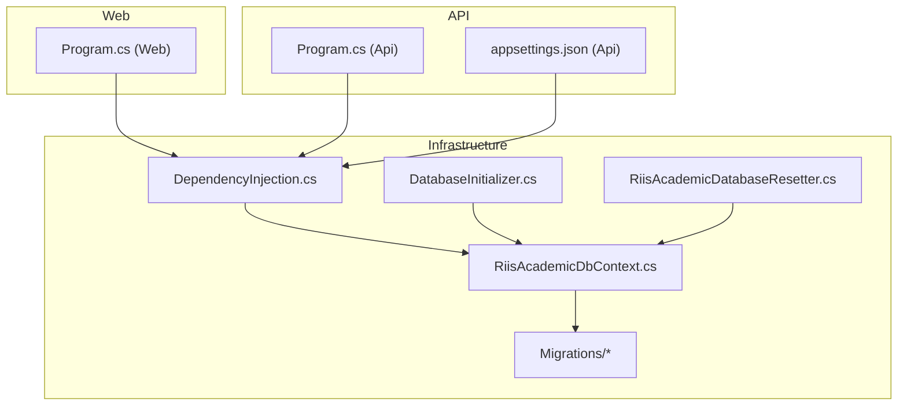
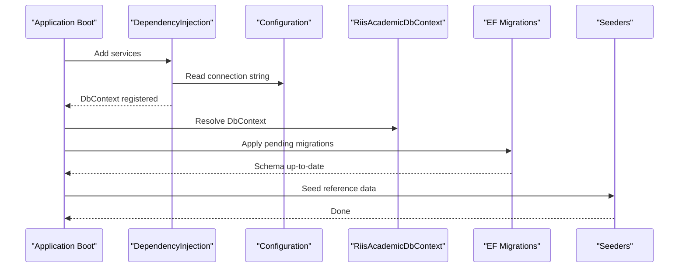
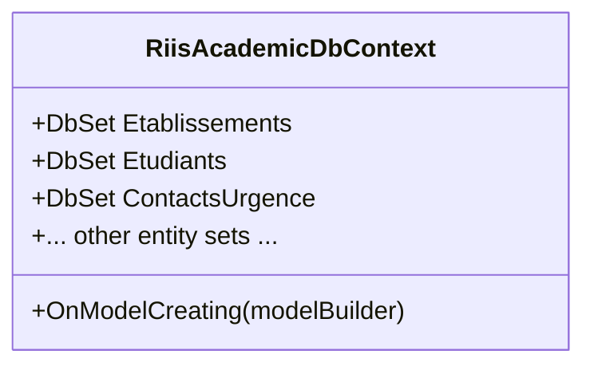
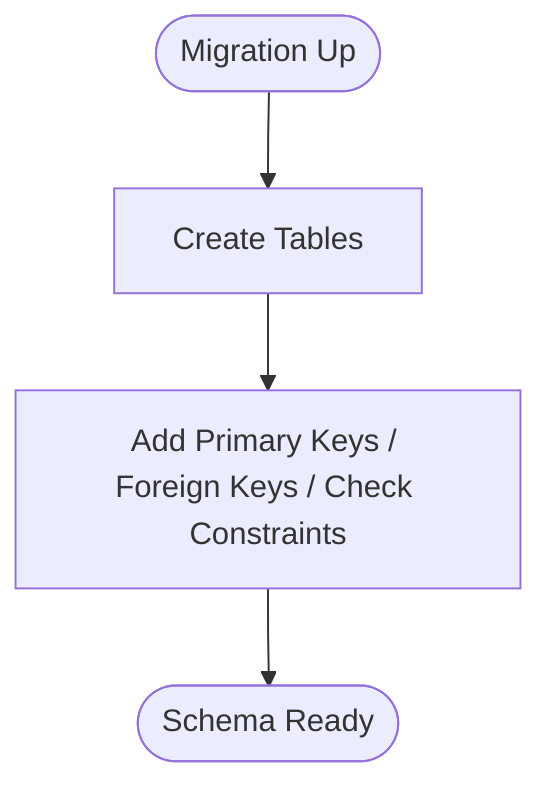
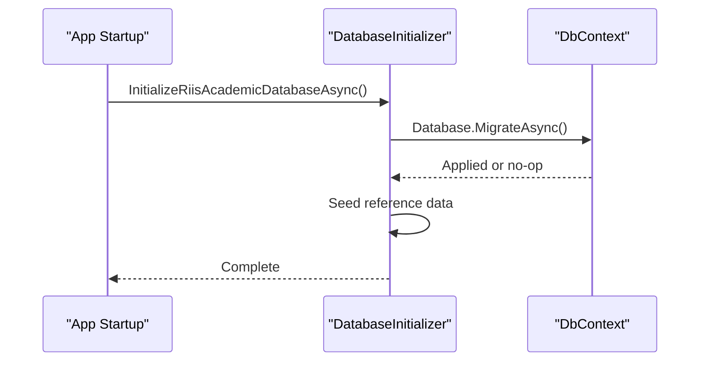
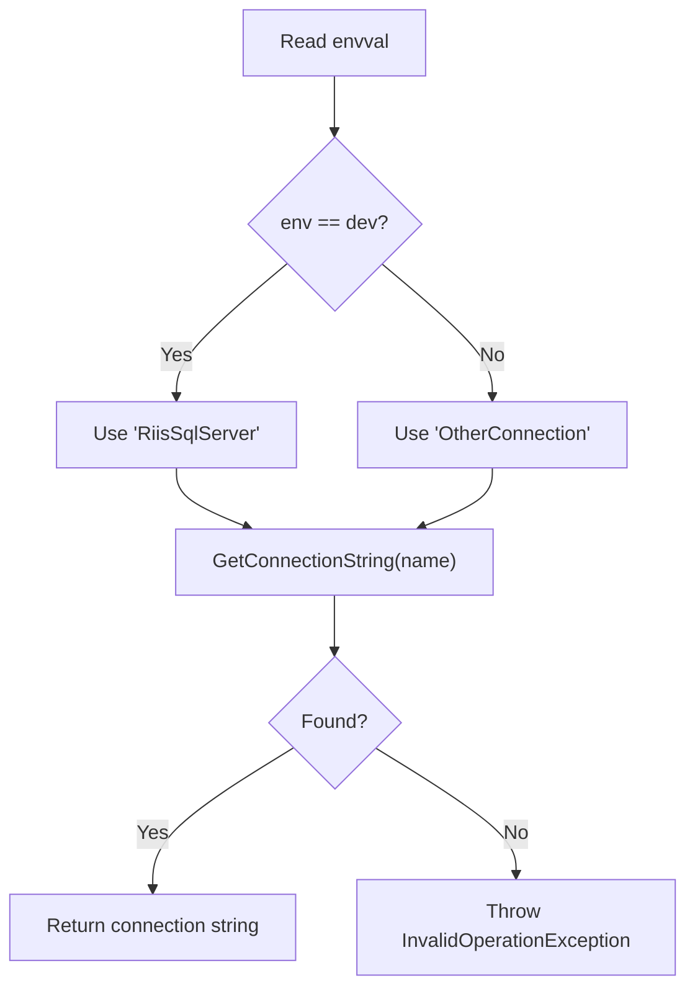
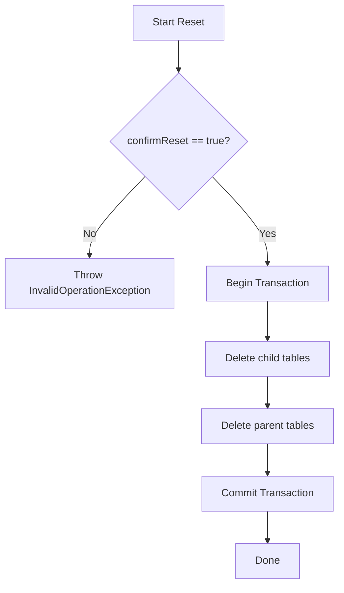
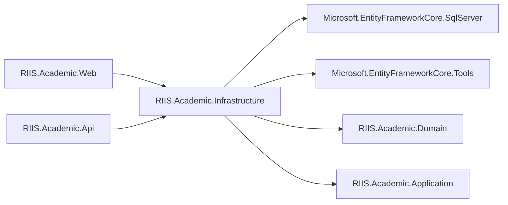

# Database Migrations

<cite>
**Referenced Files in This Document**
- [RiisAcademicDbContext.cs](file://RIIS.Academic.Infrastructure/Persistence/RiisAcademicDbContext.cs)
- [20260814000042_InitialCreate.cs](file://RIIS.Academic.Infrastructure/Persistence/Migrations/20260814000042_InitialCreate.cs)
- [DatabaseInitializer.cs](file://RIIS.Academic.Infrastructure/Persistence/DatabaseInitializer.cs)
- [DependencyInjection.cs](file://RIIS.Academic.Infrastructure/DependencyInjection.cs)
- [Program.cs (Web)](file://RIIS.Academic.Web/Program.cs)
- [Program.cs (Api)](file://RIIS.Academic.Api/Program.cs)
- [appsettings.json (Api)](file://RIIS.Academic.Api/appsettings.json)
- [RIIS.Academic.Infrastructure.csproj](file://RIIS.Academic.Infrastructure/RIIS.Academic.Infrastructure.csproj)
- [RiisAcademicDatabaseResetter.cs](file://RIIS.Academic.Infrastructure/Persistence/RiisAcademicDatabaseResetter.cs)
</cite>

## Table of Contents
1. Introduction
2. Project Structure
3. Core Components
4. Architecture Overview
5. Detailed Component Analysis
6. Dependency Analysis
7. Performance Considerations
8. Troubleshooting Guide
9. Conclusion
10. Appendices

## Introduction
This document explains the database migration strategy and implementation for the RIIS Academic system. It covers how migrations are created, applied, versioned, rolled back, tested, and deployed across environments. It also provides guidelines for creating new migrations, managing schema versions, preserving data during changes, and handling breaking changes safely.

## Project Structure
Migrations and related persistence infrastructure live in the Infrastructure layer:
- DbContext and model configuration discovery
- EF Core migrations folder with an initial migration
- Startup helpers to apply migrations and seed data
- Dependency injection wiring for the DbContext and connection string resolution
- A reset utility for non-referential data in development scenarios

**Diagram sources**
- [DependencyInjection.cs:25-73](file://RIIS.Academic.Infrastructure/DependencyInjection.cs#L25-L73)
- [RiisAcademicDbContext.cs:6-49](file://RIIS.Academic.Infrastructure/Persistence/RiisAcademicDbContext.cs#L6-L49)
- [DatabaseInitializer.cs:8-21](file://RIIS.Academic.Infrastructure/Persistence/DatabaseInitializer.cs#L8-L21)
- [RiisAcademicDatabaseResetter.cs:7-63](file://RIIS.Academic.Infrastructure/Persistence/RiisAcademicDatabaseResetter.cs#L7-L63)
- [Program.cs (Web):8-16](file://RIIS.Academic.Web/Program.cs#L8-L16)
- [Program.cs (Api):5-17](file://RIIS.Academic.Api/Program.cs#L5-L17)
- [appsettings.json (Api):2-6](file://RIIS.Academic.Api/appsettings.json#L2-L6)

**Section sources**
- [DependencyInjection.cs:25-73](file://RIIS.Academic.Infrastructure/DependencyInjection.cs#L25-L73)
- [RiisAcademicDbContext.cs:6-49](file://RIIS.Academic.Infrastructure/Persistence/RiisAcademicDbContext.cs#L6-L49)
- [DatabaseInitializer.cs:8-21](file://RIIS.Academic.Infrastructure/Persistence/DatabaseInitializer.cs#L8-L21)
- [Program.cs (Web):8-16](file://RIIS.Academic.Web/Program.cs#L8-L16)
- [Program.cs (Api):5-17](file://RIIS.Academic.Api/Program.cs#L5-L17)
- [appsettings.json (Api):2-6](file://RIIS.Academic.Api/appsettings.json#L2-L6)

## Core Components
- RiisAcademicDbContext: Central EF Core context that exposes entity sets and applies configurations from the assembly.
- Initial Migration: Defines the baseline schema including tables, constraints, and relationships.
- DatabaseInitializer: Applies pending migrations at runtime and seeds reference data.
- DependencyInjection: Registers DbContext with a SQL Server provider and resolves environment-specific connection strings.
- Reset Utility: Provides a safe way to clear non-referential data in development.

Key responsibilities:
- Versioning: EF Core tracks applied migrations via its internal history table; each migration is a discrete change set.
- Application: Migrations are applied automatically when the application starts using the initializer.
- Configuration: Model-to-table mapping is centralized through Fluent API configurations discovered by the context.

**Section sources**
- [RiisAcademicDbContext.cs:6-49](file://RIIS.Academic.Infrastructure/Persistence/RiisAcademicDbContext.cs#L6-L49)
- [20260814000042_InitialCreate.cs:14-800](file://RIIS.Academic.Infrastructure/Persistence/Migrations/20260814000042_InitialCreate.cs#L14-L800)
- [DatabaseInitializer.cs:8-21](file://RIIS.Academic.Infrastructure/Persistence/DatabaseInitializer.cs#L8-L21)
- [DependencyInjection.cs:25-73](file://RIIS.Academic.Infrastructure/DependencyInjection.cs#L25-L73)
- [RiisAcademicDatabaseResetter.cs:7-63](file://RIIS.Academic.Infrastructure/Persistence/RiisAcademicDatabaseResetter.cs#L7-L63)

## Architecture Overview
The system uses Entity Framework Core with SQL Server. The DbContext is configured in dependency injection and resolved by both the Web and API projects. At startup, the Web project can call the initializer to apply migrations and seed data. The API project registers the DbContext but does not currently invoke the initializer.

**Diagram sources**
- [DependencyInjection.cs:25-73](file://RIIS.Academic.Infrastructure/DependencyInjection.cs#L25-L73)
- [DatabaseInitializer.cs:8-21](file://RIIS.Academic.Infrastructure/Persistence/DatabaseInitializer.cs#L8-L21)
- [Program.cs (Web):8-16](file://RIIS.Academic.Web/Program.cs#L8-L16)
- [Program.cs (Api):5-17](file://RIIS.Academic.Api/Program.cs#L5-L17)

## Detailed Component Analysis

### DbContext and Model Configuration
- Exposes all domain entities as DbSet properties.
- Discovers and applies Fluent API configurations from the same assembly, centralizing schema rules and relationships.

**Diagram sources**
- [RiisAcademicDbContext.cs:6-49](file://RIIS.Academic.Infrastructure/Persistence/RiisAcademicDbContext.cs#L6-L49)

**Section sources**
- [RiisAcademicDbContext.cs:6-49](file://RIIS.Academic.Infrastructure/Persistence/RiisAcademicDbContext.cs#L6-L49)

### Initial Migration
- Creates the baseline schema with tables, primary keys, foreign keys, check constraints, and audit/version columns where applicable.
- Demonstrates consistent use of constraints to enforce business rules at the database level.

**Diagram sources**
- [20260814000042_InitialCreate.cs:14-800](file://RIIS.Academic.Infrastructure/Persistence/Migrations/20260814000042_InitialCreate.cs#L14-L800)

**Section sources**
- [20260814000042_InitialCreate.cs:14-800](file://RIIS.Academic.Infrastructure/Persistence/Migrations/20260814000042_InitialCreate.cs#L14-L800)

### Migration Application and Seeding
- The initializer obtains a scoped DbContext and applies pending migrations before seeding reference data.
- In the current codebase, the Web project includes the initializer call but it is commented out; the API project does not call it.

**Diagram sources**
- [DatabaseInitializer.cs:8-21](file://RIIS.Academic.Infrastructure/Persistence/DatabaseInitializer.cs#L8-L21)
- [Program.cs (Web):8-16](file://RIIS.Academic.Web/Program.cs#L8-L16)

**Section sources**
- [DatabaseInitializer.cs:8-21](file://RIIS.Academic.Infrastructure/Persistence/DatabaseInitializer.cs#L8-L21)
- [Program.cs (Web):8-16](file://RIIS.Academic.Web/Program.cs#L8-L16)
- [Program.cs (Api):5-17](file://RIIS.Academic.Api/Program.cs#L5-L17)

### Connection String Resolution
- The infrastructure layer selects a connection string name based on an environment variable and reads the corresponding connection string from configuration.
- If the expected connection string is missing, an exception is thrown to fail fast.

**Diagram sources**
- [DependencyInjection.cs:63-73](file://RIIS.Academic.Infrastructure/DependencyInjection.cs#L63-L73)

**Section sources**
- [DependencyInjection.cs:63-73](file://RIIS.Academic.Infrastructure/DependencyInjection.cs#L63-L73)
- [appsettings.json (Api):2-6](file://RIIS.Academic.Api/appsettings.json#L2-L6)

### Data Reset Utility
- Provides a controlled way to delete non-referential data in development, wrapped in a transaction and requiring explicit confirmation.
- Deletes dependent rows first to respect referential integrity.

**Diagram sources**
- [RiisAcademicDatabaseResetter.cs:7-63](file://RIIS.Academic.Infrastructure/Persistence/RiisAcademicDatabaseResetter.cs#L7-L63)

**Section sources**
- [RiisAcademicDatabaseResetter.cs:7-63](file://RIIS.Academic.Infrastructure/Persistence/RiisAcademicDatabaseResetter.cs#L7-L63)

## Dependency Analysis
- The Infrastructure project references EF Core packages for SQL Server and tools required for migrations.
- Both Web and API projects depend on Infrastructure to obtain DbContext and services.
- The DbContext depends on configurations discovered from the same assembly.

**Diagram sources**
- [RIIS.Academic.Infrastructure.csproj:8-22](file://RIIS.Academic.Infrastructure/RIIS.Academic.Infrastructure.csproj#L8-L22)
- [Program.cs (Web):3-11](file://RIIS.Academic.Web/Program.cs#L3-L11)
- [Program.cs (Api):2-9](file://RIIS.Academic.Api/Program.cs#L2-L9)

**Section sources**
- [RIIS.Academic.Infrastructure.csproj:8-22](file://RIIS.Academic.Infrastructure/RIIS.Academic.Infrastructure.csproj#L8-L22)
- [Program.cs (Web):3-11](file://RIIS.Academic.Web/Program.cs#L3-L11)
- [Program.cs (Api):2-9](file://RIIS.Academic.Api/Program.cs#L2-L9)

## Performance Considerations
- Use targeted migrations to minimize downtime; avoid large destructive operations in hot paths.
- Prefer additive changes (add columns, add tables) over destructive ones (drop columns/tables).
- For large data updates, consider batching and running outside request threads.
- Ensure indexes are added judiciously and reviewed for query patterns.
- Keep transactions small and focused to reduce lock contention.

[No sources needed since this section provides general guidance]

## Troubleshooting Guide
Common issues and remedies:
- Missing connection string: The infrastructure throws an exception if the expected connection string is not found. Verify configuration and environment variables.
- Migration conflicts: If local model snapshots differ from the database, regenerate migrations after updating models.
- Seed failures: Ensure migrations are applied before seeding; verify seed idempotency.
- Data reset errors: The reset utility requires explicit confirmation and will throw if bypassed; ensure you pass the confirmation flag.

**Section sources**
- [DependencyInjection.cs:63-73](file://RIIS.Academic.Infrastructure/DependencyInjection.cs#L63-L73)
- [RiisAcademicDatabaseResetter.cs:13-17](file://RIIS.Academic.Infrastructure/Persistence/RiisAcademicDatabaseResetter.cs#L13-L17)

## Conclusion
The system uses EF Core migrations to manage schema evolution with a single initial migration defining the baseline schema. Migrations are applied at runtime via a dedicated initializer, and connection strings are resolved per environment. A reset utility supports safe development workflows. To scale this approach, adopt incremental migrations, robust testing, and careful deployment practices outlined below.

[No sources needed since this section summarizes without analyzing specific files]

## Appendices

### Migration Naming Conventions
- Use descriptive names that reflect the change, e.g., “AddStudentEmailIndex”, “CreatePaymentSchedules”.
- Prefix with a timestamp or sequence number to preserve order (EF tooling typically handles this).
- Keep names concise but unambiguous; avoid generic names like “Update1”.

[No sources needed since this section provides general guidance]

### Creating New Migrations
Steps:
1. Update domain models or Fluent API configurations.
2. Generate a migration using your preferred tooling (e.g., CLI or Visual Studio).
3. Review the generated Up and Down methods to ensure they are safe and idempotent where possible.
4. Test locally against a fresh database.
5. Promote the migration to shared source control.

[No sources needed since this section provides general guidance]

### Rollback Procedures
- Use rollback commands to revert the last migration when appropriate.
- For complex rollbacks, write explicit Down logic to restore data or structure safely.
- Always test rollbacks in a non-production environment first.

[No sources needed since this section provides general guidance]

### Deployment Strategies Across Environments
- Development: Apply migrations on app start; optionally seed data.
- Staging: Apply migrations as part of the deployment pipeline before starting the service.
- Production: Apply migrations in a controlled window; prefer zero-downtime strategies for additive changes; coordinate with release management.

[No sources needed since this section provides general guidance]

### Migration Testing Approaches
- Unit tests: Validate model configurations and constraints using an in-memory or test database.
- Integration tests: Spin up a test database, apply migrations, run seeders, and execute representative queries.
- Contract tests: Ensure downstream consumers remain compatible with schema changes.

[No sources needed since this section provides general guidance]

### Data Preservation Techniques
- Prefer additive changes: add columns with defaults, add tables, add indexes.
- Avoid dropping columns or tables in production unless absolutely necessary.
- Use temporary staging tables for complex data transformations and switch references atomically.
- Back up databases before major schema changes in production.

[No sources needed since this section provides general guidance]

### Handling Breaking Changes
- Plan deprecations: mark fields as optional, provide default values, and migrate data gradually.
- Introduce compatibility layers: support old and new formats side-by-side during transition.
- Communicate breaking changes early and coordinate deployments carefully.

[No sources needed since this section provides general guidance]

### Managing Database Schema Versions
- Treat migrations as immutable versioned artifacts; never edit applied migrations.
- Maintain a single source of truth for schema state via EF’s migration history.
- Document significant changes in release notes and track them alongside code changes.

[No sources needed since this section provides general guidance]