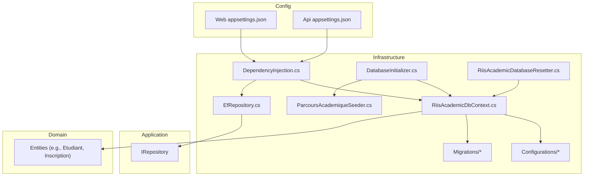
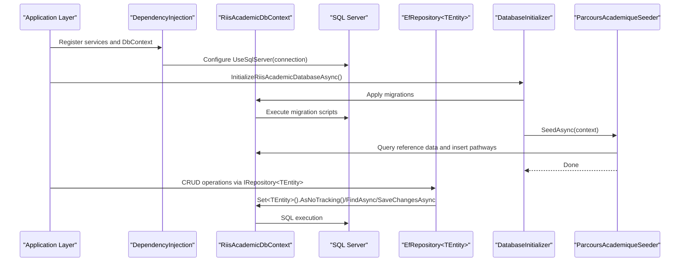
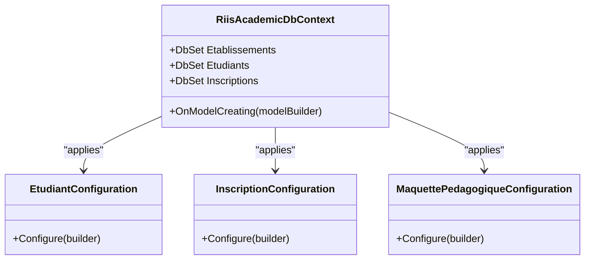
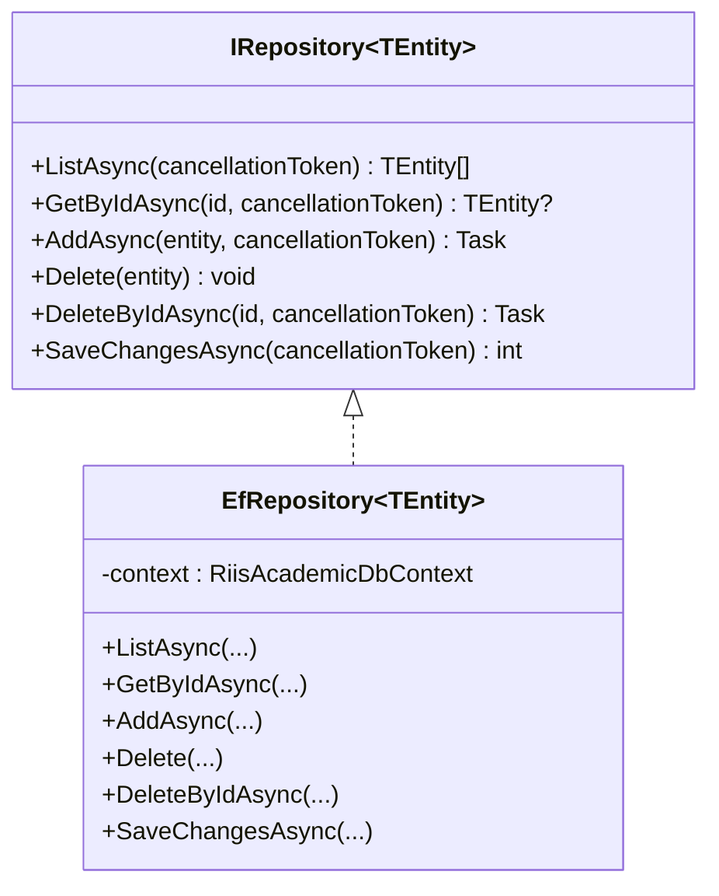
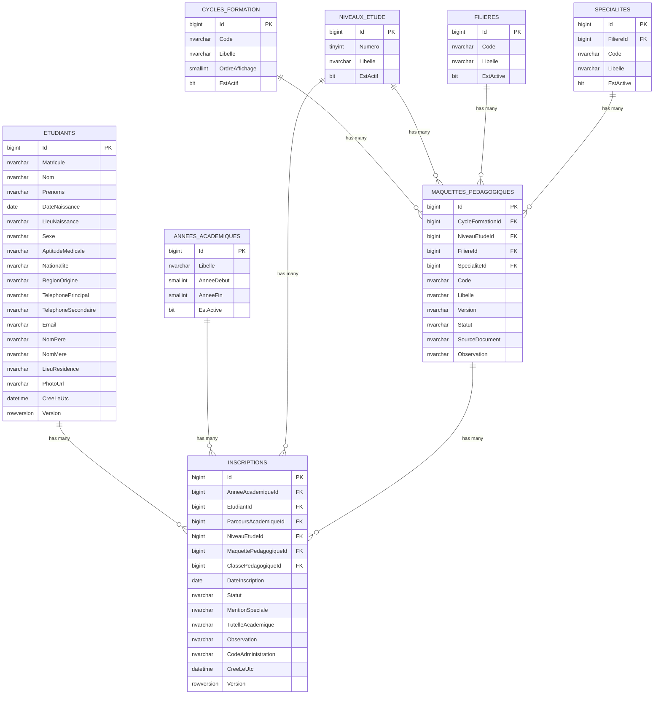
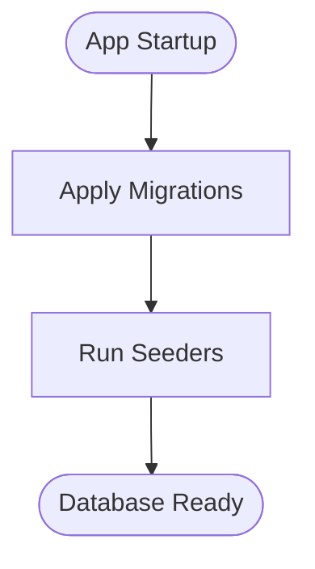
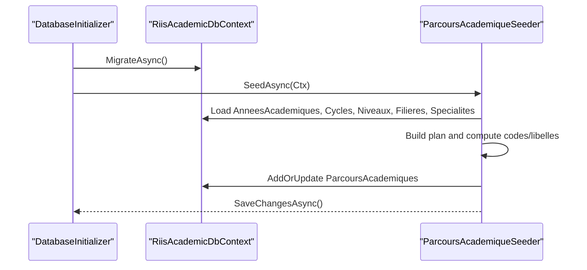
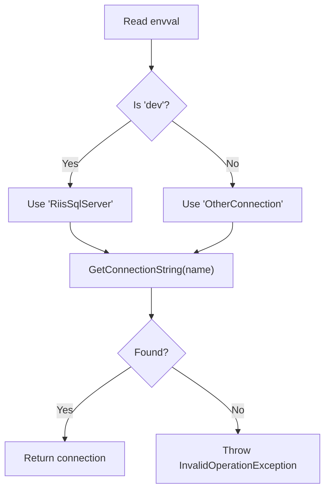
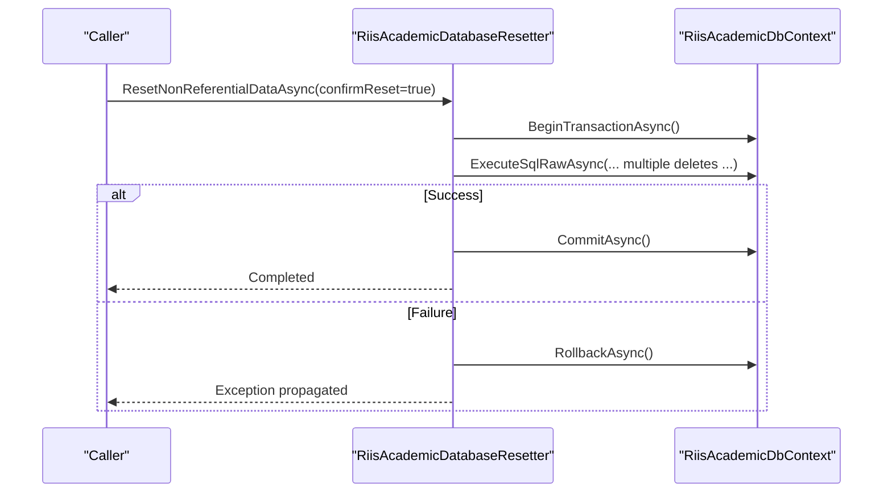
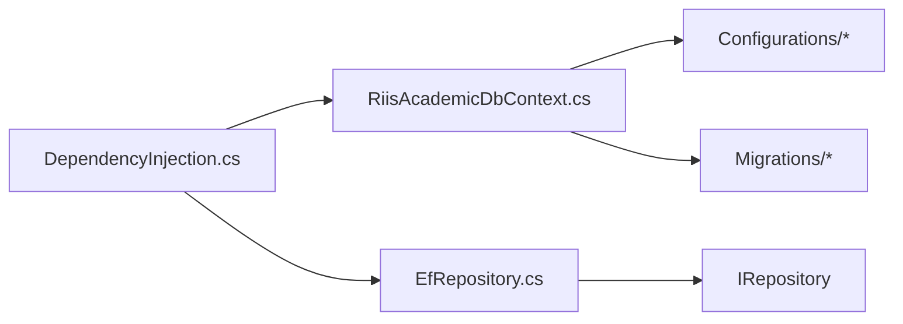

# Database Persistence

<cite>
**Referenced Files in This Document**
- [RiisAcademicDbContext.cs](file://RIIS.Academic.Infrastructure\Persistence\RiisAcademicDbContext.cs)
- [EfRepository.cs](file://RIIS.Academic.Infrastructure\Persistence\Repositories\EfRepository.cs)
- [IRepository.cs](file://RIIS.Academic.Application\Abstractions\Persistence\IRepository.cs)
- [DependencyInjection.cs](file://RIIS.Academic.Infrastructure\DependencyInjection.cs)
- [DatabaseInitializer.cs](file://RIIS.Academic.Infrastructure\Persistence\DatabaseInitializer.cs)
- [ParcoursAcademiqueSeeder.cs](file://RIIS.Academic.Infrastructure\Persistence\Seeders\ParcoursAcademiqueSeeder.cs)
- [RiisAcademicDatabaseResetter.cs](file://RIIS.Academic.Infrastructure\Persistence\RiisAcademicDatabaseResetter.cs)
- [EtudiantConfiguration.cs](file://RIIS.Academic.Infrastructure\Persistence\Configurations\Etudiants\EtudiantConfiguration.cs)
- [InscriptionConfiguration.cs](file://RIIS.Academic.Infrastructure\Persistence\Configurations\Inscriptions\InscriptionConfiguration.cs)
- [MaquettePedagogiqueConfiguration.cs](file://RIIS.Academic.Infrastructure\Persistence\Configurations\Programmes\MaquettePedagogiqueConfiguration.cs)
- [20260814000042_InitialCreate.cs](file://RIIS.Academic.Infrastructure\Persistence\Migrations\20260814000042_InitialCreate.cs)
- [Etudiant.cs](file://RIIS.Academic.Domain\Etudiants\Etudiant.cs)
- [Inscription.cs](file://RIIS.Academic.Domain\Inscriptions\Inscription.cs)
- [Entity.cs](file://RIIS.Academic.Domain\Common\Entity.cs)
- [appsettings.json (Web)](file://RIIS.Academic.Web\appsettings.json)
- [appsettings.json (Api)](file://RIIS.Academic.Api\appsettings.json)
</cite>

## Table of Contents
1. [Introduction](#introduction)
2. [Project Structure](#project-structure)
3. [Core Components](#core-components)
4. [Architecture Overview](#architecture-overview)
5. [Detailed Component Analysis](#detailed-component-analysis)
6. [Dependency Analysis](#dependency-analysis)
7. [Performance Considerations](#performance-considerations)
8. [Troubleshooting Guide](#troubleshooting-guide)
9. [Conclusion](#conclusion)

## Introduction
This document describes the database persistence layer built with Entity Framework Core. It covers context configuration, Fluent API mappings, repository pattern implementation, schema design and constraints, migrations, initialization and seeding, connection string management across environments, performance techniques, transaction handling, error recovery patterns, and data consistency guarantees.

## Project Structure
The persistence layer resides in the Infrastructure project and is organized as follows:
- DbContext and EF Core setup
- Fluent API entity configurations grouped by domain area
- Generic repository implementing application abstractions
- Migrations for schema evolution
- Database initializer and seeders for bootstrapping data
- Dependency injection wiring and environment-based connection selection

**Diagram sources**
- [DependencyInjection.cs:25-73](file://RIIS.Academic.Infrastructure\DependencyInjection.cs#L25-L73)
- [RiisAcademicDbContext.cs:6-49](file://RIIS.Academic.Infrastructure\Persistence\RiisAcademicDbContext.cs#L6-L49)
- [EfRepository.cs:6-33](file://RIIS.Academic.Infrastructure\Persistence\Repositories\EfRepository.cs#L6-L33)
- [DatabaseInitializer.cs:8-21](file://RIIS.Academic.Infrastructure\Persistence\DatabaseInitializer.cs#L8-L21)
- [ParcoursAcademiqueSeeder.cs:51-118](file://RIIS.Academic.Infrastructure\Persistence\Seeders\ParcoursAcademiqueSeeder.cs#L51-L118)
- [RiisAcademicDatabaseResetter.cs:7-63](file://RIIS.Academic.Infrastructure\Persistence\RiisAcademicDatabaseResetter.cs#L7-L63)
- [EtudiantConfiguration.cs:8-32](file://RIIS.Academic.Infrastructure\Persistence\Configurations\Etudiants\EtudiantConfiguration.cs#L8-L32)
- [InscriptionConfiguration.cs:8-35](file://RIIS.Academic.Infrastructure\Persistence\Configurations\Inscriptions\InscriptionConfiguration.cs#L8-L35)
- [MaquettePedagogiqueConfiguration.cs:8-36](file://RIIS.Academic.Infrastructure\Persistence\Configurations\Programmes\MaquettePedagogiqueConfiguration.cs#L8-L36)
- [20260814000042_InitialCreate.cs:14-200](file://RIIS.Academic.Infrastructure\Persistence\Migrations\20260814000042_InitialCreate.cs#L14-L200)
- [Etudiant.cs:3-27](file://RIIS.Academic.Domain\Etudiants\Etudiant.cs#L3-L27)
- [Inscription.cs:3-36](file://RIIS.Academic.Domain\Inscriptions\Inscription.cs#L3-L36)
- [appsettings.json (Web):1-23](file://RIIS.Academic.Web\appsettings.json#L1-L23)
- [appsettings.json (Api):1-6](file://RIIS.Academic.Api\appsettings.json#L1-L6)

**Section sources**
- [DependencyInjection.cs:25-73](file://RIIS.Academic.Infrastructure\DependencyInjection.cs#L25-L73)
- [RiisAcademicDbContext.cs:6-49](file://RIIS.Academic.Infrastructure\Persistence\RiisAcademicDbContext.cs#L6-L49)

## Core Components
- DbContext: Central EF Core context exposing DbSets for all domain entities and applying Fluent API configurations from the assembly.
- Repository: Generic repository implementing the application’s IRepository interface over the DbContext.
- Configuration: Fluent API classes per entity defining tables, keys, indexes, constraints, and relationships.
- Initialization: Startup routine that applies migrations and seeds reference data.
- Seeding: Deterministic seeding of academic pathways based on existing reference data.
- Reset: Safe, transactional reset of non-referential business data.

**Section sources**
- [RiisAcademicDbContext.cs:6-49](file://RIIS.Academic.Infrastructure\Persistence\RiisAcademicDbContext.cs#L6-L49)
- [EfRepository.cs:6-33](file://RIIS.Academic.Infrastructure\Persistence\Repositories\EfRepository.cs#L6-L33)
- [IRepository.cs:3-12](file://RIIS.Academic.Application\Abstractions\Persistence\IRepository.cs#L3-L12)
- [DatabaseInitializer.cs:8-21](file://RIIS.Academic.Infrastructure\Persistence\DatabaseInitializer.cs#L8-L21)
- [ParcoursAcademiqueSeeder.cs:51-118](file://RIIS.Academic.Infrastructure\Persistence\Seeders\ParcoursAcademiqueSeeder.cs#L51-L118)
- [RiisAcademicDatabaseResetter.cs:7-63](file://RIIS.Academic.Infrastructure\Persistence\RiisAcademicDatabaseResetter.cs#L7-L63)

## Architecture Overview
The system uses a clean architecture where the Application layer defines persistence abstractions, and the Infrastructure layer implements them using EF Core. The DbContext centralizes mapping via Fluent API, while migrations codify schema changes. Environment-specific connection strings are resolved at startup to support dev/prod scenarios.

**Diagram sources**
- [DependencyInjection.cs:25-73](file://RIIS.Academic.Infrastructure\DependencyInjection.cs#L25-L73)
- [DatabaseInitializer.cs:8-21](file://RIIS.Academic.Infrastructure\Persistence\DatabaseInitializer.cs#L8-L21)
- [ParcoursAcademiqueSeeder.cs:51-118](file://RIIS.Academic.Infrastructure\Persistence\Seeders\ParcoursAcademiqueSeeder.cs#L51-L118)
- [EfRepository.cs:6-33](file://RIIS.Academic.Infrastructure\Persistence\Repositories\EfRepository.cs#L6-L33)
- [RiisAcademicDbContext.cs:6-49](file://RIIS.Academic.Infrastructure\Persistence\RiisAcademicDbContext.cs#L6-L49)

## Detailed Component Analysis

### DbContext and Fluent API Mapping
- Context exposes typed DbSets for all entities and applies all IEntityTypeConfiguration implementations from the assembly.
- Fluent API configurations define table names, primary keys, property lengths, required fields, enum conversions, row versioning, indexes, unique constraints, and foreign key relationships with delete behaviors.

Key examples:
- Student entity mapping includes unique filtered index on Matricule, row versioning, and various length constraints.
- Enrollment entity mapping defines composite unique index and multiple one-to-many relationships with restrictive delete behavior.
- Academic blueprint mapping enforces a composite unique constraint across cycle, level, major, specialization, code, and version.

**Diagram sources**
- [RiisAcademicDbContext.cs:6-49](file://RIIS.Academic.Infrastructure\Persistence\RiisAcademicDbContext.cs#L6-L49)
- [EtudiantConfiguration.cs:8-32](file://RIIS.Academic.Infrastructure\Persistence\Configurations\Etudiants\EtudiantConfiguration.cs#L8-L32)
- [InscriptionConfiguration.cs:8-35](file://RIIS.Academic.Infrastructure\Persistence\Configurations\Inscriptions\InscriptionConfiguration.cs#L8-L35)
- [MaquettePedagogiqueConfiguration.cs:8-36](file://RIIS.Academic.Infrastructure\Persistence\Configurations\Programmes\MaquettePedagogiqueConfiguration.cs#L8-L36)

**Section sources**
- [RiisAcademicDbContext.cs:6-49](file://RIIS.Academic.Infrastructure\Persistence\RiisAcademicDbContext.cs#L6-L49)
- [EtudiantConfiguration.cs:8-32](file://RIIS.Academic.Infrastructure\Persistence\Configurations\Etudiants\EtudiantConfiguration.cs#L8-L32)
- [InscriptionConfiguration.cs:8-35](file://RIIS.Academic.Infrastructure\Persistence\Configurations\Inscriptions\InscriptionConfiguration.cs#L8-L35)
- [MaquettePedagogiqueConfiguration.cs:8-36](file://RIIS.Academic.Infrastructure\Persistence\Configurations\Programmes\MaquettePedagogiqueConfiguration.cs#L8-L36)

### Repository Pattern Implementation
- The generic EfRepository implements IRepository<TEntity> providing read-only list queries with AsNoTracking, GetById using FindAsync, Add, Delete, DeleteById, and SaveChangesAsync delegation to the DbContext.
- This abstraction decouples application services from EF Core specifics and enables testability.

**Diagram sources**
- [IRepository.cs:3-12](file://RIIS.Academic.Application\Abstractions\Persistence\IRepository.cs#L3-L12)
- [EfRepository.cs:6-33](file://RIIS.Academic.Infrastructure\Persistence\Repositories\EfRepository.cs#L6-L33)

**Section sources**
- [IRepository.cs:3-12](file://RIIS.Academic.Application\Abstractions\Persistence\IRepository.cs#L3-L12)
- [EfRepository.cs:6-33](file://RIIS.Academic.Infrastructure\Persistence\Repositories\EfRepository.cs#L6-L33)

### Database Schema Design and Relationships
- Tables include academic years, cycles, levels, majors, specializations, students, enrollments, academic blueprints, evaluations, results, procedural records, and school finance elements.
- Constraints and indexes:
  - Unique filtered indexes for optional identifiers (e.g., student matricule, administrative codes).
  - Composite unique indexes to enforce business rules (e.g., enrollment uniqueness per academic year and student; blueprint uniqueness across cycle/level/major/specialization/code/version).
  - Check constraints for numeric ranges and period validity.
  - Foreign keys with restrictive delete behavior to preserve referential integrity for core entities.

**Diagram sources**
- [20260814000042_InitialCreate.cs:14-200](file://RIIS.Academic.Infrastructure\Persistence\Migrations\20260814000042_InitialCreate.cs#L14-L200)
- [InscriptionConfiguration.cs:23-35](file://RIIS.Academic.Infrastructure\Persistence\Configurations\Inscriptions\InscriptionConfiguration.cs#L23-L35)
- [MaquettePedagogiqueConfiguration.cs:20-36](file://RIIS.Academic.Infrastructure\Persistence\Configurations\Programmes\MaquettePedagogiqueConfiguration.cs#L20-L36)

**Section sources**
- [20260814000042_InitialCreate.cs:14-200](file://RIIS.Academic.Infrastructure\Persistence\Migrations\20260814000042_InitialCreate.cs#L14-L200)
- [InscriptionConfiguration.cs:8-35](file://RIIS.Academic.Infrastructure\Persistence\Configurations\Inscriptions\InscriptionConfiguration.cs#L8-L35)
- [MaquettePedagogiqueConfiguration.cs:8-36](file://RIIS.Academic.Infrastructure\Persistence\Configurations\Programmes\MaquettePedagogiqueConfiguration.cs#L8-L36)

### Migration Strategy
- Migrations are stored under the Infrastructure project and applied at runtime during database initialization.
- The initial migration creates core tables, constraints, and relationships. Future changes should be added via new migrations and applied through the same initialization flow.

**Diagram sources**
- [DatabaseInitializer.cs:8-21](file://RIIS.Academic.Infrastructure\Persistence\DatabaseInitializer.cs#L8-L21)
- [20260814000042_InitialCreate.cs:14-200](file://RIIS.Academic.Infrastructure\Persistence\Migrations\20260814000042_InitialCreate.cs#L14-L200)

**Section sources**
- [DatabaseInitializer.cs:8-21](file://RIIS.Academic.Infrastructure\Persistence\DatabaseInitializer.cs#L8-L21)
- [20260814000042_InitialCreate.cs:14-200](file://RIIS.Academic.Infrastructure\Persistence\Migrations\20260814000042_InitialCreate.cs#L14-L200)

### Database Initialization and Data Seeding
- Initialization applies migrations and then seeds academic pathways based on existing reference data (academic years, cycles, levels, majors, specializations).
- Seeder logic computes pathway codes and labels, updates activation status based on active academic years, and persists missing or updated records.

**Diagram sources**
- [DatabaseInitializer.cs:8-21](file://RIIS.Academic.Infrastructure\Persistence\DatabaseInitializer.cs#L8-L21)
- [ParcoursAcademiqueSeeder.cs:51-118](file://RIIS.Academic.Infrastructure\Persistence\Seeders\ParcoursAcademiqueSeeder.cs#L51-L118)

**Section sources**
- [DatabaseInitializer.cs:8-21](file://RIIS.Academic.Infrastructure\Persistence\DatabaseInitializer.cs#L8-L21)
- [ParcoursAcademiqueSeeder.cs:51-118](file://RIIS.Academic.Infrastructure\Persistence\Seeders\ParcoursAcademiqueSeeder.cs#L51-L118)

### Connection String Management and Environment-Specific Configurations
- Connection selection is driven by an environment value and resolves to named connection strings defined in configuration.
- In this implementation, the infrastructure reads an environment flag and selects between two connection string names, throwing if not found.
- Example configurations exist in both Web and Api projects demonstrating how to provide different connections per environment.

**Diagram sources**
- [DependencyInjection.cs:63-73](file://RIIS.Academic.Infrastructure\DependencyInjection.cs#L63-L73)
- [appsettings.json (Web):1-23](file://RIIS.Academic.Web\appsettings.json#L1-L23)
- [appsettings.json (Api):1-6](file://RIIS.Academic.Api\appsettings.json#L1-L6)

**Section sources**
- [DependencyInjection.cs:63-73](file://RIIS.Academic.Infrastructure\DependencyInjection.cs#L63-L73)
- [appsettings.json (Web):1-23](file://RIIS.Academic.Web\appsettings.json#L1-L23)
- [appsettings.json (Api):1-6](file://RIIS.Academic.Api\appsettings.json#L1-L6)

### Transaction Handling, Error Recovery, and Data Consistency
- Reset utility performs bulk deletions within a single explicit transaction to ensure atomicity and consistency when clearing non-referential data.
- Errors during reset will roll back the entire operation, preventing partial state.
- For write operations, application services should wrap related changes in transactions when necessary; the repository delegates SaveChangesAsync to the DbContext, which can participate in ambient transactions.

**Diagram sources**
- [RiisAcademicDatabaseResetter.cs:7-63](file://RIIS.Academic.Infrastructure\Persistence\RiisAcademicDatabaseResetter.cs#L7-L63)

**Section sources**
- [RiisAcademicDatabaseResetter.cs:7-63](file://RIIS.Academic.Infrastructure\Persistence\RiisAcademicDatabaseResetter.cs#L7-L63)

## Dependency Analysis
- The DbContext depends on Fluent API configurations to map entities to tables and enforce constraints.
- The repository depends on the DbContext and implements the application’s IRepository interface.
- Dependency injection wires the DbContext with a SQL Server provider and registers the repository and application services.
- Migrations depend on the model produced by the DbContext and configurations.

**Diagram sources**
- [DependencyInjection.cs:25-73](file://RIIS.Academic.Infrastructure\DependencyInjection.cs#L25-L73)
- [RiisAcademicDbContext.cs:6-49](file://RIIS.Academic.Infrastructure\Persistence\RiisAcademicDbContext.cs#L6-L49)
- [EfRepository.cs:6-33](file://RIIS.Academic.Infrastructure\Persistence\Repositories\EfRepository.cs#L6-L33)
- [IRepository.cs:3-12](file://RIIS.Academic.Application\Abstractions\Persistence\IRepository.cs#L3-L12)

**Section sources**
- [DependencyInjection.cs:25-73](file://RIIS.Academic.Infrastructure\DependencyInjection.cs#L25-L73)
- [RiisAcademicDbContext.cs:6-49](file://RIIS.Academic.Infrastructure\Persistence\RiisAcademicDbContext.cs#L6-L49)
- [EfRepository.cs:6-33](file://RIIS.Academic.Infrastructure\Persistence\Repositories\EfRepository.cs#L6-L33)
- [IRepository.cs:3-12](file://RIIS.Academic.Application\Abstractions\Persistence\IRepository.cs#L3-L12)

## Performance Considerations
- Read-heavy queries use AsNoTracking to avoid change tracking overhead.
- RowVersion columns enable optimistic concurrency control to prevent lost updates.
- Filtered unique indexes reduce storage and improve lookup performance for sparse unique keys.
- Composite unique indexes enforce business rules efficiently at the database level.
- Consider batching writes and using appropriate query projections for large datasets.

[No sources needed since this section provides general guidance]

## Troubleshooting Guide
- Missing connection string: If the selected connection name is not present in configuration, an exception is thrown during service registration. Ensure environment values and connection strings match expectations.
- Migration failures: Verify that the target database is reachable and that the user has sufficient permissions. Review the latest migration script for any platform-specific issues.
- Seeder errors: Seeders rely on existing reference data; missing cycles, levels, majors, or specializations will cause exceptions. Populate reference data before running path seeding.
- Reset safety: The reset utility requires explicit confirmation to proceed; it operates within a transaction to maintain consistency.

**Section sources**
- [DependencyInjection.cs:63-73](file://RIIS.Academic.Infrastructure\DependencyInjection.cs#L63-L73)
- [ParcoursAcademiqueSeeder.cs:51-118](file://RIIS.Academic.Infrastructure\Persistence\Seeders\ParcoursAcademiqueSeeder.cs#L51-L118)
- [RiisAcademicDatabaseResetter.cs:7-63](file://RIIS.Academic.Infrastructure\Persistence\RiisAcademicDatabaseResetter.cs#L7-L63)

## Conclusion
The persistence layer leverages EF Core with a clear separation of concerns: DbContext and Fluent API for mapping, a generic repository for data access, migrations for schema evolution, and robust initialization and seeding routines. Environment-aware connection management ensures flexibility across deployments. Transactions and constraints safeguard data integrity, while performance-oriented practices like AsNoTracking and optimized indexes support scalability.

[No sources needed since this section summarizes without analyzing specific files]