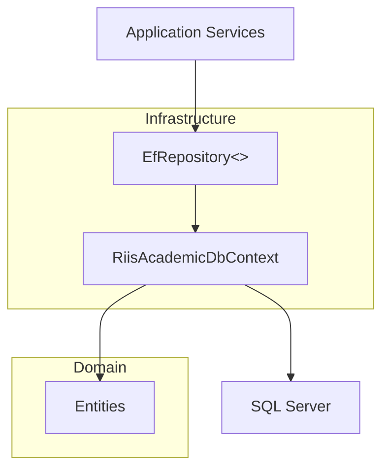
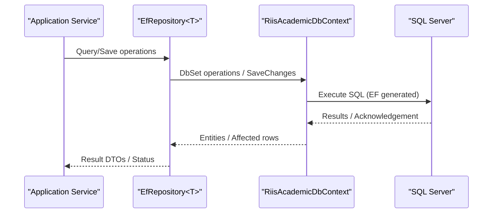
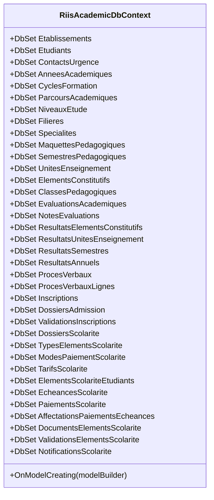
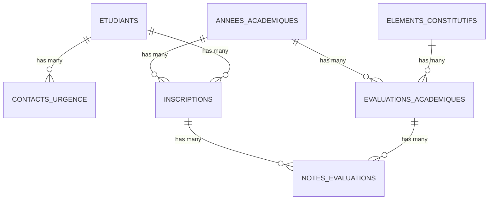
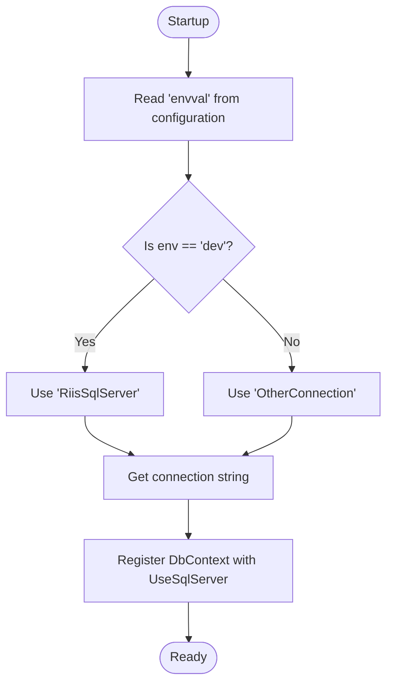
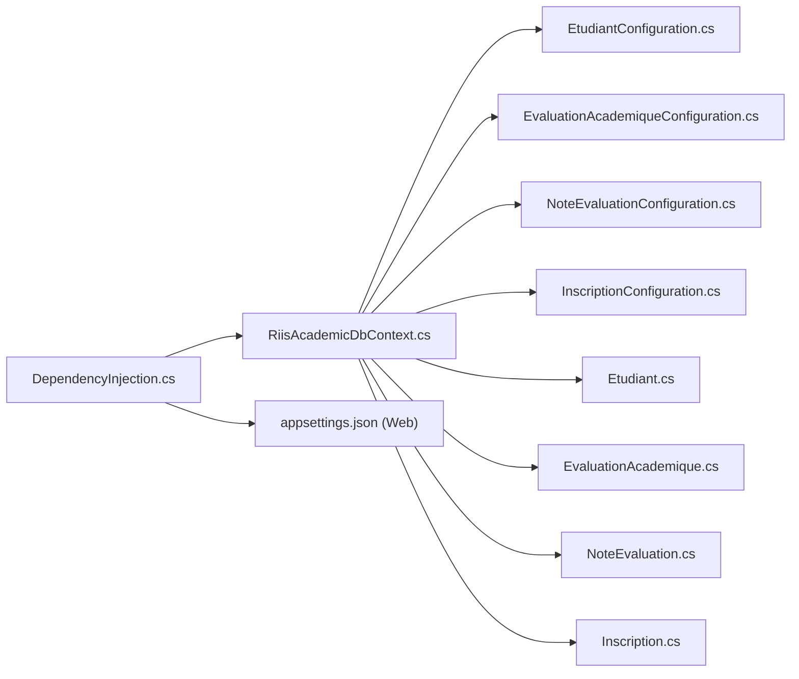

# Entity Framework Context

<cite>
**Referenced Files in This Document**
- [RiisAcademicDbContext.cs](file://RIIS.Academic.Infrastructure/Persistence/RiisAcademicDbContext.cs)
- [DependencyInjection.cs](file://RIIS.Academic.Infrastructure/DependencyInjection.cs)
- [appsettings.json (Web)](file://RIIS.Academic.Web/appsettings.json)
- [EtudiantConfiguration.cs](file://RIIS.Academic.Infrastructure/Persistence/Configurations/Etudiants/EtudiantConfiguration.cs)
- [ContactUrgenceConfiguration.cs](file://RIIS.Academic.Infrastructure/Persistence/Configurations/Etudiants/ContactUrgenceConfiguration.cs)
- [EvaluationAcademiqueConfiguration.cs](file://RIIS.Academic.Infrastructure/Persistence/Configurations/Notes/EvaluationAcademiqueConfiguration.cs)
- [NoteEvaluationConfiguration.cs](file://RIIS.Academic.Infrastructure/Persistence/Configurations/Notes/NoteEvaluationConfiguration.cs)
- [InscriptionConfiguration.cs](file://RIIS.Academic.Infrastructure/Persistence/Configurations/Inscriptions/InscriptionConfiguration.cs)
- [Etudiant.cs](file://RIIS.Academic.Domain/Etudiants/Etudiant.cs)
- [EvaluationAcademique.cs](file://RIIS.Academic.Domain/Notes/EvaluationAcademique.cs)
- [NoteEvaluation.cs](file://RIIS.Academic.Domain/Notes/NoteEvaluation.cs)
- [Inscription.cs](file://RIIS.Academic.Domain/Inscriptions/Inscription.cs)
- [AnneeAcademique.cs](file://RIIS.Academic.Domain/Referentiels/AnneeAcademique.cs)
- [ElementConstitutif.cs](file://RIIS.Academic.Domain/Programmes/ElementConstitutif.cs)
</cite>

## Table of Contents
1. Introduction
2. Project Structure
3. Core Components
4. Architecture Overview
5. Detailed Component Analysis
6. Dependency Analysis
7. Performance Considerations
8. Troubleshooting Guide
9. Conclusion

## Introduction
This document explains the Entity Framework Core context implementation for the academic system. It focuses on the RiisAcademicDbContext class, its DbSet properties for domain entities, and model configuration via Fluent API. It also covers entity relationships, foreign key constraints, database schema mapping, connection string configuration, environment-specific settings, context lifecycle management, common query patterns, transaction handling, and performance optimization techniques such as eager vs lazy loading.

## Project Structure
The data access layer is implemented in the Infrastructure project:
- The DbContext is defined in RiisAcademicDbContext.cs and exposes strongly typed DbSets for all domain entities.
- Model configurations are organized by feature area under Persistence/Configurations and applied automatically using EF’s assembly scanning.
- Dependency injection registers the DbContext with a SQL Server provider and configures service lifetimes.
- Connection strings are provided via configuration files and selected based on an environment flag.

**Diagram sources**
- [DependencyInjection.cs:25-36](file://RIIS.Academic.Infrastructure/DependencyInjection.cs#L25-L36)
- [RiisAcademicDbContext.cs:6-49](file://RIIS.Academic.Infrastructure/Persistence/RiisAcademicDbContext.cs#L6-L49)

**Section sources**
- [RiisAcademicDbContext.cs:6-49](file://RIIS.Academic.Infrastructure/Persistence/RiisAcademicDbContext.cs#L6-L49)
- [DependencyInjection.cs:25-36](file://RIIS.Academic.Infrastructure/DependencyInjection.cs#L25-L36)

## Core Components
- RiisAcademicDbContext: Central EF context exposing DbSets for all domain entities and applying Fluent API configurations from the same assembly.
- Fluent API Configurations: Per-entity configuration classes define table names, keys, property constraints, indexes, check constraints, and relationships.
- Dependency Injection: Registers the DbContext with SQL Server provider and sets transient lifetimes for both context and options.

Key responsibilities:
- Expose typed collections for querying and persisting entities.
- Configure schema details and constraints to match business rules.
- Provide a single unit-of-work boundary per request via DI lifetime.

**Section sources**
- [RiisAcademicDbContext.cs:6-49](file://RIIS.Academic.Infrastructure/Persistence/RiisAcademicDbContext.cs#L6-L49)
- [DependencyInjection.cs:25-36](file://RIIS.Academic.Infrastructure/DependencyInjection.cs#L25-L36)

## Architecture Overview
The context integrates with the application through repositories and services. Configuration is centralized in appsettings, and the environment determines which connection string is used.

**Diagram sources**
- [DependencyInjection.cs:25-36](file://RIIS.Academic.Infrastructure/DependencyInjection.cs#L25-L36)
- [RiisAcademicDbContext.cs:6-49](file://RIIS.Academic.Infrastructure/Persistence/RiisAcademicDbContext.cs#L6-L49)

## Detailed Component Analysis

### RiisAcademicDbContext
- Provides DbSets for all domain entities including students, evaluations, grades, academic years, programs, registrations, and school finance entities.
- Applies all Fluent API configurations from the assembly, keeping configuration decoupled and testable.

**Diagram sources**
- [RiisAcademicDbContext.cs:9-44](file://RIIS.Academic.Infrastructure/Persistence/RiisAcademicDbContext.cs#L9-L44)
- [RiisAcademicDbContext.cs:46-49](file://RIIS.Academic.Infrastructure/Persistence/RiisAcademicDbContext.cs#L46-L49)

**Section sources**
- [RiisAcademicDbContext.cs:6-49](file://RIIS.Academic.Infrastructure/Persistence/RiisAcademicDbContext.cs#L6-L49)

### Fluent API Configurations and Schema Mapping
- Etudiant: Table name, primary key, length constraints, unique filtered index on Matricule, row version concurrency token, and additional indexes.
- ContactUrgence: One-to-many relationship to Etudiant with cascade delete.
- EvaluationAcademique: Check constraint on grading fields, unique composite index, and relationships to academic year, constituent element, and replacement evaluation with restrictive deletes.
- NoteEvaluation: Check constraint on grade value, unique composite index per evaluation and registration, cascade deletes to related entities.
- Inscription: Unique composite index on academic year and student, optional unique filtered index on administrative code, and multiple restrictive relationships to reference entities.

**Diagram sources**
- [EtudiantConfiguration.cs:10-32](file://RIIS.Academic.Infrastructure/Persistence/Configurations/Etudiants/EtudiantConfiguration.cs#L10-L32)
- [ContactUrgenceConfiguration.cs:16-19](file://RIIS.Academic.Infrastructure/Persistence/Configurations/Etudiants/ContactUrgenceConfiguration.cs#L16-L19)
- [EvaluationAcademiqueConfiguration.cs:10-34](file://RIIS.Academic.Infrastructure/Persistence/Configurations/Notes/EvaluationAcademiqueConfiguration.cs#L10-L34)
- [NoteEvaluationConfiguration.cs:10-26](file://RIIS.Academic.Infrastructure/Persistence/Configurations/Notes/NoteEvaluationConfiguration.cs#L10-L26)
- [InscriptionConfiguration.cs:10-34](file://RIIS.Academic.Infrastructure/Persistence/Configurations/Inscriptions/InscriptionConfiguration.cs#L10-L34)

**Section sources**
- [EtudiantConfiguration.cs:10-32](file://RIIS.Academic.Infrastructure/Persistence/Configurations/Etudiants/EtudiantConfiguration.cs#L10-L32)
- [ContactUrgenceConfiguration.cs:16-19](file://RIIS.Academic.Infrastructure/Persistence/Configurations/Etudiants/ContactUrgenceConfiguration.cs#L16-L19)
- [EvaluationAcademiqueConfiguration.cs:10-34](file://RIIS.Academic.Infrastructure/Persistence/Configurations/Notes/EvaluationAcademiqueConfiguration.cs#L10-L34)
- [NoteEvaluationConfiguration.cs:10-26](file://RIIS.Academic.Infrastructure/Persistence/Configurations/Notes/NoteEvaluationConfiguration.cs#L10-L26)
- [InscriptionConfiguration.cs:10-34](file://RIIS.Academic.Infrastructure/Persistence/Configurations/Inscriptions/InscriptionConfiguration.cs#L10-L34)

### Entity Relationships and Foreign Key Constraints
- Student to Emergency Contact: One-to-many with cascade delete on contact removal.
- Academic Year to Registration: One-to-many with restrictive delete to protect historical data.
- Student to Registration: One-to-many with restrictive delete.
- Constituent Element to Evaluation: One-to-many; evaluation references constituent element with restrictive delete.
- Academic Year to Evaluation: One-to-many with restrictive delete.
- Evaluation to Grade: One-to-many with cascade delete.
- Registration to Grade: One-to-many with cascade delete.
- Self-referencing Evaluation: Replacement evaluation relationship with restrictive delete.

These constraints ensure referential integrity while protecting core reference data.

**Section sources**
- [ContactUrgenceConfiguration.cs:16-19](file://RIIS.Academic.Infrastructure/Persistence/Configurations/Etudiants/ContactUrgenceConfiguration.cs#L16-L19)
- [InscriptionConfiguration.cs:23-34](file://RIIS.Academic.Infrastructure/Persistence/Configurations/Inscriptions/InscriptionConfiguration.cs#L23-L34)
- [EvaluationAcademiqueConfiguration.cs:23-34](file://RIIS.Academic.Infrastructure/Persistence/Configurations/Notes/EvaluationAcademiqueConfiguration.cs#L23-L34)
- [NoteEvaluationConfiguration.cs:19-26](file://RIIS.Academic.Infrastructure/Persistence/Configurations/Notes/NoteEvaluationConfiguration.cs#L19-L26)

### Connection String Configuration and Environment Settings
- The dependency injection method selects a connection string name based on an environment variable ("envval"). When set to "dev", it uses "RiisSqlServer"; otherwise, it uses "OtherConnection".
- The selected connection string is passed to UseSqlServer when registering the DbContext.
- Configuration files provide named connection strings for different environments.

**Diagram sources**
- [DependencyInjection.cs:63-73](file://RIIS.Academic.Infrastructure/DependencyInjection.cs#L63-L73)
- [appsettings.json (Web):2-6](file://RIIS.Academic.Web/appsettings.json#L2-L6)

**Section sources**
- [DependencyInjection.cs:25-36](file://RIIS.Academic.Infrastructure/DependencyInjection.cs#L25-L36)
- [DependencyInjection.cs:63-73](file://RIIS.Academic.Infrastructure/DependencyInjection.cs#L63-L73)
- [appsettings.json (Web):2-6](file://RIIS.Academic.Web/appsettings.json#L2-L6)

### Context Lifecycle Management
- The DbContext is registered with a Transient lifetime for both the context instance and its options. This means a new context is created per use, suitable for short-lived operations or manual scoping within services.
- For typical web requests, consider wrapping usage in a scoped lifetime to align with request boundaries and optimize change tracking and caching behavior.

Best practices:
- Use a scoped lifetime in ASP.NET Core pipelines to ensure one context per request.
- Keep operations within a single unit of work to minimize round trips and avoid inconsistent state.

**Section sources**
- [DependencyInjection.cs:31-34](file://RIIS.Academic.Infrastructure/DependencyInjection.cs#L31-L34)

### Common Queries and Data Access Patterns
Examples of typical queries using the exposed DbSets:
- Retrieve a student by matricule with related emergency contacts.
- Load evaluations for a given academic year and constituent element.
- Fetch grades for a specific evaluation and registration combination.
- List registrations for a student within an academic year.

Recommended approaches:
- Use LINQ projections to select only required fields.
- Apply filtering at the database level to reduce payload size.
- Use AsNoTracking for read-only queries to improve performance.

[No sources needed since this section provides general guidance]

### Transaction Handling
- Wrap multiple changes that must succeed or fail together in a single transaction.
- Use SaveChangesAsync within a managed transaction scope to ensure atomicity across related writes.
- Handle exceptions and roll back on failure to maintain data consistency.

[No sources needed since this section provides general guidance]

### Performance Optimization Techniques
- Eager Loading: Use Include to load related entities in a single query when you know you need them, reducing N+1 queries.
- Selective Projection: Use Select to map to DTOs and avoid loading unnecessary columns.
- AsNoTracking: Apply for read-only scenarios to bypass change tracking overhead.
- Indexes: Leverage configured unique and filtered indexes (e.g., Matricule, composite indexes on evaluations and registrations).
- Batch Operations: Group updates where possible to minimize round trips.

[No sources needed since this section provides general guidance]

## Dependency Analysis
The infrastructure layer depends on:
- Domain entities for types and navigation properties.
- Configuration files for connection strings and environment flags.
- Microsoft.EntityFrameworkCore for DbContext and SQL Server provider.

**Diagram sources**
- [DependencyInjection.cs:25-36](file://RIIS.Academic.Infrastructure/DependencyInjection.cs#L25-L36)
- [RiisAcademicDbContext.cs:6-49](file://RIIS.Academic.Infrastructure/Persistence/RiisAcademicDbContext.cs#L6-L49)
- [EtudiantConfiguration.cs:10-32](file://RIIS.Academic.Infrastructure/Persistence/Configurations/Etudiants/EtudiantConfiguration.cs#L10-L32)
- [EvaluationAcademiqueConfiguration.cs:10-34](file://RIIS.Academic.Infrastructure/Persistence/Configurations/Notes/EvaluationAcademiqueConfiguration.cs#L10-L34)
- [NoteEvaluationConfiguration.cs:10-26](file://RIIS.Academic.Infrastructure/Persistence/Configurations/Notes/NoteEvaluationConfiguration.cs#L10-L26)
- [InscriptionConfiguration.cs:10-34](file://RIIS.Academic.Infrastructure/Persistence/Configurations/Inscriptions/InscriptionConfiguration.cs#L10-L34)
- [Etudiant.cs:3-27](file://RIIS.Academic.Domain/Etudiants/Etudiant.cs#L3-L27)
- [EvaluationAcademique.cs:3-23](file://RIIS.Academic.Domain/Notes/EvaluationAcademique.cs#L3-L23)
- [NoteEvaluation.cs:3-16](file://RIIS.Academic.Domain/Notes/NoteEvaluation.cs#L3-L16)
- [Inscription.cs:3-36](file://RIIS.Academic.Domain/Inscriptions/Inscription.cs#L3-L36)
- [appsettings.json (Web):2-6](file://RIIS.Academic.Web/appsettings.json#L2-L6)

**Section sources**
- [DependencyInjection.cs:25-36](file://RIIS.Academic.Infrastructure/DependencyInjection.cs#L25-L36)
- [RiisAcademicDbContext.cs:6-49](file://RIIS.Academic.Infrastructure/Persistence/RiisAcademicDbContext.cs#L6-L49)

## Performance Considerations
- Prefer eager loading with Include for known related data to avoid N+1 queries.
- Use AsNoTracking for read-heavy endpoints to reduce memory and CPU overhead.
- Leverage configured unique and filtered indexes for fast lookups and uniqueness enforcement.
- Minimize loaded columns by projecting to DTOs.
- Consider batching updates and using efficient LINQ queries translated to optimized SQL.

[No sources needed since this section provides general guidance]

## Troubleshooting Guide
Common issues and resolutions:
- Missing connection string: Ensure the environment variable "envval" matches expected values and the corresponding connection string exists in configuration.
- Constraint violations: Validate input against check constraints (e.g., grade ranges, evaluation parameters) before saving.
- Concurrency conflicts: Handle RowVersion conflicts when updating entities marked with version tokens.
- Relationship errors: Respect restrictive delete behaviors on reference entities to avoid accidental deletions.

**Section sources**
- [DependencyInjection.cs:63-73](file://RIIS.Academic.Infrastructure/DependencyInjection.cs#L63-L73)
- [EvaluationAcademiqueConfiguration.cs:10-13](file://RIIS.Academic.Infrastructure/Persistence/Configurations/Notes/EvaluationAcademiqueConfiguration.cs#L10-L13)
- [NoteEvaluationConfiguration.cs:10-11](file://RIIS.Academic.Infrastructure/Persistence/Configurations/Notes/NoteEvaluationConfiguration.cs#L10-L11)
- [EtudiantConfiguration.cs:30-30](file://RIIS.Academic.Infrastructure/Persistence/Configurations/Etudiants/EtudiantConfiguration.cs#L30-L30)

## Conclusion
The RiisAcademicDbContext centralizes data access for the academic system, exposing strongly typed DbSets and delegating schema mapping to modular Fluent API configurations. Connection strings are environment-driven, and the context is registered with a transient lifetime. By following recommended query patterns, transaction strategies, and performance optimizations, applications can efficiently interact with the database while maintaining data integrity and scalability.