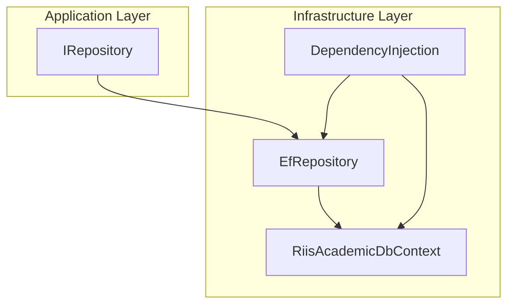
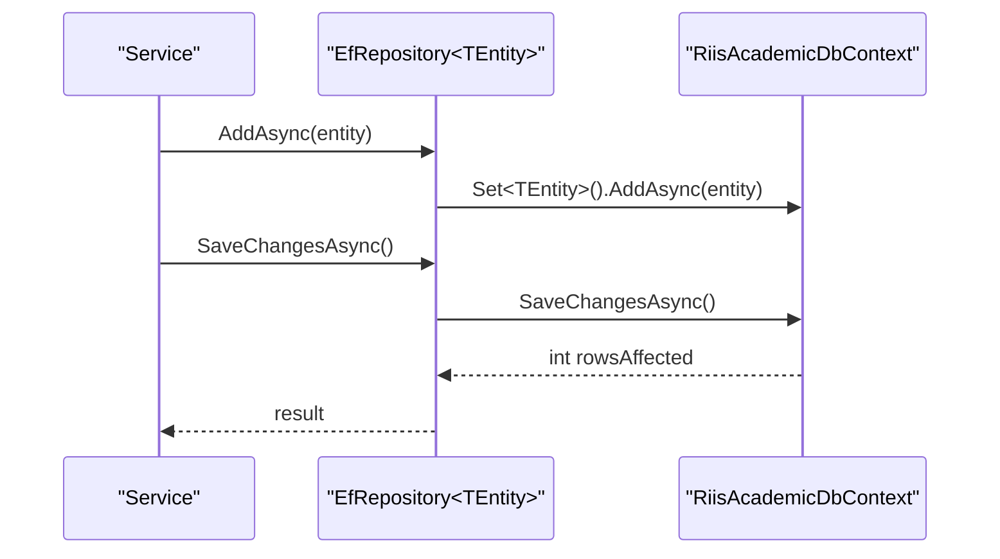
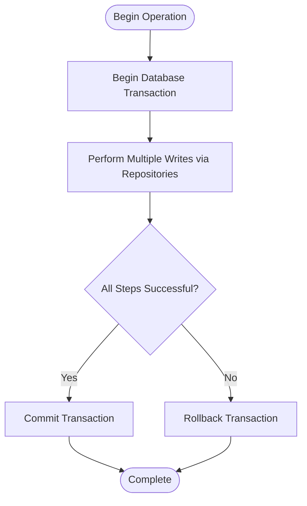
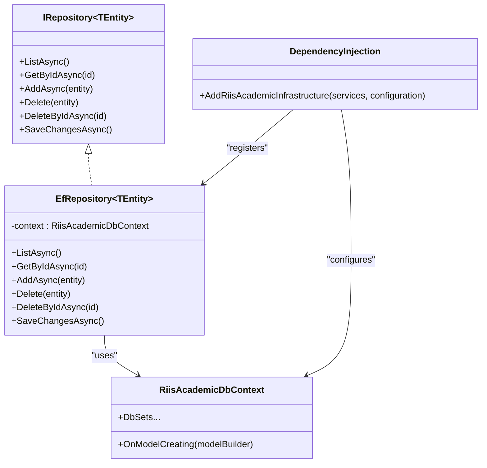

# Repository Pattern Implementation

<cite>
**Referenced Files in This Document**
- [IRepository.cs](file://RIIS.Academic.Application/Abstractions/Persistence/IRepository.cs)
- [EfRepository.cs](file://RIIS.Academic.Infrastructure/Persistence/Repositories/EfRepository.cs)
- [RiisAcademicDbContext.cs](file://RIIS.Academic.Infrastructure/Persistence/RiisAcademicDbContext.cs)
- [DependencyInjection.cs](file://RIIS.Academic.Infrastructure/DependencyInjection.cs)
- [RiisAcademicDatabaseResetter.cs](file://RIIS.Academic.Infrastructure/Persistence/RiisAcademicDatabaseResetter.cs)
</cite>

## Table of Contents
1. Introduction
2. Project Structure
3. Core Components
4. Architecture Overview
5. Detailed Component Analysis
6. Dependency Analysis
7. Performance Considerations
8. Troubleshooting Guide
9. Conclusion
10. Appendices

## Introduction
This document explains the repository pattern implementation using Entity Framework Core in a Clean Architecture project. It focuses on the generic EfRepository class, its CRUD operations, and how it abstracts data access behind a consistent IRepository interface. It also covers unit of work patterns, transaction management, error handling strategies, and guidance for extending repositories with advanced querying techniques such as filtering and pagination.

## Project Structure
The repository abstraction lives in the Application layer, while the EF Core implementation resides in the Infrastructure layer. The DbContext aggregates all entity sets and applies configurations from the assembly. Dependency injection wires the generic repository to the concrete EF implementation.

**Diagram sources**
- [IRepository.cs:3-11](file://RIIS.Academic.Application/Abstractions/Persistence/IRepository.cs#L3-L11)
- [EfRepository.cs:6-32](file://RIIS.Academic.Infrastructure/Persistence/Repositories/EfRepository.cs#L6-L32)
- [RiisAcademicDbContext.cs:6-49](file://RIIS.Academic.Infrastructure/Persistence/RiisAcademicDbContext.cs#L6-L49)
- [DependencyInjection.cs:31-36](file://RIIS.Academic.Infrastructure/DependencyInjection.cs#L31-L36)

**Section sources**
- [IRepository.cs:3-11](file://RIIS.Academic.Application/Abstractions/Persistence/IRepository.cs#L3-L11)
- [EfRepository.cs:6-32](file://RIIS.Academic.Infrastructure/Persistence/Repositories/EfRepository.cs#L6-L32)
- [RiisAcademicDbContext.cs:6-49](file://RIIS.Academic.Infrastructure/Persistence/RiisAcademicDbContext.cs#L6-L49)
- [DependencyInjection.cs:31-36](file://RIIS.Academic.Infrastructure/DependencyInjection.cs#L31-L36)

## Core Components
- IRepository<TEntity>: Defines the minimal contract for data access including listing, retrieval by id, adding, deleting, and saving changes.
- EfRepository<TEntity>: Implements IRepository<TEntity> using EF Core’s DbSet operations over RiisAcademicDbContext.
- RiisAcademicDbContext: Centralizes all entity sets and model configuration via assembly scanning.
- DependencyInjection: Registers the DbContext and maps IRepository<> to EfRepository<>.

Key responsibilities:
- Abstraction: Services depend on IRepository<TEntity>, not on EF Core directly.
- Consistency: All repositories share the same base behavior through the generic implementation.
- Persistence ignorance: Application layer remains decoupled from database specifics.

**Section sources**
- [IRepository.cs:3-11](file://RIIS.Academic.Application/Abstractions/Persistence/IRepository.cs#L3-L11)
- [EfRepository.cs:6-32](file://RIIS.Academic.Infrastructure/Persistence/Repositories/EfRepository.cs#L6-L32)
- [RiisAcademicDbContext.cs:6-49](file://RIIS.Academic.Infrastructure/Persistence/RiisAcademicDbContext.cs#L6-L49)
- [DependencyInjection.cs:31-36](file://RIIS.Academic.Infrastructure/DependencyInjection.cs#L31-L36)

## Architecture Overview
The repository pattern isolates data access logic behind a stable interface. EfRepository delegates to EF Core, while services consume the interface. Transactions are managed at higher layers or via explicit context usage where needed.

**Diagram sources**
- [EfRepository.cs:17-32](file://RIIS.Academic.Infrastructure/Persistence/Repositories/EfRepository.cs#L17-L32)
- [RiisAcademicDbContext.cs:6-49](file://RIIS.Academic.Infrastructure/Persistence/RiisAcademicDbContext.cs#L6-L49)

## Detailed Component Analysis

### IRepository<TEntity> Contract
- ListAsync: Returns all entities for the given type.
- GetByIdAsync: Retrieves an entity by primary key.
- AddAsync: Enqueues a new entity for persistence.
- Delete: Marks an existing entity for removal.
- DeleteByIdAsync: Finds and deletes by id if present.
- SaveChangesAsync: Persists pending changes to the database.

Usage notes:
- Consumers should call SaveChangesAsync after performing multiple mutations to commit them atomically within the current DbContext scope.
- CancellationToken is supported across async methods for cooperative cancellation.

**Section sources**
- [IRepository.cs:3-11](file://RIIS.Academic.Application/Abstractions/Persistence/IRepository.cs#L3-L11)

### EfRepository<TEntity> Implementation
- Uses AsNoTracking for read-only queries to improve performance.
- Leverages FindAsync for efficient single-entity retrieval by id.
- Exposes SaveChangesAsync to allow callers to control transaction boundaries.

Behavior highlights:
- Read operations return detached entities suitable for DTO mapping.
- Write operations rely on EF Core change tracking; callers must persist via SaveChangesAsync.

**Section sources**
- [EfRepository.cs:9-32](file://RIIS.Academic.Infrastructure/Persistence/Repositories/EfRepository.cs#L9-L32)

### RiisAcademicDbContext
- Declares DbSets for all domain entities.
- Applies configurations from the assembly automatically.
- Serves as the unit of work boundary for transactions when used with explicit scopes.

**Section sources**
- [RiisAcademicDbContext.cs:6-49](file://RIIS.Academic.Infrastructure/Persistence/RiisAcademicDbContext.cs#L6-L49)

### Dependency Injection Registration
- Registers RiisAcademicDbContext as Transient with SQL Server provider.
- Maps IRepository<> to EfRepository<> per service scope.

**Section sources**
- [DependencyInjection.cs:31-36](file://RIIS.Academic.Infrastructure/DependencyInjection.cs#L31-L36)

### Unit of Work and Transaction Management
- Unit of work is represented by the DbContext lifetime. Each scoped request typically gets a new context instance.
- For multi-step operations that must succeed or fail together, wrap calls in a database transaction. An example of explicit transaction usage exists in the reset utility.

**Diagram sources**
- [RiisAcademicDatabaseResetter.cs:19-62](file://RIIS.Academic.Infrastructure/Persistence/RiisAcademicDatabaseResetter.cs#L19-L62)

**Section sources**
- [RiisAcademicDatabaseResetter.cs:19-62](file://RIIS.Academic.Infrastructure/Persistence/RiisAcademicDatabaseResetter.cs#L19-L62)

### Error Handling Strategies
- Validation failures and business rule violations should be handled in services before calling repositories.
- Data access exceptions (e.g., constraint violations) propagate up; consider catching and translating to application-level errors.
- Use CancellationToken to support cancellation during long-running operations.

[No sources needed since this section provides general guidance]

### Custom Repository Implementations and Advanced Querying
Current state:
- The codebase uses a single generic EfRepository without custom per-entity repositories.
- Filtering and complex queries are applied in services using LINQ over loaded collections or direct DbContext usage.

Recommended extensions:
- Create specialized repositories for entities requiring complex queries, joins, or projections.
- Add query builders or specification patterns to encapsulate reusable filters.
- Introduce pagination parameters (page size, page number) and ordering options in repository methods.
- Provide bulk operations via EF Core batch libraries or raw SQL helpers when appropriate.

Example patterns to implement:
- Filtered list with optional predicates and sorting.
- Paginated list returning total count and items.
- Bulk insert/update/delete using EF utilities or raw SQL.

[No sources needed since this section proposes future enhancements]

## Dependency Analysis
The following diagram shows the runtime dependencies between components involved in data access.

**Diagram sources**
- [IRepository.cs:3-11](file://RIIS.Academic.Application/Abstractions/Persistence/IRepository.cs#L3-L11)
- [EfRepository.cs:6-32](file://RIIS.Academic.Infrastructure/Persistence/Repositories/EfRepository.cs#L6-L32)
- [RiisAcademicDbContext.cs:6-49](file://RIIS.Academic.Infrastructure/Persistence/RiisAcademicDbContext.cs#L6-L49)
- [DependencyInjection.cs:31-36](file://RIIS.Academic.Infrastructure/DependencyInjection.cs#L31-L36)

**Section sources**
- [DependencyInjection.cs:31-36](file://RIIS.Academic.Infrastructure/DependencyInjection.cs#L31-L36)

## Performance Considerations
- Read queries use AsNoTracking to avoid change-tracking overhead.
- Prefer GetByIdAsync for single-entity lookups to leverage EF’s optimized find path.
- For large datasets, introduce pagination and projection to reduce memory and network usage.
- Batch writes when possible to minimize round trips.
- Ensure proper indexing on frequently filtered columns in the database schema.

[No sources needed since this section provides general guidance]

## Troubleshooting Guide
Common issues and resolutions:
- Missing SaveChangesAsync: Entities added or deleted will not be persisted until SaveChangesAsync is called. Ensure services invoke it after mutations.
- Transaction boundaries: For multi-step operations, explicitly begin and commit/rollback transactions around the relevant DbContext scope.
- Connection string misconfiguration: Verify environment-based connection selection and ensure the configured name exists.

Operational reference:
- Explicit transaction usage can be modeled after the database resetter, which begins a transaction, executes multiple commands, and commits upon success.

**Section sources**
- [EfRepository.cs:17-32](file://RIIS.Academic.Infrastructure/Persistence/Repositories/EfRepository.cs#L17-L32)
- [RiisAcademicDatabaseResetter.cs:19-62](file://RIIS.Academic.Infrastructure/Persistence/RiisAcademicDatabaseResetter.cs#L19-L62)
- [DependencyInjection.cs:63-72](file://RIIS.Academic.Infrastructure/DependencyInjection.cs#L63-L72)

## Conclusion
The repository pattern here provides a clean abstraction over EF Core via a generic EfRepository implementing IRepository<TEntity>. It standardizes CRUD operations and supports cancellation. Transactions are managed explicitly where needed, and the DbContext acts as the unit of work. To scale further, consider adding custom repositories for complex queries, pagination, filtering, and bulk operations, while keeping services focused on business logic.

[No sources needed since this section summarizes without analyzing specific files]

## Appendices

### API Surface Summary
- IRepository<TEntity>
  - ListAsync(CancellationToken)
  - GetByIdAsync(long id, CancellationToken)
  - AddAsync(TEntity entity, CancellationToken)
  - Delete(TEntity entity)
  - DeleteByIdAsync(long id, CancellationToken)
  - SaveChangesAsync(CancellationToken)

- EfRepository<TEntity>
  - Implements all IRepository<TEntity> methods using RiisAcademicDbContext.

- RiisAcademicDbContext
  - Provides DbSets for all domain entities and applies configurations from the assembly.

- DependencyInjection
  - Registers DbContext and maps IRepository<> to EfRepository<>.

**Section sources**
- [IRepository.cs:3-11](file://RIIS.Academic.Application/Abstractions/Persistence/IRepository.cs#L3-L11)
- [EfRepository.cs:6-32](file://RIIS.Academic.Infrastructure/Persistence/Repositories/EfRepository.cs#L6-L32)
- [RiisAcademicDbContext.cs:6-49](file://RIIS.Academic.Infrastructure/Persistence/RiisAcademicDbContext.cs#L6-L49)
- [DependencyInjection.cs:31-36](file://RIIS.Academic.Infrastructure/DependencyInjection.cs#L31-L36)