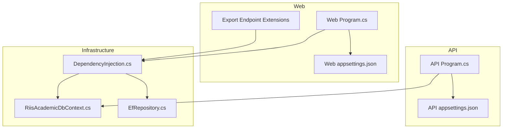
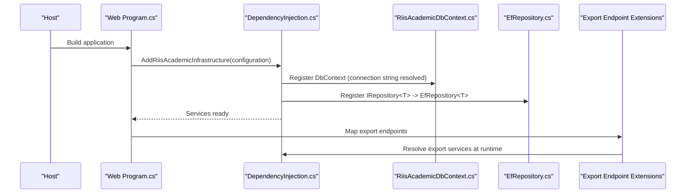
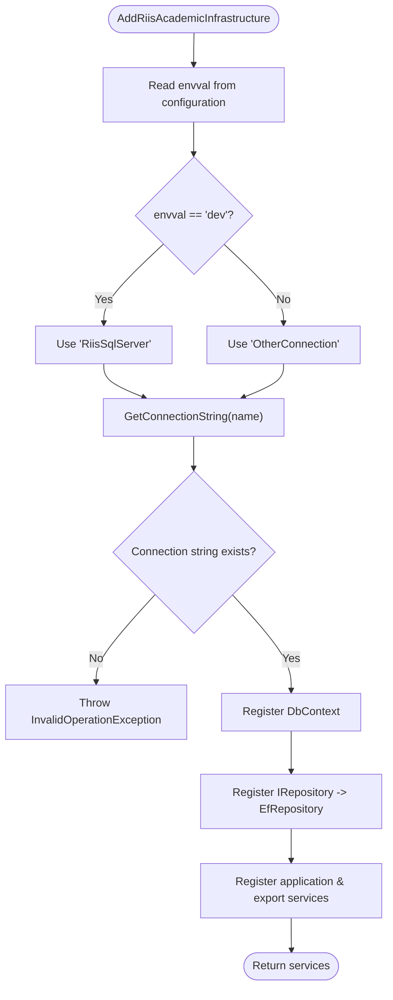
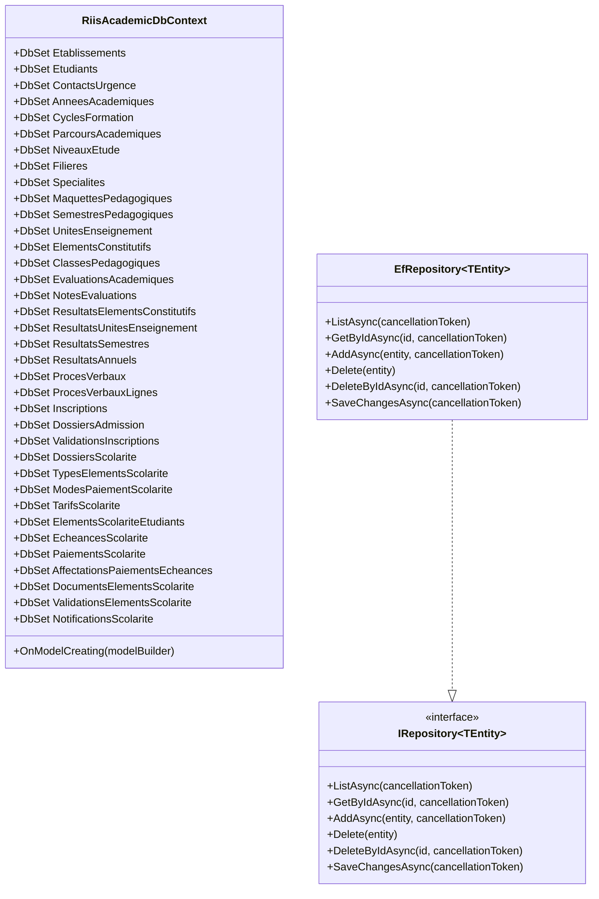
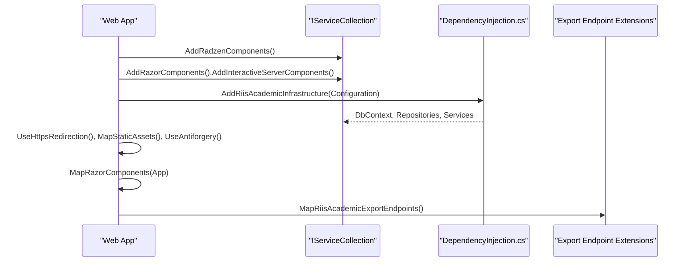
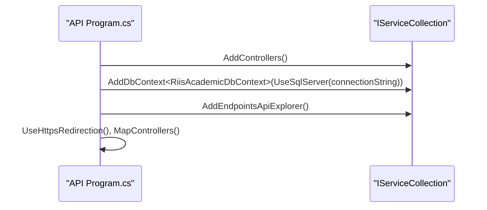
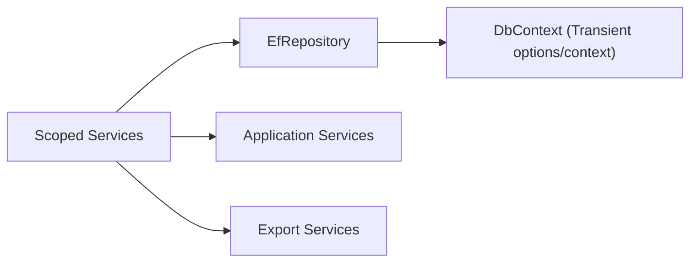

# Dependency Injection & Configuration

<cite>
**Referenced Files in This Document**
- [Program.cs](file://RIIS.Academic.Api/Program.cs)
- [appsettings.json](file://RIIS.Academic.Api/appsettings.json)
- [DependencyInjection.cs](file://RIIS.Academic.Infrastructure/DependencyInjection.cs)
- [RiisAcademicDbContext.cs](file://RIIS.Academic.Infrastructure/Persistence/RiisAcademicDbContext.cs)
- [EfRepository.cs](file://RIIS.Academic.Infrastructure/Persistence/Repositories/EfRepository.cs)
- [IRepository.cs](file://RIIS.Academic.Application/Abstractions/Persistence/IRepository.cs)
- [Program.cs](file://RIIS.Academic.Web/Program.cs)
- [appsettings.json](file://RIIS.Academic.Web/appsettings.json)
- [RiisAcademicExportEndpointExtensions.cs](file://RIIS.Academic.Web/Extensions/RiisAcademicExportEndpointExtensions.cs)
</cite>

## Table of Contents
1. [Introduction](#introduction)
2. [Project Structure](#project-structure)
3. [Core Components](#core-components)
4. [Architecture Overview](#architecture-overview)
5. [Detailed Component Analysis](#detailed-component-analysis)
6. [Dependency Analysis](#dependency-analysis)
7. [Performance Considerations](#performance-considerations)
8. [Troubleshooting Guide](#troubleshooting-guide)
9. [Conclusion](#conclusion)

## Introduction
This document explains how dependency injection (DI) is configured and how services are registered across the application, focusing on service lifetimes, interface-to-implementation mappings, configuration providers, environment-specific settings, external integrations, middleware registration, authentication setup, logging configuration, and performance considerations. It also provides troubleshooting guidance for common DI issues and service resolution problems.

## Project Structure
The project is organized into layers:
- API layer: minimal ASP.NET Core Web API entry point with controllers and endpoints.
- Application layer: business services and DTOs.
- Infrastructure layer: persistence, EF Core context, repository implementation, and a centralized DI extension that registers all application and infrastructure services.
- Web layer: Blazor Server app that composes UI and uses the same DI container via an extension method to register infrastructure services.

**Diagram sources**
- [Program.cs:5-17](file://RIIS.Academic.Api/Program.cs#L5-L17)
- [appsettings.json:1-7](file://RIIS.Academic.Api/appsettings.json#L1-L7)
- [Program.cs:8-26](file://RIIS.Academic.Web/Program.cs#L8-L26)
- [appsettings.json:1-23](file://RIIS.Academic.Web/appsettings.json#L1-L23)
- [DependencyInjection.cs:23-60](file://RIIS.Academic.Infrastructure/DependencyInjection.cs#L23-L60)
- [RiisAcademicDbContext.cs:6-49](file://RIIS.Academic.Infrastructure/Persistence/RiisAcademicDbContext.cs#L6-L49)
- [EfRepository.cs:6-33](file://RIIS.Academic.Infrastructure/Persistence/Repositories/EfRepository.cs#L6-L33)
- [RiisAcademicExportEndpointExtensions.cs:7-94](file://RIIS.Academic.Web/Extensions/RiisAcademicExportEndpointExtensions.cs#L7-L94)

**Section sources**
- [Program.cs:5-17](file://RIIS.Academic.Api/Program.cs#L5-L17)
- [Program.cs:8-26](file://RIIS.Academic.Web/Program.cs#L8-L26)
- [DependencyInjection.cs:23-60](file://RIIS.Academic.Infrastructure/DependencyInjection.cs#L23-L60)

## Core Components
- Centralized DI registration: The infrastructure layer exposes an extension method that configures EF Core DbContext, generic repository, and all application services.
- Service lifetime strategy: All application services and the generic repository are registered as scoped. The DbContext is registered with transient options and context lifetime set to transient in the infrastructure registration.
- Configuration provider usage: Connection strings are read from configuration; environment selection logic chooses between connection names based on an environment value.
- Middleware and features: HTTPS redirection, static assets, antiforgery, Razor components, and export endpoints are wired in the Web program. Logging is configured via standard configuration.

Key registrations include:
- Generic repository mapping: IRepository<T> to EfRepository<T>.
- Application services: Referentiels, Etudiants, ClassesPedagogiques, Inscriptions, ProgrammePedagogique, Evaluations, CalculNotes, SaisieNotes, DashboardAcademique, ProcesVerbaux, RelevesNotes, Scolarite services (TypesElements, ModesPaiement, Tarifs, Dossiers, Finances).
- Export services: Word and Excel export implementations for process verbs and transcripts.

**Section sources**
- [DependencyInjection.cs:23-60](file://RIIS.Academic.Infrastructure/DependencyInjection.cs#L23-L60)
- [EfRepository.cs:6-33](file://RIIS.Academic.Infrastructure/Persistence/Repositories/EfRepository.cs#L6-L33)
- [IRepository.cs:1-13](file://RIIS.Academic.Application/Abstractions/Persistence/IRepository.cs#L1-L13)
- [RiisAcademicDbContext.cs:6-49](file://RIIS.Academic.Infrastructure/Persistence/RiisAcademicDbContext.cs#L6-L49)

## Architecture Overview
The DI architecture centers around a single registration extension that wires up persistence and application services. The Web app bootstraps the framework features and calls this extension to compose the container. The API app directly configures its own DbContext and controllers.

**Diagram sources**
- [Program.cs:8-26](file://RIIS.Academic.Web/Program.cs#L8-L26)
- [DependencyInjection.cs:23-60](file://RIIS.Academic.Infrastructure/DependencyInjection.cs#L23-L60)
- [RiisAcademicDbContext.cs:6-49](file://RIIS.Academic.Infrastructure/Persistence/RiisAcademicDbContext.cs#L6-L49)
- [EfRepository.cs:6-33](file://RIIS.Academic.Infrastructure/Persistence/Repositories/EfRepository.cs#L6-L33)
- [RiisAcademicExportEndpointExtensions.cs:7-94](file://RIIS.Academic.Web/Extensions/RiisAcademicExportEndpointExtensions.cs#L7-L94)

## Detailed Component Analysis

### Central DI Registration (Infrastructure)
- Purpose: Registers DbContext, generic repository, and all application/export services.
- Environment-aware connection string selection: Reads an environment flag and selects one of two connection names. If not found, throws an error indicating missing configuration.
- Lifetimes:
  - DbContext: OptionsLifetime and ContextLifetime set to Transient in this registration.
  - Repository and all application services: Scoped.

**Diagram sources**
- [DependencyInjection.cs:23-73](file://RIIS.Academic.Infrastructure/DependencyInjection.cs#L23-L73)

**Section sources**
- [DependencyInjection.cs:23-73](file://RIIS.Academic.Infrastructure/DependencyInjection.cs#L23-L73)

### DbContext and Persistence
- DbContext declares many DbSets representing domain entities and applies configurations from the assembly.
- Repository implements generic CRUD operations using EF Core, including AsNoTracking for reads and SaveChangesAsync for writes.

**Diagram sources**
- [RiisAcademicDbContext.cs:6-49](file://RIIS.Academic.Infrastructure/Persistence/RiisAcademicDbContext.cs#L6-L49)
- [EfRepository.cs:6-33](file://RIIS.Academic.Infrastructure/Persistence/Repositories/EfRepository.cs#L6-L33)
- [IRepository.cs:1-13](file://RIIS.Academic.Application/Abstractions/Persistence/IRepository.cs#L1-L13)

**Section sources**
- [RiisAcademicDbContext.cs:6-49](file://RIIS.Academic.Infrastructure/Persistence/RiisAcademicDbContext.cs#L6-L49)
- [EfRepository.cs:6-33](file://RIIS.Academic.Infrastructure/Persistence/Repositories/EfRepository.cs#L6-L33)
- [IRepository.cs:1-13](file://RIIS.Academic.Application/Abstractions/Persistence/IRepository.cs#L1-L13)

### Web App Composition and Middleware
- Adds Radzen components and Razor components with interactive server rendering.
- Calls the infrastructure DI extension to register all services.
- Configures HTTPS redirection, static assets, antiforgery, maps Razor components, and custom export endpoints.

**Diagram sources**
- [Program.cs:8-26](file://RIIS.Academic.Web/Program.cs#L8-L26)
- [DependencyInjection.cs:23-60](file://RIIS.Academic.Infrastructure/DependencyInjection.cs#L23-L60)
- [RiisAcademicExportEndpointExtensions.cs:7-94](file://RIIS.Academic.Web/Extensions/RiisAcademicExportEndpointExtensions.cs#L7-L94)

**Section sources**
- [Program.cs:8-26](file://RIIS.Academic.Web/Program.cs#L8-L26)
- [RiisAcademicExportEndpointExtensions.cs:7-94](file://RIIS.Academic.Web/Extensions/RiisAcademicExportEndpointExtensions.cs#L7-L94)

### API Composition
- Registers controllers and EF Core DbContext using a connection string from configuration.
- Enables endpoint metadata for OpenAPI/explorer.

**Diagram sources**
- [Program.cs:5-17](file://RIIS.Academic.Api/Program.cs#L5-L17)

**Section sources**
- [Program.cs:5-17](file://RIIS.Academic.Api/Program.cs#L5-L17)

### Configuration Providers and Environment-Specific Settings
- Web app configuration includes multiple connection strings and an environment selector key used by the DI extension to choose the appropriate connection name.
- Logging levels are configured via standard configuration sections.
- API app has its own connection string for local development.

Environment selection behavior:
- Reads an environment flag and selects either a development or other connection name.
- Throws if the selected connection string is missing.

**Section sources**
- [appsettings.json:1-23](file://RIIS.Academic.Web/appsettings.json#L1-L23)
- [DependencyInjection.cs:63-73](file://RIIS.Academic.Infrastructure/DependencyInjection.cs#L63-L73)
- [appsettings.json:1-7](file://RIIS.Academic.Api/appsettings.json#L1-L7)

### External Service Integrations
- Export endpoints resolve export services via DI and return files (Word/Excel) based on request parameters.
- No additional external clients are registered beyond EF Core and file exports.

**Section sources**
- [RiisAcademicExportEndpointExtensions.cs:7-94](file://RIIS.Academic.Web/Extensions/RiisAcademicExportEndpointExtensions.cs#L7-L94)

## Dependency Analysis
Service lifetimes and relationships:
- All application services and the generic repository are registered as Scoped.
- DbContext options and context are registered as Transient in the infrastructure registration.
- Export services are registered as Scoped and resolved per request in endpoints.

**Diagram sources**
- [DependencyInjection.cs:31-60](file://RIIS.Academic.Infrastructure/DependencyInjection.cs#L31-L60)

**Section sources**
- [DependencyInjection.cs:31-60](file://RIIS.Academic.Infrastructure/DependencyInjection.cs#L31-L60)

## Performance Considerations
- DbContext lifetime: The infrastructure registration sets both context and options lifetimes to Transient. In typical ASP.NET Core applications, DbContext is commonly registered as Scoped to align with request lifetime and avoid excessive instantiation. Evaluate whether Transient is intentional here and consider switching to Scoped if it leads to performance or state management concerns.
- Repository pattern: Using AsNoTracking for read queries reduces change tracker overhead and improves performance for read-only scenarios.
- Logging: Configure log levels appropriately to reduce overhead in production.
- Connection strings: Ensure correct connection strings per environment to avoid misrouted connections and potential latency or connectivity issues.

[No sources needed since this section provides general guidance]

## Troubleshooting Guide
Common DI and configuration issues:
- Missing connection string: If the environment-based connection name is not present, the DI registration will throw an exception indicating the missing connection string. Verify the environment flag and corresponding connection string keys.
- Service not found: Ensure all required services are registered in the DI extension. Missing registrations will cause resolution failures at runtime.
- Lifetime mismatches: If you observe unexpected behavior due to shared state or disposal timing, review the chosen lifetimes (Scoped vs Transient) for DbContext and services.
- Export endpoints returning NotFound: Export endpoints return NotFound when the requested resource is not found. Validate input IDs and ensure data exists.

Configuration checks:
- Confirm environment flag value matches expected values.
- Verify connection string keys exist under the selected name.
- Ensure logging configuration is set to desired levels.

**Section sources**
- [DependencyInjection.cs:63-73](file://RIIS.Academic.Infrastructure/DependencyInjection.cs#L63-L73)
- [RiisAcademicExportEndpointExtensions.cs:11-91](file://RIIS.Academic.Web/Extensions/RiisAcademicExportEndpointExtensions.cs#L11-L91)

## Conclusion
The application uses a centralized DI registration approach in the infrastructure layer to configure EF Core, repositories, and application services. The Web app composes these services along with middleware and export endpoints, while the API app independently configures its DbContext and controllers. Environment-specific configuration drives connection selection, and logging is configured via standard configuration. For optimal performance and reliability, verify DbContext lifetime choices, ensure correct configuration per environment, and validate service registrations and endpoint inputs.