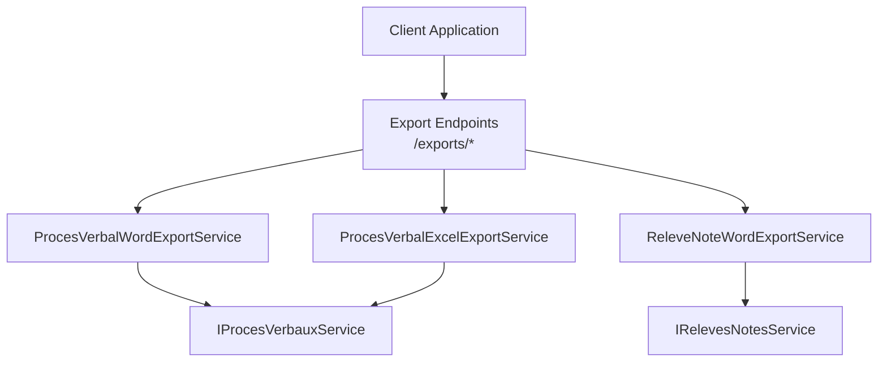
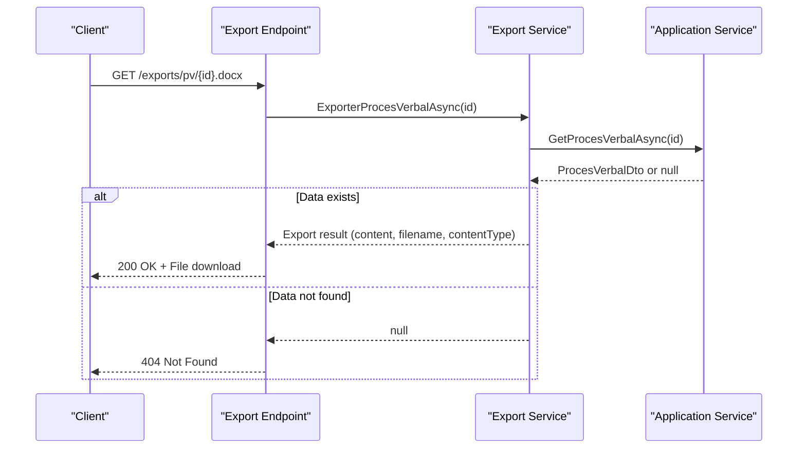
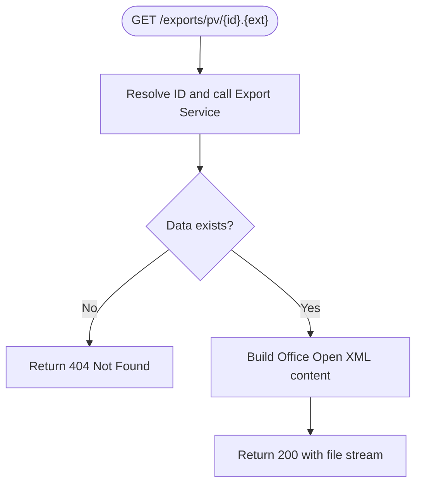
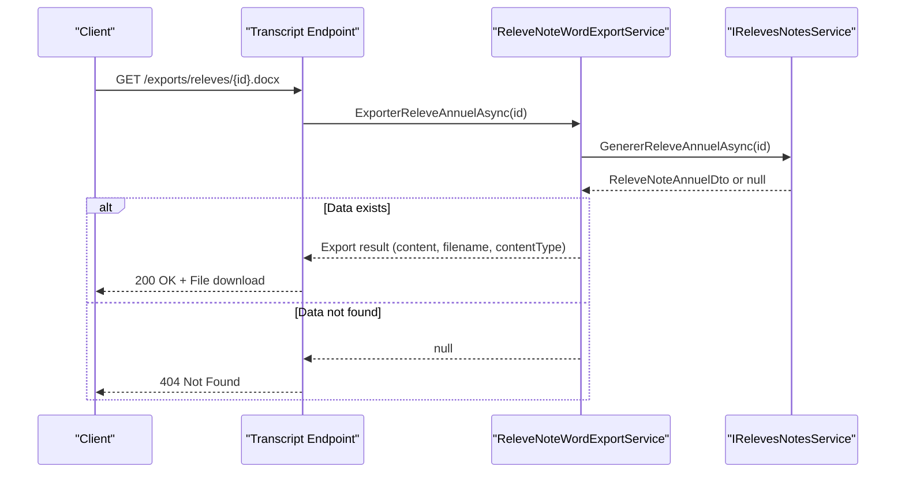
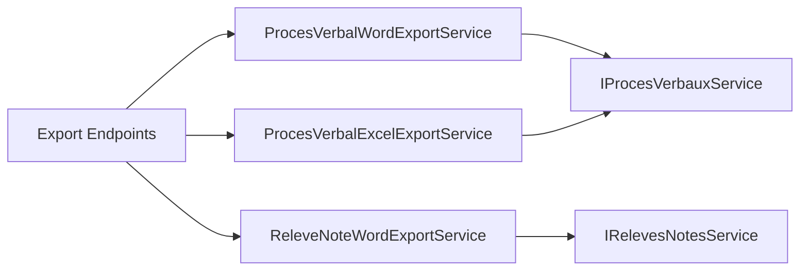

# Document Generation APIs

<cite>
**Referenced Files in This Document**
- [RiisAcademicExportEndpointExtensions.cs](file://RIIS.Academic.Web/Extensions/RiisAcademicExportEndpointExtensions.cs)
- [Program.cs (Web)](file://RIIS.Academic.Web/Program.cs)
- [ProcesVerbalWordExportService.cs](file://RIIS.Academic.Infrastructure/Documents/ProcesVerbalWordExportService.cs)
- [ProcesVerbalExcelExportService.cs](file://RIIS.Academic.Infrastructure/Documents/ProcesVerbalExcelExportService.cs)
- [ReleveNoteWordExportService.cs](file://RIIS.Academic.Infrastructure/Documents/ReleveNoteWordExportService.cs)
- [IProcesVerbauxService.cs](file://RIIS.Academic.Application/ProcesVerbaux/Services/IProcesVerbauxService.cs)
- [IRelevesNotesService.cs](file://RIIS.Academic.Application/Releves/Services/IRelevesNotesService.cs)
</cite>

## Table of Contents
1. [Introduction](#introduction)
2. [Project Structure](#project-structure)
3. [Core Components](#core-components)
4. [Architecture Overview](#architecture-overview)
5. [Detailed Component Analysis](#detailed-component-analysis)
6. [Dependency Analysis](#dependency-analysis)
7. [Performance Considerations](#performance-considerations)
8. [Troubleshooting Guide](#troubleshooting-guide)
9. [Conclusion](#conclusion)
10. [Appendices](#appendices)

## Introduction
This document provides API documentation for the document generation endpoints that export academic documents such as meeting minutes (Procès-Verbaux), transcripts (Relevés de notes), and related formats. It covers HTTP methods, URL patterns, request/response schemas, authentication considerations, error handling, and integration guidance for client applications.

## Project Structure
The document generation endpoints are exposed via minimal ASP.NET Core endpoints in the Web project and implemented by infrastructure services that generate Office Open XML files (.docx, .xlsx). The application layer provides domain services used by these implementations.

**Diagram sources**
- [RiisAcademicExportEndpointExtensions.cs:9-91](file://RIIS.Academic.Web/Extensions/RiisAcademicExportEndpointExtensions.cs#L9-L91)
- [ProcesVerbalWordExportService.cs:10-30](file://RIIS.Academic.Infrastructure/Documents/ProcesVerbalWordExportService.cs#L10-L30)
- [ProcesVerbalExcelExportService.cs:10-32](file://RIIS.Academic.Infrastructure/Documents/ProcesVerbalExcelExportService.cs#L10-L32)
- [ReleveNoteWordExportService.cs:10-28](file://RIIS.Academic.Infrastructure/Documents/ReleveNoteWordExportService.cs#L10-L28)
- [IProcesVerbauxService.cs:7-17](file://RIIS.Academic.Application/ProcesVerbaux/Services/IProcesVerbauxService.cs#L7-L17)
- [IRelevesNotesService.cs:5-16](file://RIIS.Academic.Application/Releves/Services/IRelevesNotesService.cs#L5-L16)

**Section sources**
- [Program.cs (Web):17-24](file://RIIS.Academic.Web/Program.cs#L17-L24)
- [RiisAcademicExportEndpointExtensions.cs:9-91](file://RIIS.Academic.Web/Extensions/RiisAcademicExportEndpointExtensions.cs#L9-L91)

## Core Components
- Export endpoints: Minimal GET endpoints under /exports that accept route parameters and return downloadable files or 404 when data is not found.
- Export services: Infrastructure services that build Office Open XML packages (.docx/.xlsx) from application DTOs.
- Application services: Domain services providing data retrieval for process-verbaux and transcript generation.

Key responsibilities:
- Validate input IDs and fetch data via application services.
- Generate binary content and metadata (filename, content type).
- Return file streams with appropriate headers or NotFound when data is missing.

**Section sources**
- [RiisAcademicExportEndpointExtensions.cs:11-89](file://RIIS.Academic.Web/Extensions/RiisAcademicExportEndpointExtensions.cs#L11-L89)
- [ProcesVerbalWordExportService.cs:12-30](file://RIIS.Academic.Infrastructure/Documents/ProcesVerbalWordExportService.cs#L12-L30)
- [ProcesVerbalExcelExportService.cs:14-32](file://RIIS.Academic.Infrastructure/Documents/ProcesVerbalExcelExportService.cs#L14-L32)
- [ReleveNoteWordExportService.cs:12-28](file://RIIS.Academic.Infrastructure/Documents/ReleveNoteWordExportService.cs#L12-L28)

## Architecture Overview
The endpoints delegate to specialized export services which depend on application services to retrieve the necessary data. The services construct Office Open XML documents in memory and return them as downloadable files.

**Diagram sources**
- [RiisAcademicExportEndpointExtensions.cs:11-25](file://RIIS.Academic.Web/Extensions/RiisAcademicExportEndpointExtensions.cs#L11-L25)
- [ProcesVerbalWordExportService.cs:12-30](file://RIIS.Academic.Infrastructure/Documents/ProcesVerbalWordExportService.cs#L12-L30)
- [IProcesVerbauxService.cs:17-17](file://RIIS.Academic.Application/ProcesVerbaux/Services/IProcesVerbauxService.cs#L17-L17)

## Detailed Component Analysis

### Process-Verbal (Meeting Minutes) Exports
- Endpoints:
  - GET /exports/pv/{procesVerbalId:long}.docx
  - GET /exports/pv/{procesVerbalId:long}.xlsx
  - GET /exports/pv/{procesVerbalId:long}.modele.docx
- Parameters:
  - procesVerbalId: long (route)
- Responses:
  - 200 OK with file download (Content-Type set by service; filenames generated from context)
  - 404 Not Found if the specified process-verbal does not exist
- Behavior:
  - Word export builds a formatted Word document with tables and signatures.
  - Excel export builds an xlsx workbook with a single sheet containing summary and student details.
  - Template Word export uses a template-based approach to produce Word output.

**Diagram sources**
- [RiisAcademicExportEndpointExtensions.cs:11-57](file://RIIS.Academic.Web/Extensions/RiisAcademicExportEndpointExtensions.cs#L11-L57)
- [ProcesVerbalWordExportService.cs:12-30](file://RIIS.Academic.Infrastructure/Documents/ProcesVerbalWordExportService.cs#L12-L30)
- [ProcesVerbalExcelExportService.cs:14-32](file://RIIS.Academic.Infrastructure/Documents/ProcesVerbalExcelExportService.cs#L14-L32)

**Section sources**
- [RiisAcademicExportEndpointExtensions.cs:11-57](file://RIIS.Academic.Web/Extensions/RiisAcademicExportEndpointExtensions.cs#L11-L57)
- [ProcesVerbalWordExportService.cs:32-89](file://RIIS.Academic.Infrastructure/Documents/ProcesVerbalWordExportService.cs#L32-L89)
- [ProcesVerbalExcelExportService.cs:34-139](file://RIIS.Academic.Infrastructure/Documents/ProcesVerbalExcelExportService.cs#L34-L139)

### Transcript (Annual Grade Report) Exports
- Endpoints:
  - GET /exports/releves/{inscriptionId:long}.docx
  - GET /exports/releves/{inscriptionId:long}.modele.docx
- Parameters:
  - inscriptionId: long (route)
- Responses:
  - 200 OK with file download (Word document)
  - 404 Not Found if the transcript cannot be generated for the given inscription
- Behavior:
  - Generates a structured transcript with student info, semester sections, totals, decisions, and mentions.

**Diagram sources**
- [RiisAcademicExportEndpointExtensions.cs:59-89](file://RIIS.Academic.Web/Extensions/RiisAcademicExportEndpointExtensions.cs#L59-L89)
- [ReleveNoteWordExportService.cs:12-28](file://RIIS.Academic.Infrastructure/Documents/ReleveNoteWordExportService.cs#L12-L28)
- [IRelevesNotesService.cs:14-16](file://RIIS.Academic.Application/Releves/Services/IRelevesNotesService.cs#L14-L16)

**Section sources**
- [RiisAcademicExportEndpointExtensions.cs:59-89](file://RIIS.Academic.Web/Extensions/RiisAcademicExportEndpointExtensions.cs#L59-L89)
- [ReleveNoteWordExportService.cs:30-93](file://RIIS.Academic.Infrastructure/Documents/ReleveNoteWordExportService.cs#L30-L93)

### Request/Response Schemas
- Requests:
  - All endpoints use GET with path parameters only.
  - Path parameters:
    - procesVerbalId: long
    - inscriptionId: long
- Responses:
  - Success: 200 OK with binary file content. Content-Type is determined by the export service implementation. Filename is provided via Content-Disposition header.
  - Not Found: 404 Not Found when requested resource is missing.

Notes:
- There are no query parameters or request bodies for these endpoints.
- File formats supported:
  - Word: .docx
  - Excel: .xlsx

**Section sources**
- [RiisAcademicExportEndpointExtensions.cs:11-89](file://RIIS.Academic.Web/Extensions/RiisAcademicExportEndpointExtensions.cs#L11-L89)

### Authentication and Security
- Current configuration:
  - The Web application pipeline includes HTTPS redirection and antiforgery protection but does not configure explicit authentication or authorization middleware for these endpoints.
  - The API project also lacks JWT/bearer token configuration in its Program setup.
- Implications:
  - By default, these endpoints are accessible without bearer tokens unless additional security middleware is added at deployment or reverse proxy level.
  - For production, implement authentication (e.g., JWT Bearer) and authorization policies to restrict access to authorized users or roles.

Recommendations:
- Add authentication middleware (e.g., JWT Bearer) and apply authorization attributes or policies to the export endpoints.
- Enforce HTTPS-only access and consider rate limiting at the gateway or middleware layer.

**Section sources**
- [Program.cs (Web):17-24](file://RIIS.Academic.Web/Program.cs#L17-L24)
- [Program.cs (API):13-17](file://RIIS.Academic.Api/Program.cs#L13-L17)

### Error Handling and Status Codes
- 404 Not Found: Returned when the underlying data for the requested ID is not available.
- Other errors:
  - If exceptions occur during data retrieval or document generation, standard ASP.NET Core unhandled exception behavior applies (not explicitly configured in the analyzed code).
- Best practices:
  - Implement global exception handling middleware to return consistent error responses.
  - Log errors with correlation IDs for traceability.

**Section sources**
- [RiisAcademicExportEndpointExtensions.cs:22-24](file://RIIS.Academic.Web/Extensions/RiisAcademicExportEndpointExtensions.cs#L22-L24)
- [RiisAcademicExportEndpointExtensions.cs:38-40](file://RIIS.Academic.Web/Extensions/RiisAcademicExportEndpointExtensions.cs#L38-L40)
- [RiisAcademicExportEndpointExtensions.cs:54-56](file://RIIS.Academic.Web/Extensions/RiisAcademicExportEndpointExtensions.cs#L54-L56)
- [RiisAcademicExportEndpointExtensions.cs:70-72](file://RIIS.Academic.Web/Extensions/RiisAcademicExportEndpointExtensions.cs#L70-L72)
- [RiisAcademicExportEndpointExtensions.cs:86-88](file://RIIS.Academic.Web/Extensions/RiisAcademicExportEndpointExtensions.cs#L86-L88)

### Rate Limiting
- No built-in rate limiting is configured in the analyzed code.
- Recommendations:
  - Apply rate limiting via middleware or reverse proxy (e.g., IIS, Nginx, Azure APIM) to protect endpoints from abuse.
  - Configure per-client limits and consider caching strategies for repeated requests.

[No sources needed since this section provides general guidance]

### Integration Patterns for Clients
- Download pattern:
  - Use HTTP GET to the appropriate endpoint URL with the required ID.
  - Handle binary response streams and save to disk or display in browser based on Content-Disposition.
- Example calls:
  - Generate a Word transcript: GET /exports/releves/{inscriptionId}.docx
  - Generate an Excel minutes: GET /exports/pv/{procesVerbalId}.xlsx
  - Generate a template Word minutes: GET /exports/pv/{procesVerbalId}.modele.docx
- Error handling:
  - On 404, inform the user that the requested document cannot be generated (ID may be invalid or data missing).
  - Retry with exponential backoff for transient network issues.

[No sources needed since this section provides general guidance]

## Dependency Analysis
The endpoints depend on export services, which in turn depend on application services to retrieve data.

**Diagram sources**
- [RiisAcademicExportEndpointExtensions.cs:11-89](file://RIIS.Academic.Web/Extensions/RiisAcademicExportEndpointExtensions.cs#L11-L89)
- [ProcesVerbalWordExportService.cs:10-30](file://RIIS.Academic.Infrastructure/Documents/ProcesVerbalWordExportService.cs#L10-L30)
- [ProcesVerbalExcelExportService.cs:10-32](file://RIIS.Academic.Infrastructure/Documents/ProcesVerbalExcelExportService.cs#L10-L32)
- [ReleveNoteWordExportService.cs:10-28](file://RIIS.Academic.Infrastructure/Documents/ReleveNoteWordExportService.cs#L10-L28)
- [IProcesVerbauxService.cs:7-17](file://RIIS.Academic.Application/ProcesVerbaux/Services/IProcesVerbauxService.cs#L7-L17)
- [IRelevesNotesService.cs:5-16](file://RIIS.Academic.Application/Releves/Services/IRelevesNotesService.cs#L5-L16)

**Section sources**
- [RiisAcademicExportEndpointExtensions.cs:11-89](file://RIIS.Academic.Web/Extensions/RiisAcademicExportEndpointExtensions.cs#L11-L89)

## Performance Considerations
- Memory usage:
  - Documents are built in-memory using MemoryStream before being returned. Large datasets can increase memory pressure.
- Compression:
  - Office Open XML packages are created with compression enabled.
- Optimization opportunities:
  - Stream large documents directly to the response where feasible.
  - Cache frequently accessed data at the application service layer to reduce database load.
  - Consider background job processing for heavy exports with notification upon completion.

[No sources needed since this section provides general guidance]

## Troubleshooting Guide
Common issues and resolutions:
- 404 Not Found:
  - Cause: Invalid or non-existent ID for process-verbal or inscription.
  - Resolution: Verify the ID exists in the system and corresponds to valid data.
- Empty or malformed documents:
  - Cause: Missing required fields in source data.
  - Resolution: Ensure all necessary data is present before generating documents.
- Performance issues:
  - Cause: Large datasets or slow database queries.
  - Resolution: Optimize queries, add caching, or offload to background jobs.

**Section sources**
- [RiisAcademicExportEndpointExtensions.cs:22-24](file://RIIS.Academic.Web/Extensions/RiisAcademicExportEndpointExtensions.cs#L22-L24)
- [RiisAcademicExportEndpointExtensions.cs:38-40](file://RIIS.Academic.Web/Extensions/RiisAcademicExportEndpointExtensions.cs#L38-L40)
- [RiisAcademicExportEndpointExtensions.cs:54-56](file://RIIS.Academic.Web/Extensions/RiisAcademicExportEndpointExtensions.cs#L54-L56)
- [RiisAcademicExportEndpointExtensions.cs:70-72](file://RIIS.Academic.Web/Extensions/RiisAcademicExportEndpointExtensions.cs#L70-L72)
- [RiisAcademicExportEndpointExtensions.cs:86-88](file://RIIS.Academic.Web/Extensions/RiisAcademicExportEndpointExtensions.cs#L86-L88)

## Conclusion
The document generation APIs provide straightforward GET endpoints for exporting academic documents in Word and Excel formats. They rely on application services to retrieve data and infrastructure services to build Office Open XML packages. While authentication and rate limiting are not configured in the analyzed code, they should be added for production deployments. Clients should handle binary responses and common error cases like 404 Not Found appropriately.

[No sources needed since this section summarizes without analyzing specific files]

## Appendices

### API Endpoints Summary
- Process-Verbal (Minutes)
  - GET /exports/pv/{procesVerbalId:long}.docx
  - GET /exports/pv/{procesVerbalId:long}.xlsx
  - GET /exports/pv/{procesVerbalId:long}.modele.docx
- Transcript (Annual Grade Report)
  - GET /exports/releves/{inscriptionId:long}.docx
  - GET /exports/releves/{inscriptionId:long}.modele.docx

**Section sources**
- [RiisAcademicExportEndpointExtensions.cs:11-89](file://RIIS.Academic.Web/Extensions/RiisAcademicExportEndpointExtensions.cs#L11-L89)