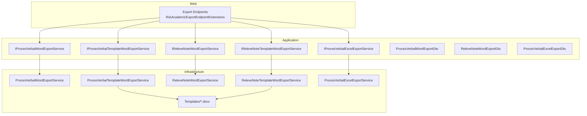
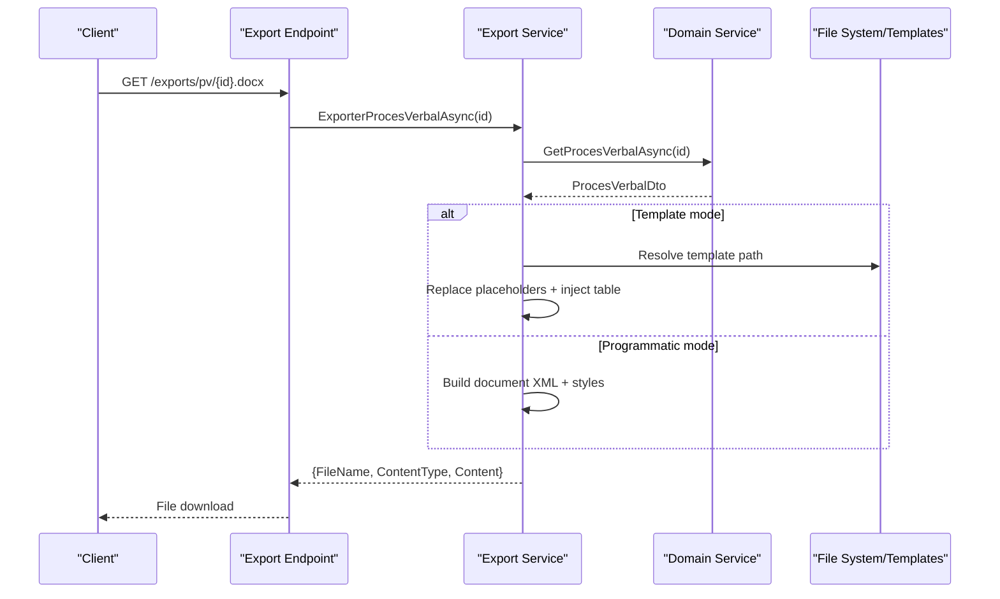
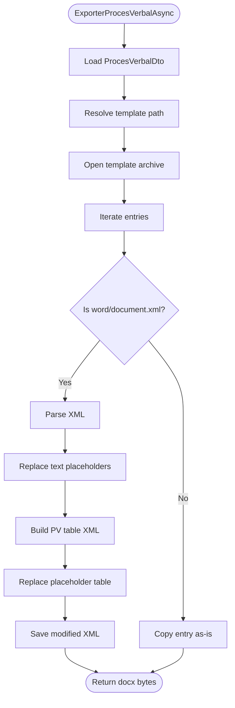
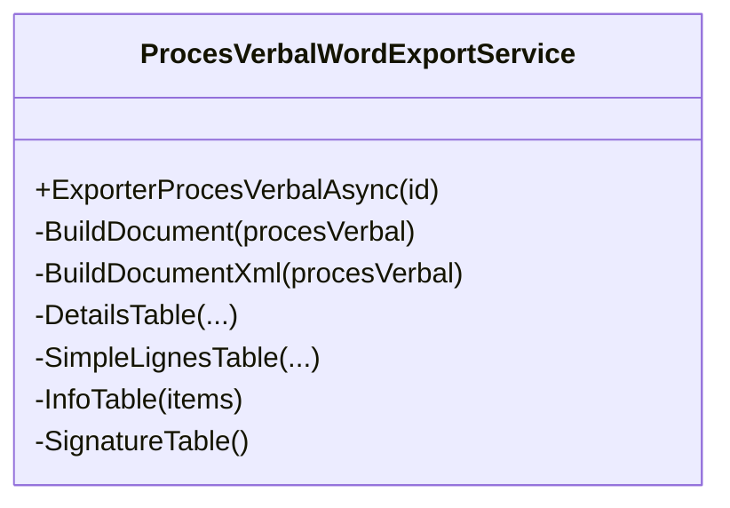
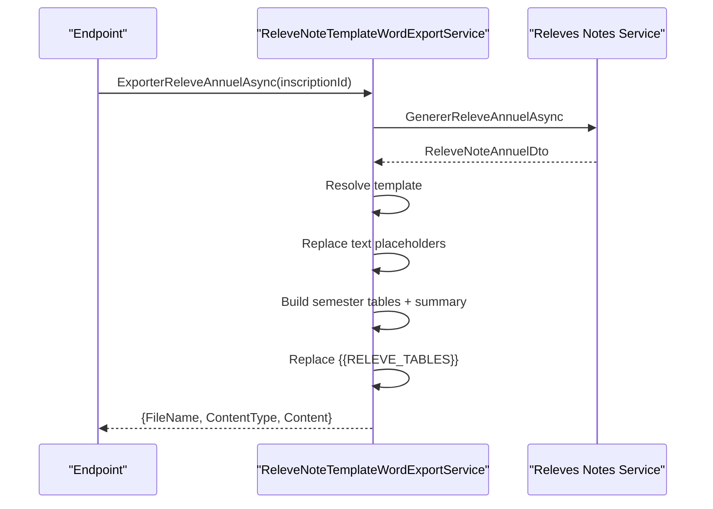
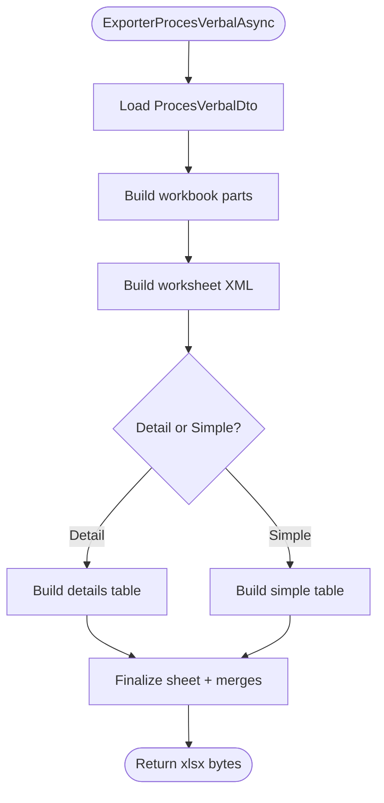
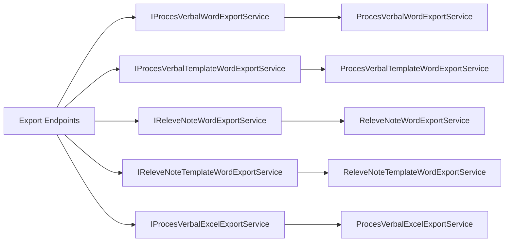

# Document Generation

<cite>
**Referenced Files in This Document**
- [ProcesVerbalTemplateWordExportService.cs](file://RIIS.Academic.Infrastructure/Documents/ProcesVerbalTemplateWordExportService.cs)
- [ProcesVerbalWordExportService.cs](file://RIIS.Academic.Infrastructure/Documents/ProcesVerbalWordExportService.cs)
- [ReleveNoteTemplateWordExportService.cs](file://RIIS.Academic.Infrastructure/Documents/ReleveNoteTemplateWordExportService.cs)
- [ReleveNoteWordExportService.cs](file://RIIS.Academic.Infrastructure/Documents/ReleveNoteWordExportService.cs)
- [ProcesVerbalExcelExportService.cs](file://RIIS.Academic.Infrastructure/Documents/ProcesVerbalExcelExportService.cs)
- [IProcesVerbalTemplateWordExportService.cs](file://RIIS.Academic.Application/ProcesVerbaux/Services/IProcesVerbalTemplateWordExportService.cs)
- [IProcesVerbalWordExportService.cs](file://RIIS.Academic.Application/ProcesVerbaux/Services/IProcesVerbalWordExportService.cs)
- [IReleveNoteTemplateWordExportService.cs](file://RIIS.Academic.Application/Releves/Services/IReleveNoteTemplateWordExportService.cs)
- [IReleveNoteWordExportService.cs](file://RIIS.Academic.Application/Releves/Services/IReleveNoteWordExportService.cs)
- [IProcesVerbalExcelExportService.cs](file://RIIS.Academic.Application/ProcesVerbaux/Services/IProcesVerbalExcelExportService.cs)
- [RiisAcademicExportEndpointExtensions.cs](file://RIIS.Academic.Web/Extensions/RiisAcademicExportEndpointExtensions.cs)
- [ProcesVerbalWordExportDto.cs](file://RIIS.Academic.Application/ProcesVerbaux/Dtos/ProcesVerbalWordExportDto.cs)
- [ReleveNoteWordExportDto.cs](file://RIIS.Academic.Application/Releves/Dtos/ReleveNoteWordExportDto.cs)
- [ProcesVerbalExcelExportDto.cs](file://RIIS.Academic.Application/ProcesVerbaux/Dtos/ProcesVerbalExcelExportDto.cs)
</cite>

## Table of Contents
1. Introduction
2. Project Structure
3. Core Components
4. Architecture Overview
5. Detailed Component Analysis
6. Dependency Analysis
7. Performance Considerations
8. Troubleshooting Guide
9. Conclusion

## Introduction
This document explains the template-based document generation services for Word and Excel outputs within the application. It covers:
- Word document creation using OpenXML SDK concepts (template processing and programmatic XML generation)
- Excel export functionality for academic records
- Template structure, placeholder replacement, and dynamic content generation
- File format handling, styling preservation, and batch processing considerations
- Template management, custom formatting options, and error handling strategies
- Performance considerations for large document generation and memory management best practices

## Project Structure
The document generation features are implemented in the Infrastructure layer and exposed via Web endpoints. The Application layer defines service interfaces and DTOs that decouple consumers from implementation details.

**Diagram sources**
- [RiisAcademicExportEndpointExtensions.cs:9-91](file://RIIS.Academic.Web/Extensions/RiisAcademicExportEndpointExtensions.cs#L9-L91)
- [IProcesVerbalWordExportService.cs:5-10](file://RIIS.Academic.Application/ProcesVerbaux/Services/IProcesVerbalWordExportService.cs#L5-L10)
- [IProcesVerbalTemplateWordExportService.cs:5-10](file://RIIS.Academic.Application/ProcesVerbaux/Services/IProcesVerbalTemplateWordExportService.cs#L5-L10)
- [IReleveNoteWordExportService.cs:5-10](file://RIIS.Academic.Application/Releves/Services/IReleveNoteWordExportService.cs#L5-L10)
- [IReleveNoteTemplateWordExportService.cs:5-10](file://RIIS.Academic.Application/Releves/Services/IReleveNoteTemplateWordExportService.cs#L5-L10)
- [IProcesVerbalExcelExportService.cs:5-10](file://RIIS.Academic.Application/ProcesVerbaux/Services/IProcesVerbalExcelExportService.cs#L5-L10)
- [ProcesVerbalWordExportService.cs:10-45](file://RIIS.Academic.Infrastructure/Documents/ProcesVerbalWordExportService.cs#L10-L45)
- [ProcesVerbalTemplateWordExportService.cs:11-68](file://RIIS.Academic.Infrastructure/Documents/ProcesVerbalTemplateWordExportService.cs#L11-L68)
- [ReleveNoteWordExportService.cs:10-43](file://RIIS.Academic.Infrastructure/Documents/ReleveNoteWordExportService.cs#L10-L43)
- [ReleveNoteTemplateWordExportService.cs:11-68](file://RIIS.Academic.Infrastructure/Documents/ReleveNoteTemplateWordExportService.cs#L11-L68)
- [ProcesVerbalExcelExportService.cs:10-50](file://RIIS.Academic.Infrastructure/Documents/ProcesVerbalExcelExportService.cs#L10-L50)

**Section sources**
- [RiisAcademicExportEndpointExtensions.cs:9-91](file://RIIS.Academic.Web/Extensions/RiisAcademicExportEndpointExtensions.cs#L9-L91)
- [ProcesVerbalWordExportService.cs:10-45](file://RIIS.Academic.Infrastructure/Documents/ProcesVerbalWordExportService.cs#L10-L45)
- [ProcesVerbalTemplateWordExportService.cs:11-68](file://RIIS.Academic.Infrastructure/Documents/ProcesVerbalTemplateWordExportService.cs#L11-L68)
- [ReleveNoteWordExportService.cs:10-43](file://RIIS.Academic.Infrastructure/Documents/ReleveNoteWordExportService.cs#L10-L43)
- [ReleveNoteTemplateWordExportService.cs:11-68](file://RIIS.Academic.Infrastructure/Documents/ReleveNoteTemplateWordExportService.cs#L11-L68)
- [ProcesVerbalExcelExportService.cs:10-50](file://RIIS.Academic.Infrastructure/Documents/ProcesVerbalExcelExportService.cs#L10-L50)

## Core Components
- ProcesVerbalWordExportService: Generates a Word document programmatically with headers, metadata tables, student lists, and signature blocks. Uses inline styles and section/page settings.
- ProcesVerbalTemplateWordExportService: Loads a .docx template, replaces text placeholders, and injects a dynamically built table into a placeholder table or paragraph.
- ReleveNoteWordExportService: Builds an annual transcript Word document with per-semester notes, summaries, decisions, and signatures.
- ReleveNoteTemplateWordExportService: Loads a transcript template, replaces header placeholders, and inserts semester tables and summary sections.
- ProcesVerbalExcelExportService: Creates an Excel workbook with styled headers, frozen panes, print titles, and conditional note colors.

Key DTOs returned by services include FileName, ContentType, and Content bytes for direct file responses.

**Section sources**
- [ProcesVerbalWordExportService.cs:10-45](file://RIIS.Academic.Infrastructure/Documents/ProcesVerbalWordExportService.cs#L10-L45)
- [ProcesVerbalTemplateWordExportService.cs:11-68](file://RIIS.Academic.Infrastructure/Documents/ProcesVerbalTemplateWordExportService.cs#L11-L68)
- [ReleveNoteWordExportService.cs:10-43](file://RIIS.Academic.Infrastructure/Documents/ReleveNoteWordExportService.cs#L10-L43)
- [ReleveNoteTemplateWordExportService.cs:11-68](file://RIIS.Academic.Infrastructure/Documents/ReleveNoteTemplateWordExportService.cs#L11-L68)
- [ProcesVerbalExcelExportService.cs:10-50](file://RIIS.Academic.Infrastructure/Documents/ProcesVerbalExcelExportService.cs#L10-L50)
- [ProcesVerbalWordExportDto.cs:3-8](file://RIIS.Academic.Application/ProcesVerbaux/Dtos/ProcesVerbalWordExportDto.cs#L3-L8)
- [ReleveNoteWordExportDto.cs:3-8](file://RIIS.Academic.Application/Releves/Dtos/ReleveNoteWordExportDto.cs#L3-L8)
- [ProcesVerbalExcelExportDto.cs:3-8](file://RIIS.Academic.Application/ProcesVerbaux/Dtos/ProcesVerbalExcelExportDto.cs#L3-L8)

## Architecture Overview
The system exposes HTTP endpoints that resolve services via dependency injection. Services fetch domain data through application services and produce either:
- A byte array representing a valid .docx/.xlsx package
- A filename and MIME type for response streaming

Template-based services preserve existing styles and layout by modifying only targeted XML parts inside the archive. Programmatic builders generate minimal but fully compliant packages with embedded styles.

**Diagram sources**
- [RiisAcademicExportEndpointExtensions.cs:11-25](file://RIIS.Academic.Web/Extensions/RiisAcademicExportEndpointExtensions.cs#L11-L25)
- [ProcesVerbalTemplateWordExportService.cs:16-68](file://RIIS.Academic.Infrastructure/Documents/ProcesVerbalTemplateWordExportService.cs#L16-L68)
- [ProcesVerbalWordExportService.cs:12-45](file://RIIS.Academic.Infrastructure/Documents/ProcesVerbalWordExportService.cs#L12-L45)

## Detailed Component Analysis

### Word Template Processing (Proces Verbal)
- Template discovery: Searches multiple candidate paths and throws a clear file-not-found error if missing.
- Placeholder replacement: Scans all text nodes and replaces known placeholders with values from the DTO.
- Dynamic table injection: Locates a placeholder table and replaces it with a generated table containing headers, rows, and styling.
- Styling preservation: Because it edits an existing .docx, fonts, themes, and layout remain intact.

**Diagram sources**
- [ProcesVerbalTemplateWordExportService.cs:16-68](file://RIIS.Academic.Infrastructure/Documents/ProcesVerbalTemplateWordExportService.cs#L16-L68)
- [ProcesVerbalTemplateWordExportService.cs:70-86](file://RIIS.Academic.Infrastructure/Documents/ProcesVerbalTemplateWordExportService.cs#L70-L86)
- [ProcesVerbalTemplateWordExportService.cs:88-147](file://RIIS.Academic.Infrastructure/Documents/ProcesVerbalTemplateWordExportService.cs#L88-L147)

**Section sources**
- [ProcesVerbalTemplateWordExportService.cs:16-147](file://RIIS.Academic.Infrastructure/Documents/ProcesVerbalTemplateWordExportService.cs#L16-L147)

### Programmatic Word Generation (Proces Verbal)
- Builds a complete .docx package with required parts: content types, relationships, styles, and document XML.
- Renders headers, info table, student list, and signature area with consistent styling.
- Uses fixed page size and margins suitable for landscape printing.

**Diagram sources**
- [ProcesVerbalWordExportService.cs:10-45](file://RIIS.Academic.Infrastructure/Documents/ProcesVerbalWordExportService.cs#L10-L45)
- [ProcesVerbalWordExportService.cs:47-89](file://RIIS.Academic.Infrastructure/Documents/ProcesVerbalWordExportService.cs#L47-L89)
- [ProcesVerbalWordExportService.cs:91-240](file://RIIS.Academic.Infrastructure/Documents/ProcesVerbalWordExportService.cs#L91-L240)

**Section sources**
- [ProcesVerbalWordExportService.cs:10-240](file://RIIS.Academic.Infrastructure/Documents/ProcesVerbalWordExportService.cs#L10-L240)

### Transcript Template Processing
- Template discovery and placeholder replacement similar to PV template service.
- Supports replacing either a table or paragraph placeholder for dynamic content blocks.
- Generates per-semester notes tables and an annual summary table.

**Diagram sources**
- [ReleveNoteTemplateWordExportService.cs:16-68](file://RIIS.Academic.Infrastructure/Documents/ReleveNoteTemplateWordExportService.cs#L16-L68)
- [ReleveNoteTemplateWordExportService.cs:70-86](file://RIIS.Academic.Infrastructure/Documents/ReleveNoteTemplateWordExportService.cs#L70-L86)
- [ReleveNoteTemplateWordExportService.cs:88-178](file://RIIS.Academic.Infrastructure/Documents/ReleveNoteTemplateWordExportService.cs#L88-L178)

**Section sources**
- [ReleveNoteTemplateWordExportService.cs:16-178](file://RIIS.Academic.Infrastructure/Documents/ReleveNoteTemplateWordExportService.cs#L16-L178)

### Programmatic Transcript Generation
- Builds a full Word package with bilingual headers, student info, per-semester tables, and decision lines.
- Applies consistent styles and page setup for standard letter size.

**Section sources**
- [ReleveNoteWordExportService.cs:10-93](file://RIIS.Academic.Infrastructure/Documents/ReleveNoteWordExportService.cs#L10-L93)
- [ReleveNoteWordExportService.cs:95-190](file://RIIS.Academic.Infrastructure/Documents/ReleveNoteWordExportService.cs#L95-L190)

### Excel Export (Proces Verbal)
- Creates a single worksheet named “PV” with frozen panes, print titles, and column widths.
- Dynamically builds detail or simple tables depending on available elements.
- Applies number formats and conditional color styles for grades.

**Diagram sources**
- [ProcesVerbalExcelExportService.cs:14-50](file://RIIS.Academic.Infrastructure/Documents/ProcesVerbalExcelExportService.cs#L14-L50)
- [ProcesVerbalExcelExportService.cs:52-139](file://RIIS.Academic.Infrastructure/Documents/ProcesVerbalExcelExportService.cs#L52-L139)
- [ProcesVerbalExcelExportService.cs:141-253](file://RIIS.Academic.Infrastructure/Documents/ProcesVerbalExcelExportService.cs#L141-L253)

**Section sources**
- [ProcesVerbalExcelExportService.cs:14-253](file://RIIS.Academic.Infrastructure/Documents/ProcesVerbalExcelExportService.cs#L14-L253)

## Dependency Analysis
- Web endpoints depend on Application service interfaces; implementations live in Infrastructure.
- Template-based services depend on file system access for templates and use XML manipulation to modify archives.
- Programmatic services build minimal OpenXML packages without external templates.
- All services return strongly-typed DTOs with FileName, ContentType, and Content bytes.

**Diagram sources**
- [RiisAcademicExportEndpointExtensions.cs:9-91](file://RIIS.Academic.Web/Extensions/RiisAcademicExportEndpointExtensions.cs#L9-L91)
- [IProcesVerbalWordExportService.cs:5-10](file://RIIS.Academic.Application/ProcesVerbaux/Services/IProcesVerbalWordExportService.cs#L5-L10)
- [IProcesVerbalTemplateWordExportService.cs:5-10](file://RIIS.Academic.Application/ProcesVerbaux/Services/IProcesVerbalTemplateWordExportService.cs#L5-L10)
- [IReleveNoteWordExportService.cs:5-10](file://RIIS.Academic.Application/Releves/Services/IReleveNoteWordExportService.cs#L5-L10)
- [IReleveNoteTemplateWordExportService.cs:5-10](file://RIIS.Academic.Application/Releves/Services/IReleveNoteTemplateWordExportService.cs#L5-L10)
- [IProcesVerbalExcelExportService.cs:5-10](file://RIIS.Academic.Application/ProcesVerbaux/Services/IProcesVerbalExcelExportService.cs#L5-L10)

**Section sources**
- [RiisAcademicExportEndpointExtensions.cs:9-91](file://RIIS.Academic.Web/Extensions/RiisAcademicExportEndpointExtensions.cs#L9-L91)

## Performance Considerations
- Streaming and memory:
  - Use streams and ZipArchive with leaveOpen patterns to avoid loading entire archives into memory at once.
  - Write directly to output streams and minimize intermediate string allocations.
- XML processing:
  - Prefer LINQ to XML for targeted replacements; limit traversal to relevant nodes.
  - Avoid repeated parsing; reuse computed structures like column widths and style fragments.
- Large datasets:
  - For very large tables, consider chunked row generation and avoiding excessive concatenation.
  - In Excel, prefer numeric cells over inline strings where possible to reduce size.
- Caching:
  - Cache resolved template paths per request scope to avoid repeated filesystem checks.
  - If templates are static, consider caching parsed template structures carefully with proper disposal.
- Concurrency:
  - Ensure thread-safe access to shared resources; current implementations are stateless and safe for concurrent requests.

[No sources needed since this section provides general guidance]

## Troubleshooting Guide
- Missing template files:
  - Symptom: Exception indicating template not found.
  - Cause: Template not present in any of the searched paths.
  - Resolution: Place the correct .docx template under one of the expected directories.
- Placeholder not found:
  - Symptom: Exception when injecting tables because placeholder is missing.
  - Cause: Template does not contain the expected placeholder marker.
  - Resolution: Add the required placeholder in the template’s table or paragraph.
- Incorrect output format:
  - Symptom: Generated file cannot be opened by Office applications.
  - Cause: Invalid package structure or missing required parts.
  - Resolution: Verify that all required parts (content types, relationships, styles, document/worksheet) are included.
- Encoding issues:
  - Symptom: Garbled characters in output.
  - Cause: Incorrect encoding when writing XML.
  - Resolution: Ensure UTF-8 encoding without BOM is used when writing XML parts.

**Section sources**
- [ProcesVerbalTemplateWordExportService.cs:70-86](file://RIIS.Academic.Infrastructure/Documents/ProcesVerbalTemplateWordExportService.cs#L70-L86)
- [ProcesVerbalTemplateWordExportService.cs:123-137](file://RIIS.Academic.Infrastructure/Documents/ProcesVerbalTemplateWordExportService.cs#L123-L137)
- [ReleveNoteTemplateWordExportService.cs:70-86](file://RIIS.Academic.Infrastructure/Documents/ReleveNoteTemplateWordExportService.cs#L70-L86)
- [ReleveNoteTemplateWordExportService.cs:125-154](file://RIIS.Academic.Infrastructure/Documents/ReleveNoteTemplateWordExportService.cs#L125-L154)

## Conclusion
The document generation subsystem offers two complementary approaches:
- Template-based generation preserves design and styling while enabling dynamic content insertion via placeholders.
- Programmatic generation ensures full control over structure and styling without external templates.

Both approaches produce standards-compliant OpenXML packages suitable for immediate download. With careful attention to memory usage, streaming I/O, and robust error handling, the system can reliably serve both single and batch document generation scenarios.

[No sources needed since this section summarizes without analyzing specific files]