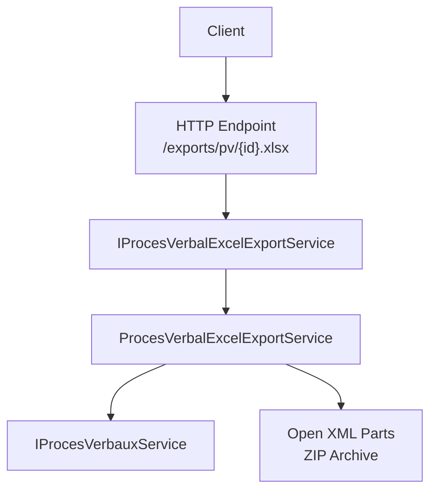
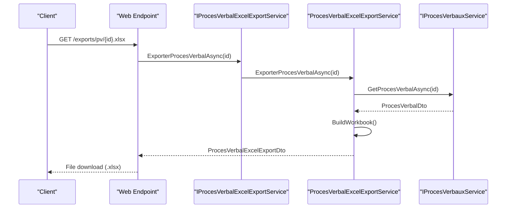
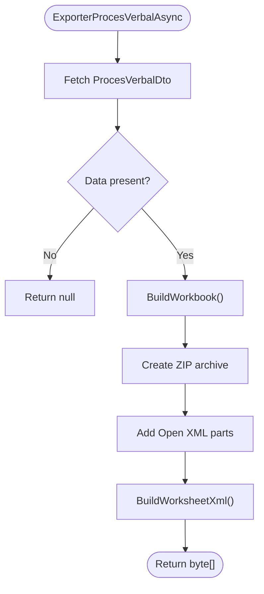
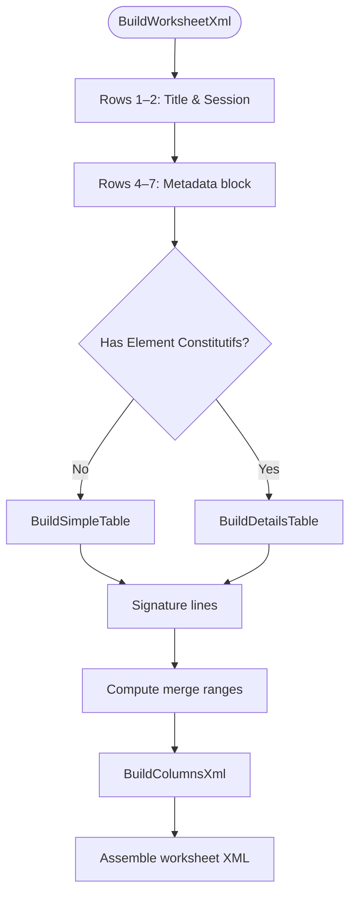
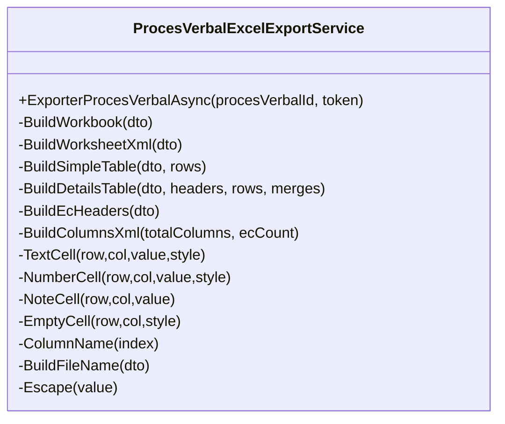
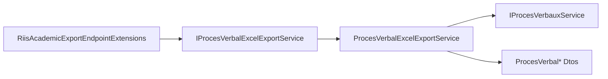

# Excel Export Generation

<cite>
**Referenced Files in This Document**
- [ProcesVerbalExcelExportService.cs](file://RIIS.Academic.Infrastructure/Documents/ProcesVerbalExcelExportService.cs)
- [IProcesVerbalExcelExportService.cs](file://RIIS.Academic.Application/ProcesVerbaux/Services/IProcesVerbalExcelExportService.cs)
- [ProcesVerbalExcelExportDto.cs](file://RIIS.Academic.Application/ProcesVerbaux/Dtos/ProcesVerbalExcelExportDto.cs)
- [ProcesVerbalDto.cs](file://RIIS.Academic.Application/ProcesVerbaux/Dtos/ProcesVerbalDto.cs)
- [ProcesVerbalLigneDto.cs](file://RIIS.Academic.Application/ProcesVerbaux/Dtos/ProcesVerbalLigneDto.cs)
- [ProcesVerbalElementConstitutifLigneDto.cs](file://RIIS.Academic.Application/ProcesVerbaux/Dtos/ProcesVerbalElementConstitutifLigneDto.cs)
- [RiisAcademicExportEndpointExtensions.cs](file://RIIS.Academic.Web/Extensions/RiisAcademicExportEndpointExtensions.cs)
</cite>

## Table of Contents
1. [Introduction](#introduction)
2. [Project Structure](#project-structure)
3. [Core Components](#core-components)
4. [Architecture Overview](#architecture-overview)
5. [Detailed Component Analysis](#detailed-component-analysis)
6. [Dependency Analysis](#dependency-analysis)
7. [Performance Considerations](#performance-considerations)
8. [Troubleshooting Guide](#troubleshooting-guide)
9. [Conclusion](#conclusion)

## Introduction
This document explains the Excel export functionality for academic records (Proces Verbal). It covers how spreadsheets are created from domain data, how formatting and layout are applied, and how the export is exposed via an HTTP endpoint. It also provides guidance on batch exporting, performance considerations for large datasets, memory optimization strategies, error handling, file size optimization, and compatibility with Excel versions.

## Project Structure
The Excel export spans three layers:
- Web layer: exposes a GET endpoint that returns an .xlsx file.
- Application layer: defines the service interface and DTOs used by the export.
- Infrastructure layer: implements the Excel workbook generation using raw Open XML parts written to a ZIP archive.

**Diagram sources**
- [RiisAcademicExportEndpointExtensions.cs:27-41](file://RIIS.Academic.Web/Extensions/RiisAcademicExportEndpointExtensions.cs#L27-L41)
- [IProcesVerbalExcelExportService.cs:5-10](file://RIIS.Academic.Application/ProcesVerbaux/Services/IProcesVerbalExcelExportService.cs#L5-L10)
- [ProcesVerbalExcelExportService.cs:10-31](file://RIIS.Academic.Infrastructure/Documents/ProcesVerbalExcelExportService.cs#L10-L31)

**Section sources**
- [RiisAcademicExportEndpointExtensions.cs:9-41](file://RIIS.Academic.Web/Extensions/RiisAcademicExportEndpointExtensions.cs#L9-L41)
- [IProcesVerbalExcelExportService.cs:5-10](file://RIIS.Academic.Application/ProcesVerbaux/Services/IProcesVerbalExcelExportService.cs#L5-L10)
- [ProcesVerbalExcelExportService.cs:10-31](file://RIIS.Academic.Infrastructure/Documents/ProcesVerbalExcelExportService.cs#L10-L31)

## Core Components
- IProcesVerbalExcelExportService: Declares the asynchronous export method returning a DTO with file name, content type, and byte array content.
- ProcesVerbalExcelExportService: Implements workbook creation, worksheet building, styling, and ZIP packaging.
- Dtos:
  - ProcesVerbalExcelExportDto: Holds FileName, ContentType, Content.
  - ProcesVerbalDto: Aggregates header metadata and student rows.
  - ProcesVerbalLigneDto: Represents a student row with grades, credits, rank, and decision.
  - ProcesVerbalElementConstitutifLigneDto: Represents per-element constitutif details (grades and decisions).

Key responsibilities:
- Fetching data via IProcesVerbauxService.
- Building a single-sheet workbook named “PV”.
- Rendering headers, summary blocks, and tables (simple or detailed).
- Applying styles, borders, fills, fonts, number formats, column widths, frozen panes, print titles, and page setup.
- Packaging into an .xlsx ZIP archive with required Open XML parts.

**Section sources**
- [IProcesVerbalExcelExportService.cs:5-10](file://RIIS.Academic.Application/ProcesVerbaux/Services/IProcesVerbalExcelExportService.cs#L5-L10)
- [ProcesVerbalExcelExportDto.cs:3-8](file://RIIS.Academic.Application/ProcesVerbaux/Dtos/ProcesVerbalExcelExportDto.cs#L3-L8)
- [ProcesVerbalDto.cs:5-40](file://RIIS.Academic.Application/ProcesVerbaux/Dtos/ProcesVerbalDto.cs#L5-L40)
- [ProcesVerbalLigneDto.cs:5-24](file://RIIS.Academic.Application/ProcesVerbaux/Dtos/ProcesVerbalLigneDto.cs#L5-L24)
- [ProcesVerbalElementConstitutifLigneDto.cs:3-17](file://RIIS.Academic.Application/ProcesVerbaux/Dtos/ProcesVerbalElementConstitutifLigneDto.cs#L3-L17)
- [ProcesVerbalExcelExportService.cs:14-31](file://RIIS.Academic.Infrastructure/Documents/ProcesVerbalExcelExportService.cs#L14-L31)

## Architecture Overview
The export flow starts at the web endpoint, which calls the application service interface. The infrastructure implementation builds the Excel workbook by composing Open XML parts and writing them into a ZIP archive. The response is returned as a downloadable file.

**Diagram sources**
- [RiisAcademicExportEndpointExtensions.cs:27-41](file://RIIS.Academic.Web/Extensions/RiisAcademicExportEndpointExtensions.cs#L27-L41)
- [ProcesVerbalExcelExportService.cs:14-31](file://RIIS.Academic.Infrastructure/Documents/ProcesVerbalExcelExportService.cs#L14-L31)

## Detailed Component Analysis

### Workbook Creation and Structure
- Single sheet named “PV” is created.
- Required Open XML parts are added:
  - Content types, root relationships, app properties, core properties.
  - Workbook definition and workbook relationships.
  - Stylesheet with fonts, fills, borders, number formats, and cell formats.
  - Worksheet XML with dimensions, frozen panes, column definitions, sheet data, merges, print options, margins, and page setup.

**Diagram sources**
- [ProcesVerbalExcelExportService.cs:14-31](file://RIIS.Academic.Infrastructure/Documents/ProcesVerbalExcelExportService.cs#L14-L31)
- [ProcesVerbalExcelExportService.cs:34-50](file://RIIS.Academic.Infrastructure/Documents/ProcesVerbalExcelExportService.cs#L34-L50)

**Section sources**
- [ProcesVerbalExcelExportService.cs:34-50](file://RIIS.Academic.Infrastructure/Documents/ProcesVerbalExcelExportService.cs#L34-L50)
- [ProcesVerbalExcelExportService.cs:384-447](file://RIIS.Academic.Infrastructure/Documents/ProcesVerbalExcelExportService.cs#L384-L447)
- [ProcesVerbalExcelExportService.cs:449-500](file://RIIS.Academic.Infrastructure/Documents/ProcesVerbalExcelExportService.cs#L449-L500)

### Worksheet Layout and Formatting
- Header area:
  - Row 1: Title merged across all columns.
  - Row 2: Session label merged across all columns.
  - Rows 4–7: Metadata fields (Cycle, Parcours, Classe, Année académique, Session, Statut, Students count, Decisions summary).
- Tables:
  - Simple table mode (no element constitutifs): Columns for Rank, Name, Matricule, Average, Credits, Decision.
  - Detailed table mode (with element constitutifs): Two-row header with sub-columns for each element (CCON, CC, SN, MOY), plus Credits, Average, Rank, Decision.
- Styling:
  - Fonts: Calibri sizes 10–16; bold variants; colors for success/failure states.
  - Fills: Light gray backgrounds for headers and alternating sections.
  - Borders: Thin borders with consistent color.
  - Number format: Fixed two-decimal format for numeric cells.
  - Column widths: Configured per section; dynamic when element constitutifs exist.
  - Frozen panes: Top-left split to keep headers visible while scrolling.
  - Print titles: Rows 10–11 repeated on each printed page.
  - Page setup: Landscape orientation, fit-to-width, margins.

**Diagram sources**
- [ProcesVerbalExcelExportService.cs:52-139](file://RIIS.Academic.Infrastructure/Documents/ProcesVerbalExcelExportService.cs#L52-L139)
- [ProcesVerbalExcelExportService.cs:141-253](file://RIIS.Academic.Infrastructure/Documents/ProcesVerbalExcelExportService.cs#L141-L253)
- [ProcesVerbalExcelExportService.cs:262-285](file://RIIS.Academic.Infrastructure/Documents/ProcesVerbalExcelExportService.cs#L262-L285)

**Section sources**
- [ProcesVerbalExcelExportService.cs:52-139](file://RIIS.Academic.Infrastructure/Documents/ProcesVerbalExcelExportService.cs#L52-L139)
- [ProcesVerbalExcelExportService.cs:141-253](file://RIIS.Academic.Infrastructure/Documents/ProcesVerbalExcelExportService.cs#L141-L253)
- [ProcesVerbalExcelExportService.cs:262-285](file://RIIS.Academic.Infrastructure/Documents/ProcesVerbalExcelExportService.cs#L262-L285)
- [ProcesVerbalExcelExportService.cs:449-500](file://RIIS.Academic.Infrastructure/Documents/ProcesVerbalExcelService.cs#L449-L500)

### Cell Types and Calculated Columns
- Text cells: Inline strings with preserved whitespace and escaping for XML safety.
- Numeric cells: Integer and decimal values formatted with culture-invariant output; decimals use fixed two-decimal format.
- Note cells: Conditional styling based on threshold value to highlight pass/fail outcomes.
- Empty cells: Rendered with appropriate style index to maintain borders and alignment.
- Calculated columns:
  - Per-element averages and final average are rendered as numeric cells.
  - Overall average and credits are included as computed outputs.

**Diagram sources**
- [ProcesVerbalExcelExportService.cs:10-31](file://RIIS.Academic.Infrastructure/Documents/ProcesVerbalExcelExportService.cs#L10-L31)
- [ProcesVerbalExcelExportService.cs:52-139](file://RIIS.Academic.Infrastructure/Documents/ProcesVerbalExcelExportService.cs#L52-L139)
- [ProcesVerbalExcelExportService.cs:141-253](file://RIIS.Academic.Infrastructure/Documents/ProcesVerbalExcelExportService.cs#L141-L253)
- [ProcesVerbalExcelExportService.cs:287-328](file://RIIS.Academic.Infrastructure/Documents/ProcesVerbalExcelExportService.cs#L287-L328)
- [ProcesVerbalExcelExportService.cs:330-367](file://RIIS.Academic.Infrastructure/Documents/ProcesVerbalExcelExportService.cs#L330-L367)

**Section sources**
- [ProcesVerbalExcelExportService.cs:287-328](file://RIIS.Academic.Infrastructure/Documents/ProcesVerbalExcelExportService.cs#L287-L328)
- [ProcesVerbalExcelExportService.cs:330-367](file://RIIS.Academic.Infrastructure/Documents/ProcesVerbalExcelExportService.cs#L330-L367)

### Data Validation Rules
- Input validation:
  - If the requested Proces Verbal does not exist, the export returns null, resulting in a 404 Not Found at the endpoint.
- Data integrity:
  - Student rows are ordered by rank then by full name to ensure deterministic output.
  - Element constitutifs are grouped by key to build stable column headers.
- Output constraints:
  - All text is escaped for XML safety.
  - Numbers are formatted consistently using invariant culture to avoid locale issues.

**Section sources**
- [ProcesVerbalExcelExportService.cs:14-31](file://RIIS.Academic.Infrastructure/Documents/ProcesVerbalExcelExportService.cs#L14-L31)
- [ProcesVerbalExcelExportService.cs:152-164](file://RIIS.Academic.Infrastructure/Documents/ProcesVerbalExcelExportService.cs#L152-L164)
- [ProcesVerbalExcelExportService.cs:227-252](file://RIIS.Academic.Infrastructure/Documents/ProcesVerbalExcelExportService.cs#L227-L252)
- [ProcesVerbalExcelExportService.cs:255-260](file://RIIS.Academic.Infrastructure/Documents/ProcesVerbalExcelExportService.cs#L255-L260)
- [ProcesVerbalExcelExportService.cs:359-367](file://RIIS.Academic.Infrastructure/Documents/ProcesVerbalExcelExportService.cs#L359-L367)

### Batch Export Capabilities
- Current implementation supports single-process export per request.
- To enable batch exports:
  - Expose a new endpoint accepting multiple IDs and stream results.
  - Use parallel processing with bounded concurrency to avoid overwhelming resources.
  - Consider chunked responses or server-side zipping of multiple files if needed.

[No sources needed since this section proposes enhancements beyond current code]

### Performance Considerations for Large Datasets
- Memory usage:
  - Uses StringBuilder to assemble row and cell strings before writing to ZIP entries.
  - Creates a MemoryStream for the ZIP archive and returns its byte array.
- Optimization opportunities:
  - Stream directly to a network stream or file stream instead of materializing the entire byte array.
  - Reuse shared string constants and avoid repeated allocations.
  - Precompute column width ranges once per export.
  - For very large datasets, consider paginated generation or background job queuing with progress reporting.

**Section sources**
- [ProcesVerbalExcelExportService.cs:34-50](file://RIIS.Academic.Infrastructure/Documents/ProcesVerbalExcelExportService.cs#L34-L50)
- [ProcesVerbalExcelExportService.cs:52-139](file://RIIS.Academic.Infrastructure/Documents/ProcesVerbalExcelExportService.cs#L52-L139)

### File Size Optimization
- Compression:
  - ZIP entries are created with optimal compression level.
- Content minimization:
  - Minimal set of Open XML parts included.
  - Shared styles and number formats reduce duplication.
- Recommendations:
  - Avoid excessive merges and conditional formatting to keep file size down.
  - Limit unnecessary metadata or embedded images.

**Section sources**
- [ProcesVerbalExcelExportService.cs:362-367](file://RIIS.Academic.Infrastructure/Documents/ProcesVerbalExcelExportService.cs#L362-L367)
- [ProcesVerbalExcelExportService.cs:384-447](file://RIIS.Academic.Infrastructure/Documents/ProcesVerbalExcelExportService.cs#L384-L447)
- [ProcesVerbalExcelExportService.cs:449-500](file://RIIS.Academic.Infrastructure/Documents/ProcesVerbalExcelExportService.cs#L449-L500)

### Compatibility Across Excel Versions
- Format:
  - Generates standard .xlsx (Office Open XML) compatible with modern Excel versions.
- Features:
  - Uses basic features: frozen panes, print titles, borders, fills, number formats, and merges.
  - Avoids advanced features that may not be supported in older versions.
- Recommendations:
  - Test with target Excel versions to confirm rendering fidelity.
  - Keep number formats simple and avoid complex conditional formatting.

**Section sources**
- [ProcesVerbalExcelExportService.cs:384-447](file://RIIS.Academic.Infrastructure/Documents/ProcesVerbalExcelExportService.cs#L384-L447)
- [ProcesVerbalExcelExportService.cs:449-500](file://RIIS.Academic.Infrastructure/Documents/ProcesVerbalExcelExportService.cs#L449-L500)

## Dependency Analysis
- Web endpoint depends on the application service interface for exporting.
- Application service interface abstracts the export logic, enabling testability and separation of concerns.
- Infrastructure service depends on:
  - IProcesVerbauxService to fetch data.
  - System libraries for ZIP, encoding, and security escaping.
- DTOs define contracts between layers.

**Diagram sources**
- [RiisAcademicExportEndpointExtensions.cs:27-41](file://RIIS.Academic.Web/Extensions/RiisAcademicExportEndpointExtensions.cs#L27-L41)
- [IProcesVerbalExcelExportService.cs:5-10](file://RIIS.Academic.Application/ProcesVerbaux/Services/IProcesVerbalExcelExportService.cs#L5-L10)
- [ProcesVerbalExcelExportService.cs:10-31](file://RIIS.Academic.Infrastructure/Documents/ProcesVerbalExcelExportService.cs#L10-L31)

**Section sources**
- [RiisAcademicExportEndpointExtensions.cs:27-41](file://RIIS.Academic.Web/Extensions/RiisAcademicExportEndpointExtensions.cs#L27-L41)
- [IProcesVerbalExcelExportService.cs:5-10](file://RIIS.Academic.Application/ProcesVerbaux/Services/IProcesVerbalExcelExportService.cs#L5-L10)
- [ProcesVerbalExcelExportService.cs:10-31](file://RIIS.Academic.Infrastructure/Documents/ProcesVerbalExcelExportService.cs#L10-L31)

## Performance Considerations
- Streaming:
  - Replace in-memory byte array with direct streaming to the response stream to reduce peak memory usage.
- Concurrency:
  - For batch scenarios, limit concurrent tasks to prevent resource exhaustion.
- Caching:
  - Cache frequently accessed static parts (styles, templates) to avoid repeated allocations.
- Data shaping:
  - Ensure only necessary fields are fetched and transformed to minimize payload size.

[No sources needed since this section provides general guidance]

## Troubleshooting Guide
- 404 Not Found:
  - Occurs when the specified Proces Verbal ID does not exist; the service returns null and the endpoint responds with NotFound.
- Incorrect formatting:
  - Verify number formats and font settings in the stylesheet.
  - Check column widths and merged regions for alignment issues.
- Large file size:
  - Review the number of merged cells and complexity of styles.
  - Ensure compression is enabled and no redundant data is included.
- Locale issues:
  - Confirm numbers are formatted using invariant culture to avoid comma/period differences.

**Section sources**
- [RiisAcademicExportEndpointExtensions.cs:27-41](file://RIIS.Academic.Web/Extensions/RiisAcademicExportEndpointExtensions.cs#L27-L41)
- [ProcesVerbalExcelExportService.cs:14-31](file://RIIS.Academic.Infrastructure/Documents/ProcesVerbalExcelExportService.cs#L14-L31)
- [ProcesVerbalExcelExportService.cs:449-500](file://RIIS.Academic.Infrastructure/Documents/ProcesVerbalExcelExportService.cs#L449-L500)

## Conclusion
The Excel export generates a well-structured, styled .xlsx workbook representing academic records with clear headers, metadata, and tabular data. It uses minimal Open XML parts and robust formatting to ensure compatibility and readability. While currently optimized for single-file exports, it can be extended for batch operations with careful attention to performance and memory management. Error handling is straightforward, returning clear status codes when data is unavailable.