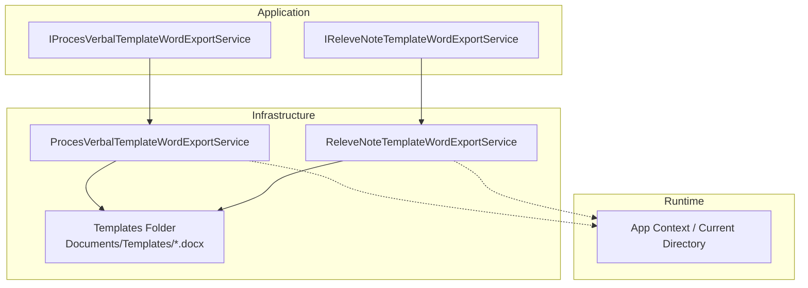
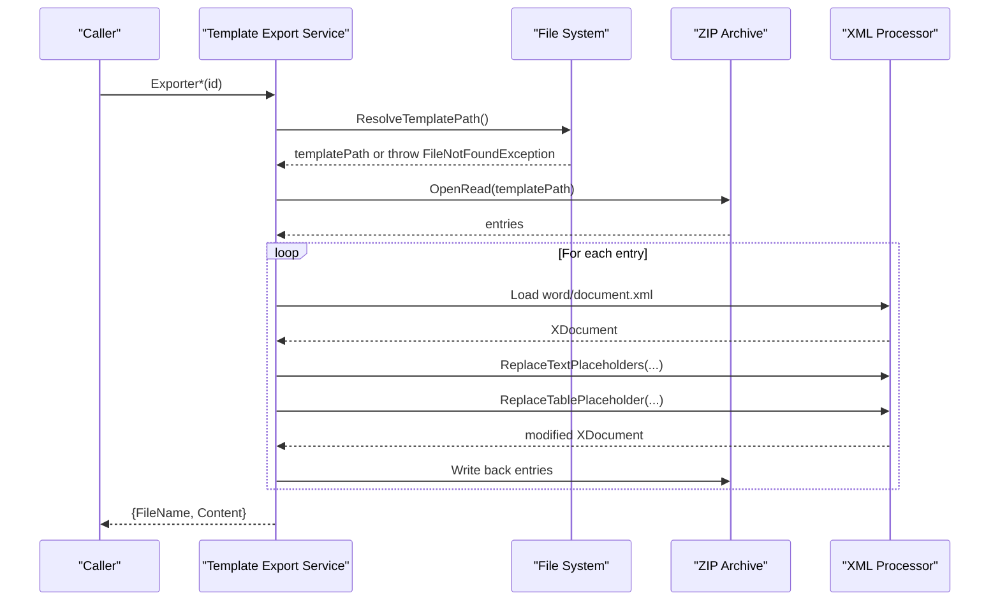
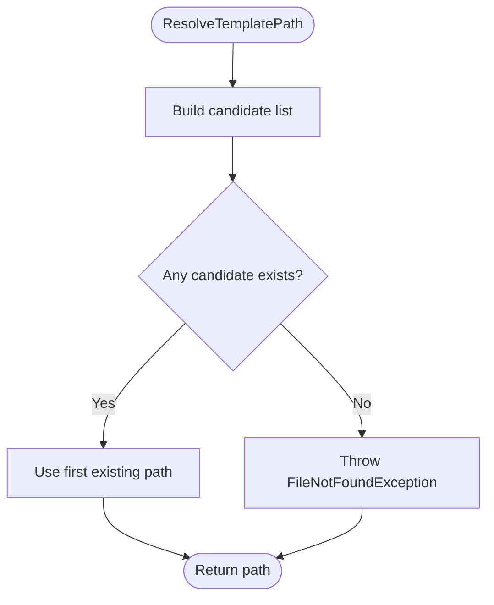
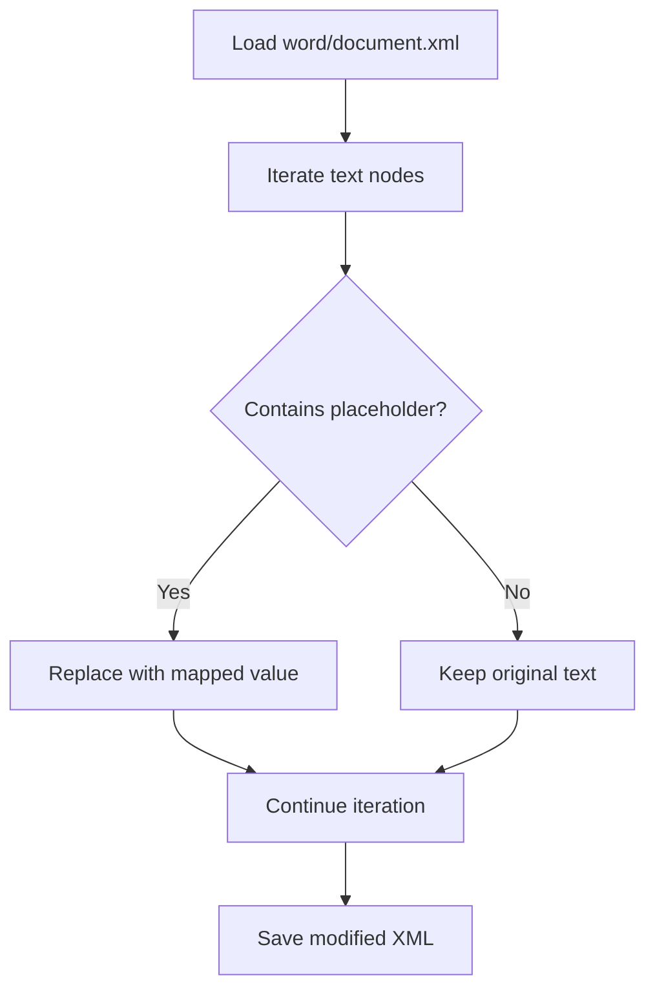
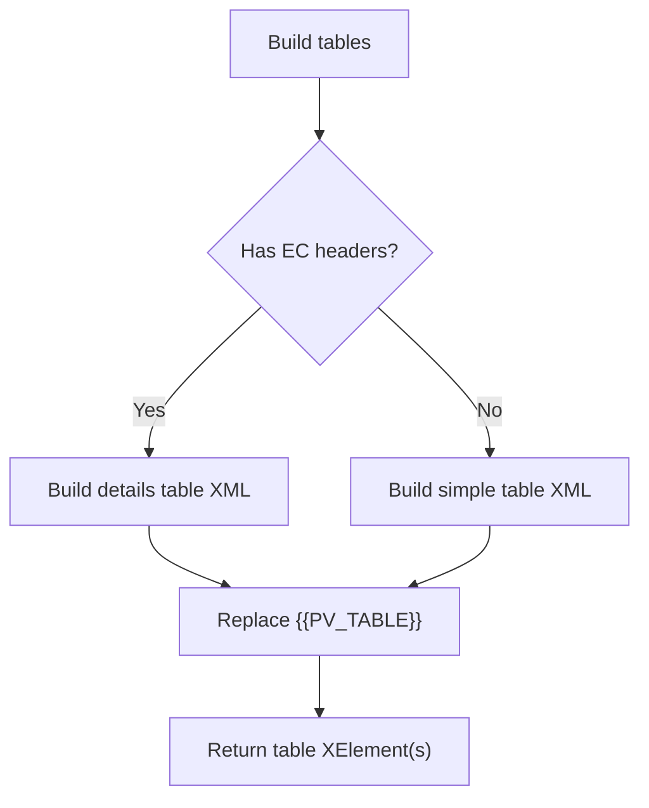
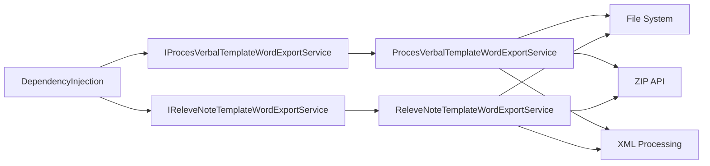

# Template Management

<cite>
**Referenced Files in This Document**
- [ProcesVerbalTemplateWordExportService.cs](file://RIIS.Academic.Infrastructure/Documents/ProcesVerbalTemplateWordExportService.cs)
- [ReleveNoteTemplateWordExportService.cs](file://RIIS.Academic.Infrastructure/Documents/ReleveNoteTemplateWordExportService.cs)
- [IProcesVerbalTemplateWordExportService.cs](file://RIIS.Academic.Application/ProcesVerbaux/Services/IProcesVerbalTemplateWordExportService.cs)
- [IReleveNoteTemplateWordExportService.cs](file://RIIS.Academic.Application/Releves/Services/IReleveNoteTemplateWordExportService.cs)
- [DependencyInjection.cs](file://RIIS.Academic.Infrastructure/DependencyInjection.cs)
- [ProcesVerbalTemplate.docx](file://RIIS.Academic.Infrastructure/Documents/Templates/ProcesVerbalTemplate.docx)
- [ReleveNoteTemplate.docx](file://RIIS.Academic.Infrastructure/Documents/Templates/ReleveNoteTemplate.docx)
</cite>

## Table of Contents
1. Introduction
2. Project Structure
3. Core Components
4. Architecture Overview
5. Detailed Component Analysis
6. Dependency Analysis
7. Performance Considerations
8. Troubleshooting Guide
9. Conclusion
10. Appendices

## Introduction
This document describes the template management system used to generate Word documents (procedural records and academic transcripts) from Word templates. It covers template file organization, naming conventions, storage locations, resolution logic, fallback mechanisms, environment-specific loading, placeholder standards, validation processes, update procedures, testing guidance, deployment strategies, backup procedures, and disaster recovery plans for template files.

## Project Structure
Templates are stored as Microsoft Word .docx files under a dedicated folder within the Infrastructure layer. The application exposes service interfaces for generating documents, implemented in the Infrastructure layer by services that load templates at runtime, replace placeholders, and return generated content.

**Diagram sources**
- [ProcesVerbalTemplateWordExportService.cs:36-86](file://RIIS.Academic.Infrastructure/Documents/ProcesVerbalTemplateWordExportService.cs#L36-L86)
- [ReleveNoteTemplateWordExportService.cs:36-86](file://RIIS.Academic.Infrastructure/Documents/ReleveNoteTemplateWordExportService.cs#L36-L86)
- [IProcesVerbalTemplateWordExportService.cs:5-10](file://RIIS.Academic.Application/ProcesVerbaux/Services/IProcesVerbalTemplateWordExportService.cs#L5-L10)
- [IReleveNoteTemplateWordExportService.cs:5-10](file://RIIS.Academic.Application/Releves/Services/IReleveNoteTemplateWordExportService.cs#L5-L10)

**Section sources**
- [ProcesVerbalTemplateWordExportService.cs:36-86](file://RIIS.Academic.Infrastructure/Documents/ProcesVerbalTemplateWordExportService.cs#L36-L86)
- [ReleveNoteTemplateWordExportService.cs:36-86](file://RIIS.Academic.Infrastructure/Documents/ReleveNoteTemplateWordExportService.cs#L36-L86)
- [DependencyInjection.cs:54-58](file://RIIS.Academic.Infrastructure/DependencyInjection.cs#L54-L58)

## Core Components
- Template storage:
  - ProcesVerbalTemplate.docx
  - ReleveNoteTemplate.docx
- Export services:
  - IProcesVerbalTemplateWordExportService with implementation ProcesVerbalTemplateWordExportService
  - IReleveNoteTemplateWordExportService with implementation ReleveNoteTemplateWordExportService
- Registration:
  - Services registered via dependency injection in the infrastructure layer

Key responsibilities:
- Resolve template path at runtime using multiple candidate locations
- Open the .docx archive, modify word/document.xml, and rebuild output
- Replace text placeholders and dynamic tables
- Return generated filename and byte content

**Section sources**
- [IProcesVerbalTemplateWordExportService.cs:5-10](file://RIIS.Academic.Application/ProcesVerbaux/Services/IProcesVerbalTemplateWordExportService.cs#L5-L10)
- [IReleveNoteTemplateWordExportService.cs:5-10](file://RIIS.Academic.Application/Releves/Services/IReleveNoteTemplateWordExportService.cs#L5-L10)
- [DependencyInjection.cs:54-58](file://RIIS.Academic.Infrastructure/DependencyInjection.cs#L54-L58)

## Architecture Overview
The template generation flow is consistent across both export services:

**Diagram sources**
- [ProcesVerbalTemplateWordExportService.cs:36-68](file://RIIS.Academic.Infrastructure/Documents/ProcesVerbalTemplateWordExportService.cs#L36-L68)
- [ReleveNoteTemplateWordExportService.cs:36-68](file://RIIS.Academic.Infrastructure/Documents/ReleveNoteTemplateWordExportService.cs#L36-L68)

## Detailed Component Analysis

### Template Resolution and Fallback Mechanism
Both services implement a multi-candidate resolution strategy to locate the template file at runtime. Candidates include:
- Application base directory paths
- Current working directory paths
- Relative paths including source layout paths

If no candidate exists, a FileNotFoundException is thrown with a clear message indicating where the template should be placed.

**Diagram sources**
- [ProcesVerbalTemplateWordExportService.cs:70-86](file://RIIS.Academic.Infrastructure/Documents/ProcesVerbalTemplateWordExportService.cs#L70-L86)
- [ReleveNoteTemplateWordExportService.cs:70-86](file://RIIS.Academic.Infrastructure/Documents/ReleveNoteTemplateWordExportService.cs#L70-L86)

**Section sources**
- [ProcesVerbalTemplateWordExportService.cs:70-86](file://RIIS.Academic.Infrastructure/Documents/ProcesVerbalTemplateWordExportService.cs#L70-L86)
- [ReleveNoteTemplateWordExportService.cs:70-86](file://RIIS.Academic.Infrastructure/Documents/ReleveNoteTemplateWordExportService.cs#L70-L86)

### Placeholder Standards and Replacement Logic
- Text placeholders use double-bracket tokens such as {{...}} embedded in the Word template’s text nodes.
- Each service defines a mapping of placeholders to values derived from domain DTOs.
- Placeholders are replaced by iterating over all text elements in the WordprocessingML document and substituting matches.

Procedural record (Proces Verbal) placeholders include items like type label, semester info, academic year, cycle, program, level, class, session, status, counts, and observation. A table placeholder {{PV_TABLE}} is required; if missing, an exception is thrown.

Transcript (Releve Note) placeholders include title, cycle, academic year, student name, matricule, birth date/place, stream, specialty, level, averages, credits, decision, mention, and edition date. A table placeholder {{RELEVE_TABLES}} is supported in either a table or paragraph context; if absent, an exception is thrown.

**Diagram sources**
- [ProcesVerbalTemplateWordExportService.cs:88-121](file://RIIS.Academic.Infrastructure/Documents/ProcesVerbalTemplateWordExportService.cs#L88-L121)
- [ReleveNoteTemplateWordExportService.cs:88-123](file://RIIS.Academic.Infrastructure/Documents/ReleveNoteTemplateWordExportService.cs#L88-L123)

**Section sources**
- [ProcesVerbalTemplateWordExportService.cs:88-121](file://RIIS.Academic.Infrastructure/Documents/ProcesVerbalTemplateWordExportService.cs#L88-L121)
- [ReleveNoteTemplateWordExportService.cs:88-123](file://RIIS.Academic.Infrastructure/Documents/ReleveNoteTemplateWordExportService.cs#L88-L123)

### Dynamic Table Generation and Placeholder Replacement
- Procedural record:
  - If element constitutif headers exist, a detailed table is built per EC with columns for scores and decisions; otherwise, a simple summary table is generated.
  - The placeholder {{PV_TABLE}} must exist; it is replaced entirely with the generated table XML.
- Transcript:
  - Per semester sections and a recap section are generated as paragraphs and tables.
  - The placeholder {{RELEVE_TABLES}} can be located in a table or paragraph; it is replaced with the generated elements.

**Diagram sources**
- [ProcesVerbalTemplateWordExportService.cs:123-147](file://RIIS.Academic.Infrastructure/Documents/ProcesVerbalTemplateWordExportService.cs#L123-L147)
- [ReleveNoteTemplateWordExportService.cs:125-178](file://RIIS.Academic.Infrastructure/Documents/ReleveNoteTemplateWordExportService.cs#L125-L178)

**Section sources**
- [ProcesVerbalTemplateWordExportService.cs:123-147](file://RIIS.Academic.Infrastructure/Documents/ProcesVerbalTemplateWordExportService.cs#L123-L147)
- [ReleveNoteTemplateWordExportService.cs:125-178](file://RIIS.Academic.Infrastructure/Documents/ReleveNoteTemplateWordExportService.cs#L125-L178)

### Environment-Specific Template Loading
There is no explicit environment-based selection of different template files. Instead, the services resolve the template path using multiple candidates based on runtime context (application base directory and current directory). This allows deployment variations to place the same-named template in different directories without code changes.

Environment configuration influences database connections but not template selection directly.

**Section sources**
- [DependencyInjection.cs:63-73](file://RIIS.Academic.Infrastructure/DependencyInjection.cs#L63-L73)
- [ProcesVerbalTemplateWordExportService.cs:70-86](file://RIIS.Academic.Infrastructure/Documents/ProcesVerbalTemplateWordExportService.cs#L70-L86)
- [ReleveNoteTemplateWordExportService.cs:70-86](file://RIIS.Academic.Infrastructure/Documents/ReleveNoteTemplateWordExportService.cs#L70-L86)

### Versioning, Validation, and Update Procedures
- Versioning:
  - Templates are identified by filename and location. There is no embedded version metadata in the services. To support versioning, maintain distinct filenames (e.g., v1, v2) and update the resolution logic or deployment to point to the desired version.
- Validation:
  - At runtime, the services validate presence of required placeholders:
    - {{PV_TABLE}} must exist in the procedural record template; otherwise, an InvalidOperationException is thrown during generation.
    - {{RELEVE_TABLES}} must exist in the transcript template; otherwise, an InvalidOperationException is thrown during generation.
  - Missing template files result in FileNotFoundException during resolution.
- Update procedures:
  - Replace the .docx files in the deployed Templates folder with updated versions.
  - Ensure all required placeholders remain present and correctly named.
  - Validate outputs by regenerating sample documents after updates.

**Section sources**
- [ProcesVerbalTemplateWordExportService.cs:123-137](file://RIIS.Academic.Infrastructure/Documents/ProcesVerbalTemplateWordExportService.cs#L123-L137)
- [ReleveNoteTemplateWordExportService.cs:125-154](file://RIIS.Academic.Infrastructure/Documents/ReleveNoteTemplateWordExportService.cs#L125-L154)

### Creating New Templates and Adding Placeholders
Guidelines:
- Place new .docx templates under Documents/Templates in the deployed runtime.
- Use descriptive filenames aligned with the service they target.
- Define placeholders using double brackets in text nodes (e.g., {{PLACEHOLDER_NAME}}).
- For dynamic tables, insert a single placeholder token ({{PV_TABLE}} or {{RELEVE_TABLES}}) in a table or paragraph as appropriate.
- Map new placeholders in the corresponding service’s replacement dictionary and ensure data availability from DTOs.
- Test thoroughly by generating sample documents with edge cases (nulls, special characters, large datasets).

**Section sources**
- [ProcesVerbalTemplateWordExportService.cs:88-121](file://RIIS.Academic.Infrastructure/Documents/ProcesVerbalTemplateWordExportService.cs#L88-L121)
- [ReleveNoteTemplateWordExportService.cs:88-123](file://RIIS.Academic.Infrastructure/Documents/ReleveNoteTemplateWordExportService.cs#L88-L123)

### Testing Template Functionality
Recommended tests:
- Unit tests for placeholder replacement:
  - Verify all expected placeholders are replaced with correct values.
  - Verify null handling produces empty strings where applicable.
- Integration tests for full document generation:
  - Generate sample documents and compare against expected outputs (structure, formatting).
- Negative tests:
  - Missing template file triggers FileNotFoundException.
  - Missing required placeholder triggers InvalidOperationException.
- Performance tests:
  - Validate generation time and memory usage with large datasets.

[No sources needed since this section provides general guidance]

## Dependency Analysis
The template services depend on:
- File system access for template resolution
- ZIP archive APIs to read/write .docx structure
- XML processing to manipulate WordprocessingML
- Application services to fetch data for population

Registration occurs in the infrastructure layer, making the services available via DI.

**Diagram sources**
- [DependencyInjection.cs:54-58](file://RIIS.Academic.Infrastructure/DependencyInjection.cs#L54-L58)
- [ProcesVerbalTemplateWordExportService.cs:36-68](file://RIIS.Academic.Infrastructure/Documents/ProcesVerbalTemplateWordExportService.cs#L36-L68)
- [ReleveNoteTemplateWordExportService.cs:36-68](file://RIIS.Academic.Infrastructure/Documents/ReleveNoteTemplateWordExportService.cs#L36-L68)

**Section sources**
- [DependencyInjection.cs:54-58](file://RIIS.Academic.Infrastructure/DependencyInjection.cs#L54-L58)

## Performance Considerations
- Template resolution checks multiple paths; minimize redundant calls by caching resolved paths if frequently used.
- ZIP operations are performed per generation; consider streaming large documents carefully to avoid high memory usage.
- XML manipulation iterates all text nodes; keep placeholder sets minimal and well-scoped.
- Avoid unnecessary recomputation of table structures; reuse computed layouts when possible.

[No sources needed since this section provides general guidance]

## Troubleshooting Guide
Common issues and resolutions:
- FileNotFoundException:
  - Cause: Template file not found in any candidate path.
  - Action: Ensure the correct .docx is deployed to one of the expected locations under Documents/Templates relative to the app base or current directory.
- InvalidOperationException for missing placeholder:
  - Cause: Required placeholder token not present in the template.
  - Action: Add the required placeholder token exactly as specified in the service expectations.
- Incorrect output formatting:
  - Cause: Changes to WordprocessingML structure or styles.
  - Action: Validate template structure and regenerate samples; verify column widths and styles.

**Section sources**
- [ProcesVerbalTemplateWordExportService.cs:70-86](file://RIIS.Academic.Infrastructure/Documents/ProcesVerbalTemplateWordExportService.cs#L70-L86)
- [ProcesVerbalTemplateWordExportService.cs:123-137](file://RIIS.Academic.Infrastructure/Documents/ProcesVerbalTemplateWordExportService.cs#L123-L137)
- [ReleveNoteTemplateWordExportService.cs:70-86](file://RIIS.Academic.Infrastructure/Documents/ReleveNoteTemplateWordExportService.cs#L70-L86)
- [ReleveNoteTemplateWordExportService.cs:125-154](file://RIIS.Academic.Infrastructure/Documents/ReleveNoteTemplateWordExportService.cs#L125-L154)

## Conclusion
The template management system uses robust runtime resolution and strict placeholder validation to generate accurate Word documents. By following the guidelines for template organization, placeholder standards, and update procedures, teams can safely evolve templates while maintaining reliability. Deployment should ensure templates are consistently available in the expected locations, and operational practices should include backups and disaster recovery planning for these critical assets.

[No sources needed since this section summarizes without analyzing specific files]

## Appendices

### Template Files and Locations
- Procedural record template:
  - Name: ProcesVerbalTemplate.docx
  - Location: Documents/Templates (deployed runtime)
- Transcript template:
  - Name: ReleveNoteTemplate.docx
  - Location: Documents/Templates (deployed runtime)

**Section sources**
- [ProcesVerbalTemplateWordExportService.cs:70-86](file://RIIS.Academic.Infrastructure/Documents/ProcesVerbalTemplateWordExportService.cs#L70-L86)
- [ReleveNoteTemplateWordExportService.cs:70-86](file://RIIS.Academic.Infrastructure/Documents/ReleveNoteTemplateWordExportService.cs#L70-L86)

### Deployment Strategies
- Copy templates into the deployed application’s Documents/Templates directory so they are discoverable by the resolution logic.
- Prefer placing templates next to the executable or in a known relative path to simplify deployment scripts.
- Use environment-specific deployment configurations to manage which template versions are active.

[No sources needed since this section provides general guidance]

### Backup Procedures
- Regularly back up the Templates folder as part of application artifacts.
- Include template checksums or version tags in backups to detect drift.
- Store backups in a separate repository or artifact store linked to application releases.

[No sources needed since this section provides general guidance]

### Disaster Recovery Plan
- Maintain a canonical copy of approved templates in version control.
- In case of corruption or loss, restore from the latest tagged version.
- After restoration, run smoke tests to validate template functionality by generating sample documents.

[No sources needed since this section provides general guidance]