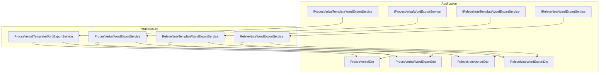
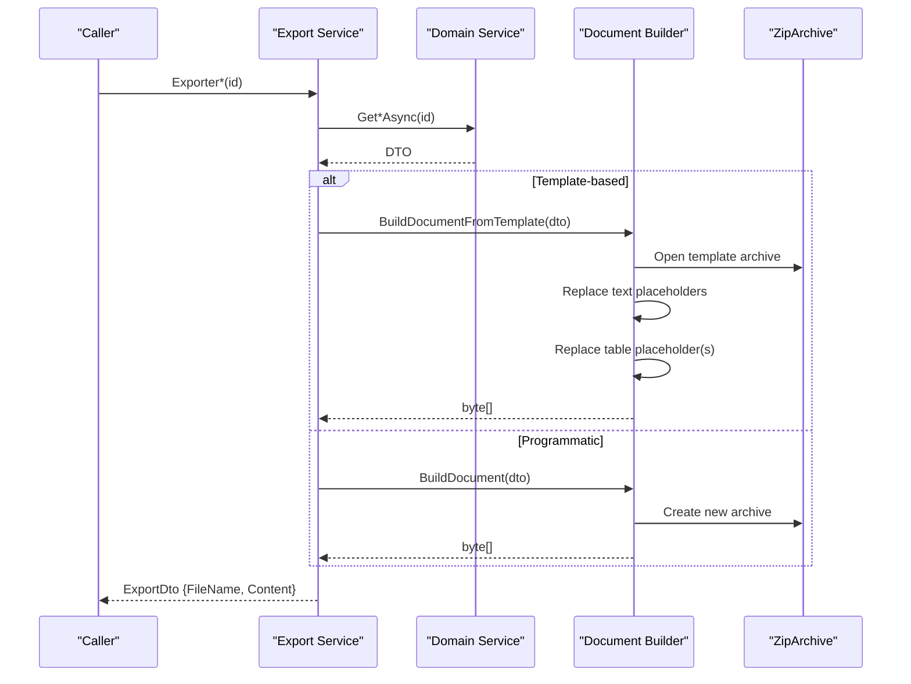
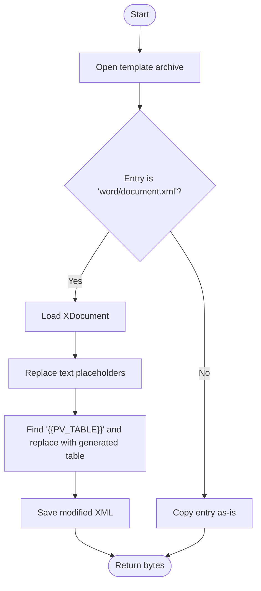
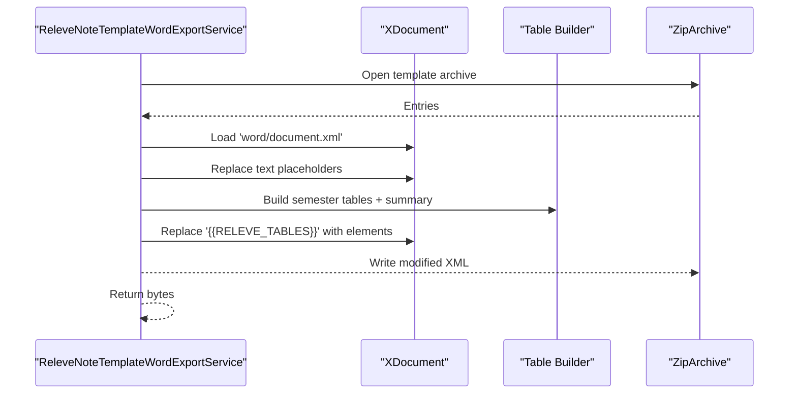
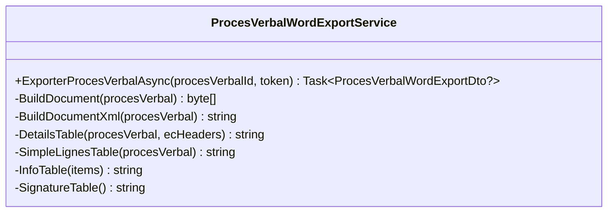
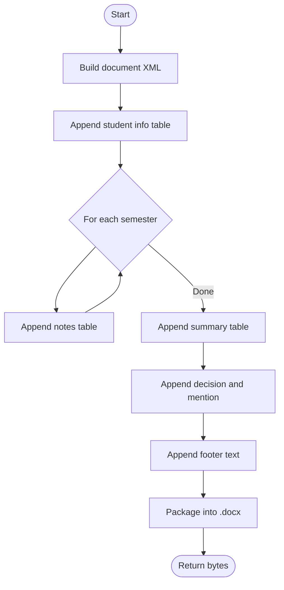
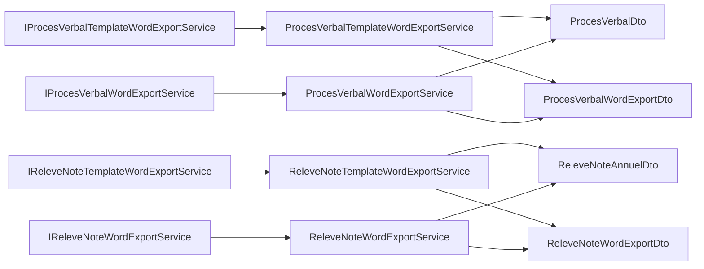

# Word Document Generation

<cite>
**Referenced Files in This Document**
- [ProcesVerbalTemplateWordExportService.cs](file://RIIS.Academic.Infrastructure/Documents/ProcesVerbalTemplateWordExportService.cs)
- [ReleveNoteTemplateWordExportService.cs](file://RIIS.Academic.Infrastructure/Documents/ReleveNoteTemplateWordExportService.cs)
- [ProcesVerbalWordExportService.cs](file://RIIS.Academic.Infrastructure/Documents/ProcesVerbalWordExportService.cs)
- [ReleveNoteWordExportService.cs](file://RIIS.Academic.Infrastructure/Documents/ReleveNoteWordExportService.cs)
- [IProcesVerbalTemplateWordExportService.cs](file://RIIS.Academic.Application/ProcesVerbaux/Services/IProcesVerbalTemplateWordExportService.cs)
- [IProcesVerbalWordExportService.cs](file://RIIS.Academic.Application/ProcesVerbaux/Services/IProcesVerbalWordExportService.cs)
- [IReleveNoteTemplateWordExportService.cs](file://RIIS.Academic.Application/Releves/Services/IReleveNoteTemplateWordExportService.cs)
- [IReleveNoteWordExportService.cs](file://RIIS.Academic.Application/Releves/Services/IReleveNoteWordExportService.cs)
- [ProcesVerbalDto.cs](file://RIIS.Academic.Application/ProcesVerbaux/Dtos/ProcesVerbalDto.cs)
- [ReleveNoteAnnuelDto.cs](file://RIIS.Academic.Application/Releves/Dtos/ReleveNoteAnnuelDto.cs)
- [ProcesVerbalWordExportDto.cs](file://RIIS.Academic.Application/ProcesVerbaux/Dtos/ProcesVerbalWordExportDto.cs)
- [ReleveNoteWordExportDto.cs](file://RIIS.Academic.Application/Releves/Dtos/ReleveNoteWordExportDto.cs)
</cite>

## Table of Contents
1. Introduction
2. Project Structure
3. Core Components
4. Architecture Overview
5. Detailed Component Analysis
6. Dependency Analysis
7. Performance Considerations
8. Troubleshooting Guide
9. Conclusion

## Introduction
This document explains the Word document generation services that produce academic records (minutes and transcripts) using OpenXML-based techniques. It covers two approaches:
- Template-based generation: loads a .docx template, replaces placeholders, and injects dynamic tables while preserving styles.
- Programmatic generation: builds a complete .docx from scratch with inline styles and layout.

The system supports placeholder syntax like {{PLACEHOLDER}} for text substitution and table placeholders like {{PV_TABLE}} or {{RELEVE_TABLES}} for dynamic content injection. It also demonstrates complex table generation with conditional formatting, header rows, merged cells, and dynamic columns based on data.

## Project Structure
The implementation is split across Application interfaces and Infrastructure implementations:
- Application layer defines service contracts and DTOs used by exports.
- Infrastructure layer implements template-driven and programmatic document builders.

**Diagram sources**
- [IProcesVerbalTemplateWordExportService.cs:5-10](file://RIIS.Academic.Application/ProcesVerbaux/Services/IProcesVerbalTemplateWordExportService.cs#L5-L10)
- [IProcesVerbalWordExportService.cs:5-10](file://RIIS.Academic.Application/ProcesVerbaux/Services/IProcesVerbalWordExportService.cs#L5-L10)
- [IReleveNoteTemplateWordExportService.cs:5-10](file://RIIS.Academic.Application/Releves/Services/IReleveNoteTemplateWordExportService.cs#L5-L10)
- [IReleveNoteWordExportService.cs:5-10](file://RIIS.Academic.Application/Releves/Services/IReleveNoteWordExportService.cs#L5-L10)
- [ProcesVerbalTemplateWordExportService.cs:11-34](file://RIIS.Academic.Infrastructure/Documents/ProcesVerbalTemplateWordExportService.cs#L11-L34)
- [ReleveNoteTemplateWordExportService.cs:11-34](file://RIIS.Academic.Infrastructure/Documents/ReleveNoteTemplateWordExportService.cs#L11-L34)
- [ProcesVerbalWordExportService.cs:10-45](file://RIIS.Academic.Infrastructure/Documents/ProcesVerbalWordExportService.cs#L10-L45)
- [ReleveNoteWordExportService.cs:10-43](file://RIIS.Academic.Infrastructure/Documents/ReleveNoteWordExportService.cs#L10-L43)
- [ProcesVerbalDto.cs:5-40](file://RIIS.Academic.Application/ProcesVerbaux/Dtos/ProcesVerbalDto.cs#L5-L40)
- [ReleveNoteAnnuelDto.cs:3-25](file://RIIS.Academic.Application/Releves/Dtos/ReleveNoteAnnuelDto.cs#L3-L25)
- [ProcesVerbalWordExportDto.cs:3-8](file://RIIS.Academic.Application/ProcesVerbaux/Dtos/ProcesVerbalWordExportDto.cs#L3-L8)
- [ReleveNoteWordExportDto.cs:3-8](file://RIIS.Academic.Application/Releves/Dtos/ReleveNoteWordExportDto.cs#L3-L8)

**Section sources**
- [ProcesVerbalTemplateWordExportService.cs:11-34](file://RIIS.Academic.Infrastructure/Documents/ProcesVerbalTemplateWordExportService.cs#L11-L34)
- [ReleveNoteTemplateWordExportService.cs:11-34](file://RIIS.Academic.Infrastructure/Documents/ReleveNoteTemplateWordExportService.cs#L11-L34)
- [ProcesVerbalWordExportService.cs:10-45](file://RIIS.Academic.Infrastructure/Documents/ProcesVerbalWordExportService.cs#L10-L45)
- [ReleveNoteWordExportService.cs:10-43](file://RIIS.Academic.Infrastructure/Documents/ReleveNoteWordExportService.cs#L10-L43)

## Core Components
- Template-based exporters:
  - ProcesVerbalTemplateWordExportService: Loads a Word template, replaces text placeholders, and substitutes a table placeholder with a dynamically built table.
  - ReleveNoteTemplateWordExportService: Loads a transcript template, replaces text placeholders, and injects multiple tables and paragraphs for semesters and summaries.
- Programmatic exporters:
  - ProcesVerbalWordExportService: Builds a full Word document from scratch with embedded styles and sections.
  - ReleveNoteWordExportService: Builds a full transcript document from scratch with headers, tables, and summary sections.

Key responsibilities:
- Placeholder replacement: Text tokens like {{PLACEHOLDER}} are replaced with values from DTOs.
- Dynamic table generation: Tables are constructed via XML strings and inserted into the document.
- Styling preservation: Template approach preserves existing styles; programmatic approach defines inline styles.
- File naming and slugification: Produces safe file names from business data.

**Section sources**
- [ProcesVerbalTemplateWordExportService.cs:36-68](file://RIIS.Academic.Infrastructure/Documents/ProcesVerbalTemplateWordExportService.cs#L36-L68)
- [ReleveNoteTemplateWordExportService.cs:36-68](file://RIIS.Academic.Infrastructure/Documents/ReleveNoteTemplateWordExportService.cs#L36-L68)
- [ProcesVerbalWordExportService.cs:32-89](file://RIIS.Academic.Infrastructure/Documents/ProcesVerbalWordExportService.cs#L32-L89)
- [ReleveNoteWordExportService.cs:30-93](file://RIIS.Academic.Infrastructure/Documents/ReleveNoteWordExportService.cs#L30-L93)

## Architecture Overview
The export pipeline follows a consistent pattern:
- Resolve input data via application services.
- Choose template-based or programmatic builder.
- For templates: open archive, process only word/document.xml, replace placeholders, write back to output archive.
- For programmatic: assemble XML parts and package them into a .docx archive.

**Diagram sources**
- [ProcesVerbalTemplateWordExportService.cs:16-68](file://RIIS.Academic.Infrastructure/Documents/ProcesVerbalTemplateWordExportService.cs#L16-L68)
- [ReleveNoteTemplateWordExportService.cs:16-68](file://RIIS.Academic.Infrastructure/Documents/ReleveNoteTemplateWordExportService.cs#L16-L68)
- [ProcesVerbalWordExportService.cs:12-45](file://RIIS.Academic.Infrastructure/Documents/ProcesVerbalWordExportService.cs#L12-L45)
- [ReleveNoteWordExportService.cs:12-43](file://RIIS.Academic.Infrastructure/Documents/ReleveNoteWordExportService.cs#L12-L43)

## Detailed Component Analysis

### Template-Based Process Verbal Export
- Workflow:
  - Load template archive and stream entries.
  - For word/document.xml: load as XDocument, replace text placeholders, then replace a table placeholder with a generated table.
  - Save modified XML and copy other entries unchanged.
- Placeholder syntax:
  - Text: {{PV_TYPE}}, {{SEMESTRE_LIBELLE}}, {{ANNEE_ACADEMIQUE}}, etc.
  - Table: {{PV_TABLE}} placeholder table is replaced with a dynamic table.
- Dynamic table:
  - Supports dynamic columns per element constitutif (EC).
  - Header rows with styling and grid spanning.
  - Conditional cell colors for grades.
- Error handling:
  - Throws if template not found.
  - Throws if table placeholder is missing.

**Diagram sources**
- [ProcesVerbalTemplateWordExportService.cs:36-68](file://RIIS.Academic.Infrastructure/Documents/ProcesVerbalTemplateWordExportService.cs#L36-L68)
- [ProcesVerbalTemplateWordExportService.cs:88-137](file://RIIS.Academic.Infrastructure/Documents/ProcesVerbalTemplateWordExportService.cs#L88-L137)
- [ProcesVerbalTemplateWordExportService.cs:139-228](file://RIIS.Academic.Infrastructure/Documents/ProcesVerbalTemplateWordExportService.cs#L139-L228)

**Section sources**
- [ProcesVerbalTemplateWordExportService.cs:70-86](file://RIIS.Academic.Infrastructure/Documents/ProcesVerbalTemplateWordExportService.cs#L70-L86)
- [ProcesVerbalTemplateWordExportService.cs:88-137](file://RIIS.Academic.Infrastructure/Documents/ProcesVerbalTemplateWordExportService.cs#L88-L137)
- [ProcesVerbalTemplateWordExportService.cs:139-228](file://RIIS.Academic.Infrastructure/Documents/ProcesVerbalTemplateWordExportService.cs#L139-L228)
- [ProcesVerbalTemplateWordExportService.cs:284-375](file://RIIS.Academic.Infrastructure/Documents/ProcesVerbalTemplateWordExportService.cs#L284-L375)
- [ProcesVerbalTemplateWordExportService.cs:406-469](file://RIIS.Academic.Infrastructure/Documents/ProcesVerbalTemplateWordExportService.cs#L406-L469)

### Template-Based Transcript Export
- Workflow:
  - Load template archive and process word/document.xml.
  - Replace text placeholders with student and academic info.
  - Replace table or paragraph placeholder {{RELEVE_TABLES}} with a list of generated elements (paragraphs and tables).
- Dynamic content:
  - Per semester: notes table with grouped UE rows and vertical merges.
  - Summary table with annual totals and decisions.
- Error handling:
  - Throws if placeholder not found.

**Diagram sources**
- [ReleveNoteTemplateWordExportService.cs:36-68](file://RIIS.Academic.Infrastructure/Documents/ReleveNoteTemplateWordExportService.cs#L36-L68)
- [ReleveNoteTemplateWordExportService.cs:88-154](file://RIIS.Academic.Infrastructure/Documents/ReleveNoteTemplateWordExportService.cs#L88-L154)
- [ReleveNoteTemplateWordExportService.cs:156-286](file://RIIS.Academic.Infrastructure/Documents/ReleveNoteTemplateWordExportService.cs#L156-L286)

**Section sources**
- [ReleveNoteTemplateWordExportService.cs:70-86](file://RIIS.Academic.Infrastructure/Documents/ReleveNoteTemplateWordExportService.cs#L70-L86)
- [ReleveNoteTemplateWordExportService.cs:88-154](file://RIIS.Academic.Infrastructure/Documents/ReleveNoteTemplateWordExportService.cs#L88-L154)
- [ReleveNoteTemplateWordExportService.cs:156-286](file://RIIS.Academic.Infrastructure/Documents/ReleveNoteTemplateWordExportService.cs#L156-L286)
- [ReleveNoteTemplateWordExportService.cs:288-424](file://RIIS.Academic.Infrastructure/Documents/ReleveNoteTemplateWordExportService.cs#L288-L424)

### Programmatic Process Verbal Export
- Builds a complete .docx without a template:
  - Creates minimal required parts: content types, relationships, styles, and document XML.
  - Assembles body with titles, info table, detail table, and signature area.
  - Uses fixed page size and margins suitable for landscape printing.
- Dynamic table:
  - Generates EC-based columns and header rows.
  - Applies shading and text color conditionally for grades.

**Diagram sources**
- [ProcesVerbalWordExportService.cs:10-89](file://RIIS.Academic.Infrastructure/Documents/ProcesVerbalWordExportService.cs#L10-L89)
- [ProcesVerbalWordExportService.cs:91-165](file://RIIS.Academic.Infrastructure/Documents/ProcesVerbalWordExportService.cs#L91-L165)
- [ProcesVerbalWordExportService.cs:167-240](file://RIIS.Academic.Infrastructure/Documents/ProcesVerbalWordExportService.cs#L167-L240)

**Section sources**
- [ProcesVerbalWordExportService.cs:32-89](file://RIIS.Academic.Infrastructure/Documents/ProcesVerbalWordExportService.cs#L32-L89)
- [ProcesVerbalWordExportService.cs:91-165](file://RIIS.Academic.Infrastructure/Documents/ProcesVerbalWordExportService.cs#L91-L165)
- [ProcesVerbalWordExportService.cs:167-240](file://RIIS.Academic.Infrastructure/Documents/ProcesVerbalWordExportService.cs#L167-L240)
- [ProcesVerbalWordExportService.cs:263-389](file://RIIS.Academic.Infrastructure/Documents/ProcesVerbalWordExportService.cs#L263-L389)
- [ProcesVerbalWordExportService.cs:470-511](file://RIIS.Academic.Infrastructure/Documents/ProcesVerbalWordExportService.cs#L470-L511)

### Programmatic Transcript Export
- Builds a complete .docx without a template:
  - Adds header lines, student info table, semester notes tables, summary table, decision line, and footer text.
  - Uses portrait page size and standard margins.
- Dynamic content:
  - Groups UE rows with vertical merge for first row per group.
  - Totals and averages per semester.

**Diagram sources**
- [ReleveNoteWordExportService.cs:30-93](file://RIIS.Academic.Infrastructure/Documents/ReleveNoteWordExportService.cs#L30-L93)
- [ReleveNoteWordExportService.cs:95-190](file://RIIS.Academic.Infrastructure/Documents/ReleveNoteWordExportService.cs#L95-L190)
- [ReleveNoteWordExportService.cs:211-321](file://RIIS.Academic.Infrastructure/Documents/ReleveNoteWordExportService.cs#L211-L321)
- [ReleveNoteWordExportService.cs:362-403](file://RIIS.Academic.Infrastructure/Documents/ReleveNoteWordExportService.cs#L362-L403)

**Section sources**
- [ReleveNoteWordExportService.cs:30-93](file://RIIS.Academic.Infrastructure/Documents/ReleveNoteWordExportService.cs#L30-L93)
- [ReleveNoteWordExportService.cs:95-190](file://RIIS.Academic.Infrastructure/Documents/ReleveNoteWordExportService.cs#L95-L190)
- [ReleveNoteWordExportService.cs:211-321](file://RIIS.Academic.Infrastructure/Documents/ReleveNoteWordExportService.cs#L211-L321)
- [ReleveNoteWordExportService.cs:362-403](file://RIIS.Academic.Infrastructure/Documents/ReleveNoteWordExportService.cs#L362-L403)

## Dependency Analysis
- Interfaces define stable contracts for template and programmatic exports.
- Implementations depend on:
  - Domain/application DTOs for data binding.
  - System.IO.Compression for packaging .docx archives.
  - System.Xml.Linq for XML manipulation in template processing.
- Coupling:
  - Template services couple to specific template files and placeholder tokens.
  - Programmatic services encapsulate all style and layout logic internally.

**Diagram sources**
- [IProcesVerbalTemplateWordExportService.cs:5-10](file://RIIS.Academic.Application/ProcesVerbaux/Services/IProcesVerbalTemplateWordExportService.cs#L5-L10)
- [IProcesVerbalWordExportService.cs:5-10](file://RIIS.Academic.Application/ProcesVerbaux/Services/IProcesVerbalWordExportService.cs#L5-L10)
- [IReleveNoteTemplateWordExportService.cs:5-10](file://RIIS.Academic.Application/Releves/Services/IReleveNoteTemplateWordExportService.cs#L5-L10)
- [IReleveNoteWordExportService.cs:5-10](file://RIIS.Academic.Application/Releves/Services/IReleveNoteWordExportService.cs#L5-L10)
- [ProcesVerbalDto.cs:5-40](file://RIIS.Academic.Application/ProcesVerbaux/Dtos/ProcesVerbalDto.cs#L5-L40)
- [ReleveNoteAnnuelDto.cs:3-25](file://RIIS.Academic.Application/Releves/Dtos/ReleveNoteAnnuelDto.cs#L3-L25)
- [ProcesVerbalWordExportDto.cs:3-8](file://RIIS.Academic.Application/ProcesVerbaux/Dtos/ProcesVerbalWordExportDto.cs#L3-L8)
- [ReleveNoteWordExportDto.cs:3-8](file://RIIS.Academic.Application/Releves/Dtos/ReleveNoteWordExportDto.cs#L3-L8)

**Section sources**
- [ProcesVerbalTemplateWordExportService.cs:11-34](file://RIIS.Academic.Infrastructure/Documents/ProcesVerbalTemplateWordExportService.cs#L11-L34)
- [ReleveNoteTemplateWordExportService.cs:11-34](file://RIIS.Academic.Infrastructure/Documents/ReleveNoteTemplateWordExportService.cs#L11-L34)
- [ProcesVerbalWordExportService.cs:10-45](file://RIIS.Academic.Infrastructure/Documents/ProcesVerbalWordExportService.cs#L10-L45)
- [ReleveNoteWordExportService.cs:10-43](file://RIIS.Academic.Infrastructure/Documents/ReleveNoteWordExportService.cs#L10-L43)

## Performance Considerations
- Streaming and memory:
  - Template processing streams entries and writes directly to an output MemoryStream, minimizing disk I/O and keeping memory bounded.
  - Programmatic building constructs XML strings incrementally and packages them into a single archive.
- Compression:
  - All entries are created with optimal compression to reduce output size.
- XML operations:
  - Template processing uses XDocument.Load with whitespace preservation and targeted Descendants traversal for efficient placeholder replacement.
- Large documents:
  - Prefer programmatic generation when avoiding template parsing overhead.
  - Avoid loading entire templates into memory repeatedly; reuse streams where possible.
- Formatting:
  - Disable formatting when saving modified XML to keep output compact.

[No sources needed since this section provides general guidance]

## Troubleshooting Guide
Common issues and resolutions:
- Missing template file:
  - The service searches several locations and throws a file-not-found error if none exist. Ensure the template is deployed to one of the expected paths.
- Missing placeholder:
  - If a required placeholder (e.g., {{PV_TABLE}} or {{RELEVE_TABLES}}) is absent, an invalid operation exception is thrown. Verify the template contains the exact placeholder token.
- Incorrect placeholder location:
  - Some services accept placeholders inside either a table or paragraph; ensure your template matches the expected structure.
- Encoding and escaping:
  - Text is escaped before insertion to prevent malformed XML. If special characters appear incorrectly, verify the source data and escaping behavior.

**Section sources**
- [ProcesVerbalTemplateWordExportService.cs:70-86](file://RIIS.Academic.Infrastructure/Documents/ProcesVerbalTemplateWordExportService.cs#L70-L86)
- [ProcesVerbalTemplateWordExportService.cs:123-137](file://RIIS.Academic.Infrastructure/Documents/ProcesVerbalTemplateWordExportService.cs#L123-L137)
- [ReleveNoteTemplateWordExportService.cs:70-86](file://RIIS.Academic.Infrastructure/Documents/ReleveNoteTemplateWordExportService.cs#L70-L86)
- [ReleveNoteTemplateWordExportService.cs:125-154](file://RIIS.Academic.Infrastructure/Documents/ReleveNoteTemplateWordExportService.cs#L125-L154)

## Conclusion
The system provides robust Word document generation through both template-based and programmatic approaches. Template-based generation preserves design and enables rapid updates via Word templates, while programmatic generation offers full control over layout and styling. Both support dynamic content, conditional formatting, and structured tables. Proper error handling and performance-conscious streaming ensure reliable operation even for large datasets.

[No sources needed since this section summarizes without analyzing specific files]