# Infrastructure Layer

<cite>
**Referenced Files in This Document**
- [DependencyInjection.cs](file://RIIS.Academic.Infrastructure/DependencyInjection.cs)
- [RiisAcademicDbContext.cs](file://RIIS.Academic.Infrastructure/Persistence/RiisAcademicDbContext.cs)
- [EfRepository.cs](file://RIIS.Academic.Infrastructure/Persistence/Repositories/EfRepository.cs)
- [DatabaseInitializer.cs](file://RIIS.Academic.Infrastructure/Persistence/DatabaseInitializer.cs)
- [ParcoursAcademiqueSeeder.cs](file://RIIS.Academic.Infrastructure/Persistence/Seeders/ParcoursAcademiqueSeeder.cs)
- [20260814000042_InitialCreate.cs](file://RIIS.Academic.Infrastructure/Persistence/Migrations/20260814000042_InitialCreate.cs)
- [EtudiantConfiguration.cs](file://RIIS.Academic.Infrastructure/Persistence/Configurations/Etudiants/EtudiantConfiguration.cs)
- [AnneeAcademiqueConfiguration.cs](file://RIIS.Academic.Infrastructure/Persistence/Configurations/Referentiels/AnneeAcademiqueConfiguration.cs)
- [ProcesVerbalTemplateWordExportService.cs](file://RIIS.Academic.Infrastructure/Documents/ProcesVerbalTemplateWordExportService.cs)
- [ProcesVerbalExcelExportService.cs](file://RIIS.Academic.Infrastructure/Documents/ProcesVerbalExcelExportService.cs)
- [ReleveNoteTemplateWordExportService.cs](file://RIIS.Academic.Infrastructure/Documents/ReleveNoteTemplateWordExportService.cs)
- [RIIS.Academic.Infrastructure.csproj](file://RIIS.Academic.Infrastructure/RIIS.Academic.Infrastructure.csproj)
- [appsettings.json (Web)](file://RIIS.Academic.Web/appsettings.json)
- [appsettings.json (Api)](file://RIIS.Academic.Api/appsettings.json)
</cite>

## Table of Contents
1. Introduction
2. Project Structure
3. Core Components
4. Architecture Overview
5. Detailed Component Analysis
6. Dependency Analysis
7. Performance Considerations
8. Troubleshooting Guide
9. Conclusion

## Introduction
This document explains the Infrastructure Layer implementation for an academic management system built with Clean Architecture. It covers Entity Framework Core configuration, database context setup, repository pattern, migrations and seeding, template-based document generation for Word and Excel exports, file handling, export workflows, configuration and environment-specific settings, performance considerations, caching strategies, and error handling patterns.

## Project Structure
The Infrastructure Layer is organized into:
- Persistence: DbContext, EF configurations, repositories, migrations, seeders, and database initialization
- Documents: Template-based Word and Excel export services that generate official documents from domain data
- Dependency Injection: Centralized registration of services, DbContext, and repositories

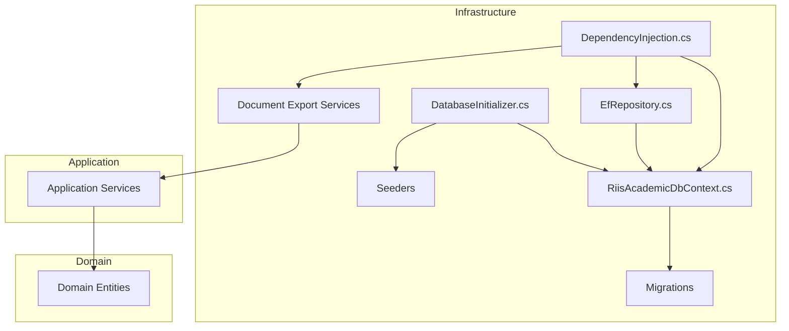

**Diagram sources**
- [DependencyInjection.cs:23-60](file://RIIS.Academic.Infrastructure/DependencyInjection.cs#L23-L60)
- [RiisAcademicDbContext.cs:6-49](file://RIIS.Academic.Infrastructure/Persistence/RiisAcademicDbContext.cs#L6-L49)
- [EfRepository.cs:6-32](file://RIIS.Academic.Infrastructure/Persistence/Repositories/EfRepository.cs#L6-L32)
- [DatabaseInitializer.cs:6-21](file://RIIS.Academic.Infrastructure/Persistence/DatabaseInitializer.cs#L6-L21)
- [ParcoursAcademiqueSeeder.cs:51-118](file://RIIS.Academic.Infrastructure/Persistence/Seeders/ParcoursAcademiqueSeeder.cs#L51-L118)
- [ProcesVerbalTemplateWordExportService.cs:11-33](file://RIIS.Academic.Infrastructure/Documents/ProcesVerbalTemplateWordExportService.cs#L11-L33)
- [ProcesVerbalExcelExportService.cs:10-31](file://RIIS.Academic.Infrastructure/Documents/ProcesVerbalExcelExportService.cs#L10-L31)
- [ReleveNoteTemplateWordExportService.cs:11-33](file://RIIS.Academic.Infrastructure/Documents/ReleveNoteTemplateWordExportService.cs#L11-L33)

**Section sources**
- [DependencyInjection.cs:23-60](file://RIIS.Academic.Infrastructure/DependencyInjection.cs#L23-L60)
- [RiisAcademicDbContext.cs:6-49](file://RIIS.Academic.Infrastructure/Persistence/RiisAcademicDbContext.cs#L6-L49)
- [RIIS.Academic.Infrastructure.csproj:24-31](file://RIIS.Academic.Infrastructure/RIIS.Academic.Infrastructure.csproj#L24-L31)

## Core Components
- DbContext and model mapping: Declares all entity sets and applies configuration via assembly scanning.
- Repository pattern: Generic repository over EF Core with read-only tracking for lists and standard CRUD operations.
- Dependency injection: Registers DbContext, repositories, application services, and document export services; selects connection string by environment.
- Database initialization: Applies migrations and seeds reference data on startup.
- Document exports: Template-driven Word and Excel generators producing official documents from domain DTOs.

Key responsibilities:
- Data access abstraction via EfRepository
- Environment-aware connection selection
- Migration and seeding pipeline
- High-quality document generation without third-party libraries by writing OpenXML directly

**Section sources**
- [RiisAcademicDbContext.cs:6-49](file://RIIS.Academic.Infrastructure/Persistence/RiisAcademicDbContext.cs#L6-L49)
- [EfRepository.cs:6-32](file://RIIS.Academic.Infrastructure/Persistence/Repositories/EfRepository.cs#L6-L32)
- [DependencyInjection.cs:23-73](file://RIIS.Academic.Infrastructure/DependencyInjection.cs#L23-L73)
- [DatabaseInitializer.cs:6-21](file://RIIS.Academic.Infrastructure/Persistence/DatabaseInitializer.cs#L6-L21)
- [ProcesVerbalTemplateWordExportService.cs:11-33](file://RIIS.Academic.Infrastructure/Documents/ProcesVerbalTemplateWordExportService.cs#L11-L33)
- [ProcesVerbalExcelExportService.cs:10-31](file://RIIS.Academic.Infrastructure/Documents/ProcesVerbalExcelExportService.cs#L10-L31)
- [ReleveNoteTemplateWordExportService.cs:11-33](file://RIIS.Academic.Infrastructure/Documents/ReleveNoteTemplateWordExportService.cs#L11-L33)

## Architecture Overview
The Infrastructure Layer wires EF Core to SQL Server, exposes a generic repository, and provides template-based document generation services. The DbContext centralizes entity mappings and delegates configuration to EF Fluent APIs. Migrations define schema evolution, while seeders populate reference data. Document services consume Application services to build Word/Excel outputs using OpenXML.

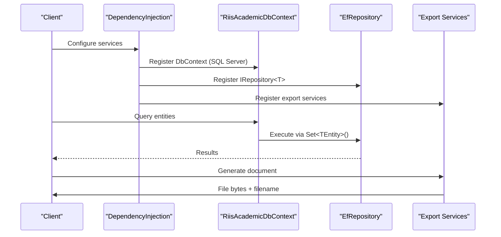

**Diagram sources**
- [DependencyInjection.cs:23-60](file://RIIS.Academic.Infrastructure/DependencyInjection.cs#L23-L60)
- [RiisAcademicDbContext.cs:6-49](file://RIIS.Academic.Infrastructure/Persistence/RiisAcademicDbContext.cs#L6-L49)
- [EfRepository.cs:6-32](file://RIIS.Academic.Infrastructure/Persistence/Repositories/EfRepository.cs#L6-L32)
- [ProcesVerbalTemplateWordExportService.cs:11-33](file://RIIS.Academic.Infrastructure/Documents/ProcesVerbalTemplateWordExportService.cs#L11-L33)
- [ProcesVerbalExcelExportService.cs:10-31](file://RIIS.Academic.Infrastructure/Documents/ProcesVerbalExcelExportService.cs#L10-L31)
- [ReleveNoteTemplateWordExportService.cs:11-33](file://RIIS.Academic.Infrastructure/Documents/ReleveNoteTemplateWordExportService.cs#L11-L33)

## Detailed Component Analysis

### Entity Framework Core Configuration and Context
- DbContext declares DbSets for all domain entities and applies configurations from the same assembly.
- OnModelCreating uses assembly scanning to discover IEntityTypeConfiguration implementations under Configurations.
- Connection string selection is environment-driven: dev uses one named connection; other environments use another.

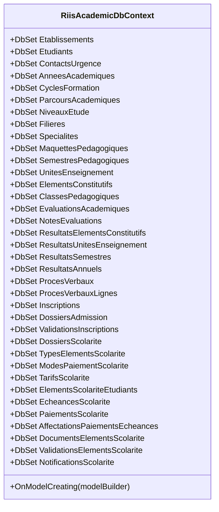

**Diagram sources**
- [RiisAcademicDbContext.cs:6-49](file://RIIS.Academic.Infrastructure/Persistence/RiisAcademicDbContext.cs#L6-L49)

**Section sources**
- [RiisAcademicDbContext.cs:6-49](file://RIIS.Academic.Infrastructure/Persistence/RiisAcademicDbContext.cs#L6-L49)
- [DependencyInjection.cs:29-34](file://RIIS.Academic.Infrastructure/DependencyInjection.cs#L29-L34)
- [DependencyInjection.cs:63-73](file://RIIS.Academic.Infrastructure/DependencyInjection.cs#L63-L73)

### Repository Pattern Implementation
- EfRepository implements IRepository<T> with AsNoTracking for reads and standard add/remove/save operations.
- Supports async methods with cancellation tokens.
- DeleteByIdAsync safely handles missing entities.

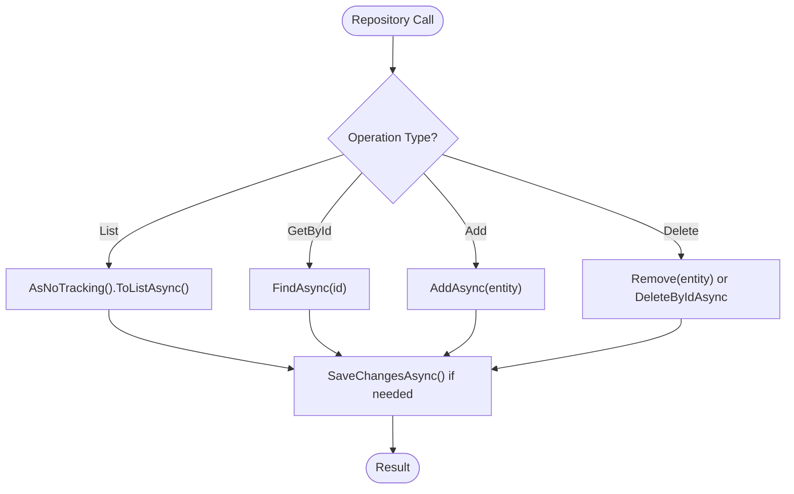

**Diagram sources**
- [EfRepository.cs:6-32](file://RIIS.Academic.Infrastructure/Persistence/Repositories/EfRepository.cs#L6-L32)

**Section sources**
- [EfRepository.cs:6-32](file://RIIS.Academic.Infrastructure/Persistence/Repositories/EfRepository.cs#L6-L32)

### Database Schema Mapping and Conventions
- Fluent configurations are applied per entity type under Configurations folders.
- Examples include table names, key definitions, property lengths, unique filters, row versioning, and check constraints.

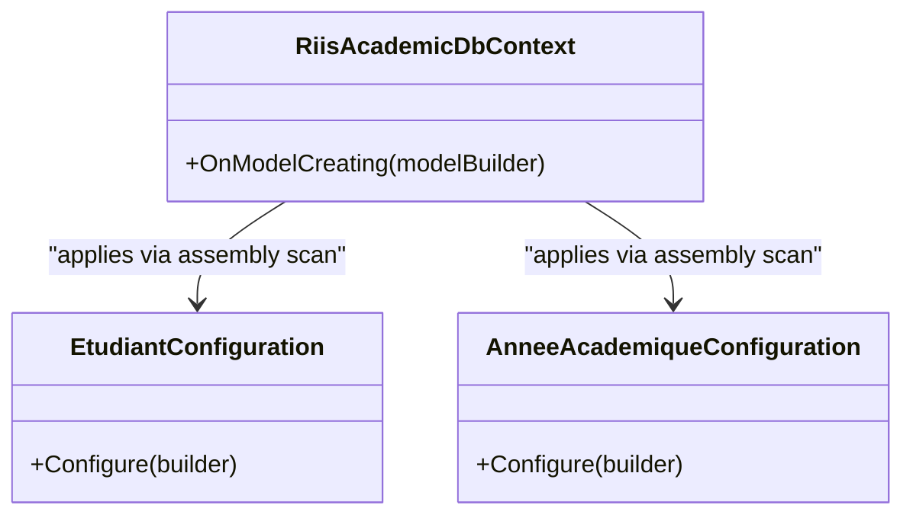

**Diagram sources**
- [RiisAcademicDbContext.cs:46-49](file://RIIS.Academic.Infrastructure/Persistence/RiisAcademicDbContext.cs#L46-L49)
- [EtudiantConfiguration.cs:6-32](file://RIIS.Academic.Infrastructure/Persistence/Configurations/Etudiants/EtudiantConfiguration.cs#L6-L32)
- [AnneeAcademiqueConfiguration.cs:6-16](file://RIIS.Academic.Infrastructure/Persistence/Configurations/Referentiels/AnneeAcademiqueConfiguration.cs#L6-L16)

**Section sources**
- [EtudiantConfiguration.cs:6-32](file://RIIS.Academic.Infrastructure/Persistence/Configurations/Etudiants/EtudiantConfiguration.cs#L6-L32)
- [AnneeAcademiqueConfiguration.cs:6-16](file://RIIS.Academic.Infrastructure/Persistence/Configurations/Referentiels/AnneeAcademiqueConfiguration.cs#L6-L16)
- [20260814000042_InitialCreate.cs:14-200](file://RIIS.Academic.Infrastructure/Persistence/Migrations/20260814000042_InitialCreate.cs#L14-L200)

### Migration Strategy
- Migrations are managed via EF Core Tools and target SQL Server.
- The initial migration defines core tables, keys, constraints, and relationships.
- Runtime migration is applied during database initialization.

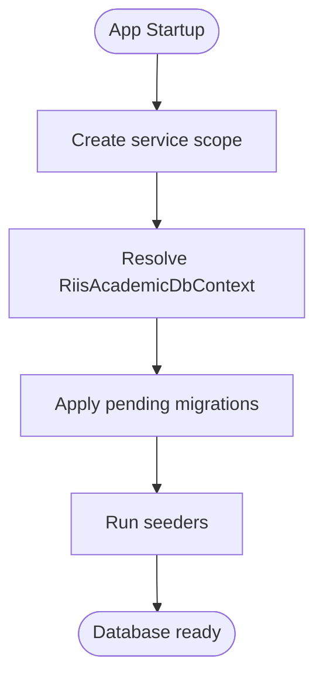

**Diagram sources**
- [DatabaseInitializer.cs:6-21](file://RIIS.Academic.Infrastructure/Persistence/DatabaseInitializer.cs#L6-L21)
- [20260814000042_InitialCreate.cs:14-200](file://RIIS.Academic.Infrastructure/Persistence/Migrations/20260814000042_InitialCreate.cs#L14-L200)

**Section sources**
- [DatabaseInitializer.cs:6-21](file://RIIS.Academic.Infrastructure/Persistence/DatabaseInitializer.cs#L6-L21)
- [20260814000042_InitialCreate.cs:14-200](file://RIIS.Academic.Infrastructure/Persistence/Migrations/20260814000042_InitialCreate.cs#L14-L200)

### Data Seeding Process
- Seeder populates academic pathways based on existing reference data (academic years, cycles, levels, fields, specialties).
- Idempotent logic updates or creates records per academic year and plan item.
- Errors are thrown when referenced items are missing, ensuring referential integrity.

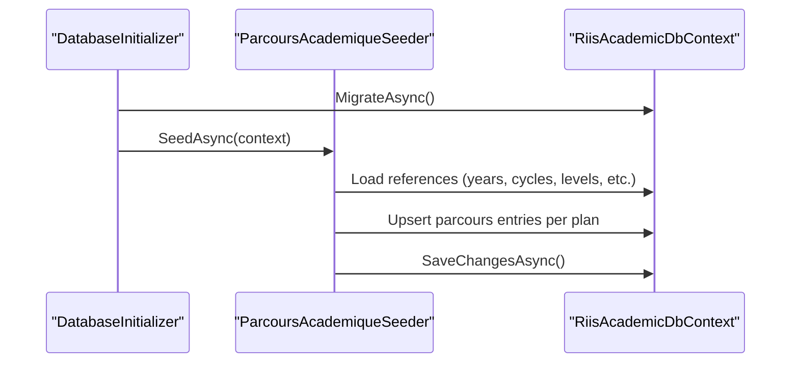

**Diagram sources**
- [DatabaseInitializer.cs:6-21](file://RIIS.Academic.Infrastructure/Persistence/DatabaseInitializer.cs#L6-L21)
- [ParcoursAcademiqueSeeder.cs:51-118](file://RIIS.Academic.Infrastructure/Persistence/Seeders/ParcoursAcademiqueSeeder.cs#L51-L118)

**Section sources**
- [ParcoursAcademiqueSeeder.cs:51-118](file://RIIS.Academic.Infrastructure/Persistence/Seeders/ParcoursAcademiqueSeeder.cs#L51-L118)

### Template-Based Document Generation Services

#### Word Export: Academic Record (Releve Note)
- Loads a .docx template, replaces text placeholders, and injects tables for semester grades and annual summary.
- Generates a slugified filename and returns content bytes.

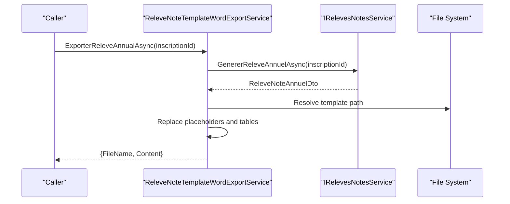

**Diagram sources**
- [ReleveNoteTemplateWordExportService.cs:11-33](file://RIIS.Academic.Infrastructure/Documents/ReleveNoteTemplateWordExportService.cs#L11-L33)
- [ReleveNoteTemplateWordExportService.cs:36-68](file://RIIS.Academic.Infrastructure/Documents/ReleveNoteTemplateWordExportService.cs#L36-L68)
- [ReleveNoteTemplateWordExportService.cs:70-86](file://RIIS.Academic.Infrastructure/Documents/ReleveNoteTemplateWordExportService.cs#L70-L86)

**Section sources**
- [ReleveNoteTemplateWordExportService.cs:11-33](file://RIIS.Academic.Infrastructure/Documents/ReleveNoteTemplateWordExportService.cs#L11-L33)
- [ReleveNoteTemplateWordExportService.cs:36-68](file://RIIS.Academic.Infrastructure/Documents/ReleveNoteTemplateWordExportService.cs#L36-L68)
- [ReleveNoteTemplateWordExportService.cs:70-86](file://RIIS.Academic.Infrastructure/Documents/ReleveNoteTemplateWordExportService.cs#L70-L86)

#### Word Export: Academic Board Minutes (Proces Verbal)
- Reads a Word template, replaces header placeholders, and builds a dynamic table with student details and decisions.
- Uses XML manipulation to insert formatted rows and headers.

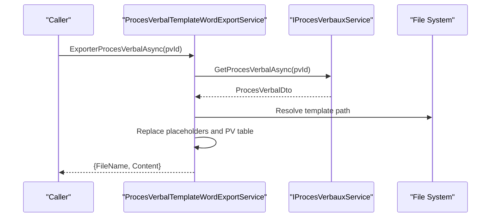

**Diagram sources**
- [ProcesVerbalTemplateWordExportService.cs:11-33](file://RIIS.Academic.Infrastructure/Documents/ProcesVerbalTemplateWordExportService.cs#L11-L33)
- [ProcesVerbalTemplateWordExportService.cs:36-68](file://RIIS.Academic.Infrastructure/Documents/ProcesVerbalTemplateWordExportService.cs#L36-L68)
- [ProcesVerbalTemplateWordExportService.cs:70-86](file://RIIS.Academic.Infrastructure/Documents/ProcesVerbalTemplateWordExportService.cs#L70-L86)

**Section sources**
- [ProcesVerbalTemplateWordExportService.cs:11-33](file://RIIS.Academic.Infrastructure/Documents/ProcesVerbalTemplateWordExportService.cs#L11-L33)
- [ProcesVerbalTemplateWordExportService.cs:36-68](file://RIIS.Academic.Infrastructure/Documents/ProcesVerbalTemplateWordExportService.cs#L36-L68)
- [ProcesVerbalTemplateWordExportService.cs:70-86](file://RIIS.Academic.Infrastructure/Documents/ProcesVerbalTemplateWordExportService.cs#L70-L86)

#### Excel Export: Academic Board Minutes (Proces Verbal)
- Builds an OpenXML workbook programmatically with styles, merged cells, frozen panes, and print settings.
- Generates a simple or detailed table depending on available element constitutif columns.

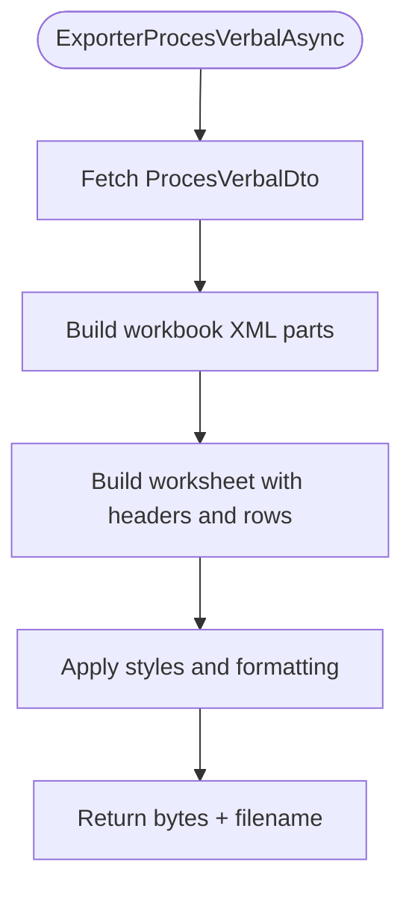

**Diagram sources**
- [ProcesVerbalExcelExportService.cs:10-31](file://RIIS.Academic.Infrastructure/Documents/ProcesVerbalExcelExportService.cs#L10-L31)
- [ProcesVerbalExcelExportService.cs:34-49](file://RIIS.Academic.Infrastructure/Documents/ProcesVerbalExcelExportService.cs#L34-L49)
- [ProcesVerbalExcelExportService.cs:52-139](file://RIIS.Academic.Infrastructure/Documents/ProcesVerbalExcelExportService.cs#L52-L139)

**Section sources**
- [ProcesVerbalExcelExportService.cs:10-31](file://RIIS.Academic.Infrastructure/Documents/ProcesVerbalExcelExportService.cs#L10-L31)
- [ProcesVerbalExcelExportService.cs:34-49](file://RIIS.Academic.Infrastructure/Documents/ProcesVerbalExcelExportService.cs#L34-L49)
- [ProcesVerbalExcelExportService.cs:52-139](file://RIIS.Academic.Infrastructure/Documents/ProcesVerbalExcelExportService.cs#L52-L139)

### File Handling and Templates
- Templates are embedded as content and copied to output directory at build time.
- At runtime, services resolve templates from multiple candidate paths and throw a clear exception if not found.
- All generated files are returned as byte arrays with safe, slugified filenames.

**Section sources**
- [RIIS.Academic.Infrastructure.csproj:24-31](file://RIIS.Academic.Infrastructure/RIIS.Academic.Infrastructure.csproj#L24-L31)
- [ProcesVerbalTemplateWordExportService.cs:70-86](file://RIIS.Academic.Infrastructure/Documents/ProcesVerbalTemplateWordExportService.cs#L70-L86)
- [ReleveNoteTemplateWordExportService.cs:70-86](file://RIIS.Academic.Infrastructure/Documents/ReleveNoteTemplateWordExportService.cs#L70-L86)

### Configuration Options and Connection String Management
- Environment selection: An envval setting determines which connection string name to use (dev vs other).
- Web app config includes multiple connection strings and logging settings.
- API project includes its own connection string configuration.

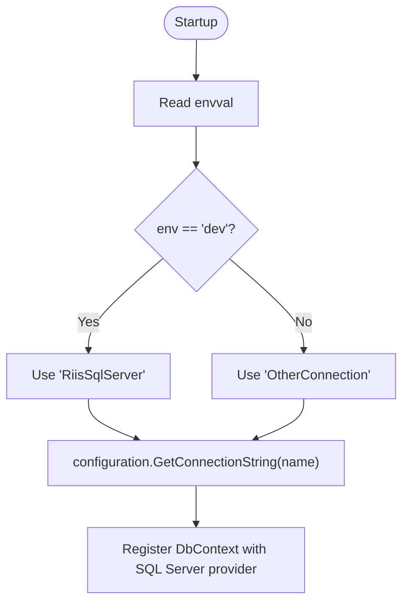

**Diagram sources**
- [DependencyInjection.cs:63-73](file://RIIS.Academic.Infrastructure/DependencyInjection.cs#L63-L73)
- [appsettings.json (Web):1-23](file://RIIS.Academic.Web/appsettings.json#L1-L23)
- [appsettings.json (Api):1-7](file://RIIS.Academic.Api/appsettings.json#L1-L7)

**Section sources**
- [DependencyInjection.cs:63-73](file://RIIS.Academic.Infrastructure/DependencyInjection.cs#L63-L73)
- [appsettings.json (Web):1-23](file://RIIS.Academic.Web/appsettings.json#L1-L23)
- [appsettings.json (Api):1-7](file://RIIS.Academic.Api/appsettings.json#L1-L7)

## Dependency Analysis
- DI layer registers DbContext, repositories, application services, and export services.
- Export services depend on Application services to fetch DTOs; they do not access EF directly.
- DbContext depends on EF Core and SQL Server provider.
- Migrations and seeders depend on DbContext.

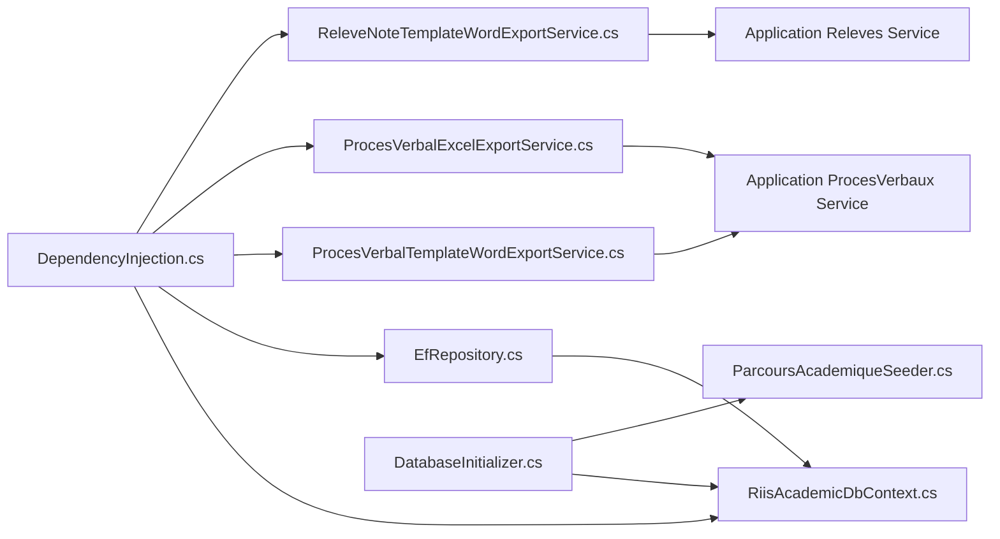

**Diagram sources**
- [DependencyInjection.cs:23-60](file://RIIS.Academic.Infrastructure/DependencyInjection.cs#L23-L60)
- [RiisAcademicDbContext.cs:6-49](file://RIIS.Academic.Infrastructure/Persistence/RiisAcademicDbContext.cs#L6-L49)
- [EfRepository.cs:6-32](file://RIIS.Academic.Infrastructure/Persistence/Repositories/EfRepository.cs#L6-L32)
- [DatabaseInitializer.cs:6-21](file://RIIS.Academic.Infrastructure/Persistence/DatabaseInitializer.cs#L6-L21)
- [ParcoursAcademiqueSeeder.cs:51-118](file://RIIS.Academic.Infrastructure/Persistence/Seeders/ParcoursAcademiqueSeeder.cs#L51-L118)
- [ProcesVerbalTemplateWordExportService.cs:11-33](file://RIIS.Academic.Infrastructure/Documents/ProcesVerbalTemplateWordExportService.cs#L11-L33)
- [ProcesVerbalExcelExportService.cs:10-31](file://RIIS.Academic.Infrastructure/Documents/ProcesVerbalExcelExportService.cs#L10-L31)
- [ReleveNoteTemplateWordExportService.cs:11-33](file://RIIS.Academic.Infrastructure/Documents/ReleveNoteTemplateWordExportService.cs#L11-L33)

**Section sources**
- [DependencyInjection.cs:23-60](file://RIIS.Academic.Infrastructure/DependencyInjection.cs#L23-L60)

## Performance Considerations
- Read queries use AsNoTracking to avoid change-tracking overhead for read-only scenarios.
- Export services stream template processing through memory streams and write compressed archives efficiently.
- Avoid unnecessary object graphs by returning DTOs from Application services to export services.
- Consider batching saves in seeders for large datasets to reduce transaction size.
- For high-throughput exports, consider background jobs and asynchronous processing to avoid blocking requests.

[No sources needed since this section provides general guidance]

## Troubleshooting Guide
- Missing template files: Services throw a specific exception indicating the expected template location; ensure templates are present in the output directory.
- Missing connection string: If the selected connection name is not configured, an invalid operation exception is thrown; verify envval and appsettings.
- Migration failures: Check the initial migration and ensure SQL Server connectivity and permissions; re-run migrations after schema changes.
- Seeder errors: Missing reference data (cycles, levels, fields, specialties) will cause exceptions; ensure required lookups exist before seeding pathways.

**Section sources**
- [DependencyInjection.cs:63-73](file://RIIS.Academic.Infrastructure/DependencyInjection.cs#L63-L73)
- [ProcesVerbalTemplateWordExportService.cs:70-86](file://RIIS.Academic.Infrastructure/Documents/ProcesVerbalTemplateWordExportService.cs#L70-L86)
- [ReleveNoteTemplateWordExportService.cs:70-86](file://RIIS.Academic.Infrastructure/Documents/ReleveNoteTemplateWordExportService.cs#L70-L86)
- [ParcoursAcademiqueSeeder.cs:51-118](file://RIIS.Academic.Infrastructure/Persistence/Seeders/ParcoursAcademiqueSeeder.cs#L51-L118)

## Conclusion
The Infrastructure Layer provides a robust foundation for data persistence, repository abstraction, migrations, seeding, and high-fidelity document generation. It leverages EF Core with explicit Fluent configurations, environment-aware connection management, and template-driven exports that produce professional Word and Excel documents without external libraries. Following the outlined performance and troubleshooting guidance ensures reliable operation across environments.