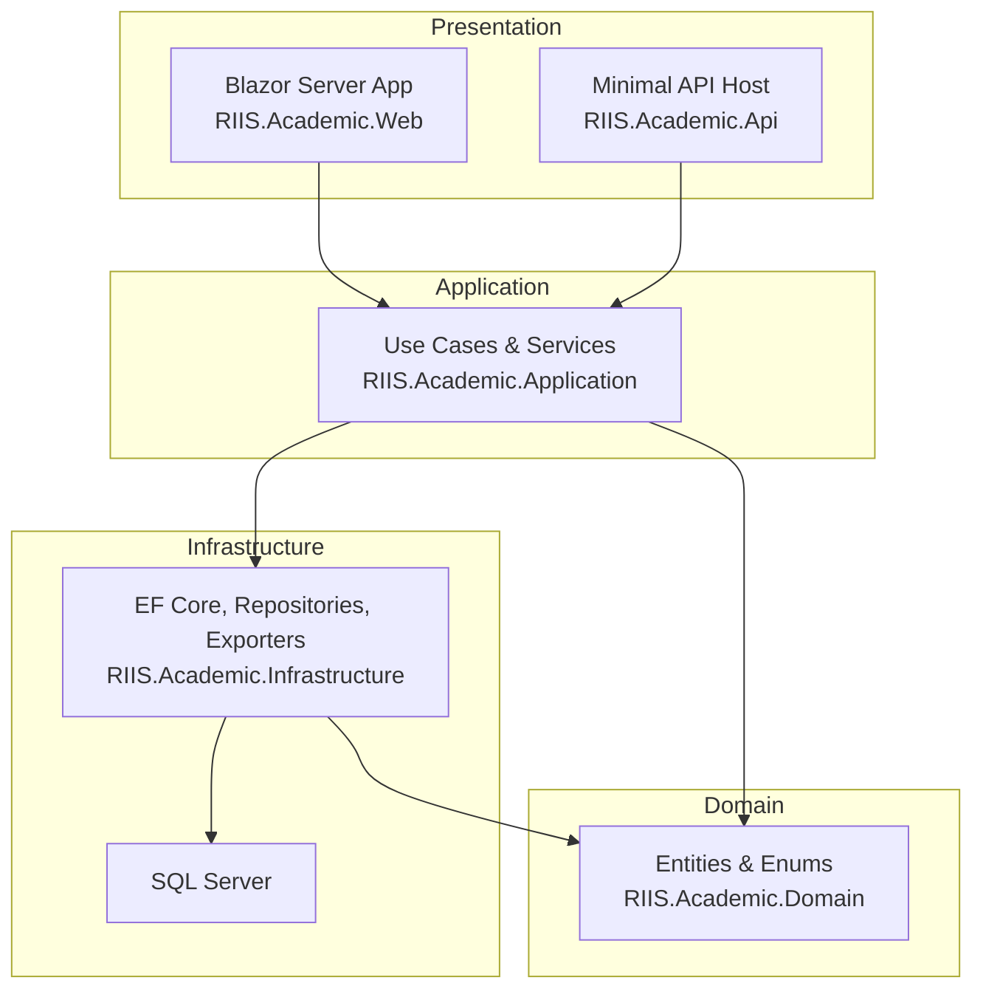
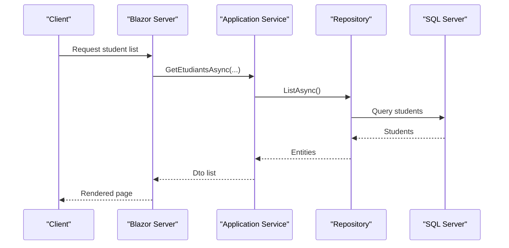
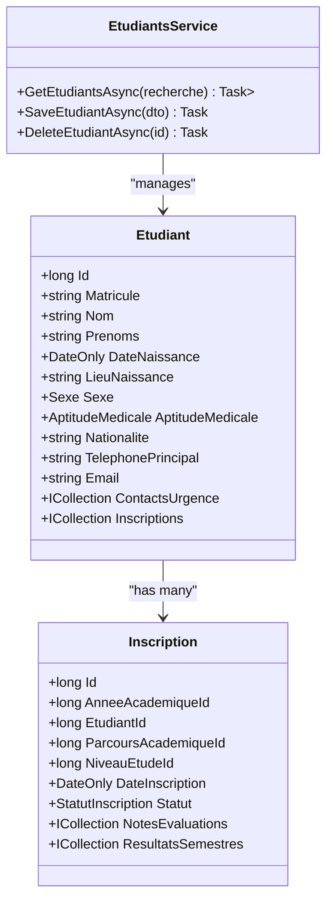
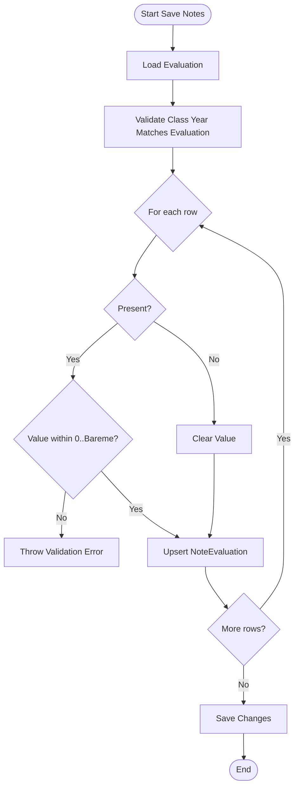
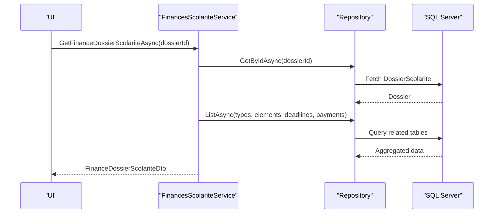
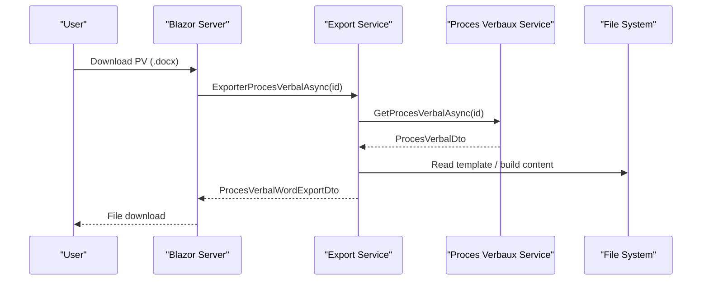
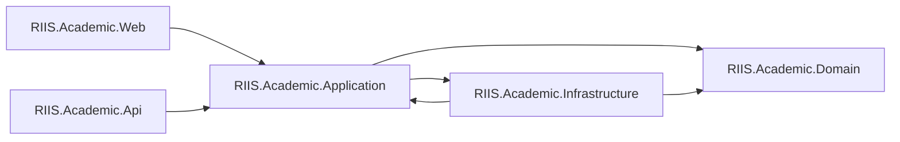

# Project Overview

<cite>
**Referenced Files in This Document**
- [Program.cs](file://RIIS.Academic.Api/Program.cs)
- [Program.cs](file://RIIS.Academic.Web/Program.cs)
- [DependencyInjection.cs](file://RIIS.Academic.Infrastructure/DependencyInjection.cs)
- [RiisAcademicDbContext.cs](file://RIIS.Academic.Infrastructure/Persistence/RiisAcademicDbContext.cs)
- [EfRepository.cs](file://RIIS.Academic.Infrastructure/Persistence/Repositories/EfRepository.cs)
- [Etudiant.cs](file://RIIS.Academic.Domain/Etudiants/Etudiant.cs)
- [Inscription.cs](file://RIIS.Academic.Domain/Inscriptions/Inscription.cs)
- [Entity.cs](file://RIIS.Academic.Domain/Common/Entity.cs)
- [EtudiantsService.cs](file://RIIS.Academic.Application/Etudiants/Services/EtudiantsService.cs)
- [SaisieNotesService.cs](file://RIIS.Academic.Application/Notes/Services/SaisieNotesService.cs)
- [FinancesScolariteService.cs](file://RIIS.Academic.Application/Scolarite/Services/FinancesScolariteService.cs)
- [FinanceDossierScolariteDto.cs](file://RIIS.Academic.Application/Scolarite/Dtos/FinanceDossierScolariteDto.cs)
- [ProcesVerbalWordExportService.cs](file://RIIS.Academic.Infrastructure/Documents/ProcesVerbalWordExportService.cs)
- [ProcesVerbalTemplateWordExportService.cs](file://RIIS.Academic.Infrastructure/Documents/ProcesVerbalTemplateWordExportService.cs)
- [ProcesVerbalExcelExportService.cs](file://RIIS.Academic.Infrastructure/Documents/ProcesVerbalExcelExportService.cs)
- [RiisAcademicExportEndpointExtensions.cs](file://RIIS.Academic.Web/Extensions/RiisAcademicExportEndpointExtensions.cs)
</cite>

## Table of Contents
1. Introduction
2. Project Structure
3. Core Components
4. Architecture Overview
5. Detailed Component Analysis
6. Dependency Analysis
7. Performance Considerations
8. Troubleshooting Guide
9. Conclusion

## Introduction
RIIS Academic Management System is a complete academic information management solution for educational institutions. It centralizes student lifecycle management, academic programs and curricula, grade capture and calculation, financial administration (fees, deadlines, payments), and official document generation (procedural records and transcripts). The system follows Clean Architecture principles to keep business rules isolated from infrastructure and UI concerns, enabling maintainability, testability, and clear boundaries.

Key capabilities:
- Student lifecycle: registration, enrollment, status tracking, and contact management
- Academic programs: pedagogical frameworks, semesters, teaching units, constituent elements, and classes
- Grade management: evaluations, score entry, eligibility checks, and result aggregation
- Financial administration: tuition types, tariffs, payment modes, due dates, free payments, and allocations
- Official documents: procedural records and transcripts exported to Word or Excel

Technology stack:
- ASP.NET Core hosting for API and Web
- Blazor Server for the interactive web UI
- Entity Framework Core with SQL Server for persistence
- Clean Architecture layers: Domain, Application, Infrastructure, and Web/API

## Project Structure
The solution is organized into layered projects that reflect Clean Architecture:
- RIIS.Academic.Domain: core entities, enums, and domain concepts
- RIIS.Academic.Application: use cases, services, DTOs, and application-level orchestration
- RIIS.Academic.Infrastructure: EF Core DbContext, repositories, configuration, seeding, and document export implementations
- RIIS.Academic.Web: Blazor Server app, pages, layout, and export endpoints
- RIIS.Academic.Api: minimal API host configured for controllers and DB context

**Diagram sources**
- [Program.cs:1-27](file://RIIS.Academic.Web/Program.cs#L1-L27)
- [Program.cs:1-18](file://RIIS.Academic.Api/Program.cs#L1-L18)
- [DependencyInjection.cs:23-60](file://RIIS.Academic.Infrastructure/DependencyInjection.cs#L23-L60)
- [RiisAcademicDbContext.cs:6-49](file://RIIS.Academic.Infrastructure/Persistence/RiisAcademicDbContext.cs#L6-L49)

**Section sources**
- [Program.cs:1-27](file://RIIS.Academic.Web/Program.cs#L1-L27)
- [Program.cs:1-18](file://RIIS.Academic.Api/Program.cs#L1-L18)
- [DependencyInjection.cs:23-60](file://RIIS.Academic.Infrastructure/DependencyInjection.cs#L23-L60)
- [RiisAcademicDbContext.cs:6-49](file://RIIS.Academic.Infrastructure/Persistence/RiisAcademicDbContext.cs#L6-L49)

## Core Components
- Domain layer defines core entities such as students and enrollments, along with shared base classes and enumerations.
- Application layer implements use cases via services that coordinate data access and business rules, exposing DTOs to callers.
- Infrastructure layer provides EF Core persistence through a DbContext, generic repository implementation, and document export services.
- Web layer hosts Blazor Server components and exposes export endpoints for generating official documents.

Examples of core responsibilities:
- Student management service handles search, creation, update, and deletion with validation and normalization.
- Grade entry service builds grids for evaluation sessions, validates scores against grading scales, and persists notes.
- Financial service aggregates fees, deadlines, payments, and allocations per student dossier.
- Document exporters generate Word/Excel files for procedural records and transcripts.

**Section sources**
- [Etudiant.cs:1-28](file://RIIS.Academic.Domain/Etudiants/Etudiant.cs#L1-L28)
- [Inscription.cs:1-37](file://RIIS.Academic.Domain/Inscriptions/Inscription.cs#L1-L37)
- [Entity.cs:1-8](file://RIIS.Academic.Domain/Common/Entity.cs#L1-L8)
- [EtudiantsService.cs:7-173](file://RIIS.Academic.Application/Etudiants/Services/EtudiantsService.cs#L7-L173)
- [SaisieNotesService.cs:8-317](file://RIIS.Academic.Application/Notes/Services/SaisieNotesService.cs#L8-L317)
- [FinancesScolariteService.cs:1-26](file://RIIS.Academic.Application/Scolarite/Services/FinancesScolariteService.cs#L1-L26)
- [FinanceDossierScolariteDto.cs:1-61](file://RIIS.Academic.Application/Scolarite/Dtos/FinanceDossierScolariteDto.cs#L1-L61)

## Architecture Overview
The system adheres to Clean Architecture:
- Presentation (Web/API) depends on Application interfaces only
- Application contains business logic and orchestrates use cases
- Infrastructure implements persistence and external integrations
- Domain remains independent of all other layers

**Diagram sources**
- [Program.cs:1-27](file://RIIS.Academic.Web/Program.cs#L1-L27)
- [DependencyInjection.cs:23-60](file://RIIS.Academic.Infrastructure/DependencyInjection.cs#L23-L60)
- [EfRepository.cs:6-34](file://RIIS.Academic.Infrastructure/Persistence/Repositories/EfRepository.cs#L6-L34)
- [RiisAcademicDbContext.cs:6-49](file://RIIS.Academic.Infrastructure/Persistence/RiisAcademicDbContext.cs#L6-L49)

## Detailed Component Analysis

### Student Lifecycle Management
- Domain model captures personal details, contacts, and enrollment relationships.
- Application service provides CRUD operations with validation, normalization, and uniqueness checks for identifiers.
- Data flows through a generic repository to EF Core and SQL Server.

**Diagram sources**
- [Etudiant.cs:1-28](file://RIIS.Academic.Domain/Etudiants/Etudiant.cs#L1-L28)
- [Inscription.cs:1-37](file://RIIS.Academic.Domain/Inscriptions/Inscription.cs#L1-L37)
- [EtudiantsService.cs:7-173](file://RIIS.Academic.Application/Etudiants/Services/EtudiantsService.cs#L7-L173)

**Section sources**
- [Etudiant.cs:1-28](file://RIIS.Academic.Domain/Etudiants/Etudiant.cs#L1-L28)
- [EtudiantsService.cs:7-173](file://RIIS.Academic.Application/Etudiants/Services/EtudiantsService.cs#L7-L173)

### Academic Programs and Curricula
- Programmes include pedagogical frameworks, semesters, teaching units, and constituent elements.
- Services expose hierarchical lookups and mappings used across grade capture and results.

[No sources needed since this section summarizes program structure without analyzing specific files]

### Grade Management
- Evaluation sessions are filtered by academic year, class, unit, element, and type.
- Score entry grid enforces presence status, value ranges, and eligibility for make-up sessions based on semester results.
- Notes are persisted with audit fields and validated against the evaluation’s scale.

**Diagram sources**
- [SaisieNotesService.cs:126-228](file://RIIS.Academic.Application/Notes/Services/SaisieNotesService.cs#L126-L228)
- [SaisieNotesService.cs:230-295](file://RIIS.Academic.Application/Notes/Services/SaisieNotesService.cs#L230-L295)

**Section sources**
- [SaisieNotesService.cs:8-317](file://RIIS.Academic.Application/Notes/Services/SaisieNotesService.cs#L8-L317)

### Financial Administration
- Financial service aggregates per-student dossiers including expected amounts, deadlines, payments, and allocations.
- Supports free payments and linking payments to deadlines or elements.
- DTOs represent financial state and options for UI binding.

**Diagram sources**
- [FinancesScolariteService.cs:1-26](file://RIIS.Academic.Application/Scolarite/Services/FinancesScolariteService.cs#L1-L26)
- [FinanceDossierScolariteDto.cs:1-61](file://RIIS.Academic.Application/Scolarite/Dtos/FinanceDossierScolariteDto.cs#L1-L61)

**Section sources**
- [FinancesScolariteService.cs:1-26](file://RIIS.Academic.Application/Scolarite/Services/FinancesScolariteService.cs#L1-L26)
- [FinanceDossierScolariteDto.cs:1-61](file://RIIS.Academic.Application/Scolarite/Dtos/FinanceDossierScolariteDto.cs#L1-L61)

### Official Document Generation
- Procedural records and transcripts can be exported to Word or Excel.
- Export services implement template-based and direct content generation.
- Web endpoints expose download URLs for generated files.

**Diagram sources**
- [ProcesVerbalWordExportService.cs:1-30](file://RIIS.Academic.Infrastructure/Documents/ProcesVerbalWordExportService.cs#L1-L30)
- [ProcesVerbalTemplateWordExportService.cs:1-39](file://RIIS.Academic.Infrastructure/Documents/ProcesVerbalTemplateWordExportService.cs#L1-L39)
- [RiisAcademicExportEndpointExtensions.cs:38-73](file://RIIS.Academic.Web/Extensions/RiisAcademicExportEndpointExtensions.cs#L38-L73)

**Section sources**
- [ProcesVerbalWordExportService.cs:1-30](file://RIIS.Academic.Infrastructure/Documents/ProcesVerbalWordExportService.cs#L1-L30)
- [ProcesVerbalTemplateWordExportService.cs:1-39](file://RIIS.Academic.Infrastructure/Documents/ProcesVerbalTemplateWordExportService.cs#L1-L39)
- [ProcesVerbalExcelExportService.cs:1-32](file://RIIS.Academic.Infrastructure/Documents/ProcesVerbalExcelExportService.cs#L1-L32)
- [RiisAcademicExportEndpointExtensions.cs:38-73](file://RIIS.Academic.Web/Extensions/RiisAcademicExportEndpointExtensions.cs#L38-L73)

## Dependency Analysis
- Web and API depend on Application abstractions; they do not reference Infrastructure directly except for DI registration.
- Application depends on Domain and Abstractions; it never references EF Core or file systems.
- Infrastructure implements Abstractions and depends on Domain and EF Core.

**Diagram sources**
- [DependencyInjection.cs:23-60](file://RIIS.Academic.Infrastructure/DependencyInjection.cs#L23-L60)
- [Program.cs:1-27](file://RIIS.Academic.Web/Program.cs#L1-L27)
- [Program.cs:1-18](file://RIIS.Academic.Api/Program.cs#L1-L18)

**Section sources**
- [DependencyInjection.cs:23-60](file://RIIS.Academic.Infrastructure/DependencyInjection.cs#L23-L60)

## Performance Considerations
- Use read-only queries with AsNoTracking for list operations to reduce change-tracking overhead.
- Prefer filtering at the database level where possible; avoid loading large graphs into memory when not needed.
- Cache lookup lists (academic years, classes, units) if frequently accessed and relatively static.
- Batch updates for bulk operations (e.g., saving multiple notes) to minimize round trips.
- Ensure proper indexing on foreign keys and frequently queried columns (e.g., matricule, code, date fields).

[No sources needed since this section provides general guidance]

## Troubleshooting Guide
Common issues and resolutions:
- Missing connection string: ensure environment variable and configuration provide the correct connection name.
- Validation errors during student save: required fields must be present and normalized; duplicate matricule will throw an error.
- Grade entry errors: verify evaluation and class belong to the same academic year; values must be within the evaluation’s scale.
- Export failures: confirm templates exist and are accessible; check file permissions and paths.

Operational tips:
- Use cancellation tokens to support long-running operations and graceful shutdown.
- Log exceptions around persistence and export operations for faster diagnosis.
- Seed initial data carefully to avoid conflicts with existing records.

**Section sources**
- [DependencyInjection.cs:63-73](file://RIIS.Academic.Infrastructure/DependencyInjection.cs#L63-L73)
- [EtudiantsService.cs:53-127](file://RIIS.Academic.Application/Etudiants/Services/EtudiantsService.cs#L53-L127)
- [SaisieNotesService.cs:126-295](file://RIIS.Academic.Application/Notes/Services/SaisieNotesService.cs#L126-L295)

## Conclusion
RIIS Academic Management System delivers a robust, layered platform for managing academic processes end-to-end. Its Clean Architecture ensures clear separation of concerns, while its feature set covers student lifecycle, academic programs, grades, finances, and official documents. The technology stack (ASP.NET Core, Blazor Server, EF Core, SQL Server) provides a modern, scalable foundation suitable for educational institutions seeking reliable and maintainable software.

[No sources needed since this section summarizes without analyzing specific files]