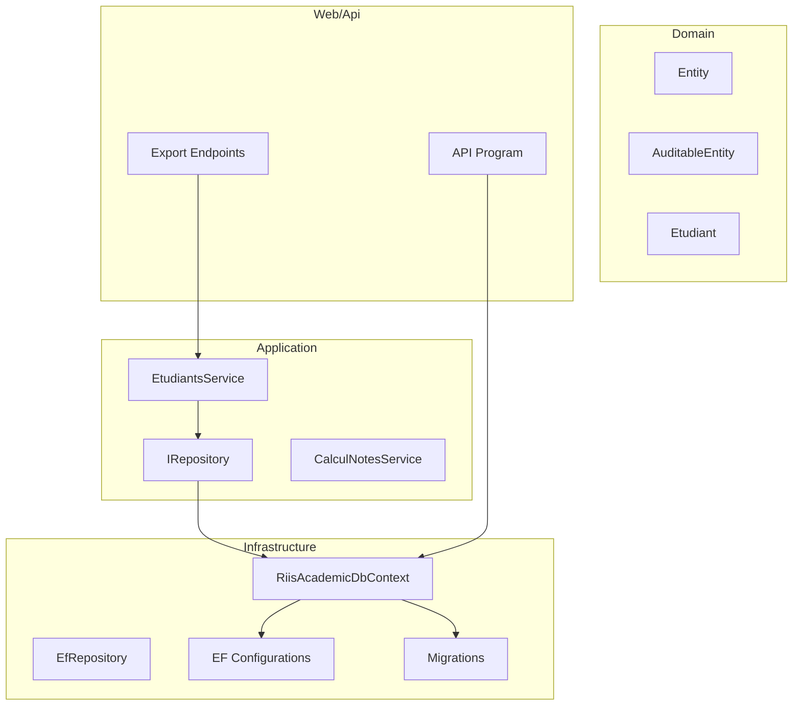
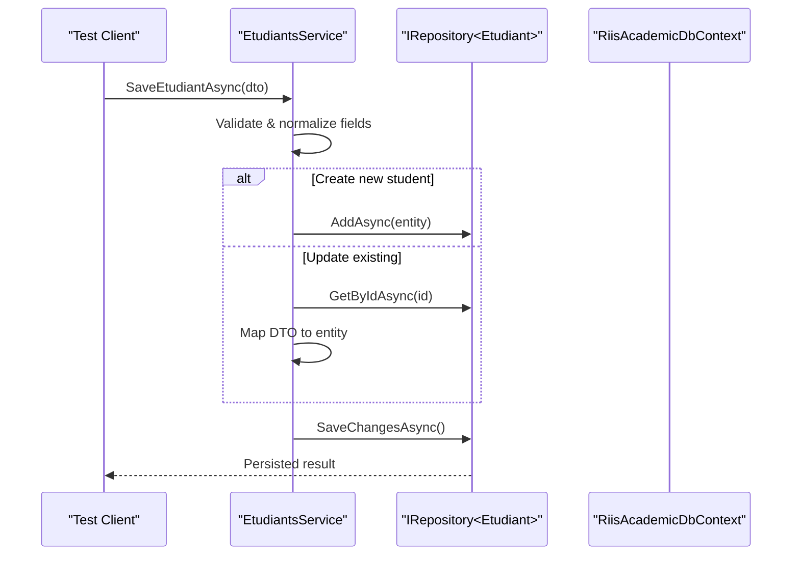
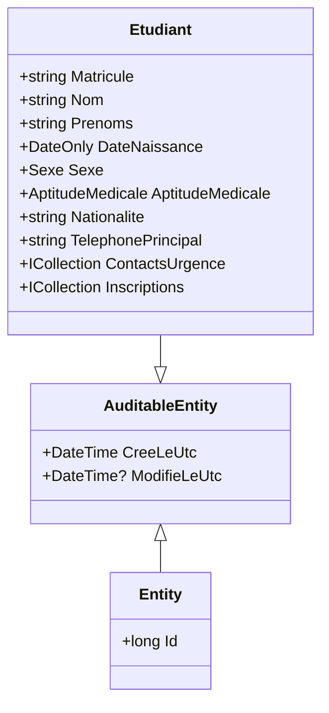
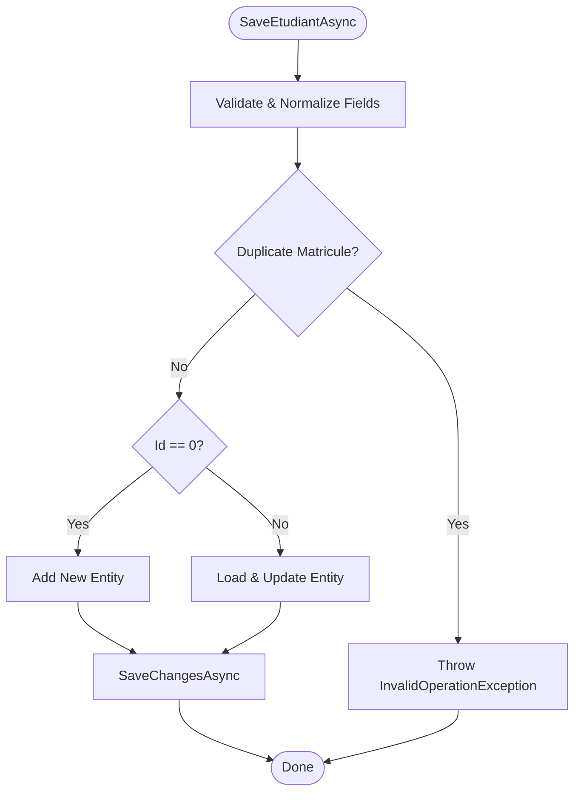
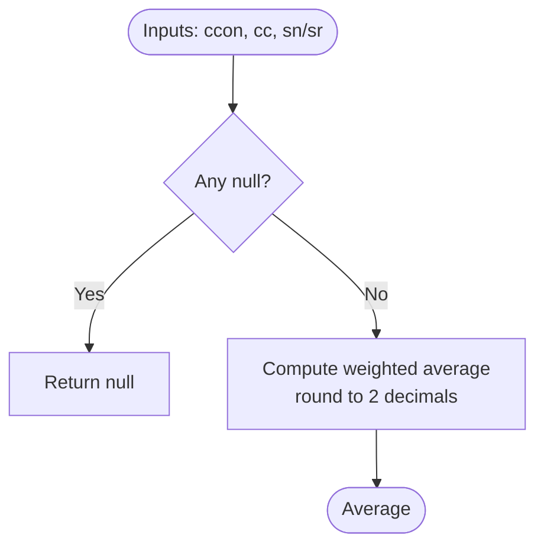
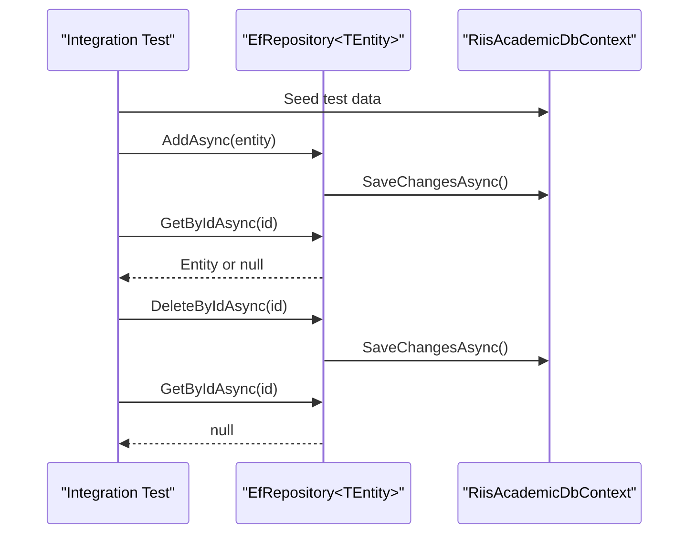
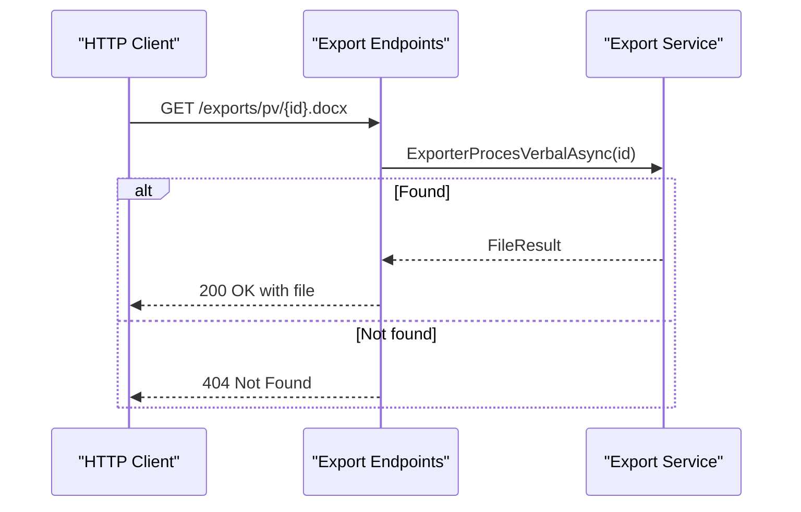
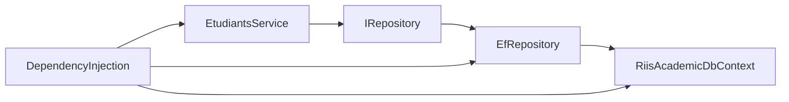

# Testing Strategy

<cite>
**Referenced Files in This Document**
- [Program.cs](file://RIIS.Academic.Api/Program.cs)
- [DependencyInjection.cs](file://RIIS.Academic.Infrastructure/DependencyInjection.cs)
- [RiisAcademicDbContext.cs](file://RIIS.Academic.Infrastructure/Persistence/RiisAcademicDbContext.cs)
- [EfRepository.cs](file://RIIS.Academic.Infrastructure/Persistence/Repositories/EfRepository.cs)
- [IRepository.cs](file://RIIS.Academic.Application/Abstractions/Persistence/IRepository.cs)
- [EtudiantsService.cs](file://RIIS.Academic.Application/Etudiants/Services/EtudiantsService.cs)
- [CalculNotesService.cs](file://RIIS.Academic.Application/Notes/Services/CalculNotesService.cs)
- [Entity.cs](file://RIIS.Academic.Domain/Common/Entity.cs)
- [AuditableEntity.cs](file://RIIS.Academic.Domain/Common/AuditableEntity.cs)
- [Etudiant.cs](file://RIIS.Academic.Domain/Etudiants/Etudiant.cs)
- [ResultatUniteEnseignementConfiguration.cs](file://RIIS.Academic.Infrastructure/Persistence/Configurations/Notes/ResultatUniteEnseignementConfiguration.cs)
- [20260814000042_InitialCreate.cs](file://RIIS.Academic.Infrastructure/Persistence/Migrations/20260814000042_InitialCreate.cs)
- [DatabaseInitializer.cs](file://RIIS.Academic.Infrastructure/Persistence/DatabaseInitializer.cs)
- [RiisAcademicExportEndpointExtensions.cs](file://RIIS.Academic.Web/Extensions/RiisAcademicExportEndpointExtensions.cs)
</cite>

## Table of Contents
1. Introduction
2. Project Structure
3. Core Components
4. Architecture Overview
5. Detailed Component Analysis
6. Dependency Analysis
7. Performance Considerations
8. Troubleshooting Guide
9. Conclusion
10. Appendices

## Introduction
This document defines the testing strategy for the RIIS Academic Management System across unit, integration, and API layers. It covers domain entities, application services, infrastructure components, database operations, external service calls, API endpoints, test data management, mocking strategies, environment setup, best practices, coverage targets, and CI pipeline guidance. The goal is to ensure reliable, maintainable tests that validate business rules, persistence behavior, and user-facing endpoints with minimal flakiness and fast feedback.

## Project Structure
The system follows a clean architecture with clear boundaries:
- Domain layer contains core entities and enums.
- Application layer implements use cases via services and DTOs, depending on repository abstractions.
- Infrastructure provides EF Core DbContext, repositories, migrations, seeders, and export implementations.
- Web and Api projects expose endpoints and wire dependencies.

**Diagram sources**
- [IRepository.cs:1-13](file://RIIS.Academic.Application/Abstractions/Persistence/IRepository.cs#L1-L13)
- [EfRepository.cs:1-34](file://RIIS.Academic.Infrastructure/Persistence/Repositories/EfRepository.cs#L1-L34)
- [RiisAcademicDbContext.cs:1-51](file://RIIS.Academic.Infrastructure/Persistence/RiisAcademicDbContext.cs#L1-L51)
- [ResultatUniteEnseignementConfiguration.cs:1-27](file://RIIS.Academic.Infrastructure/Persistence/Configurations/Notes/ResultatUniteEnseignementConfiguration.cs#L1-L27)
- [20260814000042_InitialCreate.cs:738-757](file://RIIS.Academic.Infrastructure/Persistence/Migrations/20260814000042_InitialCreate.cs#L738-L757)
- [EtudiantsService.cs:1-173](file://RIIS.Academic.Application/Etudiants/Services/EtudiantsService.cs#L1-L173)
- [RiisAcademicExportEndpointExtensions.cs:1-93](file://RIIS.Academic.Web/Extensions/RiisAcademicExportEndpointExtensions.cs#L1-L93)
- [Program.cs:1-18](file://RIIS.Academic.Api/Program.cs#L1-L18)

**Section sources**
- [DependencyInjection.cs:1-75](file://RIIS.Academic.Infrastructure/DependencyInjection.cs#L1-L75)
- [RiisAcademicDbContext.cs:1-51](file://RIIS.Academic.Infrastructure/Persistence/RiisAcademicDbContext.cs#L1-L51)

## Core Components
- Domain entities: Base classes and rich models encapsulate business invariants.
- Application services: Orchestrate workflows, enforce validation, and coordinate persistence through repository interfaces.
- Infrastructure: EF Core context, generic repository, configurations, migrations, and export services.
- API/Web: Endpoint wiring and dependency injection configuration.

Key responsibilities for testing:
- Validate domain invariants and relationships.
- Verify application service logic (validation, transformation, error handling).
- Confirm repository behavior and EF mappings under realistic scenarios.
- Ensure endpoints return correct status codes and payloads.

**Section sources**
- [Entity.cs:1-8](file://RIIS.Academic.Domain/Common/Entity.cs#L1-L8)
- [AuditableEntity.cs:1-9](file://RIIS.Academic.Domain/Common/AuditableEntity.cs#L1-L9)
- [Etudiant.cs:1-28](file://RIIS.Academic.Domain/Etudiants/Etudiant.cs#L1-L28)
- [IRepository.cs:1-13](file://RIIS.Academic.Application/Abstractions/Persistence/IRepository.cs#L1-L13)
- [EfRepository.cs:1-34](file://RIIS.Academic.Infrastructure/Persistence/Repositories/EfRepository.cs#L1-L34)
- [RiisAcademicDbContext.cs:1-51](file://RIIS.Academic.Infrastructure/Persistence/RiisAcademicDbContext.cs#L1-L51)

## Architecture Overview
The system uses dependency inversion at the boundary between Application and Infrastructure. Tests should isolate layers by mocking repository interfaces for unit tests and using an in-memory or test database for integration tests.

**Diagram sources**
- [EtudiantsService.cs:53-127](file://RIIS.Academic.Application/Etudiants/Services/EtudiantsService.cs#L53-L127)
- [IRepository.cs:1-13](file://RIIS.Academic.Application/Abstractions/Persistence/IRepository.cs#L1-L13)
- [EfRepository.cs:1-34](file://RIIS.Academic.Infrastructure/Persistence/Repositories/EfRepository.cs#L1-L34)

## Detailed Component Analysis

### Domain Entities Testing
Focus areas:
- Identity and equality semantics for base Entity.
- Auditable timestamps defaults.
- Required fields and collection initialization for Etudiant.

Recommended tests:
- Default values for audit fields are set correctly.
- Collections initialize to empty sets to avoid null references.
- Validation enforced by required properties prevents invalid instantiation.

**Diagram sources**
- [Entity.cs:1-8](file://RIIS.Academic.Domain/Common/Entity.cs#L1-L8)
- [AuditableEntity.cs:1-9](file://RIIS.Academic.Domain/Common/AuditableEntity.cs#L1-L9)
- [Etudiant.cs:1-28](file://RIIS.Academic.Domain/Etudiants/Etudiant.cs#L1-L28)

**Section sources**
- [Entity.cs:1-8](file://RIIS.Academic.Domain/Common/Entity.cs#L1-L8)
- [AuditableEntity.cs:1-9](file://RIIS.Academic.Domain/Common/AuditableEntity.cs#L1-L9)
- [Etudiant.cs:1-28](file://RIIS.Academic.Domain/Etudiants/Etudiant.cs#L1-L28)

### Application Services Testing
Focus areas:
- Input validation and normalization.
- Business rule enforcement (e.g., unique matricule).
- Correct mapping between DTOs and entities.
- Error propagation for invalid inputs.

Recommended tests:
- Create student with valid data persists successfully.
- Duplicate matricule throws expected exception.
- Missing required fields throw validation exceptions.
- Search filters return correct subsets and ordering.

**Diagram sources**
- [EtudiantsService.cs:53-127](file://RIIS.Academic.Application/Etudiants/Services/EtudiantsService.cs#L53-L127)

**Section sources**
- [EtudiantsService.cs:1-173](file://RIIS.Academic.Application/Etudiants/Services/EtudiantsService.cs#L1-L173)

### Calculation Service Testing
Focus areas:
- Weighted average calculation precision.
- Eligibility for retake based on thresholds.
- Credits acquisition logic.

Recommended tests:
- Average rounds to two decimals.
- Null inputs yield null results.
- Retake eligibility returns true below threshold.
- Credits acquired only when average meets passing criteria.

**Diagram sources**
- [CalculNotesService.cs:1-25](file://RIIS.Academic.Application/Notes/Services/CalculNotesService.cs#L1-L25)

**Section sources**
- [CalculNotesService.cs:1-25](file://RIIS.Academic.Application/Notes/Services/CalculNotesService.cs#L1-L25)

### Infrastructure and Database Testing
Focus areas:
- Repository CRUD operations.
- EF Core model configurations and constraints.
- Migrations and seeding.

Recommended tests:
- ListAsync returns all records without tracking.
- GetByIdAsync returns null for missing IDs.
- DeleteByIdAsync handles non-existent entities gracefully.
- Unique constraints enforced (e.g., composite keys).
- Decimal precision preserved.

**Diagram sources**
- [EfRepository.cs:1-34](file://RIIS.Academic.Infrastructure/Persistence/Repositories/EfRepository.cs#L1-L34)
- [RiisAcademicDbContext.cs:1-51](file://RIIS.Academic.Infrastructure/Persistence/RiisAcademicDbContext.cs#L1-L51)

**Section sources**
- [EfRepository.cs:1-34](file://RIIS.Academic.Infrastructure/Persistence/Repositories/EfRepository.cs#L1-L34)
- [ResultatUniteEnseignementConfiguration.cs:1-27](file://RIIS.Academic.Infrastructure/Persistence/Configurations/Notes/ResultatUniteEnseignementConfiguration.cs#L1-L27)
- [20260814000042_InitialCreate.cs:738-757](file://RIIS.Academic.Infrastructure/Persistence/Migrations/20260814000042_InitialCreate.cs#L738-L757)

### API Endpoints Testing
Focus areas:
- Export endpoints returning files or not found.
- Parameter binding and cancellation token support.

Recommended tests:
- Valid ID returns file with correct content type and name.
- Invalid ID returns not found.
- Request cancellation stops processing appropriately.

**Diagram sources**
- [RiisAcademicExportEndpointExtensions.cs:1-93](file://RIIS.Academic.Web/Extensions/RiisAcademicExportEndpointExtensions.cs#L1-L93)

**Section sources**
- [RiisAcademicExportEndpointExtensions.cs:1-93](file://RIIS.Academic.Web/Extensions/RiisAcademicExportEndpointExtensions.cs#L1-L93)

## Dependency Analysis
Testing must respect the DI container and abstraction boundaries:
- Application services depend on IRepository abstractions; mock these in unit tests.
- Infrastructure registers services and DbContext; integration tests can use the real container with test DB.
- API project wires DbContext directly; integration tests should configure a test connection string.

**Diagram sources**
- [DependencyInjection.cs:23-60](file://RIIS.Academic.Infrastructure/DependencyInjection.cs#L23-L60)
- [IRepository.cs:1-13](file://RIIS.Academic.Application/Abstractions/Persistence/IRepository.cs#L1-L13)
- [EfRepository.cs:1-34](file://RIIS.Academic.Infrastructure/Persistence/Repositories/EfRepository.cs#L1-L34)
- [RiisAcademicDbContext.cs:1-51](file://RIIS.Academic.Infrastructure/Persistence/RiisAcademicDbContext.cs#L1-L51)

**Section sources**
- [DependencyInjection.cs:1-75](file://RIIS.Academic.Infrastructure/DependencyInjection.cs#L1-L75)

## Performance Considerations
- Use in-memory databases for fast unit/integration tests where possible.
- Prefer AsNoTracking queries in read-only paths to reduce overhead.
- Keep test datasets minimal and focused on the scenario under test.
- Avoid heavy seeding in every test; use shared fixtures or factories.
- Parallelize independent tests to reduce CI time.

[No sources needed since this section provides general guidance]

## Troubleshooting Guide
Common issues and resolutions:
- Connection string not found: Ensure configuration includes the expected connection name for the test environment.
- Migration conflicts: Reset or drop test database before running migrations in integration tests.
- Unique constraint violations: Use deterministic test data generation and unique identifiers per test run.
- Flaky async tests: Always await asynchronous operations and use cancellation tokens consistently.

**Section sources**
- [DependencyInjection.cs:63-73](file://RIIS.Academic.Infrastructure/DependencyInjection.cs#L63-L73)
- [DatabaseInitializer.cs:1-23](file://RIIS.Academic.Infrastructure/Persistence/DatabaseInitializer.cs#L1-L23)

## Conclusion
Adopting layered testing with clear isolation, robust mocks, and targeted integration tests ensures reliability across the RIIS Academic Management System. Focus on validating domain rules, application orchestration, persistence integrity, and endpoint behavior. Maintain high code coverage for critical paths and integrate automated testing into CI pipelines for continuous quality assurance.

[No sources needed since this section summarizes without analyzing specific files]

## Appendices

### Unit Testing Best Practices
- Isolate each test; do not share mutable state across tests.
- Mock only external dependencies (repositories, services); test internal logic thoroughly.
- Assert both outcomes and side effects (e.g., number of saved changes).
- Use descriptive test names indicating scenario and expected behavior.

### Integration Testing Best Practices
- Use a dedicated test database or in-memory provider.
- Apply migrations and seed minimal required data before tests.
- Wrap tests in transactions or reset state after each test to ensure isolation.
- Include negative scenarios (invalid IDs, constraints, concurrency).

### Test Data Management
- Create factory methods or builders for entities and DTOs.
- Use unique identifiers to avoid collisions in parallel runs.
- Centralize common reference data (enums, lookups) for reuse.

### Mocking Strategies
- Mock IRepository methods to control persistence behavior in unit tests.
- For calculation services, provide edge-case inputs (nulls, boundary values).
- For export endpoints, mock export services to return controlled payloads.

### Environment Setup
- Configure separate appsettings for tests with in-memory or SQLite connections.
- Ensure DI registration matches production but substitutes test doubles.
- Provide helper utilities to build and dispose test contexts.

### Code Coverage Requirements
- Aim for >80% line coverage overall and >90% on critical domains (notes, validations).
- Prioritize coverage of validation, error paths, and complex calculations.
- Track uncovered branches and add tests for high-risk areas.

### Continuous Integration Testing Pipeline
- Run unit tests first for fast feedback.
- Execute integration tests against isolated databases.
- Publish test reports and artifacts.
- Fail builds on test failures or coverage drops below thresholds.

### Example Test Cases
- Domain:
  - Validate default audit timestamps on creation.
  - Ensure collections initialize to empty sets.
- Application:
  - Save student with valid data succeeds.
  - Duplicate matricule throws expected exception.
  - Missing required fields throw validation exceptions.
  - Search returns ordered subset matching query.
- Infrastructure:
  - Repository list returns all records without tracking.
  - Unique constraints enforced by EF configurations.
  - Decimal precision preserved in persisted values.
- API:
  - Export endpoint returns file for valid ID.
  - Export endpoint returns not found for invalid ID.

[No sources needed since this section provides general guidance]