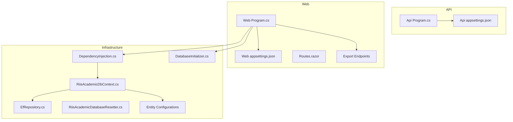
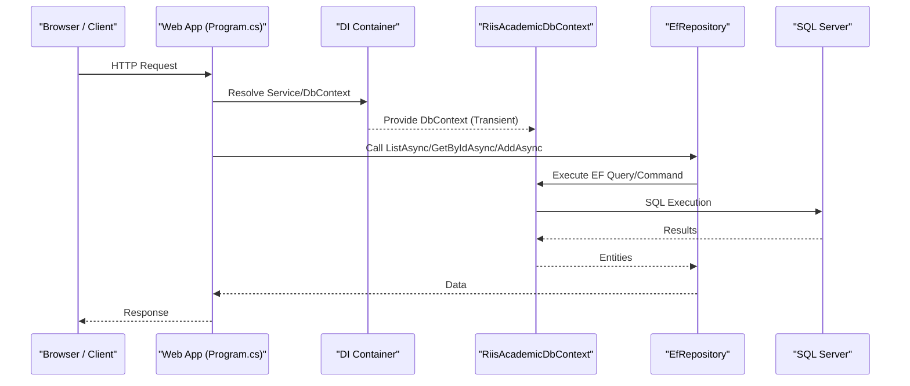
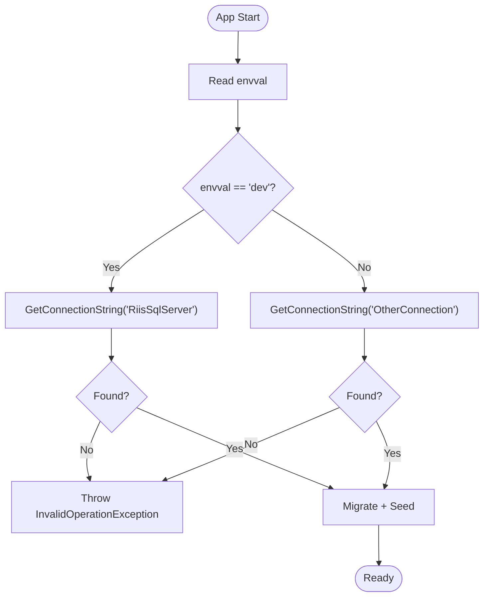
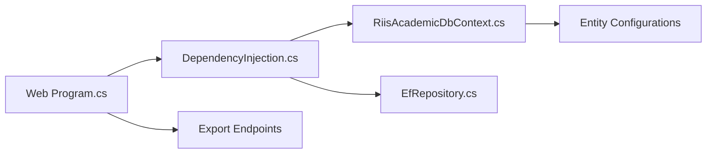

# Troubleshooting

<cite>
**Referenced Files in This Document**
- [Program.cs](file://RIIS.Academic.Api/Program.cs)
- [appsettings.json](file://RIIS.Academic.Api/appsettings.json)
- [Program.cs](file://RIIS.Academic.Web/Program.cs)
- [appsettings.json](file://RIIS.Academic.Web/appsettings.json)
- [DependencyInjection.cs](file://RIIS.Academic.Infrastructure/DependencyInjection.cs)
- [RiisAcademicDbContext.cs](file://RIIS.Academic.Infrastructure/Persistence/RiisAcademicDbContext.cs)
- [EfRepository.cs](file://RIIS.Academic.Infrastructure/Persistence/Repositories/EfRepository.cs)
- [DatabaseInitializer.cs](file://RIIS.Academic.Infrastructure/Persistence/DatabaseInitializer.cs)
- [RiisAcademicDatabaseResetter.cs](file://RIIS.Academic.Infrastructure/Persistence/RiisAcademicDatabaseResetter.cs)
- [ValidationInscriptionConfiguration.cs](file://RIIS.Academic.Infrastructure/Persistence/Configurations/Inscriptions/ValidationInscriptionConfiguration.cs)
- [EtudiantsService.cs](file://RIIS.Academic.Application/Etudiants/Services/EtudiantsService.cs)
- [Routes.razor](file://RIIS.Academic.Web/Components/Routes.razor)
- [Releves.razor](file://RIIS.Academic.Web/Components/Pages/Releves.razor)
- [RiisAcademicExportEndpointExtensions.cs](file://RIIS.Academic.Web/Extensions/RiisAcademicExportEndpointExtensions.cs)
</cite>

## Table of Contents
1. [Introduction](#introduction)
2. [Project Structure](#project-structure)
3. [Core Components](#core-components)
4. [Architecture Overview](#architecture-overview)
5. [Detailed Component Analysis](#detailed-component-analysis)
6. [Dependency Analysis](#dependency-analysis)
7. [Performance Considerations](#performance-considerations)
8. [Troubleshooting Guide](#troubleshooting-guide)
9. [Conclusion](#conclusion)
10. [Appendices](#appendices)

## Introduction
This document provides a comprehensive troubleshooting guide for the RIIS Academic system across development, deployment, and operation. It focuses on frequent issues such as database connectivity, configuration problems, runtime errors, and performance bottlenecks. It also includes diagnostic techniques, log analysis guidance, error message interpretation, recovery procedures, and an FAQ section with known limitations and workarounds.

## Project Structure
The solution is organized into layered projects:
- API project exposes controllers and configures EF Core for SQL Server.
- Web project hosts the Blazor UI, registers infrastructure services, and maps export endpoints.
- Infrastructure project contains EF Core context, repository implementation, dependency injection setup, migrations, seeders, and database reset utilities.
- Application project implements business services and DTOs.
- Domain project defines entities and enums.

**Diagram sources**
- [Program.cs:5-17](file://RIIS.Academic.Api/Program.cs#L5-L17)
- [appsettings.json:2-6](file://RIIS.Academic.Api/appsettings.json#L2-L6)
- [Program.cs:8-26](file://RIIS.Academic.Web/Program.cs#L8-L26)
- [appsettings.json:1-23](file://RIIS.Academic.Web/appsettings.json#L1-L23)
- [DependencyInjection.cs:25-60](file://RIIS.Academic.Infrastructure/DependencyInjection.cs#L25-L60)
- [RiisAcademicDbContext.cs:6-49](file://RIIS.Academic.Infrastructure/Persistence/RiisAcademicDbContext.cs#L6-L49)
- [EfRepository.cs:6-32](file://RIIS.Academic.Infrastructure/Persistence/Repositories/EfRepository.cs#L6-L32)
- [DatabaseInitializer.cs:8-21](file://RIIS.Academic.Infrastructure/Persistence/DatabaseInitializer.cs#L8-L21)
- [RiisAcademicDatabaseResetter.cs:7-63](file://RIIS.Academic.Infrastructure/Persistence/RiisAcademicDatabaseResetter.cs#L7-L63)

**Section sources**
- [Program.cs:5-17](file://RIIS.Academic.Api/Program.cs#L5-L17)
- [Program.cs:8-26](file://RIIS.Academic.Web/Program.cs#L8-L26)
- [DependencyInjection.cs:25-60](file://RIIS.Academic.Infrastructure/DependencyInjection.cs#L25-L60)
- [RiisAcademicDbContext.cs:6-49](file://RIIS.Academic.Infrastructure/Persistence/RiisAcademicDbContext.cs#L6-L49)

## Core Components
- Dependency Injection and Configuration: Centralizes service registration and connection string resolution based on environment.
- Database Context and Migrations: Defines entity sets and applies configurations; supports migration execution at startup.
- Repository Abstraction: Provides generic CRUD operations over EF Core.
- Export Endpoints: Expose downloadable Word/Excel files for academic records.
- Validation and Error Handling: Services validate inputs and throw domain-specific exceptions; UI surfaces user-friendly messages.

Key responsibilities and failure points are mapped to specific files in later sections.

**Section sources**
- [DependencyInjection.cs:25-73](file://RIIS.Academic.Infrastructure/DependencyInjection.cs#L25-L73)
- [RiisAcademicDbContext.cs:6-49](file://RIIS.Academic.Infrastructure/Persistence/RiisAcademicDbContext.cs#L6-L49)
- [EfRepository.cs:6-32](file://RIIS.Academic.Infrastructure/Persistence/Repositories/EfRepository.cs#L6-L32)
- [RiisAcademicExportEndpointExtensions.cs:9-36](file://RIIS.Academic.Web/Extensions/RiisAcademicExportEndpointExtensions.cs#L9-L36)
- [EtudiantsService.cs:53-127](file://RIIS.Academic.Application/Etudiants/Services/EtudiantsService.cs#L53-L127)

## Architecture Overview
The system uses ASP.NET Core with EF Core and SQL Server. The Web app bootstraps Radzen components, Razor interactive server rendering, and infrastructure services. The API project configures controllers and EF Core directly. Both rely on connection strings from configuration.

**Diagram sources**
- [Program.cs:8-11](file://RIIS.Academic.Web/Program.cs#L8-L11)
- [DependencyInjection.cs:31-34](file://RIIS.Academic.Infrastructure/DependencyInjection.cs#L31-L34)
- [EfRepository.cs:9-32](file://RIIS.Academic.Infrastructure/Persistence/Repositories/EfRepository.cs#L9-L32)
- [RiisAcademicDbContext.cs:6-49](file://RIIS.Academic.Infrastructure/Persistence/RiisAcademicDbContext.cs#L6-L49)

## Detailed Component Analysis

### Database Connectivity and Initialization
- Connection string selection depends on environment variable envval. In dev, it resolves to RiisSqlServer; otherwise OtherConnection. Missing connections cause runtime failures.
- Startup can run migrations and seed data via the initializer. If not invoked, schema may be out of date.

Common symptoms:
- Startup fails with missing connection string or invalid server/database credentials.
- Migration errors due to schema mismatch or constraints.
- Seed data not present causing lookup failures.

Resolution steps:
- Verify envval and corresponding connection strings exist in configuration.
- Ensure SQL Server is reachable and credentials are correct.
- Run migrations explicitly if startup initialization is disabled.
- Use the reset utility cautiously to clear non-referential data when needed.

**Diagram sources**
- [DependencyInjection.cs:63-73](file://RIIS.Academic.Infrastructure/DependencyInjection.cs#L63-L73)
- [DatabaseInitializer.cs:8-21](file://RIIS.Academic.Infrastructure/Persistence/DatabaseInitializer.cs#L8-L21)

**Section sources**
- [DependencyInjection.cs:25-73](file://RIIS.Academic.Infrastructure/DependencyInjection.cs#L25-L73)
- [DatabaseInitializer.cs:8-21](file://RIIS.Academic.Infrastructure/Persistence/DatabaseInitializer.cs#L8-L21)
- [RiisAcademicDatabaseResetter.cs:7-63](file://RIIS.Academic.Infrastructure/Persistence/RiisAcademicDatabaseResetter.cs#L7-L63)

### Configuration Problems
- API expects a connection string named RIISAcademic; Web uses envval-based selection.
- Logging level and allowed hosts are configured in Web appsettings.

Symptoms:
- API cannot connect because its connection string name differs from expected.
- CORS or host restrictions block requests.
- Logging too verbose or too quiet for diagnostics.

Resolutions:
- Align API configuration with expected key names.
- Adjust AllowedHosts and logging levels per environment.
- Ensure environment variables override settings appropriately.

**Section sources**
- [Program.cs:8-9](file://RIIS.Academic.Api/Program.cs#L8-L9)
- [appsettings.json:2-6](file://RIIS.Academic.Api/appsettings.json#L2-L6)
- [appsettings.json:1-23](file://RIIS.Academic.Web/appsettings.json#L1-L23)

### Runtime Errors and Validation Failures
- Services enforce required fields and throw InvalidOperationException with descriptive messages.
- UI pages surface errors via notifications.

Symptoms:
- Save operations fail with validation errors indicating missing required fields.
- Duplicate keys (e.g., student matricule) cause conflicts.

Resolutions:
- Inspect service validation logic and ensure all required fields are provided.
- Check for uniqueness constraints and resolve duplicates before saving.

**Section sources**
- [EtudiantsService.cs:53-127](file://RIIS.Academic.Application/Etudiants/Services/EtudiantsService.cs#L53-L127)
- [Releves.razor:345-355](file://RIIS.Academic.Web/Components/Pages/Releves.razor#L345-L355)

### Export Endpoint Issues
- Export endpoints return NotFound when requested resource does not exist.

Symptoms:
- Download links return 404.
- Incorrect route parameters cause failures.

Resolutions:
- Verify procesVerbalId exists and services return content.
- Confirm endpoint mapping and routing.

**Section sources**
- [RiisAcademicExportEndpointExtensions.cs:9-36](file://RIIS.Academic.Web/Extensions/RiisAcademicExportEndpointExtensions.cs#L9-L36)

### Routing and UI Diagnostics
- Routes render a default layout and show “not found” messages for unknown routes.

Symptoms:
- Blank or placeholder page for unimplemented modules.

Resolutions:
- Ensure routes are registered and components exist.
- Use browser developer tools to inspect network requests and responses.

**Section sources**
- [Routes.razor:1-14](file://RIIS.Academic.Web/Components/Routes.razor#L1-L14)

## Dependency Analysis
The following diagram shows how the Web app composes services and data access layers.

**Diagram sources**
- [Program.cs:8-26](file://RIIS.Academic.Web/Program.cs#L8-L26)
- [DependencyInjection.cs:25-60](file://RIIS.Academic.Infrastructure/DependencyInjection.cs#L25-L60)
- [RiisAcademicDbContext.cs:6-49](file://RIIS.Academic.Infrastructure/Persistence/RiisAcademicDbContext.cs#L6-L49)
- [EfRepository.cs:6-32](file://RIIS.Academic.Infrastructure/Persistence/Repositories/EfRepository.cs#L6-L32)
- [ValidationInscriptionConfiguration.cs:6-24](file://RIIS.Academic.Infrastructure/Persistence/Configurations/Inscriptions/ValidationInscriptionConfiguration.cs#L6-L24)

**Section sources**
- [DependencyInjection.cs:25-60](file://RIIS.Academic.Infrastructure/DependencyInjection.cs#L25-L60)
- [RiisAcademicDbContext.cs:6-49](file://RIIS.Academic.Infrastructure/Persistence/RiisAcademicDbContext.cs#L6-L49)

## Performance Considerations
- DbContext lifetime: Registered as Transient in DI. Frequent instantiation can increase overhead. Evaluate whether Scoped lifetime better fits request-scoped usage patterns.
- Asynchronous operations: All repository methods are async; ensure callers await properly to avoid thread pool pressure.
- Query optimization: Use filtering and projection in services to reduce payload size.
- Export endpoints: Large file generation should consider streaming and cancellation tokens to improve responsiveness.

[No sources needed since this section provides general guidance]

## Troubleshooting Guide

### Common Issues and Step-by-Step Solutions

1) Cannot connect to database
- Symptoms: Startup throws connection-related exceptions; APIs return 500; UI times out.
- Checks:
  - Verify envval value and that the selected connection string exists.
  - Confirm SQL Server instance, database name, user, password, and encryption settings.
  - For local development, ensure LocalDB or SQL Server is running.
- Actions:
  - Update appsettings or environment variables to point to a valid server.
  - Test connectivity using a database client tool.
  - Re-run migrations if schema is outdated.

2) Missing or incorrect connection string
- Symptoms: InvalidOperationException indicating connection string not found.
- Checks:
  - Ensure envval matches intended environment.
  - Confirm connection string keys match those used by DI.
- Actions:
  - Add or correct connection strings in configuration.
  - Restart the application after changes.

3) Migration failures
- Symptoms: Exceptions during migration; inconsistent schema.
- Checks:
  - Review migration history and current model snapshot.
  - Validate entity configurations and constraints.
- Actions:
  - Apply pending migrations manually.
  - If necessary, reset non-referential data and re-seed.

4) Duplicate key violations
- Symptoms: Unique constraint errors (e.g., duplicate matricule).
- Checks:
  - Validate input uniqueness before save.
  - Inspect existing records.
- Actions:
  - Change or remove conflicting values.
  - Enforce uniqueness checks in UI where possible.

5) Export downloads return 404
- Symptoms: Clicking export returns Not Found.
- Checks:
  - Verify ID parameter correctness.
  - Confirm export service returns content for the given ID.
- Actions:
  - Ensure related records exist.
  - Check endpoint mapping and routing.

6) UI shows “page not found” or blank module
- Symptoms: Placeholder text for unavailable modules.
- Checks:
  - Verify route definitions and component availability.
- Actions:
  - Implement missing pages or register routes.

7) Validation errors on save
- Symptoms: Required field errors; InvalidOperationException with descriptive messages.
- Checks:
  - Ensure all required fields are provided and correctly formatted.
- Actions:
  - Correct input data and retry.

8) Logging and diagnostics
- Symptoms: Insufficient logs to diagnose issues.
- Checks:
  - Review logging configuration levels.
- Actions:
  - Increase log verbosity temporarily for debugging.
  - Capture request/response details and stack traces.

**Section sources**
- [DependencyInjection.cs:63-73](file://RIIS.Academic.Infrastructure/DependencyInjection.cs#L63-L73)
- [appsettings.json:1-23](file://RIIS.Academic.Web/appsettings.json#L1-L23)
- [appsettings.json:2-6](file://RIIS.Academic.Api/appsettings.json#L2-L6)
- [DatabaseInitializer.cs:8-21](file://RIIS.Academic.Infrastructure/Persistence/DatabaseInitializer.cs#L8-L21)
- [RiisAcademicDatabaseResetter.cs:7-63](file://RIIS.Academic.Infrastructure/Persistence/RiisAcademicDatabaseResetter.cs#L7-L63)
- [EtudiantsService.cs:53-127](file://RIIS.Academic.Application/Etudiants/Services/EtudiantsService.cs#L53-L127)
- [RiisAcademicExportEndpointExtensions.cs:9-36](file://RIIS.Academic.Web/Extensions/RiisAcademicExportEndpointExtensions.cs#L9-L36)
- [Routes.razor:1-14](file://RIIS.Academic.Web/Components/Routes.razor#L1-L14)

### Diagnostic Tools and Techniques
- Enable detailed logging in Web appsettings to capture framework and application events.
- Use browser Developer Tools to inspect network calls, payloads, and errors.
- Validate database connectivity with external tools (e.g., SSMS, Azure Data Studio).
- Use EF Core logging to trace generated SQL queries and performance hotspots.
- Leverage cancellation tokens in long-running operations to prevent hangs.

**Section sources**
- [appsettings.json:7-12](file://RIIS.Academic.Web/appsettings.json#L7-L12)
- [RiisAcademicExportEndpointExtensions.cs:11-36](file://RIIS.Academic.Web/Extensions/RiisAcademicExportEndpointExtensions.cs#L11-L36)

### Recovery Procedures
- Reset non-referential data safely using the reset utility with explicit confirmation to avoid accidental data loss.
- Re-initialize database schema and seed reference data via the initializer.
- Roll back migrations if necessary and reapply corrected ones.

**Section sources**
- [RiisAcademicDatabaseResetter.cs:7-63](file://RIIS.Academic.Infrastructure/Persistence/RiisAcademicDatabaseResetter.cs#L7-L63)
- [DatabaseInitializer.cs:8-21](file://RIIS.Academic.Infrastructure/Persistence/DatabaseInitializer.cs#L8-L21)

### FAQ

Q: Why do I get a missing connection string error?
A: The DI layer selects a connection string based on envval. Ensure the environment variable is set and the corresponding connection string exists in configuration.

Q: How do I apply database migrations?
A: Invoke the database initializer to run migrations and seed data. If startup initialization is disabled, call the migration method explicitly.

Q: What should I do if I encounter unique constraint violations?
A: Check for duplicate values in constrained fields (e.g., matricule) and adjust inputs accordingly.

Q: Why do export endpoints return 404?
A: The requested resource may not exist or the ID is incorrect. Verify the ID and ensure the export service has content to return.

Q: How can I debug UI issues?
A: Use browser developer tools to inspect network traffic and console errors. Ensure routes are registered and components are implemented.

Q: Is there a way to reset test data?
A: Yes, use the reset utility with explicit confirmation to clear non-referential data safely.

[No sources needed since this section summarizes without analyzing specific files]

## Conclusion
This troubleshooting guide addresses common pitfalls in configuration, database connectivity, validation, and exports. By following the diagnostic steps and recovery procedures outlined here, you can quickly identify and resolve issues during development, deployment, and operation. Use logging and browser tools to enhance visibility, and leverage the provided utilities for safe data resets and initialization.

[No sources needed since this section summarizes without analyzing specific files]

## Appendices

### Key File References for Troubleshooting
- API entry and configuration: [Program.cs:5-17](file://RIIS.Academic.Api/Program.cs#L5-L17), [appsettings.json:2-6](file://RIIS.Academic.Api/appsettings.json#L2-L6)
- Web entry and configuration: [Program.cs:8-26](file://RIIS.Academic.Web/Program.cs#L8-L26), [appsettings.json:1-23](file://RIIS.Academic.Web/appsettings.json#L1-L23)
- DI and connection resolution: [DependencyInjection.cs:25-73](file://RIIS.Academic.Infrastructure/DependencyInjection.cs#L25-L73)
- Database context and mappings: [RiisAcademicDbContext.cs:6-49](file://RIIS.Academic.Infrastructure/Persistence/RiisAcademicDbContext.cs#L6-L49)
- Repository abstraction: [EfRepository.cs:6-32](file://RIIS.Academic.Infrastructure/Persistence/Repositories/EfRepository.cs#L6-L32)
- Initialization and reset: [DatabaseInitializer.cs:8-21](file://RIIS.Academic.Infrastructure/Persistence/DatabaseInitializer.cs#L8-L21), [RiisAcademicDatabaseResetter.cs:7-63](file://RIIS.Academic.Infrastructure/Persistence/RiisAcademicDatabaseResetter.cs#L7-L63)
- Entity configuration example: [ValidationInscriptionConfiguration.cs:6-24](file://RIIS.Academic.Infrastructure/Persistence/Configurations/Inscriptions/ValidationInscriptionConfiguration.cs#L6-L24)
- Validation and error handling: [EtudiantsService.cs:53-127](file://RIIS.Academic.Application/Etudiants/Services/EtudiantsService.cs#L53-L127)
- UI routing and export endpoints: [Routes.razor:1-14](file://RIIS.Academic.Web/Components/Routes.razor#L1-L14), [RiisAcademicExportEndpointExtensions.cs:9-36](file://RIIS.Academic.Web/Extensions/RiisAcademicExportEndpointExtensions.cs#L9-L36)