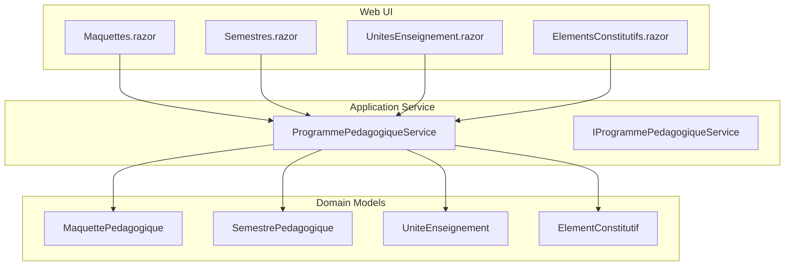
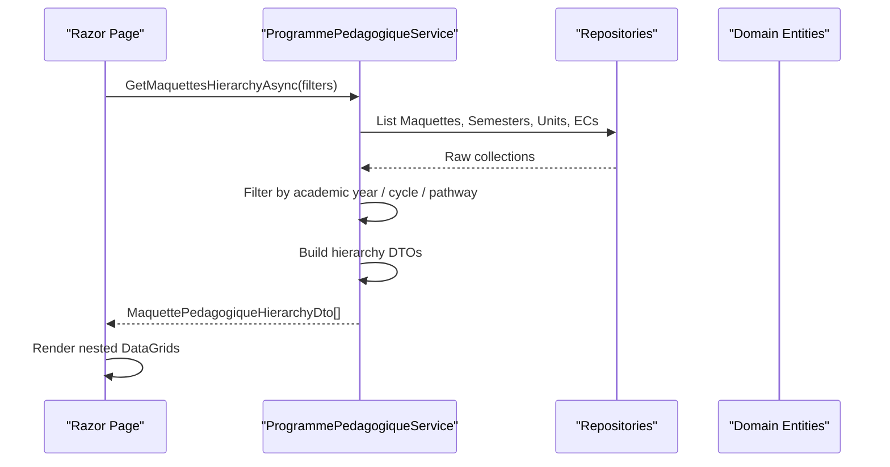
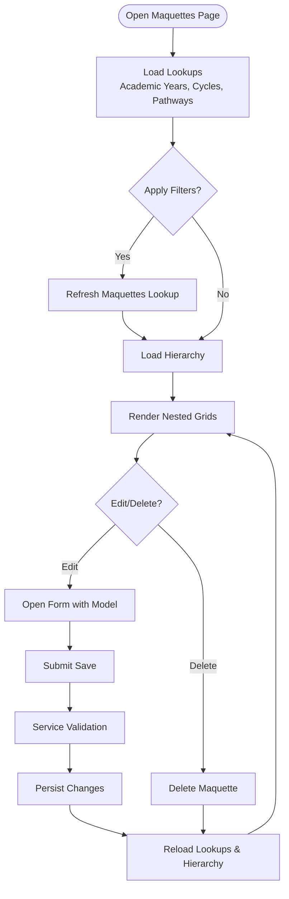
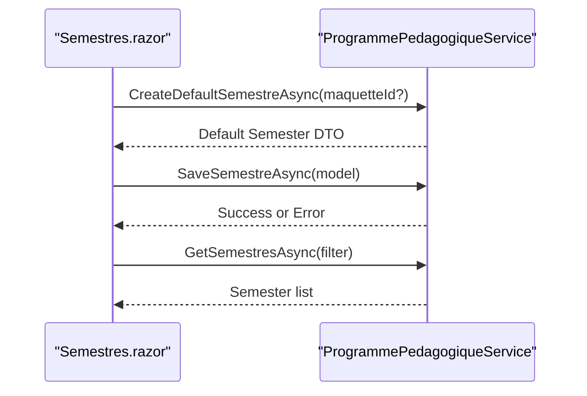
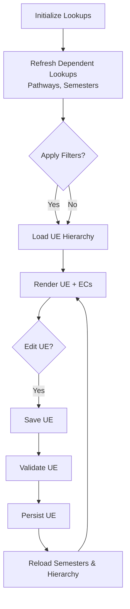
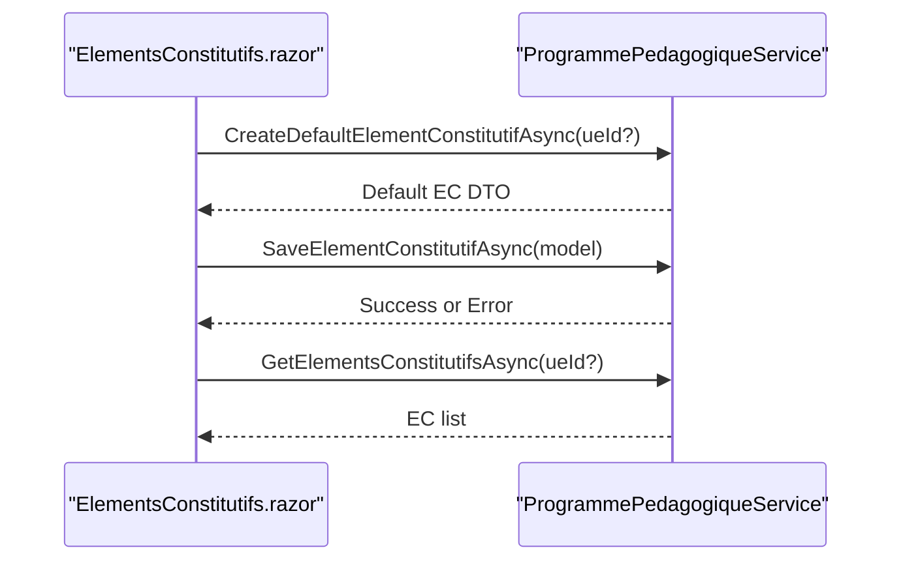
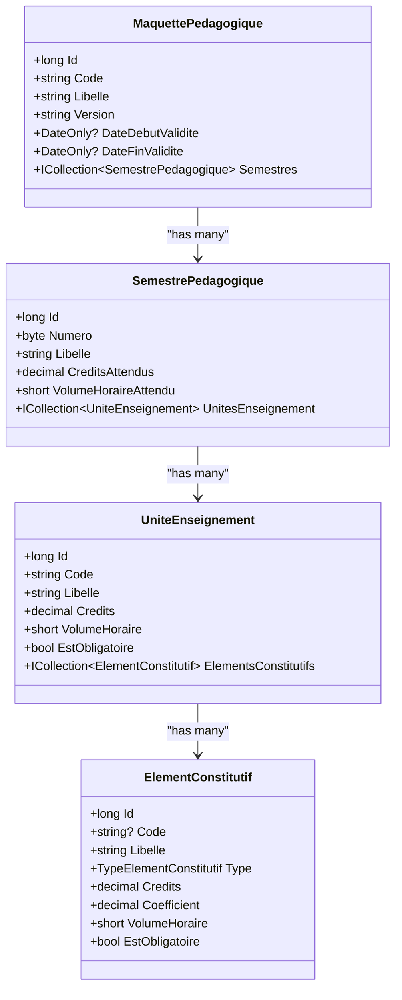

# Academic Programs UI

<cite>
**Referenced Files in This Document**
- [Maquettes.razor](file://RIIS.Academic.Web/Components/Pages/Programme/Maquettes.razor)
- [Semestres.razor](file://RIIS.Academic.Web/Components/Pages/Programme/Semestres.razor)
- [UnitesEnseignement.razor](file://RIIS.Academic.Web/Components/Pages/Programme/UnitesEnseignement.razor)
- [ElementsConstitutifs.razor](file://RIIS.Academic.Web/Components/Pages/Programme/ElementsConstitutifs.razor)
- [IProgrammePedagogiqueService.cs](file://RIIS.Academic.Application/Programmes/Services/IProgrammePedagogiqueService.cs)
- [ProgrammePedagogiqueService.cs](file://RIIS.Academic.Application/Programmes/Services/ProgrammePedagogiqueService.cs)
- [MaquettePedagogiqueHierarchyDto.cs](file://RIIS.Academic.Application/Programmes/Dtos/MaquettePedagogiqueHierarchyDto.cs)
- [SemestrePedagogiqueHierarchyDto.cs](file://RIIS.Academic.Application/Programmes/Dtos/SemestrePedagogiqueHierarchyDto.cs)
- [UniteEnseignementHierarchyDto.cs](file://RIIS.Academic.Application/Programmes/Dtos/UniteEnseignementHierarchyDto.cs)
- [ElementConstitutifHierarchyDto.cs](file://RIIS.Academic.Application/Programmes/Dtos/ElementConstitutifHierarchyDto.cs)
- [MaquettePedagogique.cs](file://RIIS.Academic.Domain/Programmes/MaquettePedagogique.cs)
- [SemestrePedagogique.cs](file://RIIS.Academic.Domain/Programmes/SemestrePedagogique.cs)
- [UniteEnseignement.cs](file://RIIS.Academic.Domain/Programmes/UniteEnseignement.cs)
- [ElementConstitutif.cs](file://RIIS.Academic.Domain/Programmes/ElementConstitutif.cs)
</cite>

## Table of Contents
1. Introduction
2. Project Structure
3. Core Components
4. Architecture Overview
5. Detailed Component Analysis
6. Dependency Analysis
7. Performance Considerations
8. Troubleshooting Guide
9. Conclusion

## Introduction
This document explains the academic programs user interface for managing the curriculum hierarchy: Maquettes (program versions), Semesters, Course Units (UE), and Constituent Elements (EC). It covers tree navigation patterns, hierarchical data editing, validation rules, and curriculum planning workflows exposed by the Web UI and Application services. Drag-and-drop is not implemented in these components; interactions are form-based with filtering and nested grid views.

## Project Structure
The UI is organized as Razor pages under Programme, each page focusing on one level of the hierarchy and using a shared service to read/write data. The application layer provides hierarchical DTOs that mirror the domain model and expose filtered lists for complex scenarios.

**Diagram sources**
- [Maquettes.razor:1-230](file://RIIS.Academic.Web/Components/Pages/Programme/Maquettes.razor#L1-L230)
- [Semestres.razor:1-192](file://RIIS.Academic.Web/Components/Pages/Programme/Semestres.razor#L1-L192)
- [UnitesEnseignement.razor:1-373](file://RIIS.Academic.Web/Components/Pages/Programme/UnitesEnseignement.razor#L1-L373)
- [ElementsConstitutifs.razor:1-236](file://RIIS.Academic.Web/Components/Pages/Programme/ElementsConstitutifs.razor#L1-L236)
- [ProgrammePedagogiqueService.cs:8-17](file://RIIS.Academic.Application/Programmes/Services/ProgrammePedagogiqueService.cs#L8-L17)
- [MaquettePedagogique.cs:5-30](file://RIIS.Academic.Domain/Programmes/MaquettePedagogique.cs#L5-L30)
- [SemestrePedagogique.cs:3-19](file://RIIS.Academic.Domain/Programmes/SemestrePedagogique.cs#L3-L19)
- [UniteEnseignement.cs:3-17](file://RIIS.Academic.Domain/Programmes/UniteEnseignement.cs#L3-L17)
- [ElementConstitutif.cs:3-20](file://RIIS.Academic.Domain/Programmes/ElementConstitutif.cs#L3-L20)

**Section sources**
- [Maquettes.razor:1-230](file://RIIS.Academic.Web/Components/Pages/Programme/Maquettes.razor#L1-L230)
- [Semestres.razor:1-192](file://RIIS.Academic.Web/Components/Pages/Programme/Semestres.razor#L1-L192)
- [UnitesEnseignement.razor:1-373](file://RIIS.Academic.Web/Components/Pages/Programme/UnitesEnseignement.razor#L1-L373)
- [ElementsConstitutifs.razor:1-236](file://RIIS.Academic.Web/Components/Pages/Programme/ElementsConstitutifs.razor#L1-L236)
- [ProgrammePedagogiqueService.cs:8-17](file://RIIS.Academic.Application/Programmes/Services/ProgrammePedagogiqueService.cs#L8-L17)

## Core Components
- Maquettes (Program Versions): Create/edit program versions with validity windows and status; view nested semesters, units, and elements.
- Semestres (Semesters): Manage semester metadata within a maquette, including credits and workload targets.
- UnitesEnseignement (Course Units): Define units within semesters, mark them mandatory, and associate constituent elements.
- ElementsConstitutifs (Constituent Elements): Define teaching activities or assessments within a unit, including credits, coefficients, and workload.

Key behaviors:
- Hierarchical reads via DTOs that embed child collections for tree-like display.
- Filtered lookups for dependent dropdowns (e.g., semesters based on academic year/cycle/pathway).
- Validation enforced at the service layer before persistence.

**Section sources**
- [Maquettes.razor:66-230](file://RIIS.Academic.Web/Components/Pages/Programme/Maquettes.razor#L66-L230)
- [Semestres.razor:26-100](file://RIIS.Academic.Web/Components/Pages/Programme/Semestres.razor#L26-L100)
- [UnitesEnseignement.razor:88-214](file://RIIS.Academic.Web/Components/Pages/Programme/UnitesEnseignement.razor#L88-L214)
- [ElementsConstitutifs.razor:35-130](file://RIIS.Academic.Web/Components/Pages/Programme/ElementsConstitutifs.razor#L35-L130)
- [ProgrammePedagogiqueService.cs:151-226](file://RIIS.Academic.Application/Programmes/Services/ProgrammePedagogiqueService.cs#L151-L226)
- [ProgrammePedagogiqueService.cs:290-352](file://RIIS.Academic.Application/Programmes/Services/ProgrammePedagogiqueService.cs#L290-L352)
- [ProgrammePedagogiqueService.cs:518-574](file://RIIS.Academic.Application/Programmes/Services/ProgrammePedagogiqueService.cs#L518-L574)
- [ProgrammePedagogiqueService.cs:634-712](file://RIIS.Academic.Application/Programmes/Services/ProgrammePedagogiqueService.cs#L634-L712)

## Architecture Overview
The UI calls the application service which loads domain entities, applies filters, and maps to hierarchical DTOs. The UI renders nested grids to visualize the curriculum structure.

**Diagram sources**
- [Maquettes.razor:256-287](file://RIIS.Academic.Web/Components/Pages/Programme/Maquettes.razor#L256-L287)
- [ProgrammePedagogiqueService.cs:33-130](file://RIIS.Academic.Application/Programmes/Services/ProgrammePedagogiqueService.cs#L33-L130)
- [MaquettePedagogiqueHierarchyDto.cs:5-19](file://RIIS.Academic.Application/Programmes/Dtos/MaquettePedagogiqueHierarchyDto.cs#L5-L19)
- [SemestrePedagogiqueHierarchyDto.cs:3-13](file://RIIS.Academic.Application/Programmes/Dtos/SemestrePedagogiqueHierarchyDto.cs#L3-L13)
- [UniteEnseignementHierarchyDto.cs:3-15](file://RIIS.Academic.Application/Programmes/Dtos/UniteEnseignementHierarchyDto.cs#L3-L15)
- [ElementConstitutifHierarchyDto.cs:5-17](file://RIIS.Academic.Application/Programmes/Dtos/ElementConstitutifHierarchyDto.cs#L5-L17)

## Detailed Component Analysis

### Maquettes (Program Versions)
- Purpose: Manage program versions linked to pathways, with validity dates and status. Provides a full hierarchical view down to ECs.
- Tree navigation: Nested RadzenDataGrids render Maquette → Semesters → Units → ECs. Empty states inform users when children are missing.
- Form scenario: Create/Edit uses a template form with required validators and date pickers bound to DateOnly fields.
- Filtering: Dropdowns for academic year, cycle, and maquette; filter refreshes dependent options and re-loads hierarchy.
- Validation: Service enforces required fields, version normalization, uniqueness per pathway/code/version, and valid date ranges.

**Diagram sources**
- [Maquettes.razor:256-302](file://RIIS.Academic.Web/Components/Pages/Programme/Maquettes.razor#L256-L302)
- [Maquettes.razor:304-369](file://RIIS.Academic.Web/Components/Pages/Programme/Maquettes.razor#L304-L369)
- [ProgrammePedagogiqueService.cs:151-226](file://RIIS.Academic.Application/Programmes/Services/ProgrammePedagogiqueService.cs#L151-L226)

**Section sources**
- [Maquettes.razor:1-230](file://RIIS.Academic.Web/Components/Pages/Programme/Maquettes.razor#L1-L230)
- [Maquettes.razor:233-389](file://RIIS.Academic.Web/Components/Pages/Programme/Maquettes.razor#L233-L389)
- [ProgrammePedagogiqueService.cs:33-130](file://RIIS.Academic.Application/Programmes/Services/ProgrammePedagogiqueService.cs#L33-L130)
- [ProgrammePedagogiqueService.cs:151-226](file://RIIS.Academic.Application/Programmes/Services/ProgrammePedagogiqueService.cs#L151-L226)
- [MaquettePedagogiqueHierarchyDto.cs:5-19](file://RIIS.Academic.Application/Programmes/Dtos/MaquettePedagogiqueHierarchyDto.cs#L5-L19)

### Semestres (Semesters)
- Purpose: Manage semesters attached to a maquette, including number, label, expected credits/hours, and display order.
- Tree navigation: Flat list with actions; parent context provided via dropdown filter.
- Form scenario: Template form with numeric constraints and required validators.
- Filtering: Optional filter by maquette; reset clears selection and reloads.

**Diagram sources**
- [Semestres.razor:134-173](file://RIIS.Academic.Web/Components/Pages/Programme/Semestres.razor#L134-L173)
- [ProgrammePedagogiqueService.cs:269-352](file://RIIS.Academic.Application/Programmes/Services/ProgrammePedagogiqueService.cs#L269-L352)

**Section sources**
- [Semestres.razor:1-192](file://RIIS.Academic.Web/Components/Pages/Programme/Semestres.razor#L1-L192)
- [ProgrammePedagogiqueService.cs:234-352](file://RIIS.Academic.Application/Programmes/Services/ProgrammePedagogiqueService.cs#L234-L352)

### UnitesEnseignement (Course Units)
- Purpose: Define units within semesters, set credits/hours, ordering, and mandatory flag; show associated ECs.
- Tree navigation: Hierarchical view grouped by semester; nested grid shows ECs under each UE.
- Dependent filters: Academic year, cycle, pathway, and semester influence available semesters and results.
- Form scenario: Create/Edit form with required fields and numeric constraints.

**Diagram sources**
- [UnitesEnseignement.razor:230-301](file://RIIS.Academic.Web/Components/Pages/Programme/UnitesEnseignement.razor#L230-L301)
- [ProgrammePedagogiqueService.cs:418-486](file://RIIS.Academic.Application/Programmes/Services/ProgrammePedagogiqueService.cs#L418-L486)
- [ProgrammePedagogiqueService.cs:518-574](file://RIIS.Academic.Application/Programmes/Services/ProgrammePedagogiqueService.cs#L518-L574)

**Section sources**
- [UnitesEnseignement.razor:1-373](file://RIIS.Academic.Web/Components/Pages/Programme/UnitesEnseignement.razor#L1-L373)
- [ProgrammePedagogiqueService.cs:382-486](file://RIIS.Academic.Application/Programmes/Services/ProgrammePedagogiqueService.cs#L382-L486)
- [ProgrammePedagogiqueService.cs:518-574](file://RIIS.Academic.Application/Programmes/Services/ProgrammePedagogiqueService.cs#L518-L574)

### ElementsConstitutifs (Constituent Elements)
- Purpose: Manage ECs within a UE, including type, credits, coefficient, hours, ordering, and mandatory flag.
- Tree navigation: Flat list filtered by UE; no nested view here but visible counts in higher levels.
- Form scenario: Template form with type dropdown and numeric constraints; informational note about default coefficient behavior.
- Filtering: By UE; live reload on change.

**Diagram sources**
- [ElementsConstitutifs.razor:175-215](file://RIIS.Academic.Web/Components/Pages/Programme/ElementsConstitutifs.razor#L175-L215)
- [ProgrammePedagogiqueService.cs:613-712](file://RIIS.Academic.Application/Programmes/Services/ProgrammePedagogiqueService.cs#L613-L712)

**Section sources**
- [ElementsConstitutifs.razor:1-236](file://RIIS.Academic.Web/Components/Pages/Programme/ElementsConstitutifs.razor#L1-L236)
- [ProgrammePedagogiqueService.cs:582-712](file://RIIS.Academic.Application/Programmes/Services/ProgrammePedagogiqueService.cs#L582-L712)

## Dependency Analysis
- UI pages depend on IProgrammePedagogiqueService for all CRUD and lookup operations.
- Service depends on multiple repositories to load domain entities and build hierarchical DTOs.
- Domain models define relationships: Maquette → Semesters → Units → ECs.
- Hierarchical DTOs mirror this structure for efficient rendering.

**Diagram sources**
- [MaquettePedagogique.cs:5-30](file://RIIS.Academic.Domain/Programmes/MaquettePedagogique.cs#L5-L30)
- [SemestrePedagogique.cs:3-19](file://RIIS.Academic.Domain/Programmes/SemestrePedagogique.cs#L3-L19)
- [UniteEnseignement.cs:3-17](file://RIIS.Academic.Domain/Programmes/UniteEnseignement.cs#L3-L17)
- [ElementConstitutif.cs:3-20](file://RIIS.Academic.Domain/Programmes/ElementConstitutif.cs#L3-L20)

**Section sources**
- [IProgrammePedagogiqueService.cs:8-64](file://RIIS.Academic.Application/Programmes/Services/IProgrammePedagogiqueService.cs#L8-L64)
- [ProgrammePedagogiqueService.cs:8-17](file://RIIS.Academic.Application/Programmes/Services/ProgrammePedagogiqueService.cs#L8-L17)

## Performance Considerations
- Hierarchical queries load all related entities into memory and then filter/map in-process. For large datasets, consider server-side pagination or query composition to reduce payload size.
- Repeated lookups (academic years, cycles, pathways) are cached per page lifecycle; ensure appropriate caching strategies if used across sessions.
- Avoid unnecessary re-renders by minimizing state changes and leveraging conditional rendering for forms and alerts.

[No sources needed since this section provides general guidance]

## Troubleshooting Guide
Common validation errors surfaced by the service:
- Missing or invalid references: e.g., selecting an unfindable pathway, maquette, semester, or unit triggers explicit exceptions.
- Duplicate keys: Unique constraints enforced per scope (e.g., duplicate code/version for maquette; duplicate semester number per maquette; duplicate unit code per semester; duplicate EC code/order per unit).
- Invalid numeric/date values: Negative credits/hours, out-of-range semester numbers, or invalid date ranges raise exceptions.

User feedback:
- UI catches exceptions and displays notifications via NotificationService.
- Forms use required validators to prevent obvious client-side issues.

Operational tips:
- When changing filters (academic year/cycle/pathway), dependent dropdowns are refreshed to avoid stale selections.
- Resetting filters clears selections and reloads data to consistent state.

**Section sources**
- [ProgrammePedagogiqueService.cs:151-226](file://RIIS.Academic.Application/Programmes/Services/ProgrammePedagogiqueService.cs#L151-L226)
- [ProgrammePedagogiqueService.cs:290-352](file://RIIS.Academic.Application/Programmes/Services/ProgrammePedagogiqueService.cs#L290-L352)
- [ProgrammePedagogiqueService.cs:518-574](file://RIIS.Academic.Application/Programmes/Services/ProgrammePedagogiqueService.cs#L518-L574)
- [ProgrammePedagogiqueService.cs:634-712](file://RIIS.Academic.Application/Programmes/Services/ProgrammePedagogiqueService.cs#L634-L712)
- [Maquettes.razor:331-369](file://RIIS.Academic.Web/Components/Pages/Programme/Maquettes.razor#L331-L369)
- [Semestres.razor:159-185](file://RIIS.Academic.Web/Components/Pages/Programme/Semestres.razor#L159-L185)
- [UnitesEnseignement.razor:328-355](file://RIIS.Academic.Web/Components/Pages/Programme/UnitesEnseignement.razor#L328-L355)
- [ElementsConstitutifs.razor:201-227](file://RIIS.Academic.Web/Components/Pages/Programme/ElementsConstitutifs.razor#L201-L227)

## Conclusion
The academic programs UI provides a structured, hierarchical management experience for curricula through clear separation between UI pages and application services. Validation and dependency checks are centralized in the service layer, ensuring data integrity across the Maquette → Semester → Unit → EC hierarchy. While drag-and-drop is not present, the combination of dependent filters, nested grids, and robust validation supports effective curriculum planning and maintenance.

[No sources needed since this section summarizes without analyzing specific files]