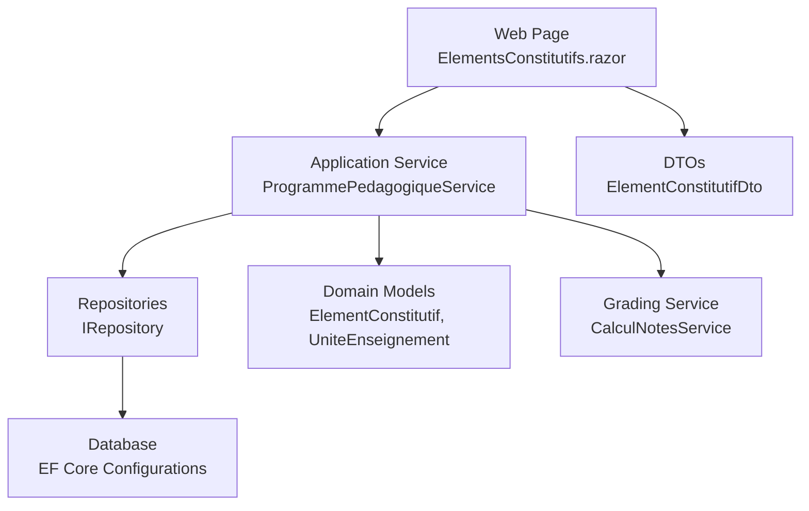
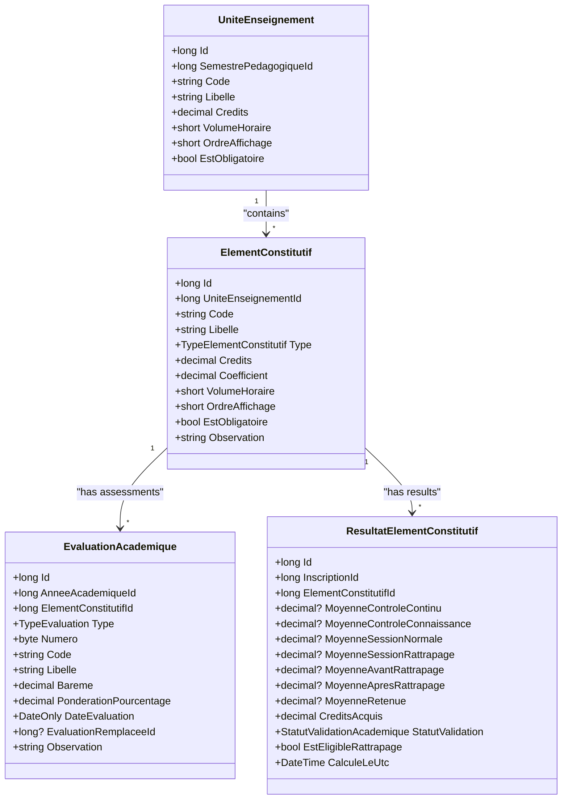
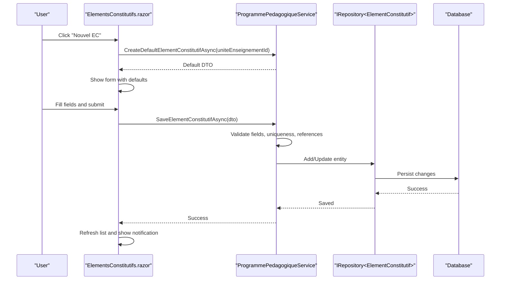
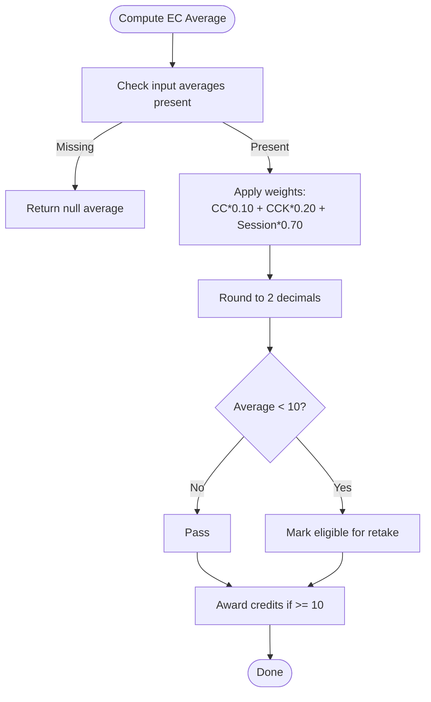
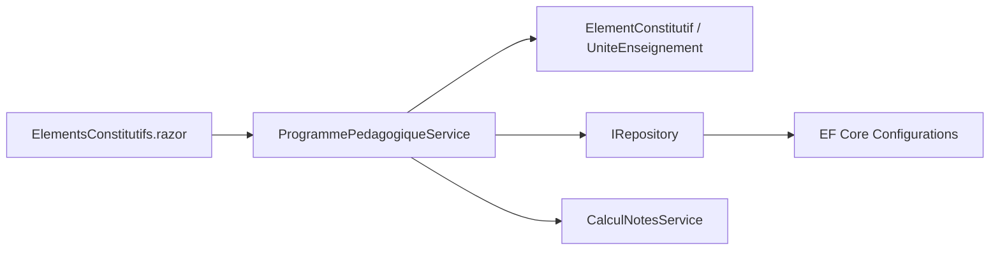

# Constituent Elements Management

<cite>
**Referenced Files in This Document**
- [ElementsConstitutifs.razor](file://RIIS.Academic.Web/Components/Pages/Programme/ElementsConstitutifs.razor)
- [IProgrammePedagogiqueService.cs](file://RIIS.Academic.Application/Programmes/Services/IProgrammePedagogiqueService.cs)
- [ProgrammePedagogiqueService.cs](file://RIIS.Academic.Application/Programmes/Services/ProgrammePedagogiqueService.cs)
- [ElementConstitutifDto.cs](file://RIIS.Academic.Application/Programmes/Dtos/ElementConstitutifDto.cs)
- [ElementConstitutif.cs](file://RIIS.Academic.Domain/Programmes/ElementConstitutif.cs)
- [UniteEnseignement.cs](file://RIIS.Academic.Domain/Programmes/UniteEnseignement.cs)
- [TypeElementConstitutif.cs](file://RIIS.Academic.Domain/Enums/TypeElementConstitutif.cs)
- [EvaluationAcademique.cs](file://RIIS.Academic.Domain/Notes/EvaluationAcademique.cs)
- [TypeEvaluation.cs](file://RIIS.Academic.Domain/Enums/TypeEvaluation.cs)
- [ResultatElementConstitutif.cs](file://RIIS.Academic.Domain/Notes/ResultatElementConstitutif.cs)
- [StatutValidationAcademique.cs](file://RIIS.Academic.Domain/Enums/StatutValidationAcademique.cs)
- [CalculNotesService.cs](file://RIIS.Academic.Application/Notes/Services/CalculNotesService.cs)
- [ElementConstitutifConfiguration.cs](file://RIIS.Academic.Infrastructure/Persistence/Configurations/Programmes/ElementConstitutifConfiguration.cs)
- [EvaluationAcademiqueConfiguration.cs](file://RIIS.Academic.Infrastructure/Persistence/Configurations/Notes/EvaluationAcademiqueConfiguration.cs)
</cite>

## Table of Contents
1. [Introduction](#introduction)
2. [Project Structure](#project-structure)
3. [Core Components](#core-components)
4. [Architecture Overview](#architecture-overview)
5. [Detailed Component Analysis](#detailed-component-analysis)
6. [Dependency Analysis](#dependency-analysis)
7. [Performance Considerations](#performance-considerations)
8. [Troubleshooting Guide](#troubleshooting-guide)
9. [Conclusion](#conclusion)

## Introduction
This document explains the constituent elements (Éléments Constitutifs, EC) management interface and its integration with academic structure, assessments, grading, and validation. It focuses on the finest level of academic organization: courses, workshops, and practical sessions within course units (Unités d’Enseignement, UE). It covers element types, assessment methods, grading coefficients, evaluation criteria, scheduling examples, resource allocation considerations, and validation rules for academic integrity and resource optimization.

## Project Structure
The constituent elements feature spans three layers:
- Web UI: A Blazor page to create, filter, edit, and delete ECs, bound to a service layer via DTOs.
- Application: Services that validate inputs, enforce business rules, and coordinate persistence through repositories.
- Domain & Infrastructure: Entities, enums, DTOs, and database configurations that define constraints and relationships.

**Diagram sources**
- [ElementsConstitutifs.razor:1-236](file://RIIS.Academic.Web/Components/Pages/Programme/ElementsConstitutifs.razor#L1-L236)
- [ProgrammePedagogiqueService.cs:582-718](file://RIIS.Academic.Application/Programmes/Services/ProgrammePedagogiqueService.cs#L582-L718)
- [ElementConstitutifConfiguration.cs:1-31](file://RIIS.Academic.Infrastructure/Persistence/Configurations/Programmes/ElementConstitutifConfiguration.cs#L1-L31)
- [CalculNotesService.cs:1-25](file://RIIS.Academic.Application/Notes/Services/CalculNotesService.cs#L1-L25)

**Section sources**
- [ElementsConstitutifs.razor:1-236](file://RIIS.Academic.Web/Components/Pages/Programme/ElementsConstitutifs.razor#L1-L236)
- [IProgrammePedagogiqueService.cs:43-47](file://RIIS.Academic.Application/Programmes/Services/IProgrammePedagogiqueService.cs#L43-L47)
- [ProgrammePedagogiqueService.cs:582-718](file://RIIS.Academic.Application/Programmes/Services/ProgrammePedagogiqueService.cs#L582-L718)

## Core Components
- ElementConstitutif: Represents the smallest academic unit under a UE, including code, label, type, credits, coefficient, hourly volume, display order, mandatory flag, and observation.
- TypeElementConstitutif: Enumerates EC types such as lecture, internship, project, thesis, and other.
- EvaluationAcademique: Defines assessments linked to an EC, including type (continuous control, knowledge control, normal session, retake), weighting, schedule, and replacement relationships.
- ResultatElementConstitutif: Stores per-student results for an EC across different assessment modes and computes credit acquisition and validation status.
- ProgrammePedagogiqueService: Validates and persists EC data, enforces uniqueness and ordering constraints, and returns enriched DTOs.
- CalculNotesService: Implements grade aggregation and eligibility logic for retakes and credit acquisition.

Key responsibilities:
- UI binds to ElementConstitutifDto and calls service methods to save or delete ECs.
- Service validates required fields, numeric ranges, uniqueness of codes and display orders, and ensures referential integrity with UEs.
- Database configuration enforces non-negative values and unique indexes for code and order within a UE.
- Grading service calculates final averages and determines eligibility for retakes and credit acquisition based on thresholds.

**Section sources**
- [ElementConstitutif.cs:1-21](file://RIIS.Academic.Domain/Programmes/ElementConstitutif.cs#L1-L21)
- [TypeElementConstitutif.cs:1-11](file://RIIS.Academic.Domain/Enums/TypeElementConstitutif.cs#L1-L11)
- [EvaluationAcademique.cs:1-24](file://RIIS.Academic.Domain/Notes/EvaluationAcademique.cs#L1-L24)
- [ResultatElementConstitutif.cs:1-23](file://RIIS.Academic.Domain/Notes/ResultatElementConstitutif.cs#L1-L23)
- [ProgrammePedagogiqueService.cs:634-718](file://RIIS.Academic.Application/Programmes/Services/ProgrammePedagogiqueService.cs#L634-L718)
- [CalculNotesService.cs:1-25](file://RIIS.Academic.Application/Notes/Services/CalculNotesService.cs#L1-L25)

## Architecture Overview
The system follows clean architecture principles:
- Presentation layer (Blazor) uses DTOs and services to manage ECs.
- Application layer encapsulates business rules and orchestrates domain operations.
- Domain layer defines entities and enums representing academic concepts.
- Infrastructure layer configures EF mappings and constraints.

**Diagram sources**
- [ElementConstitutif.cs:1-21](file://RIIS.Academic.Domain/Programmes/ElementConstitutif.cs#L1-L21)
- [UniteEnseignement.cs:1-18](file://RIIS.Academic.Domain/Programmes/UniteEnseignement.cs#L1-L18)
- [EvaluationAcademique.cs:1-24](file://RIIS.Academic.Domain/Notes/EvaluationAcademique.cs#L1-L24)
- [ResultatElementConstitutif.cs:1-23](file://RIIS.Academic.Domain/Notes/ResultatElementConstitutif.cs#L1-L23)

## Detailed Component Analysis

### Constituent Elements Interface (Web Layer)
The Blazor page provides:
- Create/Edit form with validation for required fields (UE, label), numeric constraints (credits, coefficient, hourly volume, display order), and optional observation.
- Filtering by UE and reset functionality.
- Data grid displaying EC attributes and actions (edit/delete).
- Integration with service for default creation, saving, and deletion.

Validation highlights:
- Required validators ensure UE and label are provided.
- Numeric controls enforce non-negative values.
- Success/error notifications guide users.

**Diagram sources**
- [ElementsConstitutifs.razor:175-215](file://RIIS.Academic.Web/Components/Pages/Programme/ElementsConstitutifs.razor#L175-L215)
- [ProgrammePedagogiqueService.cs:613-718](file://RIIS.Academic.Application/Programmes/Services/ProgrammePedagogiqueService.cs#L613-L718)

**Section sources**
- [ElementsConstitutifs.razor:1-236](file://RIIS.Academic.Web/Components/Pages/Programme/ElementsConstitutifs.razor#L1-L236)
- [IProgrammePedagogiqueService.cs:43-47](file://RIIS.Academic.Application/Programmes/Services/IProgrammePedagogiqueService.cs#L43-L47)

### Business Rules and Validation (Application Layer)
The service enforces:
- Mandatory UE reference.
- Non-negative credits, coefficient, and hourly volume.
- Normalization of code and label; default coefficient set to 1 if zero.
- Uniqueness of code within a UE (when provided).
- Uniqueness of display order within a UE.
- Referential integrity checks for UE existence.

These rules prevent inconsistent academic structures and maintain data quality.

**Section sources**
- [ProgrammePedagogiqueService.cs:634-718](file://RIIS.Academic.Application/Programmes/Services/ProgrammePedagogiqueService.cs#L634-L718)

### Data Model and Constraints (Domain & Infrastructure)
Entity definitions and database constraints ensure:
- Non-negative credits, coefficient, and hourly volume at the database level.
- Unique indexes for code and display order within a UE.
- Relationships between ECs and UEs with cascade delete.

Assessment model:
- Evaluations link to ECs and include type, weighting, scheduling, and replacement relationships.
- Results store multiple average fields for different assessment modes and compute credit acquisition and validation status.

**Section sources**
- [ElementConstitutifConfiguration.cs:1-31](file://RIIS.Academic.Infrastructure/Persistence/Configurations/Programmes/ElementConstitutifConfiguration.cs#L1-L31)
- [EvaluationAcademiqueConfiguration.cs:1-26](file://RIIS.Academic.Infrastructure/Persistence/Configurations/Notes/EvaluationAcademiqueConfiguration.cs#L1-L26)
- [EvaluationAcademique.cs:1-24](file://RIIS.Academic.Domain/Notes/EvaluationAcademique.cs#L1-L24)
- [ResultatElementConstitutif.cs:1-23](file://RIIS.Academic.Domain/Notes/ResultatElementConstitutif.cs#L1-L23)

### Grading Logic and Academic Integrity
Grade calculation:
- Final average combines continuous control, knowledge control, and session scores with fixed weights.
- Retake eligibility is determined by thresholding the final average.
- Credit acquisition depends on whether the retained average meets the passing threshold.

Integration points:
- The service exposes methods to retrieve and save ECs; grading calculations are performed by the dedicated notes service.
- Results capture multiple average fields and statuses to support complex academic workflows.

**Diagram sources**
- [CalculNotesService.cs:9-24](file://RIIS.Academic.Application/Notes/Services/CalculNotesService.cs#L9-L24)

**Section sources**
- [CalculNotesService.cs:1-25](file://RIIS.Academic.Application/Notes/Services/CalculNotesService.cs#L1-L25)
- [StatutValidationAcademique.cs:1-9](file://RIIS.Academic.Domain/Enums/StatutValidationAcademique.cs#L1-L9)

### Assessment Methods and Types
Assessment types:
- Continuous control, knowledge control, normal session, retake session.
- Each assessment has a code, label, weighting percentage, and optional date.
- Replacement relationships allow one assessment to replace another (e.g., retake replacing original).

Scheduling example:
- Assign dates to evaluations to plan lectures, workshops, and practical sessions.
- Use numbering to sequence multiple assessments within an EC.

Resource allocation example:
- Map EC types to resources: lectures to classrooms, workshops to labs, projects to supervised spaces.
- Ensure hourly volumes align with available resources and schedules.

**Section sources**
- [TypeEvaluation.cs:1-10](file://RIIS.Academic.Domain/Enums/TypeEvaluation.cs#L1-L10)
- [EvaluationAcademique.cs:1-24](file://RIIS.Academic.Domain/Notes/EvaluationAcademique.cs#L1-L24)

### Element Types and Academic Structure
EC types:
- Lecture (Cours), Internship (Stage), Project (Projet), Thesis (Mémoire), Other (Autre).
- Each EC belongs to a UE and contributes credits and hourly volume to the program.

Hierarchy:
- Programmes contain semesters, which contain UEs, which contain ECs.
- ECs host assessments and produce results used for validation and transcripts.

**Section sources**
- [TypeElementConstitutif.cs:1-11](file://RIIS.Academic.Domain/Enums/TypeElementConstitutif.cs#L1-L11)
- [UniteEnseignement.cs:1-18](file://RIIS.Academic.Domain/Programmes/UniteEnseignement.cs#L1-L18)
- [ElementConstitutif.cs:1-21](file://RIIS.Academic.Domain/Programmes/ElementConstitutif.cs#L1-L21)

## Dependency Analysis
Coupling and cohesion:
- UI depends on application service via DTOs, keeping presentation decoupled from domain details.
- Application service coordinates repositories and domain models, enforcing business rules centrally.
- Domain entities define clear relationships and invariants; infrastructure maps them to the database with constraints.

Potential circular dependencies:
- None observed; dependencies flow downward from UI to application to domain to infrastructure.

External integrations:
- EF Core for persistence.
- Blazor components for user interaction.

**Diagram sources**
- [ElementsConstitutifs.razor:1-236](file://RIIS.Academic.Web/Components/Pages/Programme/ElementsConstitutifs.razor#L1-L236)
- [ProgrammePedagogiqueService.cs:582-718](file://RIIS.Academic.Application/Programmes/Services/ProgrammePedagogiqueService.cs#L582-L718)
- [ElementConstitutifConfiguration.cs:1-31](file://RIIS.Academic.Infrastructure/Persistence/Configurations/Programmes/ElementConstitutifConfiguration.cs#L1-L31)
- [CalculNotesService.cs:1-25](file://RIIS.Academic.Application/Notes/Services/CalculNotesService.cs#L1-L25)

**Section sources**
- [IProgrammePedagogiqueService.cs:43-47](file://RIIS.Academic.Application/Programmes/Services/IProgrammePedagogiqueService.cs#L43-L47)
- [ProgrammePedagogiqueService.cs:582-718](file://RIIS.Academic.Application/Programmes/Services/ProgrammePedagogiqueService.cs#L582-L718)

## Performance Considerations
- Filtering by UE reduces dataset size for lists and grids.
- Unique indexes on code and display order improve query performance and enforce integrity efficiently.
- Avoid excessive joins in UI; rely on service-layer enrichment where needed.
- Use pagination and sorting in data grids to optimize rendering.

[No sources needed since this section provides general guidance]

## Troubleshooting Guide
Common issues and resolutions:
- Missing UE or label: Form validation will block submission; ensure required fields are filled.
- Duplicate code or order: Service throws an error indicating duplication; adjust code or order to be unique within the UE.
- Negative values: Validation prevents saving; correct numeric fields to non-negative values.
- Grade calculation errors: Ensure all required averages are present before computing final averages; missing inputs result in null averages.

Operational tips:
- Use filters to isolate ECs by UE when troubleshooting specific units.
- Review database constraints and indexes to diagnose integrity issues.
- Leverage notifications in the UI to confirm successful saves or highlight errors.

**Section sources**
- [ProgrammePedagogiqueService.cs:634-718](file://RIIS.Academic.Application/Programmes/Services/ProgrammePedagogiqueService.cs#L634-L718)
- [ElementConstitutifConfiguration.cs:1-31](file://RIIS.Academic.Infrastructure/Persistence/Configurations/Programmes/ElementConstitutifConfiguration.cs#L1-L31)
- [ElementsConstitutifs.razor:175-232](file://RIIS.Academic.Web/Components/Pages/Programme/ElementsConstitutifs.razor#L175-L232)

## Conclusion
The constituent elements management interface provides a robust foundation for organizing academic content at the finest level. It integrates seamlessly with assessments, grading, and validation workflows while enforcing strong business rules and database constraints. By leveraging the layered architecture, the system maintains clarity, scalability, and reliability for managing courses, workshops, and practical sessions within course units.

[No sources needed since this section summarizes without analyzing specific files]