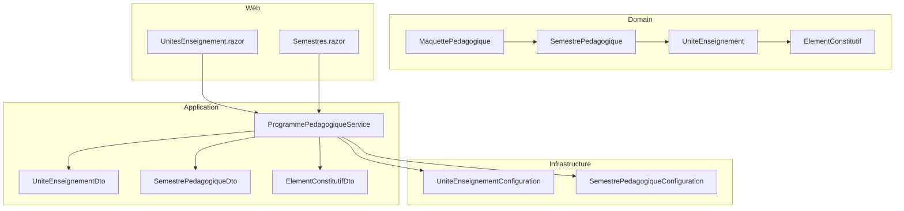
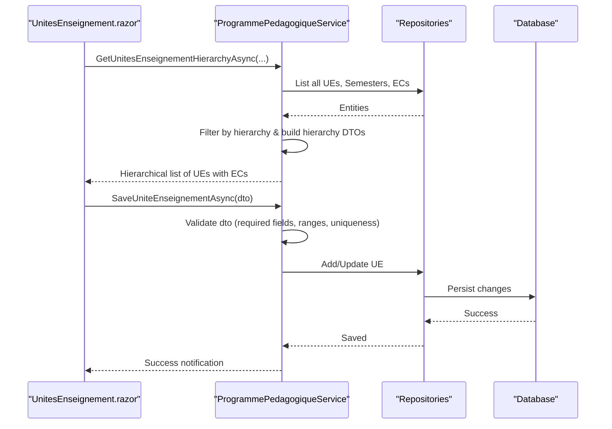
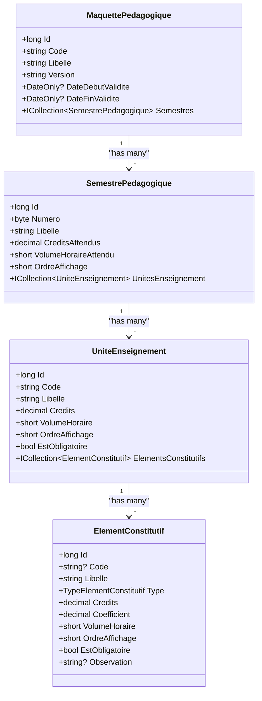
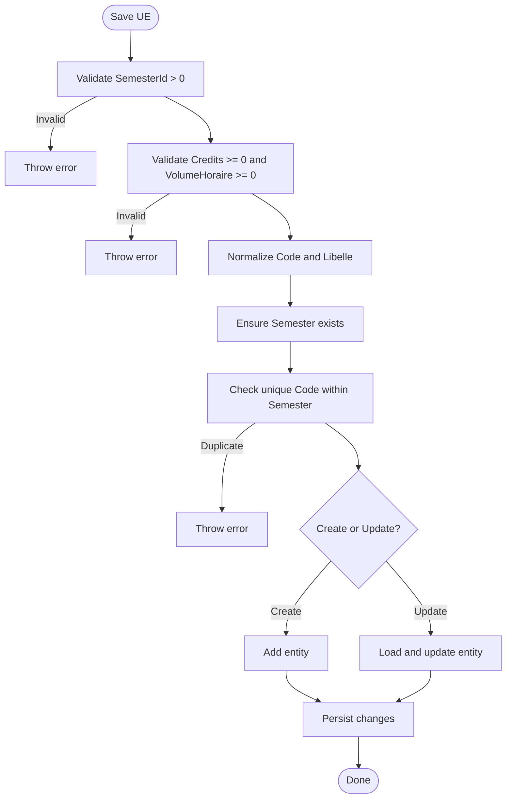
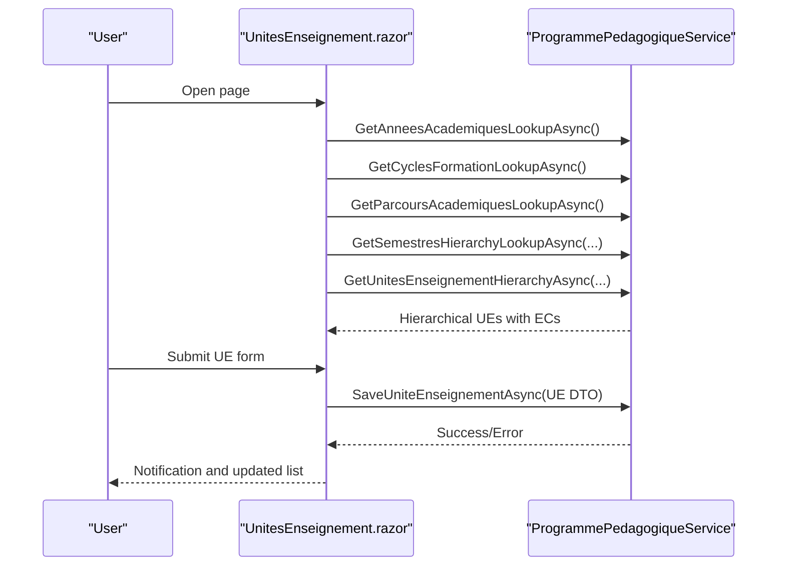
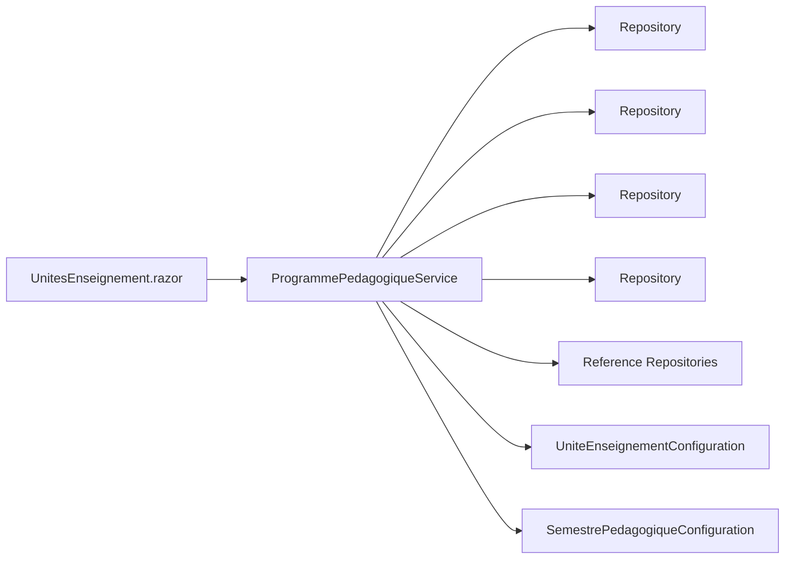

# Course Units Management

<cite>
**Referenced Files in This Document**
- [UniteEnseignement.cs](file://RIIS.Academic.Domain/Programmes/UniteEnseignement.cs)
- [SemestrePedagogique.cs](file://RIIS.Academic.Domain/Programmes/SemestrePedagogique.cs)
- [ElementConstitutif.cs](file://RIIS.Academic.Domain/Programmes/ElementConstitutif.cs)
- [MaquettePedagogique.cs](file://RIIS.Academic.Domain/Programmes/MaquettePedagogique.cs)
- [UniteEnseignementDto.cs](file://RIIS.Academic.Application/Programmes/Dtos/UniteEnseignementDto.cs)
- [SemestrePedagogiqueDto.cs](file://RIIS.Academic.Application/Programmes/Dtos/SemestrePedagogiqueDto.cs)
- [ElementConstitutifDto.cs](file://RIIS.Academic.Application/Programmes/Dtos/ElementConstitutifDto.cs)
- [IProgrammePedagogiqueService.cs](file://RIIS.Academic.Application/Programmes/Services/IProgrammePedagogiqueService.cs)
- [ProgrammePedagogiqueService.cs](file://RIIS.Academic.Application/Programmes/Services/ProgrammePedagogiqueService.cs)
- [UniteEnseignementConfiguration.cs](file://RIIS.Academic.Infrastructure/Persistence/Configurations/Programmes/UniteEnseignementConfiguration.cs)
- [SemestrePedagogiqueConfiguration.cs](file://RIIS.Academic.Infrastructure/Persistence/Configurations/Programmes/SemestrePedagogiqueConfiguration.cs)
- [UnitesEnseignement.razor](file://RIIS.Academic.Web/Components/Pages/Programme/UnitesEnseignement.razor)
- [Semestres.razor](file://RIIS.Academic.Web/Components/Pages/Programme/Semestres.razor)
</cite>

## Table of Contents
1. [Introduction](#introduction)
2. [Project Structure](#project-structure)
3. [Core Components](#core-components)
4. [Architecture Overview](#architecture-overview)
5. [Detailed Component Analysis](#detailed-component-analysis)
6. [Dependency Analysis](#dependency-analysis)
7. [Performance Considerations](#performance-considerations)
8. [Troubleshooting Guide](#troubleshooting-guide)
9. [Conclusion](#conclusion)
10. [Appendices](#appendices)

## Introduction
This document explains the course units (Unités d'Enseignement, UE) management interface and its supporting services. It covers how to create and configure UEs within semesters, allocate credits and teaching hours, define learning objectives via constituent elements, manage hierarchical relationships from academic programs down to individual UEs, and enforce validation rules for academic requirements and scheduling constraints. It also describes workload calculations derived from semester targets and UE/EC contributions, coefficient assignment for constituent elements, and integration points with constituent elements and results.

## Project Structure
The system follows a layered architecture:
- Domain layer defines entities for Maquettes (academic programs), Semesters, UEs, and Constituent Elements (ECs).
- Application layer provides services and DTOs for CRUD operations, hierarchy queries, and lookups.
- Infrastructure layer configures database mappings and constraints.
- Web layer exposes UI pages for managing semesters and UEs with filters and forms.

**Diagram sources**
- [MaquettePedagogique.cs:5-30](file://RIIS.Academic.Domain/Programmes/MaquettePedagogique.cs#L5-L30)
- [SemestrePedagogique.cs:3-19](file://RIIS.Academic.Domain/Programmes/SemestrePedagogique.cs#L3-L19)
- [UniteEnseignement.cs:3-17](file://RIIS.Academic.Domain/Programmes/UniteEnseignement.cs#L3-L17)
- [ElementConstitutif.cs:3-20](file://RIIS.Academic.Domain/Programmes/ElementConstitutif.cs#L3-L20)
- [ProgrammePedagogiqueService.cs:8-17](file://RIIS.Academic.Application/Programmes/Services/ProgrammePedagogiqueService.cs#L8-L17)
- [UniteEnseignementConfiguration.cs:8-22](file://RIIS.Academic.Infrastructure/Persistence/Configurations/Programmes/UniteEnseignementConfiguration.cs#L8-L22)
- [SemestrePedagogiqueConfiguration.cs:8-25](file://RIIS.Academic.Infrastructure/Persistence/Configurations/Programmes/SemestrePedagogiqueConfiguration.cs#L8-L25)
- [UnitesEnseignement.razor:1-15](file://RIIS.Academic.Web/Components/Pages/Programme/UnitesEnseignement.razor#L1-L15)
- [Semestres.razor:1-14](file://RIIS.Academic.Web/Components/Pages/Programme/Semestres.razor#L1-L14)

**Section sources**
- [UniteEnseignement.cs:3-17](file://RIIS.Academic.Domain/Programmes/UniteEnseignement.cs#L3-L17)
- [SemestrePedagogique.cs:3-19](file://RIIS.Academic.Domain/Programmes/SemestrePedagogique.cs#L3-L19)
- [ElementConstitutif.cs:3-20](file://RIIS.Academic.Domain/Programmes/ElementConstitutif.cs#L3-L20)
- [MaquettePedagogique.cs:5-30](file://RIIS.Academic.Domain/Programmes/MaquettePedagogique.cs#L5-L30)
- [ProgrammePedagogiqueService.cs:8-17](file://RIIS.Academic.Application/Programmes/Services/ProgrammePedagogiqueService.cs#L8-L17)
- [UniteEnseignementConfiguration.cs:8-22](file://RIIS.Academic.Infrastructure/Persistence/Configurations/Programmes/UniteEnseignementConfiguration.cs#L8-L22)
- [SemestrePedagogiqueConfiguration.cs:8-25](file://RIIS.Academic.Infrastructure/Persistence/Configurations/Programmes/SemestrePedagogiqueConfiguration.cs#L8-L25)
- [UnitesEnseignement.razor:1-15](file://RIIS.Academic.Web/Components/Pages/Programme/UnitesEnseignement.razor#L1-L15)
- [Semestres.razor:1-14](file://RIIS.Academic.Web/Components/Pages/Programme/Semestres.razor#L1-L14)

## Core Components
- Maquette (Academic Program): Top-level container defining program identity, versioning, validity dates, and links to cycle, level, field, and specialty.
- Semester: Belongs to a Maquette; holds expected credits and teaching hours, number, label, and display order.
- Unité d’Enseignement (UE): Belongs to a Semester; has code, label, credits, teaching hours, display order, and mandatory flag.
- Élément Constitutif (EC): Belongs to a UE; has type, code, label, credits, coefficient, teaching hours, display order, mandatory flag, and optional observation.

Key relationships:
- Maquette → Semesters → UEs → ECs
- Each entity includes navigation collections for related items and results where applicable.

Validation and constraints:
- Database check constraints ensure non-negative credits/volumes and valid semester numbers.
- Unique indexes prevent duplicate codes within scopes (e.g., UE code per semester, EC code per UE).
- Service-layer validations enforce required fields, positive numeric values, uniqueness, and referential integrity before persistence.

Workload and credit model:
- Semesters declare target credits and teaching hours.
- UEs contribute credits and teaching hours toward semester totals.
- ECs contribute credits and coefficients used in grading and workload breakdown.

**Section sources**
- [UniteEnseignement.cs:3-17](file://RIIS.Academic.Domain/Programmes/UniteEnseignement.cs#L3-L17)
- [SemestrePedagogique.cs:3-19](file://RIIS.Academic.Domain/Programmes/SemestrePedagogique.cs#L3-L19)
- [ElementConstitutif.cs:3-20](file://RIIS.Academic.Domain/Programmes/ElementConstitutif.cs#L3-L20)
- [MaquettePedagogique.cs:5-30](file://RIIS.Academic.Domain/Programmes/MaquettePedagogique.cs#L5-L30)
- [UniteEnseignementConfiguration.cs:8-22](file://RIIS.Academic.Infrastructure/Persistence/Configurations/Programmes/UniteEnseignementConfiguration.cs#L8-L22)
- [SemestrePedagogiqueConfiguration.cs:8-25](file://RIIS.Academic.Infrastructure/Persistence/Configurations/Programmes/SemestrePedagogiqueConfiguration.cs#L8-L25)

## Architecture Overview
The UI interacts with the application service to perform CRUD on UEs and ECs, filter by academic hierarchy, and render hierarchical data including nested ECs. The service coordinates repositories and applies business validations and transformations to DTOs.

**Diagram sources**
- [UnitesEnseignement.razor:294-301](file://RIIS.Academic.Web/Components/Pages/Programme/UnitesEnseignement.razor#L294-L301)
- [UnitesEnseignement.razor:328-341](file://RIIS.Academic.Web/Components/Pages/Programme/UnitesEnseignement.razor#L328-L341)
- [ProgrammePedagogiqueService.cs:418-486](file://RIIS.Academic.Application/Programmes/Services/ProgrammePedagogiqueService.cs#L418-L486)
- [ProgrammePedagogiqueService.cs:518-574](file://RIIS.Academic.Application/Programmes/Services/ProgrammePedagogiqueService.cs#L518-L574)

## Detailed Component Analysis

### Data Model and Relationships
- MaquettePedagogique anchors the curriculum structure and is linked to semesters.
- SemestrePedagogique groups UEs and sets expected workload targets.
- UniteEnseignement belongs to a semester and aggregates constituent elements.
- ElementConstitutif represents teaching activities or assessments within a UE, each with a coefficient that influences grading and workload analysis.

**Diagram sources**
- [MaquettePedagogique.cs:5-30](file://RIIS.Academic.Domain/Programmes/MaquettePedagogique.cs#L5-L30)
- [SemestrePedagogique.cs:3-19](file://RIIS.Academic.Domain/Programmes/SemestrePedagogique.cs#L3-L19)
- [UniteEnseignement.cs:3-17](file://RIIS.Academic.Domain/Programmes/UniteEnseignement.cs#L3-L17)
- [ElementConstitutif.cs:3-20](file://RIIS.Academic.Domain/Programmes/ElementConstitutif.cs#L3-L20)

**Section sources**
- [MaquettePedagogique.cs:5-30](file://RIIS.Academic.Domain/Programmes/MaquettePedagogique.cs#L5-L30)
- [SemestrePedagogique.cs:3-19](file://RIIS.Academic.Domain/Programmes/SemestrePedagogique.cs#L3-L19)
- [UniteEnseignement.cs:3-17](file://RIIS.Academic.Domain/Programmes/UniteEnseignement.cs#L3-L17)
- [ElementConstitutif.cs:3-20](file://RIIS.Academic.Domain/Programmes/ElementConstitutif.cs#L3-L20)

### Service Layer: ProgrammePedagogiqueService
Responsibilities:
- Provide hierarchical queries for UEs across academic contexts (year, cycle, pathway, semester).
- Create default templates for new UEs and ECs.
- Enforce validation rules for saving UEs and ECs.
- Map domain entities to DTOs for UI consumption.

Key methods:
- GetUnitesEnseignementHierarchyAsync: Builds hierarchical view of UEs with their ECs filtered by academic context.
- CreateDefaultUniteEnseignementAsync: Generates a template UE with incremented order and defaults.
- SaveUniteEnseignementAsync: Validates and persists UE changes.
- GetElementsConstitutifsAsync / SaveElementConstitutifAsync: Manage ECs under UEs.

**Diagram sources**
- [ProgrammePedagogiqueService.cs:518-574](file://RIIS.Academic.Application/Programmes/Services/ProgrammePedagogiqueService.cs#L518-L574)

**Section sources**
- [IProgrammePedagogiqueService.cs:6-64](file://RIIS.Academic.Application/Programmes/Services/IProgrammePedagogiqueService.cs#L6-L64)
- [ProgrammePedagogiqueService.cs:418-486](file://RIIS.Academic.Application/Programmes/Services/ProgrammePedagogiqueService.cs#L418-L486)
- [ProgrammePedagogiqueService.cs:499-574](file://RIIS.Academic.Application/Programmes/Services/ProgrammePedagogiqueService.cs#L499-L574)
- [ProgrammePedagogiqueService.cs:582-712](file://RIIS.Academic.Application/Programmes/Services/ProgrammePedagogiqueService.cs#L582-L712)

### Web Interface: UnitesEnseignement.razor
Features:
- Filters by academic year, cycle, pathway, and semester.
- Displays hierarchical grid of UEs with nested ECs.
- Provides form for creating/editing UEs with validation feedback.
- Integrates with service for loading hierarchy and saving changes.

Workflow highlights:
- OnInitializedAsync loads lookup lists and initial data.
- ApplyFilters refreshes dependent lookups and reloads data.
- CreateUe initializes a default UE template bound to selected semester.
- SaveUe calls service and handles success/error notifications.

**Diagram sources**
- [UnitesEnseignement.razor:230-236](file://RIIS.Academic.Web/Components/Pages/Programme/UnitesEnseignement.razor#L230-L236)
- [UnitesEnseignement.razor:254-301](file://RIIS.Academic.Web/Components/Pages/Programme/UnitesEnseignement.razor#L254-L301)
- [UnitesEnseignement.razor:303-341](file://RIIS.Academic.Web/Components/Pages/Programme/UnitesEnseignement.razor#L303-L341)

**Section sources**
- [UnitesEnseignement.razor:1-373](file://RIIS.Academic.Web/Components/Pages/Programme/UnitesEnseignement.razor#L1-L373)

### Semester Management: Semestres.razor
Features:
- Lists semesters associated with maquettes.
- Allows filtering by maquette.
- Provides form to create/edit semesters with expected credits and teaching hours.

Integration:
- Uses service to load lookups and semester data.
- Saves changes through service with validation enforced at service layer.

**Section sources**
- [Semestres.razor:1-192](file://RIIS.Academic.Web/Components/Pages/Programme/Semestres.razor#L1-L192)
- [ProgrammePedagogiqueService.cs:234-358](file://RIIS.Academic.Application/Programmes/Services/ProgrammePedagogiqueService.cs#L234-L358)

### Configuration and Constraints
- Unique constraints:
  - UE code must be unique within a semester.
  - EC code must be unique within a UE.
  - Semester number must be unique within a maquette.
- Check constraints:
  - Non-negative credits and volumes for UEs.
  - Semester number between 1 and 10.
- Referential integrity:
  - Cascade delete from Maquette to Semesters.
  - Restrict delete from NiveauEtude to Semesters.

These constraints are enforced at the database level to guarantee data consistency.

**Section sources**
- [UniteEnseignementConfiguration.cs:8-22](file://RIIS.Academic.Infrastructure/Persistence/Configurations/Programmes/UniteEnseignementConfiguration.cs#L8-L22)
- [SemestrePedagogiqueConfiguration.cs:8-25](file://RIIS.Academic.Infrastructure/Persistence/Configurations/Programmes/SemestrePedagogiqueConfiguration.cs#L8-L25)

## Dependency Analysis
- UI depends on IProgrammePedagogiqueService for all program-related operations.
- Service depends on multiple repositories for domains: Maquette, Semester, UE, EC, and reference entities (Year, Cycle, Pathway, Level).
- Service composes DTOs and hierarchy structures for efficient UI rendering.
- Infrastructure configurations enforce schema-level constraints and relationships.

**Diagram sources**
- [ProgrammePedagogiqueService.cs:8-17](file://RIIS.Academic.Application/Programmes/Services/ProgrammePedagogiqueService.cs#L8-L17)
- [UniteEnseignementConfiguration.cs:8-22](file://RIIS.Academic.Infrastructure/Persistence/Configurations/Programmes/UniteEnseignementConfiguration.cs#L8-L22)
- [SemestrePedagogiqueConfiguration.cs:8-25](file://RIIS.Academic.Infrastructure/Persistence/Configurations/Programmes/SemestrePedagogiqueConfiguration.cs#L8-L25)

**Section sources**
- [ProgrammePedagogiqueService.cs:8-17](file://RIIS.Academic.Application/Programmes/Services/ProgrammePedagogiqueService.cs#L8-L17)

## Performance Considerations
- Hierarchy queries retrieve large datasets in memory and then filter; consider pagination or server-side filtering for very large catalogs.
- Use lookup endpoints to minimize repeated full-list fetches when possible.
- Ensure indexes exist on foreign keys and unique constraint columns to speed up lookups and uniqueness checks.
- Avoid unnecessary re-renders in UI by caching lookups and only refreshing when filters change.

[No sources needed since this section provides general guidance]

## Troubleshooting Guide
Common errors and resolutions:
- Duplicate UE code within a semester:
  - Cause: Attempting to save a UE with an existing code in the same semester.
  - Resolution: Change the code to a unique value within the semester scope.
  - Source: Service validation throws an error on duplicate detection.
- Invalid semester number:
  - Cause: Number outside 1–10 range.
  - Resolution: Adjust to a valid range; enforced by both service and database constraint.
- Negative credits or volumes:
  - Cause: Non-positive values entered for credits or teaching hours.
  - Resolution: Enter positive values; validated by service and enforced by database check constraints.
- Missing required fields:
  - Cause: Empty or null labels/codes.
  - Resolution: Fill required fields; service enforces presence and normalizes inputs.
- Referential integrity issues:
  - Cause: Saving with invalid parent IDs (e.g., semester not found).
  - Resolution: Ensure referenced entities exist; service validates existence before persisting.

**Section sources**
- [ProgrammePedagogiqueService.cs:290-358](file://RIIS.Academic.Application/Programmes/Services/ProgrammePedagogiqueService.cs#L290-L358)
- [ProgrammePedagogiqueService.cs:518-574](file://RIIS.Academic.Application/Programmes/Services/ProgrammePedagogiqueService.cs#L518-L574)
- [ProgrammePedagogiqueService.cs:634-712](file://RIIS.Academic.Application/Programmes/Services/ProgrammePedagogiqueService.cs#L634-L712)
- [UniteEnseignementConfiguration.cs:8-22](file://RIIS.Academic.Infrastructure/Persistence/Configurations/Programmes/UniteEnseignementConfiguration.cs#L8-L22)
- [SemestrePedagogiqueConfiguration.cs:8-25](file://RIIS.Academic.Infrastructure/Persistence/Configurations/Programmes/SemestrePedagogiqueConfiguration.cs#L8-L25)

## Conclusion
The course units management interface provides a robust framework for organizing academic content hierarchically from programs down to semesters, UEs, and constituent elements. It enforces strong validation and constraints to maintain academic integrity and supports workload planning via credits and teaching hours. The service layer centralizes business logic, while the UI offers intuitive filtering and editing capabilities. By adhering to the defined validation rules and leveraging the hierarchical queries, administrators can effectively manage curricula and ensure alignment with academic requirements.

[No sources needed since this section summarizes without analyzing specific files]

## Appendices

### Workload and Credit Calculations
- Semester targets:
  - Expected credits and teaching hours are set at the semester level.
- UE contributions:
  - Each UE contributes its credits and teaching hours toward the semester total.
- EC contributions:
  - Each EC contributes credits and a coefficient used in grading and workload breakdown.
- Validation:
  - All numeric fields are validated to be non-negative.
  - Uniqueness constraints prevent duplicates within scoped contexts.

[No sources needed since this section provides general guidance]

### Examples and Templates
- Creating a new UE:
  - Use the “New UE” button to initialize a template with incremented order and defaults.
  - Assign semester, code, label, credits, teaching hours, and mandatory flag.
- Managing ECs:
  - Add ECs under a UE with type, code, label, credits, coefficient, teaching hours, and mandatory flag.
  - Coefficients influence grading weight and workload analysis.
- Filtering by hierarchy:
  - Select academic year, cycle, pathway, and semester to narrow the view.

[No sources needed since this section provides general guidance]