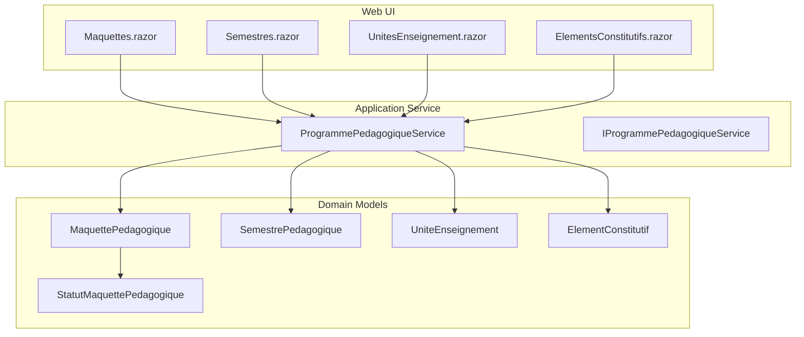
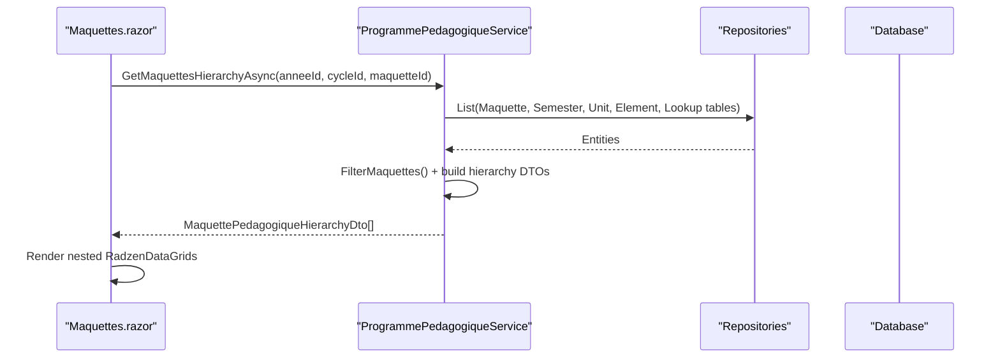
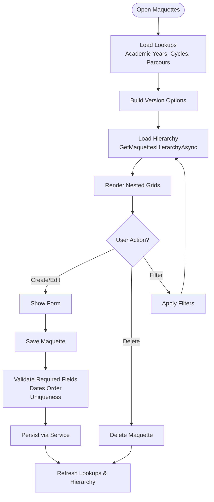
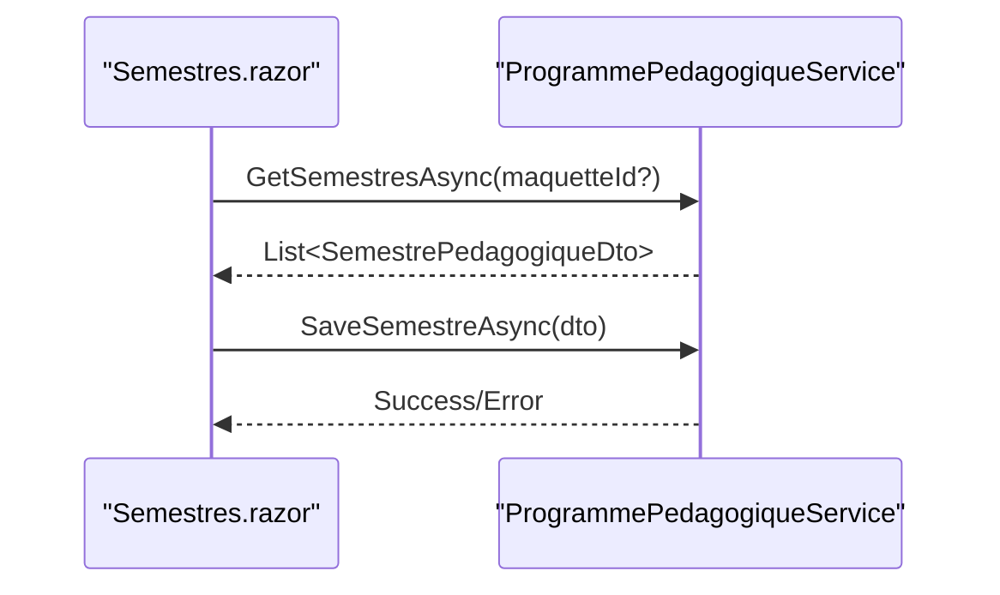
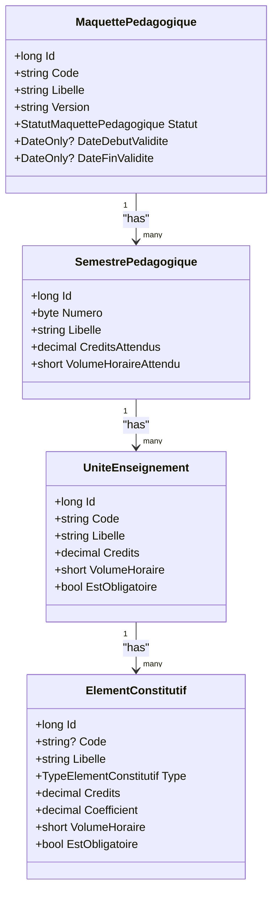
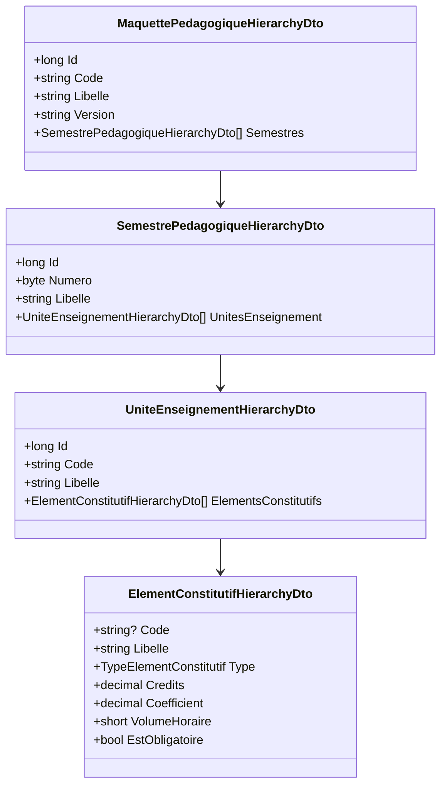
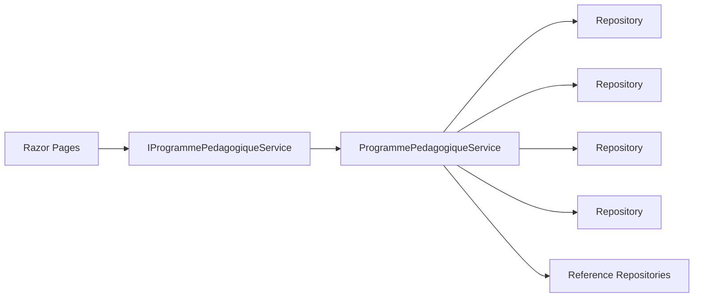

# Program Maquettes Management

<cite>
**Referenced Files in This Document**
- [Maquettes.razor](file://RIIS.Academic.Web/Components/Pages/Programme/Maquettes.razor)
- [Semestres.razor](file://RIIS.Academic.Web/Components/Pages/Programme/Semestres.razor)
- [UnitesEnseignement.razor](file://RIIS.Academic.Web/Components/Pages/Programme/UnitesEnseignement.razor)
- [ElementsConstitutifs.razor](file://RIIS.Academic.Web/Components/Pages/Programme/ElementsConstitutifs.razor)
- [IProgrammePedagogiqueService.cs](file://RIIS.Academic.Application/Programmes/Services/IProgrammePedagogiqueService.cs)
- [ProgrammePedagogiqueService.cs](file://RIIS.Academic.Application/Programmes/Services/ProgrammePedagogiqueService.cs)
- [MaquettePedagogiqueHierarchyDto.cs](file://RIIS.Academic.Application/Programmes/Dtos/MaquettePedagogiqueHierarchyDto.cs)
- [SemestrePedagogiqueHierarchyDto.cs](file://RIIS.Academic.Application/Programmes/Dtos/SemestrePedagogiqueHierarchyDto.cs)
- [UniteEnseignementHierarchyDto.cs](file://RIIS.Academic.Application/Programmes/Dtos/UniteEnseignementHierarchyDto.cs)
- [ElementConstitutifHierarchyDto.cs](file://RIIS.Academic.Application/Programmes/Dtos/ElementConstitutifHierarchyDto.cs)
- [StatutMaquettePedagogique.cs](file://RIIS.Academic.Domain/Enums/StatutMaquettePedagogique.cs)
- [MaquettePedagogique.cs](file://RIIS.Academic.Domain/Programmes/MaquettePedagogique.cs)
- [SemestrePedagogique.cs](file://RIIS.Academic.Domain/Programmes/SemestrePedagogique.cs)
- [UniteEnseignement.cs](file://RIIS.Academic.Domain/Programmes/UniteEnseignement.cs)
- [ElementConstitutif.cs](file://RIIS.Academic.Domain/Programmes/ElementConstitutif.cs)
</cite>

## Table of Contents
1. Introduction
2. Project Structure
3. Core Components
4. Architecture Overview
5. Detailed Component Analysis
6. Dependency Analysis
7. Performance Considerations
8. Troubleshooting Guide
9. Conclusion

## Introduction
This document explains the program maquettes (curriculum frameworks) management interface. It covers:
- Hierarchical display of academic programs with nested data grids for semesters, course units, and constituent elements
- Filtering by academic year and training cycle
- CRUD operations for curriculum versions (maquettes) and their children
- Version management and status workflows (Draft, Active, Archived)
- Validation rules that ensure a valid academic program structure

## Project Structure
The feature spans three layers:
- Web UI pages implement filtering, forms, and nested grids
- Application service orchestrates queries, validations, and persistence
- Domain models define entities and statuses

**Diagram sources**
- [Maquettes.razor:1-230](file://RIIS.Academic.Web/Components/Pages/Programme/Maquettes.razor#L1-L230)
- [Semestres.razor:1-192](file://RIIS.Academic.Web/Components/Pages/Programme/Semestres.razor#L1-L192)
- [UnitesEnseignement.razor:1-373](file://RIIS.Academic.Web/Components/Pages/Programme/UnitesEnseignement.razor#L1-L373)
- [ElementsConstitutifs.razor:1-236](file://RIIS.Academic.Web/Components/Pages/Programme/ElementsConstitutifs.razor#L1-L236)
- [ProgrammePedagogiqueService.cs:1-800](file://RIIS.Academic.Application/Programmes/Services/ProgrammePedagogiqueService.cs#L1-L800)
- [MaquettePedagogique.cs:1-31](file://RIIS.Academic.Domain/Programmes/MaquettePedagogique.cs#L1-L31)
- [SemestrePedagogique.cs:1-20](file://RIIS.Academic.Domain/Programmes/SemestrePedagogique.cs#L1-L20)
- [UniteEnseignement.cs:1-18](file://RIIS.Academic.Domain/Programmes/UniteEnseignement.cs#L1-L18)
- [ElementConstitutif.cs:1-21](file://RIIS.Academic.Domain/Programmes/ElementConstitutif.cs#L1-L21)
- [StatutMaquettePedagogique.cs:1-9](file://RIIS.Academic.Domain/Enums/StatutMaquettePedagogique.cs#L1-L9)

**Section sources**
- [Maquettes.razor:1-230](file://RIIS.Academic.Web/Components/Pages/Programme/Maquettes.razor#L1-L230)
- [ProgrammePedagogiqueService.cs:1-800](file://RIIS.Academic.Application/Programmes/Services/ProgrammePedagogiqueService.cs#L1-L800)

## Core Components
- Maquettes page: hierarchical grid showing Maquette → Semesters → Units → Constituent Elements; filters by Academic Year and Training Cycle; form to create/edit/delete versions
- Semesters page: list and manage semesters attached to a maquette
- Units page: hierarchical view of units within filtered semesters and their constituent elements
- Constituent Elements page: list and manage constituent elements per unit
- Application service: provides hierarchy loading, lookups, and CRUD operations with validation
- Domain models: represent the curriculum hierarchy and status enum

Key responsibilities:
- UI binds to service methods for data and actions
- Service validates inputs, enforces uniqueness, and persists changes
- Domain enums define allowed states and types

**Section sources**
- [Maquettes.razor:16-230](file://RIIS.Academic.Web/Components/Pages/Programme/Maquettes.razor#L16-L230)
- [Semestres.razor:16-192](file://RIIS.Academic.Web/Components/Pages/Programme/Semestres.razor#L16-L192)
- [UnitesEnseignement.razor:16-373](file://RIIS.Academic.Web/Components/Pages/Programme/UnitesEnseignement.razor#L16-L373)
- [ElementsConstitutifs.razor:16-236](file://RIIS.Academic.Web/Components/Pages/Programme/ElementsConstitutifs.razor#L16-L236)
- [IProgrammePedagogiqueService.cs:1-65](file://RIIS.Academic.Application/Programmes/Services/IProgrammePedagogiqueService.cs#L1-L65)
- [ProgrammePedagogiqueService.cs:151-226](file://RIIS.Academic.Application/Programmes/Services/ProgrammePedagogiqueService.cs#L151-L226)

## Architecture Overview
The interface uses a layered architecture:
- Razor pages call IProgrammePedagogiqueService methods
- ProgrammePedagogiqueService composes repositories to read/write domain entities
- Hierarchy DTOs are built from domain entities for efficient nested rendering

**Diagram sources**
- [Maquettes.razor:256-287](file://RIIS.Academic.Web/Components/Pages/Programme/Maquettes.razor#L256-L287)
- [ProgrammePedagogiqueService.cs:33-130](file://RIIS.Academic.Application/Programmes/Services/ProgrammePedagogiqueService.cs#L33-L130)

## Detailed Component Analysis

### Maquettes Page (Curriculum Versions)
- Filters: Academic Year, Training Cycle, Maquette; Apply/Reset
- Nested Data Grid: Maquette → Semesters → Units → Constituent Elements
- Form: Create/Edit/Delete maquette version with fields for code, label, version, status, validity dates, source document, observation
- Status options: Draft, Active, Archived
- Versioning: default version “V1” on create; version string normalized and validated

**Diagram sources**
- [Maquettes.razor:18-63](file://RIIS.Academic.Web/Components/Pages/Programme/Maquettes.razor#L18-L63)
- [Maquettes.razor:66-135](file://RIIS.Academic.Web/Components/Pages/Programme/Maquettes.razor#L66-L135)
- [Maquettes.razor:138-230](file://RIIS.Academic.Web/Components/Pages/Programme/Maquettes.razor#L138-L230)
- [ProgrammePedagogiqueService.cs:151-226](file://RIIS.Academic.Application/Programmes/Services/ProgrammePedagogiqueService.cs#L151-L226)

**Section sources**
- [Maquettes.razor:18-230](file://RIIS.Academic.Web/Components/Pages/Programme/Maquettes.razor#L18-L230)
- [ProgrammePedagogiqueService.cs:143-226](file://RIIS.Academic.Application/Programmes/Services/ProgrammePedagogiqueService.cs#L143-L226)
- [StatutMaquettePedagogique.cs:1-9](file://RIIS.Academic.Domain/Enums/StatutMaquettePedagogique.cs#L1-L9)

### Semesters Management
- Filter by Maquette
- Create/Edit/Delete semesters with number, label, credits, volume hours, display order
- Validation ensures semester number range and non-negative metrics

**Diagram sources**
- [Semestres.razor:111-192](file://RIIS.Academic.Web/Components/Pages/Programme/Semestres.razor#L111-L192)
- [ProgrammePedagogiqueService.cs:234-358](file://RIIS.Academic.Application/Programmes/Services/ProgrammePedagogiqueService.cs#L234-L358)

**Section sources**
- [Semestres.razor:16-192](file://RIIS.Academic.Web/Components/Pages/Programme/Semestres.razor#L16-L192)
- [ProgrammePedagogiqueService.cs:269-358](file://RIIS.Academic.Application/Programmes/Services/ProgrammePedagogiqueService.cs#L269-L358)

### Units and Constituent Elements
- Units page supports multi-level filtering (Academic Year, Cycle, Parcours, Semester) and shows nested constituent elements
- Constituent Elements page lists items per unit with type, credits, coefficient, volume hours, and mandatory flag

**Diagram sources**
- [MaquettePedagogique.cs:1-31](file://RIIS.Academic.Domain/Programmes/MaquettePedagogique.cs#L1-L31)
- [SemestrePedagogique.cs:1-20](file://RIIS.Academic.Domain/Programmes/SemestrePedagogique.cs#L1-L20)
- [UniteEnseignement.cs:1-18](file://RIIS.Academic.Domain/Programmes/UniteEnseignement.cs#L1-L18)
- [ElementConstitutif.cs:1-21](file://RIIS.Academic.Domain/Programmes/ElementConstitutif.cs#L1-L21)

**Section sources**
- [UnitesEnseignement.razor:16-373](file://RIIS.Academic.Web/Components/Pages/Programme/UnitesEnseignement.razor#L16-L373)
- [ElementsConstitutifs.razor:16-236](file://RIIS.Academic.Web/Components/Pages/Programme/ElementsConstitutifs.razor#L16-L236)
- [ProgrammePedagogiqueService.cs:360-718](file://RIIS.Academic.Application/Programmes/Services/ProgrammePedagogiqueService.cs#L360-L718)

### Hierarchy DTOs
- MaquettePedagogiqueHierarchyDto contains nested SemestrePedagogiqueHierarchyDto list
- Each SemestrePedagogiqueHierarchyDto contains UniteEnseignementHierarchyDto list
- Each UniteEnseignementHierarchyDto contains ElementConstitutifHierarchyDto list

**Diagram sources**
- [MaquettePedagogiqueHierarchyDto.cs:1-20](file://RIIS.Academic.Application/Programmes/Dtos/MaquettePedagogiqueHierarchyDto.cs#L1-L20)
- [SemestrePedagogiqueHierarchyDto.cs:1-14](file://RIIS.Academic.Application/Programmes/Dtos/SemestrePedagogiqueHierarchyDto.cs#L1-L14)
- [UniteEnseignementHierarchyDto.cs:1-16](file://RIIS.Academic.Application/Programmes/Dtos/UniteEnseignementHierarchyDto.cs#L1-L16)
- [ElementConstitutifHierarchyDto.cs:1-18](file://RIIS.Academic.Application/Programmes/Dtos/ElementConstitutifHierarchyDto.cs#L1-L18)

**Section sources**
- [MaquettePedagogiqueHierarchyDto.cs:1-20](file://RIIS.Academic.Application/Programmes/Dtos/MaquettePedagogiqueHierarchyDto.cs#L1-L20)
- [SemestrePedagogiqueHierarchyDto.cs:1-14](file://RIIS.Academic.Application/Programmes/Dtos/SemestrePedagogiqueHierarchyDto.cs#L1-L14)
- [UniteEnseignementHierarchyDto.cs:1-16](file://RIIS.Academic.Application/Programmes/Dtos/UniteEnseignementHierarchyDto.cs#L1-L16)
- [ElementConstitutifHierarchyDto.cs:1-18](file://RIIS.Academic.Application/Programmes/Dtos/ElementConstitutifHierarchyDto.cs#L1-L18)

## Dependency Analysis
- UI depends on IProgrammePedagogiqueService for all reads/writes
- Service depends on multiple repositories for entities and reference data
- Filtering logic composes references across academic years, cycles, parcours, and pedagogical classes to determine visible maquettes

**Diagram sources**
- [IProgrammePedagogiqueService.cs:1-65](file://RIIS.Academic.Application/Programmes/Services/IProgrammePedagogiqueService.cs#L1-L65)
- [ProgrammePedagogiqueService.cs:8-17](file://RIIS.Academic.Application/Programmes/Services/ProgrammePedagogiqueService.cs#L8-L17)

**Section sources**
- [IProgrammePedagogiqueService.cs:1-65](file://RIIS.Academic.Application/Programmes/Services/IProgrammePedagogiqueService.cs#L1-L65)
- [ProgrammePedagogiqueService.cs:8-17](file://RIIS.Academic.Application/Programmes/Services/ProgrammePedagogiqueService.cs#L8-L17)

## Performance Considerations
- Hierarchy loading fetches all related entities once and builds nested structures in memory; this is efficient for moderate dataset sizes
- Filtering leverages in-memory LINQ after initial loads; consider pagination at the service level if datasets grow large
- Avoid repeated full reloads by caching lookups where appropriate in the UI layer

[No sources needed since this section provides general guidance]

## Troubleshooting Guide
Common issues and resolutions:
- Duplicate maquette version: Ensure unique combination of path (cycle/niveau/filière/specialite), code, and version
- Invalid date range: End date must be greater than or equal to start date
- Missing required fields: Path, code, label, version are required for maquettes; similar requirements apply to children
- Duplicate identifiers: Semester numbers, unit codes, element codes must be unique within their parent scope
- Display order conflicts: Constituent elements must have unique display order within a unit

Validation locations:
- Maquette save validation and duplicate checks
- Semester save validation and duplicate checks
- Unit save validation and duplicate checks
- Constituent element save validation and duplicate checks

**Section sources**
- [ProgrammePedagogiqueService.cs:151-226](file://RIIS.Academic.Application/Programmes/Services/ProgrammePedagogiqueService.cs#L151-L226)
- [ProgrammePedagogiqueService.cs:290-358](file://RIIS.Academic.Application/Programmes/Services/ProgrammePedagogiqueService.cs#L290-L358)
- [ProgrammePedagogiqueService.cs:518-580](file://RIIS.Academic.Application/Programmes/Services/ProgrammePedagogiqueService.cs#L518-L580)
- [ProgrammePedagogiqueService.cs:634-718](file://RIIS.Academic.Application/Programmes/Services/ProgrammePedagogiqueService.cs#L634-L718)

## Conclusion
The program maquettes management interface provides a robust, hierarchical view and editing experience for curriculum frameworks. It supports filtering by academic year and training cycle, nested data grids for semesters, units, and constituent elements, and comprehensive CRUD operations with strong validation. The status workflow (Draft, Active, Archived) and versioning model enable controlled evolution of curricula over time.

[No sources needed since this section summarizes without analyzing specific files]