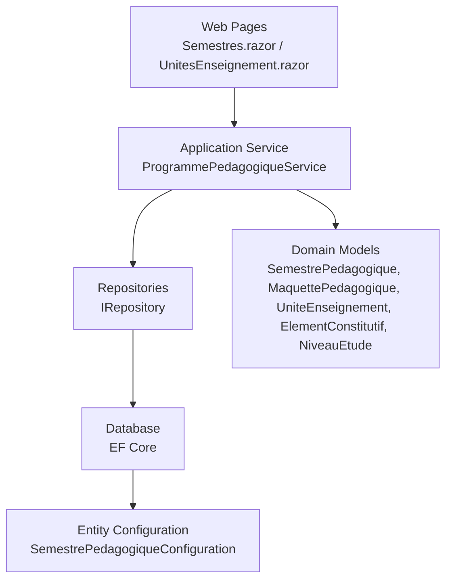
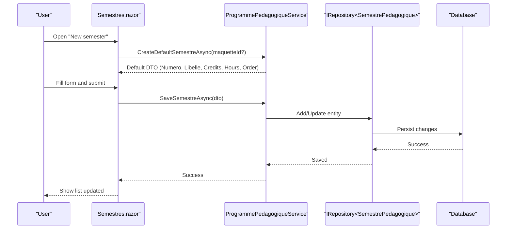
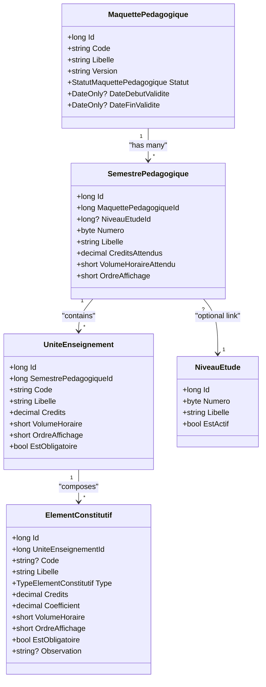
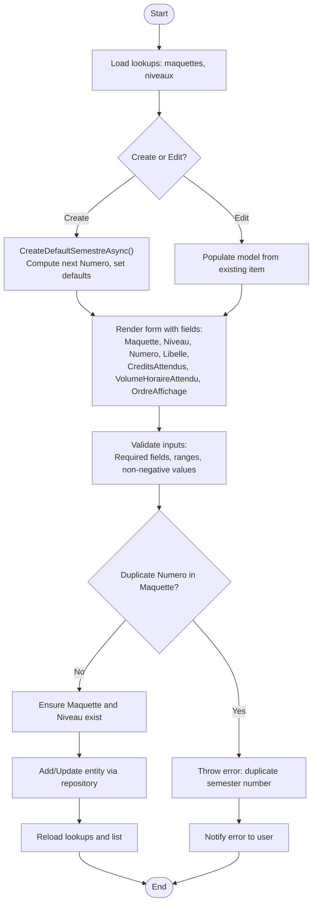
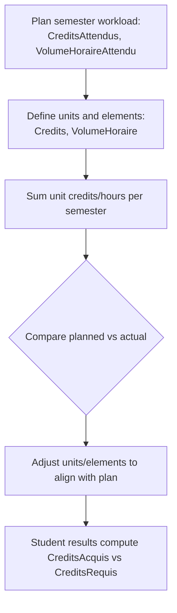
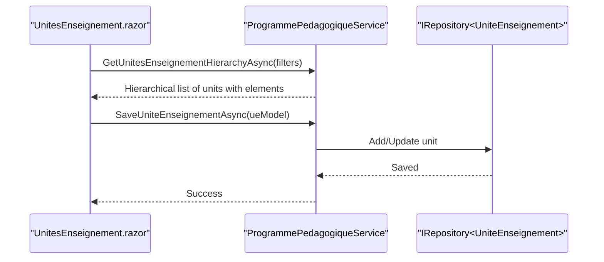
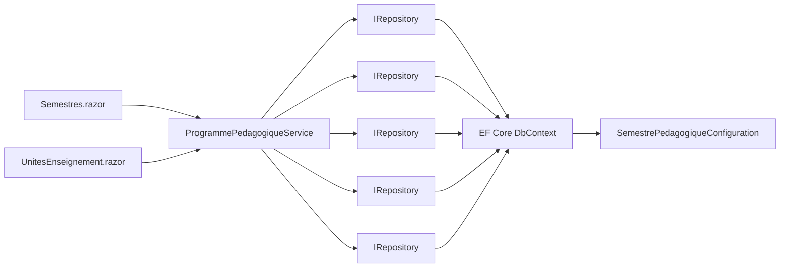

# Semester Management

<cite>
**Referenced Files in This Document**
- [SemestrePedagogique.cs](file://RIIS.Academic.Domain/Programmes/SemestrePedagogique.cs)
- [MaquettePedagogique.cs](file://RIIS.Academic.Domain/Programmes/MaquettePedagogique.cs)
- [UniteEnseignement.cs](file://RIIS.Academic.Domain/Programmes/UniteEnseignement.cs)
- [ElementConstitutif.cs](file://RIIS.Academic.Domain/Programmes/ElementConstitutif.cs)
- [NiveauEtude.cs](file://RIIS.Academic.Domain/Referentiels/NiveauEtude.cs)
- [ResultatSemestre.cs](file://RIIS.Academic.Domain/Notes/ResultatSemestre.cs)
- [SemestrePedagogiqueDto.cs](file://RIIS.Academic.Application/Programmes/Dtos/SemestrePedagogiqueDto.cs)
- [UniteEnseignementDto.cs](file://RIIS.Academic.Application/Programmes/Dtos/UniteEnseignementDto.cs)
- [IProgrammePedagogiqueService.cs](file://RIIS.Academic.Application/Programmes/Services/IProgrammePedagogiqueService.cs)
- [ProgrammePedagogiqueService.cs](file://RIIS.Academic.Application/Programmes/Services/ProgrammePedagogiqueService.cs)
- [SemestrePedagogiqueConfiguration.cs](file://RIIS.Academic.Infrastructure/Persistence/Configurations/Programmes/SemestrePedagogiqueConfiguration.cs)
- [Semestres.razor](file://RIIS.Academic.Web/Components/Pages/Programme/Semestres.razor)
- [UnitesEnseignement.razor](file://RIIS.Academic.Web/Components/Pages/Programme/UnitesEnseignement.razor)
</cite>

## Table of Contents
1. [Introduction](#introduction)
2. [Project Structure](#project-structure)
3. [Core Components](#core-components)
4. [Architecture Overview](#architecture-overview)
5. [Detailed Component Analysis](#detailed-component-analysis)
6. [Dependency Analysis](#dependency-analysis)
7. [Performance Considerations](#performance-considerations)
8. [Troubleshooting Guide](#troubleshooting-guide)
9. [Conclusion](#conclusion)

## Introduction
This document explains the semester management interface within academic programs, focusing on how semesters are created, edited, and organized under program frameworks (maquettes). It details the relationship between semesters and study levels, credit allocation, workload planning, and integration with course unit assignments. It also covers validation rules enforced by the application and persistence layers, and clarifies how semesters participate in academic outcomes and results.

## Project Structure
The semester feature spans multiple layers:
- Domain models define semesters, their parent program framework (maquette), study level linkage, and child units and elements.
- Application services implement CRUD operations, default value generation, and validation logic for semesters and related entities.
- Infrastructure configurations enforce database constraints such as unique numbering per maquette and numeric ranges.
- Web pages provide user interfaces to create, edit, filter, and manage semesters and their associated units.

**Diagram sources**
- [Semestres.razor:1-192](file://RIIS.Academic.Web/Components/Pages/Programme/Semestres.razor#L1-L192)
- [UnitesEnseignement.razor:1-373](file://RIIS.Academic.Web/Components/Pages/Programme/UnitesEnseignement.razor#L1-L373)
- [ProgrammePedagogiqueService.cs:1-800](file://RIIS.Academic.Application/Programmes/Services/ProgrammePedagogiqueService.cs#L1-L800)
- [SemestrePedagogiqueConfiguration.cs:1-27](file://RIIS.Academic.Infrastructure/Persistence/Configurations/Programmes/SemestrePedagogiqueConfiguration.cs#L1-L27)

**Section sources**
- [SemestrePedagogique.cs:1-20](file://RIIS.Academic.Domain/Programmes/SemestrePedagogique.cs#L1-L20)
- [MaquettePedagogique.cs:1-31](file://RIIS.Academic.Domain/Programmes/MaquettePedagogique.cs#L1-L31)
- [UniteEnseignement.cs:1-18](file://RIIS.Academic.Domain/Programmes/UniteEnseignement.cs#L1-L18)
- [ElementConstitutif.cs:1-21](file://RIIS.Academic.Domain/Programmes/ElementConstitutif.cs#L1-L21)
- [NiveauEtude.cs:1-14](file://RIIS.Academic.Domain/Referentiels/NiveauEtude.cs#L1-L14)
- [SemestrePedagogiqueConfiguration.cs:1-27](file://RIIS.Academic.Infrastructure/Persistence/Configurations/Programmes/SemestrePedagogiqueConfiguration.cs#L1-L27)

## Core Components
- SemestrePedagogique: Represents a semester within a program framework, including its number, label, expected credits, expected teaching hours, display order, and optional study level association. It links to the parent maquette and contains collections of course units, student results, and administrative records.
- MaquettePedagogique: The program framework that owns semesters; includes identifiers for cycle, study level, stream, specialty, code, label, version, status, validity dates, and source/observations.
- UniteEnseignement: Course unit belonging to a semester, with code, label, credits, teaching hours, display order, and mandatory flag.
- ElementConstitutif: Constituent element of a course unit, with type, credits, coefficient, teaching hours, display order, mandatory flag, and observation.
- NiveauEtude: Study level entity that can be optionally linked to semesters.
- ResultatSemestre: Academic result per semester for a student enrollment, including averages, acquired vs required credits, ranking, validation status, and jury decision.

Key responsibilities:
- Create/edit/delete semesters under a chosen maquette.
- Assign or inherit study level context.
- Define expected credits and teaching hours per semester.
- Organize units and constituent elements within semesters.
- Enforce uniqueness and range constraints at both application and database levels.

**Section sources**
- [SemestrePedagogique.cs:1-20](file://RIIS.Academic.Domain/Programmes/SemestrePedagogique.cs#L1-L20)
- [MaquettePedagogique.cs:1-31](file://RIIS.Academic.Domain/Programmes/MaquettePedagogique.cs#L1-L31)
- [UniteEnseignement.cs:1-18](file://RIIS.Academic.Domain/Programmes/UniteEnseignement.cs#L1-L18)
- [ElementConstitutif.cs:1-21](file://RIIS.Academic.Domain/Programmes/ElementConstitutif.cs#L1-L21)
- [NiveauEtude.cs:1-14](file://RIIS.Academic.Domain/Referentiels/NiveauEtude.cs#L1-L14)
- [ResultatSemestre.cs:1-22](file://RIIS.Academic.Domain/Notes/ResultatSemestre.cs#L1-L22)

## Architecture Overview
The semester management follows a layered architecture:
- Presentation layer (Blazor pages) provides forms and grids for managing semesters and units.
- Application service handles business rules, defaults, validations, and orchestrates repository calls.
- Domain models encapsulate core concepts and relationships.
- Infrastructure configures EF mappings and constraints.

**Diagram sources**
- [Semestres.razor:134-173](file://RIIS.Academic.Web/Components/Pages/Programme/Semestres.razor#L134-L173)
- [ProgrammePedagogiqueService.cs:269-352](file://RIIS.Academic.Application/Programmes/Services/ProgrammePedagogiqueService.cs#L269-L352)

## Detailed Component Analysis

### Data Model Relationships

**Diagram sources**
- [MaquettePedagogique.cs:1-31](file://RIIS.Academic.Domain/Programmes/MaquettePedagogique.cs#L1-L31)
- [SemestrePedagogique.cs:1-20](file://RIIS.Academic.Domain/Programmes/SemestrePedagogique.cs#L1-L20)
- [UniteEnseignement.cs:1-18](file://RIIS.Academic.Domain/Programmes/UniteEnseignement.cs#L1-L18)
- [ElementConstitutif.cs:1-21](file://RIIS.Academic.Domain/Programmes/ElementConstitutif.cs#L1-L21)
- [NiveauEtude.cs:1-14](file://RIIS.Academic.Domain/Referentiels/NiveauEtude.cs#L1-L14)

### Semester Creation and Editing Workflow

**Diagram sources**
- [Semestres.razor:117-173](file://RIIS.Academic.Web/Components/Pages/Programme/Semestres.razor#L117-L173)
- [ProgrammePedagogiqueService.cs:269-352](file://RIIS.Academic.Application/Programmes/Services/ProgrammePedagogiqueService.cs#L269-L352)

### Workload Calculation and Credit Allocation
- Expected workload per semester is modeled by two fields: expected credits and expected teaching hours. These serve as planning targets for curriculum design.
- Actual workload and credits are reflected through course units and their constituent elements, which carry credits and teaching hours.
- Student outcomes aggregate credits acquired versus required per semester and annually, influencing decisions.

**Diagram sources**
- [SemestrePedagogique.cs:1-20](file://RIIS.Academic.Domain/Programmes/SemestrePedagogique.cs#L1-L20)
- [UniteEnseignement.cs:1-18](file://RIIS.Academic.Domain/Programmes/UniteEnseignement.cs#L1-L18)
- [ElementConstitutif.cs:1-21](file://RIIS.Academic.Domain/Programmes/ElementConstitutif.cs#L1-L21)
- [ResultatSemestre.cs:1-22](file://RIIS.Academic.Domain/Notes/ResultatSemestre.cs#L1-L22)

### Integration with Course Unit Assignments
- Semesters contain multiple course units; each unit belongs to exactly one semester.
- Units may have constituent elements (e.g., lectures, labs, assessments) with types, coefficients, and credits.
- The web interface allows filtering units by academic hierarchy and semester, and editing them inline.

**Diagram sources**
- [UnitesEnseignement.razor:294-342](file://RIIS.Academic.Web/Components/Pages/Programme/UnitesEnseignement.razor#L294-L342)
- [ProgrammePedagogiqueService.cs:518-574](file://RIIS.Academic.Application/Programmes/Services/ProgrammePedagogiqueService.cs#L518-L574)

### Semester Sequencing and Display Order
- Semesters are sequenced using a numeric field (Numero) constrained to a specific range and must be unique within a maquette.
- Display order (OrdreAffichage) controls presentation ordering and defaults to the semester number if not explicitly set.
- Hierarchy queries order semesters by display order then by number for consistent UI rendering.

**Section sources**
- [SemestrePedagogiqueConfiguration.cs:10-15](file://RIIS.Academic.Infrastructure/Persistence/Configurations/Programmes/SemestrePedagogiqueConfiguration.cs#L10-L15)
- [ProgrammePedagogiqueService.cs:234-255](file://RIIS.Academic.Application/Programmes/Services/ProgrammePedagogiqueService.cs#L234-L255)
- [ProgrammePedagogiqueService.cs:269-288](file://RIIS.Academic.Application/Programmes/Services/ProgrammePedagogiqueService.cs#L269-L288)

### Relationship Between Semesters and Study Levels
- A semester can optionally link to a study level (NiveauEtudeId), enabling alignment with educational tiers.
- When retrieving semesters, the service enriches DTOs with level labels for display.

**Section sources**
- [SemestrePedagogique.cs:6-15](file://RIIS.Academic.Domain/Programmes/SemestrePedagogique.cs#L6-L15)
- [ProgrammePedagogiqueService.cs:234-255](file://RIIS.Academic.Application/Programmes/Services/ProgrammePedagogiqueService.cs#L234-L255)

### Validation Rules and Academic Calendar Considerations
- Application-level validations:
  - Required fields: maquette, semester number, label.
  - Range checks: semester number between 1 and 10; credits and hours must be non-negative.
  - Duplicate check: same semester number cannot exist twice within the same maquette.
  - Referential integrity: ensure referenced maquette and level exist before saving.
- Database-level constraints:
  - Unique index on (MaquettePedagogiqueId, Numero).
  - Check constraint enforcing semester number range.
- Academic calendar considerations:
  - Program frameworks include validity dates (start/end), which can be used to scope active curricula when designing or reviewing semesters.
  - While semesters themselves do not store calendar dates, they are tied to program versions and can be filtered by academic year contexts in hierarchical views.

**Section sources**
- [ProgrammePedagogiqueService.cs:290-352](file://RIIS.Academic.Application/Programmes/Services/ProgrammePedagogiqueService.cs#L290-L352)
- [SemestrePedagogiqueConfiguration.cs:10-15](file://RIIS.Academic.Infrastructure/Persistence/Configurations/Programmes/SemestrePedagogiqueConfiguration.cs#L10-L15)
- [MaquettePedagogique.cs:17-21](file://RIIS.Academic.Domain/Programmes/MaquettePedagogique.cs#L17-L21)

### Prerequisite Dependencies
- The current data model does not include explicit prerequisite relationships between semesters or units.
- Planning prerequisites should be managed via curriculum design practices and documentation rather than enforced dependencies in this codebase.

[No sources needed since this section summarizes modeling limitations without analyzing specific files]

## Dependency Analysis

**Diagram sources**
- [Semestres.razor:1-192](file://RIIS.Academic.Web/Components/Pages/Programme/Semestres.razor#L1-L192)
- [UnitesEnseignement.razor:1-373](file://RIIS.Academic.Web/Components/Pages/Programme/UnitesEnseignement.razor#L1-L373)
- [ProgrammePedagogiqueService.cs:8-17](file://RIIS.Academic.Application/Programmes/Services/ProgrammePedagogiqueService.cs#L8-L17)
- [SemestrePedagogiqueConfiguration.cs:1-27](file://RIIS.Academic.Infrastructure/Persistence/Configurations/Programmes/SemestrePedagogiqueConfiguration.cs#L1-L27)

**Section sources**
- [IProgrammePedagogiqueService.cs:1-65](file://RIIS.Academic.Application/Programmes/Services/IProgrammePedagogiqueService.cs#L1-L65)
- [ProgrammePedagogiqueService.cs:1-800](file://RIIS.Academic.Application/Programmes/Services/ProgrammePedagogiqueService.cs#L1-L800)

## Performance Considerations
- Filtering and listing operations load all relevant entities into memory and apply LINQ filters; for large datasets, consider server-side pagination and query optimization.
- Hierarchy queries assemble nested structures; minimize unnecessary joins by preloading only required references.
- Use lookup endpoints to reduce payload size for dropdowns and filters.

[No sources needed since this section provides general guidance]

## Troubleshooting Guide
Common issues and resolutions:
- Duplicate semester number within a maquette:
  - Symptom: Save fails with an error indicating duplicate semester number.
  - Resolution: Choose a unique number within the target maquette; the system enforces uniqueness via application and database checks.
- Invalid semester number range:
  - Symptom: Save fails due to number outside allowed range.
  - Resolution: Ensure the number is between 1 and 10; the database constraint enforces this.
- Missing required fields:
  - Symptom: Save fails due to missing maquette, number, or label.
  - Resolution: Provide all required fields; the service validates presence and normalizes values.
- Non-positive credits or hours:
  - Symptom: Save fails because credits or hours are negative.
  - Resolution: Set non-negative values for credits and teaching hours.
- Referential integrity errors:
  - Symptom: Save fails because referenced maquette or level does not exist.
  - Resolution: Ensure referenced entities exist before saving; the service verifies existence.

**Section sources**
- [ProgrammePedagogiqueService.cs:290-352](file://RIIS.Academic.Application/Programmes/Services/ProgrammePedagogiqueService.cs#L290-L352)
- [SemestrePedagogiqueConfiguration.cs:10-15](file://RIIS.Academic.Infrastructure/Persistence/Configurations/Programmes/SemestrePedagogiqueConfiguration.cs#L10-L15)

## Conclusion
The semester management system provides a robust framework for organizing academic programs around semesters, with clear relationships to program frameworks, study levels, and course units. It enforces strong validation rules at both application and database layers to maintain data integrity. While explicit prerequisite dependencies are not modeled, the structure supports careful curriculum planning and workload alignment through credits and teaching hours. The web interface offers intuitive creation, editing, and filtering capabilities, integrating seamlessly with unit management and academic outcomes.