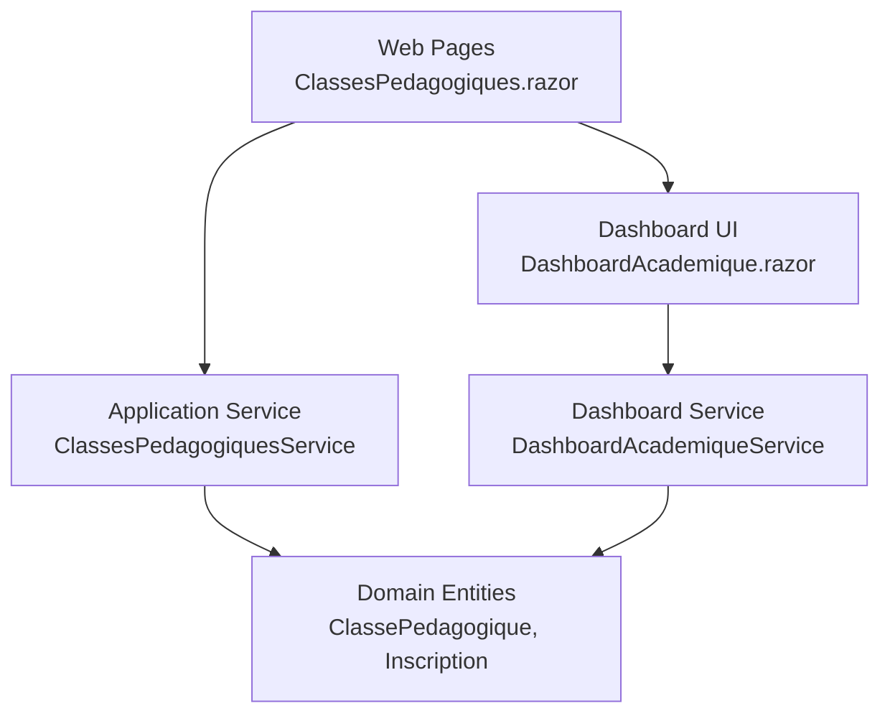
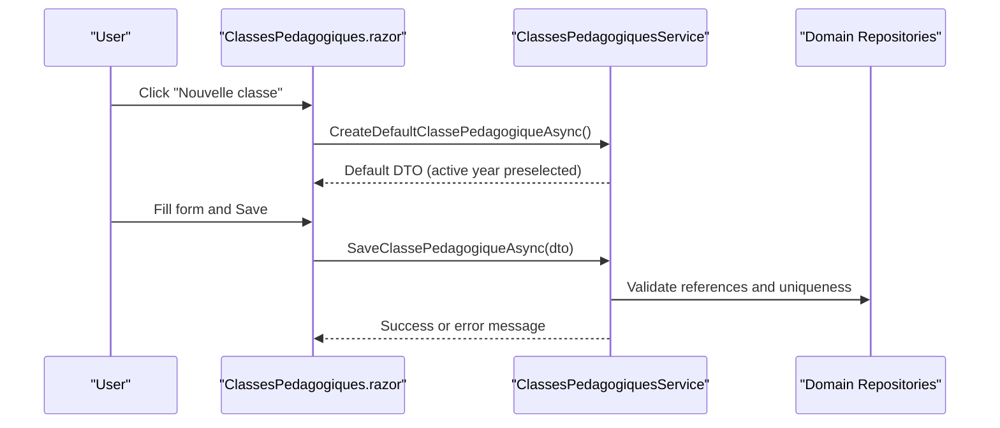
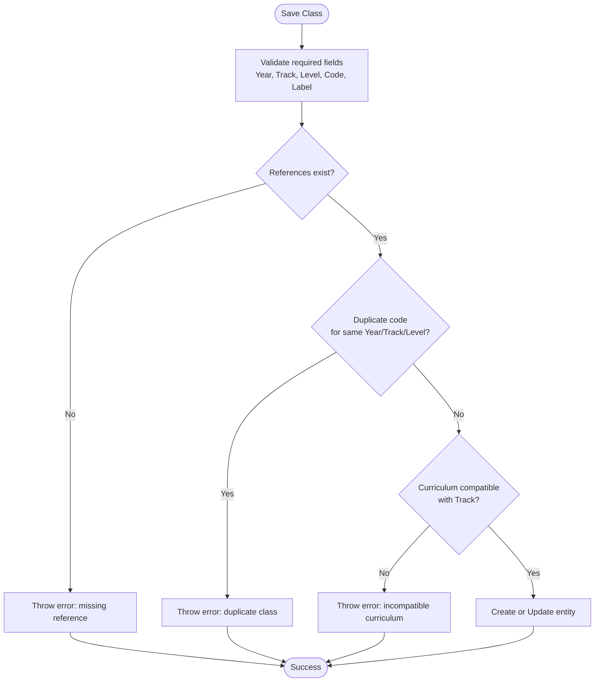
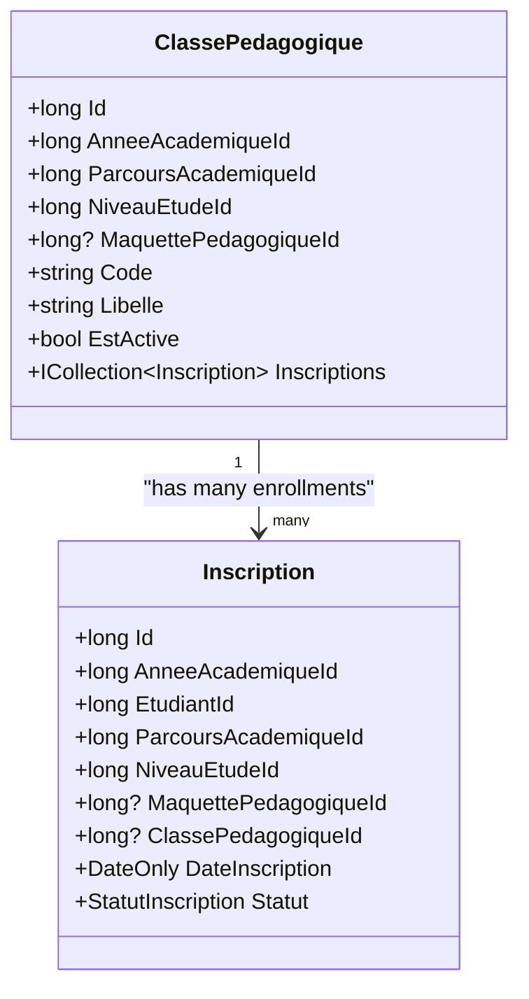
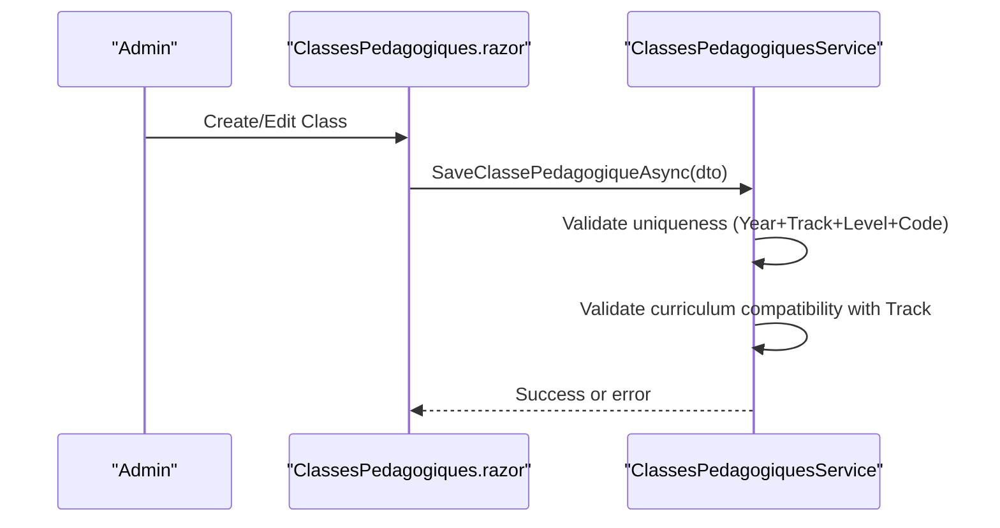
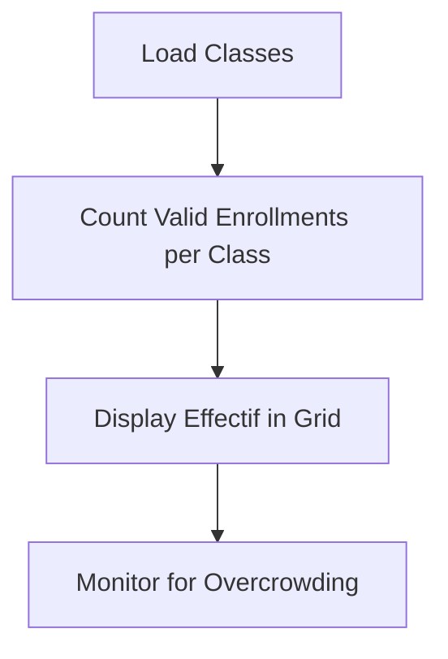
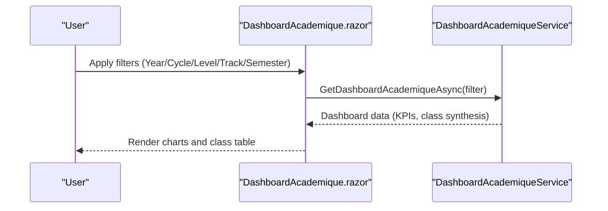
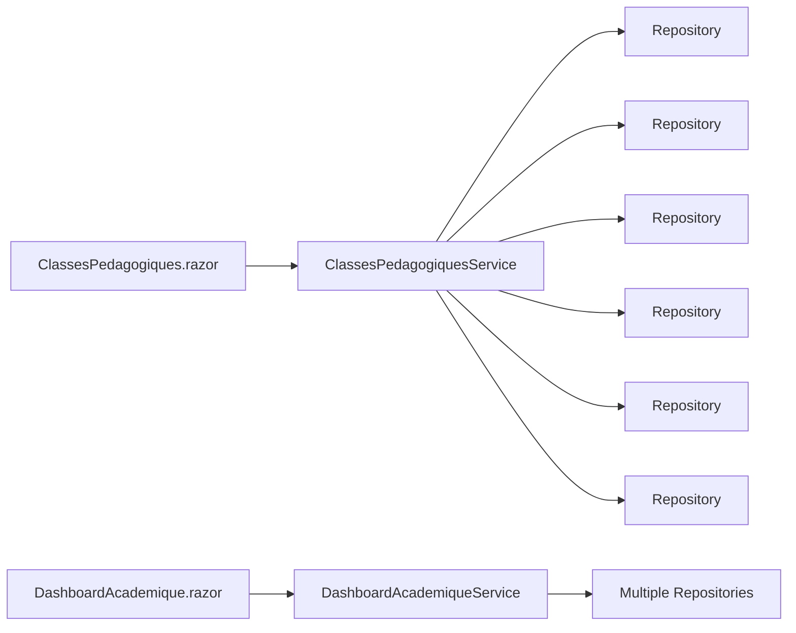

# Class Management UI

<cite>
**Referenced Files in This Document**
- [ClassesPedagogiques.razor](file://RIIS.Academic.Web/Components/Pages/ClassesPedagogiques.razor)
- [ClassesPedagogiquesService.cs](file://RIIS.Academic.Application/ClassesPedagogiques/Services/ClassesPedagogiquesService.cs)
- [ClassePedagogique.cs](file://RIIS.Academic.Domain/Notes/ClassePedagogique.cs)
- [ClassePedagogiqueDto.cs](file://RIIS.Academic.Application/ClassesPedagogiques/Dtos/ClassePedagogiqueDto.cs)
- [Etudiants.razor](file://RIIS.Academic.Web/Components/Pages/Etudiants.razor)
- [EtudiantsService.cs](file://RIIS.Academic.Application/Etudiants/Services/EtudiantsService.cs)
- [Inscription.cs](file://RIIS.Academic.Domain/Inscriptions/Inscription.cs)
- [IInscriptionsService.cs](file://RIIS.Academic.Application/Inscriptions/Services/IInscriptionsService.cs)
- [DashboardAcademique.razor](file://RIIS.Academic.Web/Components/Pages/DashboardAcademique.razor)
- [DashboardAcademiqueService.cs](file://RIIS.Academic.Application/Dashboard/Services/DashboardAcademiqueService.cs)
- [Evaluations.razor](file://RIIS.Academic.Web/Components/Pages/Evaluations.razor)
</cite>

## Table of Contents
1. Introduction
2. Project Structure
3. Core Components
4. Architecture Overview
5. Detailed Component Analysis
6. Dependency Analysis
7. Performance Considerations
8. Troubleshooting Guide
9. Conclusion

## Introduction
This document explains the class management user interface and its supporting services for pedagogical class creation, student assignment to classes, and schedule-related monitoring. It focuses on how classes are composed from academic references (year, program track, level, optional curriculum), how enrollment drives capacity visibility, and how dashboards provide performance insights per class. Where applicable, it also highlights scheduling conflict prevention through validation rules and reference compatibility checks.

## Project Structure
The class management feature spans three layers:
- Web UI pages that render lists, forms, filters, and actions
- Application services that enforce business rules, validate inputs, and coordinate data access
- Domain entities that model classes, enrollments, and related academic references

**Diagram sources**
- [ClassesPedagogiques.razor:1-217](file://RIIS.Academic.Web/Components/Pages/ClassesPedagogiques.razor#L1-L217)
- [ClassesPedagogiquesService.cs:1-296](file://RIIS.Academic.Application/ClassesPedagogiques/Services/ClassesPedagogiquesService.cs#L1-L296)
- [ClassePedagogique.cs:1-21](file://RIIS.Academic.Domain/Notes/ClassePedagogique.cs#L1-L21)
- [DashboardAcademique.razor:1-659](file://RIIS.Academic.Web/Components/Pages/DashboardAcademique.razor#L1-L659)
- [DashboardAcademiqueService.cs:1-658](file://RIIS.Academic.Application/Dashboard/Services/DashboardAcademiqueService.cs#L1-L658)

**Section sources**
- [ClassesPedagogiques.razor:1-217](file://RIIS.Academic.Web/Components/Pages/ClassesPedagogiques.razor#L1-L217)
- [ClassesPedagogiquesService.cs:1-296](file://RIIS.Academic.Application/ClassesPedagogiques/Services/ClassesPedagogiquesService.cs#L1-L296)
- [ClassePedagogique.cs:1-21](file://RIIS.Academic.Domain/Notes/ClassePedagogique.cs#L1-L21)
- [DashboardAcademique.razor:1-659](file://RIIS.Academic.Web/Components/Pages/DashboardAcademique.razor#L1-L659)
- [DashboardAcademiqueService.cs:1-658](file://RIIS.Academic.Application/Dashboard/Services/DashboardAcademiqueService.cs#L1-L658)

## Core Components
- Classes page: Create, edit, delete pedagogical classes; filter by academic year; display current enrollment count.
- Enrollment model: Students are assigned via Inscriptions linked to a ClassePedagogiqueId, which drives the visible “Effectif” (enrolled students).
- Dashboard: Aggregates per-class metrics such as average grade, note completion rate, number of admitted/retake/fail outcomes, and generated documents.

Key responsibilities:
- Validate required fields and reference integrity when saving classes
- Prevent duplicate class codes within the same year, track, and level
- Ensure curriculum (Maquette) compatibility with the selected track
- Compute enrollment counts based on validated inscriptions
- Provide filtered views and KPIs for class performance

**Section sources**
- [ClassesPedagogiques.razor:100-118](file://RIIS.Academic.Web/Components/Pages/ClassesPedagogiques.razor#L100-L118)
- [ClassesPedagogiquesService.cs:77-142](file://RIIS.Academic.Application/ClassesPedagogiques/Services/ClassesPedagogiquesService.cs#L77-L142)
- [ClassePedagogique.cs:1-21](file://RIIS.Academic.Domain/Notes/ClassePedagogique.cs#L1-L21)
- [DashboardAcademiqueService.cs:410-466](file://RIIS.Academic.Application/Dashboard/Services/DashboardAcademiqueService.cs#L410-L466)

## Architecture Overview
The UI calls application services to load lookups and perform CRUD operations. The dashboard service aggregates multiple domain entities to compute per-class summaries.

**Diagram sources**
- [ClassesPedagogiques.razor:157-198](file://RIIS.Academic.Web/Components/Pages/ClassesPedagogiques.razor#L157-L198)
- [ClassesPedagogiquesService.cs:64-142](file://RIIS.Academic.Application/ClassesPedagogiques/Services/ClassesPedagogiquesService.cs#L64-L142)

## Detailed Component Analysis

### Pedagogical Class Creation and Editing
- The page provides a form bound to a DTO with fields for academic year, program track, study level, optional curriculum, code, label, and active flag.
- On save, the service validates required fields, normalizes code, ensures referenced entities exist, and prevents duplicates by code within the same year, track, and level.
- Curriculum compatibility is enforced: the selected curriculum must match the cycle, level, major, and specialization of the chosen track.

**Diagram sources**
- [ClassesPedagogiquesService.cs:77-142](file://RIIS.Academic.Application/ClassesPedagogiques/Services/ClassesPedagogiquesService.cs#L77-L142)
- [ClassesPedagogiquesService.cs:193-228](file://RIIS.Academic.Application/ClassesPedagogiques/Services/ClassesPedagogiquesService.cs#L193-L228)

**Section sources**
- [ClassesPedagogiques.razor:32-96](file://RIIS.Academic.Web/Components/Pages/ClassesPedagogiques.razor#L32-L96)
- [ClassesPedagogiquesService.cs:77-142](file://RIIS.Academic.Application/ClassesPedagogiques/Services/ClassesPedagogiquesService.cs#L77-L142)
- [ClassesPedagogiquesService.cs:193-228](file://RIIS.Academic.Application/ClassesPedagogiques/Services/ClassesPedagogiquesService.cs#L193-L228)

### Student Assignment to Classes (Enrollment)
- Students are managed separately, but their enrollment records link them to a specific ClassePedagogiqueId along with academic context (year, track, level, optional curriculum).
- The class list shows an “Effectif” count derived from enrolled students whose status is validated.
- Filtering and lookup endpoints support selecting classes by academic year, cycle, level, and curriculum.

**Diagram sources**
- [ClassePedagogique.cs:1-21](file://RIIS.Academic.Domain/Notes/ClassePedagogique.cs#L1-L21)
- [Inscription.cs:1-37](file://RIIS.Academic.Domain/Inscriptions/Inscription.cs#L1-L37)

Operational notes:
- Use the enrollment service interfaces to retrieve available classes for assignment and to create/update enrollment records.
- The class view computes Effectif by counting valid enrollments tied to the class.

**Section sources**
- [IInscriptionsService.cs:8-31](file://RIIS.Academic.Application/Inscriptions/Services/IInscriptionsService.cs#L8-L31)
- [ClassesPedagogiquesService.cs:240-273](file://RIIS.Academic.Application/ClassesPedagogiques/Services/ClassesPedagogiquesService.cs#L240-L273)
- [Etudiants.razor:140-159](file://RIIS.Academic.Web/Components/Pages/Etudiants.razor#L140-L159)

### Class Schedule Management and Conflict Resolution
- While explicit scheduling slots are not modeled here, conflicts are mitigated by ensuring each class has a unique code within the same academic year, track, and level.
- Curriculum compatibility prevents assigning a curriculum that does not belong to the selected track, reducing misalignment across semesters and evaluations.
- Evaluations are organized by academic units and elements, enabling alignment with class curricula and semesters.

**Diagram sources**
- [ClassesPedagogiquesService.cs:77-142](file://RIIS.Academic.Application/ClassesPedagogiques/Services/ClassesPedagogiquesService.cs#L77-L142)
- [ClassesPedagogiquesService.cs:193-228](file://RIIS.Academic.Application/ClassesPedagogiques/Services/ClassesPedagogiquesService.cs#L193-L228)

**Section sources**
- [ClassesPedagogiquesService.cs:77-142](file://RIIS.Academic.Application/ClassesPedagogiques/Services/ClassesPedagogiquesService.cs#L77-L142)
- [ClassesPedagogiquesService.cs:193-228](file://RIIS.Academic.Application/ClassesPedagogiques/Services/ClassesPedagogiquesService.cs#L193-L228)
- [Evaluations.razor:117-256](file://RIIS.Academic.Web/Components/Pages/Evaluations.razor#L117-L256)

### Capacity Management
- Capacity is represented implicitly by the number of enrolled students (Effectif) shown in the class grid.
- There is no hard cap enforcement in the class entity; administrators can monitor Effectif and adjust assignments accordingly.

**Diagram sources**
- [ClassesPedagogiquesService.cs:240-273](file://RIIS.Academic.Application/ClassesPedagogiques/Services/ClassesPedagogiquesService.cs#L240-L273)
- [ClassesPedagogiques.razor:100-118](file://RIIS.Academic.Web/Components/Pages/ClassesPedagogiques.razor#L100-L118)

**Section sources**
- [ClassesPedagogiquesService.cs:240-273](file://RIIS.Academic.Application/ClassesPedagogiques/Services/ClassesPedagogiquesService.cs#L240-L273)
- [ClassesPedagogiques.razor:100-118](file://RIIS.Academic.Web/Components/Pages/ClassesPedagogiques.razor#L100-L118)

### Class Templates
- A default class template is provided to streamline creation, preselecting the active academic year and marking the class as active.
- Administrators then fill in track, level, curriculum (optional), code, and label before saving.

Usage example:
- Open the classes page and click “Nouvelle classe” to initialize the default template, then complete the form and save.

**Section sources**
- [ClassesPedagogiquesService.cs:64-75](file://RIIS.Academic.Application/ClassesPedagogiques/Services/ClassesPedagogiquesService.cs#L64-L75)
- [ClassesPedagogiques.razor:157-161](file://RIIS.Academic.Web/Components/Pages/ClassesPedagogiques.razor#L157-L161)

### Bulk Student Assignment
- The current UI surfaces student management and class listing; bulk assignment is typically performed via enrollment operations using the enrollment service interfaces.
- To assign multiple students to a class, use the enrollment endpoints to create or update records linking students to the target class and academic context.

Practical steps:
- Retrieve available classes via enrollment lookups filtered by year, cycle, level, and curriculum.
- Create enrollment records for selected students pointing to the desired ClassePedagogiqueId.

**Section sources**
- [IInscriptionsService.cs:8-31](file://RIIS.Academic.Application/Inscriptions/Services/IInscriptionsService.cs#L8-L31)
- [Etudiants.razor:186-197](file://RIIS.Academic.Web/Components/Pages/Etudiants.razor#L186-L197)

### Class Performance Monitoring
- The academic dashboard provides per-class synthesis including:
  - Number of enrolled students
  - Note completion percentage
  - Class average
  - Counts for admitted, retake, and fail outcomes
  - Generated documents (minutes and transcripts)
- Filters allow narrowing by academic year, cycle, level, track, and semester.

**Diagram sources**
- [DashboardAcademique.razor:354-401](file://RIIS.Academic.Web/Components/Pages/DashboardAcademique.razor#L354-L401)
- [DashboardAcademiqueService.cs:27-58](file://RIIS.Academic.Application/Dashboard/Services/DashboardAcademiqueService.cs#L27-L58)

**Section sources**
- [DashboardAcademique.razor:258-303](file://RIIS.Academic.Web/Components/Pages/DashboardAcademique.razor#L258-L303)
- [DashboardAcademiqueService.cs:410-466](file://RIIS.Academic.Application/Dashboard/Services/DashboardAcademiqueService.cs#L410-L466)

## Dependency Analysis
- The classes page depends on the classes service for lookups and CRUD operations.
- The classes service depends on repositories for classes, academic years, tracks, levels, curricula, and enrollments.
- The dashboard service aggregates multiple domain entities to compute per-class metrics and KPIs.

**Diagram sources**
- [ClassesPedagogiquesService.cs:8-14](file://RIIS.Academic.Application/ClassesPedagogiques/Services/ClassesPedagogiquesService.cs#L8-L14)
- [DashboardAcademiqueService.cs:7-25](file://RIIS.Academic.Application/Dashboard/Services/DashboardAcademiqueService.cs#L7-L25)

**Section sources**
- [ClassesPedagogiquesService.cs:8-14](file://RIIS.Academic.Application/ClassesPedagogiques/Services/ClassesPedagogiquesService.cs#L8-L14)
- [DashboardAcademiqueService.cs:7-25](file://RIIS.Academic.Application/Dashboard/Services/DashboardAcademiqueService.cs#L7-L25)

## Performance Considerations
- List operations fetch all relevant entities into memory and apply filtering in-memory; ensure datasets remain manageable or consider server-side pagination/filtering if volumes grow.
- Dashboard aggregation loads multiple entity collections; caching or incremental updates may improve responsiveness for large cohorts.
- Avoid unnecessary re-renders by minimizing repeated lookups in UI components.

[No sources needed since this section provides general guidance]

## Troubleshooting Guide
Common issues and resolutions:
- Missing required fields: Ensure academic year, track, level, code, and label are provided when creating/editing classes.
- Duplicate class code: If a class with the same code exists for the same year, track, and level, update the code or modify existing class.
- Incompatible curriculum: Select a curriculum that matches the cycle, level, major, and specialization of the chosen track.
- Enrollment not reflected: Verify that the enrollment record links to the correct ClassePedagogiqueId and has a validated status to be counted in Effectif.

Error handling patterns:
- Validation errors are thrown as exceptions and surfaced to the UI via notification messages.
- Delete operations will remove classes; ensure no critical dependencies prevent deletion.

**Section sources**
- [ClassesPedagogiquesService.cs:77-142](file://RIIS.Academic.Application/ClassesPedagogiques/Services/ClassesPedagogiquesService.cs#L77-L142)
- [ClassesPedagogiquesService.cs:193-228](file://RIIS.Academic.Application/ClassesPedagogiques/Services/ClassesPedagogiquesService.cs#L193-L228)
- [ClassesPedagogiques.razor:184-210](file://RIIS.Academic.Web/Components/Pages/ClassesPedagogiques.razor#L184-L210)

## Conclusion
The class management UI enables efficient creation and maintenance of pedagogical classes with strong validation and compatibility checks. Enrollment-driven capacity visibility and comprehensive dashboard analytics support informed decisions about class composition, scheduling alignment, and performance monitoring. For bulk operations and advanced scheduling workflows, leverage the enrollment and evaluation services to align classes with curricula and assessment plans.

[No sources needed since this section summarizes without analyzing specific files]