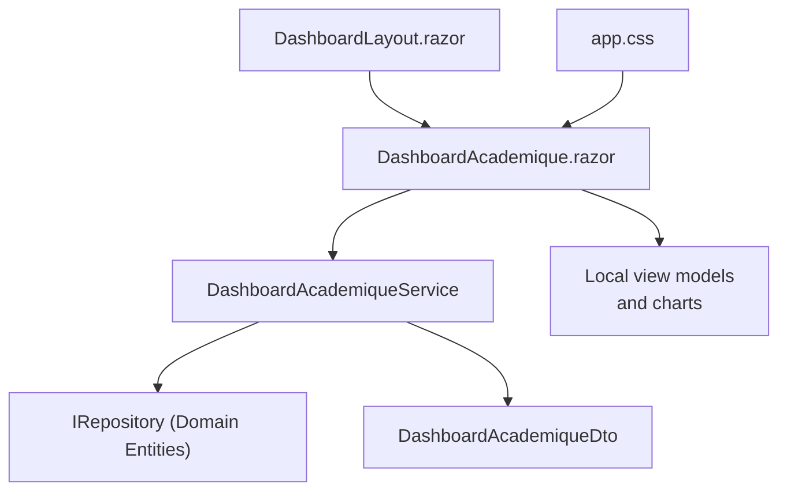
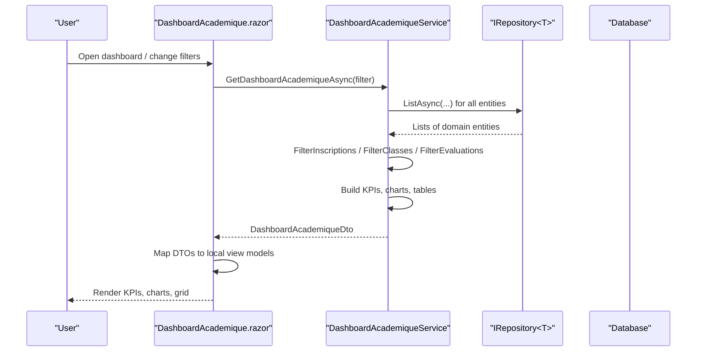
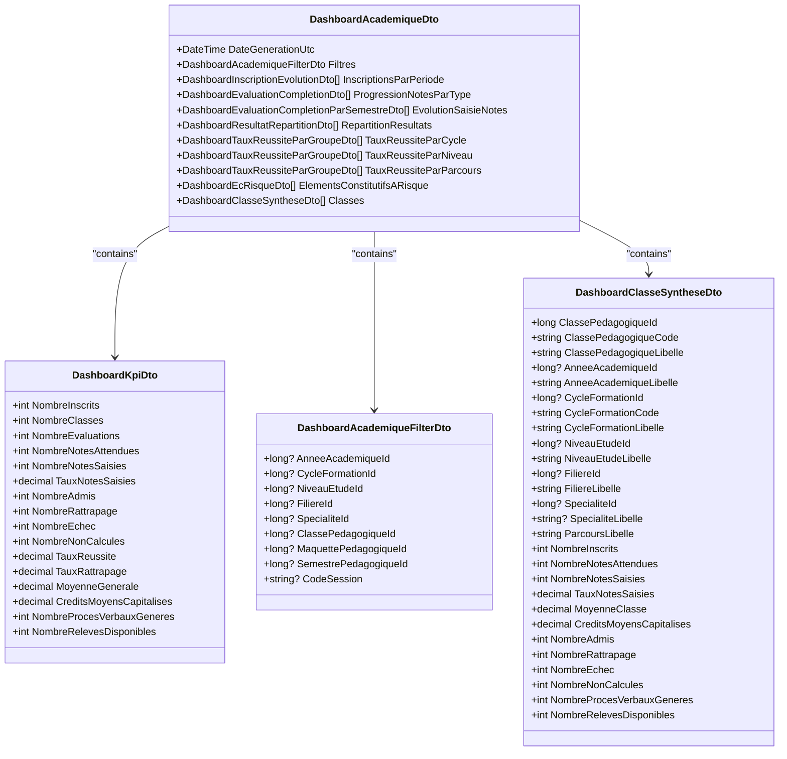
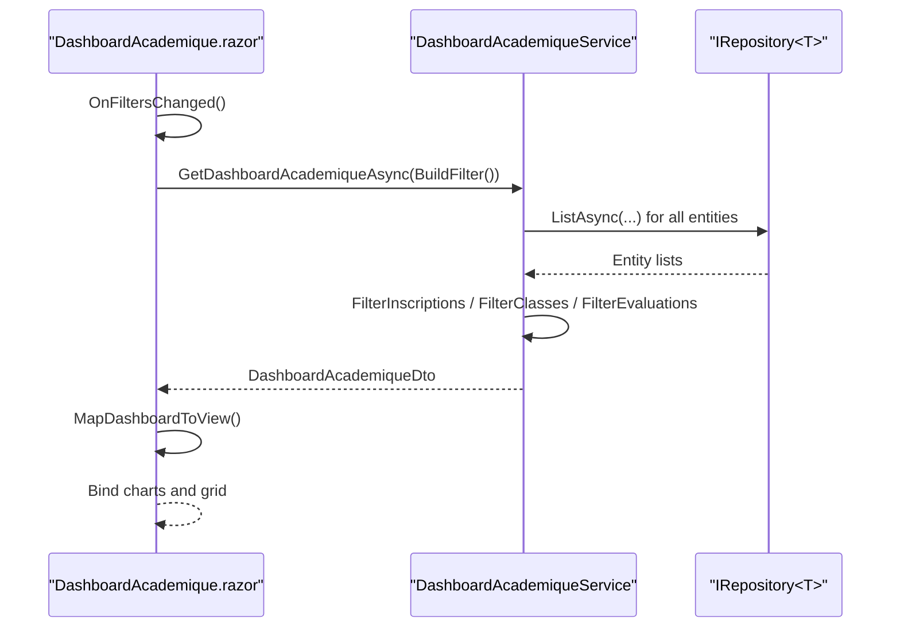
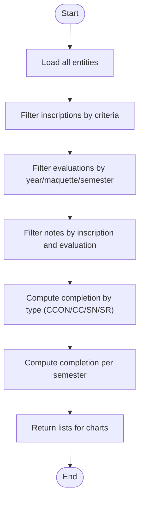
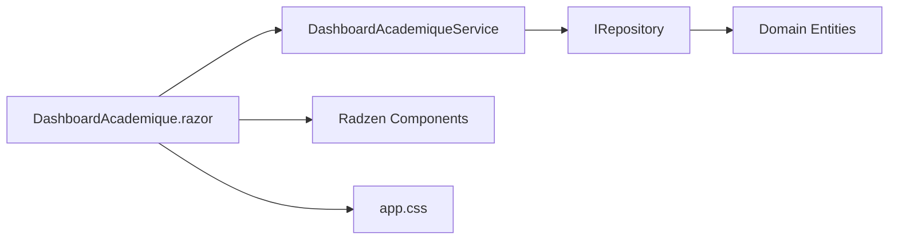

# Dashboard & Analytics

<cite>
**Referenced Files in This Document**
- [DashboardAcademique.razor](file://RIIS.Academic.Web/Components/Pages/DashboardAcademique.razor)
- [Dashboard.razor](file://RIIS.Academic.Web/Components/Pages/Dashboard.razor)
- [DashboardLayout.razor](file://RIIS.Academic.Web/Components/Layout/DashboardLayout.razor)
- [DashboardAcademiqueService.cs](file://RIIS.Academic.Application/Dashboard/Services/DashboardAcademiqueService.cs)
- [IDashboardAcademiqueService.cs](file://RIIS.Academic.Application/Dashboard/Services/IDashboardAcademiqueService.cs)
- [DashboardAcademiqueDto.cs](file://RIIS.Academic.Application/Dashboard/Dtos/DashboardAcademiqueDto.cs)
- [DashboardKpiDto.cs](file://RIIS.Academic.Application/Dashboard/Dtos/DashboardKpiDto.cs)
- [DashboardAcademiqueFilterDto.cs](file://RIIS.Academic.Application/Dashboard/Dtos/DashboardAcademiqueFilterDto.cs)
- [DashboardClasseSyntheseDto.cs](file://RIIS.Academic.Application/Dashboard/Dtos/DashboardClasseSyntheseDto.cs)
- [app.css](file://RIIS.Academic.Web/wwwroot/css/app.css)
</cite>

## Table of Contents
1. [Introduction](#introduction)
2. [Project Structure](#project-structure)
3. [Core Components](#core-components)
4. [Architecture Overview](#architecture-overview)
5. [Detailed Component Analysis](#detailed-component-analysis)
6. [Dependency Analysis](#dependency-analysis)
7. [Performance Considerations](#performance-considerations)
8. [Troubleshooting Guide](#troubleshooting-guide)
9. [Conclusion](#conclusion)

## Introduction
This document explains the academic dashboard and analytics features implemented in the application. It covers:
- The academic dashboard UI, KPIs, data visualization components, and real-time metrics display
- Integration with the dashboard service layer
- Chart rendering using Radzen Blazor components
- Responsive design patterns
- Examples of filtering, data aggregation, and performance optimization techniques for large datasets

The dashboard provides a comprehensive overview of academic operations including enrollment trends, note completion rates, success rates by group, at-risk elements, and class-level summaries.

## Project Structure
The dashboard spans the Web (Blazor UI), Application (service and DTOs), and Domain layers. The key files are:
- Web UI: Dashboard page, layout, and styling
- Application: Service that aggregates data from multiple domain entities and returns structured DTOs
- DTOs: Strongly typed contracts for filters, KPIs, and visualizations

**Diagram sources**
- [DashboardAcademique.razor:1-659](file://RIIS.Academic.Web/Components/Pages/DashboardAcademique.razor#L1-L659)
- [DashboardAcademiqueService.cs:1-658](file://RIIS.Academic.Application/Dashboard/Services/DashboardAcademiqueService.cs#L1-L658)
- [DashboardAcademiqueDto.cs:1-18](file://RIIS.Academic.Application/Dashboard/Dtos/DashboardAcademiqueDto.cs#L1-L18)
- [DashboardLayout.razor:1-33](file://RIIS.Academic.Web/Components/Layout/DashboardLayout.razor#L1-L33)
- [app.css:1-11](file://RIIS.Academic.Web/wwwroot/css/app.css#L1-L11)

**Section sources**
- [DashboardAcademique.razor:1-659](file://RIIS.Academic.Web/Components/Pages/DashboardAcademique.razor#L1-L659)
- [DashboardAcademiqueService.cs:1-658](file://RIIS.Academic.Application/Dashboard/Services/DashboardAcademiqueService.cs#L1-L658)
- [DashboardAcademiqueDto.cs:1-18](file://RIIS.Academic.Application/Dashboard/Dtos/DashboardAcademiqueDto.cs#L1-L18)
- [DashboardLayout.razor:1-33](file://RIIS.Academic.Web/Components/Layout/DashboardLayout.razor#L1-L33)
- [app.css:1-11](file://RIIS.Academic.Web/wwwroot/css/app.css#L1-L11)

## Core Components
- Academic Dashboard Page: Provides filters, KPI cards, sparklines, charts, tabs, and a summary DataGrid
- Dashboard Service: Loads all required domain data once per request, applies filters, computes aggregations, and returns a rich DTO
- DTOs: Define filter inputs, KPIs, and chart-ready lists
- Layout and Styling: Radzen-based responsive layout and minimal custom CSS

Key responsibilities:
- UI binds to local view models and maps service DTOs into chart-friendly structures
- Service composes data across many entities (inscriptions, evaluations, notes, results, classes, etc.)
- Charts use Radzen series (Area, Column, Donut, Sparkline) bound to lists
- Filters drive server-side aggregation via filter DTOs

**Section sources**
- [DashboardAcademique.razor:1-659](file://RIIS.Academic.Web/Components/Pages/DashboardAcademique.razor#L1-L659)
- [DashboardAcademiqueService.cs:1-658](file://RIIS.Academic.Application/Dashboard/Services/DashboardAcademiqueService.cs#L1-L658)
- [DashboardAcademiqueDto.cs:1-18](file://RIIS.Academic.Application/Dashboard/Dtos/DashboardAcademiqueDto.cs#L1-L18)
- [DashboardKpiDto.cs:1-22](file://RIIS.Academic.Application/Dashboard/Dtos/DashboardKpiDto.cs#L1-L22)
- [DashboardAcademiqueFilterDto.cs:1-15](file://RIIS.Academic.Application/Dashboard/Dtos/DashboardAcademiqueFilterDto.cs#L1-L15)
- [DashboardClasseSyntheseDto.cs:1-33](file://RIIS.Academic.Application/Dashboard/Dtos/DashboardClasseSyntheseDto.cs#L1-L33)

## Architecture Overview
The dashboard follows a clean architecture pattern:
- Presentation (Blazor UI) consumes a service interface
- Application service orchestrates data access through repositories and computes aggregated metrics
- Domain entities represent academic concepts (classes, inscriptions, evaluations, results, etc.)

**Diagram sources**
- [DashboardAcademique.razor:354-401](file://RIIS.Academic.Web/Components/Pages/DashboardAcademique.razor#L354-L401)
- [DashboardAcademiqueService.cs:27-58](file://RIIS.Academic.Application/Dashboard/Services/DashboardAcademiqueService.cs#L27-L58)
- [DashboardAcademiqueService.cs:60-79](file://RIIS.Academic.Application/Dashboard/Services/DashboardAcademiqueService.cs#L60-L79)

## Detailed Component Analysis

### Academic Dashboard Page (UI)
Responsibilities:
- Provide filter controls (academic year, cycle, level, program/path, semester)
- Display KPI cards with progress bars and sparklines
- Render charts for note completion evolution, result distribution, success rate by cycle
- Show at-risk elements list and a class synthesis DataGrid with sorting, filtering, and paging
- Handle loading states and errors

Data flow:
- OnInitializedAsync loads dashboard data and builds filter options
- Filter changes trigger reload with current filter values
- Refresh button rebuilds filter options and reloads data
- Maps service DTOs into local records optimized for Radzen charts and grid columns

Charts used:
- Area charts for note completion evolution over semesters
- Column charts for success rate by cycle
- Donut chart for result distribution
- Sparkline column series for monthly enrollments and note completion progression

Responsive design:
- Uses Radzen grid columns with breakpoints (SizeMD, SizeXL)
- Cards and charts adapt to available width
- Minimal custom CSS for focus styles

Error handling:
- Displays alert on load errors
- Shows notification with error details

**Section sources**
- [DashboardAcademique.razor:1-659](file://RIIS.Academic.Web/Components/Pages/DashboardAcademique.razor#L1-L659)
- [app.css:1-11](file://RIIS.Academic.Web/wwwroot/css/app.css#L1-L11)

#### Class Diagram: View Models and DTOs

**Diagram sources**
- [DashboardAcademiqueDto.cs:1-18](file://RIIS.Academic.Application/Dashboard/Dtos/DashboardAcademiqueDto.cs#L1-L18)
- [DashboardKpiDto.cs:1-22](file://RIIS.Academic.Application/Dashboard/Dtos/DashboardKpiDto.cs#L1-L22)
- [DashboardAcademiqueFilterDto.cs:1-15](file://RIIS.Academic.Application/Dashboard/Dtos/DashboardAcademiqueFilterDto.cs#L1-L15)
- [DashboardClasseSyntheseDto.cs:1-33](file://RIIS.Academic.Application/Dashboard/Dtos/DashboardClasseSyntheseDto.cs#L1-L33)

#### Sequence Diagram: Filtering and Data Loading

**Diagram sources**
- [DashboardAcademique.razor:359-416](file://RIIS.Academic.Web/Components/Pages/DashboardAcademique.razor#L359-L416)
- [DashboardAcademiqueService.cs:27-58](file://RIIS.Academic.Application/Dashboard/Services/DashboardAcademiqueService.cs#L27-L58)
- [DashboardAcademiqueService.cs:60-79](file://RIIS.Academic.Application/Dashboard/Services/DashboardAcademiqueService.cs#L60-L79)

#### Flowchart: Aggregation Logic for Note Completion

**Diagram sources**
- [DashboardAcademiqueService.cs:260-313](file://RIIS.Academic.Application/Dashboard/Services/DashboardAcademiqueService.cs#L260-L313)

### Dashboard Service
Responsibilities:
- Load all necessary domain data in one pass
- Apply filters to inscriptions, classes, evaluations, and notes
- Compute KPIs, enrollment evolution, note completion, result distribution, success rates by group, at-risk elements, and class summaries
- Return a single DTO containing all data needed by the UI

Key methods:
- GetDashboardAcademiqueAsync: Orchestrates loading, filtering, and building the dashboard DTO
- LoadDataAsync: Fetches all entities via repositories
- FilterInscriptions/FilterClasses/FilterEvaluations: Apply filter logic
- BuildKpi/BuildInscriptionsParPeriode/BuildProgressionNotesParType/BuildEvolutionSaisieNotes/BuildRepartitionResultats/BuildTauxReussiteParGroupe/BuildElementsConstitutifsARisque/BuildClassesSynthese: Aggregate metrics

Performance characteristics:
- Single bulk load of entities reduces round-trips
- In-memory filtering and grouping after initial load
- Use of HashSet lookups for efficient membership checks
- Grouping and ordering performed in memory

**Section sources**
- [DashboardAcademiqueService.cs:27-58](file://RIIS.Academic.Application/Dashboard/Services/DashboardAcademiqueService.cs#L27-L58)
- [DashboardAcademiqueService.cs:60-79](file://RIIS.Academic.Application/Dashboard/Services/DashboardAcademiqueService.cs#L60-L79)
- [DashboardAcademiqueService.cs:81-207](file://RIIS.Academic.Application/Dashboard/Services/DashboardAcademiqueService.cs#L81-L207)
- [DashboardAcademiqueService.cs:209-467](file://RIIS.Academic.Application/Dashboard/Services/DashboardAcademiqueService.cs#L209-L467)

### Key Performance Indicators (KPIs)
The KPI set includes:
- Number of enrolled students
- Number of classes and evaluations
- Expected vs. entered notes and completion percentage
- Number admitted, retake, failed, not calculated
- Success and retake rates
- Average grade and average credits acquired
- Number of generated PVs and available transcripts

These are computed from annual results, inscriptions, evaluations, and notes, then exposed via DashboardKpiDto and mapped to UI KPI cards.

**Section sources**
- [DashboardKpiDto.cs:1-22](file://RIIS.Academic.Application/Dashboard/Dtos/DashboardKpiDto.cs#L1-L22)
- [DashboardAcademiqueService.cs:209-246](file://RIIS.Academic.Application/Dashboard/Services/DashboardAcademiqueService.cs#L209-L246)
- [DashboardAcademique.razor:112-172](file://RIIS.Academic.Web/Components/Pages/DashboardAcademique.razor#L112-L172)

### Data Visualization Components
- KPI cards with progress bars and sparklines for quick insights
- Area chart showing note completion evolution by semester and type
- Column chart for success rate by cycle
- Donut chart for result distribution (admitted, retake, fail, not calculated)
- At-risk elements list with failure rate and class context
- DataGrid for class synthesis with sorting, filtering, and paging

All charts are rendered using Radzen Blazor components and bound to lists prepared by the service or mapped locally.

**Section sources**
- [DashboardAcademique.razor:175-255](file://RIIS.Academic.Web/Components/Pages/DashboardAcademique.razor#L175-L255)
- [DashboardAcademique.razor:258-304](file://RIIS.Academic.Web/Components/Pages/DashboardAcademique.razor#L258-L304)
- [DashboardAcademiqueService.cs:248-367](file://RIIS.Academic.Application/Dashboard/Services/DashboardAcademiqueService.cs#L248-L367)

### Real-Time Metrics Display
- The dashboard displays generation timestamp and badges indicating data source
- Loading indicators show during data fetch
- Errors are surfaced via alerts and notifications
- Refresh action rebuilds filter options and reloads data

While not streaming in real time, the UI provides immediate feedback and up-to-date snapshots based on the latest service call.

**Section sources**
- [DashboardAcademique.razor:15-21](file://RIIS.Academic.Web/Components/Pages/DashboardAcademique.razor#L15-L21)
- [DashboardAcademique.razor:33-41](file://RIIS.Academic.Web/Components/Pages/DashboardAcademique.razor#L33-L41)
- [DashboardAcademique.razor:364-401](file://RIIS.Academic.Web/Components/Pages/DashboardAcademique.razor#L364-L401)

### Integration with Dashboard Services
- The UI injects IDashboardAcademiqueService and calls GetDashboardAcademiqueAsync with a filter DTO
- The service uses multiple IRepository<T> instances to load domain entities and compute aggregated results
- The returned DTO contains all sections needed by the UI; the UI maps them to local view models for chart binding

**Section sources**
- [DashboardAcademique.razor:2-3](file://RIIS.Academic.Web/Components/Pages/DashboardAcademique.razor#L2-L3)
- [DashboardAcademique.razor:374-383](file://RIIS.Academic.Web/Components/Pages/DashboardAcademique.razor#L374-L383)
- [IDashboardAcademiqueService.cs:5-10](file://RIIS.Academic.Application/Dashboard/Services/IDashboardAcademiqueService.cs#L5-L10)
- [DashboardAcademiqueService.cs:27-58](file://RIIS.Academic.Application/Dashboard/Services/DashboardAcademiqueService.cs#L27-L58)

### Responsive Design Patterns
- Radzen grid columns with responsive sizes (SizeMD, SizeXL) ensure layout adapts to screen size
- Cards and charts fill available space with flexible sizing
- Custom CSS removes focus outlines and ensures consistent appearance

**Section sources**
- [DashboardAcademique.razor:6-21](file://RIIS.Academic.Web/Components/Pages/DashboardAcademique.razor#L6-L21)
- [DashboardAcademique.razor:108-173](file://RIIS.Academic.Web/Components/Pages/DashboardAcademique.razor#L108-L173)
- [app.css:1-11](file://RIIS.Academic.Web/wwwroot/css/app.css#L1-L11)

### Examples: Filtering, Data Aggregation, Optimization
- Filtering:
  - Academic year, cycle, level, program/path, semester are bound to dropdowns and trigger reload
  - Filters are composed into DashboardAcademiqueFilterDto and applied server-side
- Data aggregation:
  - Enrollment evolution grouped by month
  - Note completion by type and per semester
  - Result distribution counts and percentages
  - Success rates grouped by cycle, level, and program/path
  - At-risk elements identified by failure rate and class context
  - Class synthesis aggregates per-class metrics
- Optimization techniques:
  - Bulk load of entities to minimize database calls
  - In-memory filtering and grouping using LINQ
  - HashSet lookups for fast membership checks
  - Limiting top N items for at-risk elements and other lists

**Section sources**
- [DashboardAcademique.razor:43-104](file://RIIS.Academic.Web/Components/Pages/DashboardAcademique.razor#L43-L104)
- [DashboardAcademique.razor:403-416](file://RIIS.Academic.Web/Components/Pages/DashboardAcademique.razor#L403-L416)
- [DashboardAcademiqueService.cs:81-207](file://RIIS.Academic.Application/Dashboard/Services/DashboardAcademiqueService.cs#L81-L207)
- [DashboardAcademiqueService.cs:248-467](file://RIIS.Academic.Application/Dashboard/Services/DashboardAcademiqueService.cs#L248-L467)

## Dependency Analysis
The dashboard depends on:
- UI components (Radzen Blazor) for layout and charts
- Application service for data aggregation
- Repository abstractions for data access
- Domain entities for academic concepts

**Diagram sources**
- [DashboardAcademique.razor:1-659](file://RIIS.Academic.Web/Components/Pages/DashboardAcademique.razor#L1-L659)
- [DashboardAcademiqueService.cs:1-658](file://RIIS.Academic.Application/Dashboard/Services/DashboardAcademiqueService.cs#L1-L658)
- [app.css:1-11](file://RIIS.Academic.Web/wwwroot/css/app.css#L1-L11)

**Section sources**
- [DashboardAcademique.razor:1-659](file://RIIS.Academic.Web/Components/Pages/DashboardAcademique.razor#L1-L659)
- [DashboardAcademiqueService.cs:1-658](file://RIIS.Academic.Application/Dashboard/Services/DashboardAcademiqueService.cs#L1-L658)

## Performance Considerations
- Single bulk load of entities reduces network overhead
- In-memory filtering and grouping avoid repeated queries
- Use of HashSet for O(1) membership checks improves performance on large datasets
- Limiting displayed items (e.g., top 6 at-risk elements) reduces UI rendering cost
- DataGrid paging and filtering improve responsiveness for large class lists
- Avoid unnecessary re-renders by mapping DTOs once per load

[No sources needed since this section provides general guidance]

## Troubleshooting Guide
Common issues and resolutions:
- Load errors:
  - The UI shows an alert and a notification with error details when fetching dashboard data fails
- Empty data:
  - Ensure filters are correctly set; rebuild filter options by refreshing the dashboard
- Chart rendering issues:
  - Verify that mapped lists contain expected data and properties match chart bindings
- Performance degradation:
  - Check if too many filters are applied; consider narrowing scope (year, cycle, semester)

**Section sources**
- [DashboardAcademique.razor:23-28](file://RIIS.Academic.Web/Components/Pages/DashboardAcademique.razor#L23-L28)
- [DashboardAcademique.razor:385-396](file://RIIS.Academic.Web/Components/Pages/DashboardAcademique.razor#L385-L396)

## Conclusion
The academic dashboard provides a comprehensive, responsive, and performant view of academic operations. It integrates a robust service layer that aggregates data across multiple domain entities and presents it through intuitive Radzen components. The design supports flexible filtering, clear KPIs, and actionable insights such as at-risk elements and class-level summaries. With careful aggregation and in-memory processing, the dashboard remains efficient even with large datasets.

[No sources needed since this section summarizes without analyzing specific files]