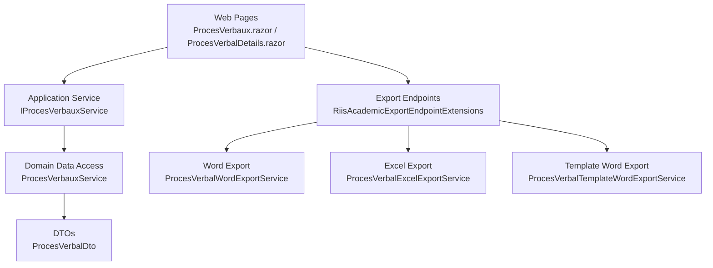
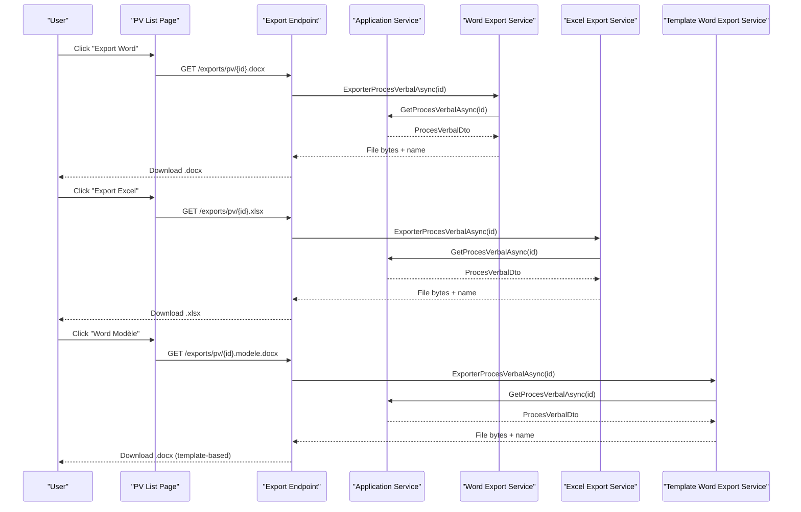
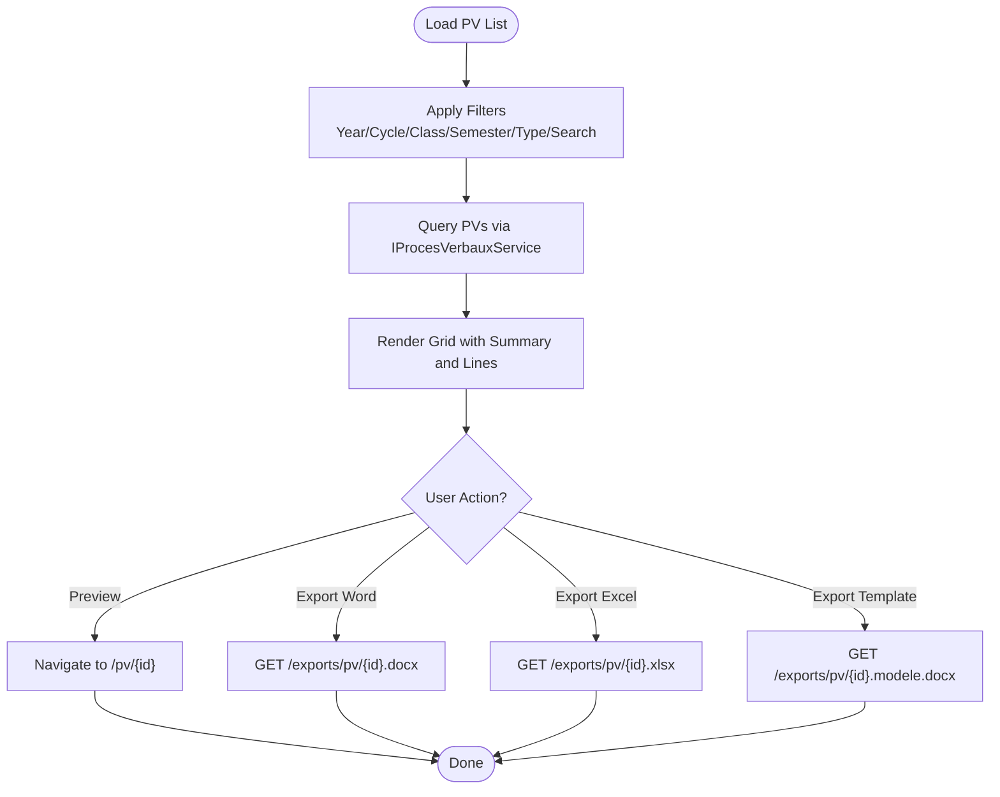
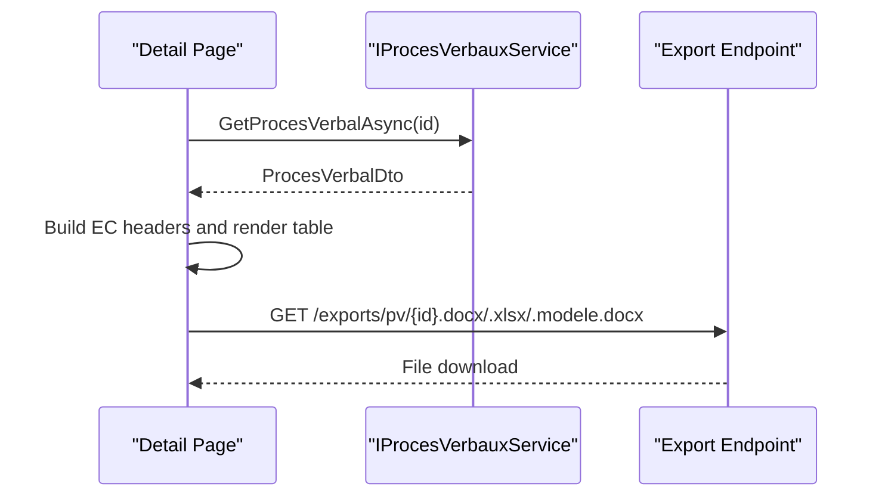
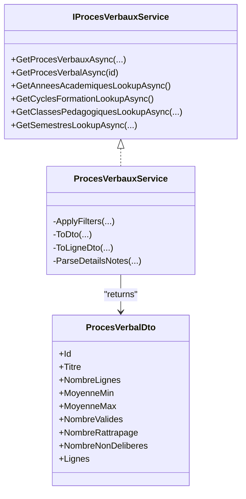
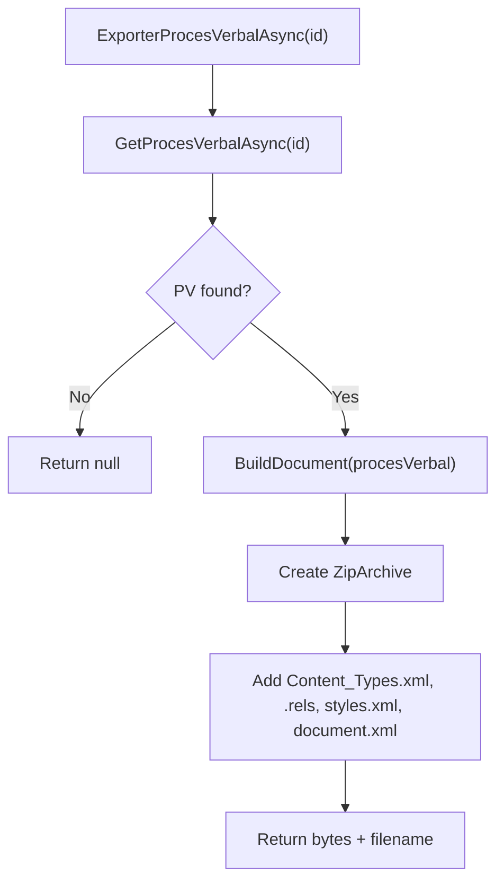
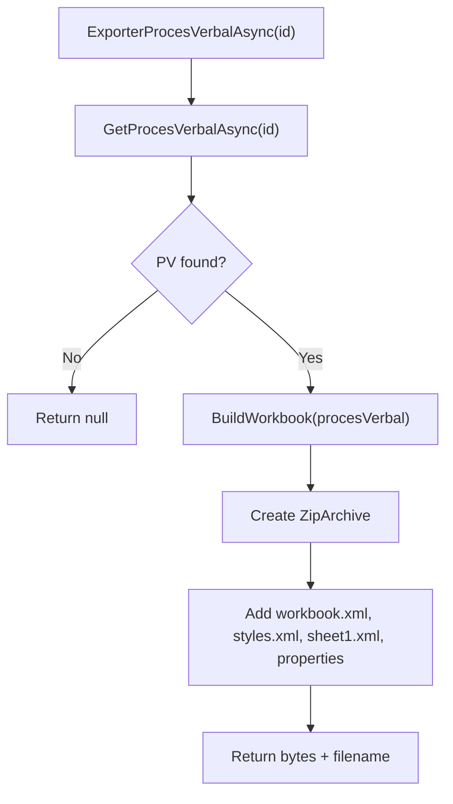
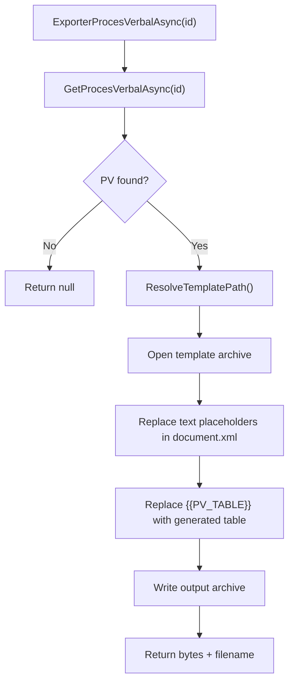
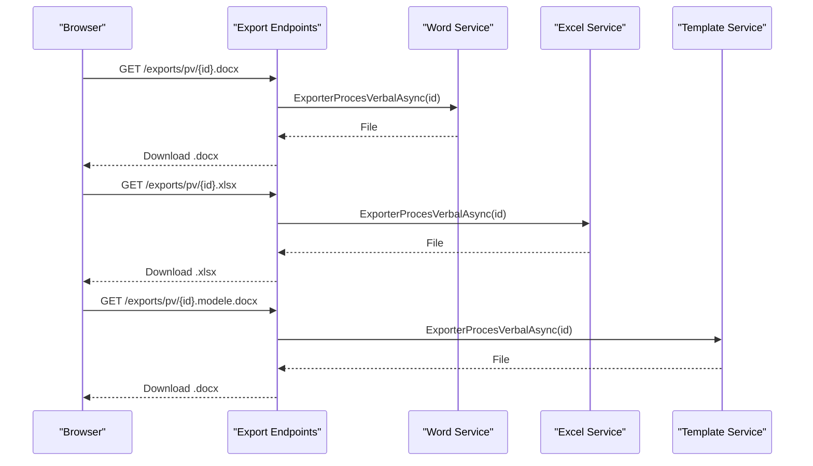
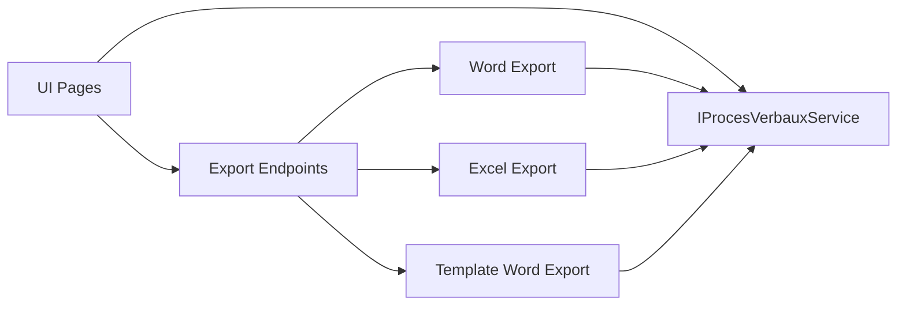

# Document Generation UI

<cite>
**Referenced Files in This Document**
- [ProcesVerbaux.razor](file://RIIS.Academic.Web/Components/Pages/ProcesVerbaux.razor)
- [ProcesVerbalDetails.razor](file://RIIS.Academic.Web/Components/Pages/ProcesVerbalDetails.razor)
- [RiisAcademicExportEndpointExtensions.cs](file://RIIS.Academic.Web/Extensions/RiisAcademicExportEndpointExtensions.cs)
- [IProcesVerbauxService.cs](file://RIIS.Academic.Application/ProcesVerbaux/Services/IProcesVerbauxService.cs)
- [ProcesVerbauxService.cs](file://RIIS.Academic.Application/ProcesVerbaux/Services/ProcesVerbauxService.cs)
- [ProcesVerbalDto.cs](file://RIIS.Academic.Application/ProcesVerbaux/Dtos/ProcesVerbalDto.cs)
- [ProcesVerbalWordExportService.cs](file://RIIS.Academic.Infrastructure/Documents/ProcesVerbalWordExportService.cs)
- [ProcesVerbalExcelExportService.cs](file://RIIS.Academic.Infrastructure/Documents/ProcesVerbalExcelExportService.cs)
- [ProcesVerbalTemplateWordExportService.cs](file://RIIS.Academic.Infrastructure/Documents/ProcesVerbalTemplateWordExportService.cs)
- [ProcesVerbal.cs](file://RIIS.Academic.Domain/ProcesVerbaux/ProcesVerbal.cs)
</cite>

## Table of Contents
1. Introduction
2. Project Structure
3. Core Components
4. Architecture Overview
5. Detailed Component Analysis
6. Dependency Analysis
7. Performance Considerations
8. Troubleshooting Guide
9. Conclusion

## Introduction
This document explains the document generation user interface for meeting minutes (Procès-verbaux, PV), transcript generation, and document preview. It covers template-based document creation, export options (Word and Excel), and how documents are presented and distributed from the web UI. It also provides guidance on custom templates, bulk generation patterns, and distribution workflows based on the implemented endpoints and services.

## Project Structure
The document generation feature spans three layers:
- Web UI (Blazor pages) for filtering, listing, previewing, and triggering exports
- Application services for querying PV data and lookups
- Infrastructure services for generating Word and Excel files, including a template-based Word generator

**Diagram sources**
- [ProcesVerbaux.razor:1-398](file://RIIS.Academic.Web/Components/Pages/ProcesVerbaux.razor#L1-L398)
- [ProcesVerbalDetails.razor:1-404](file://RIIS.Academic.Web/Components/Pages/ProcesVerbalDetails.razor#L1-L404)
- [RiisAcademicExportEndpointExtensions.cs:1-94](file://RIIS.Academic.Web/Extensions/RiisAcademicExportEndpointExtensions.cs#L1-L94)
- [IProcesVerbauxService.cs:1-31](file://RIIS.Academic.Application/ProcesVerbaux/Services/IProcesVerbauxService.cs#L1-L31)
- [ProcesVerbauxService.cs:1-379](file://RIIS.Academic.Application/ProcesVerbaux/Services/ProcesVerbauxService.cs#L1-L379)
- [ProcesVerbalDto.cs:1-41](file://RIIS.Academic.Application/ProcesVerbaux/Dtos/ProcesVerbalDto.cs#L1-L41)
- [ProcesVerbalWordExportService.cs:1-513](file://RIIS.Academic.Infrastructure/Documents/ProcesVerbalWordExportService.cs#L1-L513)
- [ProcesVerbalExcelExportService.cs:1-502](file://RIIS.Academic.Infrastructure/Documents/ProcesVerbalExcelExportService.cs#L1-L502)
- [ProcesVerbalTemplateWordExportService.cs:1-474](file://RIIS.Academic.Infrastructure/Documents/ProcesVerbalTemplateWordExportService.cs#L1-L474)

**Section sources**
- [ProcesVerbaux.razor:1-398](file://RIIS.Academic.Web/Components/Pages/ProcesVerbaux.razor#L1-L398)
- [ProcesVerbalDetails.razor:1-404](file://RIIS.Academic.Web/Components/Pages/ProcesVerbalDetails.razor#L1-L404)
- [RiisAcademicExportEndpointExtensions.cs:1-94](file://RIIS.Academic.Web/Extensions/RiisAcademicExportEndpointExtensions.cs#L1-L94)

## Core Components
- PV list page with filters and actions:
  - Filters by academic year, cycle, class, semester, type, and free-text search
  - Displays summary metrics and student lines per PV
  - Actions: Preview, Export to Word, Export to Excel, Export Template Word
- PV detail page:
  - Renders a formatted preview of a single PV with metadata, student table, and signature blocks
  - Provides direct export buttons for Word, Excel, and Template Word
- Export endpoints:
  - Serve downloadable .docx and .xlsx files for a given PV id
  - Support both generated Word content and template-based Word output
- Application service:
  - Retrieves PV entities and related lookups, applies filters, and maps to DTOs
- Export services:
  - Generate Word documents programmatically or via template substitution
  - Generate Excel spreadsheets with styled headers, merged cells, and print settings

**Section sources**
- [ProcesVerbaux.razor:17-182](file://RIIS.Academic.Web/Components/Pages/ProcesVerbaux.razor#L17-L182)
- [ProcesVerbalDetails.razor:14-35](file://RIIS.Academic.Web/Components/Pages/ProcesVerbalDetails.razor#L14-L35)
- [RiisAcademicExportEndpointExtensions.cs:11-57](file://RIIS.Academic.Web/Extensions/RiisAcademicExportEndpointExtensions.cs#L11-L57)
- [IProcesVerbauxService.cs:9-29](file://RIIS.Academic.Application/ProcesVerbaux/Services/IProcesVerbauxService.cs#L9-L29)
- [ProcesVerbauxService.cs:18-87](file://RIIS.Academic.Application/ProcesVerbaux/Services/ProcesVerbauxService.cs#L18-L87)
- [ProcesVerbalWordExportService.cs:12-29](file://RIIS.Academic.Infrastructure/Documents/ProcesVerbalWordExportService.cs#L12-L29)
- [ProcesVerbalExcelExportService.cs:14-31](file://RIIS.Academic.Infrastructure/Documents/ProcesVerbalExcelExportService.cs#L14-L31)
- [ProcesVerbalTemplateWordExportService.cs:16-33](file://RIIS.Academic.Infrastructure/Documents/ProcesVerbalTemplateWordExportService.cs#L16-L33)

## Architecture Overview
The UI triggers exports through navigation to dedicated endpoints. Each endpoint resolves an export service that builds the file content and returns it as a downloadable file. The application service supplies PV data and lookup values used by the UI and export services.

**Diagram sources**
- [ProcesVerbaux.razor:157-179](file://RIIS.Academic.Web/Components/Pages/ProcesVerbaux.razor#L157-L179)
- [RiisAcademicExportEndpointExtensions.cs:11-57](file://RIIS.Academic.Web/Extensions/RiisAcademicExportEndpointExtensions.cs#L11-L57)
- [ProcesVerbalWordExportService.cs:12-29](file://RIIS.Academic.Infrastructure/Documents/ProcesVerbalWordExportService.cs#L12-L29)
- [ProcesVerbalExcelExportService.cs:14-31](file://RIIS.Academic.Infrastructure/Documents/ProcesVerbalExcelExportService.cs#L14-L31)
- [ProcesVerbalTemplateWordExportService.cs:16-33](file://RIIS.Academic.Infrastructure/Documents/ProcesVerbalTemplateWordExportService.cs#L16-L33)
- [IProcesVerbauxService.cs:17-17](file://RIIS.Academic.Application/ProcesVerbaux/Services/IProcesVerbauxService.cs#L17-L17)

## Detailed Component Analysis

### PV List Page
- Filtering:
  - Academic year, cycle, class, semester, PV type, and free-text search
  - Dependent dropdowns refresh when higher-level filters change
- Display:
  - Grid shows PV summary fields and counts (students, valid, retake, not deliberated)
  - Expandable rows show student lines with grades, credits, ranking, and decision badges
- Actions:
  - Preview navigates to detail page
  - Exports navigate to download endpoints for Word, Excel, and template Word

**Section sources**
- [ProcesVerbaux.razor:17-182](file://RIIS.Academic.Web/Components/Pages/ProcesVerbaux.razor#L17-L182)
- [ProcesVerbaux.razor:246-334](file://RIIS.Academic.Web/Components/Pages/ProcesVerbaux.razor#L246-L334)

### PV Detail Page
- Loads a single PV by id and renders:
  - Header with title and subtitle
  - Metadata grid (cycle, parcours, class, year, session, status)
  - Student table with optional element-constitutif columns
  - Signature placeholders
- Exports:
  - Direct buttons trigger Word, Excel, and template Word downloads

**Diagram sources**
- [ProcesVerbalDetails.razor:326-343](file://RIIS.Academic.Web/Components/Pages/ProcesVerbalDetails.razor#L326-L343)
- [ProcesVerbalDetails.razor:367-374](file://RIIS.Academic.Web/Components/Pages/ProcesVerbalDetails.razor#L367-L374)
- [RiisAcademicExportEndpointExtensions.cs:11-57](file://RIIS.Academic.Web/Extensions/RiisAcademicExportEndpointExtensions.cs#L11-L57)

**Section sources**
- [ProcesVerbalDetails.razor:1-191](file://RIIS.Academic.Web/Components/Pages/ProcesVerbalDetails.razor#L1-L191)
- [ProcesVerbalDetails.razor:318-404](file://RIIS.Academic.Web/Components/Pages/ProcesVerbalDetails.razor#L318-L404)

### Application Service (PV Queries)
- Retrieves PVs and related entities, applies hierarchical filters, and maps to DTOs
- Provides lookup lists for UI filters (years, cycles, classes, semesters)
- Parses nested JSON details for element-constitutif scores into structured DTOs

**Diagram sources**
- [IProcesVerbauxService.cs:7-30](file://RIIS.Academic.Application/ProcesVerbaux/Services/IProcesVerbauxService.cs#L7-L30)
- [ProcesVerbauxService.cs:18-87](file://RIIS.Academic.Application/ProcesVerbaux/Services/ProcesVerbauxService.cs#L18-L87)
- [ProcesVerbauxService.cs:180-243](file://RIIS.Academic.Application/ProcesVerbaux/Services/ProcesVerbauxService.cs#L180-L243)
- [ProcesVerbauxService.cs:245-379](file://RIIS.Academic.Application/ProcesVerbaux/Services/ProcesVerbauxService.cs#L245-L379)
- [ProcesVerbalDto.cs:5-40](file://RIIS.Academic.Application/ProcesVerbaux/Dtos/ProcesVerbalDto.cs#L5-L40)

**Section sources**
- [IProcesVerbauxService.cs:1-31](file://RIIS.Academic.Application/ProcesVerbaux/Services/IProcesVerbauxService.cs#L1-L31)
- [ProcesVerbauxService.cs:1-379](file://RIIS.Academic.Application/ProcesVerbaux/Services/ProcesVerbauxService.cs#L1-L379)
- [ProcesVerbalDto.cs:1-41](file://RIIS.Academic.Application/ProcesVerbaux/Dtos/ProcesVerbalDto.cs#L1-L41)

### Word Export (Generated)
- Builds a .docx package in memory using OpenXML structure
- Generates header, info table, student table (simple or detailed), and signature block
- Styles headings, tables, and notes; sets landscape orientation and margins

**Diagram sources**
- [ProcesVerbalWordExportService.cs:12-29](file://RIIS.Academic.Infrastructure/Documents/ProcesVerbalWordExportService.cs#L12-L29)
- [ProcesVerbalWordExportService.cs:32-89](file://RIIS.Academic.Infrastructure/Documents/ProcesVerbalWordExportService.cs#L32-L89)
- [ProcesVerbalWordExportService.cs:477-511](file://RIIS.Academic.Infrastructure/Documents/ProcesVerbalWordExportService.cs#L477-L511)

**Section sources**
- [ProcesVerbalWordExportService.cs:1-513](file://RIIS.Academic.Infrastructure/Documents/ProcesVerbalWordExportService.cs#L1-L513)

### Excel Export
- Creates an .xlsx workbook with a single sheet named “PV”
- Includes merged header rows, frozen panes, column widths, and print setup
- Supports simple or detailed tables depending on presence of element-constitutif details

**Diagram sources**
- [ProcesVerbalExcelExportService.cs:14-31](file://RIIS.Academic.Infrastructure/Documents/ProcesVerbalExcelExportService.cs#L14-L31)
- [ProcesVerbalExcelExportService.cs:34-49](file://RIIS.Academic.Infrastructure/Documents/ProcesVerbalExcelExportService.cs#L34-L49)
- [ProcesVerbalExcelExportService.cs:384-447](file://RIIS.Academic.Infrastructure/Documents/ProcesVerbalExcelExportService.cs#L384-L447)

**Section sources**
- [ProcesVerbalExcelExportService.cs:1-502](file://RIIS.Academic.Infrastructure/Documents/ProcesVerbalExcelExportService.cs#L1-L502)

### Template-Based Word Export
- Reads a template .docx from configured locations
- Replaces text placeholders such as type, semester, year, cycle, parcours, level, class, session, status, counts, and observation
- Replaces a placeholder table with a generated table matching current PV data
- Requires a template file containing specific placeholders

**Diagram sources**
- [ProcesVerbalTemplateWordExportService.cs:16-33](file://RIIS.Academic.Infrastructure/Documents/ProcesVerbalTemplateWordExportService.cs#L16-L33)
- [ProcesVerbalTemplateWordExportService.cs:36-68](file://RIIS.Academic.Infrastructure/Documents/ProcesVerbalTemplateWordExportService.cs#L36-L68)
- [ProcesVerbalTemplateWordExportService.cs:70-86](file://RIIS.Academic.Infrastructure/Documents/ProcesVerbalTemplateWordExportService.cs#L70-L86)
- [ProcesVerbalTemplateWordExportService.cs:88-137](file://RIIS.Academic.Infrastructure/Documents/ProcesVerbalTemplateWordExportService.cs#L88-L137)

**Section sources**
- [ProcesVerbalTemplateWordExportService.cs:1-474](file://RIIS.Academic.Infrastructure/Documents/ProcesVerbalTemplateWordExportService.cs#L1-L474)

### Export Endpoints
- Provide HTTP GET endpoints for:
  - Word (.docx): generated
  - Excel (.xlsx): generated
  - Template Word (.modele.docx): template-based
- Return NotFound if PV is missing; otherwise return file stream with appropriate content type and filename

**Diagram sources**
- [RiisAcademicExportEndpointExtensions.cs:11-57](file://RIIS.Academic.Web/Extensions/RiisAcademicExportEndpointExtensions.cs#L11-L57)

**Section sources**
- [RiisAcademicExportEndpointExtensions.cs:1-94](file://RIIS.Academic.Web/Extensions/RiisAcademicExportEndpointExtensions.cs#L1-L94)

## Dependency Analysis
- UI depends on:
  - NavigationManager for routing to detail and export endpoints
  - NotificationService for error feedback
  - IProcesVerbauxService for data and lookups
- Application service depends on:
  - Repository abstractions for domain entities
  - Mapping logic to DTOs and parsing of nested JSON details
- Export services depend on:
  - IProcesVerbauxService to fetch PV data
  - OpenXML structures or template processing to produce files

**Diagram sources**
- [ProcesVerbaux.razor:1-398](file://RIIS.Academic.Web/Components/Pages/ProcesVerbaux.razor#L1-L398)
- [ProcesVerbalDetails.razor:1-404](file://RIIS.Academic.Web/Components/Pages/ProcesVerbalDetails.razor#L1-L404)
- [RiisAcademicExportEndpointExtensions.cs:1-94](file://RIIS.Academic.Web/Extensions/RiisAcademicExportEndpointExtensions.cs#L1-L94)
- [IProcesVerbauxService.cs:1-31](file://RIIS.Academic.Application/ProcesVerbaux/Services/IProcesVerbauxService.cs#L1-L31)
- [ProcesVerbalWordExportService.cs:1-513](file://RIIS.Academic.Infrastructure/Documents/ProcesVerbalWordExportService.cs#L1-L513)
- [ProcesVerbalExcelExportService.cs:1-502](file://RIIS.Academic.Infrastructure/Documents/ProcesVerbalExcelExportService.cs#L1-L502)
- [ProcesVerbalTemplateWordExportService.cs:1-474](file://RIIS.Academic.Infrastructure/Documents/ProcesVerbalTemplateWordExportService.cs#L1-L474)

**Section sources**
- [ProcesVerbauxService.cs:1-379](file://RIIS.Academic.Application/ProcesVerbaux/Services/ProcesVerbauxService.cs#L1-L379)
- [ProcesVerbal.cs:1-24](file://RIIS.Academic.Domain/ProcesVerbaux/ProcesVerbal.cs#L1-L24)

## Performance Considerations
- Large PV datasets:
  - The UI paginates grids to limit rendering overhead
  - Export services build files in memory; consider streaming for very large datasets
- Template resolution:
  - Template Word export searches multiple paths; ensure the template is available early to avoid repeated IO checks
- JSON parsing:
  - Element-constitutif details are parsed from JSON strings; malformed data is handled gracefully but may degrade performance if frequent exceptions occur

[No sources needed since this section provides general guidance]

## Troubleshooting Guide
- PV not found:
  - Export endpoints return NotFound when the requested PV does not exist
- Template missing:
  - Template Word export throws a file-not-found error if the template cannot be resolved; verify placement under configured paths
- Empty or invalid details:
  - If element-constitutif details are missing or malformed, the UI falls back to a simpler table view and exports omit detailed columns

**Section sources**
- [RiisAcademicExportEndpointExtensions.cs:22-24](file://RIIS.Academic.Web/Extensions/RiisAcademicExportEndpointExtensions.cs#L22-L24)
- [RiisAcademicExportEndpointExtensions.cs:38-40](file://RIIS.Academic.Web/Extensions/RiisAcademicExportEndpointExtensions.cs#L38-L40)
- [RiisAcademicExportEndpointExtensions.cs:54-56](file://RIIS.Academic.Web/Extensions/RiisAcademicExportEndpointExtensions.cs#L54-L56)
- [ProcesVerbalTemplateWordExportService.cs:70-86](file://RIIS.Academic.Infrastructure/Documents/ProcesVerbalTemplateWordExportService.cs#L70-L86)
- [ProcesVerbauxService.cs:322-361](file://RIIS.Academic.Application/ProcesVerbaux/Services/ProcesVerbauxService.cs#L322-L361)

## Conclusion
The document generation UI provides a complete workflow for managing PVs, previewing results, and exporting to Word and Excel. It supports both programmatic generation and template-based customization. While bulk generation is not directly exposed as a single endpoint, users can iterate over filtered PVs in the UI and trigger individual exports. Distribution workflows can be built by invoking the export endpoints programmatically or integrating them into automated pipelines.

[No sources needed since this section summarizes without analyzing specific files]